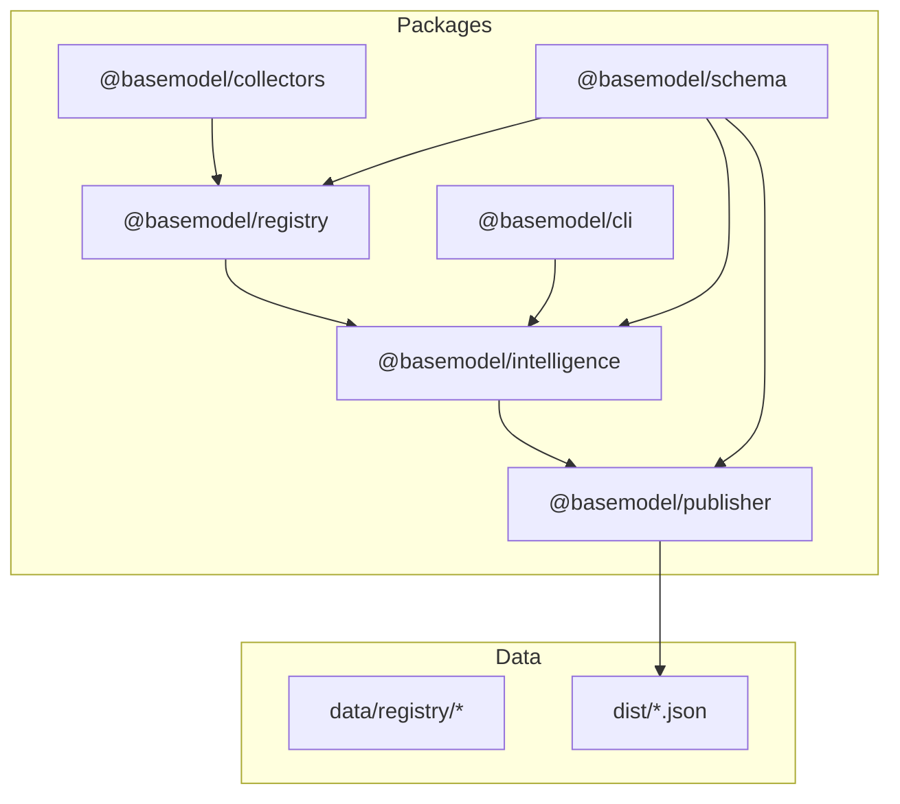
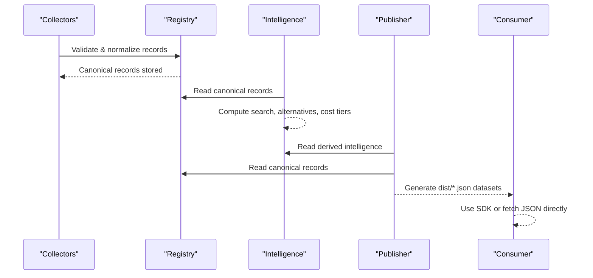
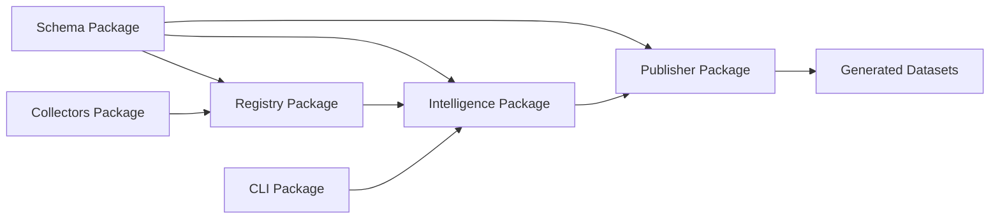

# API Reference

<cite>
**Referenced Files in This Document**
- [README.md](file://README.md)
- [package.json](file://package.json)
- [05_Data_Model.md](file://docs/05_Data_Model.md)
- [07_Developer_Access.md](file://docs/07_Developer_Access.md)
- [03_Architecture.md](file://docs/03_Architecture.md)
- [04_Pipeline.md](file://docs/04_Pipeline.md)
- [meta.json](file://data/registry/meta.json)
</cite>

## Table of Contents
1. [Introduction](#introduction)
2. [Project Structure](#project-structure)
3. [Core Components](#core-components)
4. [Architecture Overview](#architecture-overview)
5. [Detailed Component Analysis](#detailed-component-analysis)
6. [Dependency Analysis](#dependency-analysis)
7. [Performance Considerations](#performance-considerations)
8. [Troubleshooting Guide](#troubleshooting-guide)
9. [Conclusion](#conclusion)
10. [Appendices](#appendices)

## Introduction
BaseModel is an open-source AI model intelligence platform that discovers, validates, normalizes, stores, analyzes, and publishes structured knowledge about AI models. It is not an inference runtime or end-user application; it is the data layer consumed by SDKs, CLIs, agents, dashboards, and other systems. The repository provides canonical schemas, registry storage, collectors, intelligence computations, and a publisher that generates static JSON datasets for consumption.

This document provides:
- A CLI command reference for querying intelligence
- Detailed specifications for all public JSON dataset schemas
- Guidance for programmatic consumption via SDK bindings and direct JSON access
- Practical examples, error handling strategies, and best practices

**Section sources**
- [README.md:1-61](file://README.md#L1-L61)
- [03_Architecture.md:1-77](file://docs/03_Architecture.md#L1-L77)

## Project Structure
The repository is organized into packages and data directories:
- packages/schema: Canonical Zod schemas and TypeScript types
- packages/registry: Registry storage, validation, and merge utilities
- packages/collectors: Provider and gateway collectors
- packages/intelligence: Derived rankings, search, and recommendations
- packages/publisher: Dataset generation for dist/
- packages/cli: Command-line interface for querying intelligence
- data/registry: Canonical records (providers, models, capabilities, licenses, apis, benchmarks, pricing)
- dist/: Generated datasets (providers.json, models.json, capabilities.json, licenses.json, apis.json, benchmarks.json, pricing.json, intelligence.json)

**Diagram sources**
- [03_Architecture.md:39-44](file://docs/03_Architecture.md#L39-L44)
- [04_Pipeline.md:64-84](file://docs/04_Pipeline.md#L64-L84)

**Section sources**
- [README.md:11-30](file://README.md#L11-L30)
- [03_Architecture.md:39-44](file://docs/03_Architecture.md#L39-L44)

## Core Components
- Schema: Defines canonical types and validation rules used across the system
- Registry: Stores canonical records after validation and normalization
- Collectors: Discover and collect provider/gateway data
- Intelligence: Derives search, alternatives, and cost information from registry data
- Publisher: Generates public JSON datasets to dist/
- CLI: Exposes intelligence queries from the terminal

Key responsibilities:
- Discovery and collection of external model data
- Validation and normalization against canonical schemas
- Storing canonical records in the registry
- Computing derived intelligence (search, alternatives, cost tiers)
- Publishing stable JSON datasets for consumers

**Section sources**
- [03_Architecture.md:1-77](file://docs/03_Architecture.md#L1-L77)
- [04_Pipeline.md:16-84](file://docs/04_Pipeline.md#L16-L84)

## Architecture Overview
BaseModel follows a layered architecture:
- Discovery Layer: Finds sources (provider sites, catalogs, documentation, benchmarks)
- Registry Layer: Stores canonical records (providers, models, capabilities, pricing, licenses, APIs, benchmarks)
- Intelligence Layer: Computes derived insights without modifying canonical records
- Publishing Layer: Converts registry and intelligence data into public datasets

**Diagram sources**
- [03_Architecture.md:1-77](file://docs/03_Architecture.md#L1-L77)
- [04_Pipeline.md:16-84](file://docs/04_Pipeline.md#L16-L84)

## Detailed Component Analysis

### CLI Command Reference
The CLI exposes the same intelligence logic from the terminal. Supported commands and filters include:

Commands:
- basemodel search: Search models with filters
- basemodel info: Get details for a specific model
- basemodel alternatives: Find alternative models for a given model

Search filters:
- --provider: Filter by provider id (e.g., openai)
- --modality: Filter by modality (e.g., image, text)
- --flag: Filter by capability flag (e.g., vision_support)
- --min-context: Minimum context window size

Output formats:
- Human-readable console output
- Structured JSON when piped or redirected

Authentication:
- No authentication required for CLI usage

Rate limiting:
- CLI uses local intelligence engine; no external rate limits apply during query

Error handling:
- Invalid inputs produce clear error messages
- Missing model identifiers return informative errors

Examples:
- basemodel search --provider openai --modality image --flag vision_support --min-context 100000
- basemodel info openai/gpt-4o
- basemodel alternatives anthropic/claude-3-5-sonnet

**Section sources**
- [07_Developer_Access.md:63-79](file://docs/07_Developer_Access.md#L63-L79)

### JSON Dataset Schemas
All generated datasets are written to dist/ and include metadata fields such as schema_version, source_revision, and count. Each file represents a specific entity type:

#### providers.json
Represents organizations that develop, publish, host, or distribute AI models.

Fields:
- provider_id: Unique kebab-case identifier
- name: Display name
- organization: Organization name
- website: Optional official website URL
- documentation: Optional documentation URL
- country: Optional country code
- description: Optional description
- provider_type: Type classification
- status: Lifecycle status

#### models.json
Represents uniquely identifiable AI models with their capabilities and attributes.

Fields:
- model_id: Composite identifier in format {provider_id}/{model-slug}
- provider_id: Associated provider
- name: Model display name
- family: Optional model family
- version: Optional version string
- release_date: Optional release date
- description: Optional description
- architecture: Optional architecture details
- parameter_size: Optional parameter count
- context_window: Optional context window size
- modality: Primary modality (text, image, audio, etc.)
- open_weight: Boolean indicating open weights
- reasoning_support: Boolean for reasoning capabilities
- function_calling: Boolean for function calling support
- structured_output: Boolean for structured output support
- vision_support: Boolean for vision capabilities
- audio_support: Boolean for audio capabilities
- image_generation: Boolean for image generation
- embedding_support: Boolean for embeddings
- capability_ids: Array of capability identifiers
- license_id: Optional license reference
- status: Lifecycle status

#### capabilities.json
Defines normalized capabilities shared across many models.

Fields:
- capability_id: Unique capability identifier
- name: Capability name
- description: Optional capability description

#### licenses.json
Represents legal terms governing model usage.

Fields:
- license_id: Unique license identifier
- name: License name
- commercial_use: Boolean for commercial usage rights
- redistribution: Boolean for redistribution rights
- modification: Boolean for modification rights
- source_available: Boolean for source code availability
- url: Optional license URL

#### apis.json
Describes methods for accessing models through various protocols.

Fields:
- api_id: Unique API identifier
- model_id: Associated model
- protocol: Access protocol (e.g., REST, gRPC)
- endpoint: Optional endpoint URL
- compatibility: Optional compatibility information
- authentication: Authentication requirements
- rate_limits: Optional rate limit specifications

#### benchmarks.json
Contains evaluation results for models.

Fields:
- benchmark_id: Unique benchmark identifier
- model_id: Associated model
- benchmark_name: Name of the benchmark
- version: Optional benchmark version
- score: Numerical score
- score_raw: Optional raw score data
- evaluation_date: Optional evaluation date
- source: Benchmark source

#### pricing.json
Represents pricing information for models.

Fields:
- pricing_id: Unique pricing identifier
- model_id: Associated model
- pricing_type: Type of pricing (per token, per request, etc.)
- currency: Optional currency code
- unit: Optional pricing unit
- value: Pricing value
- notes: Optional pricing notes

#### intelligence.json
Derived data including cost efficiency, alternatives, and search optimization.

Fields:
- model_id: Associated model
- cost_tier: Cost tier classification (free, budget, balanced, premium)
- alternatives: Array of alternative model suggestions
- search_index: Optimized data for search operations
- blend: Blended cost calculation parameters

Metadata fields (all files):
- schema_version: Version of the schema used
- source_revision: Git revision of source data
- count: Number of records in the file

**Section sources**
- [05_Data_Model.md:25-151](file://docs/05_Data_Model.md#L25-L151)
- [04_Pipeline.md:64-84](file://docs/04_Pipeline.md#L64-L84)

### SDK Bindings and Programmatic Consumption
BaseModel provides npm packages for programmatic access:

Available packages:
- @basemodel/schema: Canonical schemas and TypeScript types
- @basemodel/registry: Reading and writing canonical registry data
- @basemodel/intelligence: Search, alternatives, and cost heuristics
- @basemodel/publisher: Generating public JSON datasets

Installation:
npm install @basemodel/schema @basemodel/intelligence

Schema validation example:
- Import ModelSchema and Model types
- Parse raw data using safeParse
- Handle success/failure cases

Intelligence Engine usage:
- Initialize IntelligenceEngine
- Load registry data from Node.js or hydrate from snapshots
- Perform searches with filters (providerIds, modalities, flags, minContextWindow)
- Calculate cost efficiency for specific models

Browser environment hydration:
- Manually hydrate engine with loaded data objects
- Supports environments without filesystem access

Direct JSON consumption:
- Fetch static datasets from repository or mirrors
- Parse JSON responses and iterate over records
- Example Python implementation provided

**Section sources**
- [07_Developer_Access.md:6-62](file://docs/07_Developer_Access.md#L6-L62)
- [07_Developer_Access.md:80-103](file://docs/07_Developer_Access.md#L80-L103)

### Gateway Plugins and Security
Gateway plugins enable collection from various providers through isolated workers with restricted secret access.

Key aspects:
- Plugin path validation ensures security boundaries
- Isolated worker execution prevents cross-plugin interference
- Secret registry management controls access to sensitive credentials
- Automatic injection of only registered secrets for each gateway

Security considerations:
- Never hardcode secrets in plugin code
- Register new gateways with appropriate secrets
- Follow established plugin patterns for consistency

**Section sources**
- [07_Developer_Access.md:105-112](file://docs/07_Developer_Access.md#L105-L112)

## Dependency Analysis
The system follows clear dependency patterns between components:

**Diagram sources**
- [03_Architecture.md:39-44](file://docs/03_Architecture.md#L39-L44)

Component relationships:
- Schema package provides foundational types used across all components
- Collectors depend on Schema for validation and Registry for storage
- Intelligence depends on Registry for canonical data and Schema for type safety
- Publisher depends on both Registry and Intelligence for complete dataset generation
- CLI depends on Intelligence for query functionality

**Section sources**
- [03_Architecture.md:39-44](file://docs/03_Architecture.md#L39-L44)

## Performance Considerations
- Registry operations are optimized for read-heavy workloads typical of consumer applications
- Intelligence computations are designed to be efficient for search and recommendation queries
- Generated datasets are cached at distribution points for optimal consumer performance
- Collector pipeline includes fallback mechanisms for external dependencies
- Batch processing is used for large-scale data transformations

[No sources needed since this section provides general guidance]

## Troubleshooting Guide
Common issues and solutions:

Collection failures:
- External API rate limits trigger automatic fallbacks
- Authentication errors require proper secret configuration
- Network timeouts are handled with retry logic

Validation errors:
- Malformed records are isolated and logged
- Schema violations prevent invalid data from entering the registry
- Identifier format validation ensures consistency

Pricing enrichment failures:
- Multiple pricing sources provide redundancy
- Failed sources don't block successful ones
- Fatal errors halt the entire process for CI safety

Benchmark data issues:
- Hugging Face tokens can improve rate limits
- Mirror fallback ensures continuous operation
- Graceful degradation maintains data availability

**Section sources**
- [04_Pipeline.md:86-91](file://docs/04_Pipeline.md#L86-L91)
- [meta.json:1-18](file://data/registry/meta.json#L1-L18)

## Conclusion
BaseModel provides a comprehensive foundation for AI model intelligence through its structured approach to discovery, validation, normalization, and publication. The system offers multiple consumption patterns including SDK bindings, CLI tools, and direct JSON access, making it suitable for diverse integration scenarios. The modular architecture ensures stability while allowing for extensibility and growth.

[No sources needed since this section summarizes without analyzing specific files]

## Appendices

### Development Commands
Repository-level scripts:
- pnpm install: Install dependencies
- pnpm build: Build all packages
- pnpm test: Run tests
- pnpm lint: Code quality checks
- pnpm generate: Generate datasets

Package-specific commands:
- pnpm --filter @basemodel/collectors run collect: Run collectors
- pnpm --filter @basemodel/collectors run verify: Verify gateway plugins

**Section sources**
- [README.md:42-57](file://README.md#L42-L57)
- [package.json:17-25](file://package.json#L17-L25)

### Data Governance and Freshness
- Records carry updated_at timestamps for freshness tracking
- Generated datasets include generated_at timestamps
- Model lifecycle states manage deprecation and discontinuation
- Provenance tracking shows data sources for transparency

**Section sources**
- [04_Pipeline.md:163-204](file://docs/04_Pipeline.md#L163-L204)