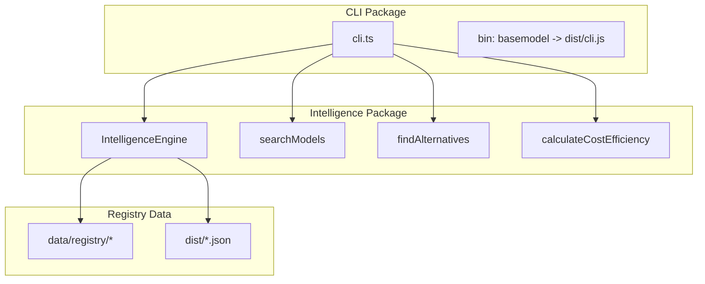
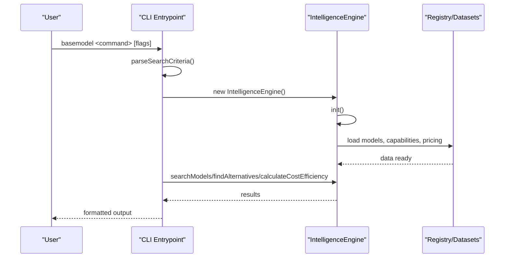
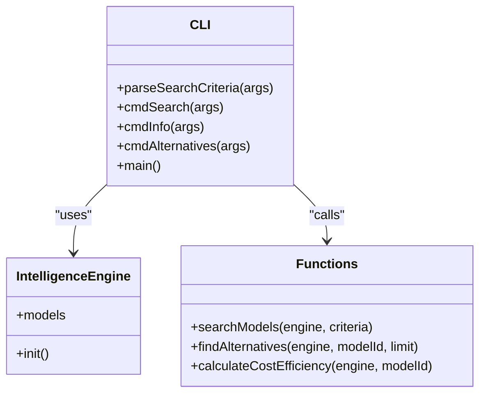

# CLI Commands

<cite>
**Referenced Files in This Document**
- [cli.ts](file://packages/cli/src/cli.ts)
- [package.json](file://packages/cli/package.json)
- [README.md](file://README.md)
</cite>

## Table of Contents
1. [Introduction](#introduction)
2. [Project Structure](#project-structure)
3. [Core Components](#core-components)
4. [Architecture Overview](#architecture-overview)
5. [Detailed Component Analysis](#detailed-component-analysis)
6. [Dependency Analysis](#dependency-analysis)
7. [Performance Considerations](#performance-considerations)
8. [Troubleshooting Guide](#troubleshooting-guide)
9. [Conclusion](#conclusion)
10. [Appendices](#appendices)

## Introduction
This document provides comprehensive command-line interface (CLI) documentation for BaseModel’s CLI. It covers all available commands, their syntax, parameters, flags, environment variables, output formats, and practical examples. The CLI enables model queries, registry operations via the intelligence layer, collector execution through related packages, and intelligence generation workflows. It also includes guidance on scripting, error handling, exit codes, and troubleshooting common issues.

## Project Structure
The CLI is implemented as a Node.js executable that delegates to the @basemodel/intelligence package for search, recommendations, and cost calculations. The repository organizes functionality into packages: schema, registry, collectors, intelligence, publisher, and cli. Generated datasets are written to dist/ and consumed by the CLI at runtime.

**Diagram sources**
- [cli.ts](file://packages/cli/src/cli.ts)
- [package.json](file://packages/cli/package.json)
- [README.md](file://README.md)

**Section sources**
- [README.md](file://README.md)
- [package.json](file://packages/cli/package.json)

## Core Components
- Command entrypoint: The CLI exposes three commands: search, info, and alternatives.
- Intelligence engine: Initializes an engine that loads registry data and powers search, alternatives, and cost efficiency calculations.
- Search criteria parsing: Flags are parsed into structured criteria used by the intelligence layer.
- Output formatting: Human-friendly console output with color-coded tiers and capability flags.

Key responsibilities:
- Parse CLI arguments into search criteria.
- Initialize the intelligence engine and load models.
- Execute search, info, and alternatives commands.
- Format and print results to stdout or stderr.

**Section sources**
- [cli.ts](file://packages/cli/src/cli.ts)

## Architecture Overview
The CLI follows a simple flow: parse command and flags, initialize the intelligence engine, perform the requested operation, and print results. The intelligence engine reads from the registry and generated datasets to provide model information, capabilities, and pricing.

**Diagram sources**
- [cli.ts](file://packages/cli/src/cli.ts)

## Detailed Component Analysis

### Command: search
Purpose: Search models by provider, modality, flags, and minimum context window.

Syntax:
- basemodel search [--provider <ids>] [--modality <types>] [--flag <capabilities>] [--min-context <tokens>]

Parameters and flags:
- --provider: Comma-separated list of provider IDs.
- --modality: Comma-separated list of modalities (e.g., text, image, audio).
- --flag: Comma-separated list of capability flags (e.g., vision_support, function_calling, reasoning_support).
- --min-context: Minimum context window size in tokens.

Environment variables: None required by the CLI itself; the intelligence engine may rely on registry data availability.

Output format:
- Header line indicating number of results.
- For each model:
  - Model ID (highlighted).
  - Name, status.
  - Cost tier and blended cost per million tokens when available.
  - Flags such as open-weight, reasoning, function-calling, vision.

Examples:
- Query models by provider: basemodel search --provider openai,anthropic
- Filter by modality and flag: basemodel search --modality image,text --flag vision_support,function_calling
- Set minimum context window: basemodel search --min-context 128000

Exit codes:
- 0 on success.
- Non-zero if initialization fails or unexpected errors occur.

Notes:
- If no models match, prints a message indicating no results found.

**Section sources**
- [cli.ts](file://packages/cli/src/cli.ts)

### Command: info
Purpose: Show detailed information for a specific model by its model ID.

Syntax:
- basemodel info <model-id>

Parameters:
- model-id: Required positional argument identifying the model (e.g., openai/gpt-4o).

Output format:
- Model header with ID and name.
- Provider, status, modalities, context window, release date (if present).
- Capabilities section listing open weight, reasoning, function calling, structured output, vision, audio with checkmarks or dimmed indicators.
- Pricing section showing tier and input/output/blended costs per million tokens when available.

Examples:
- basemodel info openai/gpt-4o

Exit codes:
- 0 on success.
- 1 if model-id is missing or not found.

Error handling:
- Missing model-id prints usage and exits with code 1.
- Unknown model prints “Model not found” and exits with code 1.

**Section sources**
- [cli.ts](file://packages/cli/src/cli.ts)

### Command: alternatives
Purpose: List alternative models for a given model based on similarity and suitability.

Syntax:
- basemodel alternatives <model-id>

Parameters:
- model-id: Required positional argument identifying the model.

Output format:
- Header indicating alternatives for the specified model.
- For each alternative:
  - Model ID.
  - Reason for recommendation.
  - Cost tier.
  - Context window (if available).

Examples:
- basemodel alternatives openai/gpt-4o

Exit codes:
- 0 on success.
- 1 if model-id is missing or not found.

Error handling:
- Missing model-id prints usage and exits with code 1.
- Unknown model prints “Model not found” and exits with code 1.

**Section sources**
- [cli.ts](file://packages/cli/src/cli.ts)

### Command: help
Purpose: Display usage information and examples.

Syntax:
- basemodel (no command) or basemodel --help (if supported by wrapper)

Output format:
- Usage description, available commands, and example invocations.

Exit codes:
- 0 on success.

**Section sources**
- [cli.ts](file://packages/cli/src/cli.ts)

## Dependency Analysis
The CLI depends on the @basemodel/intelligence package for core functionality:
- IntelligenceEngine: Initializes and manages model data.
- searchModels: Executes filtered searches using criteria.
- findAlternatives: Generates alternative model suggestions.
- calculateCostEfficiency: Computes cost metrics and tiers.

**Diagram sources**
- [cli.ts](file://packages/cli/src/cli.ts)

**Section sources**
- [cli.ts](file://packages/cli/src/cli.ts)

## Performance Considerations
- Initialization overhead: The intelligence engine initializes once per command invocation. For frequent use in scripts, consider batching operations or reusing processes where possible.
- Data loading: Registry and dataset files are loaded during engine.init(). Ensure sufficient disk I/O performance and avoid running on slow storage.
- Filtering complexity: Large result sets can increase output time. Use precise filters (--provider, --modality, --flag, --min-context) to reduce processing.
- Cost calculation: Blended cost computation runs per model; minimize unnecessary calls by limiting result sets.

[No sources needed since this section provides general guidance]

## Troubleshooting Guide
Common issues and resolutions:
- No models found: Verify filter criteria and ensure registry data is up-to-date. Rebuild datasets if necessary.
- Model not found: Confirm the model-id format (provider/model-name) and check spelling.
- Exit code 1: Indicates missing arguments or unknown model. Review usage and inputs.
- Error messages: Unexpected errors print to stderr and exit with non-zero code. Inspect logs and ensure dependencies are installed.

Scripting tips:
- Capture stdout/stderr separately for parsing outputs and error handling.
- Use exit codes to determine success/failure in automation pipelines.
- Avoid interactive prompts; the CLI is designed for non-interactive use.

**Section sources**
- [cli.ts](file://packages/cli/src/cli.ts)

## Conclusion
The BaseModel CLI provides a concise and powerful interface for querying AI models, retrieving detailed information, and discovering alternatives. By leveraging the intelligence layer and registry data, it supports efficient filtering and cost analysis. With clear exit codes and structured output, it integrates well into automated workflows and scripting environments.

[No sources needed since this section summarizes without analyzing specific files]

## Appendices

### Environment Variables
- No explicit environment variables are required by the CLI itself. Ensure registry data is present and accessible for the intelligence engine to load.

### Exit Codes Summary
- 0: Success.
- 1: Errors such as missing arguments, unknown model, or runtime exceptions.

### Practical Examples
- Query by provider and modality: basemodel search --provider openai --modality text,image
- Filter by capabilities: basemodel search --flag function_calling,vision_support
- Get model details: basemodel info anthropic/claude-3-5-sonnet
- Find alternatives: basemodel alternatives google/gemini-2.5-pro

[No sources needed since this section provides general guidance]