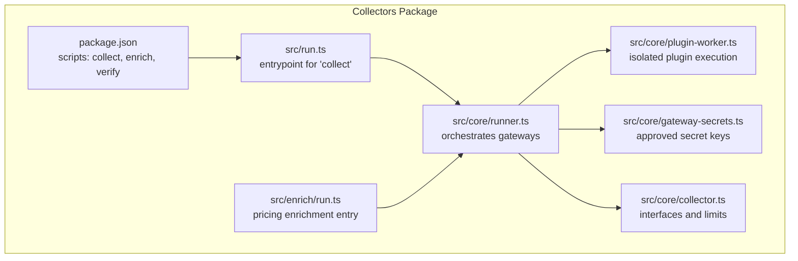
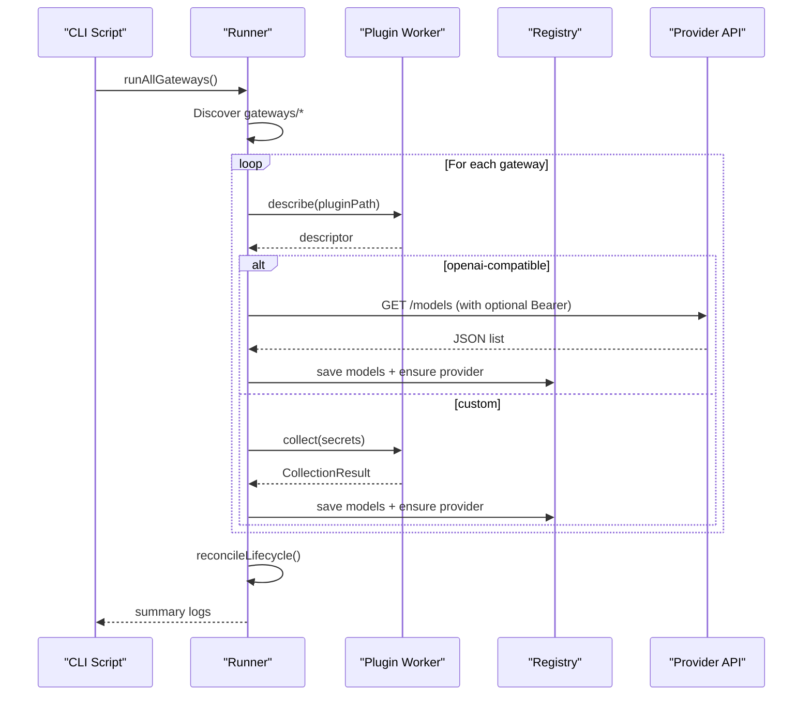
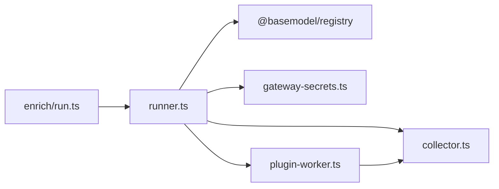

# Collector Commands

<cite>
**Referenced Files in This Document**
- [README.md](file://README.md)
- [package.json](file://packages/collectors/package.json)
- [run.ts](file://packages/collectors/src/run.ts)
- [collector.ts](file://packages/collectors/src/core/collector.ts)
- [runner.ts](file://packages/collectors/src/core/runner.ts)
- [gateway-secrets.ts](file://packages/collectors/src/core/gateway-secrets.ts)
- [plugin-worker.ts](file://packages/collectors/src/core/plugin-worker.ts)
- [enrich-run.ts](file://packages/collectors/src/enrich/run.ts)
</cite>

## Table of Contents
1. [Introduction](#introduction)
2. [Project Structure](#project-structure)
3. [Core Components](#core-components)
4. [Architecture Overview](#architecture-overview)
5. [Detailed Component Analysis](#detailed-component-analysis)
6. [Dependency Analysis](#dependency-analysis)
7. [Performance Considerations](#performance-considerations)
8. [Troubleshooting Guide](#troubleshooting-guide)
9. [Conclusion](#conclusion)

## Introduction
This document explains BaseModel’s collector commands for executing data collectors from various providers, scheduling automated collection runs, and monitoring collection status. It covers:
- Running individual collectors and batch execution
- Configuring collection parameters and authentication
- Setting up automated schedules
- Monitoring progress, output formats, and error recovery

BaseModel’s collectors discover, validate, normalize, store, analyze, and publish structured knowledge about AI models. The collectors package provides the pipeline that discovers gateway plugins, executes them safely, persists results to the registry, and enriches model records with pricing information.

**Section sources**
- [README.md:10-30](file://README.md#L10-L30)

## Project Structure
The collectors subsystem lives under packages/collectors. Key entry points and scripts are defined in the package configuration and source files:
- Package scripts expose commands like collect, enrich, verify, and benchmark collection.
- The main runner orchestrates discovery and execution of gateway plugins.
- A separate enrichment step augments collected models with pricing metadata.

**Diagram sources**
- [package.json:15-24](file://packages/collectors/package.json#L15-L24)
- [run.ts:1-17](file://packages/collectors/src/run.ts#L1-L17)
- [runner.ts:428-475](file://packages/collectors/src/core/runner.ts#L428-L475)
- [plugin-worker.ts:1-113](file://packages/collectors/src/core/plugin-worker.ts#L1-L113)
- [gateway-secrets.ts:1-27](file://packages/collectors/src/core/gateway-secrets.ts#L1-L27)
- [collector.ts:1-89](file://packages/collectors/src/core/collector.ts#L1-L89)
- [enrich-run.ts:1-25](file://packages/collectors/src/enrich/run.ts#L1-L25)

**Section sources**
- [README.md:53-57](file://README.md#L53-L57)
- [package.json:15-24](file://packages/collectors/package.json#L15-L24)

## Core Components
- GatewayPlugin types define two supported plugin modes:
  - OpenAI-compatible: declarative metadata pointing to a /models endpoint and an approved secret key name.
  - Custom: a collect() function executed in an isolated worker process with only approved secrets.
- CollectionResult describes the normalized output per provider, including models and errors.
- Limits enforce safety: maximum models per plugin and maximum response size.
- Secret management is explicit: only whitelisted environment variables are injected into workers.

Key responsibilities:
- Discovery and orchestration of gateway plugins
- Safe execution via child_process.fork() with strict isolation
- Normalization and persistence of model records
- Lifecycle reconciliation (discontinuing models no longer listed)
- Optional pricing enrichment

**Section sources**
- [collector.ts:1-89](file://packages/collectors/src/core/collector.ts#L1-L89)
- [runner.ts:167-238](file://packages/collectors/src/core/runner.ts#L167-L238)
- [plugin-worker.ts:32-46](file://packages/collectors/src/core/plugin-worker.ts#L32-L46)
- [gateway-secrets.ts:1-27](file://packages/collectors/src/core/gateway-secrets.ts#L1-L27)

## Architecture Overview
The collector pipeline follows a clear flow:
- Entry script initializes the pipeline and invokes the runner.
- Runner discovers gateway plugins in the gateways directory.
- For each plugin:
  - Describe phase loads minimal metadata without exposing secrets.
  - Execute phase either calls an OpenAI-compatible /models endpoint or runs a custom collect() in an isolated worker.
- Results are persisted to the registry; providers are auto-registered if needed.
- Reconciliation marks models as discontinued when absent from successful collections.
- Enrichment optionally adds pricing data using configured catalogs.

**Diagram sources**
- [run.ts:1-17](file://packages/collectors/src/run.ts#L1-L17)
- [runner.ts:428-475](file://packages/collectors/src/core/runner.ts#L428-L475)
- [plugin-worker.ts:87-113](file://packages/collectors/src/core/plugin-worker.ts#L87-L113)

## Detailed Component Analysis

### Command Reference and Usage
- Collect all gateways:
  - Use the package script to run the collector pipeline.
- Enrich models with pricing:
  - Use the enrichment script to fetch pricing catalogs and augment models.
- Verify a specific gateway implementation:
  - Use the verification script to validate a single gateway file.

Notes:
- These commands are defined in the collectors package scripts and invoked via pnpm filters.
- The collect command triggers the full pipeline; enrich runs pricing augmentation; verify validates a single gateway.

**Section sources**
- [README.md:53-57](file://README.md#L53-L57)
- [package.json:15-24](file://packages/collectors/package.json#L15-L24)

### Running Individual Collectors vs Batch Execution
- Batch execution:
  - The runner scans the gateways directory and executes all discovered plugins concurrently using Promise.allSettled.
  - Each plugin’s outcome is tracked and logged.
- Individual execution:
  - Verification targets a single gateway file for validation.
  - Custom collectors can be tested by invoking the verification script against their path.

Behavior highlights:
- Concurrency improves throughput while isolating failures per plugin.
- Errors do not stop other collectors; outcomes are aggregated.

**Section sources**
- [runner.ts:428-475](file://packages/collectors/src/core/runner.ts#L428-L475)
- [package.json:19-20](file://packages/collectors/package.json#L19-L20)

### Configuring Collection Parameters and Authentication
- OpenAI-compatible gateways:
  - Provide baseUrl and secretKeyName in the plugin declaration.
  - Authorization header is set to Bearer token when the secret is present.
- Custom gateways:
  - Implement collect(secrets) where secrets contains only approved keys for the gateway.
- Approved secrets:
  - Only whitelisted environment variables are injected into workers.
  - Adding new secrets requires core changes to the whitelist.

Security considerations:
- Workers are isolated processes with limited environment exposure.
- Responses are validated for size and content to prevent secret leakage.

**Section sources**
- [collector.ts:55-80](file://packages/collectors/src/core/collector.ts#L55-L80)
- [runner.ts:167-214](file://packages/collectors/src/core/runner.ts#L167-L214)
- [gateway-secrets.ts:1-27](file://packages/collectors/src/core/gateway-secrets.ts#L1-L27)
- [plugin-worker.ts:85-106](file://packages/collectors/src/core/plugin-worker.ts#L85-L106)

### Output Formats and Progress Tracking
- Per-provider result structure includes:
  - provider_id
  - models array of partial Model records
  - errors array of messages
- Console logging during execution:
  - Number of models fetched per gateway
  - New/updated/failed counts after merging into the registry
  - Warnings for parsing errors or HTTP issues
- Lifecycle reconciliation:
  - Models missing from successful collections are marked discontinued.

Progress visibility:
- Logs indicate success/failure per gateway and aggregate statistics.
- Errors are surfaced without crashing the entire pipeline.

**Section sources**
- [collector.ts:3-23](file://packages/collectors/src/core/collector.ts#L3-L23)
- [runner.ts:365-397](file://packages/collectors/src/core/runner.ts#L365-L397)
- [runner.ts:410-426](file://packages/collectors/src/core/runner.ts#L410-L426)

### Error Handling and Recovery Mechanisms
- HTTP errors include contextual hints based on status codes.
- Response parsing failures add non-fatal errors to the result.
- Plugin timeouts terminate workers and report errors.
- Secret validation ensures no unauthorized keys are used.
- Reconciliation avoids deprecating models when collections fail.

Recovery strategies:
- Retries with backoff for transient network issues.
- Non-blocking failure handling allows other collectors to continue.
- Discontinued marking only occurs after successful catalog fetches.

**Section sources**
- [runner.ts:42-48](file://packages/collectors/src/core/runner.ts#L42-L48)
- [runner.ts:167-214](file://packages/collectors/src/core/runner.ts#L167-L214)
- [runner.ts:136-154](file://packages/collectors/src/core/runner.ts#L136-L154)
- [runner.ts:410-426](file://packages/collectors/src/core/runner.ts#L410-L426)

### Scheduling Automated Collection Runs
- Automation approaches:
  - Use system schedulers (cron, systemd timers, Windows Task Scheduler) to invoke the collect script at desired intervals.
  - Integrate with CI/CD pipelines to run collectors on schedule or on repository changes.
- Best practices:
  - Ensure environment variables for secrets are available in the scheduled context.
  - Monitor logs and exit codes to detect failures.
  - Periodically run the enrichment step to update pricing data.

[No sources needed since this section provides general guidance]

### Pricing Enrichment
- The enrichment step fetches pricing catalogs for gateways that declare a pricingSource.
- It updates models with input/output pricing and context window details when available.
- Summary indicates fatal failures (all primary sources unavailable) or warnings.

Usage:
- Invoke the enrichment script to augment the registry with pricing information.

**Section sources**
- [enrich-run.ts:1-25](file://packages/collectors/src/enrich/run.ts#L1-L25)
- [collector.ts:33-50](file://packages/collectors/src/core/collector.ts#L33-L50)

## Dependency Analysis
Collector components have clear dependencies:
- Runner depends on registry utilities for reading/writing models and providers.
- Worker isolates plugin execution and enforces security constraints.
- Secrets whitelist controls which environment variables are exposed to workers.
- Types and limits define contracts and safety bounds.

**Diagram sources**
- [runner.ts:1-23](file://packages/collectors/src/core/runner.ts#L1-L23)
- [plugin-worker.ts:1-13](file://packages/collectors/src/core/plugin-worker.ts#L1-L13)
- [collector.ts:1-11](file://packages/collectors/src/core/collector.ts#L1-L11)
- [enrich-run.ts:1-8](file://packages/collectors/src/enrich/run.ts#L1-L8)

**Section sources**
- [runner.ts:1-23](file://packages/collectors/src/core/runner.ts#L1-L23)
- [plugin-worker.ts:1-13](file://packages/collectors/src/core/plugin-worker.ts#L1-L13)

## Performance Considerations
- Concurrency:
  - Parallel execution of gateways maximizes throughput while containing failures.
- Timeouts:
  - Plugin workers are terminated after a fixed timeout to prevent hangs.
- Size limits:
  - Maximum models per plugin and maximum response bytes protect memory usage.
- Network resilience:
  - Retry logic handles transient failures gracefully.

Optimization tips:
- Prefer OpenAI-compatible gateways for simpler, faster collection paths.
- Limit the number of custom collectors to reduce worker overhead.
- Cache pricing catalogs if frequently accessed.

**Section sources**
- [runner.ts:136-154](file://packages/collectors/src/core/runner.ts#L136-L154)
- [collector.ts:9-11](file://packages/collectors/src/core/collector.ts#L9-L11)
- [plugin-worker.ts:32-46](file://packages/collectors/src/core/plugin-worker.ts#L32-L46)

## Troubleshooting Guide
Common issues and resolutions:
- Unauthorized or forbidden responses:
  - Verify API keys are valid and have required permissions.
- Rate limiting:
  - Backoff retries are applied; consider reducing frequency or upgrading quotas.
- Not found endpoints:
  - Confirm base URL and /models path for OpenAI-compatible gateways.
- Parsing errors:
  - Check upstream response schema compatibility.
- Plugin timeouts:
  - Investigate slow upstream APIs or heavy custom collectors.
- Missing secrets:
  - Ensure environment variables match the whitelist for the gateway.

Diagnostic steps:
- Review console logs for per-gateway summaries and error messages.
- Validate gateway declarations and secret names.
- Run verification against a single gateway to isolate issues.

**Section sources**
- [runner.ts:42-48](file://packages/collectors/src/core/runner.ts#L42-L48)
- [runner.ts:167-214](file://packages/collectors/src/core/runner.ts#L167-L214)
- [plugin-worker.ts:85-106](file://packages/collectors/src/core/plugin-worker.ts#L85-L106)

## Conclusion
BaseModel’s collector commands provide a robust, secure, and extensible pipeline for discovering and normalizing AI model data across multiple providers. With isolated plugin execution, strict secret management, and resilient error handling, the system supports both ad-hoc runs and automated schedules. Enrichment enhances model records with pricing information, enabling downstream intelligence and cost analysis.

[No sources needed since this section summarizes without analyzing specific files]