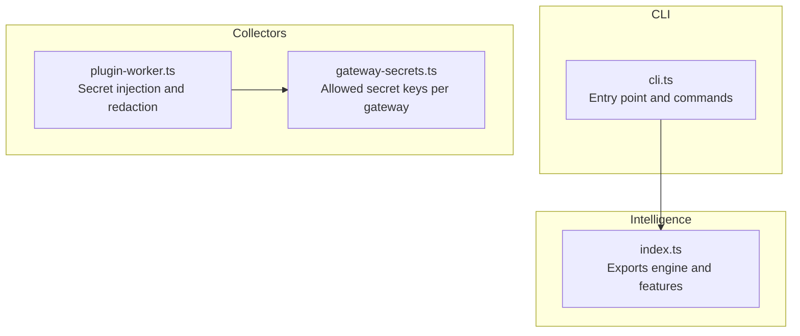
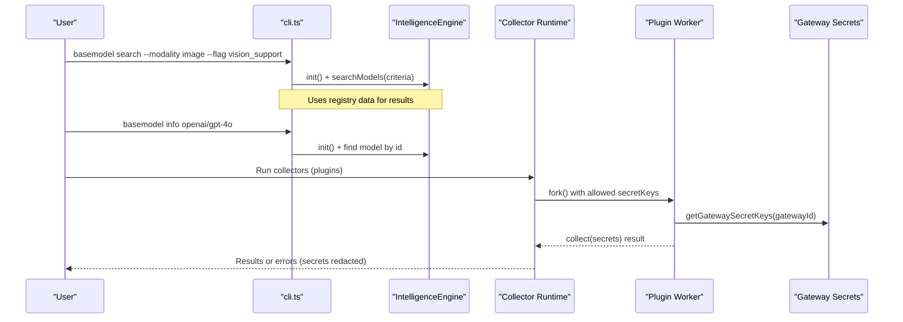
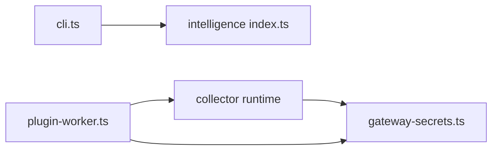

# Configuration Options

<cite>
**Referenced Files in This Document**
- [cli.ts](file://packages/cli/src/cli.ts)
- [gateway-secrets.ts](file://packages/collectors/src/core/gateway-secrets.ts)
- [plugin-worker.ts](file://packages/collectors/src/core/plugin-worker.ts)
- [e2e.test.ts](file://packages/collectors/src/__tests__/e2e.test.ts)
- [google.test.ts](file://packages/collectors/src/__tests__/google.test.ts)
- [index.ts](file://packages/intelligence/src/index.ts)
</cite>

## Table of Contents
1. [Introduction](#introduction)
2. [Project Structure](#project-structure)
3. [Core Components](#core-components)
4. [Architecture Overview](#architecture-overview)
5. [Detailed Component Analysis](#detailed-component-analysis)
6. [Dependency Analysis](#dependency-analysis)
7. [Performance Considerations](#performance-considerations)
8. [Troubleshooting Guide](#troubleshooting-guide)
9. [Conclusion](#conclusion)
10. [Appendices](#appendices)

## Introduction
This document explains how to configure the BaseModel CLI and its collector runtime for API keys, proxies, output formatting, logging levels, and global settings. It covers environment variables, configuration files, command-line flags, precedence rules, validation behavior, and common setup scenarios (development, production, multi-user, automation). The goal is to help you set up reliable, secure, and efficient configurations across different environments.

## Project Structure
BaseModel exposes a small CLI with commands for searching models, retrieving model info, and listing alternatives. Configuration primarily occurs via:
- Environment variables for secrets and provider credentials
- Command-line flags for search criteria
- Internal registry data for model metadata and capabilities

**Diagram sources**
- [cli.ts](file://packages/cli/src/cli.ts)
- [gateway-secrets.ts](file://packages/collectors/src/core/gateway-secrets.ts)
- [plugin-worker.ts](file://packages/collectors/src/core/plugin-worker.ts)
- [index.ts](file://packages/intelligence/src/index.ts)

**Section sources**
- [cli.ts](file://packages/cli/src/cli.ts)
- [index.ts](file://packages/intelligence/src/index.ts)

## Core Components
- CLI entrypoint and commands:
  - Commands: search, info, alternatives
  - Flags: --provider, --modality, --flag, --min-context
- Secret management:
  - Allowed secret keys are whitelisted per gateway
  - Secrets are injected into plugin workers only when explicitly requested
  - Errors redact secrets before being exposed

Key behaviors:
- Search flags parse into structured criteria used by the intelligence engine
- Gateway plugins receive only approved environment variables as secrets
- Error messages redact active secrets to prevent leaks

**Section sources**
- [cli.ts](file://packages/cli/src/cli.ts)
- [gateway-secrets.ts](file://packages/collectors/src/core/gateway-secrets.ts)
- [plugin-worker.ts](file://packages/collectors/src/core/plugin-worker.ts)

## Architecture Overview
The CLI invokes the intelligence engine to perform searches and retrieve model details. Collectors run custom gateway plugins in isolated worker processes that receive a strict subset of environment variables.

**Diagram sources**
- [cli.ts](file://packages/cli/src/cli.ts)
- [gateway-secrets.ts](file://packages/collectors/src/core/gateway-secrets.ts)
- [plugin-worker.ts](file://packages/collectors/src/core/plugin-worker.ts)

## Detailed Component Analysis

### CLI Commands and Flags
- Commands:
  - search: Returns models matching criteria
  - info: Shows details for a specific model ID
  - alternatives: Lists alternative models for a given model ID
- Flags for search:
  - --provider: Comma-separated provider IDs
  - --modality: Comma-separated modalities
  - --flag: Comma-separated capability flags
  - --min-context: Minimum context window size (integer)

Behavior:
- Unknown flags are ignored
- Missing required arguments produce usage guidance and exit codes
- Output is human-readable with colorized tiers and flags

**Section sources**
- [cli.ts](file://packages/cli/src/cli.ts)

### Environment Variables and Secrets
- Whitelisted secret keys per gateway are defined centrally
- Only these keys are injected into plugin workers
- Unapproved environment variables are not passed to plugins
- Tests demonstrate that secrets like OPENAI_API_KEY are allowed while others are blocked

Common secret keys include:
- OPENAI_API_KEY
- ANTHROPIC_API_KEY
- GOOGLE_AI_API_KEY
- GROQ_API_KEY
- MISTRAL_API_KEY
- LITELLM_BASE_URL, LITELLM_API_KEY
- And others per provider

Validation:
- If a required key is missing, collection fails with an error indicating the requirement
- Errors are redacted to avoid leaking secrets

**Section sources**
- [gateway-secrets.ts](file://packages/collectors/src/core/gateway-secrets.ts)
- [plugin-worker.ts](file://packages/collectors/src/core/plugin-worker.ts)
- [e2e.test.ts](file://packages/collectors/src/__tests__/e2e.test.ts)
- [google.test.ts](file://packages/collectors/src/__tests__/google.test.ts)

### Proxy Configuration
- No explicit proxy flags are present in the CLI source examined
- Proxies can be configured via standard Node.js HTTP(S) environment variables if supported by underlying HTTP clients
- For collectors/plugins, ensure any proxy settings are applied at the network layer used by the plugin implementation

Recommendation:
- Use environment variables recognized by your HTTP client library (for example, HTTPS_PROXY, http_proxy) where applicable
- Validate proxy connectivity outside the CLI if needed

[No sources needed since this section provides general guidance]

### Output Formats and Logging Levels
- Output format: Human-readable console text with colorized tiers and flags
- No JSON or machine-readable output flags were found in the CLI source examined
- Logging level: Not exposed via CLI flags; logs are printed directly to stdout/stderr

Recommendation:
- Capture CLI output programmatically by redirecting stdout/stderr
- Avoid relying on colors in automated pipelines; filter ANSI sequences if necessary

**Section sources**
- [cli.ts](file://packages/cli/src/cli.ts)

### Global Settings
- No global config file was identified in the CLI source examined
- Global behavior is controlled through:
  - Environment variables for secrets and provider credentials
  - Command-line flags for search criteria
  - Registry data for model metadata and capabilities

**Section sources**
- [cli.ts](file://packages/cli/src/cli.ts)

## Dependency Analysis
- CLI depends on the intelligence engine for model search and cost calculations
- Collectors depend on a central whitelist of allowed secret keys per gateway
- Plugin workers receive only approved secrets and redact them in error messages

**Diagram sources**
- [cli.ts](file://packages/cli/src/cli.ts)
- [index.ts](file://packages/intelligence/src/index.ts)
- [gateway-secrets.ts](file://packages/collectors/src/core/gateway-secrets.ts)
- [plugin-worker.ts](file://packages/collectors/src/core/plugin-worker.ts)

**Section sources**
- [cli.ts](file://packages/cli/src/cli.ts)
- [index.ts](file://packages/intelligence/src/index.ts)
- [gateway-secrets.ts](file://packages/collectors/src/core/gateway-secrets.ts)
- [plugin-worker.ts](file://packages/collectors/src/core/plugin-worker.ts)

## Performance Considerations
- Model search and info operations rely on local registry data loaded by the intelligence engine
- Keep registry data updated to minimize overhead during queries
- Avoid unnecessary reinitialization of the engine within tight loops
- For collectors, limit the number of concurrent plugin executions to balance throughput and resource usage

[No sources needed since this section provides general guidance]

## Troubleshooting Guide
Common issues and resolutions:
- Missing API key:
  - Ensure the required environment variable for the provider is set
  - Example: GOOGLE_AI_API_KEY must be present for Google AI integration
- Unauthorized secrets exposure:
  - Only whitelisted keys are injected into plugins; verify the correct key names
  - Check tests that assert unapproved secrets are not leaked
- Redacted error messages:
  - Secrets are intentionally redacted in error outputs; inspect logs securely to identify root causes
- Unknown flags:
  - CLI ignores unknown flags; confirm flag names and values

Steps:
- Verify environment variables exist and are correctly named
- Re-run commands with minimal flags to isolate issues
- Inspect collector logs for validation failures and redacted secrets

**Section sources**
- [google.test.ts](file://packages/collectors/src/__tests__/google.test.ts)
- [e2e.test.ts](file://packages/collectors/src/__tests__/e2e.test.ts)
- [plugin-worker.ts](file://packages/collectors/src/core/plugin-worker.ts)

## Conclusion
BaseModel’s CLI focuses on model discovery and information retrieval using local registry data. Configuration centers on environment variables for secrets and command-line flags for search criteria. Security is enforced by whitelisting allowed secrets per gateway and redacting sensitive values in errors. For advanced needs like proxies or machine-readable output, apply environment-level settings supported by underlying HTTP clients and capture CLI output programmatically.

[No sources needed since this section summarizes without analyzing specific files]

## Appendices

### Configuration Precedence
- Environment variables take effect at runtime for secrets and provider credentials
- Command-line flags override defaults for search criteria within a single invocation
- No global config file was identified; settings are applied via environment and flags

[No sources needed since this section provides general guidance]

### Validation Rules
- Required API keys must be present for providers used by collectors
- Unknown flags are ignored by the CLI parser
- Secrets are validated against a whitelist before injection into plugins

**Section sources**
- [gateway-secrets.ts](file://packages/collectors/src/core/gateway-secrets.ts)
- [cli.ts](file://packages/cli/src/cli.ts)

### Common Scenarios

- Development setup:
  - Set development-specific API keys in environment variables
  - Use minimal flags for quick searches
  - Enable verbose logging via external tools if needed

- Production setup:
  - Pin exact model IDs and provider keys
  - Restrict environment variables to only those required
  - Capture and forward logs securely

- Multi-user environments:
  - Each user sets their own environment variables for secrets
  - Avoid sharing secrets across users; use per-user profiles or secret managers

- Automation scripts:
  - Provide all required environment variables
  - Parse CLI output programmatically; ignore colors
  - Handle non-zero exit codes for failures

[No sources needed since this section provides general guidance]