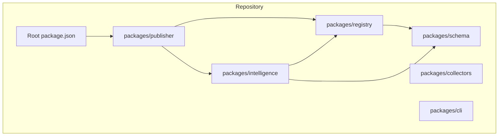
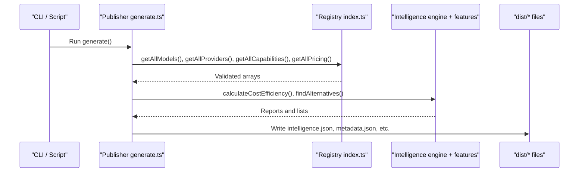
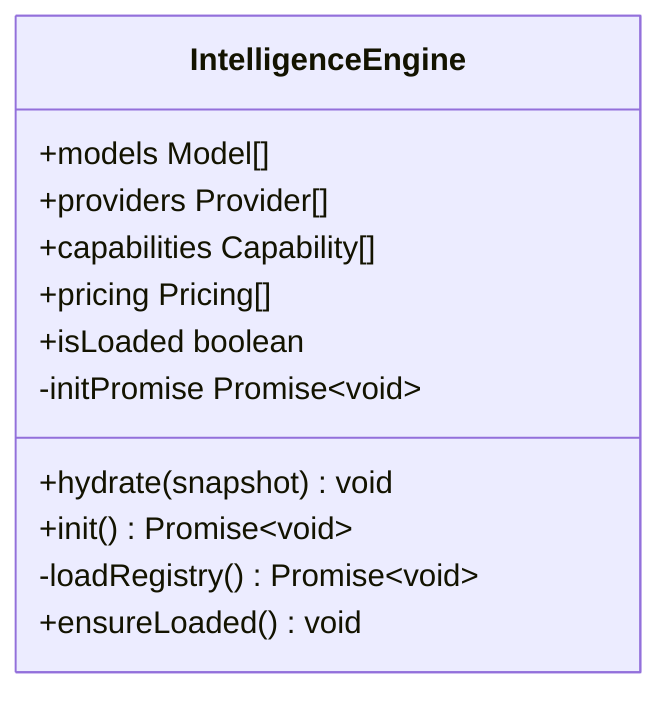
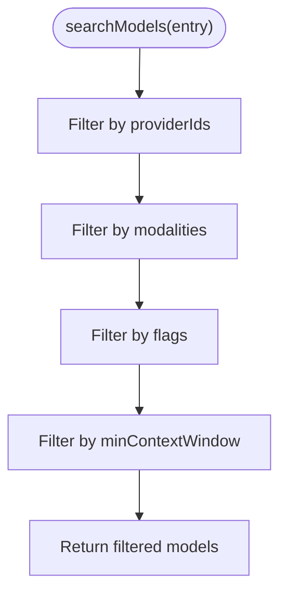
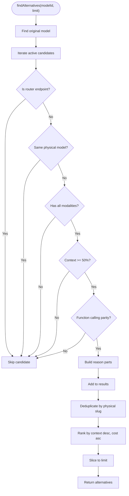
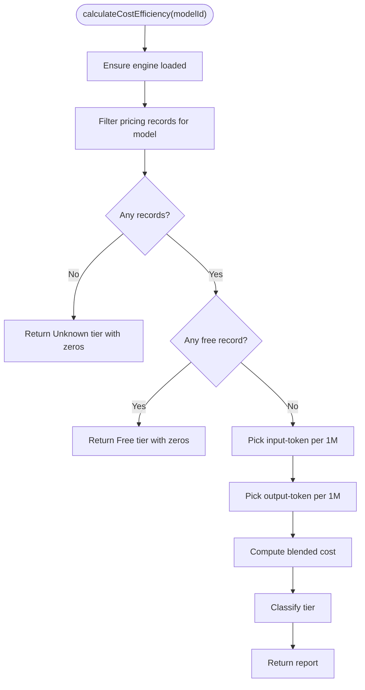
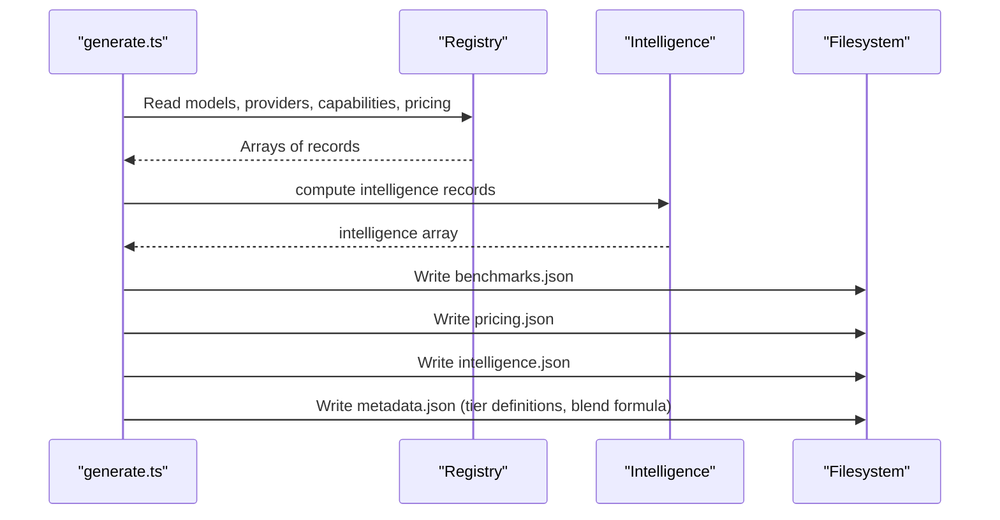
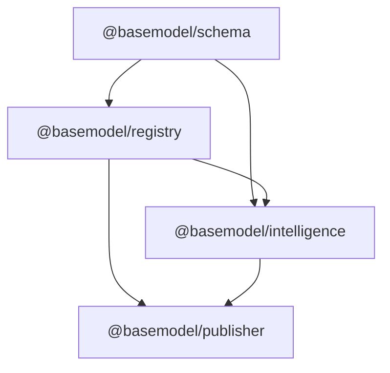

# Intelligence Commands

<cite>
**Referenced Files in This Document**
- [README.md](file://README.md)
- [packages/intelligence/src/index.ts](file://packages/intelligence/src/index.ts)
- [packages/intelligence/src/core/engine.ts](file://packages/intelligence/src/core/engine.ts)
- [packages/intelligence/src/features/search.ts](file://packages/intelligence/src/features/search.ts)
- [packages/intelligence/src/features/alternatives.ts](file://packages/intelligence/src/features/alternatives.ts)
- [packages/intelligence/src/features/cost.ts](file://packages/intelligence/src/features/cost.ts)
- [packages/publisher/src/generate.ts](file://packages/publisher/src/generate.ts)
- [packages/publisher/src/__tests__/generate.test.ts](file://packages/publisher/src/__tests__/generate.test.ts)
- [packages/publisher/src/__tests__/dataset-contract.test.ts](file://packages/publisher/src/__tests__/dataset-contract.test.ts)
- [packages/registry/src/index.ts](file://packages/registry/src/index.ts)
- [packages/registry/src/storage.ts](file://packages/registry/src/storage.ts)
- [package.json](file://package.json)
</cite>

## Table of Contents
1. [Introduction](#introduction)
2. [Project Structure](#project-structure)
3. [Core Components](#core-components)
4. [Architecture Overview](#architecture-overview)
5. [Detailed Component Analysis](#detailed-component-analysis)
6. [Dependency Analysis](#dependency-analysis)
7. [Performance Considerations](#performance-considerations)
8. [Troubleshooting Guide](#troubleshooting-guide)
9. [Conclusion](#conclusion)
10. [Appendices](#appendices)

## Introduction
This document explains the intelligence generation commands and capabilities exposed by BaseModel’s intelligence layer. It covers how to generate model rankings, recommendations (alternatives), cost analysis, and comparative reports using the intelligence features. It also documents output formats produced by the publisher, customization options for algorithms and parameters, and integration points with external tools via generated datasets.

BaseModel is a data platform that discovers, validates, normalizes, stores, analyzes, and publishes structured knowledge about AI models. The intelligence layer derives rankings, search, alternatives, and cost heuristics over canonical registry data. Generated datasets are written to dist/, including intelligence.json alongside providers, models, capabilities, licenses, apis, benchmarks, pricing, and metadata.

**Section sources**
- [README.md:1-61](file://README.md#L1-L61)

## Project Structure
The repository organizes functionality into packages:
- schema: Canonical types and Zod schemas
- registry: Storage, validation, and merge utilities
- collectors: Provider and gateway collectors
- intelligence: Derived rankings, search, and recommendations
- publisher: Dataset generation for dist/
- cli: Command-line interface for querying intelligence

The root package exposes a generate script that invokes the publisher to produce datasets.

**Diagram sources**
- [package.json:17-25](file://package.json#L17-L25)
- [README.md:10-30](file://README.md#L10-L30)

**Section sources**
- [README.md:10-30](file://README.md#L10-L30)
- [package.json:17-25](file://package.json#L17-L25)

## Core Components
The intelligence layer provides three primary features:
- Search: Filter models by provider, modalities, flags, and minimum context window
- Alternatives: Find comparable alternative models based on modality coverage, context window, function calling, and cost ranking
- Cost: Calculate cost efficiency and pricing tier per model

These features operate over an IntelligenceEngine that holds validated snapshots of models, providers, capabilities, and pricing.

Key entry points:
- Engine initialization and hydration
- Search criteria filtering
- Alternative recommendation algorithm
- Cost efficiency calculation and tier classification

**Section sources**
- [packages/intelligence/src/index.ts:1-14](file://packages/intelligence/src/index.ts#L1-L14)
- [packages/intelligence/src/core/engine.ts:1-92](file://packages/intelligence/src/core/engine.ts#L1-L92)
- [packages/intelligence/src/features/search.ts:1-53](file://packages/intelligence/src/features/search.ts#L1-L53)
- [packages/intelligence/src/features/alternatives.ts:1-138](file://packages/intelligence/src/features/alternatives.ts#L1-L138)
- [packages/intelligence/src/features/cost.ts:31-86](file://packages/intelligence/src/features/cost.ts#L31-L86)

## Architecture Overview
The intelligence pipeline loads canonical registry data, validates it against schemas, and exposes functions for search, alternatives, and cost analysis. The publisher consumes these capabilities to generate intelligence.json and supporting datasets.

**Diagram sources**
- [packages/publisher/src/generate.ts:219-284](file://packages/publisher/src/generate.ts#L219-L284)
- [packages/registry/src/index.ts:85-124](file://packages/registry/src/index.ts#L85-L124)
- [packages/intelligence/src/core/engine.ts:58-82](file://packages/intelligence/src/core/engine.ts#L58-L82)

## Detailed Component Analysis

### IntelligenceEngine
The core engine manages lifecycle and data integrity:
- Hydration from a validated snapshot
- Lazy initialization with concurrent-safe init
- Browser vs Node environment checks
- ensureLoaded guard for feature calls

**Diagram sources**
- [packages/intelligence/src/core/engine.ts:36-92](file://packages/intelligence/src/core/engine.ts#L36-L92)

**Section sources**
- [packages/intelligence/src/core/engine.ts:1-92](file://packages/intelligence/src/core/engine.ts#L1-L92)

### Search Models
Search filters models by:
- providerIds: restrict to specific providers
- modalities: require all requested modalities
- flags: require boolean fields to be true
- minContextWindow: enforce minimum context size

**Diagram sources**
- [packages/intelligence/src/features/search.ts:18-52](file://packages/intelligence/src/features/search.ts#L18-L52)

**Section sources**
- [packages/intelligence/src/features/search.ts:1-53](file://packages/intelligence/src/features/search.ts#L1-L53)

### Alternatives Recommendation
Alternative selection enforces:
- Modality superset requirement
- Context window >= 50% of original
- Function calling parity if required
- Exclusion of router endpoints and aggregator providers
- Deduplication by physical model slug, preferring first-party providers
- Ranking by larger context window, then lower blended cost

**Diagram sources**
- [packages/intelligence/src/features/alternatives.ts:59-137](file://packages/intelligence/src/features/alternatives.ts#L59-L137)

**Section sources**
- [packages/intelligence/src/features/alternatives.ts:1-138](file://packages/intelligence/src/features/alternatives.ts#L1-L138)

### Cost Efficiency Calculation
Cost analysis computes:
- Input/output token costs per 1M tokens
- Blended cost using weighted formula
- Tier classification (Free, Budget, Balanced, Premium)
- Handling of free pricing records

**Diagram sources**
- [packages/intelligence/src/features/cost.ts:53-86](file://packages/intelligence/src/features/cost.ts#L53-L86)

**Section sources**
- [packages/intelligence/src/features/cost.ts:31-86](file://packages/intelligence/src/features/cost.ts#L31-L86)

### Publisher Generation and Outputs
The publisher writes multiple dataset files, including intelligence.json and metadata.json with tier definitions and blend formula. It also logs counts and ensures consistent metadata across outputs.

**Diagram sources**
- [packages/publisher/src/generate.ts:219-284](file://packages/publisher/src/generate.ts#L219-L284)

**Section sources**
- [packages/publisher/src/generate.ts:219-284](file://packages/publisher/src/generate.ts#L219-L284)
- [packages/publisher/src/__tests__/generate.test.ts:117-127](file://packages/publisher/src/__tests__/generate.test.ts#L117-L127)
- [packages/publisher/src/__tests__/dataset-contract.test.ts:78-106](file://packages/publisher/src/__tests__/dataset-contract.test.ts#L78-L106)

## Dependency Analysis
The intelligence layer depends on registry storage and schema validation. The publisher orchestrates data flow between registry and intelligence features to produce final datasets.

**Diagram sources**
- [packages/intelligence/src/core/engine.ts:1-3](file://packages/intelligence/src/core/engine.ts#L1-L3)
- [packages/registry/src/index.ts:85-124](file://packages/registry/src/index.ts#L85-L124)
- [packages/publisher/src/generate.ts:219-284](file://packages/publisher/src/generate.ts#L219-L284)

**Section sources**
- [packages/intelligence/src/core/engine.ts:1-3](file://packages/intelligence/src/core/engine.ts#L1-L3)
- [packages/registry/src/index.ts:85-124](file://packages/registry/src/index.ts#L85-L124)
- [packages/publisher/src/generate.ts:219-284](file://packages/publisher/src/generate.ts#L219-L284)

## Performance Considerations
- Engine initialization is lazy and concurrent-safe; repeated calls share the same load operation.
- Search operations filter in-memory arrays; complexity scales linearly with model count.
- Alternatives algorithm includes deduplication and sorting; consider limiting results to reduce overhead.
- Cost calculations iterate pricing records; ensure minimal duplicate entries for efficiency.
- Publisher writes JSON atomically using temp files and rename to avoid partial writes.

[No sources needed since this section provides general guidance]

## Troubleshooting Guide
Common issues and resolutions:
- Engine not initialized: Call init() or hydrate() before using features.
- Invalid snapshot: Ensure registry data conforms to schemas; errors will surface during parse.
- Missing pricing records: Cost reports return Unknown tier with zero values when no pricing exists.
- Router endpoints excluded: Alternatives exclude OpenRouter router endpoints and aggregator providers by design.
- File write failures: Publisher uses atomic writes; check filesystem permissions and disk space.

**Section sources**
- [packages/intelligence/src/core/engine.ts:84-91](file://packages/intelligence/src/core/engine.ts#L84-L91)
- [packages/intelligence/src/features/cost.ts:61-70](file://packages/intelligence/src/features/cost.ts#L61-L70)
- [packages/registry/src/storage.ts:59-65](file://packages/registry/src/storage.ts#L59-L65)

## Conclusion
BaseModel’s intelligence layer provides robust capabilities for searching models, generating recommendations, and analyzing costs. The publisher integrates these features to produce standardized datasets for consumption by external tools. By leveraging the documented commands and outputs, users can build rankings, comparisons, and cost analyses tailored to their use cases.

[No sources needed since this section summarizes without analyzing specific files]

## Appendices

### Command Usage and Integration
- Generate datasets: Use the root generate script to produce intelligence.json and related files.
- Query intelligence: Import the intelligence package and use searchModels, findAlternatives, and calculateCostEfficiency with an initialized engine.
- External tool integration: Consume dist/*.json files for downstream analytics, dashboards, or decision support systems.

**Section sources**
- [package.json:24](file://package.json#L24)
- [README.md:19-30](file://README.md#L19-L30)
- [packages/intelligence/src/index.ts:11-14](file://packages/intelligence/src/index.ts#L11-L14)