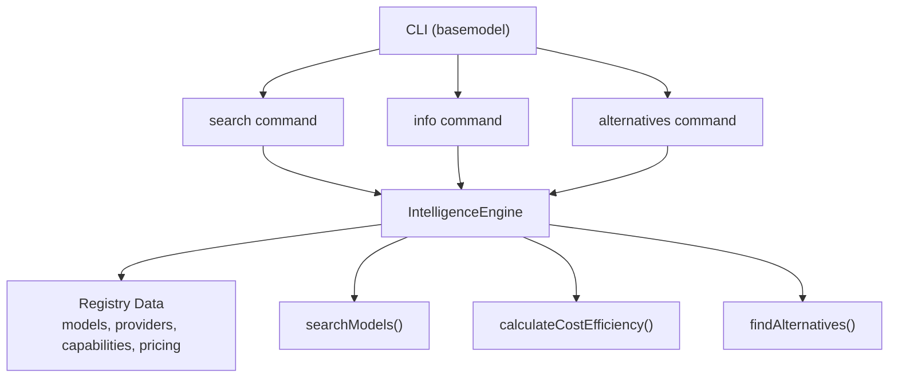
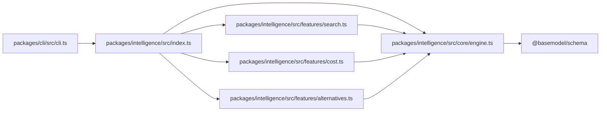

# Model Query Commands

<cite>
**Referenced Files in This Document**
- [README.md](file://README.md)
- [cli.ts](file://packages/cli/src/cli.ts)
- [engine.ts](file://packages/intelligence/src/core/engine.ts)
- [search.ts](file://packages/intelligence/src/features/search.ts)
- [cost.ts](file://packages/intelligence/src/features/cost.ts)
- [alternatives.ts](file://packages/intelligence/src/features/alternatives.ts)
- [index.ts](file://packages/intelligence/src/index.ts)
</cite>

## Table of Contents
1. [Introduction](#introduction)
2. [Project Structure](#project-structure)
3. [Core Components](#core-components)
4. [Architecture Overview](#architecture-overview)
5. [Detailed Component Analysis](#detailed-component-analysis)
6. [Dependency Analysis](#dependency-analysis)
7. [Performance Considerations](#performance-considerations)
8. [Troubleshooting Guide](#troubleshooting-guide)
9. [Conclusion](#conclusion)

## Introduction
This document explains BaseModel’s model query commands for searching, filtering, and retrieving information about AI models from the registry. It covers how to query by provider, model name, capabilities, pricing, and other attributes; provides examples of common queries; documents output formats, filtering options, sorting parameters, and pagination support; and includes troubleshooting tips and performance optimization techniques.

BaseModel is a data layer that discovers, validates, normalizes, stores, analyzes, and publishes structured knowledge about AI models. The CLI exposes commands to search models, show details for a specific model, and list alternatives.

**Section sources**
- [README.md:1-30](file://README.md#L1-L30)

## Project Structure
The relevant parts for model queries are:
- CLI entry point and command parsing
- Intelligence Engine for loading and validating registry data
- Search feature for filtering models
- Cost efficiency calculation for pricing insights
- Alternatives recommendation logic



**Diagram sources**
- [cli.ts:85-117](file://packages/cli/src/cli.ts#L85-L117)
- [engine.ts:36-92](file://packages/intelligence/src/core/engine.ts#L36-L92)
- [search.ts:18-52](file://packages/intelligence/src/features/search.ts#L18-L52)
- [cost.ts:53-115](file://packages/intelligence/src/features/cost.ts#L53-L115)
- [alternatives.ts:59-137](file://packages/intelligence/src/features/alternatives.ts#L59-L137)

**Section sources**
- [README.md:11-30](file://README.md#L11-L30)
- [index.ts:1-15](file://packages/intelligence/src/index.ts#L1-L15)

## Core Components
- CLI commands:
  - search: filters models using criteria such as provider, modalities, flags, and minimum context window.
  - info: retrieves detailed information for a specific model by model_id.
  - alternatives: lists alternative models based on capability similarity and cost ranking.
- IntelligenceEngine: loads and validates registry snapshots (models, providers, capabilities, pricing).
- searchModels: applies filter criteria against loaded models.
- calculateCostEfficiency: computes per-model pricing tiers and blended costs.
- findAlternatives: recommends comparable models with deduplication and ranking.

Key behaviors:
- All commands initialize the engine before use.
- Search supports AND logic across multiple criteria.
- Output formatting includes tiered cost labels and capability flags.

**Section sources**
- [cli.ts:13-30](file://packages/cli/src/cli.ts#L13-L30)
- [cli.ts:85-117](file://packages/cli/src/cli.ts#L85-L117)
- [cli.ts:119-166](file://packages/cli/src/cli.ts#L119-L166)
- [cli.ts:168-205](file://packages/cli/src/cli.ts#L168-L205)
- [engine.ts:36-92](file://packages/intelligence/src/core/engine.ts#L36-L92)
- [search.ts:18-52](file://packages/intelligence/src/features/search.ts#L18-L52)
- [cost.ts:53-115](file://packages/intelligence/src/features/cost.ts#L53-L115)
- [alternatives.ts:59-137](file://packages/intelligence/src/features/alternatives.ts#L59-L137)

## Architecture Overview
The CLI orchestrates user commands and delegates to the intelligence layer. The engine ensures data integrity and exposes functions for search, cost analysis, and alternatives.

```mermaid
sequenceDiagram
participant User as "User"
participant CLI as "CLI"
participant Engine as "IntelligenceEngine"
participant Search as "searchModels()"
participant Cost as "calculateCostEfficiency()"
participant Alt as "findAlternatives()"
User->>CLI : basemodel search --provider openai --modality image --flag vision_support
CLI->>Engine : init()
CLI->>Search : searchModels(criteria)
Search-->>CLI : filtered models[]
loop for each model
CLI->>Cost : calculateCostEfficiency(model_id)
Cost-->>CLI : cost report
end
CLI-->>User : formatted results
User->>CLI : basemodel info openai/gpt-4o
CLI->>Engine : init()
CLI->>Engine : find model by model_id
CLI->>Cost : calculateCostEfficiency(model_id)
CLI-->>User : detailed model info
User->>CLI : basemodel alternatives openai/gpt-4o
CLI->>Engine : init()
CLI->>Alt : findAlternatives(model_id, limit=5)
Alt-->>CLI : alternatives[]
CLI-->>User : ranked alternatives
```

**Diagram sources**
- [cli.ts:85-117](file://packages/cli/src/cli.ts#L85-L117)
- [cli.ts:119-166](file://packages/cli/src/cli.ts#L119-L166)
- [cli.ts:168-205](file://packages/cli/src/cli.ts#L168-L205)
- [engine.ts:58-82](file://packages/intelligence/src/core/engine.ts#L58-L82)
- [search.ts:18-52](file://packages/intelligence/src/features/search.ts#L18-L52)
- [cost.ts:53-115](file://packages/intelligence/src/features/cost.ts#L53-L115)
- [alternatives.ts:59-137](file://packages/intelligence/src/features/alternatives.ts#L59-L137)

## Detailed Component Analysis

### CLI Command: search
- Purpose: Filter models by provider, modalities, boolean flags, and minimum context window.
- Syntax:
  - basemodel search --provider <provider_ids_csv>
  - basemodel search --modality <modalities_csv>
  - basemodel search --flag <flags_csv>
  - basemodel search --min-context <number>
- Behavior:
  - Parses arguments into SearchCriteria.
  - Calls searchModels with the criteria.
  - For each result, calculates cost efficiency and prints summary including tier and flags.
- Output format:
  - Header with count.
  - Each model shows model_id, name, status, cost tier, and flags if present.

Example queries:
- Find all OpenAI models with vision capabilities:
  - basemodel search --provider openai --modality image --flag vision_support
- Models supporting both text and image:
  - basemodel search --modality text,image
- Models with function calling and at least 128k context:
  - basemodel search --flag function_calling --min-context 128000

Notes:
- Modalities require ALL specified values to be present in the model’s modality array.
- Flags must be true on the model.
- No built-in sorting or pagination in search; results are returned in engine order.

**Section sources**
- [cli.ts:63-81](file://packages/cli/src/cli.ts#L63-L81)
- [cli.ts:85-117](file://packages/cli/src/cli.ts#L85-L117)
- [search.ts:4-16](file://packages/intelligence/src/features/search.ts#L4-L16)
- [search.ts:18-52](file://packages/intelligence/src/features/search.ts#L18-L52)

### CLI Command: info
- Purpose: Show detailed information for a specific model by model_id.
- Syntax:
  - basemodel info <model-id>
- Behavior:
  - Initializes engine and finds the model by exact model_id.
  - Calculates cost efficiency and prints fields like provider, status, modalities, context window, release date, capabilities, and pricing tier.
- Output format:
  - Header with model_id and name.
  - Provider, status, modalities, context window, release date.
  - Capabilities section with boolean indicators.
  - Pricing section with tier and per-1M input/output/blended costs when available.

Example queries:
- basemodel info openai/gpt-4o
- basemodel info anthropic/claude-3-5-sonnet

Notes:
- If model not found, exits with error message.

**Section sources**
- [cli.ts:119-166](file://packages/cli/src/cli.ts#L119-L166)
- [cost.ts:53-115](file://packages/intelligence/src/features/cost.ts#L53-L115)

### CLI Command: alternatives
- Purpose: List alternative models comparable to a given model.
- Syntax:
  - basemodel alternatives <model-id>
- Behavior:
  - Initializes engine and calls findAlternatives with default limit.
  - Excludes router endpoints and collapses duplicates by physical slug.
  - Ranks by context window first, then prefers cheaper models on ties.
- Output format:
  - Header with model_id.
  - Each alternative shows model_id, reason, cost tier, and context window if present.

Example queries:
- basemodel alternatives openai/gpt-4o

Notes:
- Criteria include matching modalities, sufficient context window, and function calling parity.
- Router endpoints are excluded from recommendations.

**Section sources**
- [cli.ts:168-205](file://packages/cli/src/cli.ts#L168-L205)
- [alternatives.ts:59-137](file://packages/intelligence/src/features/alternatives.ts#L59-L137)

### Intelligence Engine
- Responsibilities:
  - Load and validate registry snapshot (models, providers, capabilities, pricing).
  - Provide ensureLoaded guard for operations.
  - Support hydration for browser environments.
- Initialization:
  - init() loads registry via dynamic import and hydrates engine.
  - Concurrent callers share the same load promise.

Usage patterns:
- Always call await engine.init() before querying.
- In non-Node environments, hydrate manually with validated data.

**Section sources**
- [engine.ts:36-92](file://packages/intelligence/src/core/engine.ts#L36-L92)

### Search Feature
- Interface:
  - SearchCriteria includes providerIds, modalities, flags, minContextWindow.
- Filtering rules:
  - providerIds: model.provider_id must be included.
  - modalities: model.modality must contain ALL requested modalities.
  - flags: all specified boolean fields must be true.
  - minContextWindow: model.context_window must be >= value.
- Complexity:
  - O(N) over models for each search.

Optimization opportunities:
- Pre-index by provider_id and modalities for faster filtering.
- Add range indexes for context_window.

**Section sources**
- [search.ts:4-16](file://packages/intelligence/src/features/search.ts#L4-L16)
- [search.ts:18-52](file://packages/intelligence/src/features/search.ts#L18-L52)

### Cost Efficiency Feature
- Purpose: Compute per-model pricing tier and blended cost.
- Inputs:
  - engine.pricing records for model_id.
- Logic:
  - Prefer source provenance (provider catalog > openrouter > others > huggingface > unknown).
  - Detect free models via explicit free pricing type or zero costs.
  - Classify tier based on blended cost thresholds.
- Output:
  - CostEfficiencyReport with isFree, input/output per-1M costs, blended cost, and tier.

Common uses:
- Display tier labels in search results and info output.
- Rank alternatives by cost when context windows tie.

**Section sources**
- [cost.ts:22-48](file://packages/intelligence/src/features/cost.ts#L22-L48)
- [cost.ts:53-115](file://packages/intelligence/src/features/cost.ts#L53-L115)

### Alternatives Feature
- Purpose: Recommend comparable models excluding routers and duplicates.
- Criteria:
  - Must support ALL modalities of original.
  - Context window >= 50% of original.
  - Function calling required if original has it.
  - Exclude router endpoints.
  - Collapse duplicates by physical slug; prefer first-party providers.
- Ranking:
  - Primary: larger context window.
  - Secondary: lower blended cost.
  - Tertiary: lexicographic model_id.

**Section sources**
- [alternatives.ts:10-33](file://packages/intelligence/src/features/alternatives.ts#L10-L33)
- [alternatives.ts:59-137](file://packages/intelligence/src/features/alternatives.ts#L59-L137)

## Dependency Analysis
The CLI depends on the intelligence package, which exports engine, search, cost, and alternatives modules. The engine depends on schema types and registry data.



**Diagram sources**
- [cli.ts:1-10](file://packages/cli/src/cli.ts#L1-L10)
- [index.ts:1-15](file://packages/intelligence/src/index.ts#L1-L15)
- [engine.ts:1-10](file://packages/intelligence/src/core/engine.ts#L1-L10)

**Section sources**
- [cli.ts:1-10](file://packages/cli/src/cli.ts#L1-L10)
- [index.ts:1-15](file://packages/intelligence/src/index.ts#L1-L15)

## Performance Considerations
- Search complexity:
  - Linear scan over models; consider indexing strategies for large registries.
- Engine initialization:
  - Single shared initPromise avoids redundant loads.
- Cost calculations:
  - Iterates pricing records; can be optimized with per-model maps.
- Alternatives ranking:
  - Sorting and deduplication are efficient but may scale with model count.

Recommendations:
- Cache search results keyed by criteria for repeated queries.
- Precompute blended costs per model during engine hydration.
- Use provider and modality indexes to reduce filtering time.

[No sources needed since this section provides general guidance]

## Troubleshooting Guide
Common issues and resolutions:
- Engine not initialized:
  - Ensure await engine.init() is called before any query.
  - In browser environments, hydrate the engine with validated data.
- Model not found:
  - Verify exact model_id spelling and case.
  - Confirm the model exists in the registry snapshot.
- No search results:
  - Check criteria constraints (modalities must be fully supported; flags must be true).
  - Reduce constraints incrementally to isolate failing conditions.
- Pricing tier Unknown:
  - Missing pricing records or ambiguous sources; verify pricing data availability.

Error handling:
- CLI prints usage and exits with error codes when inputs are invalid.
- Engine throws descriptive errors for invalid snapshots or uninitialized state.

**Section sources**
- [cli.ts:119-133](file://packages/cli/src/cli.ts#L119-L133)
- [cli.ts:168-184](file://packages/cli/src/cli.ts#L168-L184)
- [engine.ts:84-92](file://packages/intelligence/src/core/engine.ts#L84-L92)

## Conclusion
BaseModel’s CLI provides straightforward commands to search, inspect, and compare AI models using well-defined filtering criteria. The intelligence layer ensures data integrity and offers robust features for cost analysis and alternative recommendations. For complex queries, start with broad filters and refine gradually; leverage cost tiers and capability flags to make informed decisions. When scaling, consider indexing and caching strategies to optimize performance.

[No sources needed since this section summarizes without analyzing specific files]