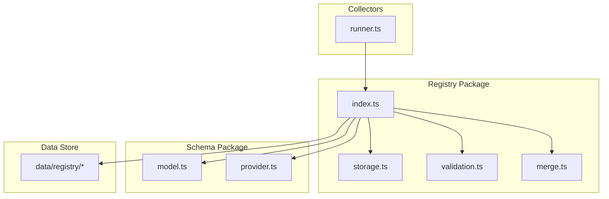
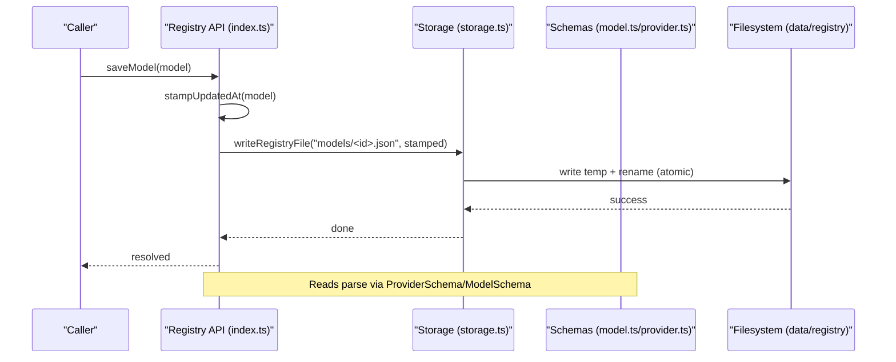
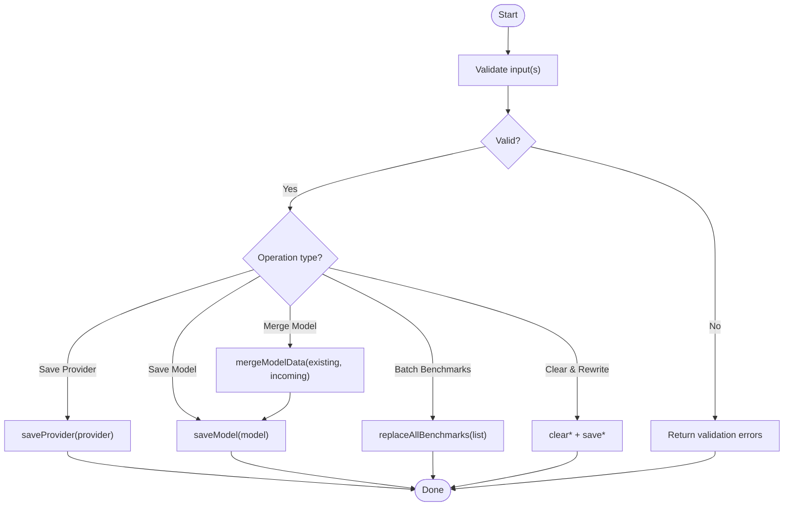
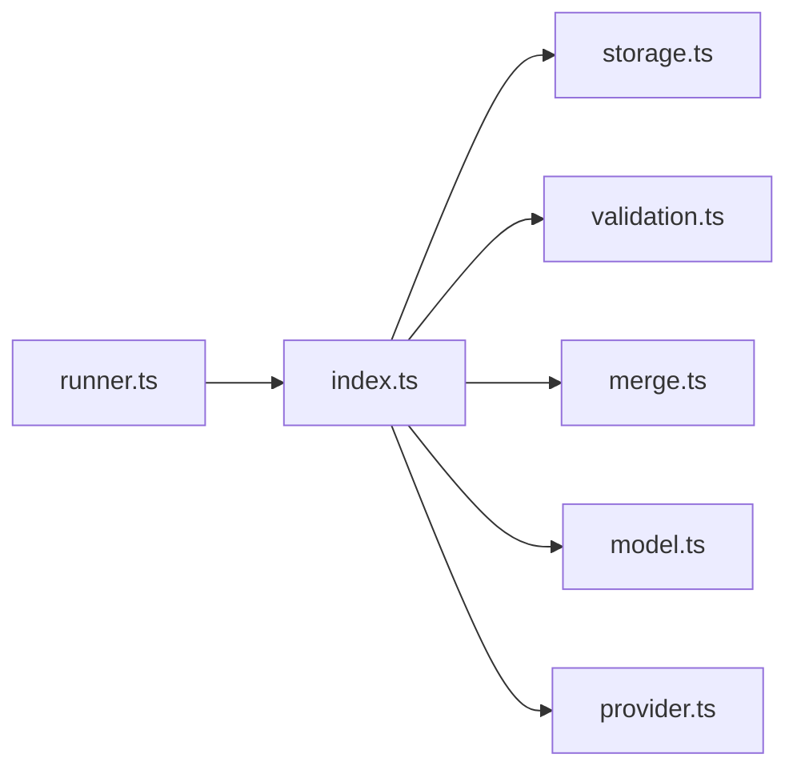

# Registry Management Commands

<cite>
**Referenced Files in This Document**
- [README.md](file://README.md)
- [index.ts](file://packages/registry/src/index.ts)
- [storage.ts](file://packages/registry/src/storage.ts)
- [validation.ts](file://packages/registry/src/validation.ts)
- [merge.ts](file://packages/registry/src/merge.ts)
- [model.ts](file://packages/schema/src/model.ts)
- [provider.ts](file://packages/schema/src/provider.ts)
- [runner.ts](file://packages/collectors/src/core/runner.ts)
</cite>

## Table of Contents
1. [Introduction](#introduction)
2. [Project Structure](#project-structure)
3. [Core Components](#core-components)
4. [Architecture Overview](#architecture-overview)
5. [Detailed Component Analysis](#detailed-component-analysis)
6. [Dependency Analysis](#dependency-analysis)
7. [Performance Considerations](#performance-considerations)
8. [Troubleshooting Guide](#troubleshooting-guide)
9. [Conclusion](#conclusion)
10. [Appendices](#appendices)

## Introduction
This document explains how BaseModel’s registry manages model and provider records through its API surface. It focuses on the operations that add, update, delete, and validate registry entries; importing data from external sources; merging conflicting records; managing provider configurations; batch operations; validation workflows; backup and restore procedures; error handling and rollback mechanisms; audit logging via timestamps; and best practices for maintaining registry integrity during large-scale updates.

The registry is a file-based store under data/registry with JSON files per entity type. The registry package exposes typed APIs for reading, writing, validating, and merging records, while schemas enforce data contracts.

**Section sources**
- [README.md:11-30](file://README.md#L11-L30)

## Project Structure
At a high level:
- Canonical schemas live in packages/schema.
- Registry storage, validation, and merge utilities live in packages/registry.
- Collectors may create or refresh provider records automatically when models reference them.
- Canonical records are persisted under data/registry organized by entity type (providers, models, capabilities, licenses, pricing, benchmarks).

**Diagram sources**
- [index.ts:1-48](file://packages/registry/src/index.ts#L1-L48)
- [storage.ts:1-41](file://packages/registry/src/storage.ts#L1-L41)
- [validation.ts:1-42](file://packages/registry/src/validation.ts#L1-L42)
- [merge.ts:1-69](file://packages/registry/src/merge.ts#L1-L69)
- [model.ts:1-65](file://packages/schema/src/model.ts#L1-L65)
- [provider.ts:1-29](file://packages/schema/src/provider.ts#L1-L29)
- [runner.ts:333-363](file://packages/collectors/src/core/runner.ts#L333-L363)

**Section sources**
- [README.md:11-30](file://README.md#L11-L30)

## Core Components
- Storage layer: atomic writes, directory listing, read-all helpers, and clear/delete primitives.
- Validation layer: safe parsing against Zod schemas with structured error collection.
- Merge logic: curated-field protection and schema validation after merge.
- Registry API: typed CRUD-like functions for providers, models, benchmarks, pricing, capabilities, APIs, and licenses.

Key responsibilities:
- Providers: get all, get one, save one.
- Models: get all, get one, get by provider, save one.
- Benchmarks: get all, get one, save one, clear, replace-all with source rollups.
- Pricing: get all, save per-provider array, clear.
- Capabilities, APIs, Licenses: get all; license lookup by id.

**Section sources**
- [index.ts:43-168](file://packages/registry/src/index.ts#L43-L168)
- [storage.ts:48-163](file://packages/registry/src/storage.ts#L48-L163)
- [validation.ts:1-42](file://packages/registry/src/validation.ts#L1-L42)
- [merge.ts:1-69](file://packages/registry/src/merge.ts#L1-L69)

## Architecture Overview
The registry API orchestrates reads/writes to data/registry using atomic file operations. All mutations stamp updated_at timestamps for auditability. Validation ensures schema compliance before persistence. Merging protects curated fields from being overwritten by automated collectors.

**Diagram sources**
- [index.ts:81-83](file://packages/registry/src/index.ts#L81-L83)
- [index.ts:39-41](file://packages/registry/src/index.ts#L39-L41)
- [storage.ts:59-65](file://packages/registry/src/storage.ts#L59-L65)
- [model.ts:11-62](file://packages/schema/src/model.ts#L11-L62)
- [provider.ts:10-26](file://packages/schema/src/provider.ts#L10-L26)

## Detailed Component Analysis

### Provider Management
- Read all providers: getAllProviders()
- Read single provider: getProvider(providerId)
- Save provider: saveProvider(provider) — stamps updated_at and persists atomically

Usage patterns:
- Importing new providers: construct a Provider object conforming to ProviderSchema, then call saveProvider.
- Updating existing providers: fetch, mutate, and save again.
- Deleting providers: remove the corresponding file via deleteRegistryFile('providers/<id>.json').

Validation and errors:
- Reading uses ProviderSchema.parse; invalid JSON returns null or throws during parse.
- Writing always stamps updated_at; ensure provider_id matches kebab-case constraints.

Automated registration:
- When collectors encounter an unknown provider referenced by models, they can auto-register a minimal provider record and stamp freshness.

**Section sources**
- [index.ts:45-59](file://packages/registry/src/index.ts#L45-L59)
- [storage.ts:119-124](file://packages/registry/src/storage.ts#L119-L124)
- [runner.ts:337-363](file://packages/collectors/src/core/runner.ts#L337-L363)
- [provider.ts:10-26](file://packages/schema/src/provider.ts#L10-L26)

### Model Management
- Read all models: getAllModels()
- Read single model: getModel(modelId)
- Filter by provider: getModelsByProvider(providerId)
- Save model: saveModel(model) — stamps updated_at and persists atomically

Importing and updating:
- For imports, build a Model object conforming to ModelSchema and call saveModel.
- For merges, use mergeModelData(existing, incoming) to protect curated fields and validate the result before saving.

Deleting:
- Remove a model file via deleteRegistryFile('models/<id>.json').

Validation and errors:
- getModel returns null if missing or invalid.
- saveModel expects a fully valid Model; use mergeModelData to reconcile conflicts safely.

Merging behavior:
- Curated fields (e.g., description, family, release_date, architecture, parameter_size) are preserved from existing records.
- capability_ids and license_id are preserved if present in the existing record.
- Result is validated against ModelSchema before returning.

**Section sources**
- [index.ts:63-83](file://packages/registry/src/index.ts#L63-L83)
- [storage.ts:119-124](file://packages/registry/src/storage.ts#L119-L124)
- [merge.ts:22-68](file://packages/registry/src/merge.ts#L22-L68)
- [model.ts:11-62](file://packages/schema/src/model.ts#L11-L62)

### Benchmark Management
- Read all benchmarks: getAllBenchmarks() — aggregates per-source rollup arrays.
- Read single benchmark: getBenchmark(benchmarkId)
- Save single benchmark: saveBenchmark(benchmark)
- Clear benchmarks: clearBenchmarksRegistry()
- Replace all benchmarks: replaceAllBenchmarks(benchmarks) — merges with existing by source to avoid wiping stale sources

Batch import workflow:
- Use replaceAllBenchmarks(newBenchmarks) to perform a partial-failure-safe update. Existing records from sources not present in this run are retained.

**Section sources**
- [index.ts:94-122](file://packages/registry/src/index.ts#L94-L122)
- [storage.ts:138-163](file://packages/registry/src/storage.ts#L138-L163)

### Pricing Management
- Read all pricing: getAllPricing() — aggregates per-provider arrays.
- Save pricing records: savePricingRecords(providerId, records) — writes one array file per provider and stamps updated_at.
- Clear pricing: clearPricingRegistry()

Batch import workflow:
- Build an array of Pricing objects per provider and call savePricingRecords.

**Section sources**
- [index.ts:126-147](file://packages/registry/src/index.ts#L126-L147)

### Capability, API, License Management
- Capabilities: getAllCapabilities()
- APIs: getAllApis()
- Licenses: getAllLicenses(), getLicense(licenseId)

These provide read access; write operations follow the same pattern as other entities using writeRegistryFile and stampUpdatedAt.

**Section sources**
- [index.ts:87-90](file://packages/registry/src/index.ts#L87-L90)
- [index.ts:151-168](file://packages/registry/src/index.ts#L151-L168)

### Validation Utilities
- Single-record validation: validate(schema, raw) returns { success, data } or { success, errors }.
- Batch validation: validateMany(schema, records[]) returns { valid[], invalid[] } with row-level errors.

Use these to pre-validate imported data before calling save* functions.

**Section sources**
- [validation.ts:1-42](file://packages/registry/src/validation.ts#L1-L42)

### Storage Primitives
- Atomic write: writeRegistryFile(relativePath, data) — writes to a temp file then renames.
- Read helpers: readRegistryFile, readAllFromDirectory, readAllArraysFromDirectory.
- Directory management: listRegistryFiles, clearRegistryDirectory, deleteRegistryFile.
- Benchmark rollup: writeBenchmarksRollup(benchmarks, existing) — merges by source and rewrites atomically.

**Section sources**
- [storage.ts:48-163](file://packages/registry/src/storage.ts#L48-L163)

## Architecture Overview
The registry API composes storage, validation, and merge utilities to provide a consistent interface for registry management. Consumers should:
- Validate inputs with validate or validateMany.
- Use mergeModelData for model updates to preserve curated fields.
- Prefer replaceAllBenchmarks for bulk benchmark updates.
- Use clear* followed by save* for full resets where appropriate.

[No sources needed since this diagram shows conceptual workflow, not actual code structure]

## Dependency Analysis
- index.ts depends on storage.ts, validation.ts, merge.ts, and schema types.
- storage.ts uses Node fs/promises and path utilities.
- validation.ts uses zod for runtime schema checks.
- merge.ts uses ModelSchema and validation to ensure merged results are valid.
- runner.ts may call registry functions to auto-register providers.

**Diagram sources**
- [index.ts:1-48](file://packages/registry/src/index.ts#L1-L48)
- [storage.ts:1-41](file://packages/registry/src/storage.ts#L1-L41)
- [validation.ts:1-42](file://packages/registry/src/validation.ts#L1-L42)
- [merge.ts:1-69](file://packages/registry/src/merge.ts#L1-L69)
- [model.ts:1-65](file://packages/schema/src/model.ts#L1-L65)
- [provider.ts:1-29](file://packages/schema/src/provider.ts#L1-L29)
- [runner.ts:333-363](file://packages/collectors/src/core/runner.ts#L333-L363)

**Section sources**
- [index.ts:1-48](file://packages/registry/src/index.ts#L1-L48)

## Performance Considerations
- Atomic writes minimize corruption risk and reduce lock contention.
- Benchmark rollups group many records into per-source arrays to avoid thousands of tiny files.
- Reading all directories is linear in the number of files; consider filtering by provider or source where possible.
- Batch operations (replaceAllBenchmarks, savePricingRecords) reduce I/O overhead compared to per-record saves.

[No sources needed since this section provides general guidance]

## Troubleshooting Guide
Common issues and resolutions:
- Invalid schema: Use validate or validateMany to capture field-level errors before saving.
- Missing registry root: Ensure BASEMODEL_REGISTRY_PATH points to an existing directory or that data/registry exists relative to cwd.
- Partial failures in benchmark updates: Use replaceAllBenchmarks to retain records from sources not refreshed in the current run.
- Unexpected overwrite of curated fields: Always use mergeModelData for model updates to preserve human-curated values.
- Provider not found: Auto-registration may occur when collectors encounter a new provider; otherwise, ensure a provider record exists before saving models.

Error handling and rollback:
- Writes are atomic via temp+rename; partial writes do not corrupt existing files.
- Validation failures prevent invalid data from being persisted.
- Clear operations are explicit; combine with save* to implement controlled rollouts.

Audit logging:
- All saved entities receive an updated_at timestamp for freshness tracking.

**Section sources**
- [validation.ts:1-42](file://packages/registry/src/validation.ts#L1-L42)
- [storage.ts:16-39](file://packages/registry/src/storage.ts#L16-L39)
- [storage.ts:59-65](file://packages/registry/src/storage.ts#L59-L65)
- [index.ts:39-41](file://packages/registry/src/index.ts#L39-L41)
- [merge.ts:22-68](file://packages/registry/src/merge.ts#L22-L68)
- [runner.ts:337-363](file://packages/collectors/src/core/runner.ts#L337-L363)

## Conclusion
BaseModel’s registry provides a robust, schema-driven API for managing AI model and provider records. By combining atomic storage, strict validation, and curated-field-aware merging, it supports reliable import, update, deletion, and validation workflows. For large-scale operations, prefer batch endpoints like replaceAllBenchmarks and savePricingRecords, and always validate inputs beforehand to maintain registry integrity.

[No sources needed since this section summarizes without analyzing specific files]

## Appendices

### Command Reference Summary
- Providers
  - Add/Update: saveProvider(provider)
  - Read: getAllProviders(), getProvider(providerId)
  - Delete: deleteRegistryFile('providers/<id>.json')
- Models
  - Add/Update: saveModel(model)
  - Read: getAllModels(), getModel(modelId), getModelsByProvider(providerId)
  - Delete: deleteRegistryFile('models/<id>.json')
  - Merge: mergeModelData(existing, incoming)
- Benchmarks
  - Add/Update: saveBenchmark(benchmark)
  - Read: getAllBenchmarks(), getBenchmark(benchmarkId)
  - Replace all: replaceAllBenchmarks(list)
  - Clear: clearBenchmarksRegistry()
- Pricing
  - Add/Update: savePricingRecords(providerId, records)
  - Read: getAllPricing()
  - Clear: clearPricingRegistry()
- Capabilities, APIs, Licenses
  - Read: getAllCapabilities(), getAllApis(), getAllLicenses(), getLicense(licenseId)

**Section sources**
- [index.ts:45-168](file://packages/registry/src/index.ts#L45-L168)
- [storage.ts:119-163](file://packages/registry/src/storage.ts#L119-L163)

### Best Practices for Registry Integrity
- Always validate inputs with validate or validateMany before saving.
- Use mergeModelData for model updates to protect curated fields.
- Prefer replaceAllBenchmarks for bulk benchmark updates to ensure partial-failure safety.
- Use clear* followed by save* for full resets when you need atomic replacement.
- Keep BASEMODEL_REGISTRY_PATH pointing to a stable, writable directory.
- Monitor updated_at timestamps to detect stale or unrefreshed records.

**Section sources**
- [validation.ts:1-42](file://packages/registry/src/validation.ts#L1-L42)
- [merge.ts:22-68](file://packages/registry/src/merge.ts#L22-L68)
- [index.ts:119-122](file://packages/registry/src/index.ts#L119-L122)
- [storage.ts:16-39](file://packages/registry/src/storage.ts#L16-L39)