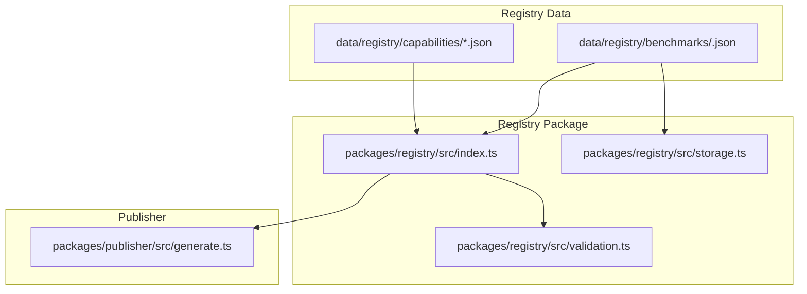
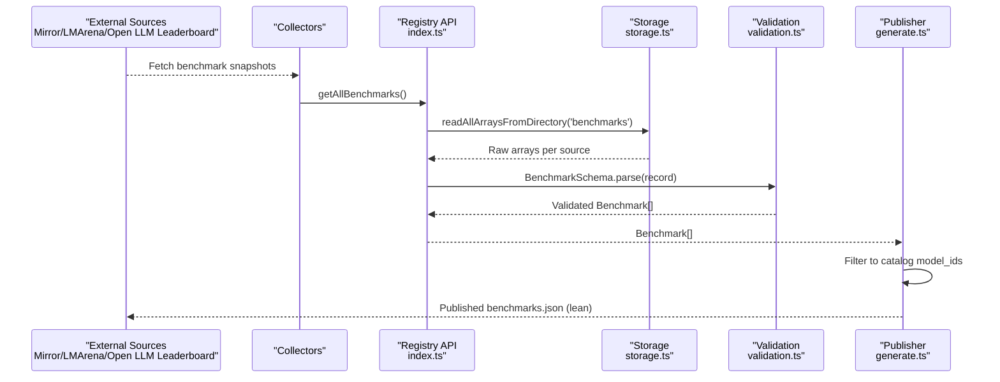
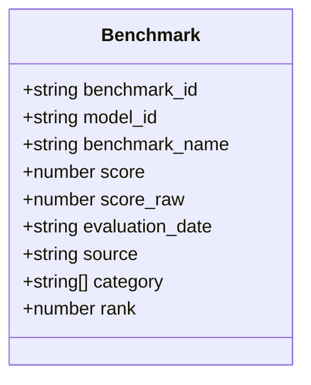
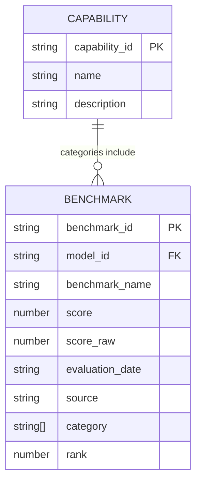
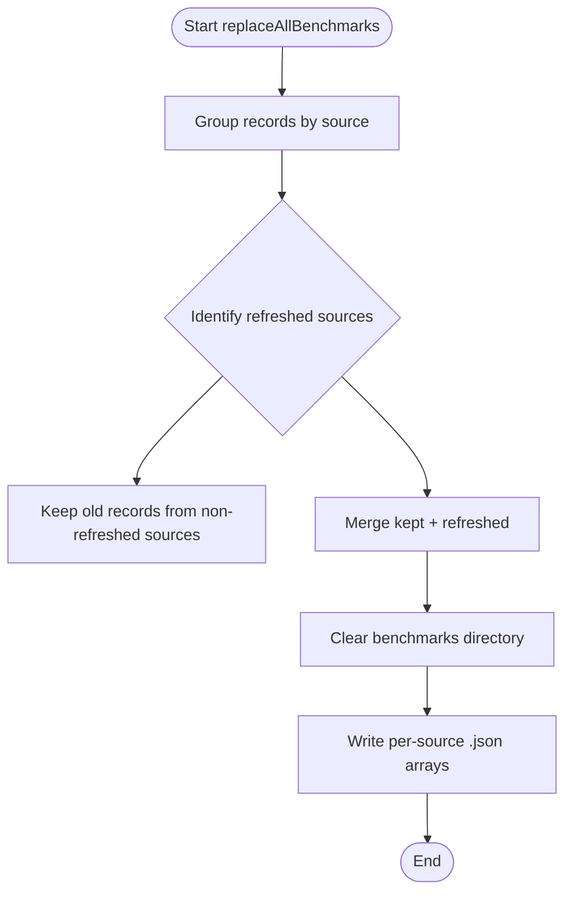
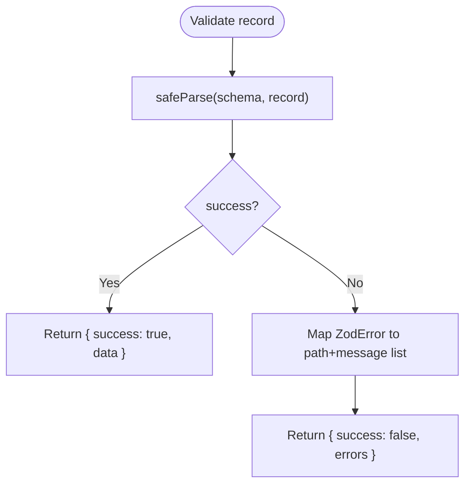
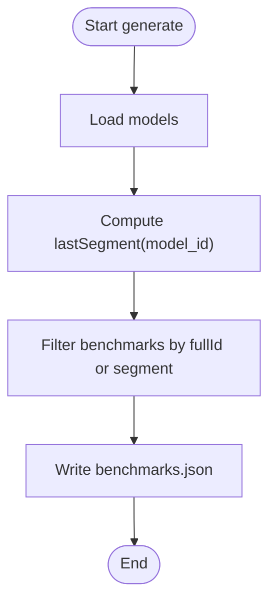
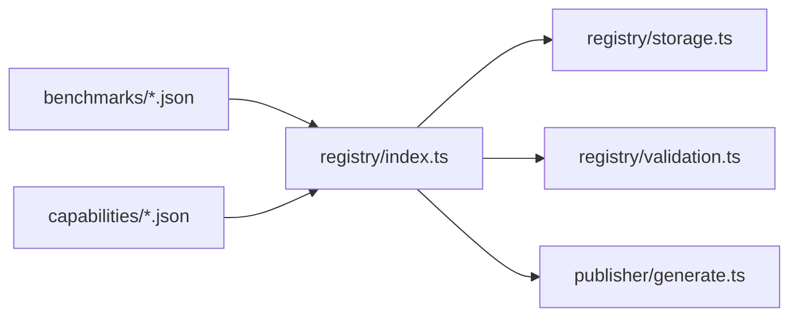

# Benchmark Schema

<cite>
**Referenced Files in This Document**
- [README.md](file://README.md)
- [mirror.json](file://data/registry/benchmarks/mirror.json)
- [code-generation.json](file://data/registry/capabilities/code-generation.json)
- [text-generation.json](file://data/registry/capabilities/text-generation.json)
- [reasoning.json](file://data/registry/capabilities/reasoning.json)
- [index.ts](file://packages/registry/src/index.ts)
- [storage.ts](file://packages/registry/src/storage.ts)
- [validation.ts](file://packages/registry/src/validation.ts)
- [generate.ts](file://packages/publisher/src/generate.ts)
- [04_Pipeline.md](file://docs/04_Pipeline.md)
</cite>

## Table of Contents
1. [Introduction](#introduction)
2. [Project Structure](#project-structure)
3. [Core Components](#core-components)
4. [Architecture Overview](#architecture-overview)
5. [Detailed Component Analysis](#detailed-component-analysis)
6. [Dependency Analysis](#dependency-analysis)
7. [Performance Considerations](#performance-considerations)
8. [Troubleshooting Guide](#troubleshooting-guide)
9. [Conclusion](#conclusion)
10. [Appendices](#appendices)

## Introduction
This document defines the Benchmark Schema used to store AI model performance evaluation results in the repository. It explains the structure of benchmark JSON files, including fields such as benchmark_id, test_suite (benchmark_name), scores, metrics, and methodology details where applicable. It also documents how benchmarks are categorized (e.g., code, text) and how they relate to model capabilities like language understanding, coding ability, math reasoning, and factual accuracy. Guidance is provided for adding new benchmarks and maintaining evaluation consistency across updates.

## Project Structure
The benchmark data lives under data/registry/benchmarks as per-source rollup arrays. The registry package provides APIs to read, validate, and write benchmark records. The publisher generates a lean dataset for consumption by the catalog UI.

**Diagram sources**
- [index.ts:92-124](file://packages/registry/src/index.ts#L92-L124)
- [storage.ts:126-163](file://packages/registry/src/storage.ts#L126-L163)
- [validation.ts:1-42](file://packages/registry/src/validation.ts#L1-L42)
- [generate.ts:147-177](file://packages/publisher/src/generate.ts#L147-L177)

**Section sources**
- [README.md:19-30](file://README.md#L19-L30)
- [index.ts:92-124](file://packages/registry/src/index.ts#L92-L124)
- [storage.ts:126-163](file://packages/registry/src/storage.ts#L126-L163)

## Core Components
Benchmark records are stored as arrays grouped by source. Each record includes:
- benchmark_id: unique identifier for the benchmark entry
- model_id: identifies the evaluated model
- benchmark_name: name of the test suite or benchmark category
- score: normalized score (percentage-like value)
- score_raw: raw numeric score before normalization
- evaluation_date: date when the evaluation was performed
- source: provenance of the benchmark data (e.g., mirror)
- category: array of capability categories (e.g., code, text)
- rank: position within the leaderboard subset

Example fields can be observed in the mirror snapshot file. These fields enable consistent ranking, filtering by category, and traceability to the original evaluation run.

**Section sources**
- [mirror.json:1-522](file://data/registry/benchmarks/mirror.json#L1-L522)

## Architecture Overview
Benchmarks flow from external sources into the registry, get validated against schemas, and are persisted as per-source rollups. The publisher then filters and emits a compact dataset aligned with the catalog models.

**Diagram sources**
- [index.ts:92-124](file://packages/registry/src/index.ts#L92-L124)
- [storage.ts:126-163](file://packages/registry/src/storage.ts#L126-L163)
- [validation.ts:1-42](file://packages/registry/src/validation.ts#L1-L42)
- [generate.ts:147-177](file://packages/publisher/src/generate.ts#L147-L177)
- [04_Pipeline.md:107-139](file://docs/04_Pipeline.md#L107-L139)

## Detailed Component Analysis

### Benchmark Record Schema
Each benchmark record contains:
- benchmark_id: string; unique per row
- model_id: string; references a model in the registry
- benchmark_name: string; test suite name (e.g., code, text)
- score: number; normalized score
- score_raw: number; unnormalized raw score
- evaluation_date: string; ISO date of evaluation
- source: string; origin of the data (e.g., mirror)
- category: string[]; capability tags (e.g., code, text)
- rank: number; leaderboard rank within the subset

These fields support:
- Filtering by category (coding ability, language understanding, etc.)
- Ranking and comparison via score and rank
- Traceability via evaluation_date and source
- Normalization analysis via score vs score_raw

**Diagram sources**
- [mirror.json:1-522](file://data/registry/benchmarks/mirror.json#L1-L522)

**Section sources**
- [mirror.json:1-522](file://data/registry/benchmarks/mirror.json#L1-L522)

### Capability Categories and Model Capabilities
Capabilities define high-level abilities that map to benchmark categories:
- Code Generation: coding ability
- Text Generation: language understanding and generation
- Reasoning: math/logic reasoning

Categories in benchmark records align with these capabilities, enabling cross-referencing between benchmarks and model capabilities.

**Diagram sources**
- [code-generation.json:1-6](file://data/registry/capabilities/code-generation.json#L1-L6)
- [text-generation.json:1-6](file://data/registry/capabilities/text-generation.json#L1-L6)
- [reasoning.json:1-6](file://data/registry/capabilities/reasoning.json#L1-L6)
- [mirror.json:1-522](file://data/registry/benchmarks/mirror.json#L1-L522)

**Section sources**
- [code-generation.json:1-6](file://data/registry/capabilities/code-generation.json#L1-L6)
- [text-generation.json:1-6](file://data/registry/capabilities/text-generation.json#L1-L6)
- [reasoning.json:1-6](file://data/registry/capabilities/reasoning.json#L1-L6)

### Storage and Rollup Strategy
Benchmarks are persisted as one array file per source to avoid bloating the repository with many tiny files. The rollup merges refreshed sources while preserving previous rows from sources not collected in the current run.

**Diagram sources**
- [storage.ts:126-163](file://packages/registry/src/storage.ts#L126-L163)

**Section sources**
- [storage.ts:126-163](file://packages/registry/src/storage.ts#L126-L163)

### Validation and Error Handling
Records are validated using Zod schemas through a helper that returns structured errors without throwing. Invalid rows are isolated while valid ones proceed through the pipeline.

**Diagram sources**
- [validation.ts:1-42](file://packages/registry/src/validation.ts#L1-L42)

**Section sources**
- [validation.ts:1-42](file://packages/registry/src/validation.ts#L1-L42)

### Publisher Filtering for Catalog Alignment
The publisher filters benchmarks to those relevant to catalog models, keeping only rows whose model_id matches either the full ID or its last path segment. This keeps the published dataset lean while preserving full data in the registry.

**Diagram sources**
- [generate.ts:147-177](file://packages/publisher/src/generate.ts#L147-L177)

**Section sources**
- [generate.ts:147-177](file://packages/publisher/src/generate.ts#L147-L177)

## Dependency Analysis
- Registry index functions depend on storage utilities to read/write arrays and on validation helpers to parse records.
- Publisher depends on registry outputs to filter and emit a lean dataset.
- Capability definitions provide semantic categories that align with benchmark categories.

**Diagram sources**
- [index.ts:92-124](file://packages/registry/src/index.ts#L92-L124)
- [storage.ts:126-163](file://packages/registry/src/storage.ts#L126-L163)
- [validation.ts:1-42](file://packages/registry/src/validation.ts#L1-L42)
- [generate.ts:147-177](file://packages/publisher/src/generate.ts#L147-L177)

**Section sources**
- [index.ts:92-124](file://packages/registry/src/index.ts#L92-L124)
- [storage.ts:126-163](file://packages/registry/src/storage.ts#L126-L163)
- [validation.ts:1-42](file://packages/registry/src/validation.ts#L1-L42)
- [generate.ts:147-177](file://packages/publisher/src/generate.ts#L147-L177)

## Performance Considerations
- Per-source rollup arrays reduce git bloat and improve write atomicity compared to one-file-per-record.
- Validation uses safe parsing to avoid exceptions and batch invalid records efficiently.
- Publisher filtering minimizes output size by matching only catalog-relevant model IDs.

[No sources needed since this section provides general guidance]

## Troubleshooting Guide
- If benchmark records fail validation, inspect error paths and messages returned by the validation helper.
- When missing data appears after a run, check whether a source failed; the rollup preserves previous rows for non-refreshed sources.
- For catalog mismatches, ensure model_id segments match the expected format used by the publisher’s filtering logic.

**Section sources**
- [validation.ts:1-42](file://packages/registry/src/validation.ts#L1-L42)
- [storage.ts:126-163](file://packages/registry/src/storage.ts#L126-L163)
- [generate.ts:147-177](file://packages/publisher/src/generate.ts#L147-L177)

## Conclusion
The Benchmark Schema standardizes how model evaluations are recorded, validated, and published. By grouping records by source, validating rigorously, and filtering for catalog alignment, the system maintains consistency, traceability, and performance. Categories link benchmarks to model capabilities, supporting meaningful comparisons across domains like coding, text generation, and reasoning.

[No sources needed since this section summarizes without analyzing specific files]

## Appendices

### Adding New Benchmarks
- Create or update a per-source rollup file under data/registry/benchmarks/<source>.json containing an array of benchmark records.
- Ensure each record includes all required fields: benchmark_id, model_id, benchmark_name, score, score_raw, evaluation_date, source, category, rank.
- Validate records using the registry’s validation helpers before committing changes.
- Run the publisher to regenerate the lean dataset and verify catalog alignment.

**Section sources**
- [storage.ts:126-163](file://packages/registry/src/storage.ts#L126-L163)
- [validation.ts:1-42](file://packages/registry/src/validation.ts#L1-L42)
- [generate.ts:147-177](file://packages/publisher/src/generate.ts#L147-L177)

### Scoring Normalization and Methodology Notes
- Use score_raw to preserve original metric values and score for normalized comparison.
- Include evaluation_date to track temporal changes and enable time-series analysis.
- Categorize benchmarks with category tags aligned to capability definitions for consistent filtering.

**Section sources**
- [mirror.json:1-522](file://data/registry/benchmarks/mirror.json#L1-L522)
- [code-generation.json:1-6](file://data/registry/capabilities/code-generation.json#L1-L6)
- [text-generation.json:1-6](file://data/registry/capabilities/text-generation.json#L1-L6)
- [reasoning.json:1-6](file://data/registry/capabilities/reasoning.json#L1-L6)

### Benchmark Update Procedures
- Collectors fetch data from Mirror, LMArena, and Open LLM Leaderboard.
- On failure or rate limits, fallback to Mirror snapshot ensures continuity.
- Replace all benchmarks atomically via replaceAllBenchmarks to maintain consistency.

**Section sources**
- [04_Pipeline.md:107-139](file://docs/04_Pipeline.md#L107-L139)
- [index.ts:92-124](file://packages/registry/src/index.ts#L92-L124)
- [storage.ts:126-163](file://packages/registry/src/storage.ts#L126-L163)