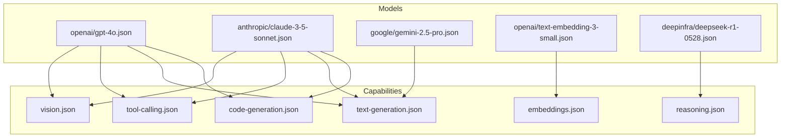
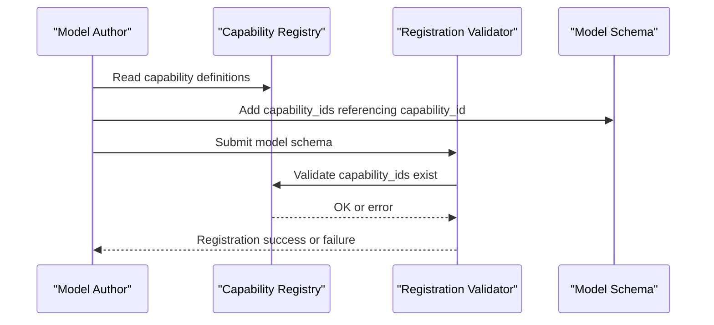
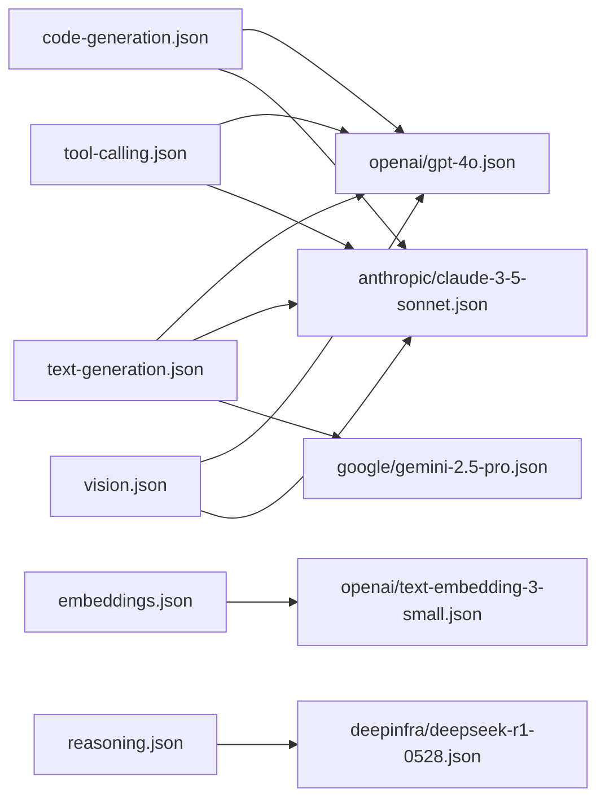
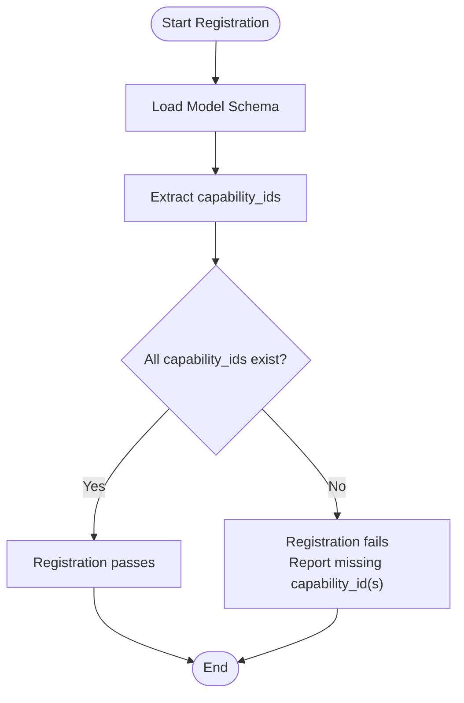

# Capability Schema

<cite>
**Referenced Files in This Document**
- [code-generation.json](file://data/registry/capabilities/code-generation.json)
- [embeddings.json](file://data/registry/capabilities/embeddings.json)
- [reasoning.json](file://data/registry/capabilities/reasoning.json)
- [text-generation.json](file://data/registry/capabilities/text-generation.json)
- [tool-calling.json](file://data/registry/capabilities/tool-calling.json)
- [vision.json](file://data/registry/capabilities/vision.json)
- [gpt-4o.json](file://data/registry/models/openai/gpt-4o.json)
- [claude-3-5-sonnet.json](file://data/registry/models/anthropic/claude-3-5-sonnet.json)
- [gemini-2.5-pro.json](file://data/registry/models/google/gemini-2.5-pro.json)
- [text-embedding-3-small.json](file://data/registry/models/openai/text-embedding-3-small.json)
- [deepseek-r1-0528.json](file://data/registry/models/deepinfra/deepseek-r1-0528.json)
</cite>

## Table of Contents
1. [Introduction](#introduction)
2. [Project Structure](#project-structure)
3. [Core Components](#core-components)
4. [Architecture Overview](#architecture-overview)
5. [Detailed Component Analysis](#detailed-component-analysis)
6. [Dependency Analysis](#dependency-analysis)
7. [Performance Considerations](#performance-considerations)
8. [Troubleshooting Guide](#troubleshooting-guide)
9. [Conclusion](#conclusion)
10. [Appendices](#appendices)

## Introduction
This document explains the Capability Schema used to standardize AI model features across providers. It defines how capabilities are declared, documented, and referenced by model schemas, and outlines strategies for versioning and backward compatibility. The schema focuses on a small set of core capability definitions that can be composed into model feature sets via capability IDs.

## Project Structure
The Capability Schema is implemented as a collection of JSON files under data/registry/capabilities. Each file declares a single capability with stable identifiers and human-readable metadata. Model schemas under data/registry/models reference these capabilities using an array of capability_ids.

**Diagram sources**
- [code-generation.json:1-6](file://data/registry/capabilities/code-generation.json#L1-L6)
- [embeddings.json:1-6](file://data/registry/capabilities/embeddings.json#L1-L6)
- [reasoning.json:1-6](file://data/registry/capabilities/reasoning.json#L1-L6)
- [text-generation.json:1-6](file://data/registry/capabilities/text-generation.json#L1-L6)
- [tool-calling.json:1-6](file://data/registry/capabilities/tool-calling.json#L1-L6)
- [vision.json:1-6](file://data/registry/capabilities/vision.json#L1-L6)
- [gpt-4o.json:1-37](file://data/registry/models/openai/gpt-4o.json#L1-L37)
- [claude-3-5-sonnet.json:1-24](file://data/registry/models/anthropic/claude-3-5-sonnet.json#L1-L24)
- [gemini-2.5-pro.json:1-30](file://data/registry/models/google/gemini-2.5-pro.json#L1-L30)
- [text-embedding-3-small.json:1-19](file://data/registry/models/openai/text-embedding-3-small.json#L1-L19)
- [deepseek-r1-0528.json:1-26](file://data/registry/models/deepinfra/deepseek-r1-0528.json#L1-L26)

**Section sources**
- [code-generation.json:1-6](file://data/registry/capabilities/code-generation.json#L1-L6)
- [embeddings.json:1-6](file://data/registry/capabilities/embeddings.json#L1-L6)
- [reasoning.json:1-6](file://data/registry/capabilities/reasoning.json#L1-L6)
- [text-generation.json:1-6](file://data/registry/capabilities/text-generation.json#L1-L6)
- [tool-calling.json:1-6](file://data/registry/capabilities/tool-calling.json#L1-L6)
- [vision.json:1-6](file://data/registry/capabilities/vision.json#L1-L6)
- [gpt-4o.json:1-37](file://data/registry/models/openai/gpt-4o.json#L1-L37)
- [claude-3-5-sonnet.json:1-24](file://data/registry/models/anthropic/claude-3-5-sonnet.json#L1-L24)
- [gemini-2.5-pro.json:1-30](file://data/registry/models/google/gemini-2.5-pro.json#L1-L30)
- [text-embedding-3-small.json:1-19](file://data/registry/models/openai/text-embedding-3-small.json#L1-L19)
- [deepseek-r1-0528.json:1-26](file://data/registry/models/deepinfra/deepseek-r1-0528.json#L1-L26)

## Core Components
The Capability Schema consists of six foundational capability definitions. Each capability file includes:
- capability_id: A stable, lowercase identifier used by models to declare support.
- name: Human-readable title for display and tooling.
- description: Plain-language explanation of what the capability entails.

These definitions act as a shared vocabulary so that different providers can consistently describe model features.

Examples of capability declarations:
- Code Generation: Enables writing, completing, explaining, and debugging code across multiple programming languages.
- Embeddings: Converts text into high-dimensional vector representations for semantic search and retrieval.
- Reasoning: Provides enhanced step-by-step thinking for complex logical and mathematical problems.
- Text Generation: Generates coherent and contextually relevant text from prompts.
- Tool Calling: Allows calling external functions or tools as part of a response (function calling).
- Vision: Understands and analyzes images provided as input.

How models declare capabilities:
- Models include a capability_ids array listing one or more capability_id values they support.
- Additional boolean flags in model schemas may indicate specific features (e.g., function_calling, vision_support), but capability_ids provide the standardized feature set.

Provider examples:
- OpenAI gpt-4o declares text-generation, code-generation, vision, and tool-calling.
- Anthropic Claude 3.5 Sonnet declares text-generation, code-generation, vision, and tool-calling.
- Google Gemini 2.5 Pro currently has an empty capability_ids list; it still exposes other feature flags such as function_calling and vision_support.
- OpenAI text-embedding-3-small does not list embeddings in capability_ids despite embedding-related flags elsewhere in its schema.
- DeepSeek R1 indicates reasoning_support at the model level without listing reasoning in capability_ids.

**Section sources**
- [code-generation.json:1-6](file://data/registry/capabilities/code-generation.json#L1-L6)
- [embeddings.json:1-6](file://data/registry/capabilities/embeddings.json#L1-L6)
- [reasoning.json:1-6](file://data/registry/capabilities/reasoning.json#L1-L6)
- [text-generation.json:1-6](file://data/registry/capabilities/text-generation.json#L1-L6)
- [tool-calling.json:1-6](file://data/registry/capabilities/tool-calling.json#L1-L6)
- [vision.json:1-6](file://data/registry/capabilities/vision.json#L1-L6)
- [gpt-4o.json:1-37](file://data/registry/models/openai/gpt-4o.json#L1-L37)
- [claude-3-5-sonnet.json:1-24](file://data/registry/models/anthropic/claude-3-5-sonnet.json#L1-L24)
- [gemini-2.5-pro.json:1-30](file://data/registry/models/google/gemini-2.5-pro.json#L1-L30)
- [text-embedding-3-small.json:1-19](file://data/registry/models/openai/text-embedding-3-small.json#L1-L19)
- [deepseek-r1-0528.json:1-26](file://data/registry/models/deepinfra/deepseek-r1-0528.json#L1-L26)

## Architecture Overview
The Capability Schema architecture separates capability definitions from model registrations:
- Capability definitions live in data/registry/capabilities and remain stable over time.
- Model schemas live under data/registry/models/<provider>/<model>.json and reference capabilities via capability_ids.
- Validation occurs during registration by ensuring each capability_id exists in the capability registry.

**Diagram sources**
- [code-generation.json:1-6](file://data/registry/capabilities/code-generation.json#L1-L6)
- [text-generation.json:1-6](file://data/registry/capabilities/text-generation.json#L1-L6)
- [tool-calling.json:1-6](file://data/registry/capabilities/tool-calling.json#L1-L6)
- [vision.json:1-6](file://data/registry/capabilities/vision.json#L1-L6)
- [gpt-4o.json:1-37](file://data/registry/models/openai/gpt-4o.json#L1-L37)
- [claude-3-5-sonnet.json:1-24](file://data/registry/models/anthropic/claude-3-5-sonnet.json#L1-L24)

## Detailed Component Analysis

### Capability Definitions
Each capability file follows a consistent structure:
- capability_id: Stable string used for cross-referencing.
- name: Display-friendly label.
- description: Plain-language summary of the capability’s purpose.

This design ensures consistency and readability while enabling programmatic validation and discovery.

**Section sources**
- [code-generation.json:1-6](file://data/registry/capabilities/code-generation.json#L1-L6)
- [embeddings.json:1-6](file://data/registry/capabilities/embeddings.json#L1-L6)
- [reasoning.json:1-6](file://data/registry/capabilities/reasoning.json#L1-L6)
- [text-generation.json:1-6](file://data/registry/capabilities/text-generation.json#L1-L6)
- [tool-calling.json:1-6](file://data/registry/capabilities/tool-calling.json#L1-L6)
- [vision.json:1-6](file://data/registry/capabilities/vision.json#L1-L6)

### Model Declarations and Validation
- Models declare supported capabilities through capability_ids, which must match registered capability_id values.
- Some models also expose boolean flags like function_calling, vision_support, and reasoning_support. These flags can complement capability_ids but do not replace them.
- During registration, the validator checks that all listed capability_ids exist in the capability registry. If any are missing, registration fails.

Examples:
- gpt-4o lists capability_ids including text-generation, code-generation, vision, and tool-calling.
- claude-3-5-sonnet lists similar capabilities.
- gemini-2.5-pro has an empty capability_ids list, relying on other flags for feature indication.
- text-embedding-3-small does not list embeddings in capability_ids.
- deepseek-r1-0528 indicates reasoning_support but does not list reasoning in capability_ids.

**Section sources**
- [gpt-4o.json:1-37](file://data/registry/models/openai/gpt-4o.json#L1-L37)
- [claude-3-5-sonnet.json:1-24](file://data/registry/models/anthropic/claude-3-5-sonnet.json#L1-L24)
- [gemini-2.5-pro.json:1-30](file://data/registry/models/google/gemini-2.5-pro.json#L1-L30)
- [text-embedding-3-small.json:1-19](file://data/registry/models/openai/text-embedding-3-small.json#L1-L19)
- [deepseek-r1-0528.json:1-26](file://data/registry/models/deepinfra/deepseek-r1-0528.json#L1-L26)

### Versioning Strategies
- Capability files use stable capability_id values to ensure long-term compatibility.
- New capabilities should be added as new files rather than modifying existing ones.
- Backward compatibility is maintained by keeping capability_id values immutable and avoiding breaking changes to their semantics.
- Model schemas can evolve by adding or removing capability_ids without affecting older consumers that rely on stable identifiers.

[No sources needed since this section provides general guidance]

### Defining New Capabilities
To add a new capability:
- Create a new JSON file under data/registry/capabilities with capability_id, name, and description.
- Ensure capability_id is unique and descriptive.
- Update model schemas to include the new capability_id where applicable.
- Register models; the validator will confirm the new capability_id exists.

[No sources needed since this section provides general guidance]

### Backward Compatibility Guidelines
- Do not rename or remove existing capability_id values.
- Prefer additive changes: introduce new capability files and update model schemas accordingly.
- Keep descriptions clear and stable to avoid misinterpretation by downstream systems.
- When deprecating features, consider introducing a replacement capability_id and migrating models gradually.

[No sources needed since this section provides general guidance]

## Dependency Analysis
The dependency relationship between capabilities and models is straightforward:
- Models depend on capability definitions via capability_ids.
- Capability definitions have no dependencies on models.
- Validation enforces referential integrity between model capability_ids and the capability registry.

**Diagram sources**
- [code-generation.json:1-6](file://data/registry/capabilities/code-generation.json#L1-L6)
- [text-generation.json:1-6](file://data/registry/capabilities/text-generation.json#L1-L6)
- [tool-calling.json:1-6](file://data/registry/capabilities/tool-calling.json#L1-L6)
- [vision.json:1-6](file://data/registry/capabilities/vision.json#L1-L6)
- [embeddings.json:1-6](file://data/registry/capabilities/embeddings.json#L1-L6)
- [reasoning.json:1-6](file://data/registry/capabilities/reasoning.json#L1-L6)
- [gpt-4o.json:1-37](file://data/registry/models/openai/gpt-4o.json#L1-L37)
- [claude-3-5-sonnet.json:1-24](file://data/registry/models/anthropic/claude-3-5-sonnet.json#L1-L24)
- [gemini-2.5-pro.json:1-30](file://data/registry/models/google/gemini-2.5-pro.json#L1-L30)
- [text-embedding-3-small.json:1-19](file://data/registry/models/openai/text-embedding-3-small.json#L1-L19)
- [deepseek-r1-0528.json:1-26](file://data/registry/models/deepinfra/deepseek-r1-0528.json#L1-L26)

**Section sources**
- [code-generation.json:1-6](file://data/registry/capabilities/code-generation.json#L1-L6)
- [text-generation.json:1-6](file://data/registry/capabilities/text-generation.json#L1-L6)
- [tool-calling.json:1-6](file://data/registry/capabilities/tool-calling.json#L1-L6)
- [vision.json:1-6](file://data/registry/capabilities/vision.json#L1-L6)
- [embeddings.json:1-6](file://data/registry/capabilities/embeddings.json#L1-L6)
- [reasoning.json:1-6](file://data/registry/capabilities/reasoning.json#L1-L6)
- [gpt-4o.json:1-37](file://data/registry/models/openai/gpt-4o.json#L1-L37)
- [claude-3-5-sonnet.json:1-24](file://data/registry/models/anthropic/claude-3-5-sonnet.json#L1-L24)
- [gemini-2.5-pro.json:1-30](file://data/registry/models/google/gemini-2.5-pro.json#L1-L30)
- [text-embedding-3-small.json:1-19](file://data/registry/models/openai/text-embedding-3-small.json#L1-L19)
- [deepseek-r1-0528.json:1-26](file://data/registry/models/deepinfra/deepseek-r1-0528.json#L1-L26)

## Performance Considerations
- Capability lookups are simple string comparisons against a small registry, resulting in minimal overhead.
- Keeping capability definitions concise improves readability and reduces parsing costs.
- Avoid excessive granularity in capability definitions to maintain clarity and ease of maintenance.

[No sources needed since this section provides general guidance]

## Troubleshooting Guide
Common issues and resolutions:
- Invalid capability_id in model schema: Ensure the capability_id matches exactly one defined in data/registry/capabilities.
- Missing capability definition: Create the corresponding capability file before registering models that reference it.
- Inconsistent feature flags: Align capability_ids with boolean flags (e.g., function_calling, vision_support) to avoid confusion.
- Empty capability_ids: Some models may intentionally leave capability_ids empty while exposing feature flags; verify intended behavior.

Validation flow:

**Diagram sources**
- [gpt-4o.json:1-37](file://data/registry/models/openai/gpt-4o.json#L1-L37)
- [claude-3-5-sonnet.json:1-24](file://data/registry/models/anthropic/claude-3-5-sonnet.json#L1-L24)
- [gemini-2.5-pro.json:1-30](file://data/registry/models/google/gemini-2.5-pro.json#L1-L30)
- [text-embedding-3-small.json:1-19](file://data/registry/models/openai/text-embedding-3-small.json#L1-L19)
- [deepseek-r1-0528.json:1-26](file://data/registry/models/deepinfra/deepseek-r1-0528.json#L1-L26)

**Section sources**
- [gpt-4o.json:1-37](file://data/registry/models/openai/gpt-4o.json#L1-L37)
- [claude-3-5-sonnet.json:1-24](file://data/registry/models/anthropic/claude-3-5-sonnet.json#L1-L24)
- [gemini-2.5-pro.json:1-30](file://data/registry/models/google/gemini-2.5-pro.json#L1-L30)
- [text-embedding-3-small.json:1-19](file://data/registry/models/openai/text-embedding-3-small.json#L1-L19)
- [deepseek-r1-0528.json:1-26](file://data/registry/models/deepinfra/deepseek-r1-0528.json#L1-L26)

## Conclusion
The Capability Schema provides a stable, provider-agnostic way to describe AI model features. By centralizing capability definitions and enforcing validation during model registration, it ensures consistency and reliability across diverse providers. Adhering to versioning and backward compatibility guidelines helps maintain a robust ecosystem as capabilities evolve.

[No sources needed since this section summarizes without analyzing specific files]

## Appendices

### Capability Reference
- code-generation: Writing, completing, explaining, and debugging code across multiple programming languages.
- embeddings: Converting text into high-dimensional vector representations for semantic search and retrieval.
- reasoning: Enhanced step-by-step thinking for complex logical and mathematical problems.
- text-generation: Generating coherent and contextually relevant text from prompts.
- tool-calling: Calling external functions or tools as part of a response (function calling).
- vision: Understanding and analyzing images provided as input.

**Section sources**
- [code-generation.json:1-6](file://data/registry/capabilities/code-generation.json#L1-L6)
- [embeddings.json:1-6](file://data/registry/capabilities/embeddings.json#L1-L6)
- [reasoning.json:1-6](file://data/registry/capabilities/reasoning.json#L1-L6)
- [text-generation.json:1-6](file://data/registry/capabilities/text-generation.json#L1-L6)
- [tool-calling.json:1-6](file://data/registry/capabilities/tool-calling.json#L1-L6)
- [vision.json:1-6](file://data/registry/capabilities/vision.json#L1-L6)