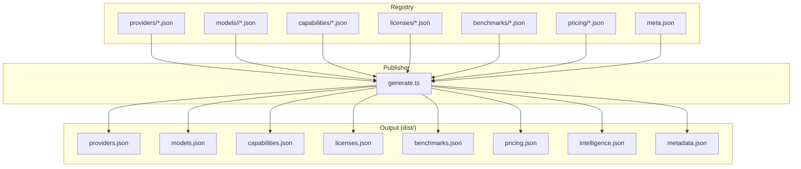
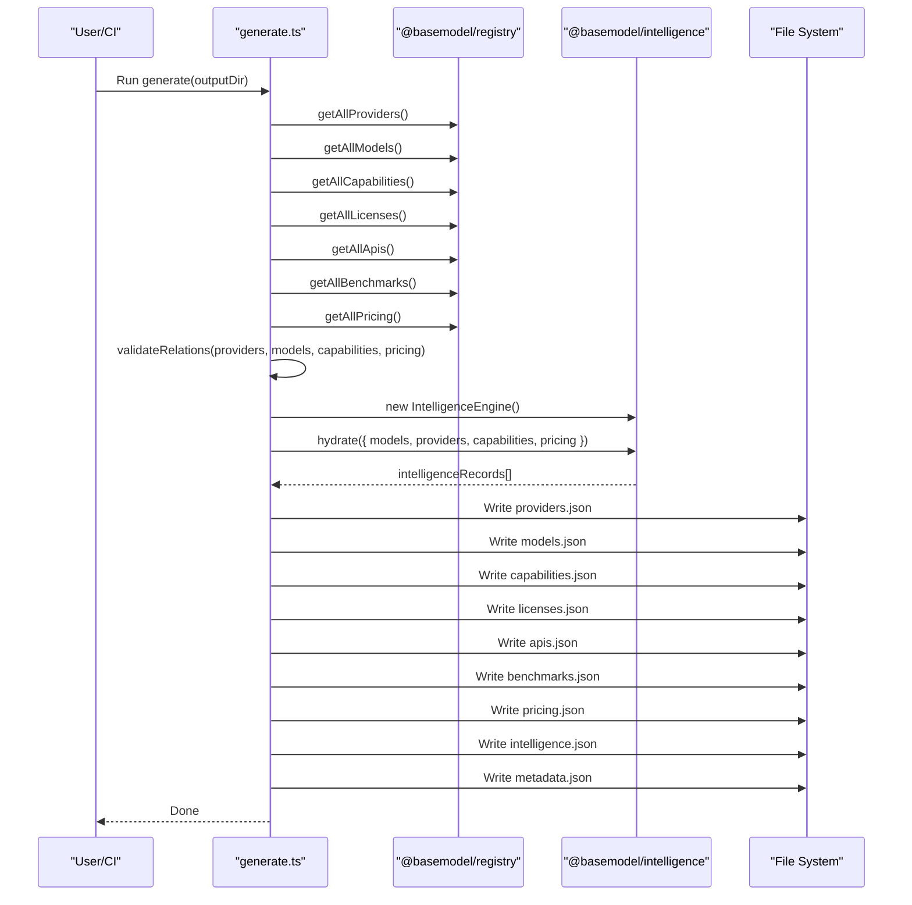
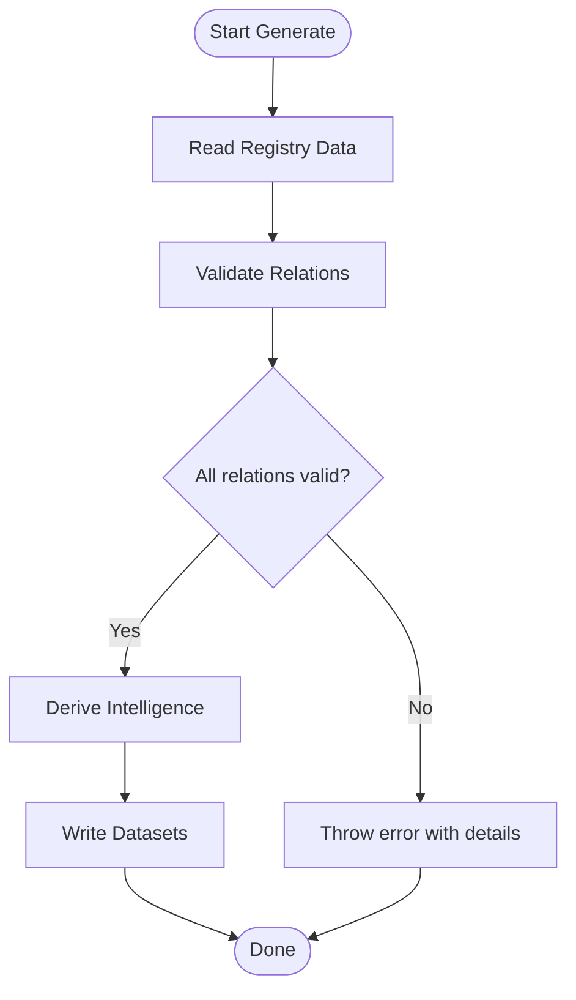
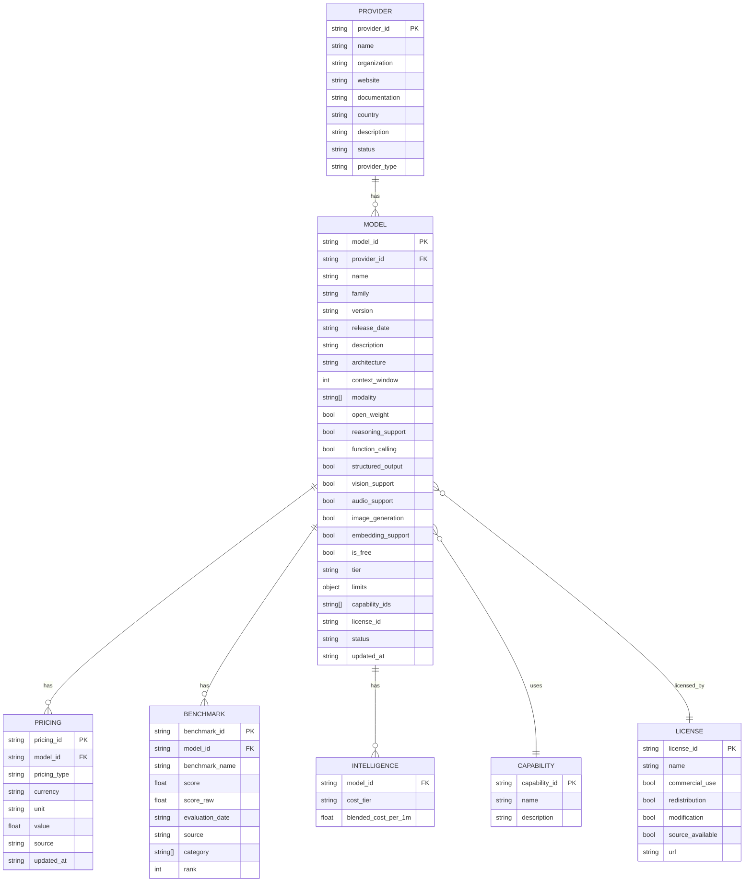

# Dataset Schemas

<cite>
**Referenced Files in This Document**
- [README.md](file://README.md)
- [generate.ts](file://packages/publisher/src/generate.ts)
- [generate.test.ts](file://packages/publisher/src/__tests__/generate.test.ts)
- [meta.json](file://data/registry/meta.json)
- [openai.json (provider)](file://data/registry/providers/openai.json)
- [anthropic.json (provider)](file://data/registry/providers/anthropic.json)
- [gpt-4o.json (model)](file://data/registry/models/openai/gpt-4o.json)
- [claude-3-5-haiku.json (model)](file://data/registry/models/anthropic/claude-3-5-haiku.json)
- [text-generation.json (capability)](file://data/registry/capabilities/text-generation.json)
- [mit.json (license)](file://data/registry/licenses/mit.json)
- [openai.json (pricing)](file://data/registry/pricing/openai.json)
- [mirror.json (benchmarks)](file://data/registry/benchmarks/mirror.json)
</cite>

## Table of Contents
1. [Introduction](#introduction)
2. [Project Structure](#project-structure)
3. [Core Components](#core-components)
4. [Architecture Overview](#architecture-overview)
5. [Detailed Component Analysis](#detailed-component-analysis)
6. [Dependency Analysis](#dependency-analysis)
7. [Performance Considerations](#performance-considerations)
8. [Troubleshooting Guide](#troubleshooting-guide)
9. [Conclusion](#conclusion)
10. [Appendices](#appendices)

## Introduction
This document defines the schemas for all JSON datasets generated by BaseModel and published under dist/. It covers providers.json, models.json, capabilities.json, licenses.json, pricing.json, benchmarks.json, and intelligence.json. For each schema, it specifies field definitions, data types, validation rules, relationships between entities, example structures, and guidance on programmatic consumption. It also documents versioning strategies, migration procedures, and backward compatibility considerations, along with guidelines for extending schemas and maintaining data integrity.

BaseModel is a data layer that discovers, validates, normalizes, stores, analyzes, and publishes structured knowledge about AI models. Canonical records live in data/registry/, and generated datasets are written to dist/ by the publisher pipeline.

**Section sources**
- [README.md:19-30](file://README.md#L19-L30)

## Project Structure
The repository organizes canonical schemas and types under packages/schema, registry storage and merge utilities under packages/registry, collectors under packages/collectors, derived intelligence under packages/intelligence, dataset generation under packages/publisher, and CLI under packages/cli. Generated datasets include providers.json, models.json, capabilities.json, licenses.json, apis.json, benchmarks.json, pricing.json, and intelligence.json.

**Diagram sources**
- [README.md:19-30](file://README.md#L19-L30)
- [generate.ts:125-145](file://packages/publisher/src/generate.ts#L125-L145)

**Section sources**
- [README.md:10-30](file://README.md#L10-L30)

## Core Components
The publisher reads all registry datasets, validates relations, derives intelligence, and writes normalized output files. Each output file follows a consistent envelope structure:
- schema_version: string indicating dataset schema version
- count: number of records
- generated_at: ISO timestamp when the dataset was produced
- source_revision: optional git revision used during generation
- data array or object containing the actual records

Key behaviors:
- Relation validation ensures model references exist for provider_id and capability_ids before writing outputs.
- Intelligence derivation uses an engine that hydrates and validates the snapshot against canonical schemas.
- Benchmarks are catalog-matched and merged into the final benchmarks.json.

**Section sources**
- [generate.ts:112-145](file://packages/publisher/src/generate.ts#L112-L145)
- [generate.ts:218-243](file://packages/publisher/src/generate.ts#L218-L243)
- [generate.test.ts:117-146](file://packages/publisher/src/__tests__/generate.test.ts#L117-L146)

## Architecture Overview
The dataset generation pipeline orchestrates reading, validating, enriching, and publishing datasets. The following sequence diagram maps the core flow from registry to dist outputs.

**Diagram sources**
- [generate.ts:125-145](file://packages/publisher/src/generate.ts#L125-L145)
- [generate.ts:218-243](file://packages/publisher/src/generate.ts#L218-L243)

## Detailed Component Analysis

### Schema Envelope and Versioning
All generated datasets share a common envelope:
- schema_version: string (e.g., "0.1.0")
- count: integer
- generated_at: ISO 8601 timestamp
- source_revision: string (optional)

Versioning strategy:
- schema_version is read from the workspace package manifest; a fallback constant is used if not available.
- Consumers should check schema_version to ensure compatibility and apply migrations accordingly.

Validation rules:
- counts must match the length of the corresponding data arrays.
- generated_at must be a valid ISO timestamp.
- source_revision is present when available from the build environment.

Example envelope fields appear across providers.json, models.json, capabilities.json, licenses.json, apis.json, benchmarks.json, pricing.json, and intelligence.json.

**Section sources**
- [generate.ts:24-26](file://packages/publisher/src/generate.ts#L24-L26)
- [generate.ts:112-123](file://packages/publisher/src/generate.ts#L112-L123)
- [generate.test.ts:129-146](file://packages/publisher/src/__tests__/generate.test.ts#L129-L146)

### providers.json
Structure:
- schema_version: string
- count: integer
- generated_at: ISO timestamp
- providers: array of Provider objects

Provider fields:
- provider_id: string (unique identifier)
- name: string
- organization: string
- website: string
- documentation: string
- country: string (ISO code)
- description: string
- status: enum ("active", "inactive", etc.)
- provider_type: enum ("first-party", "third-party", etc.)

Validation rules:
- provider_id must be unique across the array.
- All required fields must be present.
- status and provider_type must be one of the defined enums.

Relationships:
- Models reference provider_id to link to a Provider.

Example record shape:
- See openai.json and anthropic.json for concrete examples.

**Section sources**
- [openai.json (provider):1-11](file://data/registry/providers/openai.json#L1-L11)
- [anthropic.json (provider):1-11](file://data/registry/providers/anthropic.json#L1-L11)
- [generate.test.ts:129-132](file://packages/publisher/src/__tests__/generate.test.ts#L129-L132)

### models.json
Structure:
- schema_version: string
- count: integer
- generated_at: ISO timestamp
- models: array of Model objects

Model fields:
- model_id: string (unique identifier, typically "<provider>/<name>")
- provider_id: string (foreign key to Provider)
- name: string
- family: string
- version: string
- release_date: string (date)
- description: string
- architecture: string
- context_window: integer
- modality: array of strings (e.g., "text", "image", "audio")
- open_weight: boolean
- reasoning_support: boolean
- function_calling: boolean
- structured_output: boolean
- vision_support: boolean
- audio_support: boolean
- image_generation: boolean
- embedding_support: boolean
- is_free: boolean
- tier: string (e.g., "balanced", "premium", "free")
- limits: object (e.g., max_input_tokens)
- capability_ids: array of strings (foreign keys to Capability)
- license_id: string (foreign key to License)
- status: enum ("active", "inactive", etc.)
- updated_at: ISO timestamp

Validation rules:
- model_id must be unique.
- provider_id must exist in providers.json.
- capability_ids must all exist in capabilities.json.
- license_id must exist in licenses.json.
- Numeric fields must be non-negative where applicable.

Relationships:
- Links to Provider via provider_id.
- Links to multiple Capabilities via capability_ids.
- Links to License via license_id.

Example record shapes:
- See gpt-4o.json and claude-3-5-haiku.json for concrete examples.

**Section sources**
- [gpt-4o.json (model):1-37](file://data/registry/models/openai/gpt-4o.json#L1-L37)
- [claude-3-5-haiku.json (model):1-24](file://data/registry/models/anthropic/claude-3-5-haiku.json#L1-L24)
- [generate.test.ts:133-135](file://packages/publisher/src/__tests__/generate.test.ts#L133-L135)

### capabilities.json
Structure:
- schema_version: string
- count: integer
- generated_at: ISO timestamp
- capabilities: array of Capability objects

Capability fields:
- capability_id: string (unique identifier)
- name: string
- description: string

Validation rules:
- capability_id must be unique.
- All required fields must be present.

Relationships:
- Models reference capability_ids to associate capabilities.

Example record shape:
- See text-generation.json for a concrete example.

**Section sources**
- [text-generation.json (capability):1-6](file://data/registry/capabilities/text-generation.json#L1-L6)
- [generate.test.ts:135-136](file://packages/publisher/src/__tests__/generate.test.ts#L135-L136)

### licenses.json
Structure:
- schema_version: string
- count: integer
- generated_at: ISO timestamp
- licenses: array of License objects

License fields:
- license_id: string (unique identifier)
- name: string
- commercial_use: boolean
- redistribution: boolean
- modification: boolean
- source_available: boolean
- url: string

Validation rules:
- license_id must be unique.
- Boolean flags must accurately reflect permissions.
- url must be a valid URL when present.

Relationships:
- Models reference license_id to indicate licensing terms.

Example record shape:
- See mit.json for a concrete example.

**Section sources**
- [mit.json (license):1-10](file://data/registry/licenses/mit.json#L1-L10)
- [generate.test.ts:136-137](file://packages/publisher/src/__tests__/generate.test.ts#L136-L137)

### pricing.json
Structure:
- schema_version: string
- count: integer
- generated_at: ISO timestamp
- pricing: array of Pricing objects

Pricing fields:
- pricing_id: string (unique identifier)
- model_id: string (foreign key to Model)
- pricing_type: enum ("input-token", "output-token", etc.)
- currency: string (ISO currency code)
- unit: string (e.g., "1M tokens")
- value: number (price per unit)
- source: string (source of pricing data)
- updated_at: ISO timestamp

Validation rules:
- pricing_id must be unique.
- model_id must exist in models.json.
- value must be non-negative.
- currency must be a valid ISO code.

Relationships:
- Links to Model via model_id.

Example record shape:
- See openai.json (pricing) for many concrete examples.

**Section sources**
- [openai.json (pricing):1-783](file://data/registry/pricing/openai.json#L1-L783)
- [generate.test.ts:139-140](file://packages/publisher/src/__tests__/generate.test.ts#L139-L140)

### benchmarks.json
Structure:
- schema_version: string
- count: integer
- generated_at: ISO timestamp
- benchmarks: array of Benchmark objects

Benchmark fields:
- benchmark_id: string (unique identifier)
- model_id: string (foreign key to Model)
- benchmark_name: string (e.g., "code", "text")
- score: number (normalized score)
- score_raw: number (raw evaluation score)
- evaluation_date: string (date)
- source: string (evaluation source)
- category: array of strings (categories like "code", "text")
- rank: integer (rank within benchmark_name/category)

Validation rules:
- benchmark_id must be unique.
- model_id must exist in models.json.
- score and score_raw must be numeric and non-negative.
- evaluation_date must be a valid date string.

Relationships:
- Links to Model via model_id.

Example record shape:
- See mirror.json for concrete examples.

**Section sources**
- [mirror.json (benchmarks):1-522](file://data/registry/benchmarks/mirror.json#L1-L522)
- [generate.ts:218-224](file://packages/publisher/src/generate.ts#L218-L224)

### intelligence.json
Structure:
- schema_version: string
- count: integer
- generated_at: ISO timestamp
- intelligence: array of IntelligenceRecord objects

IntelligenceRecord fields:
- model_id: string (foreign key to Model)
- cost_tier: string (derived tier such as "Premium", "Balanced", "Free")
- blended_cost_per_1m: number (blended cost per million tokens)
- additional derived metrics may be included depending on engine implementation

Validation rules:
- model_id must exist in models.json.
- cost_tier must be one of the defined tiers.
- blended_cost_per_1m must be numeric and non-negative.

Relationships:
- Links to Model via model_id.

Generation process:
- Derived by IntelligenceEngine.hydrate using models, providers, capabilities, and pricing.

**Section sources**
- [generate.ts:140-145](file://packages/publisher/src/generate.ts#L140-L145)
- [generate.test.ts:140-143](file://packages/publisher/src/__tests__/generate.test.ts#L140-L143)

### Relationship Validation Flow
Before writing any datasets, the publisher validates cross-references:
- Every model.provider_id must exist in providers.json.
- Every model.capability_ids entry must exist in capabilities.json.
- Every model.license_id must exist in licenses.json.
- Every pricing.model_id must exist in models.json.
- Every benchmark.model_id must exist in models.json.

If any relation fails, generation throws an error indicating the unknown entity.

**Diagram sources**
- [generate.ts:135-138](file://packages/publisher/src/generate.ts#L135-L138)
- [generate.test.ts:148-158](file://packages/publisher/src/__tests__/generate.test.ts#L148-L158)

**Section sources**
- [generate.test.ts:148-158](file://packages/publisher/src/__tests__/generate.test.ts#L148-L158)

## Dependency Analysis
The generated datasets form a relational graph:
- Providers are referenced by Models.
- Models reference Capabilities and Licenses.
- Pricing entries reference Models.
- Benchmarks reference Models.
- Intelligence records reference Models.

**Diagram sources**
- [gpt-4o.json (model):1-37](file://data/registry/models/openai/gpt-4o.json#L1-L37)
- [openai.json (pricing):1-783](file://data/registry/pricing/openai.json#L1-L783)
- [mirror.json (benchmarks):1-522](file://data/registry/benchmarks/mirror.json#L1-L522)
- [text-generation.json (capability):1-6](file://data/registry/capabilities/text-generation.json#L1-L6)
- [mit.json (license):1-10](file://data/registry/licenses/mit.json#L1-L10)
- [openai.json (provider):1-11](file://data/registry/providers/openai.json#L1-L11)

**Section sources**
- [generate.ts:125-145](file://packages/publisher/src/generate.ts#L125-L145)

## Performance Considerations
- Reading all registry datasets upfront minimizes I/O overhead during validation and enrichment.
- Relation validation occurs before writing to avoid partial outputs.
- Intelligence derivation runs once per generation run; caching can be considered for repeated runs.
- Large pricing catalogs (e.g., hundreds of entries) benefit from efficient indexing by model_id in consumer applications.

[No sources needed since this section provides general guidance]

## Troubleshooting Guide
Common errors and resolutions:
- Unknown provider: A model references a provider_id not present in providers.json. Ensure the provider exists and is correctly spelled.
- Unknown capability: A model references a capability_id not present in capabilities.json. Add the capability or correct the reference.
- Unknown license: A model references a license_id not present in licenses.json. Add the license or correct the reference.
- Invalid pricing model_id: A pricing entry references a model_id not present in models.json. Ensure the model exists.
- Invalid benchmark model_id: A benchmark references a model_id not present in models.json. Ensure the model exists.

Diagnostic tips:
- Check generated_at timestamps to confirm recent generation.
- Verify schema_version matches expected versions.
- Inspect meta.json for collection coverage and errors.

**Section sources**
- [generate.test.ts:148-158](file://packages/publisher/src/__tests__/generate.test.ts#L148-L158)
- [meta.json:1-18](file://data/registry/meta.json#L1-L18)

## Conclusion
The BaseModel dataset schemas provide a robust, validated, and versioned foundation for AI model intelligence. By adhering to the defined structures, validation rules, and relationship constraints, consumers can reliably integrate these datasets into analytics, selection tools, and cost optimization workflows. Versioning and migration practices ensure long-term stability while allowing evolution of the schema over time.

[No sources needed since this section summarizes without analyzing specific files]

## Appendices

### Programmatic Consumption Guidelines
- Load each dataset and verify schema_version before processing.
- Use model_id as the primary key for joins across datasets.
- Build indexes by provider_id, capability_ids, license_id, and model_id for fast lookups.
- Handle missing or null fields gracefully; enforce defaults where appropriate.
- Validate local copies against the canonical schemas if available.

### Extending Schemas and Maintaining Integrity
- Introduce new fields as optional initially; enforce them in subsequent versions.
- Maintain backward compatibility by avoiding breaking changes to existing fields.
- Update validation rules in the publisher to enforce new constraints.
- Document new fields in this schema guide and update tests accordingly.
- Use semantic versioning for schema_version to signal breaking changes.

[No sources needed since this section provides general guidance]