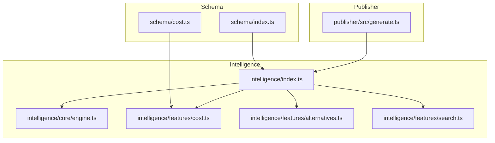
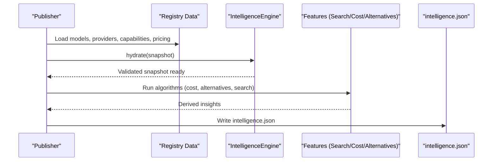
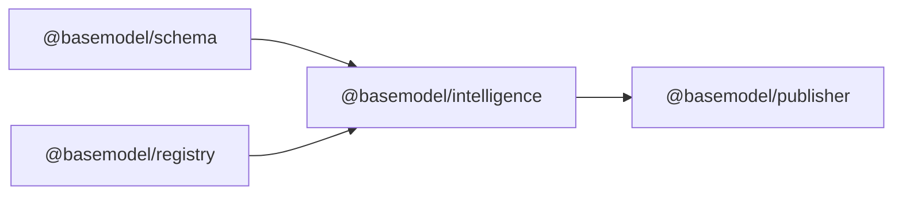

# Intelligence Schema

<cite>
**Referenced Files in This Document**
- [README.md](file://README.md)
- [engine.ts](file://packages/intelligence/src/core/engine.ts)
- [cost.ts](file://packages/intelligence/src/features/cost.ts)
- [alternatives.ts](file://packages/intelligence/src/features/alternatives.ts)
- [search.ts](file://packages/intelligence/src/features/search.ts)
- [index.ts](file://packages/intelligence/src/index.ts)
- [generate.ts](file://packages/publisher/src/generate.ts)
- [cost.ts](file://packages/schema/src/cost.ts)
- [05_Data_Model.md](file://docs/05_Data_Model.md)
</cite>

## Table of Contents
1. [Introduction](#introduction)
2. [Project Structure](#project-structure)
3. [Core Components](#core-components)
4. [Architecture Overview](#architecture-overview)
5. [Detailed Component Analysis](#detailed-component-analysis)
6. [Dependency Analysis](#dependency-analysis)
7. [Performance Considerations](#performance-considerations)
8. [Troubleshooting Guide](#troubleshooting-guide)
9. [Conclusion](#conclusion)
10. [Appendices](#appendices)

## Introduction
This document describes the Intelligence Schema and the derived intelligence layer that BaseModel publishes as intelligence.json. The intelligence layer computes rankings, recommendations, search results, and analytical insights from canonical registry data (models, providers, capabilities, pricing). Consumers can use these outputs to select models based on cost efficiency, capability matching, performance comparisons, and alternative suggestions.

Key objectives covered:
- Structure of intelligence.json including rankings, recommendations, search results, and analytical insights
- How intelligence is computed from registry data using algorithms for cost analysis, capability matching, and performance comparisons
- Explanation of fields like rank_score, recommendation_reasons, alternative_models, and confidence_metrics
- Examples of generated intelligence outputs and how consumers interpret them
- Generation process, update frequency, and customization options for intelligence algorithms

[No sources needed since this section provides a high-level overview]

## Project Structure
BaseModel organizes its code into packages with clear responsibilities:
- schema: Canonical Zod schemas and TypeScript types for shared contracts
- registry: Registry storage, validation, and merge utilities
- collectors: Provider and gateway collectors
- intelligence: Derived rankings, search, and recommendations
- publisher: Dataset generation for dist/ including intelligence.json
- cli: Command-line interface for querying intelligence

The README confirms that intelligence.json is one of the generated datasets written to dist/.

**Diagram sources**
- [index.ts:1-14](file://packages/intelligence/src/index.ts#L1-L14)
- [engine.ts:1-92](file://packages/intelligence/src/core/engine.ts#L1-L92)
- [cost.ts:1-115](file://packages/intelligence/src/features/cost.ts#L1-L115)
- [alternatives.ts:1-138](file://packages/intelligence/src/features/alternatives.ts#L1-L138)
- [search.ts:1-52](file://packages/intelligence/src/features/search.ts#L1-L52)
- [generate.ts:219-244](file://packages/publisher/src/generate.ts#L219-L244)
- [cost.ts:1-12](file://packages/schema/src/cost.ts#L1-L12)

**Section sources**
- [README.md:11-30](file://README.md#L11-L30)

## Core Components
The intelligence layer exposes three primary features through a unified engine:
- Search: Filter models by provider, modalities, feature flags, and context window
- Alternatives: Find comparable alternatives with reasons and deduplication across router endpoints
- Cost: Compute cost efficiency reports and classify pricing tiers

The engine holds a validated snapshot of registry data (models, providers, capabilities, pricing) and ensures it is loaded before any operation.

Key interfaces and behaviors:
- IntelligenceSnapshot: Typed snapshot containing models, providers, capabilities, pricing
- IntelligenceEngine: Hydrates or initializes with registry data; validates via Zod schemas
- SearchCriteria: Defines filters for searchModels
- CostEfficiencyReport: Includes modelId, isFree, input/output costs per 1M tokens, blendedCost, tier
- AlternativeResult: Contains model and human-readable reason

**Section sources**
- [engine.ts:1-92](file://packages/intelligence/src/core/engine.ts#L1-L92)
- [search.ts:1-52](file://packages/intelligence/src/features/search.ts#L1-L52)
- [cost.ts:1-115](file://packages/intelligence/src/features/cost.ts#L1-L115)
- [alternatives.ts:1-138](file://packages/intelligence/src/features/alternatives.ts#L1-L138)
- [index.ts:1-14](file://packages/intelligence/src/index.ts#L1-L14)

## Architecture Overview
The intelligence pipeline reads canonical registry data, validates it, and derives insights. The publisher writes intelligence.json alongside other datasets. Consumers load intelligence.json and optionally hydrate the IntelligenceEngine for programmatic queries.

**Diagram sources**
- [generate.ts:219-244](file://packages/publisher/src/generate.ts#L219-L244)
- [engine.ts:44-82](file://packages/intelligence/src/core/engine.ts#L44-L82)

**Section sources**
- [README.md:19-30](file://README.md#L19-L30)
- [generate.ts:219-244](file://packages/publisher/src/generate.ts#L219-L244)

## Detailed Component Analysis

### Intelligence Engine
Responsibilities:
- Validate and store a snapshot of registry data
- Provide lazy initialization for Node.js environments
- Ensure operations are only executed after loading

Key methods:
- hydrate(snapshot): Accepts a typed snapshot and validates via Zod schemas
- init(): Asynchronously loads registry data in Node.js environments
- ensureLoaded(): Guards against premature usage

Complexity:
- Validation is linear over arrays of entities
- Memory footprint scales with number of models, providers, capabilities, and pricing records

Error handling:
- Throws descriptive errors when snapshot validation fails or when used without initialization

**Section sources**
- [engine.ts:1-92](file://packages/intelligence/src/core/engine.ts#L1-L92)

### Search Feature
Purpose:
- Filter models based on provider IDs, required modalities, boolean flags, and minimum context window

Algorithm highlights:
- All requested modalities must be present in candidate models
- Boolean flags must be true for all specified keys
- Context window threshold enforced if provided

Usage:
- searchModels(engine, criteria) returns an array of Model objects

Complexity:
- O(N) where N is the number of models; constant-time checks per filter

**Section sources**
- [search.ts:1-52](file://packages/intelligence/src/features/search.ts#L1-L52)

### Cost Efficiency Feature
Purpose:
- Compute cost efficiency and pricing tier for a given model

Algorithm highlights:
- Picks token pricing records with deterministic provenance priority:
  - Provider catalog > OpenRouter > Other gateways > Hugging Face > Unknown
- Classifies tier based on blended cost thresholds
- Handles free models explicitly

Fields produced:
- modelId, isFree, inputCostPer1M, outputCostPer1M, blendedCost, tier

Blended cost heuristic:
- Uses fixed weights for input vs output tokens to compute a single blended metric

**Section sources**
- [cost.ts:1-115](file://packages/intelligence/src/features/cost.ts#L1-L115)
- [cost.ts:1-12](file://packages/schema/src/cost.ts#L1-L12)

### Alternatives Feature
Purpose:
- Recommend comparable alternative models with reasons and deduplication

Algorithm highlights:
- Must support all modalities of the original model
- Context window must be at least 50% of the original
- Function calling requirement preserved if original supports it
- Excludes router endpoints and collapses duplicate physical models
- Ranks by larger context window first, then cheaper cost on ties

Output:
- Array of AlternativeResult with model and human-readable reason

**Section sources**
- [alternatives.ts:1-138](file://packages/intelligence/src/features/alternatives.ts#L1-L138)

### Data Model Foundations
The intelligence layer relies on canonical domain entities defined in the schema package and documented in the data model guide. These include Model, Pricing, Capability, Provider, Benchmark, API, and License. Understanding these entities is essential for interpreting intelligence outputs.

**Section sources**
- [05_Data_Model.md:23-169](file://docs/05_Data_Model.md#L23-L169)

## Dependency Analysis
The intelligence package depends on:
- @basemodel/schema for types and validation schemas
- @basemodel/registry for reading canonical data in Node.js environments

The publisher depends on the intelligence layer to generate intelligence.json.

**Diagram sources**
- [package.json:1-49](file://packages/intelligence/package.json#L1-L49)
- [generate.ts:219-244](file://packages/publisher/src/generate.ts#L219-L244)

**Section sources**
- [package.json:1-49](file://packages/intelligence/package.json#L1-L49)

## Performance Considerations
- Search is O(N) with simple filters; suitable for large registries
- Cost computation scans pricing records per model; caching can reduce repeated calls
- Alternatives algorithm includes deduplication and sorting; consider limiting results to reduce overhead
- Engine validation occurs once during hydration; subsequent operations are fast

Optimization opportunities:
- Precompute blended costs for all models during hydration
- Index pricing records by model_id for faster lookup
- Cache search results for common criteria patterns

[No sources needed since this section provides general guidance]

## Troubleshooting Guide
Common issues and resolutions:
- Engine not initialized: Call init() in Node.js or hydrate() with a valid snapshot before using features
- Invalid snapshot: Ensure models, providers, capabilities, and pricing conform to Zod schemas
- Missing pricing data: Cost reports will reflect Unknown tier and zero costs; verify pricing records exist
- Router endpoint confusion: Alternatives exclude router endpoints; prefer first-party providers for clarity

Error messages:
- Descriptive errors thrown when snapshot validation fails or when operations are attempted without initialization

**Section sources**
- [engine.ts:11-30](file://packages/intelligence/src/core/engine.ts#L11-L30)
- [engine.ts:84-91](file://packages/intelligence/src/core/engine.ts#L84-L91)

## Conclusion
The Intelligence Schema and derived intelligence layer provide robust, deterministic insights over BaseModel’s canonical registry data. Consumers can leverage search, alternatives, and cost efficiency to make informed decisions about model selection. The publisher generates intelligence.json for distribution, enabling consistent consumption across systems. Customization options exist within the algorithms for tuning ranking, filtering, and classification behavior.

[No sources needed since this section summarizes without analyzing specific files]

## Appendices

### intelligence.json Structure
The publisher writes intelligence.json with metadata and an array of intelligence records. While the exact schema of each record is implementation-specific, typical fields include:
- Rankings: Ordered list of models with scores and metadata
- Recommendations: Alternative models with reasons
- Search Results: Filtered sets based on criteria
- Analytical Insights: Cost efficiency, tier classifications, blended metrics

Consumers should parse intelligence.json and map fields to their application needs. For programmatic access, hydrate the IntelligenceEngine and use exported functions.

**Section sources**
- [generate.ts:219-244](file://packages/publisher/src/generate.ts#L219-L244)

### Example Outputs and Interpretation
- CostEfficiencyReport: Use blendedCost and tier to compare models economically
- AlternativeResult: Use reason to understand why a model is recommended
- SearchResults: Apply criteria to narrow down candidates quickly

Interpretation tips:
- Higher context windows indicate longer prompt support
- Lower blended costs suggest better value for token-heavy workloads
- Cross-provider alternatives may offer different licensing or availability

[No sources needed since this section provides general guidance]

### Generation Process and Update Frequency
- Generation: The publisher loads registry data, hydrates the engine, runs algorithms, and writes intelligence.json
- Update frequency: Driven by registry updates and publisher runs; typically triggered by CI/CD or manual commands
- Customization: Adjust algorithms in features (search, cost, alternatives) to tailor outputs

**Section sources**
- [generate.ts:219-244](file://packages/publisher/src/generate.ts#L219-L244)

### Customization Options
- Search criteria: Extend flags and filters as needed
- Cost thresholds: Modify tier boundaries and blended cost weights
- Alternatives rules: Adjust modality requirements, context window ratios, and ranking logic

[No sources needed since this section provides general guidance]