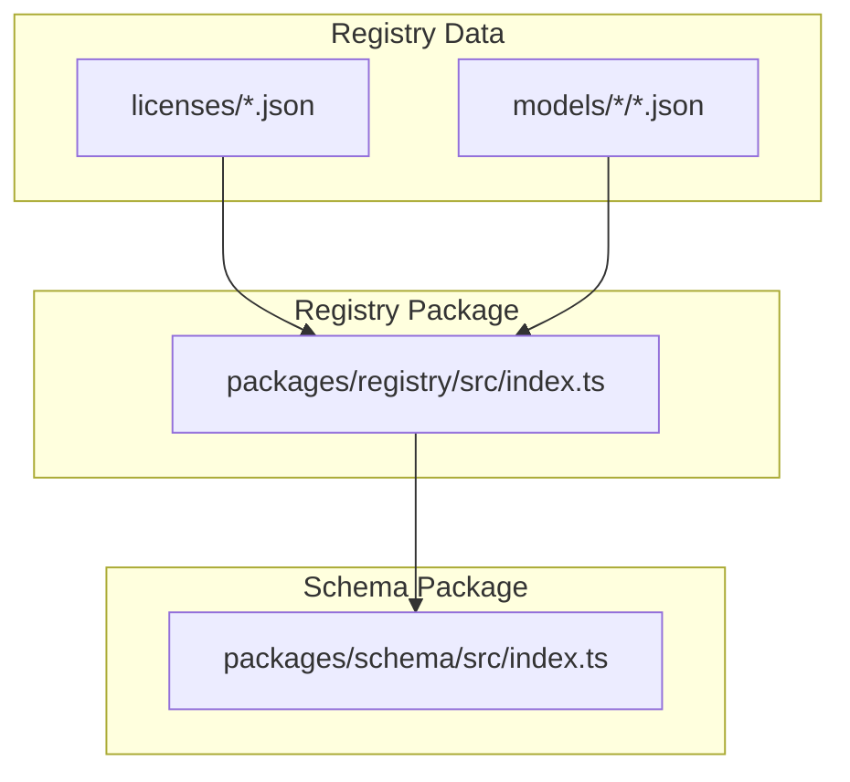
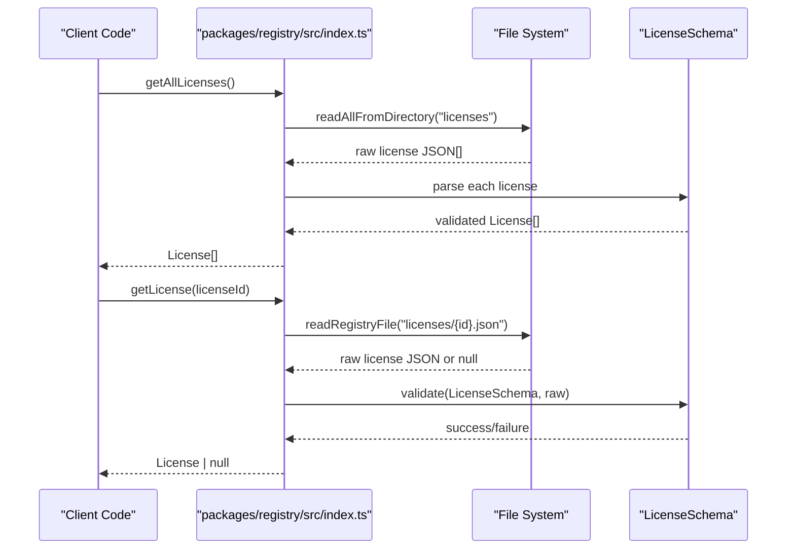
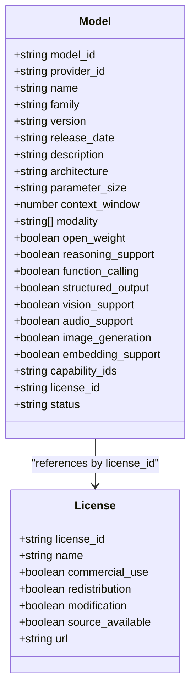
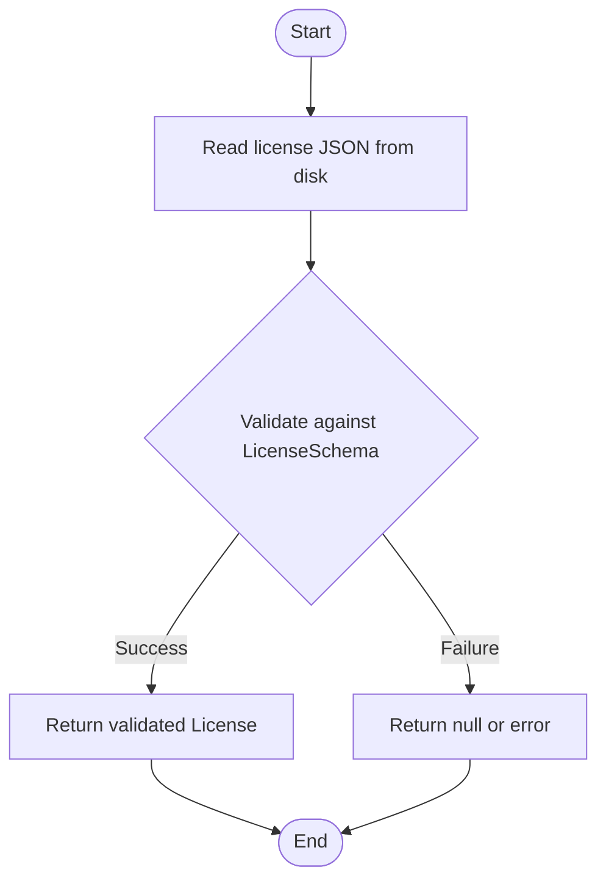
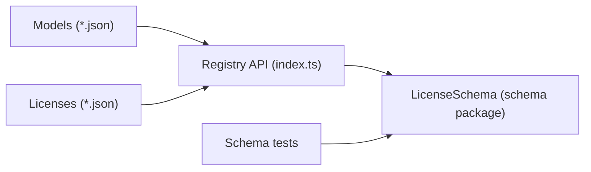

# License Schema

<cite>
**Referenced Files in This Document**
- [apache-2.0.json](file://data/registry/licenses/apache-2.0.json)
- [mit.json](file://data/registry/licenses/mit.json)
- [llama-3-community.json](file://data/registry/licenses/llama-3-community.json)
- [proprietary.json](file://data/registry/licenses/proprietary.json)
- [llama-3.1-70b.json](file://data/registry/models/meta/llama-3.1-70b.json)
- [gpt-4o.json](file://data/registry/models/openai/gpt-4o.json)
- [gemini-2.5-pro.json](file://data/registry/models/google/gemini-2.5-pro.json)
- [index.ts](file://packages/registry/src/index.ts)
- [schema.test.ts](file://packages/schema/src/__tests__/schema.test.ts)
</cite>

## Table of Contents
1. Introduction
2. Project Structure
3. Core Components
4. Architecture Overview
5. Detailed Component Analysis
6. Dependency Analysis
7. Performance Considerations
8. Troubleshooting Guide
9. Conclusion
10. Appendices

## Introduction
This document explains the License Schema used to track AI model licensing information in the registry. It covers the structure of license JSON files, how licenses are referenced by models, and how validation is performed during registration. It also provides examples for common licenses (Apache 2.0, MIT, Llama 3 Community, and Proprietary), clarifies usage rights such as commercial use and redistribution, and offers guidance for adding new license types while maintaining legal compliance.

## Project Structure
The registry stores licenses under data/registry/licenses as individual JSON files. Models reference a license via a license_id field that must match one of the defined license IDs. The registry package reads and validates these files using canonical schemas from the schema package.

**Diagram sources**
- [index.ts:156-168](file://packages/registry/src/index.ts#L156-L168)
- [schema.test.ts](file://packages/schema/src/__tests__/schema.test.ts)

**Section sources**
- [index.ts:156-168](file://packages/registry/src/index.ts#L156-L168)

## Core Components
- License entity: Each license file defines an immutable contract with fields describing permissions and attribution requirements.
- Model entity: Each model references a license through a license_id string that must correspond to a valid license file.
- Registry API: Functions read all licenses and validate them against the canonical LicenseSchema; they also resolve a single license by ID.

Key license fields observed across existing files:
- license_id: Unique identifier for the license type.
- name: Human-readable license name.
- commercial_use: Boolean indicating whether commercial usage is permitted.
- redistribution: Boolean indicating whether redistributing the model or outputs is allowed.
- modification: Boolean indicating whether modifying the model or its artifacts is allowed.
- source_available: Boolean indicating if source code or weights are publicly available.
- url: Link to the official license text or terms.

Note: Some license files do not include a url field; this is acceptable based on existing data.

**Section sources**
- [apache-2.0.json:1-10](file://data/registry/licenses/apache-2.0.json#L1-L10)
- [mit.json:1-10](file://data/registry/licenses/mit.json#L1-L10)
- [llama-3-community.json:1-10](file://data/registry/licenses/llama-3-community.json#L1-L10)
- [proprietary.json:1-9](file://data/registry/licenses/proprietary.json#L1-L9)
- [index.ts:156-168](file://packages/registry/src/index.ts#L156-L168)

## Architecture Overview
License resolution and validation flow:
- Registry reads all license JSON files from data/registry/licenses.
- Each license is parsed and validated against LicenseSchema.
- Models reference a license via license_id; consumers can fetch a specific license by ID and validate it before use.

**Diagram sources**
- [index.ts:156-168](file://packages/registry/src/index.ts#L156-L168)

**Section sources**
- [index.ts:156-168](file://packages/registry/src/index.ts#L156-L168)

## Detailed Component Analysis

### License Schema Fields and Semantics
- license_id: Stable slug used to link models to licenses. Must be unique across the registry.
- name: Display name for UI and documentation.
- commercial_use: If true, models under this license may be used commercially; if false, commercial use is restricted.
- redistribution: If true, you may redistribute the model or outputs; if false, redistribution is prohibited.
- modification: If true, derivatives or modifications are allowed; if false, no modifications permitted.
- source_available: Indicates availability of source code or weights.
- url: Optional link to the full license text or terms.

These fields collectively define usage rights and obligations for downstream consumers.

**Section sources**
- [apache-2.0.json:1-10](file://data/registry/licenses/apache-2.0.json#L1-L10)
- [mit.json:1-10](file://data/registry/licenses/mit.json#L1-L10)
- [llama-3-community.json:1-10](file://data/registry/licenses/llama-3-community.json#L1-L10)
- [proprietary.json:1-9](file://data/registry/licenses/proprietary.json#L1-L9)

### How Licenses Are Referenced in Model Schemas
- Models include a license_id field that points to a license file by its id.
- Example: A model referencing "llama-3-community" indicates it uses the Llama 3 Community License.
- Example: A model referencing "proprietary" indicates it is governed by proprietary terms.

**Diagram sources**
- [llama-3.1-70b.json:1-25](file://data/registry/models/meta/llama-3.1-70b.json#L1-L25)
- [gpt-4o.json:1-37](file://data/registry/models/openai/gpt-4o.json#L1-L37)

**Section sources**
- [llama-3.1-70b.json:1-25](file://data/registry/models/meta/llama-3.1-70b.json#L1-L25)
- [gpt-4o.json:1-37](file://data/registry/models/openai/gpt-4o.json#L1-L37)

### Validation During Registration
- All licenses are loaded and validated using LicenseSchema.parse().
- Individual license retrieval validates the raw JSON against LicenseSchema before returning.
- Consumers should rely on these validations to ensure consistency and correctness.

**Diagram sources**
- [index.ts:156-168](file://packages/registry/src/index.ts#L156-L168)

**Section sources**
- [index.ts:156-168](file://packages/registry/src/index.ts#L156-L168)

### Examples of Common Licenses
- Apache 2.0: Permissive license allowing commercial use, redistribution, and modification; source available; includes a URL to the license text.
- MIT: Highly permissive license allowing commercial use, redistribution, and modification; source available; includes a URL to the license text.
- Llama 3 Community: Allows commercial use, redistribution, and modification; source available; includes a URL to the license terms.
- Proprietary: Commercial use may be allowed depending on terms; redistribution and modification are typically not allowed; source not available; no URL required.

Usage implications:
- Commercial use: Determines whether you can monetize services built on the model.
- Redistribution: Determines whether you can share the model or outputs with others.
- Modification: Determines whether you can create derivative works.
- Source availability: Indicates if source code or weights are accessible.

**Section sources**
- [apache-2.0.json:1-10](file://data/registry/licenses/apache-2.0.json#L1-L10)
- [mit.json:1-10](file://data/registry/licenses/mit.json#L1-L10)
- [llama-3-community.json:1-10](file://data/registry/licenses/llama-3-community.json#L1-L10)
- [proprietary.json:1-9](file://data/registry/licenses/proprietary.json#L1-L9)

## Dependency Analysis
- Registry functions depend on the schema package for parsing and validation.
- Models depend on licenses via license_id; consumers must ensure the referenced license exists and is valid.
- Tests exercise schema validation to maintain integrity.

**Diagram sources**
- [index.ts:156-168](file://packages/registry/src/index.ts#L156-L168)
- [schema.test.ts](file://packages/schema/src/__tests__/schema.test.ts)

**Section sources**
- [index.ts:156-168](file://packages/registry/src/index.ts#L156-L168)
- [schema.test.ts](file://packages/schema/src/__tests__/schema.test.ts)

## Performance Considerations
- Reading and validating all licenses is lightweight; however, avoid repeated I/O in hot paths by caching results where appropriate.
- Prefer getLicense(id) when only a specific license is needed to minimize disk reads.
- Batch operations (getAllLicenses) are suitable for initialization or snapshot generation.

[No sources needed since this section provides general guidance]

## Troubleshooting Guide
Common issues and resolutions:
- Missing license_id in a model: Ensure the model’s license_id matches an existing license file name.
- Invalid license JSON: Check for missing required fields or incorrect types; validate using LicenseSchema.parse().
- Non-existent license reference: Verify the license file exists under data/registry/licenses and that the id matches exactly.
- Validation failures: Inspect error messages from the validator and correct schema violations.

**Section sources**
- [index.ts:156-168](file://packages/registry/src/index.ts#L156-L168)

## Conclusion
The License Schema provides a clear, validated contract for tracking AI model licensing information. By standardizing fields like license_id, name, commercial_use, redistribution, modification, source_available, and url, the registry ensures consistent enforcement of usage rights. Models reference licenses via license_id, and the registry validates both license definitions and references, enabling reliable compliance checks and informed decision-making for commercial and redistribution policies.

[No sources needed since this section summarizes without analyzing specific files]

## Appendices

### Guidance for Adding New License Types
Steps:
1. Create a new JSON file under data/registry/licenses named after the license_id.
2. Include all relevant fields: license_id, name, commercial_use, redistribution, modification, source_available, and url (if applicable).
3. Validate the file using LicenseSchema.parse() to ensure correctness.
4. Reference the new license_id in model files that adopt this license.
5. Run tests to confirm schema validation passes.

Best practices:
- Keep license_id stable and descriptive.
- Provide accurate boolean flags reflecting actual permissions.
- Include a url to the authoritative license text when available.
- Review legal implications carefully before setting commercial_use, redistribution, and modification flags.

[No sources needed since this section provides general guidance]