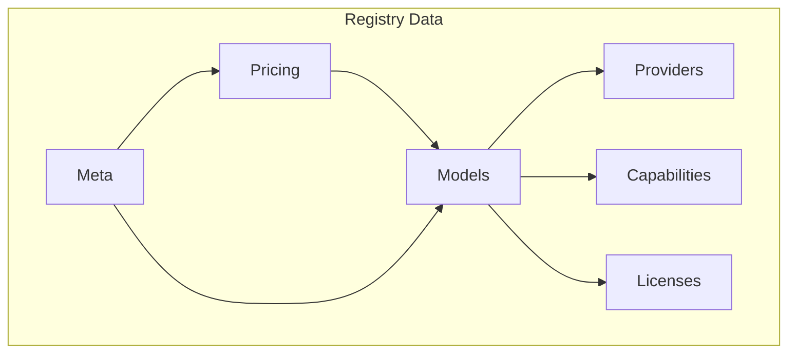
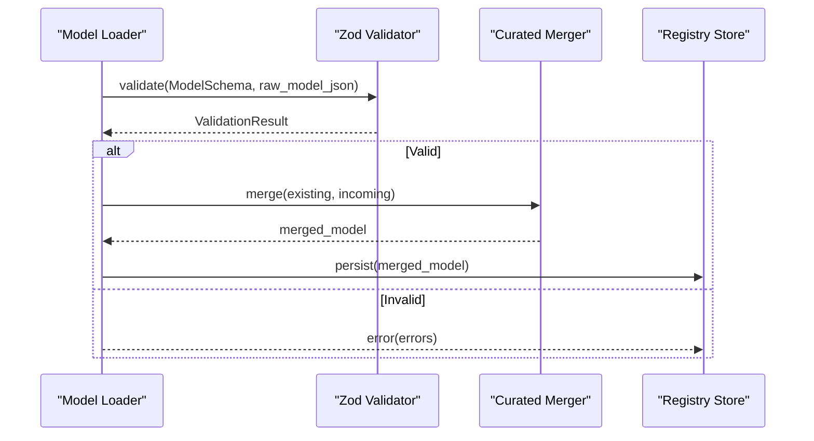
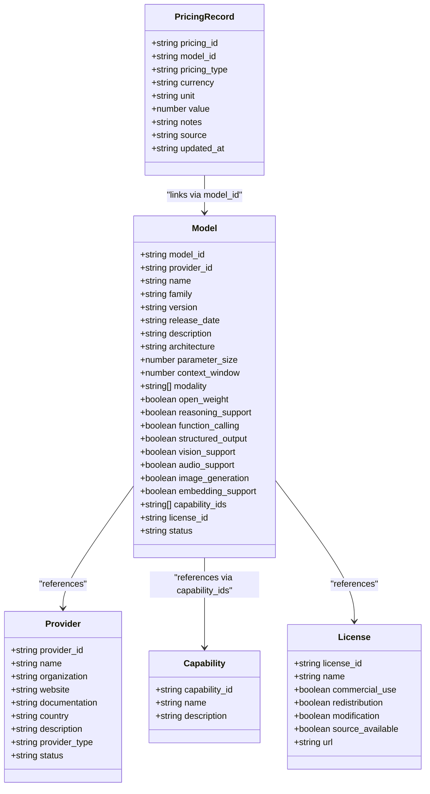

# Model Schema

<cite>
**Referenced Files in This Document**
- [05_Data_Model.md](file://docs/05_Data_Model.md)
- [meta.json](file://data/registry/meta.json)
- [gpt-4o.json](file://data/registry/models/openai/gpt-4o.json)
- [claude-3-5-sonnet.json](file://data/registry/models/anthropic/claude-3-5-sonnet.json)
- [gemini-2.5-pro.json](file://data/registry/models/deepinfra/gemini-2.5-pro.json)
- [openai.json](file://data/registry/providers/openai.json)
- [openai.json](file://data/registry/pricing/openai.json)
- [text-generation.json](file://data/registry/capabilities/text-generation.json)
- [vision.json](file://data/registry/capabilities/vision.json)
- [code-generation.json](file://data/registry/capabilities/code-generation.json)
- [tool-calling.json](file://data/registry/capabilities/tool-calling.json)
- [proprietary.json](file://data/registry/licenses/proprietary.json)
- [validation.ts](file://packages/registry/src/validation.ts)
- [merge.ts](file://packages/registry/src/merge.ts)
- [model.test.ts](file://packages/registry/src/__tests__/model.test.ts)
</cite>

## Table of Contents
1. Introduction
2. Project Structure
3. Core Components
4. Architecture Overview
5. Detailed Component Analysis
6. Dependency Analysis
7. Performance Considerations
8. Troubleshooting Guide
9. Conclusion
10. Appendices

## Introduction
This document defines the Model Schema used by the registry to describe AI models across providers. It explains all fields, including model_id, name, provider_id, capabilities, pricing, context_window, and supported formats (modalities). It also documents nested objects such as input_modalities/output_modalities where applicable, and how pricing is represented as a list of pricing tiers. The guide includes complete examples from major models like GPT-4o, Claude 3.5 Sonnet, and Gemini 2.5 Pro, outlines validation constraints, clarifies relationships to provider schemas, and provides guidelines for adding new models while maintaining data consistency.

## Project Structure
The registry organizes data into distinct directories:
- Providers: metadata about each provider organization
- Models: per-model JSON files grouped by provider
- Pricing: per-provider pricing catalogs as arrays of pricing records
- Capabilities: normalized capability definitions referenced by models
- Licenses: canonical license definitions referenced by models
- Meta: generated registry metadata and coverage statistics

**Diagram sources**
- [meta.json:1-18](file://data/registry/meta.json#L1-L18)

**Section sources**
- [meta.json:1-18](file://data/registry/meta.json#L1-L18)

## Core Components
The canonical domain model defines the following core entities and their responsibilities:
- Provider: organization that develops or distributes models
- Model: uniquely identifiable AI model with attributes describing capabilities and limits
- Capability: normalized capability shared across many models
- Benchmark: evaluation result for a model
- Pricing: pricing information for a model
- API: access method for a model
- License: legal terms governing a model

For the Model entity, key fields include model_id, provider_id, name, family, version, release_date, description, architecture, parameter_size, context_window, modality, open_weight, reasoning_support, function_calling, structured_output, vision_support, audio_support, image_generation, embedding_support, capability_ids, license_id, status, and optional fields such as tier and limits.

**Section sources**
- [05_Data_Model.md:23-69](file://docs/05_Data_Model.md#L23-L69)

## Architecture Overview
The registry schema enforces consistency through Zod-based validation and curated merging rules. Model files are validated against a central schema, and curated fields take precedence over collector-supplied values. Pricing is stored separately per provider and linked via model_id.

**Diagram sources**
- [validation.ts:11-20](file://packages/registry/src/validation.ts#L11-L20)
- [merge.ts:47-68](file://packages/registry/src/merge.ts#L47-L68)

**Section sources**
- [validation.ts:11-20](file://packages/registry/src/validation.ts#L11-L20)
- [merge.ts:47-68](file://packages/registry/src/merge.ts#L47-L68)

## Detailed Component Analysis

### Model Entity Fields and Constraints
- model_id: unique identifier using kebab-case provider slug and model slug; format {provider_id}/{model-slug}
- provider_id: references a provider definition
- name: human-readable model name
- family/version/release_date: optional versioning metadata
- description/architecture/parameter_size: optional descriptive metadata
- context_window: integer token limit for input context
- modality: array of supported modalities (e.g., text, image); serves as supported_formats for inputs/outputs
- open_weight: boolean indicating if weights are open
- reasoning_support/function_calling/structured_output: boolean flags for feature support
- vision_support/audio_support/image_generation/embedding_support: boolean flags for specific capabilities
- capability_ids: array referencing normalized capability definitions
- license_id: references a license definition
- status: lifecycle state (e.g., active)
- Optional fields observed in practice: is_free, tier, limits.max_input_tokens, updated_at

Validation behavior:
- Validation uses a Zod schema to enforce types and required fields
- Curated fields override collector values during merges
- Errors are collected and reported with path details

**Section sources**
- [05_Data_Model.md:41-69](file://docs/05_Data_Model.md#L41-L69)
- [validation.ts:11-20](file://packages/registry/src/validation.ts#L11-L20)
- [merge.ts:47-68](file://packages/registry/src/merge.ts#L47-L68)

### Input Modalities and Output Modalities
- Supported formats are expressed via the modality field on the model record
- Examples show modalities such as ["text"] or ["text", "image"]
- For explicit separation of input vs output modalities, use consistent naming conventions and ensure downstream consumers interpret them correctly; currently, modality represents both input and output capabilities unless otherwise specified

**Section sources**
- [gpt-4o.json:11-13](file://data/registry/models/openai/gpt-4o.json#L11-L13)
- [claude-3-5-sonnet.json:11-11](file://data/registry/models/anthropic/claude-3-5-sonnet.json#L11-L11)

### Pricing Tiers and Catalogs
- Pricing is represented as an array of pricing records per provider
- Each record includes:
  - pricing_id: unique identifier for the pricing entry
  - model_id: links to the model
  - pricing_type: e.g., input-token, output-token
  - currency: ISO currency code
  - unit: cost basis (e.g., 1M tokens)
  - value: numeric price per unit
  - source: origin of the pricing data
  - updated_at: timestamp of last update

Examples demonstrate separate input and output token pricing entries for the same model.

**Section sources**
- [openai.json:1-783](file://data/registry/pricing/openai.json#L1-L783)

### Capabilities Standardization
- Capabilities are defined centrally and referenced by models via capability_ids
- Example capabilities include text-generation, code-generation, vision, tool-calling
- This ensures standardized capability descriptions across providers

**Section sources**
- [text-generation.json:1-6](file://data/registry/capabilities/text-generation.json#L1-L6)
- [code-generation.json:1-6](file://data/registry/capabilities/code-generation.json#L1-L6)
- [vision.json:1-6](file://data/registry/capabilities/vision.json#L1-L6)
- [tool-calling.json:1-6](file://data/registry/capabilities/tool-calling.json#L1-L6)

### License Definitions
- Licenses are defined centrally and referenced by models via license_id
- Example license includes proprietary with commercial_use, redistribution, modification, and source_available flags

**Section sources**
- [proprietary.json:1-9](file://data/registry/licenses/proprietary.json#L1-L9)

### Provider Relationships
- Models reference providers via provider_id
- Provider definitions include organization, website, documentation, country, description, status, and provider_type

**Section sources**
- [openai.json:1-11](file://data/registry/providers/openai.json#L1-L11)

### Complete Model Examples

#### GPT-4o (OpenAI)
- model_id: openai/gpt-4o
- provider_id: openai
- name: gpt-4o
- family/version/release_date: present
- context_window: 128000
- modality: ["text"]
- Boolean flags: function_calling true, structured_output true, vision_support true
- capability_ids: text-generation, code-generation, vision, tool-calling
- license_id: proprietary
- status: active
- Additional fields: is_free false, tier balanced, limits.max_input_tokens 128000, updated_at timestamp

**Section sources**
- [gpt-4o.json:1-37](file://data/registry/models/openai/gpt-4o.json#L1-L37)

#### Claude 3.5 Sonnet (Anthropic)
- model_id: anthropic/claude-3-5-sonnet
- provider_id: anthropic
- name: Claude 3.5 Sonnet
- family/version/release_date: present
- context_window: 200000
- modality: ["text", "image"]
- Boolean flags: function_calling true, structured_output true, vision_support true
- capability_ids: text-generation, code-generation, vision, tool-calling
- license_id: proprietary
- status: active

**Section sources**
- [claude-3-5-sonnet.json:1-24](file://data/registry/models/anthropic/claude-3-5-sonnet.json#L1-L24)

#### Gemini 2.5 Pro (DeepInfra)
- model_id: deepinfra/gemini-2.5-pro
- provider_id: deepinfra
- name: google/gemini-2.5-pro
- context_window: 1048576
- modality: ["text"]
- Boolean flags: function_calling false, structured_output false, vision_support false
- capability_ids: empty array
- status: active
- Additional fields: is_free false, tier balanced, limits.max_input_tokens 1048576, updated_at timestamp

**Section sources**
- [gemini-2.5-pro.json:1-26](file://data/registry/models/deepinfra/gemini-2.5-pro.json#L1-L26)

### Validation Constraints and Error Handling
- Validation uses safe parsing to avoid throwing errors
- Returns a structured result with success flag and either data or errors
- For multiple records, collects valid and invalid entries with row-level errors
- Curated fields always win over incoming collector data during merges

**Section sources**
- [validation.ts:11-20](file://packages/registry/src/validation.ts#L11-L20)
- [validation.ts:25-42](file://packages/registry/src/validation.ts#L25-L42)
- [merge.ts:47-68](file://packages/registry/src/merge.ts#L47-L68)

### How Model Capabilities Are Standardized Across Providers
- Capability IDs are centralized and referenced consistently
- Models declare capabilities via capability_ids rather than ad-hoc strings
- This enables uniform filtering, comparison, and discovery across providers

**Section sources**
- [text-generation.json:1-6](file://data/registry/capabilities/text-generation.json#L1-L6)
- [code-generation.json:1-6](file://data/registry/capabilities/code-generation.json#L1-L6)
- [vision.json:1-6](file://data/registry/capabilities/vision.json#L1-L6)
- [tool-calling.json:1-6](file://data/registry/capabilities/tool-calling.json#L1-L6)

## Dependency Analysis
The registry enforces dependencies between entities:
- Models depend on providers, capabilities, and licenses
- Pricing depends on models
- Meta aggregates counts and sources

**Diagram sources**
- [openai.json:1-11](file://data/registry/providers/openai.json#L1-L11)
- [gpt-4o.json:1-37](file://data/registry/models/openai/gpt-4o.json#L1-L37)
- [text-generation.json:1-6](file://data/registry/capabilities/text-generation.json#L1-L6)
- [proprietary.json:1-9](file://data/registry/licenses/proprietary.json#L1-L9)
- [openai.json:1-783](file://data/registry/pricing/openai.json#L1-L783)

**Section sources**
- [meta.json:1-18](file://data/registry/meta.json#L1-L18)

## Performance Considerations
- Validation is performed per record; batch validation collects errors efficiently
- Merging prioritizes curated fields to reduce redundant updates
- Pricing catalogs are large arrays; consumers should filter by model_id to minimize processing
- Context windows can be very large; ensure consumers handle high token counts appropriately

[No sources needed since this section provides general guidance]

## Troubleshooting Guide
Common issues and resolutions:
- Validation failures: check field types and required fields; review error paths and messages
- Missing capability_ids: ensure capability definitions exist and IDs match exactly
- Inconsistent modalities: verify modality arrays reflect actual input/output capabilities
- Pricing mismatches: confirm model_id matches exactly and pricing_type aligns with usage expectations
- Provider references: ensure provider_id exists and is correct

Use the validation utilities to diagnose issues:
- Single-record validation returns structured errors
- Batch validation lists invalid rows with detailed errors

**Section sources**
- [validation.ts:11-20](file://packages/registry/src/validation.ts#L11-L20)
- [validation.ts:25-42](file://packages/registry/src/validation.ts#L25-L42)

## Conclusion
The Model Schema standardizes how AI models are described across providers, enabling consistent discovery, comparison, and integration. By centralizing capabilities and licenses, separating pricing catalogs, and enforcing validation, the registry maintains data integrity and scalability. Following the guidelines here will help maintain consistency when adding new models and integrating with existing systems.

[No sources needed since this section summarizes without analyzing specific files]

## Appendices

### Guidelines for Adding New Models
- Create a new JSON file under data/registry/models/{provider_id}/{model_slug}.json
- Include required fields: model_id, provider_id, name, modality, status
- Set context_window and boolean capability flags accurately
- Reference capability_ids from the capabilities directory
- Reference license_id from the licenses directory
- Ensure provider_id exists in the providers directory
- Add pricing entries under data/registry/pricing/{provider_id}.json with appropriate pricing_type and units
- Validate using the provided validation utilities before committing

**Section sources**
- [model.test.ts:18-37](file://packages/registry/src/__tests__/model.test.ts#L18-L37)
- [validation.ts:11-20](file://packages/registry/src/validation.ts#L11-L20)
- [merge.ts:47-68](file://packages/registry/src/merge.ts#L47-L68)