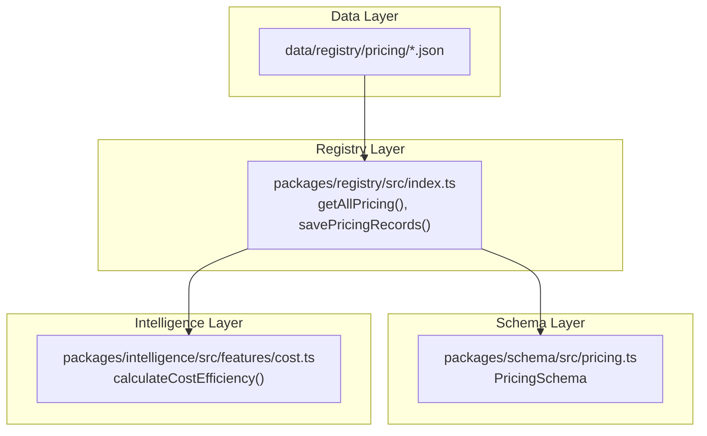
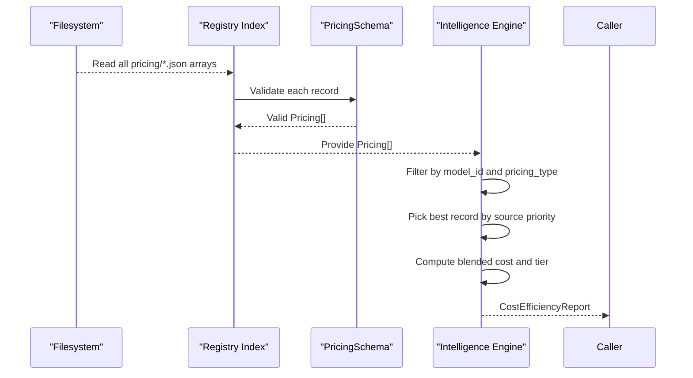
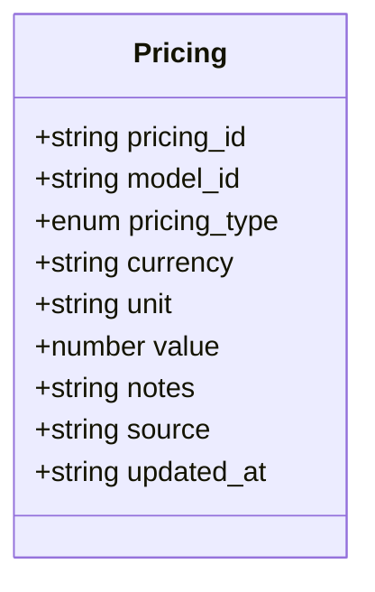
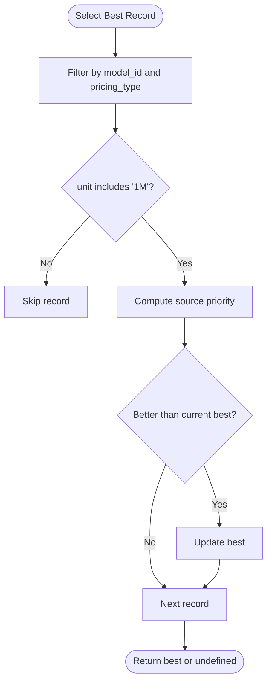
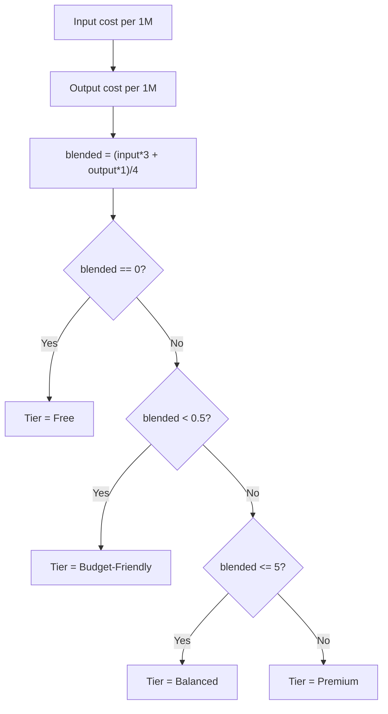
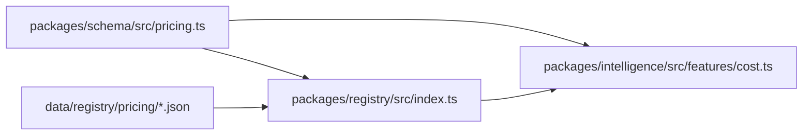

# Pricing Schema

<cite>
**Referenced Files in This Document**
- [pricing.ts](file://packages/schema/src/pricing.ts)
- [cost.ts](file://packages/schema/src/cost.ts)
- [index.ts](file://packages/registry/src/index.ts)
- [cost.ts](file://packages/intelligence/src/features/cost.ts)
- [openai.json](file://data/registry/pricing/openai.json)
- [anthropic.json](file://data/registry/pricing/anthropic.json)
- [google.json](file://data/registry/pricing/google.json)
- [mistral-ai.json](file://data/registry/pricing/mistral-ai.json)
- [groq.json](file://data/registry/pricing/groq.json)
- [deepinfra.json](file://data/registry/pricing/deepinfra.json)
- [openrouter.json](file://data/registry/pricing/openrouter.json)
</cite>

## Table of Contents
1. [Introduction](#introduction)
2. [Project Structure](#project-structure)
3. [Core Components](#core-components)
4. [Architecture Overview](#architecture-overview)
5. [Detailed Component Analysis](#detailed-component-analysis)
6. [Dependency Analysis](#dependency-analysis)
7. [Performance Considerations](#performance-considerations)
8. [Troubleshooting Guide](#troubleshooting-guide)
9. [Conclusion](#conclusion)
10. [Appendices](#appendices)

## Introduction
This document defines the Pricing Schema used to standardize cost information across AI model providers. It explains the structure of pricing JSON files, how input and output token costs are represented, how request-based and subscription-based pricing is modeled, and how currency and units are handled. It also covers validation rules, price update procedures, and guidance for maintaining accurate data and handling regional differences. Examples from major providers illustrate different pricing models.

## Project Structure
Pricing data is stored as one JSON array per provider under data/registry/pricing. Each record represents a single pricing dimension (e.g., input-token or output-token) with consistent fields. The registry layer reads all arrays, validates them against a canonical schema, and exposes APIs to read and write records. The intelligence layer consumes these records to compute blended costs and classify tiers.

**Diagram sources**
- [index.ts:124-147](file://packages/registry/src/index.ts#L124-L147)
- [pricing.ts:1-35](file://packages/schema/src/pricing.ts#L1-L35)
- [cost.ts:1-29](file://packages/intelligence/src/features/cost.ts#L1-L29)

**Section sources**
- [index.ts:124-147](file://packages/registry/src/index.ts#L124-L147)
- [pricing.ts:1-35](file://packages/schema/src/pricing.ts#L1-L35)

## Core Components
The Pricing entity is defined by a Zod schema that enforces field types, allowed values, and optional metadata:

- pricing_id: Unique identifier for the pricing record
- model_id: Provider/model identifier (e.g., openai/gpt-4o)
- pricing_type: Enumerated pricing mode
- currency: ISO 4217 code (optional; often omitted for free tiers)
- unit: Human-readable unit (e.g., “1M tokens”, “request”)
- value: Numeric cost per unit (non-negative; zero for free)
- notes: Optional descriptive text
- source: Provenance tag (e.g., “openrouter”, “huggingface”, or provider id)
- updated_at: ISO 8601 timestamp set on every save

Supported pricing_type values include free, input-token, output-token, cached-token, request, and subscription. Units vary by type; most token-based prices use “1M tokens”. Currency is typically USD but can be any valid three-letter code.

Examples of records exist for OpenAI, Anthropic, Google, Mistral AI, Groq, DeepInfra, and OpenRouter, demonstrating input/output token pricing and free tiers.

**Section sources**
- [pricing.ts:1-35](file://packages/schema/src/pricing.ts#L1-L35)
- [openai.json:1-20](file://data/registry/pricing/openai.json#L1-L20)
- [anthropic.json:1-20](file://data/registry/pricing/anthropic.json#L1-L20)
- [google.json:1-20](file://data/registry/pricing/google.json#L1-L20)
- [mistral-ai.json:1-20](file://data/registry/pricing/mistral-ai.json#L1-L20)
- [groq.json:1-20](file://data/registry/pricing/groq.json#L1-L20)
- [deepinfra.json:1-20](file://data/registry/pricing/deepinfra.json#L1-L20)
- [openrouter.json:1-20](file://data/registry/pricing/openrouter.json#L1-L20)

## Architecture Overview
The system loads pricing arrays from disk, validates them against the schema, and makes them available to consumers. Consumers select the best record per model and pricing type using a deterministic priority based on provenance. Blended cost is computed using fixed weights to estimate typical usage patterns.

**Diagram sources**
- [index.ts:124-147](file://packages/registry/src/index.ts#L124-L147)
- [pricing.ts:1-35](file://packages/schema/src/pricing.ts#L1-L35)
- [cost.ts:1-29](file://packages/intelligence/src/features/cost.ts#L1-L29)

**Section sources**
- [index.ts:124-147](file://packages/registry/src/index.ts#L124-L147)
- [cost.ts:1-29](file://packages/intelligence/src/features/cost.ts#L1-L29)

## Detailed Component Analysis

### Pricing Schema Definition
The schema enforces:
- pricing_id and model_id must be non-empty strings
- pricing_type must be one of the enumerated modes
- currency is an optional three-character string
- unit is optional
- value is optional but must be non-negative when present
- notes is optional
- source is optional
- updated_at is optional datetime

This ensures consistency across all provider pricing files and enables safe downstream processing.

**Section sources**
- [pricing.ts:1-35](file://packages/schema/src/pricing.ts#L1-L35)

### Data Model and Relationships
Each pricing file is an array of records. Records share common fields and differ by model_id and pricing_type. A single model may have multiple records (input-token, output-token, cached-token, request, subscription). Provenance via source allows deterministic selection when duplicates exist.

**Diagram sources**
- [pricing.ts:1-35](file://packages/schema/src/pricing.ts#L1-L35)

**Section sources**
- [pricing.ts:1-35](file://packages/schema/src/pricing.ts#L1-L35)

### Record Selection and Priority
When multiple records match a model and pricing type, the engine selects the highest-priority provenance:
- Provider-owned catalog (source equals model’s provider id) has highest priority
- OpenRouter aggregate next
- Other gateway catalogs follow
- Hugging Face lower priority
- Unspecified source lowest

This removes last-write-wins nondeterminism.

**Diagram sources**
- [cost.ts:31-48](file://packages/intelligence/src/features/cost.ts#L31-L48)

**Section sources**
- [cost.ts:31-48](file://packages/intelligence/src/features/cost.ts#L31-L48)

### Blended Cost and Tier Classification
Blended cost uses fixed weights to approximate typical input/output ratios:
- INPUT_WEIGHT = 3
- OUTPUT_WEIGHT = 1
- BLENDED_DIVISOR = 4

Tier classification:
- Free if either explicit free pricing or both input and output are zero
- Budget-Friendly if blended < 0.5
- Balanced if blended <= 5
- Premium otherwise

**Diagram sources**
- [cost.ts:1-12](file://packages/schema/src/cost.ts#L1-L12)
- [cost.ts:85-114](file://packages/intelligence/src/features/cost.ts#L85-L114)

**Section sources**
- [cost.ts:1-12](file://packages/schema/src/cost.ts#L1-L12)
- [cost.ts:85-114](file://packages/intelligence/src/features/cost.ts#L85-L114)

### Provider Examples and Pricing Models
- Per-token pricing: Most records use input-token and output-token with unit “1M tokens” and numeric value representing cost per million tokens. See examples in OpenAI, Anthropic, Google, Mistral AI, Groq, DeepInfra, and OpenRouter files.
- Free pricing: Some entries use pricing_type “free” with value 0, indicating no charge.
- Request-based pricing: Supported via pricing_type “request”; unit typically “request”.
- Subscription-based pricing: Supported via pricing_type “subscription”; unit may reflect a time period.

These patterns appear consistently across provider files, enabling uniform consumption.

**Section sources**
- [openai.json:1-20](file://data/registry/pricing/openai.json#L1-L20)
- [anthropic.json:1-20](file://data/registry/pricing/anthropic.json#L1-L20)
- [google.json:1-20](file://data/registry/pricing/google.json#L1-L20)
- [mistral-ai.json:1-20](file://data/registry/pricing/mistral-ai.json#L1-L20)
- [groq.json:1-20](file://data/registry/pricing/groq.json#L1-L20)
- [deepinfra.json:1-20](file://data/registry/pricing/deepinfra.json#L1-L20)
- [openrouter.json:1-20](file://data/registry/pricing/openrouter.json#L1-L20)

### Validation Rules
- All records are validated through PricingSchema before being persisted or consumed.
- Non-negative numeric values enforced for value.
- Three-letter currency codes enforced where present.
- Datetime format enforced for updated_at.
- Enum constraints ensure only supported pricing_type values are accepted.

Validation occurs during read operations in the registry layer.

**Section sources**
- [pricing.ts:1-35](file://packages/schema/src/pricing.ts#L1-L35)
- [index.ts:124-129](file://packages/registry/src/index.ts#L124-L129)

### Price Update Procedures
- Reading: getAllPricing reads all pricing arrays and parses them through PricingSchema.
- Writing: savePricingRecords persists a provider’s records as a single array file, stamping updated_at timestamps.
- Clearing: clearPricingRegistry removes all pricing files to allow atomic rewrites.

These functions provide a controlled interface for updating pricing data safely.

**Section sources**
- [index.ts:124-147](file://packages/registry/src/index.ts#L124-L147)

### Regional Price Differences
Regional variants are represented by distinct model_id values (e.g., including region suffixes). Matching logic prefers exact slug matches and falls back to region-stripped slugs when necessary. This supports per-region pricing while keeping lookups efficient.

Guidance:
- Use unique model_id for each region variant
- Keep slug normalization consistent with collector behavior
- Prefer exact matches over fallbacks

[No sources needed since this section provides general guidance]

## Dependency Analysis
The registry depends on the schema for validation and the filesystem for persistence. The intelligence layer depends on the registry’s normalized pricing data and the shared cost utilities.

**Diagram sources**
- [pricing.ts:1-35](file://packages/schema/src/pricing.ts#L1-L35)
- [index.ts:124-147](file://packages/registry/src/index.ts#L124-L147)
- [cost.ts:1-29](file://packages/intelligence/src/features/cost.ts#L1-L29)

**Section sources**
- [pricing.ts:1-35](file://packages/schema/src/pricing.ts#L1-L35)
- [index.ts:124-147](file://packages/registry/src/index.ts#L124-L147)
- [cost.ts:1-29](file://packages/intelligence/src/features/cost.ts#L1-L29)

## Performance Considerations
- Filtering by model_id and pricing_type is linear in the number of pricing records; indexing by model_id can improve lookup performance at scale.
- Source priority computation is constant-time per record.
- Blended cost calculation is O(1).
- Avoid unnecessary parsing by caching validated arrays in memory for repeated queries.

[No sources needed since this section provides general guidance]

## Troubleshooting Guide
Common issues and resolutions:
- Invalid pricing_type: Ensure values are within the supported enum.
- Negative value: Adjust to non-negative numbers; use 0 for free tiers.
- Missing currency: Acceptable for free tiers; otherwise add a valid three-letter code.
- Stale timestamps: Ensure updated_at is set on every save operation.
- Duplicate records: Rely on source priority; prefer provider-owned catalogs.

If validation fails, inspect the offending record fields against PricingSchema constraints.

**Section sources**
- [pricing.ts:1-35](file://packages/schema/src/pricing.ts#L1-L35)
- [index.ts:124-129](file://packages/registry/src/index.ts#L124-L129)

## Conclusion
The Pricing Schema standardizes cost representation across providers, supporting token-based, request-based, and subscription-based models with robust validation and deterministic selection. By following the documented structure, validation rules, and update procedures, maintainers can keep pricing data accurate and reliable across regions and usage patterns.

[No sources needed since this section summarizes without analyzing specific files]

## Appendices

### Field Reference
- pricing_id: string, required
- model_id: string, required
- pricing_type: enum, required
- currency: string (ISO 4217), optional
- unit: string, optional
- value: number (non-negative), optional
- notes: string, optional
- source: string, optional
- updated_at: datetime (ISO 8601), optional

**Section sources**
- [pricing.ts:1-35](file://packages/schema/src/pricing.ts#L1-L35)

### Example Providers
- OpenAI: input-token and output-token with “1M tokens” unit
- Anthropic: similar per-token structure
- Google: includes free-tier entries
- Mistral AI: per-token pricing
- Groq: per-token pricing
- DeepInfra: per-token pricing
- OpenRouter: comprehensive coverage across many models

**Section sources**
- [openai.json:1-20](file://data/registry/pricing/openai.json#L1-L20)
- [anthropic.json:1-20](file://data/registry/pricing/anthropic.json#L1-L20)
- [google.json:1-20](file://data/registry/pricing/google.json#L1-L20)
- [mistral-ai.json:1-20](file://data/registry/pricing/mistral-ai.json#L1-L20)
- [groq.json:1-20](file://data/registry/pricing/groq.json#L1-L20)
- [deepinfra.json:1-20](file://data/registry/pricing/deepinfra.json#L1-L20)
- [openrouter.json:1-20](file://data/registry/pricing/openrouter.json#L1-L20)