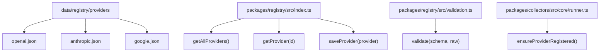
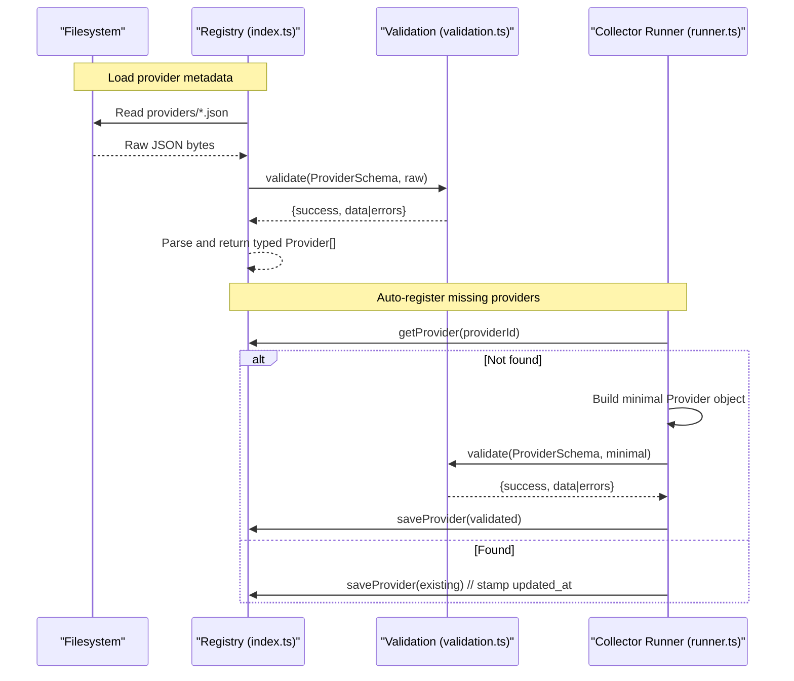
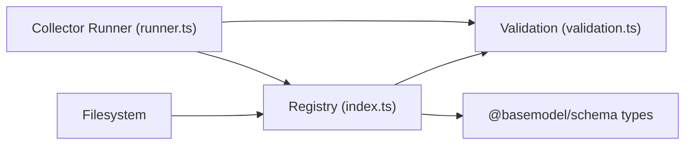

# Provider Schema

<cite>
**Referenced Files in This Document**
- [openai.json](file://data/registry/providers/openai.json)
- [anthropic.json](file://data/registry/providers/anthropic.json)
- [google.json](file://data/registry/providers/google.json)
- [index.ts](file://packages/registry/src/index.ts)
- [validation.ts](file://packages/registry/src/validation.ts)
- [provider.test.ts](file://packages/registry/src/__tests__/provider.test.ts)
- [runner.ts](file://packages/collectors/src/core/runner.ts)
</cite>

## Table of Contents
1. [Introduction](#introduction)
2. [Project Structure](#project-structure)
3. [Core Components](#core-components)
4. [Architecture Overview](#architecture-overview)
5. [Detailed Component Analysis](#detailed-component-analysis)
6. [Dependency Analysis](#dependency-analysis)
7. [Performance Considerations](#performance-considerations)
8. [Troubleshooting Guide](#troubleshooting-guide)
9. [Conclusion](#conclusion)
10. [Appendices](#appendices)

## Introduction
This document defines the Provider Schema used by BaseModel’s registry to describe AI providers. It explains the structure and validation rules for provider JSON files, including metadata fields such as provider_id, name, organization, website, documentation, country, description, status, and provider_type. It also clarifies how providers are loaded, validated, and persisted, and provides guidance on adding new providers while maintaining consistency.

Note: The current provider seed files focus on identity and catalog metadata. Authentication configuration (e.g., base_url, auth_type), rate limiting settings, and capability declarations are not present in these provider files; they are typically handled elsewhere in the system or via separate model/capability definitions.

## Project Structure
Provider records live under data/registry/providers/<provider_id>.json. Each file contains a single provider definition that is validated against the ProviderSchema before being consumed by the registry.

**Diagram sources**
- [index.ts:45-59](file://packages/registry/src/index.ts#L45-L59)
- [validation.ts:11-20](file://packages/registry/src/validation.ts#L11-L20)
- [runner.ts:338-363](file://packages/collectors/src/core/runner.ts#L338-L363)

**Section sources**
- [index.ts:45-59](file://packages/registry/src/index.ts#L45-L59)
- [validation.ts:11-20](file://packages/registry/src/validation.ts#L11-L20)
- [runner.ts:338-363](file://packages/collectors/src/core/runner.ts#L338-L363)

## Core Components
- Provider schema and validation: Provider JSON files are parsed and validated using a Zod-based schema exposed by @basemodel/schema. Validation returns either a success with typed data or an array of human-readable error paths and messages.
- Registry operations:
  - getAllProviders(): reads all provider files and parses them through the schema.
  - getProvider(providerId): loads a specific provider file and validates it.
  - saveProvider(provider): persists a provider record and stamps updated_at.
- Collector-driven registration: When models reference a provider for the first time, the collector can auto-register a minimal provider record if one does not exist, then validate and persist it.

Key behaviors:
- All provider files must pass ProviderSchema validation.
- Invalid inputs (e.g., malformed URLs, invalid enums) are rejected with detailed errors.
- Persistence includes an updated_at timestamp for freshness tracking.

**Section sources**
- [index.ts:45-59](file://packages/registry/src/index.ts#L45-L59)
- [validation.ts:11-20](file://packages/registry/src/validation.ts#L11-L20)
- [runner.ts:338-363](file://packages/collectors/src/core/runner.ts#L338-L363)

## Architecture Overview
The registry enforces a strict contract for provider metadata. Provider files are read from disk, validated against the schema, and returned as strongly-typed objects. Consumers rely on this contract to ensure consistent behavior across providers.

**Diagram sources**
- [index.ts:45-59](file://packages/registry/src/index.ts#L45-L59)
- [validation.ts:11-20](file://packages/registry/src/validation.ts#L11-L20)
- [runner.ts:338-363](file://packages/collectors/src/core/runner.ts#L338-L363)

## Detailed Component Analysis

### Provider Metadata Fields
Based on the seed files and tests, the following fields are used in provider JSON:

- provider_id: Unique identifier for the provider. Must be a lowercase slug without spaces.
- name: Human-readable provider name.
- organization: Legal entity or organization name.
- website: Valid URL string pointing to the provider’s website.
- documentation: Optional URL to provider documentation.
- country: ISO country code or similar region identifier.
- description: Short textual description of the provider.
- status: Enumerated lifecycle state (e.g., active).
- provider_type: Classification such as first-party or gateway.

Examples:
- OpenAI: Contains provider_id, name, organization, website, documentation, country, description, status, provider_type.
- Anthropic: Same set of fields as OpenAI.
- Google: Same set of fields as OpenAI.

These examples demonstrate the expected shape and values for a valid provider record.

**Section sources**
- [openai.json:1-11](file://data/registry/providers/openai.json#L1-L11)
- [anthropic.json:1-11](file://data/registry/providers/anthropic.json#L1-L11)
- [google.json:1-11](file://data/registry/providers/google.json#L1-L11)

### Validation Rules and Error Handling
- provider_id format: Rejects values with spaces or invalid characters.
- website: Must be a valid URL; rejects malformed strings.
- status: Must match allowed enum values; unknown values are rejected.
- General: Any field failing schema constraints produces a list of path-based error messages.

The validation utility wraps Zod parsing and returns structured results for both success and failure cases.

**Section sources**
- [provider.test.ts:27-62](file://packages/registry/src/__tests__/provider.test.ts#L27-L62)
- [validation.ts:11-20](file://packages/registry/src/validation.ts#L11-L20)

### Required vs Optional Fields
- Required fields (based on usage and tests):
  - provider_id, name, organization, website, provider_type, status
- Optional fields:
  - documentation, country, description

Guidance:
- Always include required fields when creating or updating provider records.
- Optional fields should be provided when available to improve discoverability and context.

**Section sources**
- [provider.test.ts:27-62](file://packages/registry/src/__tests__/provider.test.ts#L27-L62)
- [openai.json:1-11](file://data/registry/providers/openai.json#L1-L11)
- [anthropic.json:1-11](file://data/registry/providers/anthropic.json#L1-L11)
- [google.json:1-11](file://data/registry/providers/google.json#L1-L11)

### How Providers Extend the Base Schema
- Seed provider files define identity and catalog metadata only.
- The collector runner can auto-create a minimal provider record when encountering a new provider_id during model collection. It fills required fields and sets defaults (e.g., provider_type = 'gateway', status = 'active'), then validates and persists the record.
- This mechanism ensures that even transient providers referenced by models are registered consistently.

**Section sources**
- [runner.ts:338-363](file://packages/collectors/src/core/runner.ts#L338-L363)

### Authentication, Rate Limiting, and Capabilities
- Authentication configuration (e.g., base_url, auth_type) and rate limiting settings are not part of the provider seed files analyzed here. These concerns are typically managed at runtime or via separate configuration layers outside the provider metadata.
- Capability declarations are defined separately in the capabilities directory and linked to models rather than embedded in provider files.

[No sources needed since this section summarizes conceptual boundaries not present in the analyzed provider files]

## Dependency Analysis
The registry depends on:
- Filesystem access to read/write provider JSON files.
- Validation utilities to enforce schema constraints.
- Type definitions from @basemodel/schema for Provider type and schemas.

**Diagram sources**
- [index.ts:45-59](file://packages/registry/src/index.ts#L45-L59)
- [validation.ts:11-20](file://packages/registry/src/validation.ts#L11-L20)
- [runner.ts:338-363](file://packages/collectors/src/core/runner.ts#L338-L363)

**Section sources**
- [index.ts:45-59](file://packages/registry/src/index.ts#L45-L59)
- [validation.ts:11-20](file://packages/registry/src/validation.ts#L11-L20)
- [runner.ts:338-363](file://packages/collectors/src/core/runner.ts#L338-L363)

## Performance Considerations
- Reading and validating provider files is lightweight; batch operations use map and parse patterns suitable for small registries.
- Stamping updated_at on save enables consumers to detect staleness without heavy scanning.
- Avoid unnecessary re-parsing by caching validated provider objects at runtime where appropriate.

[No sources needed since this section provides general guidance]

## Troubleshooting Guide
Common issues and resolutions:
- Invalid provider_id: Ensure the identifier is a lowercase slug without spaces.
- Invalid website URL: Provide a well-formed URL string.
- Invalid status: Use allowed enum values (e.g., active).
- Missing required fields: Add all required fields when creating or editing provider records.

Use the validation output to locate exact field paths and messages for quick fixes.

**Section sources**
- [provider.test.ts:27-62](file://packages/registry/src/__tests__/provider.test.ts#L27-L62)
- [validation.ts:11-20](file://packages/registry/src/validation.ts#L11-L20)

## Conclusion
The Provider Schema in BaseModel’s registry standardizes provider metadata for discovery and governance. Seed files capture essential identity and catalog information, while validation ensures consistency. Auto-registration supports dynamic environments where providers are discovered through model references. Authentication, rate limiting, and capabilities are intentionally separated from provider metadata to maintain clarity and modularity.

[No sources needed since this section summarizes without analyzing specific files]

## Appendices

### Adding a New Provider
Steps:
1. Create data/registry/providers/<new_provider_id>.json with all required fields and any optional fields you have.
2. Validate locally using the registry’s validation utilities to catch errors early.
3. Commit the file; existing tests will assert that known providers pass validation.
4. If the provider is discovered dynamically via collectors, ensure the minimal auto-registration path remains valid.

Best practices:
- Keep provider_id stable and lowercase.
- Provide accurate website and documentation links.
- Set meaningful status and provider_type values.
- Include concise descriptions and organizations for clarity.

[No sources needed since this section provides procedural guidance]