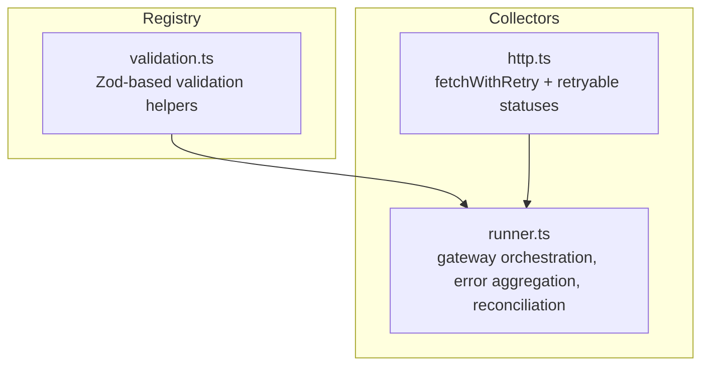
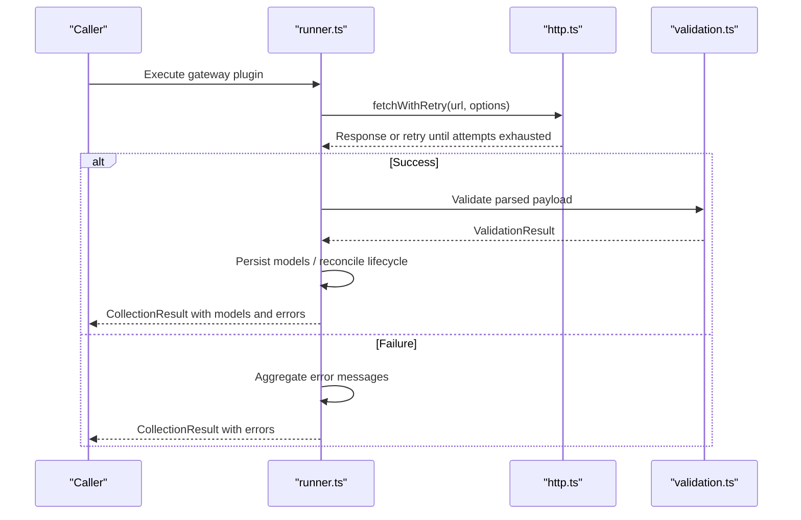
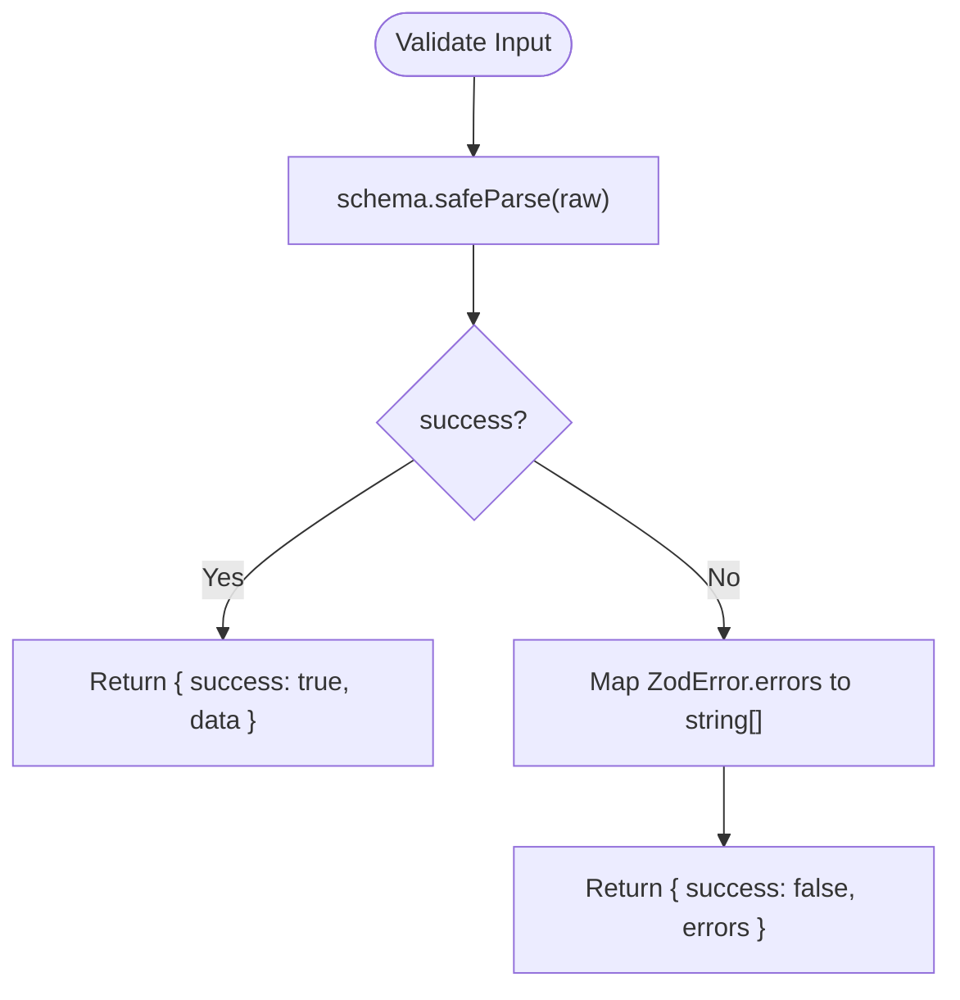
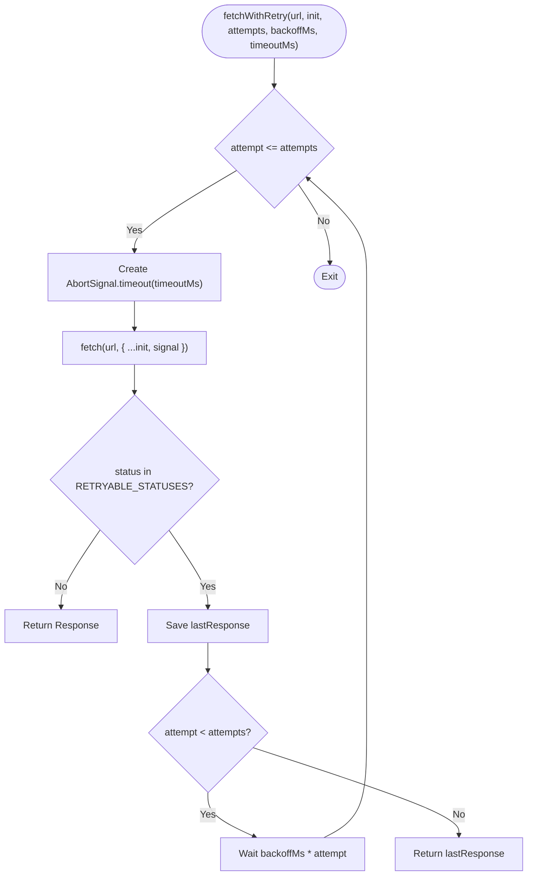
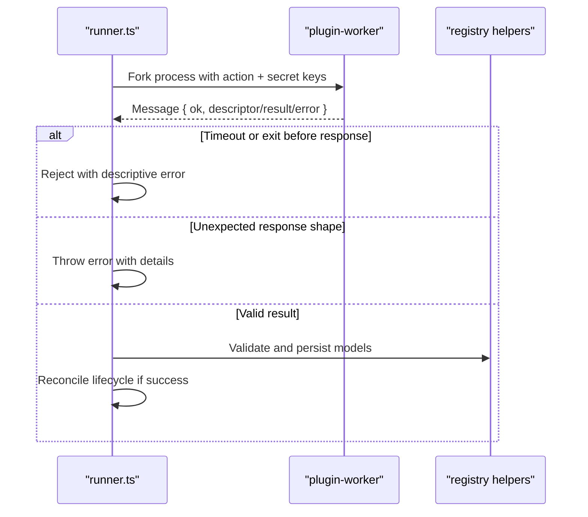
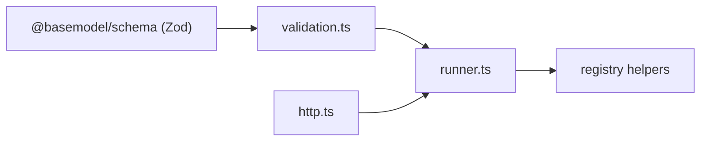

# Error Handling

<cite>
**Referenced Files in This Document**
- [validation.ts](file://packages/registry/src/validation.ts)
- [http.ts](file://packages/collectors/src/core/http.ts)
- [runner.ts](file://packages/collectors/src/core/runner.ts)
- [provider.test.ts](file://packages/registry/src/__tests__/provider.test.ts)
- [model.test.ts](file://packages/registry/src/__tests__/model.test.ts)
</cite>

## Table of Contents
1. [Introduction](#introduction)
2. [Project Structure](#project-structure)
3. [Core Components](#core-components)
4. [Architecture Overview](#architecture-overview)
5. [Detailed Component Analysis](#detailed-component-analysis)
6. [Dependency Analysis](#dependency-analysis)
7. [Performance Considerations](#performance-considerations)
8. [Troubleshooting Guide](#troubleshooting-guide)
9. [Conclusion](#conclusion)

## Introduction
This document provides comprehensive error handling guidance for the BaseModel system, focusing on validation errors from Zod schemas, network errors from provider APIs, and system-level errors encountered during collection and persistence. It specifies error response formats, logging conventions, debugging techniques, retry strategies, circuit breaker patterns, and graceful degradation approaches. Practical examples are provided as code snippet paths to help implement robust error recovery in client applications.

## Project Structure
The error handling surface spans three primary areas:
- Validation layer using Zod with non-throwing helpers that return structured results.
- Network layer with a shared HTTP helper implementing retries and timeouts.
- Collector runner orchestrating gateway plugins, aggregating errors, and reconciling lifecycle states.

**Diagram sources**
- [validation.ts:1-43](file://packages/registry/src/validation.ts#L1-L43)
- [http.ts:1-38](file://packages/collectors/src/core/http.ts#L1-L38)
- [runner.ts:1-475](file://packages/collectors/src/core/runner.ts#L1-L475)

**Section sources**
- [validation.ts:1-43](file://packages/registry/src/validation.ts#L1-L43)
- [http.ts:1-38](file://packages/collectors/src/core/http.ts#L1-L38)
- [runner.ts:1-475](file://packages/collectors/src/core/runner.ts#L1-L475)

## Core Components
- Validation helpers:
  - Non-throwing validate function returning a discriminated union result with success flag and either data or errors array.
  - Batch validation helper that separates valid records and invalid rows with per-row errors.
- HTTP retry helper:
  - Exponential backoff for transient HTTP statuses (e.g., 408, 429, 5xx).
  - Per-attempt timeout via AbortSignal to avoid poisoned retries.
- Runner orchestration:
  - Aggregates collection errors per gateway into a structured result.
  - Logs warnings/errors and persists partial results when possible.
  - Reconciles model lifecycle by marking models as discontinued when no longer listed by a successful gateway run.

**Section sources**
- [validation.ts:1-43](file://packages/registry/src/validation.ts#L1-L43)
- [http.ts:1-38](file://packages/collectors/src/core/http.ts#L1-L38)
- [runner.ts:167-214](file://packages/collectors/src/core/runner.ts#L167-L214)
- [runner.ts:365-397](file://packages/collectors/src/core/runner.ts#L365-L397)
- [runner.ts:410-426](file://packages/collectors/src/core/runner.ts#L410-L426)

## Architecture Overview
Error handling flows across layers:
- Schemas define expected shapes; validation returns structured results without throwing.
- Network calls use a retry wrapper to handle transient failures and timeouts.
- The runner aggregates errors, logs diagnostics, persists what it can, and performs lifecycle reconciliation only after successful runs.

**Diagram sources**
- [runner.ts:167-214](file://packages/collectors/src/core/runner.ts#L167-L214)
- [http.ts:17-37](file://packages/collectors/src/core/http.ts#L17-L37)
- [validation.ts:11-20](file://packages/registry/src/validation.ts#L11-L20)

## Detailed Component Analysis

### Validation Errors (Zod Schemas)
- Error format:
  - A discriminated union result with success boolean and either typed data or an array of human-readable error strings describing path and message.
- Batch behavior:
  - Returns both valid records and invalid rows with indices and per-row errors.
- Usage patterns:
  - Tests demonstrate validating seed data and asserting failure cases for invalid fields.

**Diagram sources**
- [validation.ts:11-20](file://packages/registry/src/validation.ts#L11-L20)

**Section sources**
- [validation.ts:1-43](file://packages/registry/src/validation.ts#L1-L43)
- [provider.test.ts:17-37](file://packages/registry/src/__tests__/provider.test.ts#L17-L37)
- [model.test.ts:29-37](file://packages/registry/src/__tests__/model.test.ts#L29-L37)

### Network Errors (Provider APIs)
- Retry strategy:
  - Retries on specific transient statuses with exponential backoff and per-attempt timeouts.
- Error enrichment:
  - HTTP status codes are mapped to actionable hints for common issues (e.g., unauthorized, forbidden, rate limited).
  - Response body snippets are captured safely for diagnostics without leaking secrets.
- Graceful degradation:
  - Collectors continue processing other gateways even if one fails; errors are aggregated and logged.

**Diagram sources**
- [http.ts:17-37](file://packages/collectors/src/core/http.ts#L17-L37)

**Section sources**
- [http.ts:1-38](file://packages/collectors/src/core/http.ts#L1-L38)
- [runner.ts:42-48](file://packages/collectors/src/core/runner.ts#L42-L48)
- [runner.ts:59-67](file://packages/collectors/src/core/runner.ts#L59-L67)
- [runner.ts:167-214](file://packages/collectors/src/core/runner.ts#L167-L214)

### System-Level Errors (Plugin Workers and Orchestration)
- Worker execution:
  - Plugins run in isolated child processes with strict environment scoping and timeouts.
  - Unexpected worker responses or exits produce explicit error messages.
- Aggregation and reconciliation:
  - Errors from each gateway are collected and warned; successful runs drive lifecycle reconciliation.
  - Models not listed by a successful gateway run are marked as discontinued.

**Diagram sources**
- [runner.ts:113-154](file://packages/collectors/src/core/runner.ts#L113-L154)
- [runner.ts:217-238](file://packages/collectors/src/core/runner.ts#L217-L238)
- [runner.ts:365-397](file://packages/collectors/src/core/runner.ts#L365-L397)
- [runner.ts:410-426](file://packages/collectors/src/core/runner.ts#L410-L426)

**Section sources**
- [runner.ts:113-154](file://packages/collectors/src/core/runner.ts#L113-L154)
- [runner.ts:217-238](file://packages/collectors/src/core/runner.ts#L217-L238)
- [runner.ts:365-397](file://packages/collectors/src/core/runner.ts#L365-L397)
- [runner.ts:410-426](file://packages/collectors/src/core/runner.ts#L410-L426)

## Dependency Analysis
- Validation depends on Zod and is consumed by registry and collectors for safe parsing.
- HTTP retry helper is used by collectors to make resilient requests to upstream APIs.
- Runner composes both validation and HTTP utilities to orchestrate collection, persistence, and reconciliation.

**Diagram sources**
- [validation.ts:1-43](file://packages/registry/src/validation.ts#L1-L43)
- [http.ts:1-38](file://packages/collectors/src/core/http.ts#L1-L38)
- [runner.ts:1-475](file://packages/collectors/src/core/runner.ts#L1-L475)

**Section sources**
- [validation.ts:1-43](file://packages/registry/src/validation.ts#L1-L43)
- [http.ts:1-38](file://packages/collectors/src/core/http.ts#L1-L38)
- [runner.ts:1-475](file://packages/collectors/src/core/runner.ts#L1-L475)

## Performance Considerations
- Avoid unnecessary retries: Only transient statuses trigger backoff; persistent failures return quickly after attempts exhaust.
- Timeouts per attempt prevent long-running hangs from poisoning subsequent retries.
- Batch validation reduces overhead by separating valid and invalid records in a single pass.
- Lifecycle reconciliation runs only after successful collections to avoid deprecating models due to temporary outages.

[No sources needed since this section provides general guidance]

## Troubleshooting Guide
Common error categories and how to address them:

- Validation errors:
  - Inspect the returned errors array for field paths and messages.
  - Use tests as references for expected failure scenarios.
  - Example references:
    - [provider.test.ts:27-37](file://packages/registry/src/__tests__/provider.test.ts#L27-L37)
    - [model.test.ts:29-37](file://packages/registry/src/__tests__/model.test.ts#L29-L37)

- Network errors:
  - Check HTTP status and associated hints for authentication, permissions, rate limits, and connectivity.
  - Review response body snippets captured for diagnostics.
  - Example references:
    - [runner.ts:42-48](file://packages/collectors/src/core/runner.ts#L42-L48)
    - [runner.ts:59-67](file://packages/collectors/src/core/runner.ts#L59-L67)
    - [runner.ts:167-214](file://packages/collectors/src/core/runner.ts#L167-L214)

- System-level errors:
  - Investigate plugin worker timeouts, unexpected responses, or early exits.
  - Ensure approved secret keys are configured for the gateway.
  - Example references:
    - [runner.ts:113-154](file://packages/collectors/src/core/runner.ts#L113-L154)
    - [runner.ts:217-238](file://packages/collectors/src/core/runner.ts#L217-L238)

Recovery strategies:
- Retry with backoff for transient HTTP errors (handled automatically).
- Implement circuit breaker at the caller level to stop invoking failing gateways temporarily.
- Gracefully degrade by continuing other gateways and reporting aggregated errors.
- Mark models as discontinued only after successful runs to avoid false negatives.

**Section sources**
- [provider.test.ts:17-37](file://packages/registry/src/__tests__/provider.test.ts#L17-L37)
- [model.test.ts:29-37](file://packages/registry/src/__tests__/model.test.ts#L29-L37)
- [runner.ts:42-48](file://packages/collectors/src/core/runner.ts#L42-L48)
- [runner.ts:59-67](file://packages/collectors/src/core/runner.ts#L59-L67)
- [runner.ts:113-154](file://packages/collectors/src/core/runner.ts#L113-L154)
- [runner.ts:167-214](file://packages/collectors/src/core/runner.ts#L167-L214)
- [runner.ts:217-238](file://packages/collectors/src/core/runner.ts#L217-L238)

## Conclusion
BaseModel’s error handling combines safe schema validation, resilient networking, and robust orchestration to ensure reliable data collection and persistence. By following the documented error formats, logging conventions, and recovery strategies—along with retry, circuit breaker, and graceful degradation patterns—you can build client applications that are resilient to upstream instability and maintain accurate, up-to-date model intelligence.

[No sources needed since this section summarizes without analyzing specific files]