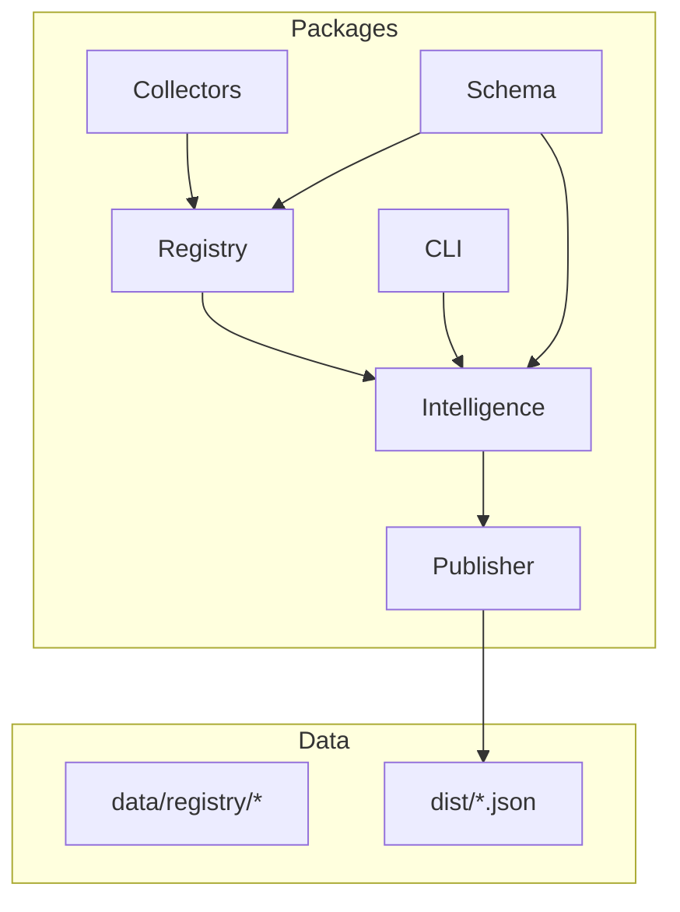
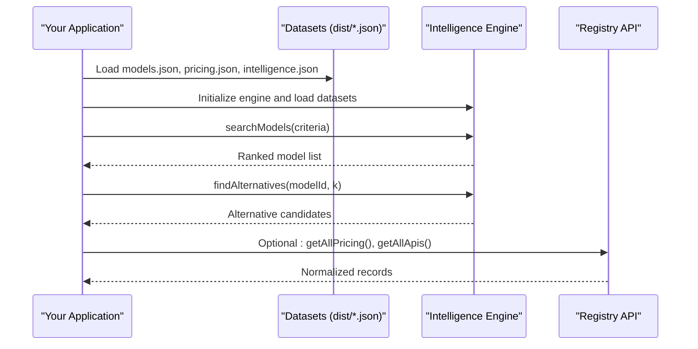
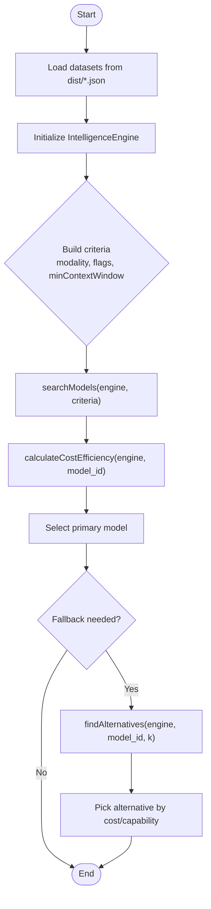
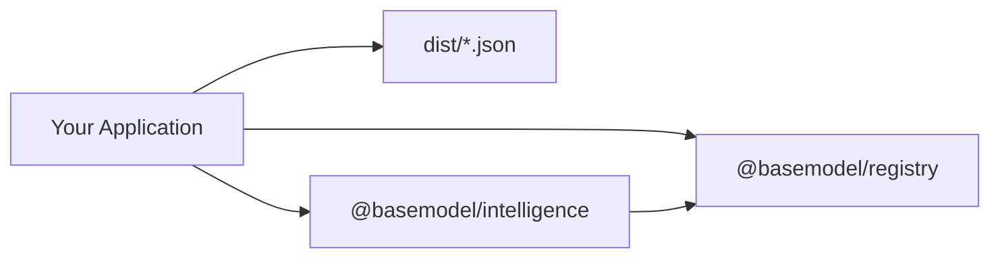

# Integration Examples

<cite>
**Referenced Files in This Document**
- [README.md](file://README.md)
- [package.json](file://package.json)
- [03_Architecture.md](file://docs/03_Architecture.md)
- [05_Data_Model.md](file://docs/05_Data_Model.md)
- [cli.ts](file://packages/cli/src/cli.ts)
- [index.ts](file://packages/registry/src/index.ts)
- [generate.test.ts](file://packages/publisher/src/__tests__/generate.test.ts)
- [dataset-contract.test.ts](file://packages/publisher/src/__tests__/dataset-contract.test.ts)
</cite>

## Table of Contents
1. [Introduction](#introduction)
2. [Project Structure](#project-structure)
3. [Core Components](#core-components)
4. [Architecture Overview](#architecture-overview)
5. [Detailed Component Analysis](#detailed-component-analysis)
6. [Dependency Analysis](#dependency-analysis)
7. [Performance Considerations](#performance-considerations)
8. [Troubleshooting Guide](#troubleshooting-guide)
9. [Conclusion](#conclusion)
10. [Appendices](#appendices)

## Introduction
This document provides practical integration examples for consuming BaseModel datasets and intelligence APIs in real-world applications. It focuses on:
- Model selection algorithms (e.g., capability-based routing, cost optimization)
- Multi-provider fallback strategies
- Caching, rate limiting, and monitoring best practices
- Sample application templates in JavaScript, Python, and TypeScript

BaseModel is a data layer that publishes structured knowledge about AI models, providers, capabilities, pricing, licenses, APIs, benchmarks, and derived intelligence. Applications consume these datasets to make informed decisions without embedding inference logic into the platform itself.

**Section sources**
- [README.md:1-30](file://README.md#L1-L30)

## Project Structure
The repository organizes functionality into packages and produces static datasets consumed by applications:
- Schema and types define canonical structures
- Registry stores validated records
- Collectors discover provider/gateway data
- Intelligence derives rankings, alternatives, and cost insights
- Publisher generates public datasets under dist/

**Diagram sources**
- [03_Architecture.md:1-77](file://docs/03_Architecture.md#L1-L77)
- [README.md:10-30](file://README.md#L10-L30)

**Section sources**
- [README.md:10-30](file://README.md#L10-L30)
- [03_Architecture.md:1-77](file://docs/03_Architecture.md#L1-L77)

## Core Components
Key components you will integrate with:
- Datasets: providers.json, models.json, capabilities.json, licenses.json, apis.json, benchmarks.json, pricing.json, intelligence.json
- Intelligence Engine: search, alternatives, and cost efficiency calculations
- Registry API: read-only access to normalized records for advanced use cases

Integration patterns include:
- Capability-based routing: choose models based on flags like vision_support, function_calling, reasoning_support
- Cost optimization: select models by blended or per-token costs
- Fallback strategy: route requests across multiple providers with graceful degradation

**Section sources**
- [README.md:19-30](file://README.md#L19-L30)
- [cli.ts:85-117](file://packages/cli/src/cli.ts#L85-L117)
- [cli.ts:119-166](file://packages/cli/src/cli.ts#L119-L166)
- [cli.ts:168-205](file://packages/cli/src/cli.ts#L168-L205)

## Architecture Overview
BaseModel’s architecture separates discovery, registry, intelligence, and publishing layers. Consumers interact primarily with published datasets and the intelligence layer.

**Diagram sources**
- [03_Architecture.md:1-77](file://docs/03_Architecture.md#L1-L77)
- [cli.ts:85-117](file://packages/cli/src/cli.ts#L85-L117)
- [index.ts:124-168](file://packages/registry/src/index.ts#L124-L168)

## Detailed Component Analysis

### Dataset Consumption Patterns
Common patterns when consuming datasets:
- Cache datasets locally and refresh periodically
- Validate payloads against known schemas before processing
- Use intelligence functions to derive recommendations rather than hardcoding rules

Example flows:
- Search models by modality and flags
- Compute cost efficiency for budget-aware routing
- Find alternatives for failover planning

**Diagram sources**
- [cli.ts:85-117](file://packages/cli/src/cli.ts#L85-L117)
- [cli.ts:168-205](file://packages/cli/src/cli.ts#L168-L205)

**Section sources**
- [cli.ts:85-117](file://packages/cli/src/cli.ts#L85-L117)
- [cli.ts:168-205](file://packages/cli/src/cli.ts#L168-L205)

### Model Selection Algorithms
Implementations can be built around:
- Capability matching: require specific flags (vision, function calling, reasoning)
- Cost tiers: Free, Budget-Friendly, Balanced, Premium
- Context window constraints: minimum token limits
- Provider diversity: distribute traffic across providers

Use the CLI’s search and alternatives commands as reference for algorithmic behavior.

**Section sources**
- [cli.ts:63-81](file://packages/cli/src/cli.ts#L63-L81)
- [cli.ts:85-117](file://packages/cli/src/cli.ts#L85-L117)
- [cli.ts:168-205](file://packages/cli/src/cli.ts#L168-L205)

### Cost Optimization Strategies
Strategies:
- Blended cost calculation using input/output token rates
- Tiered selection based on business needs
- Dynamic switching between models when costs change

Reference implementation uses calculateCostEfficiency to compute blended and per-token costs.

**Section sources**
- [cli.ts:100-116](file://packages/cli/src/cli.ts#L100-L116)
- [cli.ts:135-165](file://packages/cli/src/cli.ts#L135-L165)

### Capability-Based Routing
Routing logic:
- Filter models by modalities and flags
- Prefer models with required capabilities
- Fall back to closest match if exact capability not available

**Section sources**
- [cli.ts:63-81](file://packages/cli/src/cli.ts#L63-L81)
- [cli.ts:85-117](file://packages/cli/src/cli.ts#L85-L117)

### Multi-Provider Fallback Strategy
Patterns:
- Primary model selection via search
- Alternatives via findAlternatives
- Graceful degradation with retries and timeouts
- Monitor success/failure rates per provider

**Section sources**
- [cli.ts:168-205](file://packages/cli/src/cli.ts#L168-L205)

### Data Model Reference
Canonical entities include Provider, Model, Capability, Benchmark, Pricing, API, License. Understanding these fields enables robust filtering and decision-making.

**Section sources**
- [05_Data_Model.md:23-136](file://docs/05_Data_Model.md#L23-L136)

## Dependency Analysis
Consumers depend on:
- Published datasets for model metadata and pricing
- Intelligence layer for derived insights
- Optional registry API for advanced queries

**Diagram sources**
- [03_Architecture.md:1-77](file://docs/03_Architecture.md#L1-L77)
- [cli.ts:1-10](file://packages/cli/src/cli.ts#L1-L10)
- [index.ts:124-168](file://packages/registry/src/index.ts#L124-L168)

**Section sources**
- [03_Architecture.md:1-77](file://docs/03_Architecture.md#L1-L77)

## Performance Considerations
Recommendations:
- Cache datasets locally; refresh on schedule or version changes
- Batch intelligence computations where possible
- Use minimal dataset subsets for targeted queries
- Monitor latency and error rates per provider

[No sources needed since this section provides general guidance]

## Troubleshooting Guide
Common issues and resolutions:
- Missing datasets: ensure generation step runs and dist files exist
- Schema mismatches: validate payloads against known schemas
- Rate limits: implement backoff and retry policies
- Monitoring: track usage metrics and errors

Validation references:
- Dataset contract tests verify structure and presence of all expected files
- Registry API validates records using schemas

**Section sources**
- [generate.test.ts:117-127](file://packages/publisher/src/__tests__/generate.test.ts#L117-L127)
- [dataset-contract.test.ts:55-80](file://packages/publisher/src/__tests__/dataset-contract.test.ts#L55-L80)
- [index.ts:124-168](file://packages/registry/src/index.ts#L124-L168)

## Conclusion
BaseModel provides a robust foundation for building intelligent model selection systems. By leveraging published datasets and the intelligence layer, applications can implement sophisticated routing, cost optimization, and fallback strategies. Adopt caching, rate limiting, and monitoring to ensure reliability and performance at scale.

[No sources needed since this section summarizes without analyzing specific files]

## Appendices

### Sample Application Templates

#### JavaScript (Node.js)
- Load datasets from dist/*.json
- Initialize IntelligenceEngine
- Use searchModels and findAlternatives
- Implement caching and retry logic

#### Python
- Download datasets and store locally
- Use Pydantic models to validate JSON
- Implement selection algorithms similar to CLI logic
- Add monitoring and metrics collection

#### TypeScript
- Import @basemodel/intelligence and @basemodel/registry
- Build typed interfaces for datasets
- Integrate with web frameworks for API endpoints
- Use environment variables for configuration

[No sources needed since this section provides general guidance]