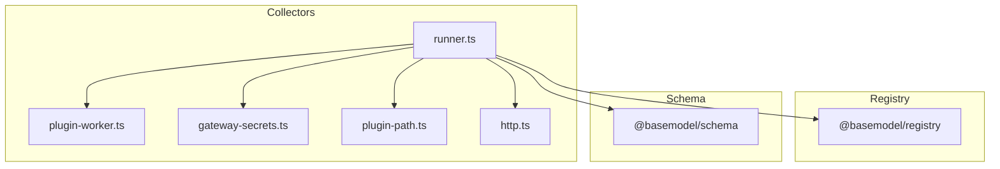
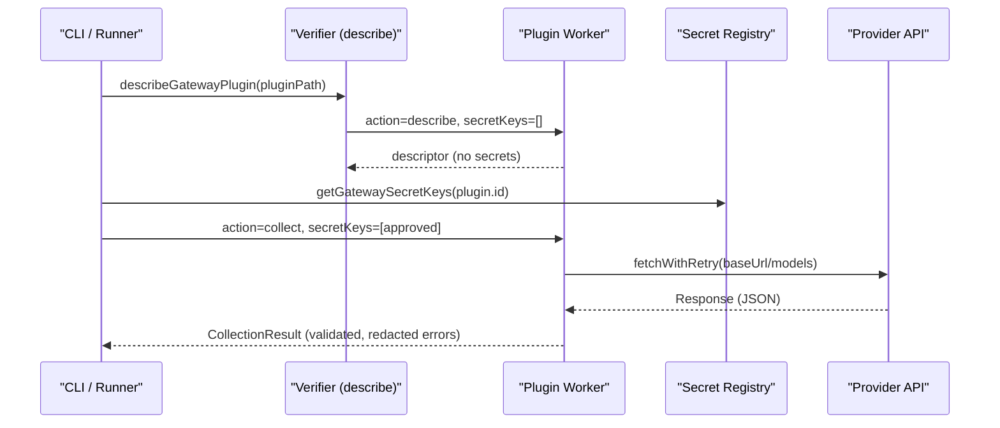
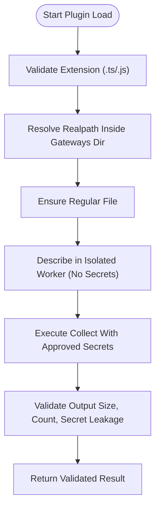
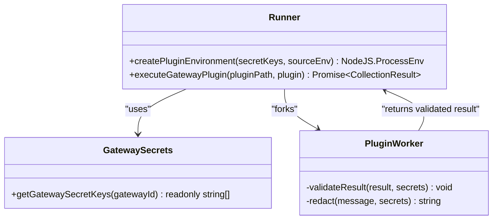
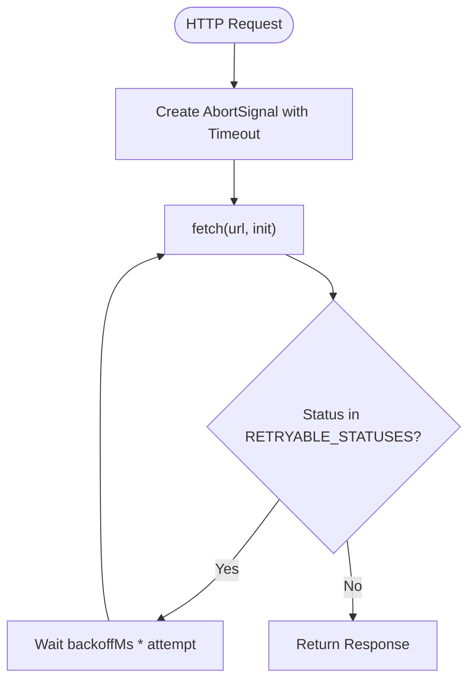
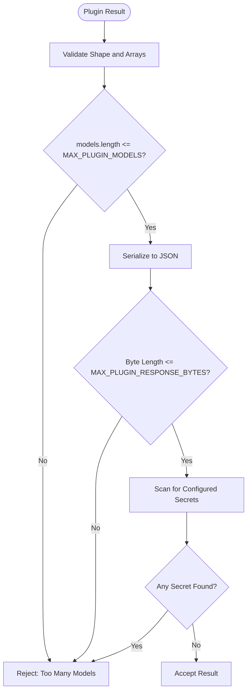
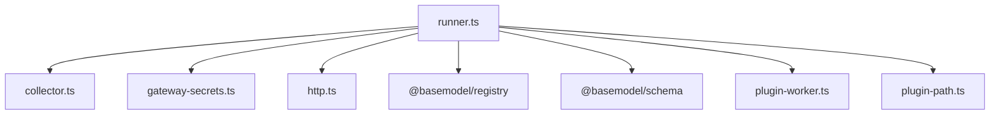

# Authentication & Security

<cite>
**Referenced Files in This Document**
- [README.md](file://README.md)
- [07_Developer_Access.md](file://docs/07_Developer_Access.md)
- [08_Gateway_Plugin_Security.md](file://docs/08_Gateway_Plugin_Security.md)
- [package.json](file://package.json)
- [collector.ts](file://packages/collectors/src/core/collector.ts)
- [gateway-secrets.ts](file://packages/collectors/src/core/gateway-secrets.ts)
- [plugin-path.ts](file://packages/collectors/src/core/plugin-path.ts)
- [http.ts](file://packages/collectors/src/core/http.ts)
- [runner.ts](file://packages/collectors/src/core/runner.ts)
- [plugin-worker.ts](file://packages/collectors/src/core/plugin-worker.ts)
- [verify.ts](file://packages/collectors/src/core/verify.ts)
- [e2e.test.ts](file://packages/collectors/src/__tests__/e2e.test.ts)
- [plugin-path.test.ts](file://packages/collectors/src/__tests__/plugin-path.test.ts)
</cite>

## Table of Contents
1. [Introduction](#introduction)
2. [Project Structure](#project-structure)
3. [Core Components](#core-components)
4. [Architecture Overview](#architecture-overview)
5. [Detailed Component Analysis](#detailed-component-analysis)
6. [Dependency Analysis](#dependency-analysis)
7. [Performance Considerations](#performance-considerations)
8. [Troubleshooting Guide](#troubleshooting-guide)
9. [Conclusion](#conclusion)
10. [Appendices](#appendices)

## Introduction
This document provides comprehensive security documentation for the web API endpoints and plugin-based data collection system used by BaseModel. It focuses on authentication mechanisms, authorization models, secure communication protocols, rate limiting, input validation, CORS considerations, protection against common vulnerabilities, error handling, monitoring, compliance, privacy, and audit logging. The repository is primarily a data layer and registry; it does not expose a public-facing web server or OAuth flows. Instead, it secures external integrations through isolated gateway plugins, strict secret management, and robust HTTP helpers.

BaseModel’s purpose is to discover, validate, normalize, store, analyze, and publish structured knowledge about AI models. Consumers interact via npm packages, CLI tools, and static JSON datasets rather than a live API server.

**Section sources**
- [README.md:1-61](file://README.md#L1-L61)
- [07_Developer_Access.md:1-113](file://docs/07_Developer_Access.md#L1-L113)

## Project Structure
The project is organized into multiple packages with clear responsibilities:
- Schema and types define canonical structures.
- Registry handles storage, validation, and merging of model data.
- Collectors implement provider-specific collectors and gateway plugins.
- Intelligence derives rankings, search, and recommendations.
- Publisher generates static datasets consumed by clients.
- CLI exposes intelligence logic from the terminal.

Security-relevant components are concentrated in the collectors package, where gateway plugins execute in isolated workers with tightly controlled environment variables and validated outputs.

**Diagram sources**
- [runner.ts:1-475](file://packages/collectors/src/core/runner.ts#L1-L475)
- [plugin-worker.ts:1-112](file://packages/collectors/src/core/plugin-worker.ts#L1-L112)
- [gateway-secrets.ts:1-26](file://packages/collectors/src/core/gateway-secrets.ts#L1-L26)
- [plugin-path.ts:1-28](file://packages/collectors/src/core/plugin-path.ts#L1-L28)
- [http.ts:1-37](file://packages/collectors/src/core/http.ts#L1-L37)

**Section sources**
- [README.md:10-30](file://README.md#L10-L30)
- [package.json:1-31](file://package.json#L1-L31)

## Core Components
- Gateway Plugin Verifier: Loads plugin metadata in an isolated worker without exposing credentials.
- Isolated Worker Execution: Custom plugins run in child processes with only approved secrets injected.
- Secret Registry: Centralized mapping of gateway IDs to allowed secret keys; unregistered gateways receive no secrets.
- Path Validation: Enforces that plugins reside within the gateways directory and have allowed extensions.
- HTTP Helpers: Retry with backoff and timeouts for transient upstream failures.
- Result Validation: Limits response size, model count, and scans for secret leakage in serialized output.

These components collectively enforce least privilege, isolation, and safe integration with third-party APIs.

**Section sources**
- [verify.ts:1-25](file://packages/collectors/src/core/verify.ts#L1-L25)
- [runner.ts:97-111](file://packages/collectors/src/core/runner.ts#L97-L111)
- [gateway-secrets.ts:1-26](file://packages/collectors/src/core/gateway-secrets.ts#L1-L26)
- [plugin-path.ts:1-28](file://packages/collectors/src/core/plugin-path.ts#L1-L28)
- [http.ts:1-37](file://packages/collectors/src/core/http.ts#L1-L37)
- [plugin-worker.ts:32-46](file://packages/collectors/src/core/plugin-worker.ts#L32-L46)

## Architecture Overview
BaseModel’s security architecture centers around isolated execution and strict secret control:

**Diagram sources**
- [runner.ts:157-165](file://packages/collectors/src/core/runner.ts#L157-L165)
- [runner.ts:217-238](file://packages/collectors/src/core/runner.ts#L217-L238)
- [plugin-worker.ts:99-106](file://packages/collectors/src/core/plugin-worker.ts#L99-L106)
- [http.ts:17-37](file://packages/collectors/src/core/http.ts#L17-L37)
- [gateway-secrets.ts:24-26](file://packages/collectors/src/core/gateway-secrets.ts#L24-L26)

## Detailed Component Analysis

### Gateway Plugin Security Model
- Plugins are treated as untrusted until reviewed.
- Only .ts/.js files inside the gateways directory are accepted.
- Metadata loading occurs in an isolated worker without secrets.
- Custom collect() runs in a second worker with only centrally approved secrets.
- Unregistered gateways receive no secrets; escalation via secret names is blocked.

**Diagram sources**
- [plugin-path.ts:7-28](file://packages/collectors/src/core/plugin-path.ts#L7-L28)
- [runner.ts:157-165](file://packages/collectors/src/core/runner.ts#L157-L165)
- [plugin-worker.ts:32-46](file://packages/collectors/src/core/plugin-worker.ts#L32-L46)

**Section sources**
- [08_Gateway_Plugin_Security.md:1-36](file://docs/08_Gateway_Plugin_Security.md#L1-L36)
- [plugin-path.ts:1-28](file://packages/collectors/src/core/plugin-path.ts#L1-L28)
- [runner.ts:157-165](file://packages/collectors/src/core/runner.ts#L157-L165)
- [plugin-worker.ts:32-46](file://packages/collectors/src/core/plugin-worker.ts#L32-L46)

### Secret Management and Authorization
- Central secret registry maps gateway IDs to allowed secret keys.
- Only explicitly registered keys are passed to workers.
- CI credentials (e.g., GITHUB_TOKEN) are not forwarded to plugins.
- Errors are redacted to avoid leaking secrets in logs.

**Diagram sources**
- [gateway-secrets.ts:1-26](file://packages/collectors/src/core/gateway-secrets.ts#L1-L26)
- [runner.ts:97-111](file://packages/collectors/src/core/runner.ts#L97-L111)
- [plugin-worker.ts:26-30](file://packages/collectors/src/core/plugin-worker.ts#L26-L30)
- [plugin-worker.ts:32-46](file://packages/collectors/src/core/plugin-worker.ts#L32-L46)

**Section sources**
- [08_Gateway_Plugin_Security.md:1-36](file://docs/08_Gateway_Plugin_Security.md#L1-L36)
- [gateway-secrets.ts:1-26](file://packages/collectors/src/core/gateway-secrets.ts#L1-L26)
- [runner.ts:97-111](file://packages/collectors/src/core/runner.ts#L97-L111)
- [plugin-worker.ts:26-30](file://packages/collectors/src/core/plugin-worker.ts#L26-L30)

### Secure Communication Protocols and Rate Limiting
- All external requests use fetchWithRetry with exponential backoff and per-attempt timeouts.
- Transient statuses (e.g., 429, 5xx) trigger retries; non-transient responses return immediately.
- OpenAI-compatible gateways send Authorization headers when an API key is present.

**Diagram sources**
- [http.ts:17-37](file://packages/collectors/src/core/http.ts#L17-L37)
- [runner.ts:167-186](file://packages/collectors/src/core/runner.ts#L167-L186)

**Section sources**
- [http.ts:1-37](file://packages/collectors/src/core/http.ts#L1-L37)
- [runner.ts:167-186](file://packages/collectors/src/core/runner.ts#L167-L186)

### Input Validation and Output Sanitization
- Plugin results are strictly validated: required fields, array types, max model count, and max byte size.
- Serialized output is scanned for configured secrets to prevent leakage.
- Error messages are redacted before being sent back to the parent process.

**Diagram sources**
- [plugin-worker.ts:32-46](file://packages/collectors/src/core/plugin-worker.ts#L32-L46)
- [collector.ts:3-10](file://packages/collectors/src/core/collector.ts#L3-L10)

**Section sources**
- [plugin-worker.ts:32-46](file://packages/collectors/src/core/plugin-worker.ts#L32-L46)
- [collector.ts:3-10](file://packages/collectors/src/core/collector.ts#L3-L10)

### Protection Against Common Vulnerabilities
- SQL Injection: Not applicable here; there is no database query layer exposed to user input. Data is persisted via registry utilities with schema validation.
- XSS: Not applicable; this is a backend/data pipeline without HTML rendering.
- CSRF: Not applicable; no browser-facing forms or state-changing endpoints.
- Path Traversal: Prevented by resolving real paths and enforcing containment within the gateways directory.
- Secret Leakage: Prevented by central registry, minimal environment injection, and output scanning/redaction.

**Section sources**
- [plugin-path.ts:7-28](file://packages/collectors/src/core/plugin-path.ts#L7-L28)
- [plugin-worker.ts:26-30](file://packages/collectors/src/core/plugin-worker.ts#L26-L30)
- [plugin-worker.ts:32-46](file://packages/collectors/src/core/plugin-worker.ts#L32-L46)

### CORS Configuration
- Not applicable: BaseModel does not serve HTTP endpoints directly. Consumers access static JSON datasets or use SDKs/CLI.

[No sources needed since this section doesn't analyze specific files]

### API Key Management and Request Signing
- API keys are managed centrally per gateway ID and injected only into isolated workers.
- For OpenAI-compatible gateways, keys are sent via Authorization: Bearer headers.
- No request signing mechanism is implemented; reliance is on standard bearer tokens and HTTPS.

**Section sources**
- [gateway-secrets.ts:1-26](file://packages/collectors/src/core/gateway-secrets.ts#L1-L26)
- [runner.ts:167-186](file://packages/collectors/src/core/runner.ts#L167-L186)

### OAuth Flows
- Not applicable: There is no OAuth implementation in the codebase.

[No sources needed since this section doesn't analyze specific files]

### Monitoring and Audit Logging
- Collection outcomes log new/updated/failed counts and warnings for collisions.
- Lifecycle reconciliation marks models discontinued when no longer listed by a successful gateway fetch.
- Errors include contextual hints for HTTP status codes and sanitized body snippets.

**Section sources**
- [runner.ts:365-397](file://packages/collectors/src/core/runner.ts#L365-L397)
- [runner.ts:410-426](file://packages/collectors/src/core/runner.ts#L410-L426)
- [runner.ts:428-475](file://packages/collectors/src/core/runner.ts#L428-L475)

### Compliance and Data Privacy
- Minimal exposure of sensitive data: secrets are never logged or returned in responses.
- Static datasets published do not contain secrets.
- Provider records are updated only after successful collections, reducing risk of stale or incorrect data.

**Section sources**
- [plugin-worker.ts:26-30](file://packages/collectors/src/core/plugin-worker.ts#L26-L30)
- [runner.ts:365-397](file://packages/collectors/src/core/runner.ts#L365-L397)

## Dependency Analysis
The collectors core depends on schema and registry packages, while isolating plugin execution and controlling environment variables.

**Diagram sources**
- [runner.ts:1-475](file://packages/collectors/src/core/runner.ts#L1-L475)
- [collector.ts:1-89](file://packages/collectors/src/core/collector.ts#L1-L89)
- [gateway-secrets.ts:1-26](file://packages/collectors/src/core/gateway-secrets.ts#L1-L26)
- [http.ts:1-37](file://packages/collectors/src/core/http.ts#L1-L37)
- [plugin-worker.ts:1-112](file://packages/collectors/src/core/plugin-worker.ts#L1-L112)
- [plugin-path.ts:1-28](file://packages/collectors/src/core/plugin-path.ts#L1-L28)

**Section sources**
- [runner.ts:1-475](file://packages/collectors/src/core/runner.ts#L1-L475)

## Performance Considerations
- Retries with backoff mitigate transient upstream failures without blocking long-running tasks.
- Timeouts per attempt prevent resource exhaustion.
- Response size and model count limits protect memory and CPU usage in workers.
- Parallel execution across gateways uses Promise.allSettled to maximize throughput while capturing individual failures.

**Section sources**
- [http.ts:17-37](file://packages/collectors/src/core/http.ts#L17-L37)
- [plugin-worker.ts:32-46](file://packages/collectors/src/core/plugin-worker.ts#L32-L46)
- [runner.ts:445-475](file://packages/collectors/src/core/runner.ts#L445-L475)

## Troubleshooting Guide
Common issues and resolutions:
- Unauthorized or Forbidden responses: Verify API key validity and permissions.
- Rate limited: Ensure backoff is applied; persistent 429 indicates sustained throttling.
- Not found: Check base URL and endpoint path.
- Precondition failed: Billing setup may be required; account might be suspended.
- Plugin path traversal: Ensure plugin resides within the gateways directory and has allowed extension.
- Secret leakage detection: Remove secrets from plugin output or avoid printing them.

**Section sources**
- [runner.ts:42-48](file://packages/collectors/src/core/runner.ts#L42-L48)
- [plugin-path.test.ts:1-31](file://packages/collectors/src/__tests__/plugin-path.test.ts#L1-L31)
- [e2e.test.ts:79-91](file://packages/collectors/src/__tests__/e2e.test.ts#L79-L91)

## Conclusion
BaseModel’s security model emphasizes isolation, least privilege, and strict validation. Gateway plugins execute in sandboxed workers with centrally controlled secrets, and all external communications are resilient and bounded. While not a web API server, the system enforces strong safeguards against common threats and ensures safe integration with upstream providers. Consumers should follow best practices for secret management, monitor collection outcomes, and rely on static datasets for secure consumption.

[No sources needed since this section summarizes without analyzing specific files]

## Appendices

### Developer Access and Integration Notes
- Consumers can use npm packages, CLI, or direct JSON consumption.
- Gateway plugins must be reviewed alongside secret requirements.

**Section sources**
- [07_Developer_Access.md:1-113](file://docs/07_Developer_Access.md#L1-L113)