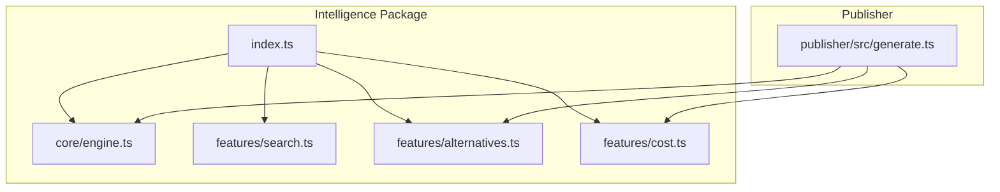
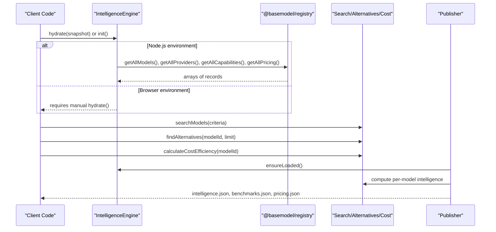
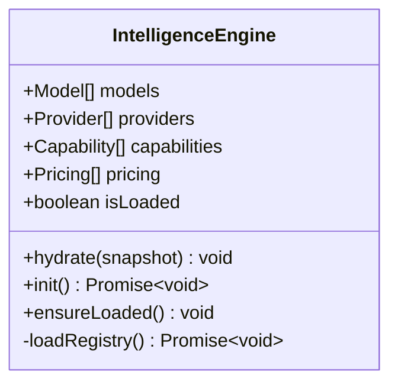
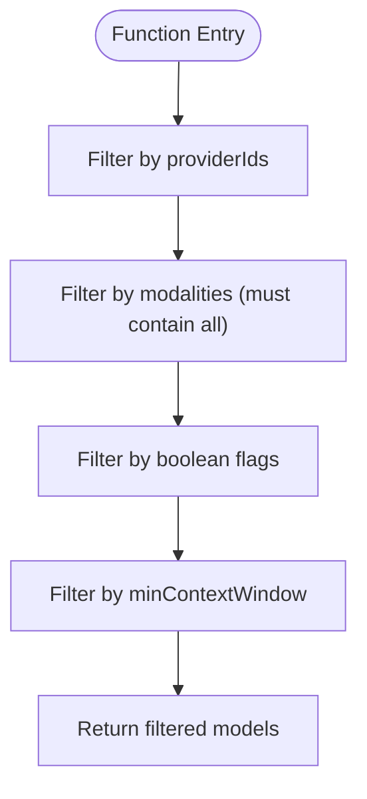
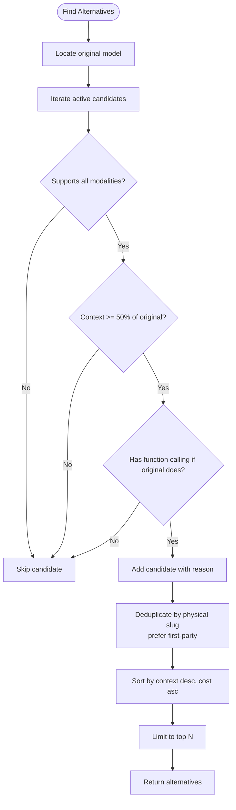
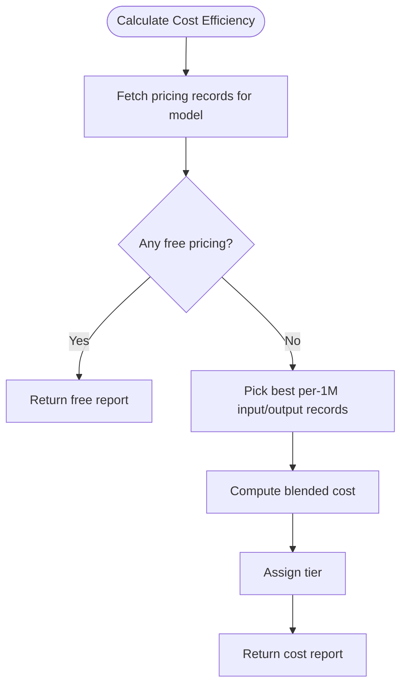
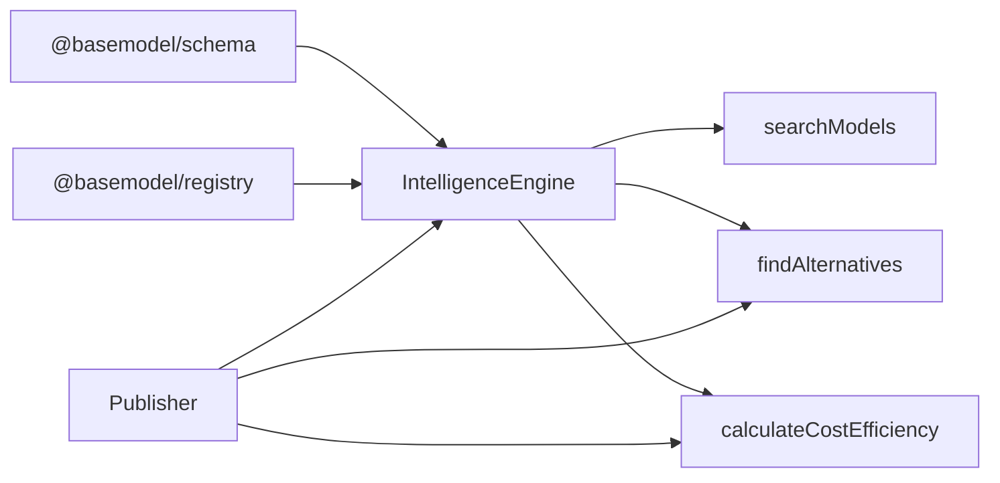

# Intelligence API

<cite>
**Referenced Files in This Document**
- [README.md](file://README.md)
- [packages/intelligence/package.json](file://packages/intelligence/package.json)
- [packages/intelligence/src/index.ts](file://packages/intelligence/src/index.ts)
- [packages/intelligence/src/core/engine.ts](file://packages/intelligence/src/core/engine.ts)
- [packages/intelligence/src/features/search.ts](file://packages/intelligence/src/features/search.ts)
- [packages/intelligence/src/features/alternatives.ts](file://packages/intelligence/src/features/alternatives.ts)
- [packages/intelligence/src/features/cost.ts](file://packages/intelligence/src/features/cost.ts)
- [packages/publisher/src/generate.ts](file://packages/publisher/src/generate.ts)
</cite>

## Table of Contents
1. [Introduction](#introduction)
2. [Project Structure](#project-structure)
3. [Core Components](#core-components)
4. [Architecture Overview](#architecture-overview)
5. [Detailed Component Analysis](#detailed-component-analysis)
6. [Dependency Analysis](#dependency-analysis)
7. [Performance Considerations](#performance-considerations)
8. [Troubleshooting Guide](#troubleshooting-guide)
9. [Conclusion](#conclusion)
10. [Appendices](#appendices)

## Introduction
This document specifies the Intelligence API surface for accessing derived insights, rankings, recommendations, and analytics about AI models. The Intelligence layer computes:
- Model search and filtering
- Alternative model recommendations
- Cost efficiency analysis and pricing tiers
- Published intelligence datasets that include benchmarks and trend data

The API is implemented as a library with clear entry points and features. Consumers hydrate or initialize an engine with registry data and then call functions to obtain structured intelligence results.

## Project Structure
At a high level:
- packages/intelligence exposes the Intelligence Engine and feature modules (search, alternatives, cost).
- packages/publisher generates static datasets including intelligence.json, which aggregates derived insights per model.
- data/registry contains canonical records used by the registry layer; the publisher consumes these to produce dist outputs.



**Diagram sources**
- [packages/intelligence/src/index.ts:1-15](file://packages/intelligence/src/index.ts#L1-L15)
- [packages/intelligence/src/core/engine.ts:1-92](file://packages/intelligence/src/core/engine.ts#L1-L92)
- [packages/intelligence/src/features/search.ts:1-53](file://packages/intelligence/src/features/search.ts#L1-L53)
- [packages/intelligence/src/features/alternatives.ts:1-138](file://packages/intelligence/src/features/alternatives.ts#L1-L138)
- [packages/intelligence/src/features/cost.ts:31-86](file://packages/intelligence/src/features/cost.ts#L31-L86)
- [packages/publisher/src/generate.ts:147-244](file://packages/publisher/src/generate.ts#L147-L244)

**Section sources**
- [README.md:10-30](file://README.md#L10-L30)
- [packages/intelligence/package.json:1-50](file://packages/intelligence/package.json#L1-L50)

## Core Components
- IntelligenceEngine: Holds validated snapshots of models, providers, capabilities, and pricing. Supports initialization via Node.js filesystem loading or manual hydration for browser environments.
- Search: Filters models by provider IDs, required modalities, boolean flags, and minimum context window.
- Alternatives: Finds comparable alternative models based on modality coverage, context window thresholds, function calling parity, router endpoint exclusion, and deduplication across providers.
- Cost: Computes cost efficiency, blended cost per million tokens, and pricing tier classification.

Key responsibilities:
- Data validation and defensive snapshot parsing
- Lazy initialization with concurrent-safe init()
- Deterministic ranking and deduplication logic
- Clear error handling when data is missing or invalid

**Section sources**
- [packages/intelligence/src/core/engine.ts:1-92](file://packages/intelligence/src/core/engine.ts#L1-L92)
- [packages/intelligence/src/features/search.ts:1-53](file://packages/intelligence/src/features/search.ts#L1-L53)
- [packages/intelligence/src/features/alternatives.ts:1-138](file://packages/intelligence/src/features/alternatives.ts#L1-L138)
- [packages/intelligence/src/features/cost.ts:31-86](file://packages/intelligence/src/features/cost.ts#L31-L86)

## Architecture Overview
The Intelligence API follows a layered design:
- Registry data is loaded into an IntelligenceEngine snapshot.
- Feature modules operate over this snapshot to compute derived insights.
- Publisher consumes these features to generate static datasets (intelligence.json, benchmarks.json, pricing.json).



**Diagram sources**
- [packages/intelligence/src/core/engine.ts:44-92](file://packages/intelligence/src/core/engine.ts#L44-L92)
- [packages/publisher/src/generate.ts:147-244](file://packages/publisher/src/generate.ts#L147-L244)

## Detailed Component Analysis

### IntelligenceEngine
Responsibilities:
- Validate and store registry snapshots
- Provide safe initialization path for Node.js and explicit hydration for browsers
- Ensure features are only called after data is loaded

Key methods:
- hydrate(snapshot): Load validated data into memory
- init(): Concurrent-safe lazy load from registry
- ensureLoaded(): Guard for feature calls

Error handling:
- Throws descriptive errors for invalid snapshots
- Throws when attempting Node-only operations in browser contexts
- Throws if features are invoked before initialization



**Diagram sources**
- [packages/intelligence/src/core/engine.ts:1-92](file://packages/intelligence/src/core/engine.ts#L1-L92)

**Section sources**
- [packages/intelligence/src/core/engine.ts:1-92](file://packages/intelligence/src/core/engine.ts#L1-L92)

### Search API
Purpose:
- Filter models by provider, modalities, boolean flags, and minimum context window.

Query parameters (criteria object):
- providerIds: Array of provider IDs to restrict results
- modalities: Array of modalities; all must be supported by the model
- flags: Array of boolean fields on Model that must be true
- minContextWindow: Minimum context window size

Response:
- Array of Model objects matching all criteria

Complexity:
- O(n) filter pass over models; efficient for typical registry sizes



**Diagram sources**
- [packages/intelligence/src/features/search.ts:1-53](file://packages/intelligence/src/features/search.ts#L1-L53)

**Section sources**
- [packages/intelligence/src/features/search.ts:1-53](file://packages/intelligence/src/features/search.ts#L1-L53)

### Alternatives API
Purpose:
- Recommend comparable alternative models based on capability parity, context window tolerance, and economic considerations.

Criteria enforced:
- Must support all modalities of the original model
- Context window must be at least 50% of the original
- Function calling parity required if original supports it
- Router endpoints excluded
- Deduplicate physical models across providers, preferring first-party representatives

Ranking:
- Primary sort by context window (descending)
- Secondary sort by blended cost (ascending) when available
- Tie-breaker by model_id lexicographic order

Response:
- Array of AlternativeResult objects containing model and reason



**Diagram sources**
- [packages/intelligence/src/features/alternatives.ts:1-138](file://packages/intelligence/src/features/alternatives.ts#L1-L138)

**Section sources**
- [packages/intelligence/src/features/alternatives.ts:1-138](file://packages/intelligence/src/features/alternatives.ts#L1-L138)

### Cost API
Purpose:
- Compute cost efficiency and pricing tier for a model using pricing records.

Behavior:
- Select best per-1M token record by provenance priority
- Detect free models and return zero costs
- Compute blended cost per million tokens
- Assign tier classification

Response:
- CostEfficiencyReport with fields such as modelId, isFree, inputCostPer1M, outputCostPer1M, blendedCost, tier



**Diagram sources**
- [packages/intelligence/src/features/cost.ts:31-86](file://packages/intelligence/src/features/cost.ts#L31-L86)

**Section sources**
- [packages/intelligence/src/features/cost.ts:31-86](file://packages/intelligence/src/features/cost.ts#L31-L86)

### Publisher Integration and Intelligence Dataset
The publisher uses the Intelligence features to generate intelligence.json, which includes per-model intelligence records:
- model_id
- cost_tier
- blended_cost_per_1m
- alternatives (array of recommended models with reasons)

Benchmarks and pricing are also published alongside intelligence data.

```mermaid
sequenceDiagram
participant Pub as "Publisher"
participant Eng as "IntelligenceEngine"
participant Alt as "findAlternatives"
participant Cost as "calculateCostEfficiency"
Pub->>Eng : ensureLoaded()
loop For each model
Pub->>Cost : calculateCostEfficiency(model_id)
Cost-->>Pub : cost_tier, blended_cost_per_1m
Pub->>Alt : findAlternatives(model_id, limit=3)
Alt-->>Pub : alternatives array
Pub->>Pub : Build intelligence record
end
Pub-->>Pub : Write intelligence.json
```

**Diagram sources**
- [packages/publisher/src/generate.ts:147-244](file://packages/publisher/src/generate.ts#L147-L244)

**Section sources**
- [packages/publisher/src/generate.ts:147-244](file://packages/publisher/src/generate.ts#L147-L244)

## Dependency Analysis
- IntelligenceEngine depends on @basemodel/schema for type validation and on @basemodel/registry for data loading in Node.js.
- Feature modules depend on IntelligenceEngine and schema utilities (e.g., blendedCost).
- Publisher depends on IntelligenceEngine and feature modules to build static datasets.



**Diagram sources**
- [packages/intelligence/src/core/engine.ts:1-92](file://packages/intelligence/src/core/engine.ts#L1-L92)
- [packages/intelligence/src/features/search.ts:1-53](file://packages/intelligence/src/features/search.ts#L1-L53)
- [packages/intelligence/src/features/alternatives.ts:1-138](file://packages/intelligence/src/features/alternatives.ts#L1-L138)
- [packages/intelligence/src/features/cost.ts:31-86](file://packages/intelligence/src/features/cost.ts#L31-L86)
- [packages/publisher/src/generate.ts:147-244](file://packages/publisher/src/generate.ts#L147-L244)

**Section sources**
- [packages/intelligence/package.json:1-50](file://packages/intelligence/package.json#L1-L50)

## Performance Considerations
- Initialization:
  - init() is idempotent and concurrent-safe; multiple callers share the same load operation.
  - In browser environments, use hydrate() to avoid filesystem calls.
- Filtering and Ranking:
  - searchModels performs a single O(n) pass over models; keep criteria selective to minimize result sets.
  - Alternatives ranking sorts by context window and blended cost; complexity is dominated by sorting candidates.
- Caching:
  - IntelligenceEngine caches loaded data in memory; reuse the same engine instance to avoid repeated loads.
  - Publisher writes static datasets; consumers can cache intelligence.json and benchmarks.json locally.
- Data Freshness:
  - Intelligence results reflect the snapshot provided to the engine. Update snapshots periodically to reflect new models, pricing changes, or benchmark updates.

[No sources needed since this section provides general guidance]

## Troubleshooting Guide
Common issues and resolutions:
- Not initialized:
  - Symptom: Error indicating engine not initialized.
  - Resolution: Call await init() in Node.js or hydrate(snapshot) in browsers before using features.
- Invalid snapshot:
  - Symptom: Error describing invalid intelligence snapshot.
  - Resolution: Ensure models, providers, capabilities, and pricing arrays conform to schema definitions.
- Missing pricing:
  - Symptom: Blended cost undefined or tier Unknown.
  - Resolution: Verify pricing records exist for the model and include per-1M token entries.
- No alternatives found:
  - Symptom: Empty alternatives list.
  - Resolution: Check modality requirements, context window threshold, and router endpoint exclusions.

**Section sources**
- [packages/intelligence/src/core/engine.ts:84-92](file://packages/intelligence/src/core/engine.ts#L84-L92)
- [packages/intelligence/src/features/alternatives.ts:59-138](file://packages/intelligence/src/features/alternatives.ts#L59-L138)
- [packages/intelligence/src/features/cost.ts:53-86](file://packages/intelligence/src/features/cost.ts#L53-L86)

## Conclusion
The Intelligence API provides robust, deterministic tools for deriving actionable insights from model registry data. By combining search, alternatives, and cost analysis, consumers can implement rankings, recommendations, and analytics pipelines. Static publishing ensures consistent datasets for downstream systems.

[No sources needed since this section summarizes without analyzing specific files]

## Appendices

### API Usage Examples
- Request top-performing models:
  - Use searchModels with modalities and flags to narrow candidates, then rank by context window and cost.
- Cost comparisons:
  - Use calculateCostEfficiency for each model to compare blended costs and tiers.
- Capability-based recommendations:
  - Use findAlternatives with a target model_id to get comparable alternatives with reasons.
- Benchmark results:
  - Consume benchmarks.json generated by the publisher for catalog-matched benchmark rows.

[No sources needed since this section provides general guidance]