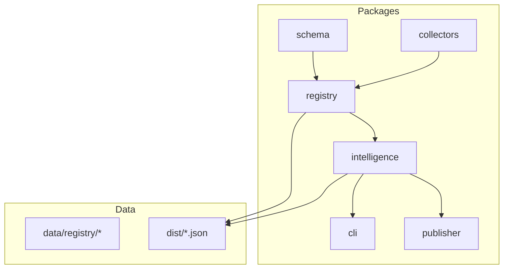
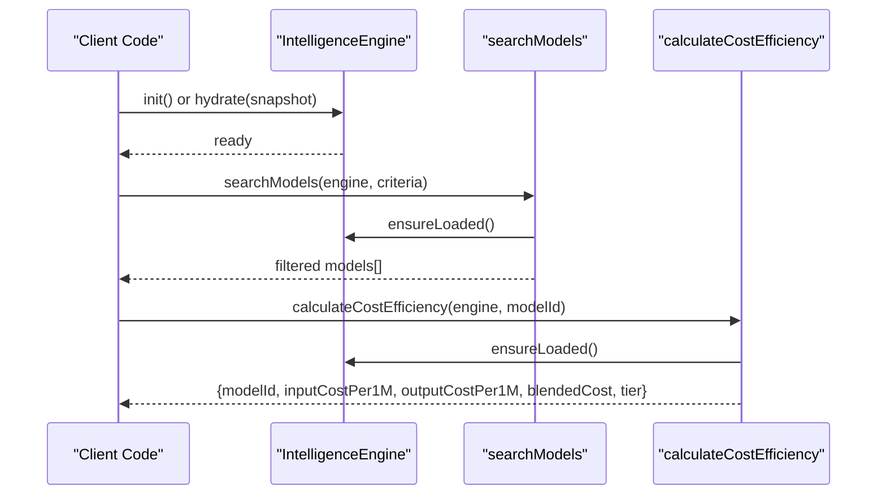
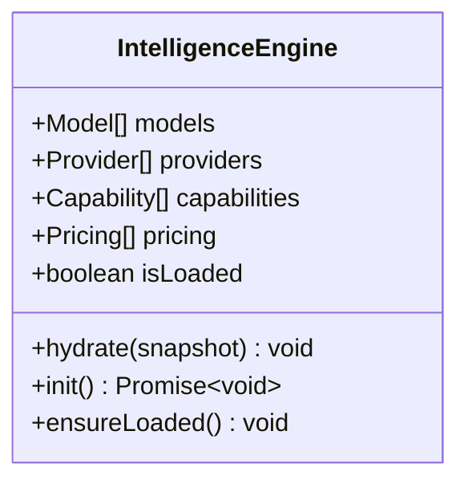
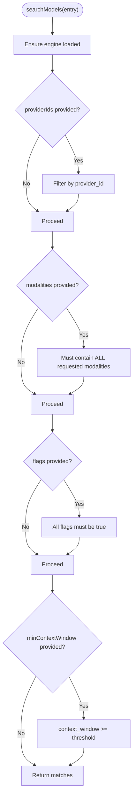
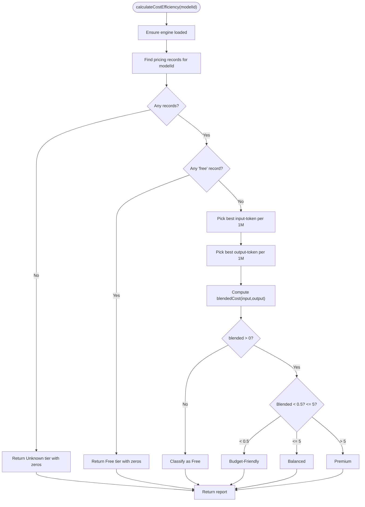
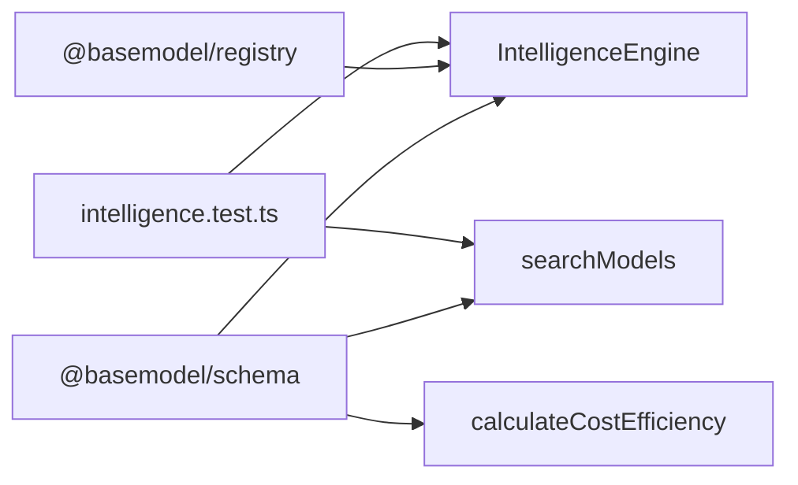

# Model Search API

<cite>
**Referenced Files in This Document**
- [README.md](file://README.md)
- [03_Architecture.md](file://docs/03_Architecture.md)
- [05_Data_Model.md](file://docs/05_Data_Model.md)
- [07_Developer_Access.md](file://docs/07_Developer_Access.md)
- [engine.ts](file://packages/intelligence/src/core/engine.ts)
- [search.ts](file://packages/intelligence/src/features/search.ts)
- [cost.ts](file://packages/intelligence/src/features/cost.ts)
- [intelligence.test.ts](file://packages/intelligence/src/__tests__/intelligence.test.ts)
</cite>

## Table of Contents
1. Introduction
2. Project Structure
3. Core Components
4. Architecture Overview
5. Detailed Component Analysis
6. Dependency Analysis
7. Performance Considerations
8. Troubleshooting Guide
9. Conclusion
10. Appendices

## Introduction
This document specifies the Model Search functionality exposed by the intelligence layer. BaseModel is a data platform that discovers, validates, normalizes, stores, analyzes, and publishes structured knowledge about AI models. The search capability is implemented as an in-process library (not an HTTP server), with additional CLI and static JSON datasets for consumption. Consumers can:
- Search models by provider, modality, boolean flags, and minimum context window
- Compute cost efficiency and tiering to sort or filter by cost
- Use the CLI for terminal-based queries
- Consume published JSON datasets directly

BaseModel intentionally does not provide inference runtimes or HTTP endpoints; it provides the data and derived intelligence consumed by other systems.

**Section sources**
- [README.md:1-30](file://README.md#L1-L30)
- [03_Architecture.md:23-30](file://docs/03_Architecture.md#L23-L30)

## Project Structure
The repository organizes code into packages and documentation:
- packages/schema: Canonical schemas and types
- packages/registry: Registry storage, validation, merge utilities
- packages/collectors: Provider and gateway collectors
- packages/intelligence: Derived rankings, search, and recommendations
- packages/publisher: Dataset generation for dist/
- packages/cli: Command-line interface for querying intelligence
- docs: Architecture, data model, developer access, etc.

**Diagram sources**
- [README.md:11-30](file://README.md#L11-L30)
- [03_Architecture.md:37-44](file://docs/03_Architecture.md#L37-L44)

**Section sources**
- [README.md:11-30](file://README.md#L11-L30)
- [03_Architecture.md:37-44](file://docs/03_Architecture.md#L37-L44)

## Core Components
- IntelligenceEngine: In-memory engine holding validated snapshots of models, providers, capabilities, and pricing. Supports initialization via Node.js filesystem or manual hydration for browser-like environments.
- searchModels: Filters models based on provider IDs, modalities, boolean flags, and minimum context window.
- calculateCostEfficiency: Computes per-model cost metrics and tiers using deterministic source priority across pricing records.

Key behaviors:
- Engine ensures loaded state before operations
- Deterministic selection of pricing records by provenance
- Boolean flag filtering uses exact field names from the Model type

**Section sources**
- [engine.ts:36-91](file://packages/intelligence/src/core/engine.ts#L36-L91)
- [search.ts:18-52](file://packages/intelligence/src/features/search.ts#L18-L52)
- [cost.ts:53-114](file://packages/intelligence/src/features/cost.ts#L53-L114)

## Architecture Overview
The search workflow integrates the engine, search filters, and cost heuristics over canonical registry data.

**Diagram sources**
- [engine.ts:58-90](file://packages/intelligence/src/core/engine.ts#L58-L90)
- [search.ts:18-52](file://packages/intelligence/src/features/search.ts#L18-L52)
- [cost.ts:53-114](file://packages/intelligence/src/features/cost.ts#L53-L114)

## Detailed Component Analysis

### IntelligenceEngine
Responsibilities:
- Holds validated snapshots of models, providers, capabilities, and pricing
- Provides safe initialization paths for Node.js and browser-like environments
- Enforces load state before use

Initialization options:
- Node.js: async init() loads registry via dynamic import
- Browser-like: hydrate(snapshot) accepts pre-fetched datasets

Error handling:
- Throws when used without initialization
- Throws on invalid snapshot during hydrate

**Diagram sources**
- [engine.ts:36-91](file://packages/intelligence/src/core/engine.ts#L36-L91)

**Section sources**
- [engine.ts:1-92](file://packages/intelligence/src/core/engine.ts#L1-L92)

### Search Functionality
Filters:
- providerIds: array of provider IDs
- modalities: array of modalities; must match all requested
- flags: array of boolean fields on Model; must be true
- minContextWindow: numeric threshold

Behavior:
- Returns models satisfying all provided constraints
- No pagination or sorting built-in; clients should paginate/sort results locally

CLI exposure:
- basemodel search supports --provider, --modality, --flag, --min-context

**Diagram sources**
- [search.ts:18-52](file://packages/intelligence/src/features/search.ts#L18-L52)

**Section sources**
- [search.ts:1-52](file://packages/intelligence/src/features/search.ts#L1-L52)
- [07_Developer_Access.md:63-79](file://docs/07_Developer_Access.md#L63-L79)

### Cost Efficiency and Tiering
Outputs:
- modelId
- isFree
- inputCostPer1M
- outputCostPer1M
- blendedCost
- tier: Free | Budget-Friendly | Balanced | Premium | Unknown

Deterministic pricing selection:
- Prioritizes provider catalog, then OpenRouter, then other gateways, then Hugging Face, then unprovenanced records
- Uses “1M tokens” unit records for input/output costs
- Classifies free if explicit free pricing exists or both input/output are zero

**Diagram sources**
- [cost.ts:22-29](file://packages/intelligence/src/features/cost.ts#L22-L29)
- [cost.ts:32-48](file://packages/intelligence/src/features/cost.ts#L32-L48)
- [cost.ts:53-114](file://packages/intelligence/src/features/cost.ts#L53-L114)

**Section sources**
- [cost.ts:1-115](file://packages/intelligence/src/features/cost.ts#L1-L115)

### Data Model Reference
Core entities relevant to search and cost:
- Provider: organization metadata
- Model: unique model identity, modalities, boolean features, context window, capability IDs
- Capability: normalized capability vocabulary
- Pricing: per-model pricing records with type, unit, value, currency, notes
- Benchmark: evaluation results
- API: access methods
- License: legal terms

Identifiers:
- provider_id: kebab-case
- model_id: "{provider_id}/{model-slug}"

Dataset metadata includes schema_version, source_revision, count.

**Section sources**
- [05_Data_Model.md:25-141](file://docs/05_Data_Model.md#L25-L141)
- [05_Data_Model.md:143-151](file://docs/05_Data_Model.md#L143-L151)

## Dependency Analysis
The intelligence package depends on schema definitions and optionally on registry for loading data in Node.js. Tests validate behavior against sample models and pricing.

**Diagram sources**
- [engine.ts:1-3](file://packages/intelligence/src/core/engine.ts#L1-L3)
- [search.ts:1-2](file://packages/intelligence/src/features/search.ts#L1-L2)
- [cost.ts:1-2](file://packages/intelligence/src/features/cost.ts#L1-L2)
- [intelligence.test.ts:51-103](file://packages/intelligence/src/__tests__/intelligence.test.ts#L51-L103)

**Section sources**
- [engine.ts:1-92](file://packages/intelligence/src/core/engine.ts#L1-L92)
- [search.ts:1-52](file://packages/intelligence/src/features/search.ts#L1-L52)
- [cost.ts:1-115](file://packages/intelligence/src/features/cost.ts#L1-L115)
- [intelligence.test.ts:51-103](file://packages/intelligence/src/__tests__/intelligence.test.ts#L51-L103)

## Performance Considerations
- Filtering is O(n) over models; consider client-side pagination and caching for large result sets
- Cost calculation is O(m) over pricing records for a single model; cache reports per modelId
- Avoid repeated engine initialization; reuse a single instance
- Prefer hydrate() in browser-like environments to avoid filesystem overhead

[No sources needed since this section provides general guidance]

## Troubleshooting Guide
Common errors and resolutions:
- Not initialized: Calling search or cost functions without calling init() or hydrate() first throws an error. Initialize the engine once and reuse it.
- Invalid snapshot: hydrate() validates inputs; malformed datasets will throw with details. Validate your dataset against schema definitions.
- Missing pricing: If no pricing records exist for a model, cost efficiency returns Unknown tier with zeroed values.

Operational tips:
- For Node.js, ensure @basemodel/registry is available at runtime for init()
- For browsers, fetch datasets and call hydrate() with models, providers, capabilities, pricing

**Section sources**
- [engine.ts:84-90](file://packages/intelligence/src/core/engine.ts#L84-L90)
- [engine.ts:11-22](file://packages/intelligence/src/core/engine.ts#L11-L22)
- [cost.ts:61-70](file://packages/intelligence/src/features/cost.ts#L61-L70)

## Conclusion
BaseModel’s Model Search is a robust, deterministic, and extensible library for filtering models and computing cost efficiency. It integrates cleanly with CLI usage and direct JSON consumption. While there is no HTTP API, consumers can build lightweight wrappers around the intelligence engine to expose tailored endpoints, applying pagination, rate limiting, and caching as needed.

[No sources needed since this section summarizes without analyzing specific files]

## Appendices

### A. Search Criteria Reference
- providerIds: string[] — restrict to one or more providers
- modalities: string[] — must include all specified modalities
- flags: Array<keyof Model> — boolean fields that must be true
- minContextWindow: number — minimum context window size

Examples:
- Find text-generation models from openai with vision_support
- Filter by provider openai and modality image
- Require reasoning_support and minContextWindow 100000

**Section sources**
- [search.ts:4-16](file://packages/intelligence/src/features/search.ts#L4-L16)
- [07_Developer_Access.md:63-79](file://docs/07_Developer_Access.md#L63-L79)

### B. Cost Efficiency Report Fields
- modelId: string
- isFree: boolean
- inputCostPer1M: number
- outputCostPer1M: number
- blendedCost: number
- tier: "Free" | "Budget-Friendly" | "Balanced" | "Premium" | "Unknown"

Usage:
- Sort results by blendedCost ascending for cost-efficient choices
- Filter by tier for budget constraints

**Section sources**
- [cost.ts:6-13](file://packages/intelligence/src/features/cost.ts#L6-L13)
- [cost.ts:53-114](file://packages/intelligence/src/features/cost.ts#L53-L114)

### C. CLI Usage Examples
- basemodel search --provider openai --modality image --flag vision_support --min-context 100000
- basemodel info openai/gpt-4o
- basemodel alternatives anthropic/claude-3-5-sonnet

Supported filters:
- --provider
- --modality
- --flag
- --min-context

**Section sources**
- [07_Developer_Access.md:63-79](file://docs/07_Developer_Access.md#L63-L79)

### D. Direct JSON Consumption
Published datasets:
- models.json, providers.json, capabilities.json, licenses.json, apis.json, benchmarks.json, pricing.json, intelligence.json

Example Python snippet path:
- Fetch intelligence.json and iterate records

**Section sources**
- [07_Developer_Access.md:80-103](file://docs/07_Developer_Access.md#L80-L103)

### E. Client Implementation Notes
- TypeScript/Node.js: Import IntelligenceEngine and searchModels; initialize via init() or hydrate()
- Browser-like: Hydrate with fetched datasets; avoid fs-dependent init()
- Pagination and sorting: Implement client-side after receiving filtered results
- Rate limiting and caching: Apply at wrapper layer if exposing HTTP endpoints

**Section sources**
- [07_Developer_Access.md:35-61](file://docs/07_Developer_Access.md#L35-L61)
- [engine.ts:58-90](file://packages/intelligence/src/core/engine.ts#L58-L90)