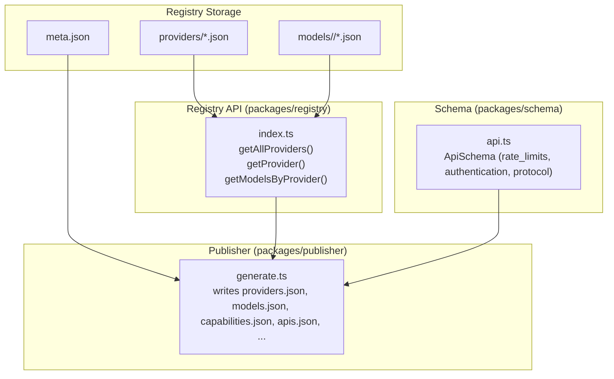
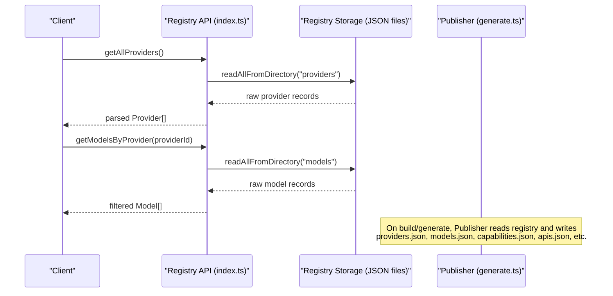
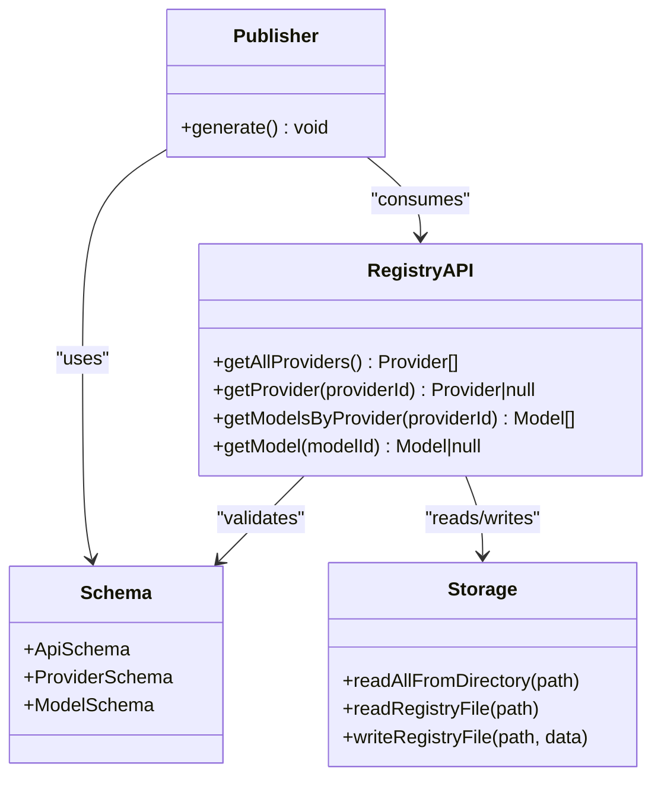

# Provider Information API

<cite>
**Referenced Files in This Document**
- [README.md](file://README.md)
- [meta.json](file://data/registry/meta.json)
- [openai.json](file://data/registry/providers/openai.json)
- [anthropic.json](file://data/registry/providers/anthropic.json)
- [chat-latest.json](file://data/registry/models/openai/chat-latest.json)
- [index.ts](file://packages/registry/src/index.ts)
- [api.ts](file://packages/schema/src/api.ts)
- [runner.ts](file://packages/collectors/src/core/runner.ts)
- [generate.ts](file://packages/publisher/src/generate.ts)
</cite>

## Table of Contents
1. [Introduction](#introduction)
2. [Project Structure](#project-structure)
3. [Core Components](#core-components)
4. [Architecture Overview](#architecture-overview)
5. [Detailed Component Analysis](#detailed-component-analysis)
6. [Dependency Analysis](#dependency-analysis)
7. [Performance Considerations](#performance-considerations)
8. [Troubleshooting Guide](#troubleshooting-guide)
9. [Conclusion](#conclusion)
10. [Appendices](#appendices)

## Introduction
This document provides comprehensive API documentation for Provider Information endpoints exposed by the registry and publisher layers. It explains how to retrieve provider metadata, discover supported models per provider, understand authentication requirements, and check service availability. It also documents response schemas, example queries, rate limiting considerations, caching strategies, error handling, and integration patterns for dynamic discovery and configuration.

The system is not an inference runtime; it is a data layer that discovers, validates, normalizes, stores, analyzes, and publishes structured knowledge about AI models and providers. Consumers can query published datasets or use the registry APIs to programmatically access provider and model information.

**Section sources**
- [README.md:1-30](file://README.md#L1-L30)

## Project Structure
At a high level, provider and model information is stored as JSON files under data/registry and published into flat JSON datasets under dist/. The registry package exposes functions to read and write these records, while the publisher aggregates them into consumable artifacts.

**Diagram sources**
- [index.ts:45-79](file://packages/registry/src/index.ts#L45-L79)
- [generate.ts:177-217](file://packages/publisher/src/generate.ts#L177-L217)
- [api.ts:11-25](file://packages/schema/src/api.ts#L11-L25)

**Section sources**
- [README.md:19-30](file://README.md#L19-L30)
- [index.ts:45-79](file://packages/registry/src/index.ts#L45-L79)
- [generate.ts:177-217](file://packages/publisher/src/generate.ts#L177-L217)

## Core Components
- Provider metadata: Stored per provider under data/registry/providers/<id>.json with fields such as provider_id, name, organization, website, documentation, country, description, status, and provider_type.
- Model catalog: Stored under data/registry/models/<provider>/<model>.json with fields including model_id, provider_id, modality, open_weight, reasoning_support, function_calling, structured_output, vision_support, audio_support, image_generation, embedding_support, capability_ids, and status.
- API capability schema: Defines how a model is accessed via protocols, endpoints, compatibility, authentication methods, and optional rate limits.
- Registry API: Functions to list all providers, fetch a single provider, list all models, fetch a specific model, and filter models by provider.
- Publisher: Aggregates registry data into flat JSON datasets (providers.json, models.json, capabilities.json, apis.json, etc.) along with metadata.

Examples of data:
- Provider record example: [openai.json:1-11](file://data/registry/providers/openai.json#L1-L11), [anthropic.json:1-11](file://data/registry/providers/anthropic.json#L1-L11)
- Model record example: [chat-latest.json:1-19](file://data/registry/models/openai/chat-latest.json#L1-L19)
- Registry API functions: [index.ts:45-79](file://packages/registry/src/index.ts#L45-L79)
- API capability schema: [api.ts:11-25](file://packages/schema/src/api.ts#L11-L25)
- Published datasets generation: [generate.ts:177-217](file://packages/publisher/src/generate.ts#L177-L217)

**Section sources**
- [openai.json:1-11](file://data/registry/providers/openai.json#L1-L11)
- [anthropic.json:1-11](file://data/registry/providers/anthropic.json#L1-L11)
- [chat-latest.json:1-19](file://data/registry/models/openai/chat-latest.json#L1-L19)
- [index.ts:45-79](file://packages/registry/src/index.ts#L45-L79)
- [api.ts:11-25](file://packages/schema/src/api.ts#L11-L25)
- [generate.ts:177-217](file://packages/publisher/src/generate.ts#L177-L217)

## Architecture Overview
The Provider Information API surface is implemented through two primary mechanisms:
- Registry API: Programmatic access to provider and model records via functions that read from and write to the registry storage.
- Published datasets: Flat JSON files generated by the publisher that consumers can fetch directly.

**Diagram sources**
- [index.ts:45-79](file://packages/registry/src/index.ts#L45-L79)
- [generate.ts:177-217](file://packages/publisher/src/generate.ts#L177-L217)

## Detailed Component Analysis

### Provider Metadata Endpoints
- List all providers
  - Method: GET
  - URL pattern: /providers
  - Response schema: Array of Provider objects
  - Fields include: provider_id, name, organization, website, documentation, country, description, status, provider_type
  - Example usage: Query available providers to enumerate supported providers
- Get provider by ID
  - Method: GET
  - URL pattern: /providers/{provider_id}
  - Response schema: Single Provider object or null if not found
  - Example usage: Retrieve detailed metadata for a specific provider

Implementation notes:
- getAllProviders() reads all provider JSON files and parses them against ProviderSchema.
- getProvider(providerId) reads a single provider file and validates it.

Example references:
- Provider record structure: [openai.json:1-11](file://data/registry/providers/openai.json#L1-L11), [anthropic.json:1-11](file://data/registry/providers/anthropic.json#L1-L11)
- Registry functions: [index.ts:45-55](file://packages/registry/src/index.ts#L45-L55)

**Section sources**
- [openai.json:1-11](file://data/registry/providers/openai.json#L1-L11)
- [anthropic.json:1-11](file://data/registry/providers/anthropic.json#L1-L11)
- [index.ts:45-55](file://packages/registry/src/index.ts#L45-L55)

### Supported Models Endpoints
- List all models
  - Method: GET
  - URL pattern: /models
  - Response schema: Array of Model objects
- Get model by ID
  - Method: GET
  - URL pattern: /models/{model_id}
  - Response schema: Single Model object or null if not found
- List models by provider
  - Method: GET
  - URL pattern: /providers/{provider_id}/models
  - Response schema: Array of Model objects filtered by provider_id

Model fields include: model_id, provider_id, name, modality, open_weight, reasoning_support, function_calling, structured_output, vision_support, audio_support, image_generation, embedding_support, capability_ids, status.

Example references:
- Model record structure: [chat-latest.json:1-19](file://data/registry/models/openai/chat-latest.json#L1-L19)
- Registry functions: [index.ts:63-79](file://packages/registry/src/index.ts#L63-L79)

**Section sources**
- [chat-latest.json:1-19](file://data/registry/models/openai/chat-latest.json#L1-L19)
- [index.ts:63-79](file://packages/registry/src/index.ts#L63-L79)

### Authentication Requirements
Authentication methods are defined at the API capability level:
- Authentication types: api-key, oauth2, none, other
- Rate limits may be specified per API endpoint: requests_per_minute, tokens_per_minute, tokens_per_day
- Protocol and endpoint details describe how to consume the model

Integration guidance:
- Use the authentication field to determine required credentials.
- Respect rate_limits when implementing client-side throttling.

Example reference:
- API capability schema: [api.ts:11-25](file://packages/schema/src/api.ts#L11-L25)

**Section sources**
- [api.ts:11-25](file://packages/schema/src/api.ts#L11-L25)

### Service Availability and Status
- Provider status: active indicates the provider is currently recognized and maintained.
- Model status: active indicates the model is currently recognized and maintained.
- Generation metadata: meta.json includes generated_at timestamp and coverage/error summaries.

Usage:
- Check provider/model status fields to determine readiness.
- Use generated_at and coverage to assess freshness and completeness.

Example references:
- Provider status field: [openai.json:1-11](file://data/registry/providers/openai.json#L1-L11)
- Model status field: [chat-latest.json:1-19](file://data/registry/models/openai/chat-latest.json#L1-L19)
- Generation metadata: [meta.json:1-18](file://data/registry/meta.json#L1-L18)

**Section sources**
- [openai.json:1-11](file://data/registry/providers/openai.json#L1-L11)
- [chat-latest.json:1-19](file://data/registry/models/openai/chat-latest.json#L1-L19)
- [meta.json:1-18](file://data/registry/meta.json#L1-L18)

### Capability Matrices
Capability matrices are represented by boolean flags on model records (e.g., vision_support, audio_support, embedding_support) and by capability_ids linking to capability definitions. Additionally, API-level capabilities define protocol, endpoint, and authentication.

Integration guidance:
- Use model boolean flags to determine supported modalities and features.
- Use capability_ids to map to detailed capability definitions.
- Use API schema to determine consumption method and constraints.

Example references:
- Model capability flags: [chat-latest.json:1-19](file://data/registry/models/openai/chat-latest.json#L1-L19)
- API capability schema: [api.ts:11-25](file://packages/schema/src/api.ts#L11-L25)

**Section sources**
- [chat-latest.json:1-19](file://data/registry/models/openai/chat-latest.json#L1-L19)
- [api.ts:11-25](file://packages/schema/src/api.ts#L11-L25)

### Dynamic Discovery and Configuration
Applications can dynamically discover providers and models using the registry API or published datasets:
- Discover providers: Call getAllProviders() or fetch providers.json.
- Discover models: Call getModelsByProvider(providerId) or fetch models.json.
- Configure connections: Read authentication and rate_limits from API capability schema to set up clients.

Example references:
- Registry functions: [index.ts:45-79](file://packages/registry/src/index.ts#L45-L79)
- Published datasets generation: [generate.ts:177-217](file://packages/publisher/src/generate.ts#L177-L217)

**Section sources**
- [index.ts:45-79](file://packages/registry/src/index.ts#L45-L79)
- [generate.ts:177-217](file://packages/publisher/src/generate.ts#L177-L217)

## Dependency Analysis
The registry API depends on schema validation and storage utilities. The publisher depends on registry data and schema definitions to generate flat datasets. Collectors auto-register providers and stamp freshness.

**Diagram sources**
- [index.ts:45-79](file://packages/registry/src/index.ts#L45-L79)
- [api.ts:11-25](file://packages/schema/src/api.ts#L11-L25)
- [generate.ts:177-217](file://packages/publisher/src/generate.ts#L177-L217)

**Section sources**
- [index.ts:45-79](file://packages/registry/src/index.ts#L45-L79)
- [api.ts:11-25](file://packages/schema/src/api.ts#L11-L25)
- [generate.ts:177-217](file://packages/publisher/src/generate.ts#L177-L217)

## Performance Considerations
- Caching strategies:
  - Cache provider and model lists locally to reduce repeated reads.
  - Use updated_at timestamps to detect stale entries and refresh selectively.
- Rate limiting:
  - Respect rate_limits defined in API capability schema to avoid throttling.
  - Implement exponential backoff for transient failures.
- Batch operations:
  - Prefer batch fetching of models by provider rather than individual model lookups when possible.

[No sources needed since this section provides general guidance]

## Troubleshooting Guide
Common issues and resolutions:
- Unauthorized errors during collection:
  - Ensure API keys are correctly configured and have sufficient permissions.
  - Handle non-retryable HTTP failures with actionable hints.
- Missing provider records:
  - Providers may be auto-registered on first model collection; verify ensureProviderRegistered behavior.
- Stale data:
  - Compare updated_at across snapshots to identify never-refreshed entries.

Example references:
- Non-retryable HTTP failure handling: [runner.test.ts:147-159](file://packages/collectors/src/__tests__/runner.test.ts#L147-L159)
- Auto-registration logic: [runner.ts:337-363](file://packages/collectors/src/core/runner.ts#L337-L363)
- Freshness stamping: [index.ts:39-41](file://packages/registry/src/index.ts#L39-L41)

**Section sources**
- [runner.test.ts:147-159](file://packages/collectors/src/__tests__/runner.test.ts#L147-L159)
- [runner.ts:337-363](file://packages/collectors/src/core/runner.ts#L337-L363)
- [index.ts:39-41](file://packages/registry/src/index.ts#L39-L41)

## Conclusion
The Provider Information API provides robust mechanisms to discover and configure provider connections through both programmatic registry functions and published datasets. By leveraging provider metadata, model catalogs, authentication requirements, and capability matrices, applications can dynamically integrate with multiple AI providers while respecting rate limits and handling errors gracefully.

[No sources needed since this section summarizes without analyzing specific files]

## Appendices

### Example Queries
- Query available providers:
  - Use getAllProviders() or fetch providers.json to enumerate providers.
- Get provider-specific model lists:
  - Use getModelsByProvider(providerId) or filter models.json by provider_id.
- Check service status:
  - Inspect status fields in provider and model records; review meta.json for generation metadata.

Example references:
- Registry functions: [index.ts:45-79](file://packages/registry/src/index.ts#L45-L79)
- Published datasets generation: [generate.ts:177-217](file://packages/publisher/src/generate.ts#L177-L217)

**Section sources**
- [index.ts:45-79](file://packages/registry/src/index.ts#L45-L79)
- [generate.ts:177-217](file://packages/publisher/src/generate.ts#L177-L217)