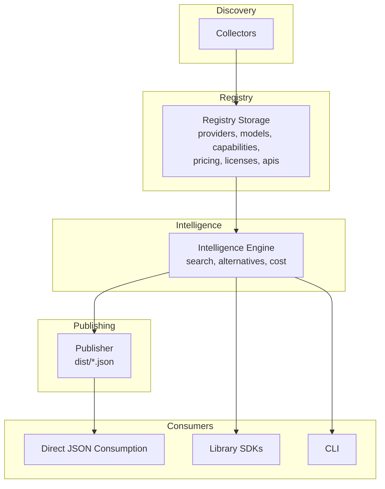
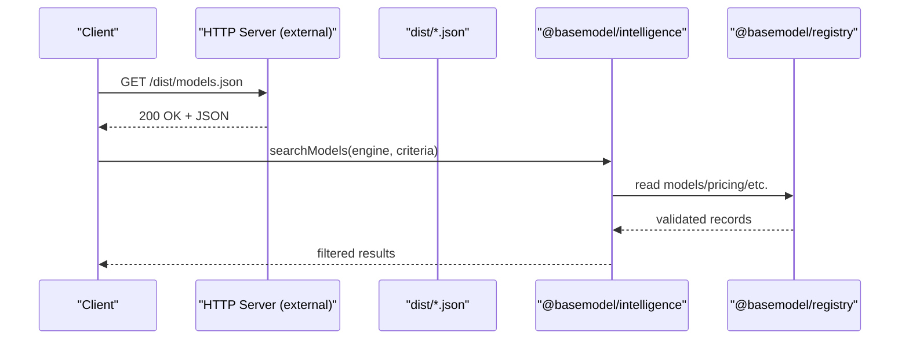
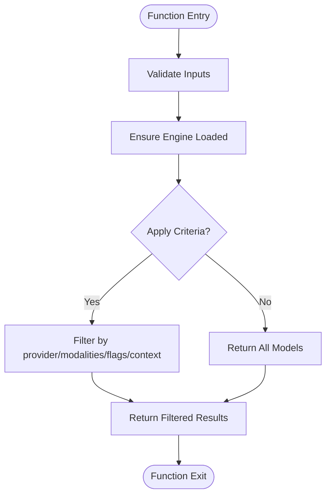
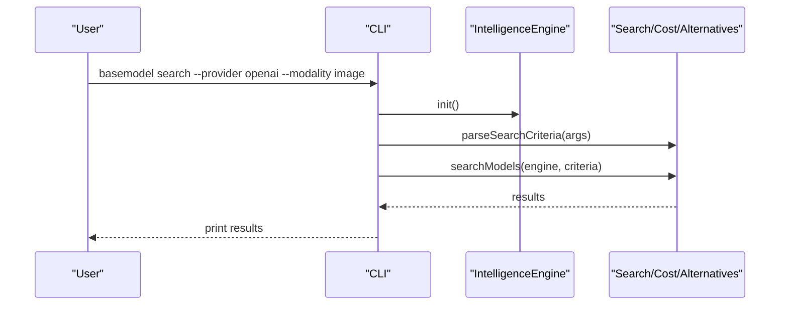
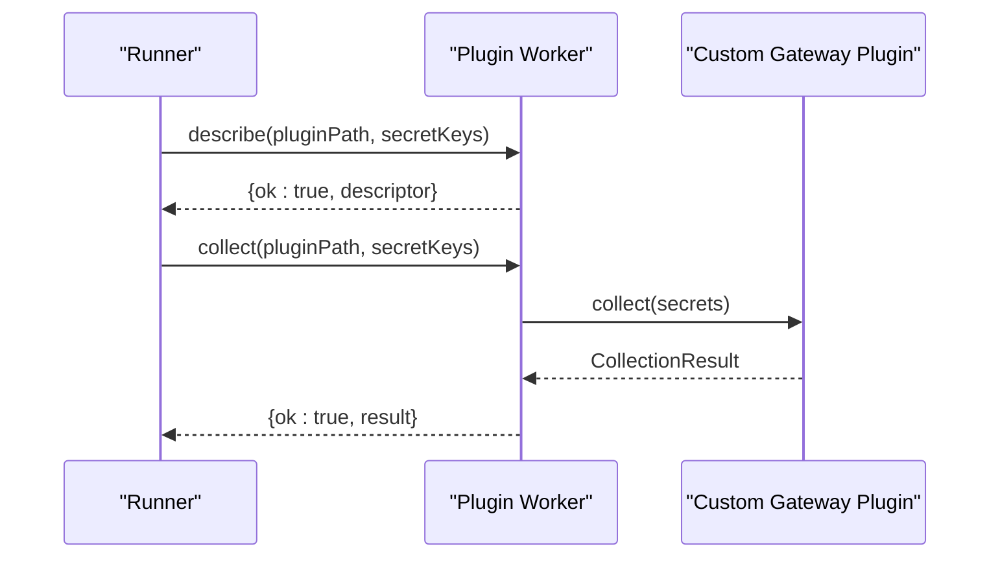
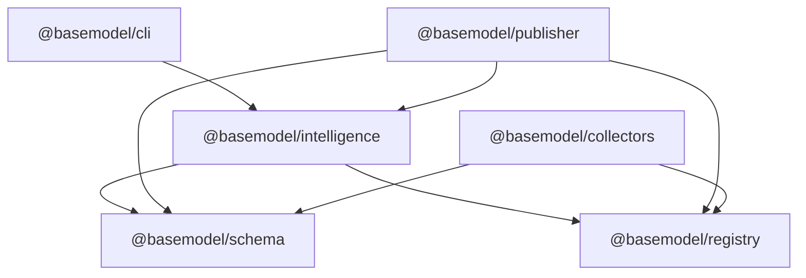

# Web API Endpoints

<cite>
**Referenced Files in This Document**
- [README.md](file://README.md)
- [07_Developer_Access.md](file://docs/07_Developer_Access.md)
- [03_Architecture.md](file://docs/03_Architecture.md)
- [cli.ts](file://packages/cli/src/cli.ts)
- [search.ts](file://packages/intelligence/src/features/search.ts)
- [cost.ts](file://packages/intelligence/src/features/cost.ts)
- [alternatives.ts](file://packages/intelligence/src/features/alternatives.ts)
- [index.ts (registry)](file://packages/registry/src/index.ts)
- [runner.ts](file://packages/collectors/src/core/runner.ts)
- [plugin-worker.ts](file://packages/collectors/src/core/plugin-worker.ts)
- [gateway-secrets.ts](file://packages/collectors/src/core/gateway-secrets.ts)
</cite>

## Table of Contents
1. [Introduction](#introduction)
2. [Project Structure](#project-structure)
3. [Core Components](#core-components)
4. [Architecture Overview](#architecture-overview)
5. [Detailed Component Analysis](#detailed-component-analysis)
6. [Dependency Analysis](#dependency-analysis)
7. [Performance Considerations](#performance-considerations)
8. [Troubleshooting Guide](#troubleshooting-guide)
9. [Conclusion](#conclusion)
10. [Appendices](#appendices)

## Introduction
This document provides comprehensive web API documentation for BaseModel’s HTTP endpoints and data access patterns. BaseModel is an open-source AI model intelligence platform that discovers, validates, normalizes, stores, analyzes, and publishes structured knowledge about AI models. It does not expose a runtime HTTP server; instead, it publishes static datasets and exposes programmatic interfaces via npm packages and a CLI. Consumers can:
- Download published JSON datasets from the repository or distribution mirrors.
- Use the @basemodel/intelligence library to search models, compute cost efficiency, and find alternatives.
- Use the CLI to query intelligence locally.

There are no WebSocket APIs in this repository. All interactions are either file-based dataset consumption or library calls.

**Section sources**
- [README.md](file://README.md)
- [03_Architecture.md](file://docs/03_Architecture.md)

## Project Structure
BaseModel organizes functionality into distinct layers and packages:
- Discovery Layer: Collectors gather provider and gateway data.
- Registry Layer: Canonical storage and validation of providers, models, capabilities, pricing, licenses, and APIs.
- Intelligence Layer: Derived insights including search, alternatives, and cost heuristics.
- Publishing Layer: Generates public datasets written to dist/.
- CLI: Terminal interface over the intelligence layer.

**Diagram sources**
- [03_Architecture.md](file://docs/03_Architecture.md)

**Section sources**
- [03_Architecture.md](file://docs/03_Architecture.md)
- [README.md](file://README.md)

## Core Components
- Direct JSON datasets (HTTP GET):
  - models.json: Models and their capabilities.
  - providers.json: Provider metadata.
  - capabilities.json: Canonical capability vocabulary.
  - licenses.json: License metadata.
  - apis.json: Model access methods.
  - benchmarks.json: Benchmark results.
  - pricing.json: Pricing records.
  - intelligence.json: Derived cost and alternative data.

- Library SDKs (programmatic):
  - @basemodel/schema: Canonical schemas and TypeScript types.
  - @basemodel/registry: Read/write canonical registry data.
  - @basemodel/intelligence: Search, alternatives, and cost heuristics.
  - @basemodel/publisher: Generate public datasets.

- CLI commands:
  - basemodel search --provider <id> --modality <m> --flag <f> --min-context <n>
  - basemodel info <model-id>
  - basemodel alternatives <model-id>

Authentication and rate limiting:
- No authentication is required for direct JSON consumption.
- No built-in rate limiting is implemented in this repository; consumers should implement client-side retry/backoff as needed.

Error handling and status codes:
- For direct JSON consumption, standard HTTP semantics apply (e.g., 200 OK on success, 404 Not Found if files are missing).
- For library usage, errors are thrown by functions when inputs are invalid or data is missing.

Retry strategies:
- Implement exponential backoff with jitter at the client level for transient network failures.

WebSocket APIs:
- None available in this repository.

**Section sources**
- [07_Developer_Access.md](file://docs/07_Developer_Access.md)
- [README.md](file://README.md)

## Architecture Overview
The system follows a layered architecture where collectors feed the registry, the intelligence layer derives insights, and the publisher generates static datasets consumed by clients.

**Diagram sources**
- [07_Developer_Access.md](file://docs/07_Developer_Access.md)
- [index.ts (registry)](file://packages/registry/src/index.ts)

## Detailed Component Analysis

### REST Endpoints: Direct JSON Consumption
All endpoints are simple HTTP GET requests to static JSON files produced by the publisher.

- Endpoint: GET /dist/models.json
  - Description: Returns all models and their capabilities.
  - Response schema: Array of Model objects as defined by @basemodel/schema.
  - Authentication: None.
  - Rate limiting: Not enforced by this repository.
  - Error responses: 404 Not Found if file missing; otherwise 200 OK.

- Endpoint: GET /dist/providers.json
  - Description: Returns provider metadata.
  - Response schema: Array of Provider objects.
  - Authentication: None.
  - Rate limiting: Not enforced by this repository.
  - Error responses: 404 Not Found if file missing; otherwise 200 OK.

- Endpoint: GET /dist/capabilities.json
  - Description: Returns canonical capability vocabulary.
  - Response schema: Array of Capability objects.
  - Authentication: None.
  - Rate limiting: Not enforced by this repository.
  - Error responses: 404 Not Found if file missing; otherwise 200 OK.

- Endpoint: GET /dist/licenses.json
  - Description: Returns license metadata.
  - Response schema: Array of License objects.
  - Authentication: None.
  - Rate limiting: Not enforced by this repository.
  - Error responses: 404 Not Found if file missing; otherwise 200 OK.

- Endpoint: GET /dist/apis.json
  - Description: Returns model access methods.
  - Response schema: Array of Api objects.
  - Authentication: None.
  - Rate limiting: Not enforced by this repository.
  - Error responses: 404 Not Found if file missing; otherwise 200 OK.

- Endpoint: GET /dist/benchmarks.json
  - Description: Returns benchmark results.
  - Response schema: Array of Benchmark objects.
  - Authentication: None.
  - Rate limiting: Not enforced by this repository.
  - Error responses: 404 Not Found if file missing; otherwise 200 OK.

- Endpoint: GET /dist/pricing.json
  - Description: Returns pricing records.
  - Response schema: Array of Pricing objects.
  - Authentication: None.
  - Rate limiting: Not enforced by this repository.
  - Error responses: 404 Not Found if file missing; otherwise 200 OK.

- Endpoint: GET /dist/intelligence.json
  - Description: Returns derived cost and alternative data.
  - Response schema: Object containing intelligence fields as generated by the publisher.
  - Authentication: None.
  - Rate limiting: Not enforced by this repository.
  - Error responses: 404 Not Found if file missing; otherwise 200 OK.

Client implementation examples:
- Python example path: See usage pattern in docs for fetching intelligence.json.
- JavaScript/TypeScript example path: See usage pattern in docs for hydrating engine with models, providers, capabilities, pricing.

**Section sources**
- [07_Developer_Access.md](file://docs/07_Developer_Access.md)
- [README.md](file://README.md)

### Programmatic API: Intelligence Engine
The @basemodel/intelligence package provides core functions for searching models, computing cost efficiency, and finding alternatives.

- Function: searchModels(engine, criteria)
  - Input: IntelligenceEngine instance and SearchCriteria object.
  - Output: Array of Model objects matching criteria.
  - Criteria fields:
    - providerIds?: string[]
    - modalities?: string[]
    - flags?: Array<keyof Model>
    - minContextWindow?: number
  - Errors: Throws if engine not initialized or data missing.

- Function: calculateCostEfficiency(engine, modelId)
  - Input: IntelligenceEngine instance and modelId string.
  - Output: CostEfficiencyReport with fields like tier, blendedCost, input/output costs.
  - Errors: Returns Unknown tier if pricing missing.

- Function: findAlternatives(engine, modelId, limit)
  - Input: IntelligenceEngine instance, modelId string, optional limit.
  - Output: Array of AlternativeResult objects with reasons and model details.
  - Errors: Throws if modelId not found.

**Diagram sources**
- [search.ts](file://packages/intelligence/src/features/search.ts)

**Section sources**
- [search.ts](file://packages/intelligence/src/features/search.ts)
- [cost.ts](file://packages/intelligence/src/features/cost.ts)
- [alternatives.ts](file://packages/intelligence/src/features/alternatives.ts)

### CLI Commands
The CLI exposes intelligence operations via terminal commands.

- Command: basemodel search
  - Flags: --provider, --modality, --flag, --min-context
  - Behavior: Initializes IntelligenceEngine, parses criteria, runs searchModels, prints results.

- Command: basemodel info
  - Argument: model-id
  - Behavior: Finds model by ID, prints details including capabilities and pricing tier.

- Command: basemodel alternatives
  - Argument: model-id
  - Behavior: Computes alternatives using findAlternatives, prints ranked suggestions.

**Diagram sources**
- [cli.ts](file://packages/cli/src/cli.ts)
- [search.ts](file://packages/intelligence/src/features/search.ts)

**Section sources**
- [cli.ts](file://packages/cli/src/cli.ts)

### Registry Access Patterns
The registry layer provides functions to read and write canonical records.

- Functions:
  - getAllModels(): Promise<Model[]>
  - getModel(modelId: string): Promise<Model | null>
  - getModelsByProvider(providerId: string): Promise<Model[]>
  - saveModel(model: Model): Promise<void>
  - getAllPricing(): Promise<Pricing[]>
  - savePricingRecords(providerId: string, records: Pricing[]): Promise<void>
  - clearPricingRegistry(): Promise<void>
  - getAllApis(): Promise<Api[]>
  - getAllLicenses(): Promise<License[]>
  - getLicense(licenseId: string): Promise<License | null>

These functions validate data against Zod schemas and persist to JSON files under data/registry/.

**Section sources**
- [index.ts (registry)](file://packages/registry/src/index.ts)

### Gateway Plugin Execution
Gateway plugins run in isolated child processes with restricted secrets.

- Worker lifecycle:
  - Describe action returns plugin descriptor.
  - Collect action executes custom collect(secrets) with redacted error messages.
  - Secrets are injected only for registered keys per gateway.

**Diagram sources**
- [plugin-worker.ts](file://packages/collectors/src/core/plugin-worker.ts)
- [runner.ts](file://packages/collectors/src/core/runner.ts)
- [gateway-secrets.ts](file://packages/collectors/src/core/gateway-secrets.ts)

**Section sources**
- [plugin-worker.ts](file://packages/collectors/src/core/plugin-worker.ts)
- [runner.ts](file://packages/collectors/src/core/runner.ts)
- [gateway-secrets.ts](file://packages/collectors/src/core/gateway-secrets.ts)

## Dependency Analysis
The components have clear dependencies:
- CLI depends on @basemodel/intelligence.
- Intelligence depends on @basemodel/schema and @basemodel/registry.
- Publisher depends on @basemodel/schema, @basemodel/registry, and @basemodel/intelligence.
- Collectors depend on @basemodel/registry and @basemodel/schema.

**Diagram sources**
- [package.json (root)](file://package.json)
- [package.json (intelligence)](file://packages/intelligence/package.json)
- [package.json (publisher)](file://packages/publisher/package.json)

**Section sources**
- [package.json](file://package.json)
- [packages/intelligence/package.json](file://packages/intelligence/package.json)
- [packages/publisher/package.json](file://packages/publisher/package.json)

## Performance Considerations
- Dataset size: Large JSON files may require efficient parsing and caching on the client side.
- Memory usage: Loading entire datasets into memory can be expensive; consider streaming or partial loading.
- Network latency: Implement retries with exponential backoff for failed requests.
- CPU usage: Filtering and ranking operations in the intelligence layer are O(n) over models; pre-filter by provider or modality reduces workload.

[No sources needed since this section provides general guidance]

## Troubleshooting Guide
Common issues and resolutions:
- Missing dataset files: Ensure the publisher has run successfully and dist/ contains expected files.
- Invalid schema data: Verify registry entries conform to Zod schemas; use validation utilities.
- Plugin execution errors: Check secret keys are correctly registered and environment variables are set; errors are redacted to prevent leaks.
- CLI command failures: Confirm Node.js version >= 20 and pnpm >= 9; re-run build and generate steps.

**Section sources**
- [plugin-worker.ts](file://packages/collectors/src/core/plugin-worker.ts)
- [gateway-secrets.ts](file://packages/collectors/src/core/gateway-secrets.ts)
- [README.md](file://README.md)

## Conclusion
BaseModel provides robust data infrastructure for AI model intelligence through static datasets and programmatic libraries. While there is no built-in HTTP server, consumers can reliably access data via direct JSON downloads or SDK bindings. The CLI offers convenient local querying. For production deployments, implement client-side resilience patterns such as retries and caching.

[No sources needed since this section summarizes without analyzing specific files]

## Appendices

### Client Implementation Examples
- Python: Fetch intelligence.json and iterate over records.
- JavaScript/TypeScript: Hydrate IntelligenceEngine with models, providers, capabilities, pricing.

For exact code patterns, refer to the developer access documentation.

**Section sources**
- [07_Developer_Access.md](file://docs/07_Developer_Access.md)