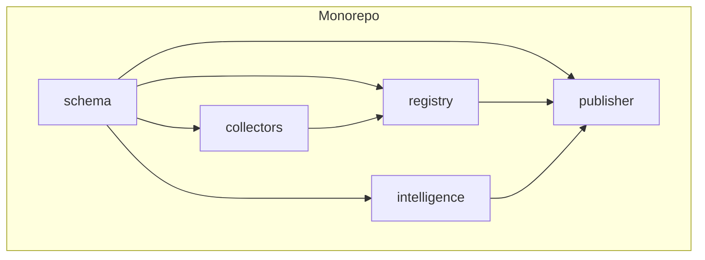
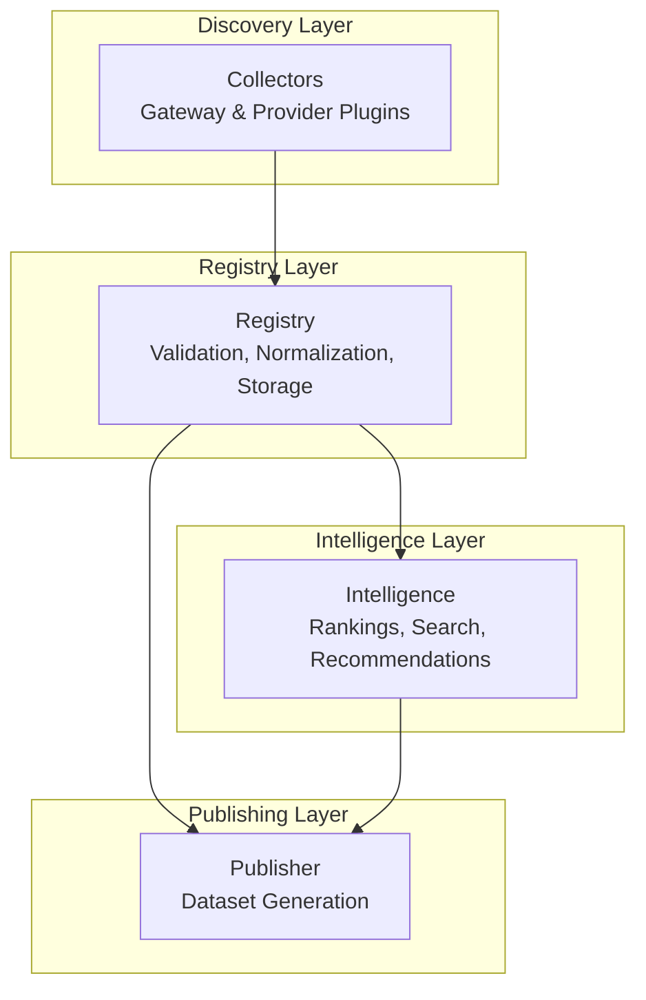
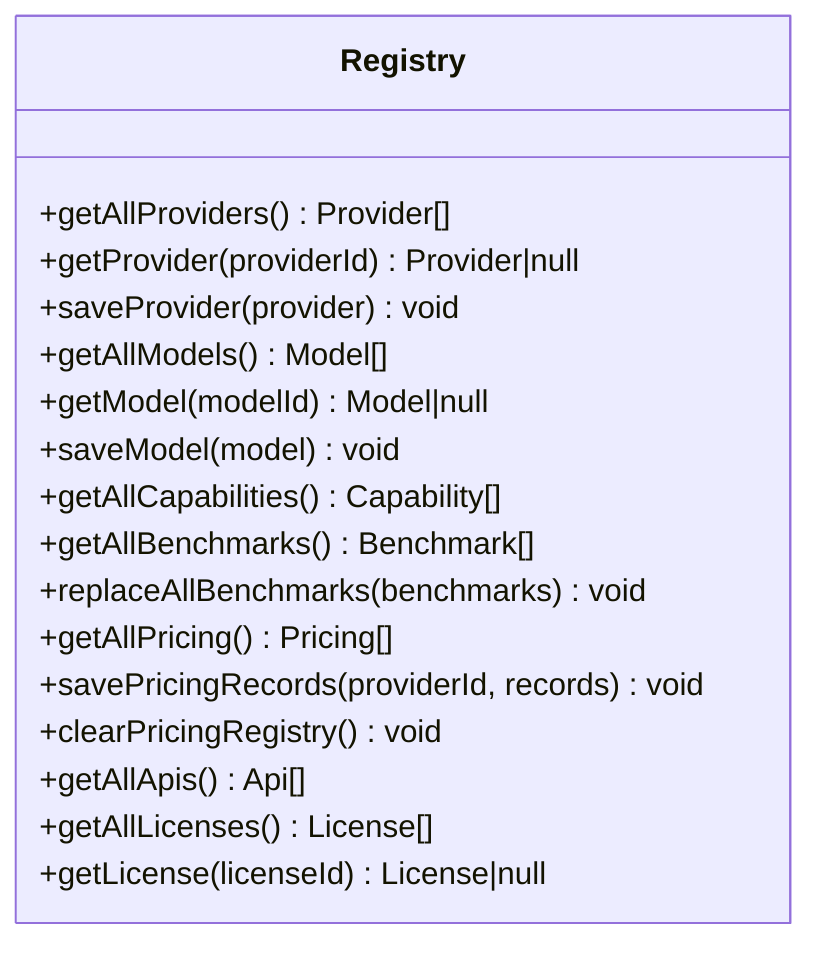
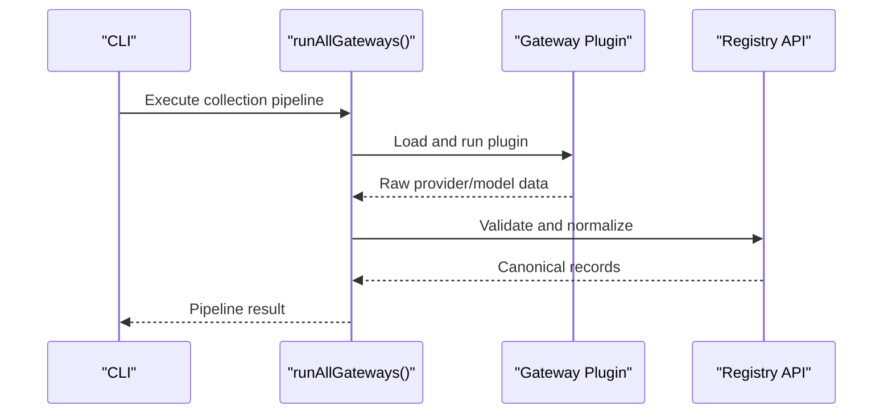
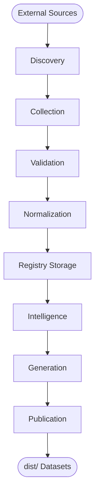
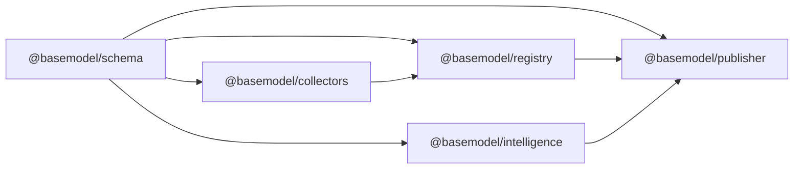

# Architecture & Design

<cite>
**Referenced Files in This Document**
- [README.md](file://README.md)
- [package.json](file://package.json)
- [pnpm-workspace.yaml](file://pnpm-workspace.yaml)
- [03_Architecture.md](file://docs/03_Architecture.md)
- [04_Pipeline.md](file://docs/04_Pipeline.md)
- [05_Data_Model.md](file://docs/05_Data_Model.md)
- [registry/package.json](file://packages/registry/package.json)
- [collectors/package.json](file://packages/collectors/package.json)
- [intelligence/package.json](file://packages/intelligence/package.json)
- [publisher/package.json](file://packages/publisher/package.json)
- [registry/src/index.ts](file://packages/registry/src/index.ts)
- [collectors/src/run.ts](file://packages/collectors/src/run.ts)
</cite>

## Table of Contents
1. [Introduction](#introduction)
2. [Project Structure](#project-structure)
3. [Core Components](#core-components)
4. [Architecture Overview](#architecture-overview)
5. [Detailed Component Analysis](#detailed-component-analysis)
6. [Dependency Analysis](#dependency-analysis)
7. [Performance Considerations](#performance-considerations)
8. [Troubleshooting Guide](#troubleshooting-guide)
9. [Conclusion](#conclusion)

## Introduction
BaseModel is an open-source AI model intelligence platform that discovers, validates, normalizes, stores, analyzes, and publishes structured knowledge about AI models. It is intentionally not an inference runtime or end-user application; it is the data layer consumed by other systems. The system is organized as a monorepo with clear separation between discovery, registry, intelligence, and publishing layers. Data flows from external sources through collectors into canonical storage and then to published datasets.

**Section sources**
- [README.md:1-61](file://README.md#L1-L61)

## Project Structure
The repository is a pnpm workspace containing multiple packages that implement each architectural layer:
- schema: Canonical Zod schemas and TypeScript types (referenced by other packages).
- registry: Storage, validation, normalization, and merge utilities for canonical records.
- collectors: Discovery and collection of provider and gateway data.
- intelligence: Derived rankings, search, and recommendations from registry data.
- publisher: Dataset generation for dist/.
- cli: Command-line interface for querying intelligence.

**Diagram sources**
- [pnpm-workspace.yaml:1-3](file://pnpm-workspace.yaml#L1-L3)
- [registry/package.json:1-35](file://packages/registry/package.json#L1-L35)
- [collectors/package.json:1-41](file://packages/collectors/package.json#L1-L41)
- [intelligence/package.json:1-50](file://packages/intelligence/package.json#L1-L50)
- [publisher/package.json:1-38](file://packages/publisher/package.json#L1-L38)

**Section sources**
- [README.md:11-30](file://README.md#L11-L30)
- [pnpm-workspace.yaml:1-3](file://pnpm-workspace.yaml#L1-L3)

## Core Components
- Discovery Layer: Finds providers, models, documentation pages, and benchmark sources. Implemented via gateway and provider collectors.
- Registry Layer: Stores canonical records after validation and normalization. Source of truth for providers, models, capabilities, pricing, licenses, APIs, benchmarks.
- Intelligence Layer: Derives search, alternatives, and cost information without modifying canonical records.
- Publishing Layer: Converts registry and intelligence data into public JSON datasets under dist/.

Package mapping:
- @basemodel/schema defines canonical schemas and types.
- @basemodel/registry reads, writes, and validates registry files.
- @basemodel/collectors discovers and collects gateway data.
- @basemodel/intelligence computes derived model intelligence.
- @basemodel/publisher generates public datasets.
- @basemodel/cli exposes intelligence from the terminal.

**Section sources**
- [03_Architecture.md:1-77](file://docs/03_Architecture.md#L1-L77)

## Architecture Overview
The layered architecture enforces strict boundaries and responsibilities:
- Discovery and Collection occur in collectors.
- Validation and Normalization occur in registry.
- Intelligence derives insights from registry data.
- Publishing converts registry and intelligence into static datasets.

**Diagram sources**
- [03_Architecture.md:1-77](file://docs/03_Architecture.md#L1-L77)

## Detailed Component Analysis

### Registry Layer
Responsibilities:
- Validate incoming records against canonical schemas.
- Normalize provider-specific data into BaseModel’s canonical representation.
- Persist canonical entities under data/registry with updated_at timestamps.
- Provide read/write APIs for providers, models, capabilities, benchmarks, pricing, APIs, and licenses.

Key implementation highlights:
- Exposes typed functions for CRUD operations on each entity type.
- Uses Zod schemas from @basemodel/schema for validation.
- Stamps updated_at on write to support freshness tracking.
- Persists benchmarks and pricing as per-source rollup arrays for partial-failure safety.

**Diagram sources**
- [registry/src/index.ts:1-169](file://packages/registry/src/index.ts#L1-L169)

**Section sources**
- [registry/src/index.ts:1-169](file://packages/registry/src/index.ts#L1-L169)
- [registry/package.json:1-35](file://packages/registry/package.json#L1-L35)

### Collectors (Plugin-like System)
Responsibilities:
- Discover and collect data from provider gateways and external sources.
- Support OpenAI-compatible gateway plugins and custom gateway plugins.
- Orchestrate collection runs and verification.

Entry point and orchestration:
- Main runner auto-discovers gateway plugins and executes them sequentially.
- Provides commands for collecting, enriching, verifying, and benchmarking.

**Diagram sources**
- [collectors/src/run.ts:1-17](file://packages/collectors/src/run.ts#L1-L17)
- [collectors/package.json:1-41](file://packages/collectors/package.json#L1-L41)

**Section sources**
- [collectors/src/run.ts:1-17](file://packages/collectors/src/run.ts#L1-L17)
- [collectors/package.json:1-41](file://packages/collectors/package.json#L1-L41)

### Intelligence Layer
Responsibilities:
- Compute derived insights such as search results, alternative suggestions, and cost tiers.
- Read-only access to registry data; does not modify canonical records.

Dependencies:
- Depends on @basemodel/schema and @basemodel/registry.

**Section sources**
- [intelligence/package.json:1-50](file://packages/intelligence/package.json#L1-L50)
- [03_Architecture.md:23-29](file://docs/03_Architecture.md#L23-L29)

### Publishing Layer
Responsibilities:
- Generate public JSON datasets under dist/ from registry and intelligence data.
- Include metadata fields like schema_version, source_revision, generated_at, and count.

Outputs include providers.json, models.json, capabilities.json, licenses.json, apis.json, benchmarks.json, pricing.json, intelligence.json, and metadata.json.

**Section sources**
- [publisher/package.json:1-38](file://packages/publisher/package.json#L1-L38)
- [04_Pipeline.md:64-84](file://docs/04_Pipeline.md#L64-L84)

### Data Flow Patterns
End-to-end flow from external sources to published datasets:
- Discovery identifies sources.
- Collection retrieves structured data.
- Validation rejects malformed records.
- Normalization converts to canonical schemas.
- Registry stores canonical records.
- Intelligence derives insights.
- Generation writes public datasets.
- Publication distributes datasets.

**Diagram sources**
- [04_Pipeline.md:1-84](file://docs/04_Pipeline.md#L1-L84)

**Section sources**
- [04_Pipeline.md:1-84](file://docs/04_Pipeline.md#L1-L84)

### Schema-First Development Approach
- Canonical schemas are defined in @basemodel/schema and used across all layers.
- Registry uses Zod schemas to validate and parse records.
- Ensures consistency, stability, and extensibility of the domain model.

**Section sources**
- [registry/src/index.ts:1-18](file://packages/registry/src/index.ts#L1-L18)
- [05_Data_Model.md:1-22](file://docs/05_Data_Model.md#L1-L22)

## Dependency Analysis
Monorepo dependencies and package relationships:
- All layers depend on @basemodel/schema for canonical types and schemas.
- Collectors depend on registry for validation and persistence.
- Intelligence depends on registry for read-only insights.
- Publisher depends on registry and intelligence to generate outputs.

**Diagram sources**
- [registry/package.json:1-35](file://packages/registry/package.json#L1-L35)
- [collectors/package.json:1-41](file://packages/collectors/package.json#L1-L41)
- [intelligence/package.json:1-50](file://packages/intelligence/package.json#L1-L50)
- [publisher/package.json:1-38](file://packages/publisher/package.json#L1-L38)

**Section sources**
- [package.json:1-31](file://package.json#L1-L31)
- [pnpm-workspace.yaml:1-3](file://pnpm-workspace.yaml#L1-L3)

## Performance Considerations
- Partial-failure safety: Benchmarks and pricing are persisted as per-source rollup arrays to avoid corrupting entire datasets on failures.
- Freshness tracking: Entities stamped with updated_at enable consumers to detect stale entries.
- Enrichment resilience: If primary pricing sources fail, fallbacks are used; if all fail, the run is marked fatal to prevent committing stale data.
- Rate limiting and fallbacks: Benchmark collection falls back to mirror snapshots when upstream services are rate-limited or unreachable.

[No sources needed since this section provides general guidance]

## Troubleshooting Guide
Common issues and strategies:
- Invalid records: Rejected during validation before reaching the registry; logs errors and continues processing valid records.
- Missing timestamps: Records lacking updated_at indicate never-refreshed entries; consumers should treat these as potentially stale.
- Enrichment failures: When all pricing sources fail, the run exits non-zero to signal CI failure; check data/registry/meta.json for per-source status and errors.
- Benchmark availability: Without Hugging Face tokens, unauthenticated requests may be rate-limited; configure secrets to improve reliability.

**Section sources**
- [04_Pipeline.md:86-126](file://docs/04_Pipeline.md#L86-L126)
- [04_Pipeline.md:127-217](file://docs/04_Pipeline.md#L127-L217)

## Conclusion
BaseModel’s layered architecture cleanly separates discovery, registry, intelligence, and publishing concerns. The schema-first approach ensures canonical consistency across layers. The plugin-like collector system enables extensible integrations with diverse providers and gateways. Robust error handling, freshness tracking, and partial-failure safety make the platform resilient and reliable for downstream consumers.

[No sources needed since this section summarizes without analyzing specific files]