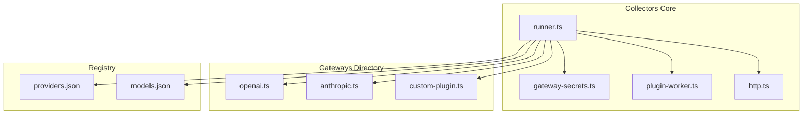
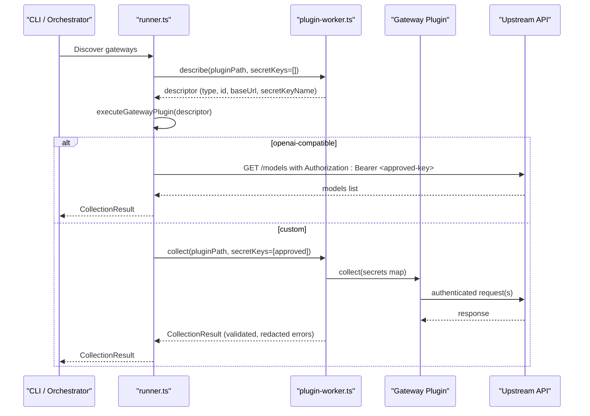
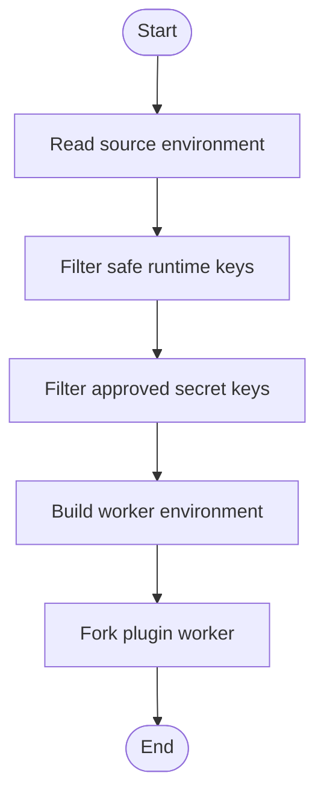
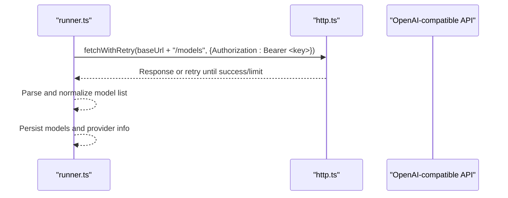
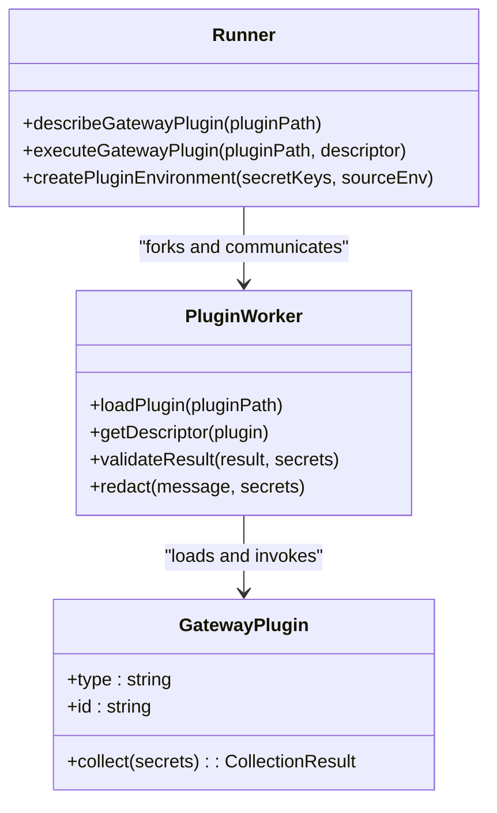
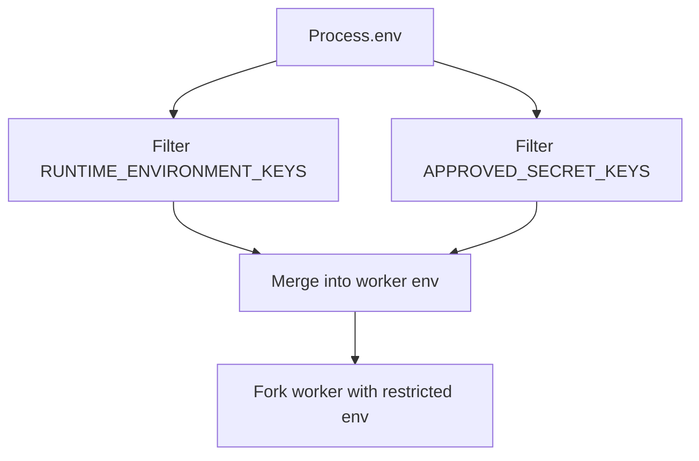
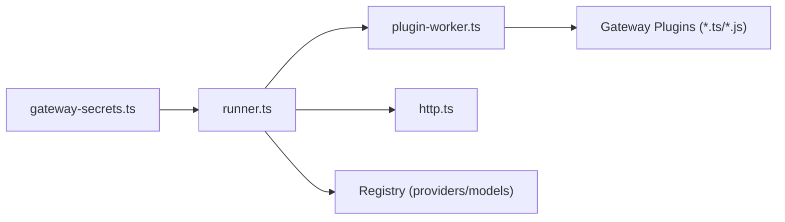

# Authentication & Security Handlers

<cite>
**Referenced Files in This Document**
- [README.md](file://README.md)
- [07_Developer_Access.md](file://docs/07_Developer_Access.md)
- [08_Gateway_Plugin_Security.md](file://docs/08_Gateway_Plugin_Security.md)
- [gateway-secrets.ts](file://packages/collectors/src/core/gateway-secrets.ts)
- [runner.ts](file://packages/collectors/src/core/runner.ts)
- [plugin-worker.ts](file://packages/collectors/src/core/plugin-worker.ts)
- [http.ts](file://packages/collectors/src/core/http.ts)
- [e2e.test.ts](file://packages/collectors/src/__tests__/e2e.test.ts)
</cite>

## Table of Contents
1. [Introduction](#introduction)
2. [Project Structure](#project-structure)
3. [Core Components](#core-components)
4. [Architecture Overview](#architecture-overview)
5. [Detailed Component Analysis](#detailed-component-analysis)
6. [Dependency Analysis](#dependency-analysis)
7. [Performance Considerations](#performance-considerations)
8. [Troubleshooting Guide](#troubleshooting-guide)
9. [Conclusion](#conclusion)
10. [Appendices](#appendices)

## Introduction
This document explains how authentication and security are implemented for the collector system’s gateway plugins. It covers supported authentication methods (API keys, OAuth tokens, JWT), credential storage mechanisms, environment variable management, and secure configuration practices. It also provides guidance on implementing custom authentication handlers and best practices for handling sensitive credentials securely.

The collector treats gateway plugins as untrusted code executed in isolated workers with a minimal, centrally approved set of secrets. Secrets are never granted by plugin declarations; they must be explicitly registered in the core secret registry.

**Section sources**
- [README.md:10-40](file://README.md#L10-L40)
- [08_Gateway_Plugin_Security.md:1-36](file://docs/08_Gateway_Plugin_Security.md#L1-L36)

## Project Structure
Authentication and security logic is concentrated in the collectors package under core modules:
- Secret registry: defines which environment variables each gateway may access.
- Runner: orchestrates plugin discovery, metadata loading, execution, and persistence.
- Plugin worker: executes custom plugins in an isolated child process with a restricted environment.
- HTTP helpers: provide resilient fetch behavior used by OpenAI-compatible gateways.
- Documentation: describes security boundaries and developer workflows.

**Diagram sources**
- [gateway-secrets.ts:1-27](file://packages/collectors/src/core/gateway-secrets.ts#L1-L27)
- [runner.ts:156-238](file://packages/collectors/src/core/runner.ts#L156-L238)
- [plugin-worker.ts:1-113](file://packages/collectors/src/core/plugin-worker.ts#L1-L113)
- [http.ts:1-38](file://packages/collectors/src/core/http.ts#L1-L38)

**Section sources**
- [README.md:10-40](file://README.md#L10-L40)
- [07_Developer_Access.md:105-113](file://docs/07_Developer_Access.md#L105-L113)

## Core Components
- Centralized secret registry:
  - Defines allowed environment variable names per gateway ID.
  - Enforces that only these keys are injected into plugin workers.
- Runner:
  - Discovers gateway plugins.
  - Describes plugin metadata without exposing secrets.
  - Executes OpenAI-compatible gateways directly or delegates custom plugins to an isolated worker.
  - Persists results and reconciles lifecycle states.
- Plugin worker:
  - Loads and validates plugin descriptors.
  - Injects only approved secrets from the environment.
  - Validates responses for size, structure, and secret leakage.
  - Redacts secrets in error messages.
- HTTP helper:
  - Provides retry with backoff and timeouts for transient failures.

Key behaviors:
- Only centrally approved secrets are passed to plugins.
- Unregistered gateways receive no secrets.
- Custom plugins run in a separate process with a restricted environment.
- Responses are validated against schema and size limits.
- Errors are redacted to prevent secret leakage.

**Section sources**
- [gateway-secrets.ts:1-27](file://packages/collectors/src/core/gateway-secrets.ts#L1-L27)
- [runner.ts:96-111](file://packages/collectors/src/core/runner.ts#L96-L111)
- [runner.ts:156-238](file://packages/collectors/src/core/runner.ts#L156-L238)
- [plugin-worker.ts:32-46](file://packages/collectors/src/core/plugin-worker.ts#L32-L46)
- [plugin-worker.ts:85-113](file://packages/collectors/src/core/plugin-worker.ts#L85-L113)
- [http.ts:1-38](file://packages/collectors/src/core/http.ts#L1-L38)

## Architecture Overview
The collector enforces a strict boundary between trusted runtime and untrusted plugin code. The runner loads plugin metadata in a worker without secrets, then executes collection with only the approved subset of environment variables. For OpenAI-compatible gateways, the runner performs HTTP calls directly using a Bearer token derived from the approved secret key.

**Diagram sources**
- [runner.ts:156-238](file://packages/collectors/src/core/runner.ts#L156-L238)
- [plugin-worker.ts:85-113](file://packages/collectors/src/core/plugin-worker.ts#L85-L113)
- [http.ts:1-38](file://packages/collectors/src/core/http.ts#L1-L38)

## Detailed Component Analysis

### Secret Registry and Environment Isolation
- The secret registry enumerates allowed environment variable names per gateway ID.
- The runner builds a minimal environment for the plugin worker containing only:
  - A curated set of safe runtime keys (PATH, TEMP, etc.).
  - Only the approved secret keys for the target gateway.
- CI credentials such as GITHUB_TOKEN are not propagated unless explicitly approved.

**Diagram sources**
- [runner.ts:96-111](file://packages/collectors/src/core/runner.ts#L96-L111)
- [gateway-secrets.ts:1-27](file://packages/collectors/src/core/gateway-secrets.ts#L1-L27)

**Section sources**
- [gateway-secrets.ts:1-27](file://packages/collectors/src/core/gateway-secrets.ts#L1-L27)
- [runner.ts:96-111](file://packages/collectors/src/core/runner.ts#L96-L111)
- [08_Gateway_Plugin_Security.md:1-36](file://docs/08_Gateway_Plugin_Security.md#L1-L36)

### OpenAI-Compatible Gateway Authentication
- Uses Bearer token authentication via the Authorization header.
- The runner constructs headers with Accept and optional Authorization based on the approved secret key.
- HTTP requests use retry with exponential backoff and timeouts for resilience.

**Diagram sources**
- [runner.ts:167-214](file://packages/collectors/src/core/runner.ts#L167-L214)
- [http.ts:1-38](file://packages/collectors/src/core/http.ts#L1-L38)

**Section sources**
- [runner.ts:167-214](file://packages/collectors/src/core/runner.ts#L167-L214)
- [http.ts:1-38](file://packages/collectors/src/core/http.ts#L1-L38)

### Custom Plugin Authentication and Validation
- Custom plugins implement a collect function receiving a secrets map of only approved keys.
- The worker validates the result shape, size, and content for secret leakage.
- Error messages are redacted to avoid leaking secrets.

**Diagram sources**
- [runner.ts:156-238](file://packages/collectors/src/core/runner.ts#L156-L238)
- [plugin-worker.ts:48-113](file://packages/collectors/src/core/plugin-worker.ts#L48-L113)

**Section sources**
- [plugin-worker.ts:32-46](file://packages/collectors/src/core/plugin-worker.ts#L32-L46)
- [plugin-worker.ts:85-113](file://packages/collectors/src/core/plugin-worker.ts#L85-L113)
- [runner.ts:216-238](file://packages/collectors/src/core/runner.ts#L216-L238)

### Supported Authentication Methods
- API Keys:
  - Implemented via Bearer tokens for OpenAI-compatible gateways.
  - Custom plugins can accept any form of credentials through the secrets map.
- OAuth Tokens:
  - Not built-in; custom plugins can obtain and manage tokens within their collect function using approved secrets (e.g., client IDs/secrets).
- JWT Authentication:
  - Not built-in; custom plugins can sign and attach JWTs using approved secrets (private keys, issuers).
- Custom Schemes:
  - Plugins can implement any scheme by reading secrets and constructing appropriate headers or payloads.

Best practices:
- Prefer short-lived tokens where possible.
- Rotate secrets regularly and store them in secure environments (CI secrets managers, vaults).
- Avoid logging or echoing secrets; rely on redaction utilities.

[No sources needed since this section provides general guidance]

### Credential Storage Mechanisms and Environment Management
- Secrets are stored as environment variables and injected selectively into plugin workers.
- The runner filters out non-approved keys, ensuring least privilege.
- Tests demonstrate that unapproved keys (including CI tokens) are not exposed to plugins.

**Diagram sources**
- [runner.ts:96-111](file://packages/collectors/src/core/runner.ts#L96-L111)
- [e2e.test.ts:60-71](file://packages/collectors/src/__tests__/e2e.test.ts#L60-L71)

**Section sources**
- [runner.ts:96-111](file://packages/collectors/src/core/runner.ts#L96-L111)
- [e2e.test.ts:60-71](file://packages/collectors/src/__tests__/e2e.test.ts#L60-L71)

### Secure Configuration Practices
- Centralize secret definitions in the registry; do not allow plugins to declare new secrets.
- Validate plugin descriptors before execution.
- Enforce response size and shape constraints.
- Redact secrets in all error paths.
- Use retries and timeouts to handle transient upstream issues.

**Section sources**
- [08_Gateway_Plugin_Security.md:1-36](file://docs/08_Gateway_Plugin_Security.md#L1-L36)
- [plugin-worker.ts:32-46](file://packages/collectors/src/core/plugin-worker.ts#L32-L46)
- [http.ts:1-38](file://packages/collectors/src/core/http.ts#L1-L38)

## Dependency Analysis
The following diagram shows how components depend on each other to enforce secure authentication flows.

**Diagram sources**
- [gateway-secrets.ts:1-27](file://packages/collectors/src/core/gateway-secrets.ts#L1-L27)
- [runner.ts:156-238](file://packages/collectors/src/core/runner.ts#L156-L238)
- [plugin-worker.ts:1-113](file://packages/collectors/src/core/plugin-worker.ts#L1-L113)
- [http.ts:1-38](file://packages/collectors/src/core/http.ts#L1-L38)

**Section sources**
- [runner.ts:156-238](file://packages/collectors/src/core/runner.ts#L156-L238)
- [plugin-worker.ts:1-113](file://packages/collectors/src/core/plugin-worker.ts#L1-L113)

## Performance Considerations
- Retries with backoff reduce transient failure impact but add latency; tune attempts and timeouts appropriately.
- Limiting plugin response size prevents memory pressure and excessive serialization costs.
- Isolating plugins in child processes adds overhead but improves security isolation.
- Minimizing environment injection reduces startup time and attack surface.

[No sources needed since this section provides general guidance]

## Troubleshooting Guide
Common issues and resolutions:
- Unauthorized or forbidden errors:
  - Verify the API key is valid and has required permissions.
  - Ensure the correct secret key name is registered for the gateway.
- Rate limiting:
  - The system retries automatically; if persistent, consider throttling or upgrading quotas.
- Missing base URL or secret key:
  - Confirm the plugin descriptor includes required fields and the secret is present in the environment.
- Secret leakage detection:
  - If validation fails due to secret presence in output, remove sensitive data from logs and responses.
- CI credentials exposure:
  - Ensure only approved secrets are whitelisted; CI tokens should not be injected unless explicitly required.

**Section sources**
- [runner.ts:42-48](file://packages/collectors/src/core/runner.ts#L42-L48)
- [runner.ts:167-214](file://packages/collectors/src/core/runner.ts#L167-L214)
- [plugin-worker.ts:32-46](file://packages/collectors/src/core/plugin-worker.ts#L32-L46)
- [e2e.test.ts:73-91](file://packages/collectors/src/__tests__/e2e.test.ts#L73-L91)

## Conclusion
The collector enforces strong security boundaries around authentication and credential handling. Secrets are centrally managed, minimally injected, and strictly validated. OpenAI-compatible gateways use Bearer tokens, while custom plugins can implement any authentication scheme safely within an isolated worker. Following the documented practices ensures robust, secure, and maintainable integrations.

[No sources needed since this section summarizes without analyzing specific files]

## Appendices

### Implementing a Custom Authentication Handler
Steps:
- Create a gateway plugin under the gateways directory with type 'custom' and a unique id.
- Add required secret names to the central secret registry.
- Implement collect(secrets) to perform authentication and return a normalized CollectionResult.
- Ensure outputs do not contain secrets; rely on redaction in error paths.
- Test both success and failure scenarios, including secret leakage checks.

**Section sources**
- [08_Gateway_Plugin_Security.md:19-28](file://docs/08_Gateway_Plugin_Security.md#L19-L28)
- [runner.ts:216-238](file://packages/collectors/src/core/runner.ts#L216-L238)
- [plugin-worker.ts:48-113](file://packages/collectors/src/core/plugin-worker.ts#L48-L113)