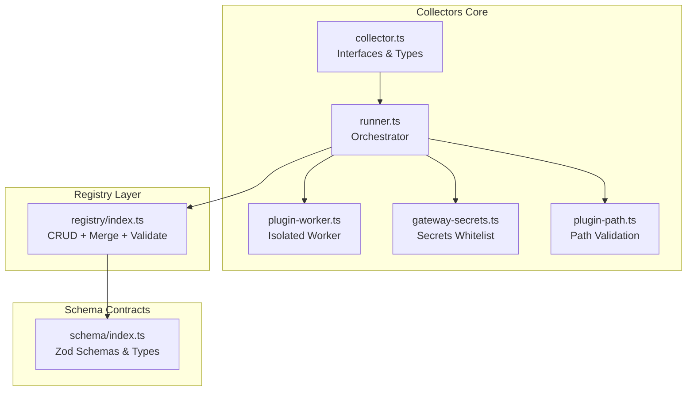
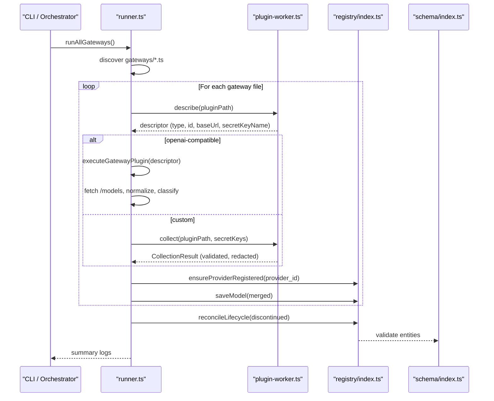
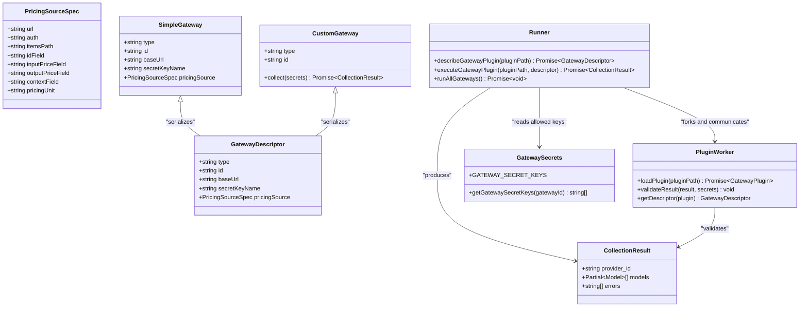
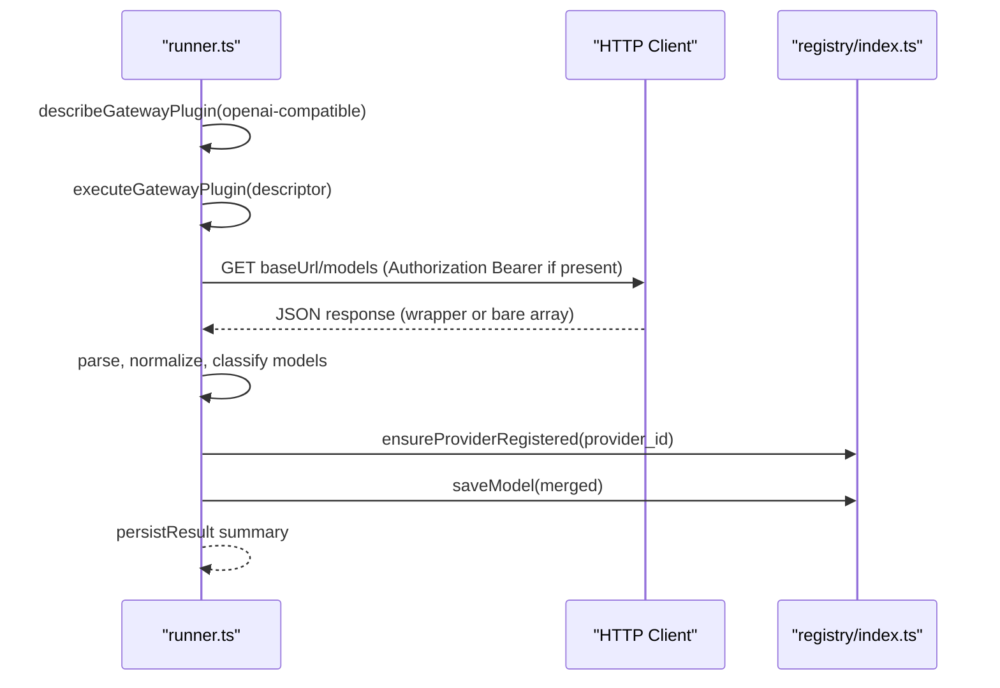
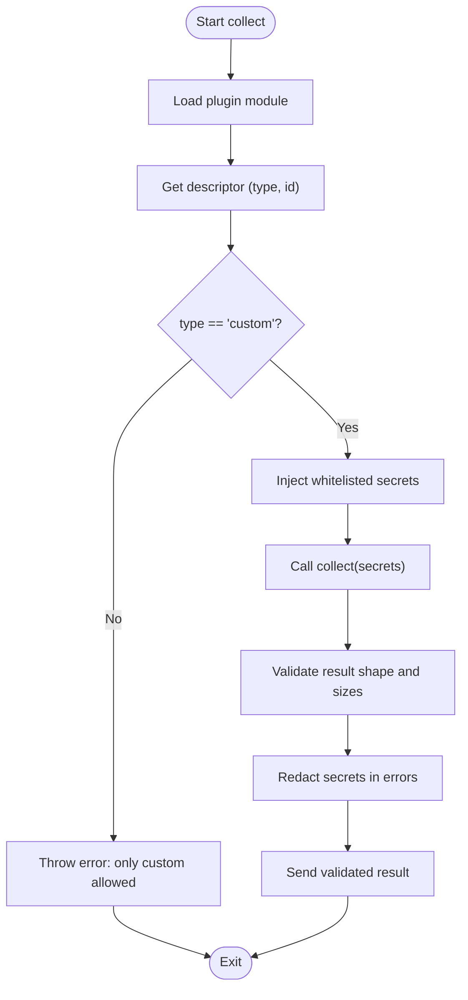
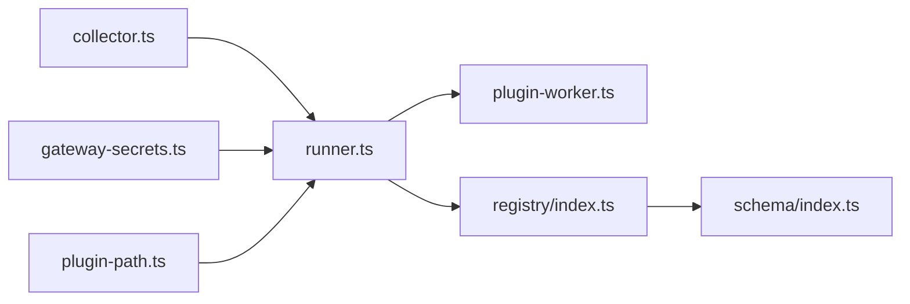

# Collector Architecture & Interfaces

<cite>
**Referenced Files in This Document**
- [collector.ts](file://packages/collectors/src/core/collector.ts)
- [plugin-worker.ts](file://packages/collectors/src/core/plugin-worker.ts)
- [runner.ts](file://packages/collectors/src/core/runner.ts)
- [gateway-secrets.ts](file://packages/collectors/src/core/gateway-secrets.ts)
- [plugin-path.ts](file://packages/collectors/src/core/plugin-path.ts)
- [index.ts](file://packages/registry/src/index.ts)
- [index.ts](file://packages/schema/src/index.ts)
</cite>

## Table of Contents
1. [Introduction](#introduction)
2. [Project Structure](#project-structure)
3. [Core Components](#core-components)
4. [Architecture Overview](#architecture-overview)
5. [Detailed Component Analysis](#detailed-component-analysis)
6. [Dependency Analysis](#dependency-analysis)
7. [Performance Considerations](#performance-considerations)
8. [Troubleshooting Guide](#troubleshooting-guide)
9. [Conclusion](#conclusion)

## Introduction
This document explains the collector architecture and core interfaces in BaseModel’s collectors package. It focuses on the plugin-like collector pattern, base interface definitions, registration and discovery mechanisms, lifecycle from initialization to completion, dependency injection via secrets, configuration management, registry interactions, and concurrent execution of collection tasks. The goal is to make the system understandable for both new contributors and experienced engineers.

## Project Structure
The collectors subsystem is organized around a small set of core modules:
- Core interfaces and types define the contract between collectors and the runtime.
- A runner orchestrates discovery, isolation, execution, persistence, and reconciliation.
- A worker process isolates custom plugins and enforces safety constraints.
- Secrets are centrally whitelisted per gateway to prevent unauthorized access.
- Path resolution ensures plugins live within an allowed directory.
- The registry layer persists models and providers with validation and timestamps.

**Diagram sources**
- [collector.ts](file://packages/collectors/src/core/collector.ts)
- [runner.ts](file://packages/collectors/src/core/runner.ts)
- [plugin-worker.ts](file://packages/collectors/src/core/plugin-worker.ts)
- [gateway-secrets.ts](file://packages/collectors/src/core/gateway-secrets.ts)
- [plugin-path.ts](file://packages/collectors/src/core/plugin-path.ts)
- [index.ts](file://packages/registry/src/index.ts)
- [index.ts](file://packages/schema/src/index.ts)

**Section sources**
- [collector.ts](file://packages/collectors/src/core/collector.ts)
- [runner.ts](file://packages/collectors/src/core/runner.ts)
- [plugin-worker.ts](file://packages/collectors/src/core/plugin-worker.ts)
- [gateway-secrets.ts](file://packages/collectors/src/core/gateway-secrets.ts)
- [plugin-path.ts](file://packages/collectors/src/core/plugin-path.ts)
- [index.ts](file://packages/registry/src/index.ts)
- [index.ts](file://packages/schema/src/index.ts)

## Core Components
- ModelCollector interface defines the minimal contract for provider-specific collectors that return normalized Partial<Model> records along with errors.
- GatewayPlugin union supports two modes:
  - OpenAI-compatible gateways configured declaratively with baseUrl, secret key name, and optional pricing catalog spec.
  - Custom gateways implementing collect(secrets) for isolated execution.
- CollectionResult carries provider_id, models array, and errors list.
- Runner discovers gateway plugins, executes them (either simple HTTP fetch or isolated worker), persists results, and reconciles lifecycle states.
- Plugin worker enforces size limits, validates result shapes, redacts secrets, and returns descriptors or results safely.
- Secrets whitelist restricts which environment variables can be injected into each gateway’s context.
- Path resolver prevents traversal and symlinks outside the gateways directory.

Key responsibilities:
- Interface definition and type safety: collector.ts
- Orchestration and persistence: runner.ts
- Isolation and security: plugin-worker.ts
- Secret governance: gateway-secrets.ts
- Safe plugin path resolution: plugin-path.ts
- Registry CRUD and merge: registry index.ts
- Canonical data contracts: schema index.ts

**Section sources**
- [collector.ts](file://packages/collectors/src/core/collector.ts)
- [runner.ts](file://packages/collectors/src/core/runner.ts)
- [plugin-worker.ts](file://packages/collectors/src/core/plugin-worker.ts)
- [gateway-secrets.ts](file://packages/collectors/src/core/gateway-secrets.ts)
- [plugin-path.ts](file://packages/collectors/src/core/plugin-path.ts)
- [index.ts](file://packages/registry/src/index.ts)
- [index.ts](file://packages/schema/src/index.ts)

## Architecture Overview
The collector architecture follows a plugin-based design where each gateway is a small module describing how to collect model metadata. The runner discovers these plugins, describes them without credentials, and executes them either directly (for OpenAI-compatible endpoints) or inside an isolated child process (for custom collectors). Results are merged into the registry, providers are auto-registered when needed, and missing models are marked discontinued after successful collections.

**Diagram sources**
- [runner.ts](file://packages/collectors/src/core/runner.ts)
- [plugin-worker.ts](file://packages/collectors/src/core/plugin-worker.ts)
- [index.ts](file://packages/registry/src/index.ts)
- [index.ts](file://packages/schema/src/index.ts)

## Detailed Component Analysis

### Base Interfaces and Types
- CollectionResult: standardized output containing provider_id, models (Partial<Model>), and errors.
- MAX_PLUGIN_MODELS and MAX_PLUGIN_RESPONSE_BYTES: guardrails enforced by the worker.
- PricingSourceSpec: declarative mapping for fetching pricing catalogs from OpenAI-compatible endpoints.
- SimpleGateway and CustomGateway: union GatewayPlugin defining supported plugin modes.
- GatewayDescriptor: serializable metadata returned from workers; never includes secrets.

These types form the contract between collectors and the runtime, ensuring consistent behavior across different implementations.

**Section sources**
- [collector.ts](file://packages/collectors/src/core/collector.ts)

### Plugin Discovery and Execution
- Discovery scans the gateways directory for .ts/.js files excluding underscore-prefixed ones.
- describeGatewayPlugin loads plugin metadata in an isolated worker without exposing secrets.
- executeGatewayPlugin:
  - For openai-compatible: validates approved secret keys, performs HTTP GET to baseUrl/models, parses response, classifies models, and builds CollectionResult.
  - For custom: runs collect(secrets) in the worker with only whitelisted env vars.
- persistResult normalizes model IDs, merges with existing records, saves updated/new models, and auto-registers providers if missing.
- reconcileLifecycle marks models as discontinued when they disappear from a successful catalog fetch.

Concurrency:
- All gateways are executed concurrently using Promise.allSettled to maximize throughput while capturing individual failures.

**Section sources**
- [runner.ts](file://packages/collectors/src/core/runner.ts)

### Isolated Worker and Security
- Worker receives JSON requests over IPC and responds with descriptors or validated results.
- Validates result shape, size, and model count; redacts secrets from error messages.
- Loads plugins dynamically via dynamic import from file URLs.
- Enforces strict environment scoping: only whitelisted runtime keys and gateway-specific secrets are passed.

Security guarantees:
- Plugins cannot access arbitrary environment variables.
- Responses are validated and sanitized before leaving the worker.
- Errors are redacted to avoid leaking secrets.

**Section sources**
- [plugin-worker.ts](file://packages/collectors/src/core/plugin-worker.ts)

### Secrets Management
- GATEWAY_SECRET_KEYS maps each gateway ID to an allowlist of environment variable names.
- getGatewaySecretKeys returns the approved keys for a given gateway.
- Only those keys are injected into the worker environment during execution.

Best practices:
- Add new secrets only through reviewed changes to the whitelist.
- Keep secret names stable and descriptive.

**Section sources**
- [gateway-secrets.ts](file://packages/collectors/src/core/gateway-secrets.ts)

### Plugin Path Resolution
- resolveGatewayPluginPath ensures:
  - Extension is .ts or .js.
  - Resolved path is under the gateways directory root.
  - No symlink escapes or absolute paths outside the root.
  - Target is a regular file.

This prevents accidental loading of unintended files and mitigates path traversal risks.

**Section sources**
- [plugin-path.ts](file://packages/collectors/src/core/plugin-path.ts)

### Registry Interaction and Data Persistence
- Provider auto-registration:
  - If a provider does not exist, a minimal record is created using predefined metadata or title-cased defaults.
  - Existing providers are refreshed with updated_at stamps.
- Model persistence:
  - Normalizes model IDs to avoid collisions.
  - Merges partial updates with existing records using registry merge utilities.
  - Saves validated entities with timestamps.
- Lifecycle reconciliation:
  - After successful collections, models no longer listed are marked discontinued.

Validation and schemas:
- All persisted entities are validated against canonical Zod schemas from the schema package.

**Section sources**
- [runner.ts](file://packages/collectors/src/core/runner.ts)
- [index.ts](file://packages/registry/src/index.ts)
- [index.ts](file://packages/schema/src/index.ts)

### Class Diagram: Collectors Core

**Diagram sources**
- [collector.ts](file://packages/collectors/src/core/collector.ts)
- [runner.ts](file://packages/collectors/src/core/runner.ts)
- [plugin-worker.ts](file://packages/collectors/src/core/plugin-worker.ts)
- [gateway-secrets.ts](file://packages/collectors/src/core/gateway-secrets.ts)

### Sequence Diagram: OpenAI-Compatible Collection

**Diagram sources**
- [runner.ts](file://packages/collectors/src/core/runner.ts)
- [index.ts](file://packages/registry/src/index.ts)

### Flowchart: Custom Plugin Execution and Validation

**Diagram sources**
- [plugin-worker.ts](file://packages/collectors/src/core/plugin-worker.ts)

## Dependency Analysis
- runner.ts depends on:
  - collector.ts for types and constants.
  - gateway-secrets.ts for allowed secret keys.
  - http.ts for network calls.
  - model-classify.ts for capability inference.
  - slug.ts for ID normalization.
  - registry index.ts for CRUD and merging.
- plugin-worker.ts depends on:
  - collector.ts for types and constants.
  - Node child_process for isolation.
- registry index.ts depends on:
  - storage.js for file I/O.
  - validation.js for Zod-based checks.
  - schema index.ts for canonical types and schemas.

Coupling and cohesion:
- runner.ts is the central orchestrator but remains cohesive by delegating concerns to specialized modules.
- plugin-worker.ts encapsulates isolation and validation logic, keeping the main process secure.
- registry index.ts provides a clean API surface for persistence and validation.

Potential circular dependencies:
- None observed among core modules; dependencies flow one-way from collectors to registry and schema.

External integrations:
- HTTP clients for remote endpoints.
- File system for registry storage.
- Child processes for plugin isolation.

**Diagram sources**
- [collector.ts](file://packages/collectors/src/core/collector.ts)
- [runner.ts](file://packages/collectors/src/core/runner.ts)
- [plugin-worker.ts](file://packages/collectors/src/core/plugin-worker.ts)
- [gateway-secrets.ts](file://packages/collectors/src/core/gateway-secrets.ts)
- [plugin-path.ts](file://packages/collectors/src/core/plugin-path.ts)
- [index.ts](file://packages/registry/src/index.ts)
- [index.ts](file://packages/schema/src/index.ts)

**Section sources**
- [runner.ts](file://packages/collectors/src/core/runner.ts)
- [plugin-worker.ts](file://packages/collectors/src/core/plugin-worker.ts)
- [gateway-secrets.ts](file://packages/collectors/src/core/gateway-secrets.ts)
- [plugin-path.ts](file://packages/collectors/src/core/plugin-path.ts)
- [index.ts](file://packages/registry/src/index.ts)
- [index.ts](file://packages/schema/src/index.ts)

## Performance Considerations
- Concurrency: runAllGateways uses Promise.allSettled to run all gateways in parallel, improving throughput.
- Timeouts: plugin workers have a fixed timeout to prevent hanging.
- Size limits: MAX_PLUGIN_MODELS and MAX_PLUGIN_RESPONSE_BYTES protect memory and IPC bandwidth.
- HTTP retries: fetchWithRetry handles transient network issues.
- Minimal payloads: partial models reduce serialization overhead.
- Batch operations: registry writes are per-model; consider batching for very large catalogs if needed.

[No sources needed since this section provides general guidance]

## Troubleshooting Guide
Common issues and resolutions:
- Unauthorized or forbidden responses from gateways: verify API keys and permissions; hints are included in error messages.
- Rate limiting: retries are applied; persistent limits require throttling or backoff adjustments.
- Invalid plugin structure: ensure default export implements required fields (type, id) and collect function for custom plugins.
- Secret leakage prevention: errors are redacted; if you see placeholders, check plugin code for accidental logging of secrets.
- Path validation errors: confirm the plugin resides within the gateways directory and has a valid extension.
- Model collisions: warnings indicate multiple upstream IDs normalizing to the same model_id; last write wins.

Operational tips:
- Use describeGatewayPlugin to inspect plugin metadata without executing collection.
- Monitor console logs for counts of new, updated, failed models and any reconciliation actions.
- Ensure gateway secrets are registered in the whitelist before running collectors.

**Section sources**
- [runner.ts](file://packages/collectors/src/core/runner.ts)
- [plugin-worker.ts](file://packages/collectors/src/core/plugin-worker.ts)
- [gateway-secrets.ts](file://packages/collectors/src/core/gateway-secrets.ts)
- [plugin-path.ts](file://packages/collectors/src/core/plugin-path.ts)

## Conclusion
BaseModel’s collector architecture combines a clear plugin interface with strong isolation and security guarantees. The runner orchestrates discovery, execution, persistence, and lifecycle reconciliation, while the worker enforces safety constraints and validates outputs. Secrets are centrally managed, and the registry layer ensures data integrity and freshness. This design enables scalable, concurrent collection from diverse providers while maintaining robustness and security.

[No sources needed since this section summarizes without analyzing specific files]