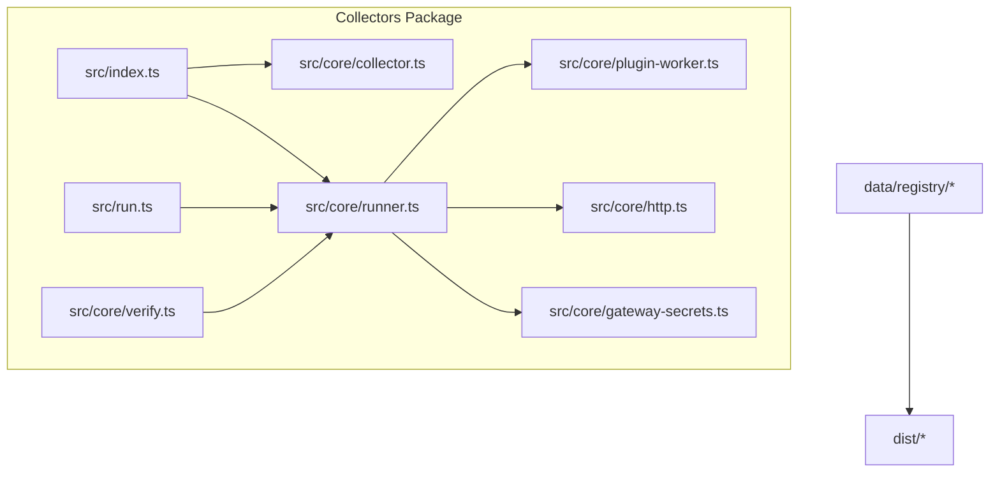
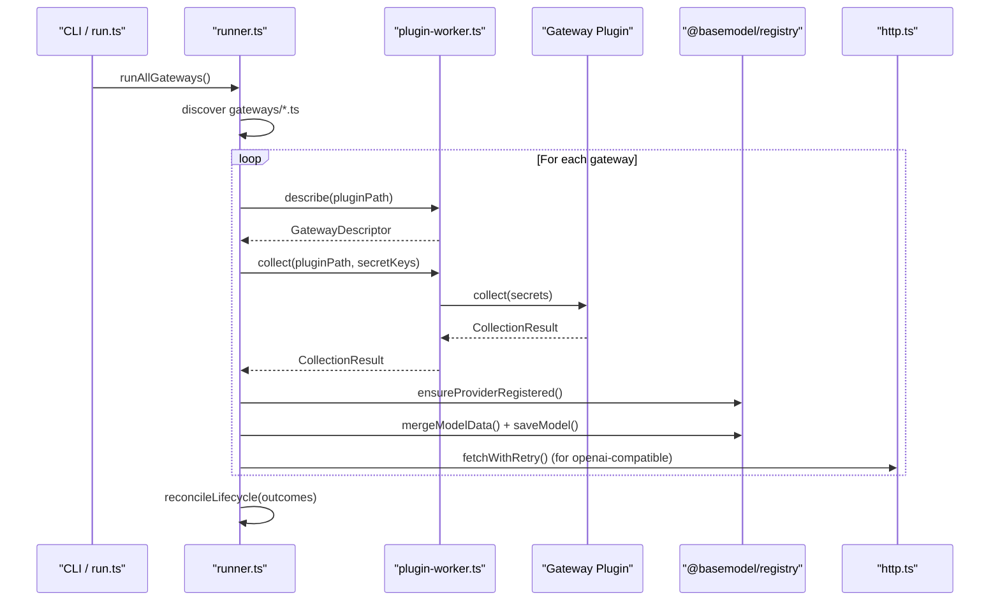
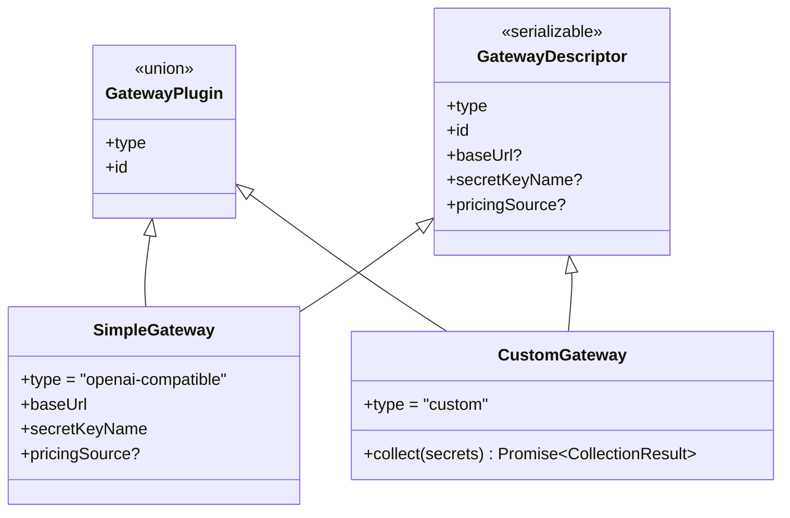
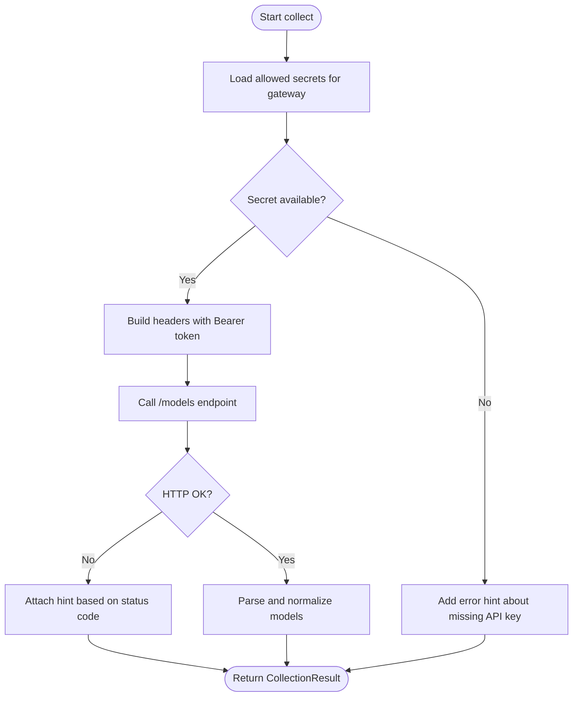
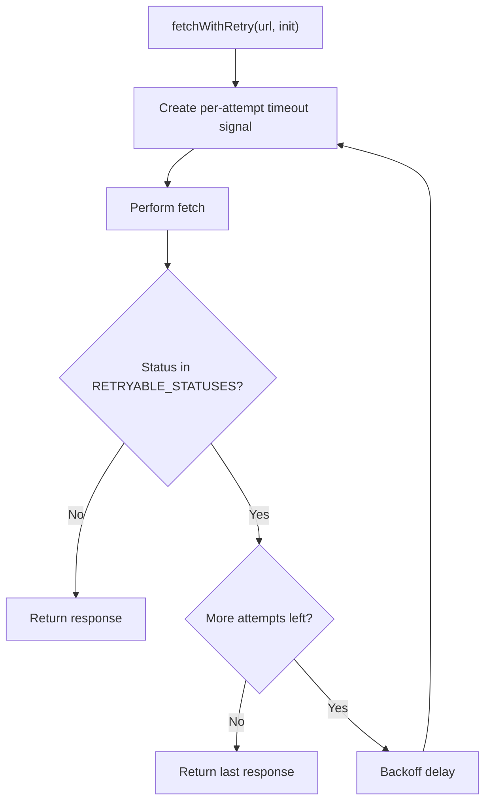
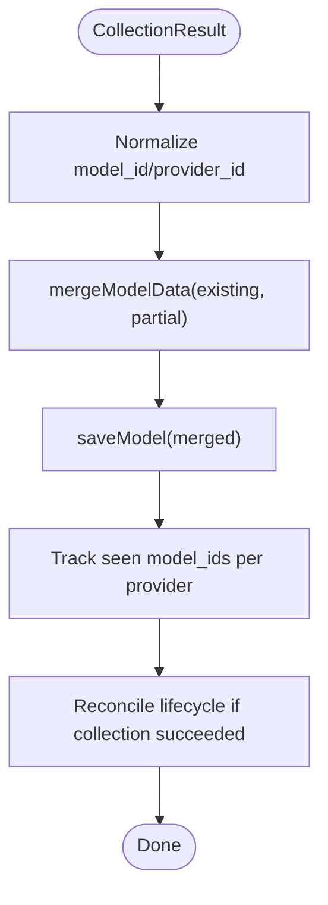
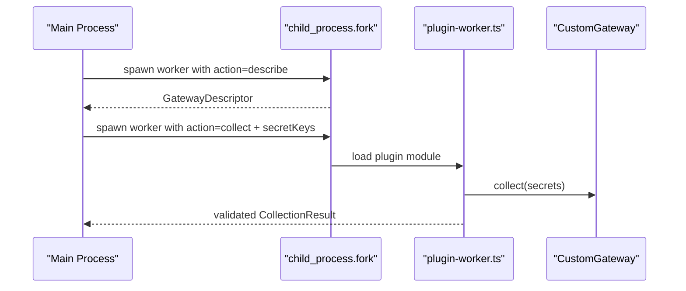
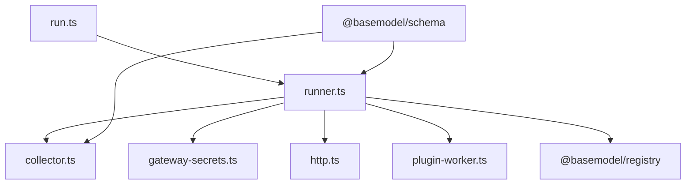

# Collector System Design

<cite>
**Referenced Files in This Document**
- [README.md](file://README.md)
- [CONTRIBUTING.md](file://CONTRIBUTING.md)
- [08_Gateway_Plugin_Security.md](file://docs/08_Gateway_Plugin_Security.md)
- [package.json](file://packages/collectors/package.json)
- [index.ts](file://packages/collectors/src/index.ts)
- [run.ts](file://packages/collectors/src/run.ts)
- [collector.ts](file://packages/collectors/src/core/collector.ts)
- [runner.ts](file://packages/collectors/src/core/runner.ts)
- [plugin-worker.ts](file://packages/collectors/src/core/plugin-worker.ts)
- [http.ts](file://packages/collectors/src/core/http.ts)
- [gateway-secrets.ts](file://packages/collectors/src/core/gateway-secrets.ts)
- [verify.ts](file://packages/collectors/src/core/verify.ts)
- [e2e.test.ts](file://packages/collectors/src/__tests__/e2e.test.ts)
- [runner.test.ts](file://packages/collectors/src/__tests__/runner.test.ts)
- [cloudflare.test.ts](file://packages/collectors/src/__tests__/cloudflare.test.ts)
</cite>

## Table of Contents
1. [Introduction](#introduction)
2. [Project Structure](#project-structure)
3. [Core Components](#core-components)
4. [Architecture Overview](#architecture-overview)
5. [Detailed Component Analysis](#detailed-component-analysis)
6. [Dependency Analysis](#dependency-analysis)
7. [Performance Considerations](#performance-considerations)
8. [Troubleshooting Guide](#troubleshooting-guide)
9. [Conclusion](#conclusion)
10. [Appendices](#appendices)

## Introduction
This document explains the BaseModel collector system architecture with a focus on the plugin-like collector pattern that enables integration with multiple AI model providers through a gateway abstraction layer. It covers collector interfaces, authentication mechanisms, error handling strategies, rate limiting approaches, data caching and reconciliation, and guidelines for implementing custom collectors. It also includes security considerations, testing strategies, and performance optimization techniques grounded in the codebase.

## Project Structure
The collector system lives under packages/collectors and is orchestrated by a small runtime that discovers and executes gateway plugins from a dedicated directory. The repository’s README outlines package responsibilities and key commands for running collectors and verifying gateways.

**Diagram sources**
- [index.ts:1-1](file://packages/collectors/src/index.ts#L1-L1)
- [collector.ts:1-89](file://packages/collectors/src/core/collector.ts#L1-L89)
- [runner.ts:1-475](file://packages/collectors/src/core/runner.ts#L1-L475)
- [plugin-worker.ts:1-112](file://packages/collectors/src/core/plugin-worker.ts#L1-L112)
- [http.ts:1-37](file://packages/collectors/src/core/http.ts#L1-L37)
- [gateway-secrets.ts:1-27](file://packages/collectors/src/core/gateway-secrets.ts#L1-L27)
- [run.ts:1-16](file://packages/collectors/src/run.ts#L1-L16)
- [verify.ts:1-25](file://packages/collectors/src/core/verify.ts#L1-L25)

**Section sources**
- [README.md:1-61](file://README.md#L1-L61)
- [package.json:1-40](file://packages/collectors/package.json#L1-L40)

## Core Components
- CollectionResult: The normalized output shape returned by collectors and plugins, including provider_id, models (Partial<Model>), and errors.
- ModelCollector: An interface for provider-specific collectors that fetchModels() into CollectionResult.
- GatewayPlugin types:
  - SimpleGateway (openai-compatible): Declarative configuration for OpenAI-compatible endpoints, including baseUrl, secretKeyName, and optional pricingSource.
  - CustomGateway (custom): Full collect(secrets) implementation executed in an isolated worker.
- GatewayDescriptor: Serializable metadata returned from the plugin worker to avoid importing plugins directly in the main process.
- HTTP helpers: Centralized retry and timeout behavior for external requests.
- Secrets registry: Central mapping of gateway IDs to allowed secret keys.

Key constants enforce safety and capacity limits for plugin responses.

**Section sources**
- [collector.ts:1-89](file://packages/collectors/src/core/collector.ts#L1-L89)
- [http.ts:1-37](file://packages/collectors/src/core/http.ts#L1-L37)
- [gateway-secrets.ts:1-27](file://packages/collectors/src/core/gateway-secrets.ts#L1-L27)

## Architecture Overview
The collector system uses a plugin-based architecture where each gateway is either a simple OpenAI-compatible endpoint or a custom collector. The runner orchestrates discovery, isolation, execution, normalization, persistence, and lifecycle reconciliation.

**Diagram sources**
- [run.ts:1-16](file://packages/collectors/src/run.ts#L1-L16)
- [runner.ts:428-475](file://packages/collectors/src/core/runner.ts#L428-L475)
- [plugin-worker.ts:1-112](file://packages/collectors/src/core/plugin-worker.ts#L1-L112)
- [http.ts:1-37](file://packages/collectors/src/core/http.ts#L1-L37)

## Detailed Component Analysis

### Gateway Abstraction Layer
- Describes plugins without loading them into the main process via an isolated worker.
- Executes plugins with only centrally approved secrets.
- Supports two plugin types:
  - OpenAI-compatible: Fetches /models, normalizes response shapes, infers capabilities, and persists results.
  - Custom: Runs user-defined collect logic with strict validation and size limits.

**Diagram sources**
- [collector.ts:52-89](file://packages/collectors/src/core/collector.ts#L52-L89)

**Section sources**
- [runner.ts:156-238](file://packages/collectors/src/core/runner.ts#L156-L238)
- [collector.ts:52-89](file://packages/collectors/src/core/collector.ts#L52-L89)

### Authentication Mechanisms
- Secrets are centrally registered per gateway ID; plugins cannot self-escalate privileges.
- Only whitelisted environment variables are passed to the plugin worker.
- For OpenAI-compatible gateways, Authorization header is set when a secret is present.
- Error messages include actionable hints for common auth failures.

**Diagram sources**
- [gateway-secrets.ts:1-27](file://packages/collectors/src/core/gateway-secrets.ts#L1-L27)
- [runner.ts:167-214](file://packages/collectors/src/core/runner.ts#L167-L214)

**Section sources**
- [gateway-secrets.ts:1-27](file://packages/collectors/src/core/gateway-secrets.ts#L1-L27)
- [runner.ts:167-214](file://packages/collectors/src/core/runner.ts#L167-L214)

### Rate Limiting and Resilience
- Transient HTTP statuses are retried with exponential backoff and per-attempt timeouts.
- Non-retryable errors produce actionable diagnostics.
- Each retry uses a fresh AbortSignal to prevent signal poisoning.

**Diagram sources**
- [http.ts:1-37](file://packages/collectors/src/core/http.ts#L1-L37)

**Section sources**
- [http.ts:1-37](file://packages/collectors/src/core/http.ts#L1-L37)
- [runner.test.ts:105-159](file://packages/collectors/src/__tests__/runner.test.ts#L105-L159)

### Data Normalization and Persistence
- OpenAI-compatible responses support both wrapper and bare array formats.
- Models are normalized to canonical slugs and merged into the registry.
- Provider records are auto-registered on first use and stamped with freshness.
- Lifecycle reconciliation marks models as discontinued when absent from a successful catalog fetch.

**Diagram sources**
- [runner.ts:365-426](file://packages/collectors/src/core/runner.ts#L365-L426)

**Section sources**
- [runner.ts:25-56](file://packages/collectors/src/core/runner.ts#L25-L56)
- [runner.ts:337-397](file://packages/collectors/src/core/runner.ts#L337-L397)
- [runner.ts:410-426](file://packages/collectors/src/core/runner.ts#L410-L426)

### Isolation and Security Boundaries
- Plugins execute in child_process workers with minimal environment exposure.
- Secret keys must be declared in the central registry; unapproved keys are rejected.
- Result validation enforces structure, size, and no-secret leakage.
- Verifier loads plugin metadata in isolation before execution.

**Diagram sources**
- [runner.ts:96-154](file://packages/collectors/src/core/runner.ts#L96-L154)
- [plugin-worker.ts:1-112](file://packages/collectors/src/core/plugin-worker.ts#L1-L112)
- [verify.ts:1-25](file://packages/collectors/src/core/verify.ts#L1-L25)
- [08_Gateway_Plugin_Security.md:1-36](file://docs/08_Gateway_Plugin_Security.md#L1-L36)

**Section sources**
- [plugin-worker.ts:1-112](file://packages/collectors/src/core/plugin-worker.ts#L1-L112)
- [08_Gateway_Plugin_Security.md:1-36](file://docs/08_Gateway_Plugin_Security.md#L1-L36)

### Existing Collector Implementations
- OpenAI-compatible gateways are supported declaratively via SimpleGateway.
- Custom gateways can implement arbitrary collection logic while adhering to the contract.
- Tests demonstrate expected behaviors such as error reporting and retries.

Examples referenced by tests:
- Cloudflare Workers AI custom gateway behavior and error paths.
- Generic runner behavior for retries and non-retryable errors.

**Section sources**
- [cloudflare.test.ts:85-113](file://packages/collectors/src/__tests__/cloudflare.test.ts#L85-L113)
- [runner.test.ts:105-159](file://packages/collectors/src/__tests__/runner.test.ts#L105-L159)

### Extending the System with New Provider Integrations
Steps derived from contributor guidance and core contracts:
- Implement a gateway plugin under the gateways directory (either SimpleGateway or CustomGateway).
- Register required secret names in the central secrets registry.
- Add tests covering success and failure scenarios.
- Ensure normalization and merging conform to schema contracts.

**Section sources**
- [CONTRIBUTING.md:43-51](file://CONTRIBUTING.md#L43-L51)
- [gateway-secrets.ts:1-27](file://packages/collectors/src/core/gateway-secrets.ts#L1-L27)
- [collector.ts:52-89](file://packages/collectors/src/core/collector.ts#L52-L89)

## Dependency Analysis
The collectors package depends on shared schemas and registry utilities for validation and persistence. The runner orchestrates HTTP calls and worker isolation.

**Diagram sources**
- [run.ts:1-16](file://packages/collectors/src/run.ts#L1-L16)
- [runner.ts:1-24](file://packages/collectors/src/core/runner.ts#L1-L24)
- [collector.ts:1-23](file://packages/collectors/src/core/collector.ts#L1-L23)
- [gateway-secrets.ts:1-27](file://packages/collectors/src/core/gateway-secrets.ts#L1-L27)
- [http.ts:1-37](file://packages/collectors/src/core/http.ts#L1-L37)
- [plugin-worker.ts:1-12](file://packages/collectors/src/core/plugin-worker.ts#L1-L12)

**Section sources**
- [package.json:1-40](file://packages/collectors/package.json#L1-L40)

## Performance Considerations
- Use the provided fetchWithRetry to handle transient failures efficiently and avoid noisy failures.
- Keep plugin responses within MAX_PLUGIN_MODELS and MAX_PLUGIN_RESPONSE_BYTES to prevent memory pressure.
- Prefer SimpleGateway for standard OpenAI-compatible endpoints to reduce overhead compared to custom collectors.
- Avoid unnecessary logging in hot paths; rely on structured errors and result counts.
- Leverage reconciliation to minimize downstream churn by marking models discontinued only after successful collections.

[No sources needed since this section provides general guidance]

## Troubleshooting Guide
Common issues and resolutions:
- Missing API key: Ensure the correct secret is configured and matches the gateway’s registered secretKeyName.
- Rate limiting: Retries are automatic; verify upstream quotas and consider reducing concurrency.
- Unauthorized/Forbidden: Validate credentials and permissions; check base URL correctness.
- Not found: Confirm the gateway base URL and /models path.
- Precondition failed: Some providers require billing setup or may suspend accounts.
- Plugin worker timeout: Increase PLUGIN_TIMEOUT_MS or optimize plugin logic.
- No gateways directory: Ensure gateways/*.ts files exist and follow naming conventions.

**Section sources**
- [runner.ts:42-48](file://packages/collectors/src/core/runner.ts#L42-L48)
- [runner.ts:136-154](file://packages/collectors/src/core/runner.ts#L136-L154)
- [e2e.test.ts:42-48](file://packages/collectors/src/__tests__/e2e.test.ts#L42-L48)

## Conclusion
The BaseModel collector system provides a secure, extensible, and resilient framework for integrating with diverse AI model providers. Through a clear separation between declarative and custom gateways, strict secret management, robust HTTP resilience, and careful normalization and reconciliation, it supports scalable data collection across many providers while maintaining strong security boundaries and predictable performance characteristics.

[No sources needed since this section summarizes without analyzing specific files]

## Appendices

### How to Run Collectors and Verify Gateways
- Install dependencies and build as described in the repository README.
- Use package scripts to run collectors and verify gateways.

**Section sources**
- [README.md:42-56](file://README.md#L42-L56)
- [package.json:15-24](file://packages/collectors/package.json#L15-L24)