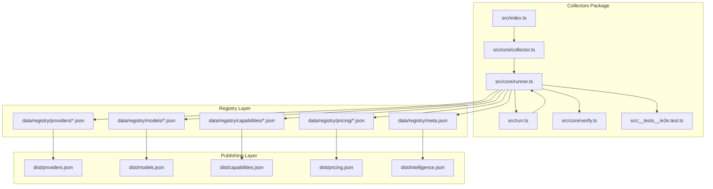
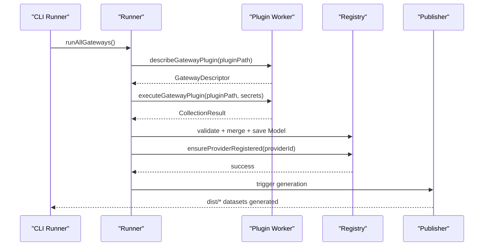
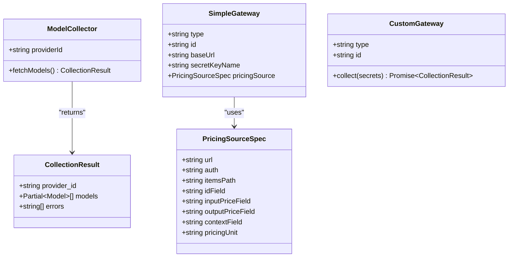
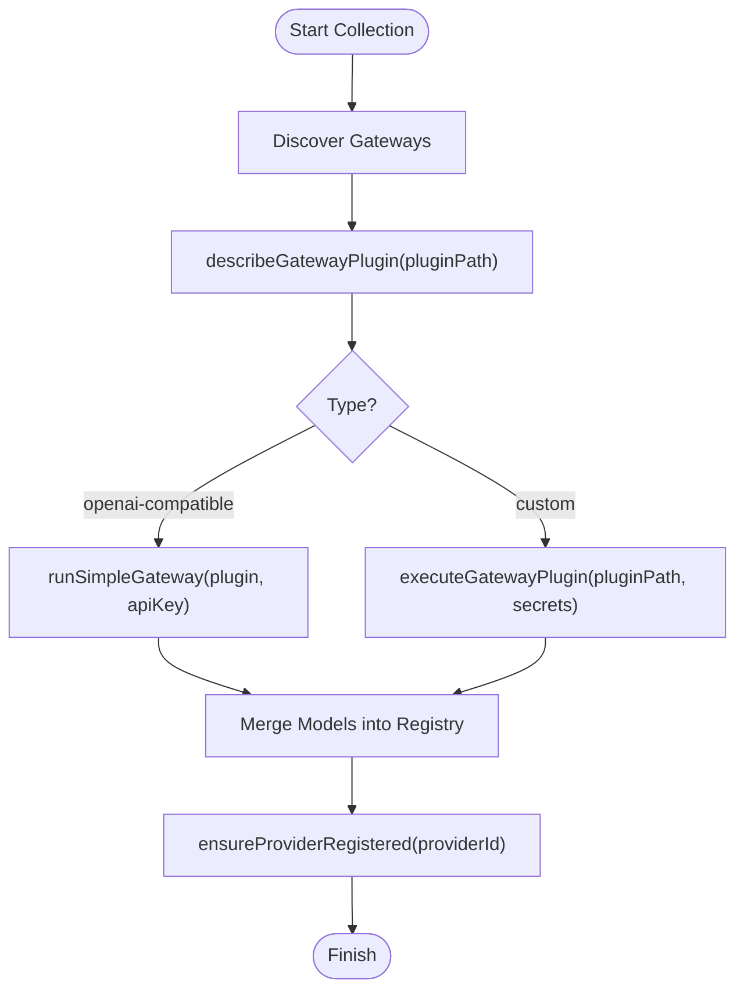
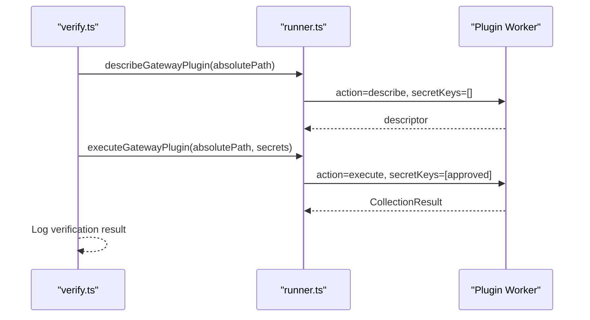
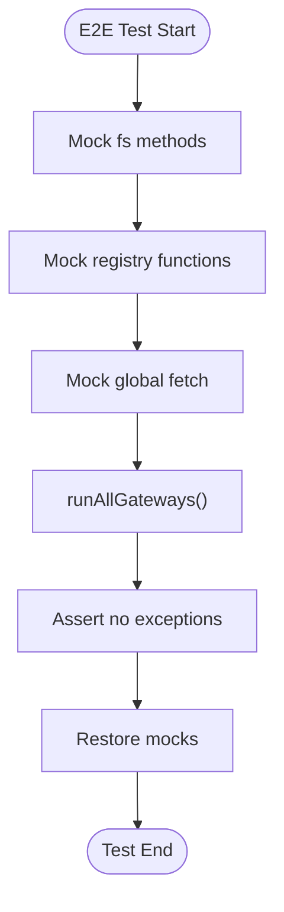
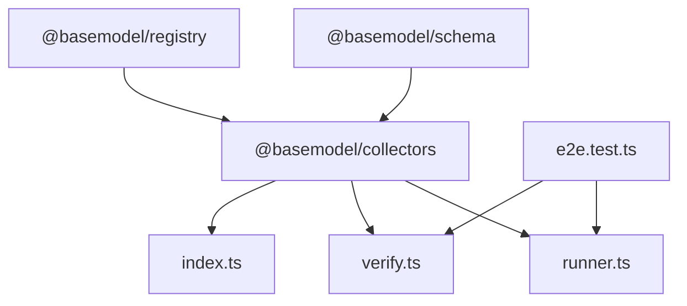

# Custom Collector Development Guide

<cite>
**Referenced Files in This Document**
- [README.md](file://README.md)
- [03_Architecture.md](file://docs/03_Architecture.md)
- [04_Pipeline.md](file://docs/04_Pipeline.md)
- [07_Developer_Access.md](file://docs/07_Developer_Access.md)
- [08_Gateway_Plugin_Security.md](file://docs/08_Gateway_Plugin_Security.md)
- [package.json](file://packages/collectors/package.json)
- [index.ts](file://packages/collectors/src/index.ts)
- [collector.ts](file://packages/collectors/src/core/collector.ts)
- [runner.ts](file://packages/collectors/src/core/runner.ts)
- [verify.ts](file://packages/collectors/src/core/verify.ts)
- [run.ts](file://packages/collectors/src/run.ts)
- [e2e.test.ts](file://packages/collectors/src/__tests__/e2e.test.ts)
</cite>

## Table of Contents
1. [Introduction](#introduction)
2. [Project Structure](#project-structure)
3. [Core Components](#core-components)
4. [Architecture Overview](#architecture-overview)
5. [Detailed Component Analysis](#detailed-component-analysis)
6. [Dependency Analysis](#dependency-analysis)
7. [Performance Considerations](#performance-considerations)
8. [Troubleshooting Guide](#troubleshooting-guide)
9. [Conclusion](#conclusion)
10. [Appendices](#appendices)

## Introduction
This guide explains how to implement custom collectors for new AI model providers within the BaseModel platform. It covers the collector development workflow, required interfaces, implementation patterns, and integration with the registry system. You will learn how to create both simple OpenAI-compatible gateway collectors and complex custom collectors, handle provider-specific data formats, and ensure robust testing and deployment practices. The document also addresses common pitfalls and best practices for maintaining high-quality collectors.

## Project Structure
BaseModel organizes its functionality into packages: schema, registry, collectors, intelligence, publisher, and cli. Collectors live under packages/collectors and are responsible for discovering and collecting provider data. The pipeline moves from discovery and collection through validation, normalization, registry storage, intelligence derivation, generation, and publication.

**Diagram sources**
- [index.ts](file://packages/collectors/src/index.ts)
- [collector.ts](file://packages/collectors/src/core/collector.ts)
- [runner.ts](file://packages/collectors/src/core/runner.ts)
- [run.ts](file://packages/collectors/src/run.ts)
- [verify.ts](file://packages/collectors/src/core/verify.ts)
- [e2e.test.ts](file://packages/collectors/src/__tests__/e2e.test.ts)

**Section sources**
- [README.md:10-30](file://README.md#L10-L30)
- [03_Architecture.md:1-77](file://docs/03_Architecture.md#L1-L77)
- [04_Pipeline.md:1-100](file://docs/04_Pipeline.md#L1-L100)

## Core Components
The collector subsystem defines a small set of core interfaces and utilities that standardize how providers are collected and integrated:

- ModelCollector interface: Defines the contract for fetching and normalizing models into Partial<Model> records.
- CollectionResult structure: Aggregates provider_id, normalized models, and errors per collection run.
- GatewayPlugin types:
  - SimpleGateway (OpenAI-compatible): Declarative configuration including baseUrl, secretKeyName, and optional pricingSource.
  - CustomGateway: Full custom collect() implementation executed in an isolated worker with approved secrets.
- PricingSourceSpec: Optional declarative catalog source for enriching pricing based on provider or gateway endpoints.
- GatewayDescriptor: Serializable metadata returned from plugin workers to avoid importing plugin code directly.

These components enable two primary workflows:
- Simple OpenAI-compatible gateways: Configure baseUrl and optional pricingSource; the runner handles HTTP calls and normalization.
- Custom gateways: Implement collect(secrets) to fetch and normalize provider-specific data; the runner executes it securely.

**Section sources**
- [collector.ts:1-89](file://packages/collectors/src/core/collector.ts#L1-L89)

## Architecture Overview
The collector architecture separates concerns across layers:
- Discovery Layer: Identifies sources (provider sites, catalogs, documentation).
- Registry Layer: Stores canonical records after validation and normalization.
- Intelligence Layer: Derives search, alternatives, and cost information without modifying registry data.
- Publishing Layer: Generates public datasets to dist/.

Collectors integrate with the registry by producing Partial<Model> records that are validated, merged, and saved. The runner orchestrates plugin execution, ensures provider registration, and manages lifecycle reconciliation.

**Diagram sources**
- [runner.ts:156-175](file://packages/collectors/src/core/runner.ts#L156-L175)
- [runner.ts:333-363](file://packages/collectors/src/core/runner.ts#L333-L363)
- [run.ts:1-17](file://packages/collectors/src/run.ts#L1-L17)

**Section sources**
- [03_Architecture.md:1-77](file://docs/03_Architecture.md#L1-L77)
- [04_Pipeline.md:1-100](file://docs/04_Pipeline.md#L1-L100)

## Detailed Component Analysis

### Collector Interface and Result Contract
The ModelCollector interface and CollectionResult define the minimal contract for provider collectors. Implementations must return Partial<Model> records suitable for merging into the registry. Errors should be captured in the errors array to allow partial success.

Key points:
- providerId uniquely identifies the provider or gateway.
- fetchModels returns a Promise resolving to CollectionResult.
- MAX_PLUGIN_MODELS and MAX_PLUGIN_RESPONSE_BYTES enforce limits to prevent resource exhaustion.

**Diagram sources**
- [collector.ts:1-89](file://packages/collectors/src/core/collector.ts#L1-L89)

**Section sources**
- [collector.ts:1-89](file://packages/collectors/src/core/collector.ts#L1-L89)

### Runner Orchestration and Plugin Execution
The runner discovers plugins, describes them in an isolated worker, and executes them with only approved secrets. For OpenAI-compatible gateways, it constructs requests with Authorization headers when available and collects results. For custom gateways, it invokes collect(secrets) and merges results into the registry.

Important behaviors:
- describeGatewayPlugin loads metadata without exposing credentials.
- runSimpleGateway builds headers and handles missing API keys gracefully.
- ensureProviderRegistered creates minimal Provider records if not present.

**Diagram sources**
- [runner.ts:156-175](file://packages/collectors/src/core/runner.ts#L156-L175)
- [runner.ts:333-363](file://packages/collectors/src/core/runner.ts#L333-L363)

**Section sources**
- [runner.ts:156-175](file://packages/collectors/src/core/runner.ts#L156-L175)
- [runner.ts:333-363](file://packages/collectors/src/core/runner.ts#L333-L363)

### Verification and Security Boundaries
Verification runs plugins through the same isolated worker boundary used in production. Only .ts and .js files inside packages/collectors/src/gateways/ are accepted. Secrets must be registered centrally; unregistered gateways receive no secrets.

Best practices:
- Keep plugin paths restricted to the gateways directory.
- Register all required secrets in the central registry.
- Review plugin changes alongside secret requirements.

**Diagram sources**
- [verify.ts:1-25](file://packages/collectors/src/core/verify.ts#L1-L25)
- [runner.ts:156-175](file://packages/collectors/src/core/runner.ts#L156-L175)

**Section sources**
- [08_Gateway_Plugin_Security.md:1-36](file://docs/08_Gateway_Plugin_Security.md#L1-L36)

### Testing Strategy
End-to-end tests mock filesystem and registry interactions to validate graceful handling of missing directories and plugin execution flows. Tests stub fetch and verify that the pipeline does not throw unexpectedly when gateways are absent.

Recommendations:
- Mock external dependencies (fs, registry, fetch) to isolate tests.
- Cover success and failure scenarios for each gateway type.
- Validate error aggregation in CollectionResult.errors.

**Diagram sources**
- [e2e.test.ts:1-48](file://packages/collectors/src/__tests__/e2e.test.ts#L1-L48)

**Section sources**
- [e2e.test.ts:1-48](file://packages/collectors/src/__tests__/e2e.test.ts#L1-L48)

### Step-by-Step Tutorial: Creating a Simple OpenAI-Compatible Collector
1. Create a new gateway file under packages/collectors/src/gateways/<your-provider>.ts.
2. Export a SimpleGateway descriptor with:
   - type: 'openai-compatible'
   - id: unique provider or gateway identifier
   - baseUrl: endpoint URL
   - secretKeyName: approved secret name
   - pricingSource (optional): catalog URL and field mappings
3. Register any required secrets in the central secret registry.
4. Verify your plugin using the verifier command.
5. Run the collector to discover and process models.

Notes:
- The runner automatically handles Authorization headers when an API key is present.
- If no API key is registered, errors are recorded but do not abort the pipeline.

**Section sources**
- [collector.ts:55-65](file://packages/collectors/src/core/collector.ts#L55-L65)
- [runner.ts:167-175](file://packages/collectors/src/core/runner.ts#L167-L175)

### Step-by-Step Tutorial: Creating a Complex Custom Collector
1. Create a new gateway file under packages/collectors/src/gateways/<your-provider>.ts.
2. Export a CustomGateway descriptor with:
   - type: 'custom'
   - id: unique provider or gateway identifier
   - collect(secrets): function returning Promise<CollectionResult>
3. Inside collect(), fetch provider data, normalize into Partial<Model>, and aggregate errors.
4. Register any required secrets in the central secret registry.
5. Verify your plugin using the verifier command.
6. Run the collector to process models.

Notes:
- Custom collectors run in an isolated worker with only approved secrets.
- Return Partial<Model> arrays to support incremental updates and merges.

**Section sources**
- [collector.ts:71-77](file://packages/collectors/src/core/collector.ts#L71-L77)
- [08_Gateway_Plugin_Security.md:19-27](file://docs/08_Gateway_Plugin_Security.md#L19-L27)

### Handling Provider-Specific Data Formats
Normalization converts provider-specific representations into BaseModel's canonical schema. When working with OpenAI-compatible endpoints, heuristics classify models by id (e.g., embedding, TTS/ASR, image, video, code). Custom gateways may emit additional fields that take precedence over heuristics.

Guidelines:
- Map provider identifiers to canonical ids where possible.
- Preserve modality flags and capability metadata.
- Use conservative defaults when uncertain; consumers can refine curated fields later.

**Section sources**
- [04_Pipeline.md:34-46](file://docs/04_Pipeline.md#L34-L46)

### Integrating with the Registry System
Collectors produce Partial<Model> records that are validated, merged, and saved. Merges respect field ownership: machine-observable facts refresh on every collection, while curated fields remain protected. Providers are auto-registered with minimal metadata if missing.

Integration steps:
- Ensure CollectionResult.models contains valid Partial<Model> entries.
- Errors are aggregated and logged; invalid records are rejected before registry writes.
- Provider records are created or refreshed with updated timestamps.

**Section sources**
- [04_Pipeline.md:48-66](file://docs/04_Pipeline.md#L48-L66)
- [runner.ts:333-363](file://packages/collectors/src/core/runner.ts#L333-L363)

## Dependency Analysis
Collectors depend on schema definitions and registry utilities. The package exports core interfaces and orchestrates plugin execution via runners. Tests rely on mocking to validate behavior without external dependencies.

**Diagram sources**
- [package.json:1-40](file://packages/collectors/package.json#L1-L40)
- [index.ts:1-1](file://packages/collectors/src/index.ts#L1-L1)
- [runner.ts:156-175](file://packages/collectors/src/core/runner.ts#L156-L175)
- [verify.ts:1-25](file://packages/collectors/src/core/verify.ts#L1-L25)
- [e2e.test.ts:1-48](file://packages/collectors/src/__tests__/e2e.test.ts#L1-L48)

**Section sources**
- [package.json:1-40](file://packages/collectors/package.json#L1-L40)

## Performance Considerations
- Enforce MAX_PLUGIN_MODELS and MAX_PLUGIN_RESPONSE_BYTES to limit memory and response sizes.
- Prefer batched requests where possible to reduce network overhead.
- Cache provider metadata and capabilities to avoid repeated fetches.
- Use heuristics judiciously; expensive classification logic should be minimized.
- Monitor error rates and adjust timeouts/retries accordingly.

[No sources needed since this section provides general guidance]

## Troubleshooting Guide
Common issues and resolutions:
- Missing gateways directory: The runner handles gracefully; ensure plugins exist under the correct path.
- No API key registered: Errors are recorded; register secrets in the central registry.
- Invalid records: Validation rejects malformed entries; inspect errors in CollectionResult.errors.
- Rate limiting: Implement retries and backoff; consider adding tokens for higher limits.
- Plugin execution failures: Verify plugin paths and secret registrations; use the verifier to test locally.

**Section sources**
- [e2e.test.ts:42-48](file://packages/collectors/src/__tests__/e2e.test.ts#L42-L48)
- [runner.ts:167-175](file://packages/collectors/src/core/runner.ts#L167-L175)

## Conclusion
Implementing custom collectors for new AI model providers involves defining clear interfaces, adhering to security boundaries, and integrating seamlessly with the registry system. By following the patterns outlined here—simple OpenAI-compatible configurations and robust custom implementations—you can extend BaseModel’s discovery layer effectively. Prioritize validation, normalization, and testing to maintain high-quality collectors that scale reliably.

[No sources needed since this section summarizes without analyzing specific files]

## Appendices

### Commands and Scripts
- Install dependencies and build: pnpm install, pnpm build
- Run collectors: pnpm --filter @basemodel/collectors run collect
- Verify a gateway plugin: pnpm --filter @basemodel/collectors run verify <path>
- Typecheck and test: pnpm typecheck, pnpm test

**Section sources**
- [README.md:42-56](file://README.md#L42-L56)
- [package.json:15-24](file://packages/collectors/package.json#L15-L24)