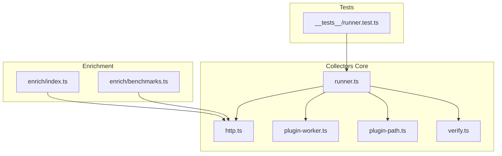
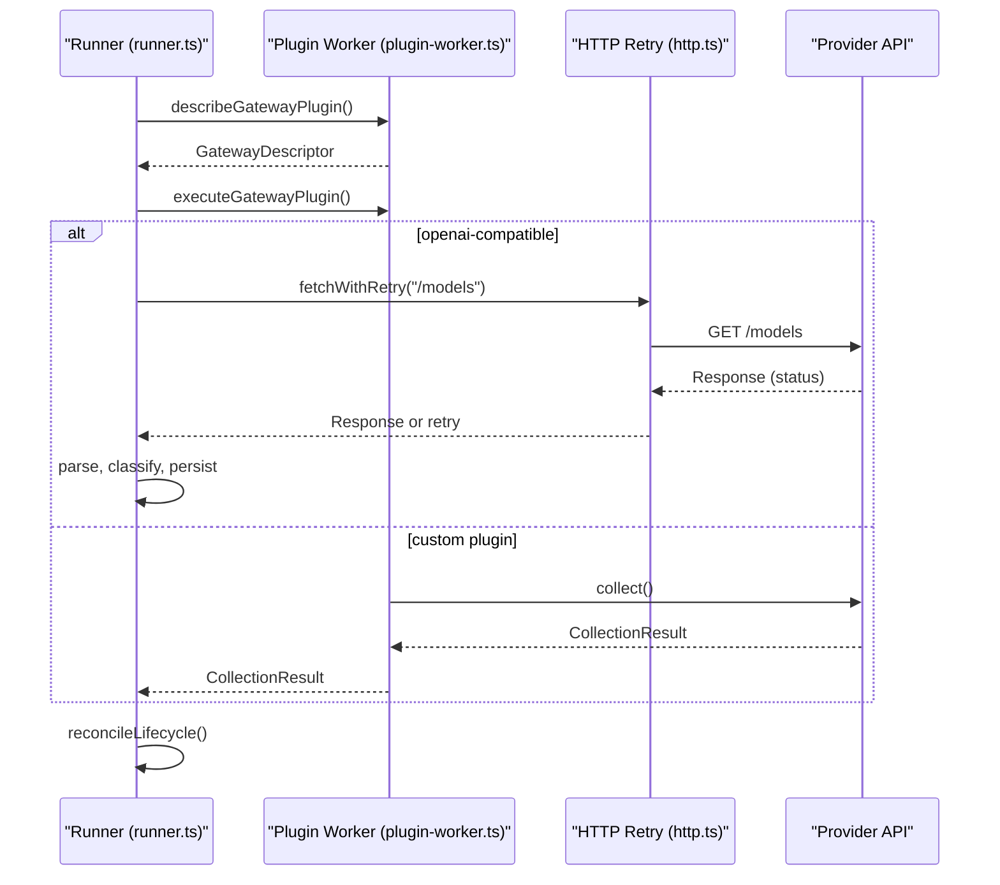
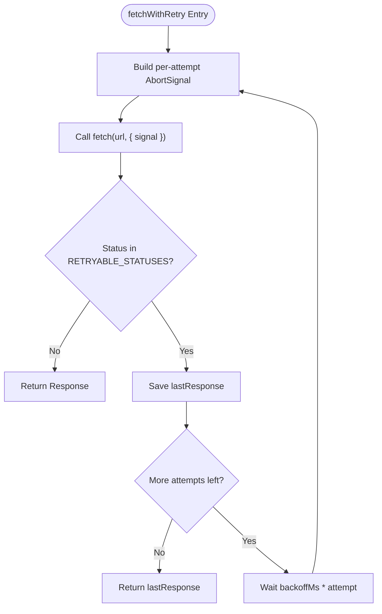
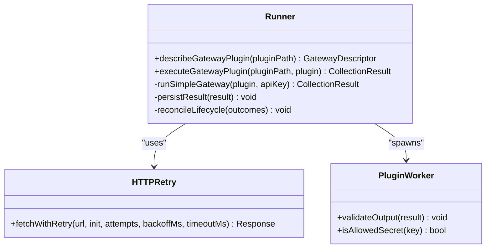
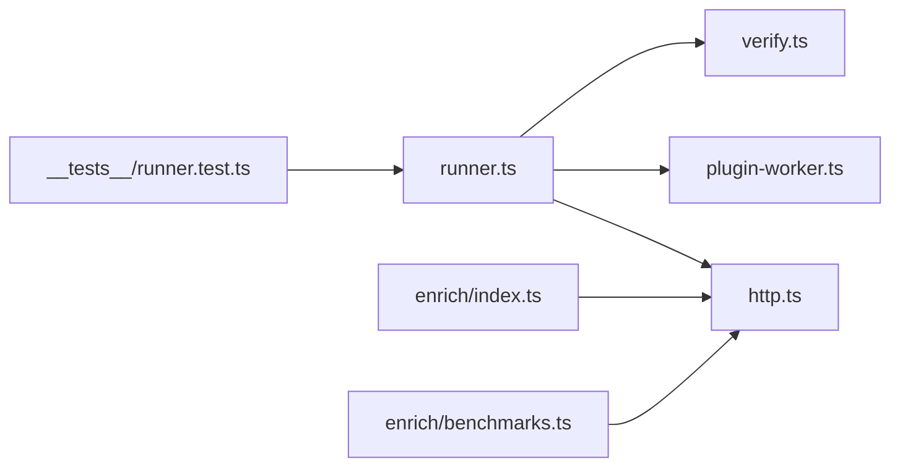

# Error Handling & Retry Strategies

<cite>
**Referenced Files in This Document**
- [http.ts](file://packages/collectors/src/core/http.ts)
- [runner.ts](file://packages/collectors/src/core/runner.ts)
- [plugin-worker.ts](file://packages/collectors/src/core/plugin-worker.ts)
- [plugin-path.ts](file://packages/collectors/src/core/plugin-path.ts)
- [verify.ts](file://packages/collectors/src/core/verify.ts)
- [benchmarks.ts](file://packages/collectors/src/enrich/benchmarks.ts)
- [enrich-index.ts](file://packages/collectors/src/enrich/index.ts)
- [runner.test.ts](file://packages/collectors/src/__tests__/runner.test.ts)
</cite>

## Table of Contents
1. [Introduction](#introduction)
2. [Project Structure](#project-structure)
3. [Core Components](#core-components)
4. [Architecture Overview](#architecture-overview)
5. [Detailed Component Analysis](#detailed-component-analysis)
6. [Dependency Analysis](#dependency-analysis)
7. [Performance Considerations](#performance-considerations)
8. [Troubleshooting Guide](#troubleshooting-guide)
9. [Conclusion](#conclusion)

## Introduction
This document explains how the collector system classifies errors, handles exceptions, and applies retry strategies to ensure robust data collection from upstream providers. It covers:
- Error classification and custom error types
- Exception handling patterns across plugins, workers, and HTTP calls
- Retry mechanisms including exponential backoff and per-attempt timeouts
- Guidance for rate limiting, network timeouts, and provider-specific responses
- Logging strategies and debugging techniques for failures

## Project Structure
The error-handling and retry logic is primarily implemented under the collectors package core modules:
- HTTP utilities provide centralized retry and timeout behavior
- Runner orchestrates plugin execution, error aggregation, and lifecycle reconciliation
- Plugin worker enforces validation and isolation boundaries
- Enrichment modules handle additional data sources with their own error paths
- Tests validate retry behavior and actionable error messages

**Diagram sources**
- [runner.ts:1-475](file://packages/collectors/src/core/runner.ts#L1-L475)
- [http.ts:1-38](file://packages/collectors/src/core/http.ts#L1-L38)
- [plugin-worker.ts:1-120](file://packages/collectors/src/core/plugin-worker.ts#L1-L120)
- [plugin-path.ts:1-30](file://packages/collectors/src/core/plugin-path.ts#L1-L30)
- [verify.ts:1-80](file://packages/collectors/src/core/verify.ts#L1-L80)
- [enrich-index.ts:1-350](file://packages/collectors/src/enrich/index.ts#L1-L350)
- [benchmarks.ts:1-120](file://packages/collectors/src/enrich/benchmarks.ts#L1-L120)
- [runner.test.ts:100-160](file://packages/collectors/src/__tests__/runner.test.ts#L100-L160)

**Section sources**
- [runner.ts:1-475](file://packages/collectors/src/core/runner.ts#L1-L475)
- [http.ts:1-38](file://packages/collectors/src/core/http.ts#L1-L38)

## Core Components
- Centralized HTTP retry utility with transient status detection and per-attempt timeouts
- Runner that executes gateway plugins, aggregates errors, persists results, and reconciles lifecycle states
- Plugin worker that validates plugin output and isolates execution context
- Enrichment modules that fetch external data with error handling and retries
- Test suite validating retry behavior and actionable error messaging

Key responsibilities:
- Classify HTTP statuses as retryable or not
- Apply exponential-ish backoff on transient failures
- Provide clear, actionable error hints for non-retryable cases
- Isolate plugin execution and enforce response shape constraints
- Aggregate and log errors without failing entire runs

**Section sources**
- [http.ts:1-38](file://packages/collectors/src/core/http.ts#L1-L38)
- [runner.ts:160-238](file://packages/collectors/src/core/runner.ts#L160-L238)
- [plugin-worker.ts:20-100](file://packages/collectors/src/core/plugin-worker.ts#L20-L100)
- [enrich-index.ts:280-310](file://packages/collectors/src/enrich/index.ts#L280-L310)
- [benchmarks.ts:35-70](file://packages/collectors/src/enrich/benchmarks.ts#L35-L70)

## Architecture Overview
The collector pipeline uses a layered approach:
- Gateway runners orchestrate plugin discovery and execution
- Plugins perform provider-specific collection via HTTP calls
- All outbound HTTP requests go through a shared retry helper
- Errors are aggregated per plugin and persisted alongside successful models
- Lifecycle reconciliation marks models discontinued when no longer listed by a provider

**Diagram sources**
- [runner.ts:156-238](file://packages/collectors/src/core/runner.ts#L156-L238)
- [http.ts:17-37](file://packages/collectors/src/core/http.ts#L17-L37)
- [plugin-worker.ts:60-100](file://packages/collectors/src/core/plugin-worker.ts#L60-L100)

## Detailed Component Analysis

### HTTP Retry Utility
- Implements exponential-ish backoff for transient HTTP statuses
- Creates a fresh AbortSignal per attempt to avoid abort poisoning
- Supports configurable attempts, base backoff, and per-request timeout

**Diagram sources**
- [http.ts:17-37](file://packages/collectors/src/core/http.ts#L17-L37)

**Section sources**
- [http.ts:1-38](file://packages/collectors/src/core/http.ts#L1-L38)

### Runner Orchestration and Error Aggregation
- Executes gateway plugins and collects results
- For OpenAI-compatible gateways, performs HTTP calls with retry and parses responses
- Aggregates errors into a structured result and logs warnings
- Persists models and reconciles lifecycle state based on success/failure

Key behaviors:
- Non-retryable HTTP errors include actionable hints (e.g., 401 Unauthorized)
- Parsing failures add descriptive errors without halting the run
- Successful collections trigger provider registration and model persistence
- Failed collections do not deprecate existing models during reconciliation

**Diagram sources**
- [runner.ts:156-238](file://packages/collectors/src/core/runner.ts#L156-L238)
- [http.ts:17-37](file://packages/collectors/src/core/http.ts#L17-L37)
- [plugin-worker.ts:20-100](file://packages/collectors/src/core/plugin-worker.ts#L20-L100)

**Section sources**
- [runner.ts:160-238](file://packages/collectors/src/core/runner.ts#L160-L238)
- [runner.ts:365-426](file://packages/collectors/src/core/runner.ts#L365-L426)

### Plugin Worker Validation and Isolation
- Validates plugin responses for shape, size, and secrets leakage
- Enforces allowed secret keys per gateway
- Throws explicit errors for invalid outputs or missing fields

Error categories:
- Invalid collection result structure
- Excessive model count or payload size
- Presence of configured secrets in output
- Missing required metadata fields

**Section sources**
- [plugin-worker.ts:20-100](file://packages/collectors/src/core/plugin-worker.ts#L20-L100)

### Path and Verification Guards
- Ensures gateway plugins are valid files located in the correct directory
- Verifies plugin entry points and runtime environment setup
- Provides clear error messages for misconfiguration

**Section sources**
- [plugin-path.ts:10-30](file://packages/collectors/src/core/plugin-path.ts#L10-L30)
- [verify.ts:35-70](file://packages/collectors/src/core/verify.ts#L35-L70)

### Enrichment Modules Error Handling
- External enrichment steps wrap fetches and parsing with try/catch
- Errors are logged and do not halt the overall pipeline
- Uses shared HTTP retry where applicable

**Section sources**
- [enrich-index.ts:280-310](file://packages/collectors/src/enrich/index.ts#L280-L310)
- [benchmarks.ts:35-70](file://packages/collectors/src/enrich/benchmarks.ts#L35-L70)

### Retry Behavior Validation in Tests
- Confirms transient 429 responses trigger retries and eventual success
- Verifies each retry receives a fresh AbortSignal
- Checks that non-retryable errors produce actionable messages

**Section sources**
- [runner.test.ts:105-159](file://packages/collectors/src/__tests__/runner.test.ts#L105-L159)

## Dependency Analysis
- Runner depends on HTTP retry for resilient network calls
- Runner spawns plugin workers for isolated execution and validation
- Enrichment modules may use HTTP retry for external data fetching
- Tests assert retry behavior and error message quality

**Diagram sources**
- [runner.ts:1-475](file://packages/collectors/src/core/runner.ts#L1-L475)
- [http.ts:1-38](file://packages/collectors/src/core/http.ts#L1-L38)
- [plugin-worker.ts:1-120](file://packages/collectors/src/core/plugin-worker.ts#L1-L120)
- [verify.ts:1-80](file://packages/collectors/src/core/verify.ts#L1-L80)
- [enrich-index.ts:1-350](file://packages/collectors/src/enrich/index.ts#L1-L350)
- [benchmarks.ts:1-120](file://packages/collectors/src/enrich/benchmarks.ts#L1-L120)
- [runner.test.ts:100-160](file://packages/collectors/src/__tests__/runner.test.ts#L100-L160)

**Section sources**
- [runner.ts:1-475](file://packages/collectors/src/core/runner.ts#L1-L475)
- [http.ts:1-38](file://packages/collectors/src/core/http.ts#L1-L38)

## Performance Considerations
- Use exponential-ish backoff to reduce load on throttled providers
- Keep per-attempt timeouts reasonable to avoid long-running hangs
- Limit maximum retry attempts to balance resilience and latency
- Avoid logging sensitive data in error bodies; use trimmed snippets for diagnostics
- Batch operations where possible to minimize repeated network calls

[No sources needed since this section provides general guidance]

## Troubleshooting Guide
Common issues and resolutions:
- Rate limiting (429): The system retries automatically; if persistent, reduce request frequency or adjust backoff parameters
- Authentication failures (401/403): Ensure API keys are valid and have required permissions; check error hints provided by the runner
- Network timeouts: Increase per-request timeout or investigate upstream latency; verify network connectivity
- Invalid plugin output: Validate plugin schema and ensure it returns the expected structure and fields
- Secret leakage: Confirm plugins do not echo secrets in responses; only approved keys are injected into the worker environment

Debugging techniques:
- Inspect collected errors in runner logs and result objects
- Enable verbose logging in enrichment modules to trace failed fetches
- Use tests as reference for expected retry behavior and error messages
- Validate plugin paths and file locations to avoid configuration errors

**Section sources**
- [runner.ts:42-67](file://packages/collectors/src/core/runner.ts#L42-L67)
- [runner.ts:160-238](file://packages/collectors/src/core/runner.ts#L160-L238)
- [plugin-worker.ts:20-100](file://packages/collectors/src/core/plugin-worker.ts#L20-L100)
- [runner.test.ts:105-159](file://packages/collectors/src/__tests__/runner.test.ts#L105-L159)

## Conclusion
The collector system implements a robust error-handling and retry strategy centered around a shared HTTP retry utility and orchestrated runner. Transient failures are retried with exponential backoff and per-attempt timeouts, while non-retryable errors provide actionable guidance. Plugin isolation and strict validation ensure safe execution, and enrichment modules follow similar patterns to maintain reliability. Together, these mechanisms enable resilient data collection across diverse providers and gateways.

[No sources needed since this section summarizes without analyzing specific files]