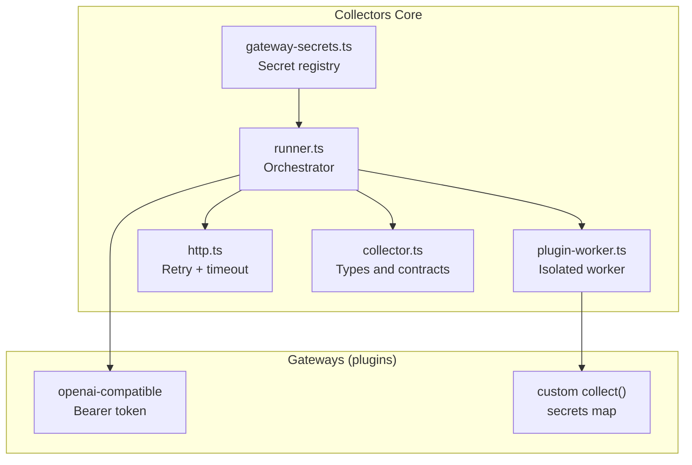
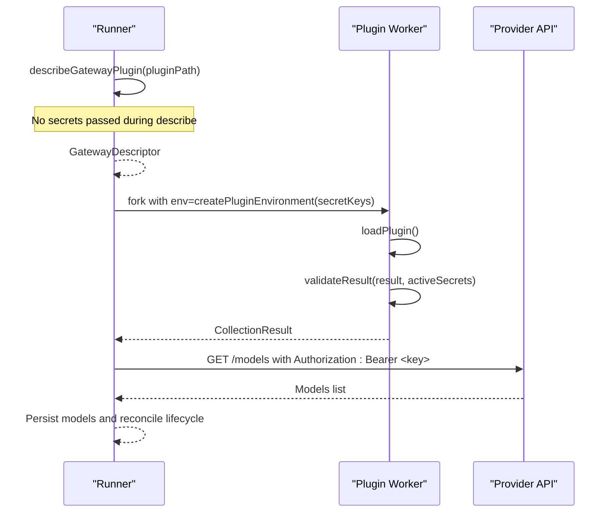
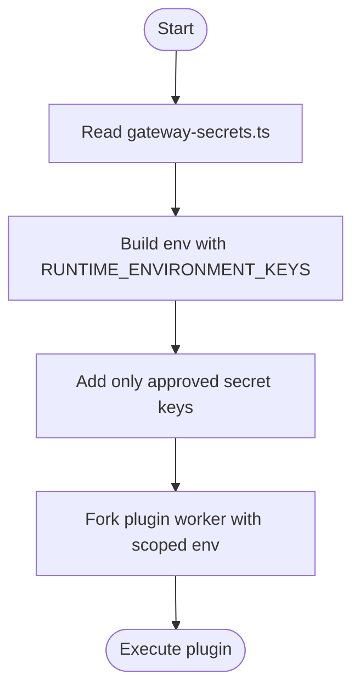
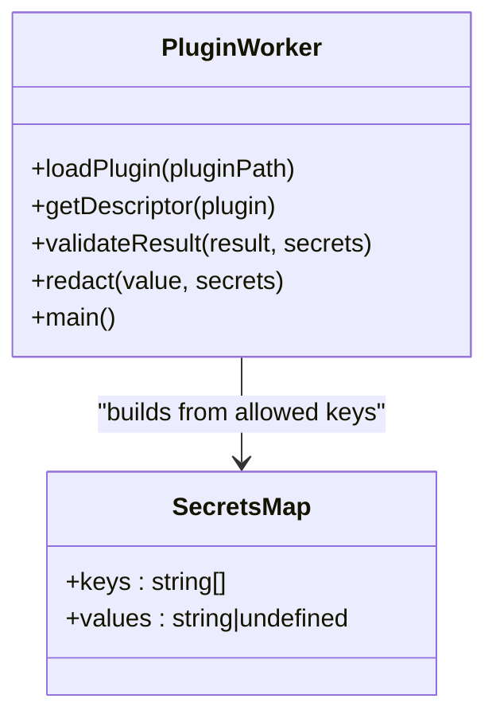
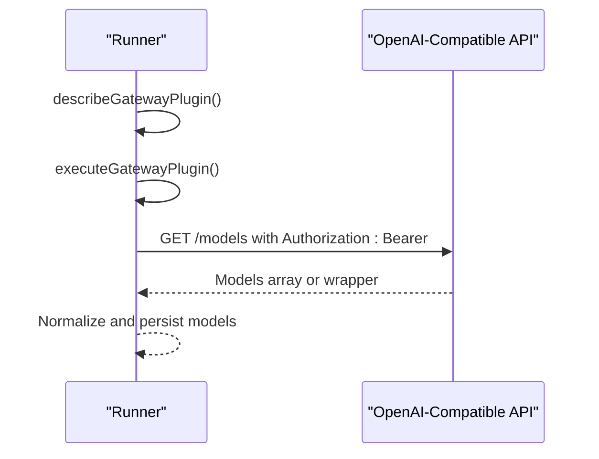
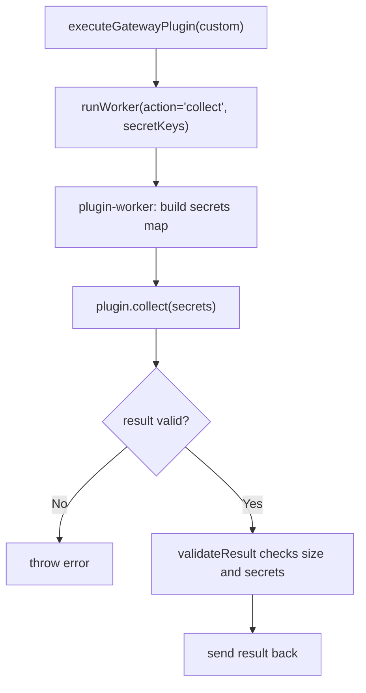
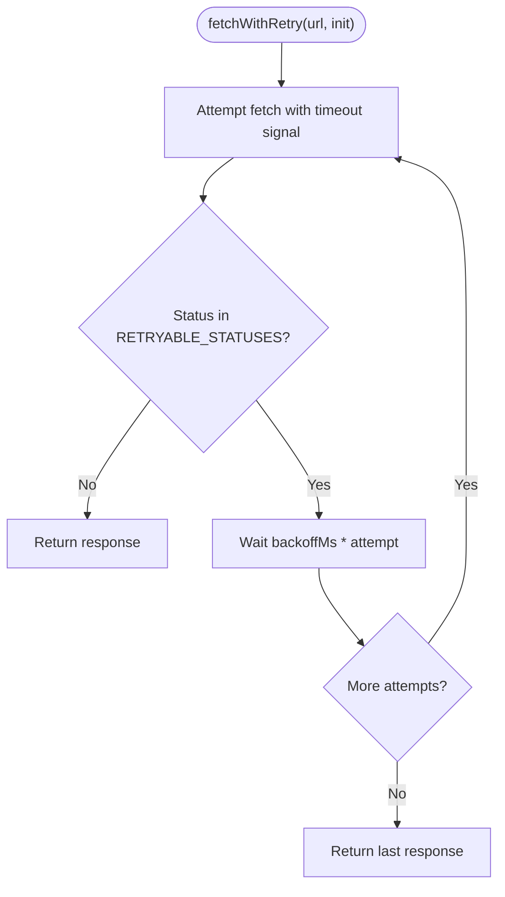
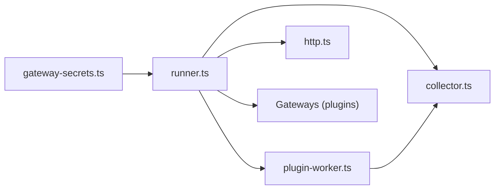

# Authentication & Security

<cite>
**Referenced Files in This Document**
- [README.md](file://README.md)
- [08_Gateway_Plugin_Security.md](file://docs/08_Gateway_Plugin_Security.md)
- [gateway-secrets.ts](file://packages/collectors/src/core/gateway-secrets.ts)
- [plugin-worker.ts](file://packages/collectors/src/core/plugin-worker.ts)
- [runner.ts](file://packages/collectors/src/core/runner.ts)
- [http.ts](file://packages/collectors/src/core/http.ts)
- [collector.ts](file://packages/collectors/src/core/collector.ts)
- [secret-leak-gateway.ts](file://packages/collectors/src/__tests__/fixtures/secret-leak-gateway.ts)
- [unregistered-gateway.ts](file://packages/collectors/src/__tests__/fixtures/unregistered-gateway.ts)
</cite>

## Table of Contents
1. [Introduction](#introduction)
2. [Project Structure](#project-structure)
3. [Core Components](#core-components)
4. [Architecture Overview](#architecture-overview)
5. [Detailed Component Analysis](#detailed-component-analysis)
6. [Dependency Analysis](#dependency-analysis)
7. [Performance Considerations](#performance-considerations)
8. [Troubleshooting Guide](#troubleshooting-guide)
9. [Conclusion](#conclusion)
10. [Appendices](#appendices)

## Introduction
This document explains the authentication mechanisms and security implementations for the gateway layer. It focuses on API key management, environment-based secret handling, plugin isolation, and secure credential flows. While OAuth token flows are not implemented in this codebase, the patterns described here provide a foundation for adding them securely. The goal is to help you implement secure authentication for new providers, configure environment variables safely, and follow production best practices.

## Project Structure
The authentication and security logic lives primarily in the collectors package:
- Centralized secret registry defines which environment keys each gateway may access.
- A runner orchestrates plugin discovery and execution with strict environment scoping.
- An isolated worker executes custom plugins with only approved secrets.
- HTTP helpers ensure resilient and safe network calls.
- Documentation outlines security boundaries and guidelines for adding gateways.

**Diagram sources**
- [gateway-secrets.ts:1-27](file://packages/collectors/src/core/gateway-secrets.ts#L1-L27)
- [runner.ts:1-475](file://packages/collectors/src/core/runner.ts#L1-L475)
- [plugin-worker.ts:1-113](file://packages/collectors/src/core/plugin-worker.ts#L1-L113)
- [http.ts:1-38](file://packages/collectors/src/core/http.ts#L1-L38)
- [collector.ts:1-89](file://packages/collectors/src/core/collector.ts#L1-L89)

**Section sources**
- [README.md:1-61](file://README.md#L1-L61)
- [08_Gateway_Plugin_Security.md:1-36](file://docs/08_Gateway_Plugin_Security.md#L1-L36)

## Core Components
- Secret Registry: Defines allowed environment variable names per gateway ID. Only these keys can be passed to plugins.
- Runner: Builds a minimal environment for workers, enforces secret allowlists, and executes OpenAI-compatible or custom plugins.
- Plugin Worker: Loads and runs custom plugins in an isolated process with redaction and size validation to prevent secret leaks.
- HTTP Helpers: Provide retry and timeout behavior for upstream calls.
- Contracts: Define types for collection results, pricing sources, and gateway descriptors.

Key responsibilities:
- Prevent secret escalation by centralizing allowed keys.
- Isolate plugin execution to limit exposure.
- Redact secrets from errors and responses.
- Enforce response size and model count limits.
- Use resilient HTTP calls with timeouts and retries.

**Section sources**
- [gateway-secrets.ts:1-27](file://packages/collectors/src/core/gateway-secrets.ts#L1-L27)
- [runner.ts:96-111](file://packages/collectors/src/core/runner.ts#L96-L111)
- [plugin-worker.ts:26-46](file://packages/collectors/src/core/plugin-worker.ts#L26-L46)
- [http.ts:1-38](file://packages/collectors/src/core/http.ts#L1-L38)
- [collector.ts:1-89](file://packages/collectors/src/core/collector.ts#L1-L89)

## Architecture Overview
The gateway layer uses a two-process model:
- The main runner discovers and validates plugin metadata without credentials.
- Custom plugins execute in a child process with a scoped environment containing only approved secrets.
- OpenAI-compatible gateways receive a Bearer token via Authorization header when available.

**Diagram sources**
- [runner.ts:156-238](file://packages/collectors/src/core/runner.ts#L156-L238)
- [plugin-worker.ts:87-113](file://packages/collectors/src/core/plugin-worker.ts#L87-L113)
- [http.ts:17-37](file://packages/collectors/src/core/http.ts#L17-L37)

## Detailed Component Analysis

### Secret Registry and Environment Scoping
- Central registry enumerates allowed environment keys per gateway ID.
- createPluginEnvironment builds a minimal environment including only whitelisted runtime keys and the gateway’s approved secrets.
- Unregistered gateways receive no secrets; attempting to use unapproved keys fails early.

**Diagram sources**
- [gateway-secrets.ts:1-27](file://packages/collectors/src/core/gateway-secrets.ts#L1-L27)
- [runner.ts:96-111](file://packages/collectors/src/core/runner.ts#L96-L111)

**Section sources**
- [gateway-secrets.ts:1-27](file://packages/collectors/src/core/gateway-secrets.ts#L1-L27)
- [runner.ts:96-111](file://packages/collectors/src/core/runner.ts#L96-L111)

### Plugin Worker Isolation and Secret Redaction
- The worker loads the plugin module and validates its descriptor.
- For custom plugins, it constructs a secrets map from the allowed keys and passes it to collect().
- Results are validated for shape, size, and presence of secrets; any detected secret in output triggers an error.
- Errors are redacted using active secrets before being sent back to the parent.

**Diagram sources**
- [plugin-worker.ts:48-106](file://packages/collectors/src/core/plugin-worker.ts#L48-L106)

**Section sources**
- [plugin-worker.ts:1-113](file://packages/collectors/src/core/plugin-worker.ts#L1-L113)

### OpenAI-Compatible Gateway Flow
- Describes the plugin without secrets.
- Validates that the requested secretKeyName is registered.
- Calls the provider’s /models endpoint with Authorization: Bearer <key>.
- Parses both wrapper and bare-array responses and normalizes into model records.

**Diagram sources**
- [runner.ts:167-214](file://packages/collectors/src/core/runner.ts#L167-L214)
- [collector.ts:55-65](file://packages/collectors/src/core/collector.ts#L55-L65)

**Section sources**
- [runner.ts:167-214](file://packages/collectors/src/core/runner.ts#L167-L214)
- [collector.ts:55-65](file://packages/collectors/src/core/collector.ts#L55-L65)

### Custom Plugin Execution and Validation
- Custom plugins must implement collect(secrets).
- The worker constructs a secrets map from only the approved keys.
- Result validation ensures correct structure, size limits, and absence of secrets in output.

**Diagram sources**
- [runner.ts:216-238](file://packages/collectors/src/core/runner.ts#L216-L238)
- [plugin-worker.ts:99-106](file://packages/collectors/src/core/plugin-worker.ts#L99-L106)

**Section sources**
- [runner.ts:216-238](file://packages/collectors/src/core/runner.ts#L216-L238)
- [plugin-worker.ts:99-106](file://packages/collectors/src/core/plugin-worker.ts#L99-L106)

### HTTP Resilience and Error Handling
- fetchWithRetry implements exponential-ish backoff for transient statuses and per-attempt timeouts.
- Runner maps common HTTP status codes to actionable hints for diagnostics.
- Error bodies are captured safely without leaking secrets.

**Diagram sources**
- [http.ts:17-37](file://packages/collectors/src/core/http.ts#L17-L37)
- [runner.ts:42-48](file://packages/collectors/src/core/runner.ts#L42-L48)

**Section sources**
- [http.ts:1-38](file://packages/collectors/src/core/http.ts#L1-L38)
- [runner.ts:42-48](file://packages/collectors/src/core/runner.ts#L42-L48)

### Security Boundaries and Best Practices
- Plugins are treated as untrusted until reviewed.
- Plugin files must resolve within the gateways directory and accept only .ts/.js.
- Metadata loading occurs in an isolated worker without secrets.
- Custom collection runs in a second worker with only approved secrets.
- CI credentials like GITHUB_TOKEN are not passed through to plugins.
- Adding a new gateway requires registering its secret names centrally.

**Section sources**
- [08_Gateway_Plugin_Security.md:1-36](file://docs/08_Gateway_Plugin_Security.md#L1-L36)

## Dependency Analysis
The following diagram shows how components depend on each other to enforce secure authentication and data collection.

**Diagram sources**
- [gateway-secrets.ts:1-27](file://packages/collectors/src/core/gateway-secrets.ts#L1-L27)
- [runner.ts:1-475](file://packages/collectors/src/core/runner.ts#L1-L475)
- [plugin-worker.ts:1-113](file://packages/collectors/src/core/plugin-worker.ts#L1-L113)
- [http.ts:1-38](file://packages/collectors/src/core/http.ts#L1-L38)
- [collector.ts:1-89](file://packages/collectors/src/core/collector.ts#L1-L89)

**Section sources**
- [runner.ts:1-475](file://packages/collectors/src/core/runner.ts#L1-L475)
- [gateway-secrets.ts:1-27](file://packages/collectors/src/core/gateway-secrets.ts#L1-L27)

## Performance Considerations
- Response size and model count limits protect against memory exhaustion and slow operations.
- Retries with backoff reduce transient failures but should be tuned to avoid excessive latency.
- Timeouts per request and overall plugin worker timeouts prevent hangs.
- Minimal environment reduces startup overhead and potential side effects.

[No sources needed since this section provides general guidance]

## Troubleshooting Guide
Common issues and resolutions:
- Unauthorized or forbidden responses: Verify API key validity and permissions.
- Rate limiting: Ensure retries are configured and consider throttling client requests.
- Not found: Check base URL and endpoint path correctness.
- Precondition failed: Billing setup or account suspension may be required.
- Secret leakage detection: If a plugin returns secrets in errors or models, fix the plugin to avoid including sensitive values.

Useful references:
- HTTP status hints and error body capture.
- Secret redaction in worker errors.
- Test fixtures demonstrating secret leakage scenarios and unregistered gateway behavior.

**Section sources**
- [runner.ts:42-48](file://packages/collectors/src/core/runner.ts#L42-L48)
- [plugin-worker.ts:26-46](file://packages/collectors/src/core/plugin-worker.ts#L26-L46)
- [secret-leak-gateway.ts:1-14](file://packages/collectors/src/__tests__/fixtures/secret-leak-gateway.ts#L1-L14)
- [unregistered-gateway.ts:1-17](file://packages/collectors/src/__tests__/fixtures/unregistered-gateway.ts#L1-L17)

## Conclusion
The gateway layer enforces strong security boundaries through centralized secret registries, isolated plugin execution, and strict environment scoping. API keys are handled via environment variables and Bearer tokens where applicable. While OAuth flows are not present, the patterns here provide a clear path to integrate secure token exchanges. Follow the documented steps to add new gateways safely and adhere to production best practices for secret management and resilience.

[No sources needed since this section summarizes without analyzing specific files]

## Appendices

### Implementing Secure Authentication for New Providers
Steps:
- Create a gateway plugin under the gateways directory.
- Register required secret names in the central registry.
- For OpenAI-compatible endpoints, set baseUrl and secretKeyName; the runner will attach Authorization: Bearer when available.
- For custom endpoints, implement collect(secrets) and use only the provided secrets map.
- Validate outputs to avoid returning secrets in errors or models.
- Add tests covering success and failure cases, including secret leakage prevention.

Environment configuration:
- Set environment variables for each gateway’s secret keys.
- Ensure CI environments do not pass unnecessary credentials to plugins.

Security best practices:
- Keep secrets out of logs and responses; rely on built-in redaction.
- Limit plugin privileges to only necessary environment keys.
- Use timeouts and retries judiciously to balance reliability and performance.
- Review all changes to the secret registry and plugin code together.

**Section sources**
- [08_Gateway_Plugin_Security.md:19-27](file://docs/08_Gateway_Plugin_Security.md#L19-L27)
- [gateway-secrets.ts:1-27](file://packages/collectors/src/core/gateway-secrets.ts#L1-L27)
- [runner.ts:156-238](file://packages/collectors/src/core/runner.ts#L156-L238)
- [plugin-worker.ts:87-113](file://packages/collectors/src/core/plugin-worker.ts#L87-L113)