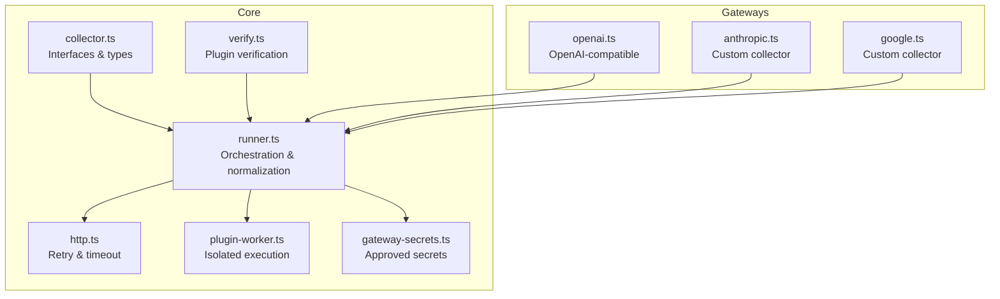
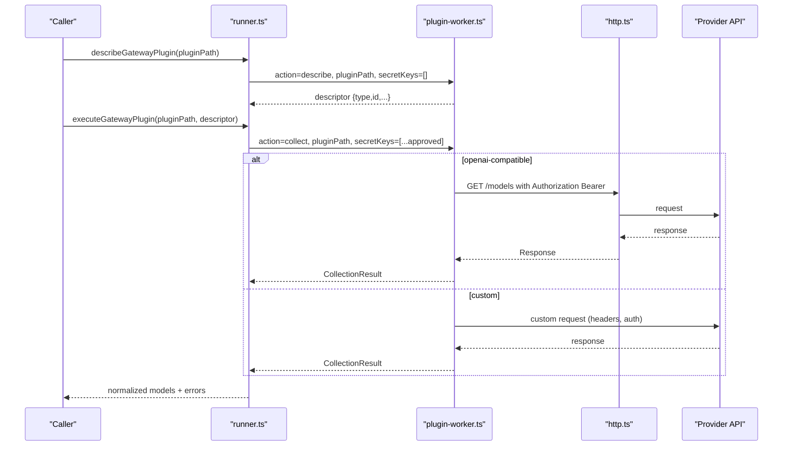
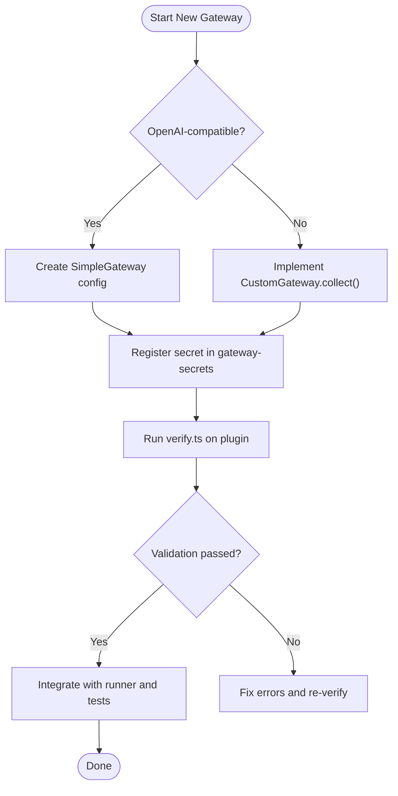
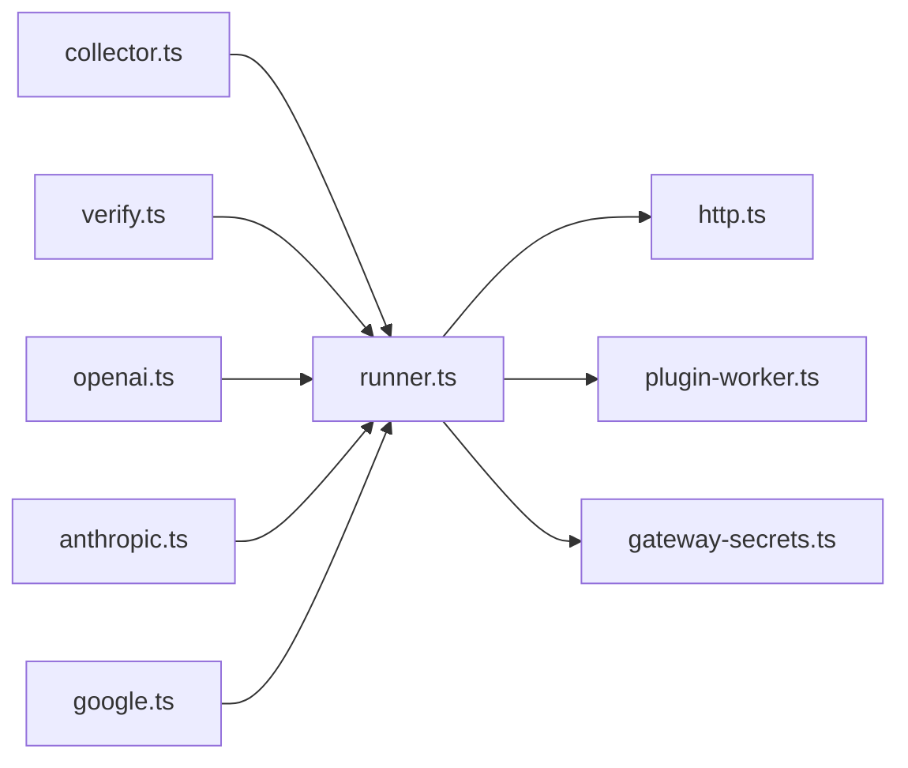
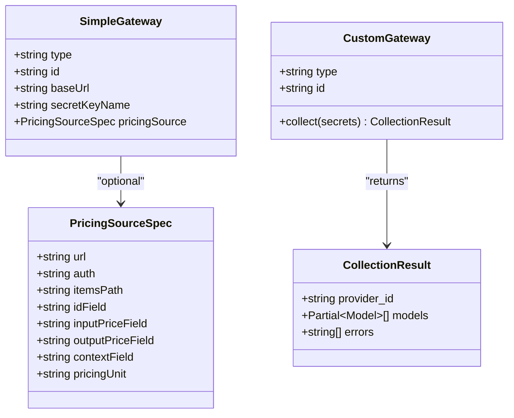
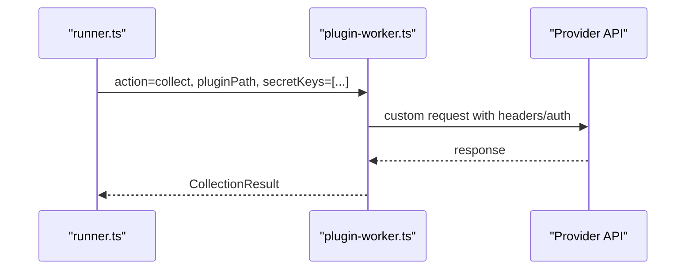

# Gateway Abstraction Layer

<cite>
**Referenced Files in This Document**
- [collector.ts](file://packages/collectors/src/core/collector.ts)
- [runner.ts](file://packages/collectors/src/core/runner.ts)
- [http.ts](file://packages/collectors/src/core/http.ts)
- [plugin-worker.ts](file://packages/collectors/src/core/plugin-worker.ts)
- [gateway-secrets.ts](file://packages/collectors/src/core/gateway-secrets.ts)
- [verify.ts](file://packages/collectors/src/core/verify.ts)
- [openai.ts](file://packages/collectors/src/gateways/openai.ts)
- [anthropic.ts](file://packages/collectors/src/gateways/anthropic.ts)
- [google.ts](file://packages/collectors/src/gateways/google.ts)
</cite>

## Table of Contents
1. [Introduction](#introduction)
2. [Project Structure](#project-structure)
3. [Core Components](#core-components)
4. [Architecture Overview](#architecture-overview)
5. [Detailed Component Analysis](#detailed-component-analysis)
6. [Dependency Analysis](#dependency-analysis)
7. [Performance Considerations](#performance-considerations)
8. [Troubleshooting Guide](#troubleshooting-guide)
9. [Conclusion](#conclusion)
10. [Appendices](#appendices)

## Introduction
This document explains the gateway abstraction layer that standardizes API interactions across different AI model providers. It covers:
- The gateway interface contracts for both simple OpenAI-compatible gateways and custom collectors
- HTTP client behavior, including retries and timeouts
- Request/response transformation patterns used to normalize provider responses into a unified model schema
- Error handling strategies and safe secret management
- Authentication mechanisms (API keys), with guidance on how OAuth/token refresh would be integrated
- Examples of existing provider-specific gateways and step-by-step guidelines to implement new ones

The goal is to make it easy to add or update provider integrations while keeping the system secure, robust, and consistent.

## Project Structure
The gateway abstraction lives primarily under the collectors package core and gateways directories:
- Core interfaces and runtime orchestration are defined in collector.ts and runner.ts
- HTTP utilities provide resilient fetch behavior
- An isolated worker executes plugins safely without exposing secrets to the main process
- A secrets registry enumerates approved environment variables per gateway
- Concrete gateways demonstrate both simple declarative configuration and custom collection logic

**Diagram sources**
- [collector.ts:1-89](file://packages/collectors/src/core/collector.ts#L1-L89)
- [runner.ts:1-200](file://packages/collectors/src/core/runner.ts#L1-L200)
- [http.ts:1-38](file://packages/collectors/src/core/http.ts#L1-L38)
- [plugin-worker.ts:1-112](file://packages/collectors/src/core/plugin-worker.ts#L1-L112)
- [gateway-secrets.ts:1-27](file://packages/collectors/src/core/gateway-secrets.ts#L1-L27)
- [verify.ts:1-69](file://packages/collectors/src/core/verify.ts#L1-L69)
- [openai.ts:1-13](file://packages/collectors/src/gateways/openai.ts#L1-L13)
- [anthropic.ts:1-72](file://packages/collectors/src/gateways/anthropic.ts#L1-L72)
- [google.ts:1-100](file://packages/collectors/src/gateways/google.ts#L1-L100)

**Section sources**
- [collector.ts:1-89](file://packages/collectors/src/core/collector.ts#L1-L89)
- [runner.ts:1-200](file://packages/collectors/src/core/runner.ts#L1-L200)
- [http.ts:1-38](file://packages/collectors/src/core/http.ts#L1-L38)
- [plugin-worker.ts:1-112](file://packages/collectors/src/core/plugin-worker.ts#L1-L112)
- [gateway-secrets.ts:1-27](file://packages/collectors/src/core/gateway-secrets.ts#L1-L27)
- [verify.ts:1-69](file://packages/collectors/src/core/verify.ts#L1-L69)
- [openai.ts:1-13](file://packages/collectors/src/gateways/openai.ts#L1-L13)
- [anthropic.ts:1-72](file://packages/collectors/src/gateways/anthropic.ts#L1-L72)
- [google.ts:1-100](file://packages/collectors/src/gateways/google.ts#L1-L100)

## Core Components
- Gateway plugin interfaces:
  - SimpleGateway: Declarative metadata for OpenAI-compatible endpoints (id, baseUrl, secretKeyName, optional pricingSource)
  - CustomGateway: Full collect(secrets) implementation for non-standard APIs
- CollectionResult: Unified output shape containing provider_id, models (Partial<Model>), and errors
- HTTP client: fetchWithRetry provides exponential backoff and timeouts for transient failures
- Plugin isolation: plugin-worker runs plugins in a child process with strict limits and secret redaction
- Secrets registry: gateway-secrets maps each gateway to its approved environment variable names

Key responsibilities:
- runner orchestrates describe/collect actions, normalizes responses, and persists results
- http centralizes retry/timeout behavior
- plugin-worker enforces safety constraints (size, count, secret leakage)
- verify validates plugins locally before production use

**Section sources**
- [collector.ts:1-89](file://packages/collectors/src/core/collector.ts#L1-L89)
- [http.ts:1-38](file://packages/collectors/src/core/http.ts#L1-L38)
- [plugin-worker.ts:1-112](file://packages/collectors/src/core/plugin-worker.ts#L1-L112)
- [gateway-secrets.ts:1-27](file://packages/collectors/src/core/gateway-secrets.ts#L1-L27)
- [runner.ts:1-200](file://packages/collectors/src/core/runner.ts#L1-L200)

## Architecture Overview
The gateway layer uses a two-mode plugin architecture:
- OpenAI-compatible mode: minimal configuration; runner handles HTTP calls, parsing, and normalization
- Custom mode: full control over HTTP requests, headers, parsing, and mapping

**Diagram sources**
- [runner.ts:156-200](file://packages/collectors/src/core/runner.ts#L156-L200)
- [plugin-worker.ts:99-112](file://packages/collectors/src/core/plugin-worker.ts#L99-L112)
- [http.ts:17-38](file://packages/collectors/src/core/http.ts#L17-L38)

## Detailed Component Analysis

### Gateway Interface Contracts
- SimpleGateway:
  - type: 'openai-compatible'
  - id: unique provider identifier
  - baseUrl: base URL for OpenAI-compatible endpoints
  - secretKeyName: name of the environment variable holding the API key
  - pricingSource: optional catalog spec for enrichment
- CustomGateway:
  - type: 'custom'
  - id: unique provider identifier
  - collect(secrets): returns CollectionResult with provider_id, models[], errors[]
- CollectionResult:
  - provider_id: string
  - models: Partial<Model>[]
  - errors: string[]

These contracts ensure consistent behavior across all gateways and simplify downstream processing.

**Section sources**
- [collector.ts:1-89](file://packages/collectors/src/core/collector.ts#L1-L89)

### HTTP Client Implementation
- fetchWithRetry:
  - Retries on transient statuses (e.g., 429, 5xx)
  - Uses exponential backoff with configurable attempts and base delay
  - Applies per-attempt timeout via AbortSignal
- Centralized usage ensures consistent resilience across all collectors

**Section sources**
- [http.ts:1-38](file://packages/collectors/src/core/http.ts#L1-L38)

### Request/Response Transformation Patterns
- OpenAI-compatible normalization:
  - Accepts both wrapper { data: [...] } and bare arrays
  - Normalizes fields to internal model representation
  - Infers capabilities from model IDs when not provided by upstream
- Custom collectors:
  - Validate responses using Zod schemas
  - Map provider-specific fields to canonical model properties
  - Populate capability flags based on provider hints or naming conventions

Examples:
- OpenAI-compatible path in runner handles both shapes and infers modality/capabilities
- Anthropic and Google gateways parse provider-specific schemas and map to canonical fields

**Section sources**
- [runner.ts:25-56](file://packages/collectors/src/core/runner.ts#L25-L56)
- [runner.ts:167-200](file://packages/collectors/src/core/runner.ts#L167-L200)
- [anthropic.ts:1-72](file://packages/collectors/src/gateways/anthropic.ts#L1-L72)
- [google.ts:1-100](file://packages/collectors/src/gateways/google.ts#L1-L100)

### Error Handling Strategies
- HTTP-level:
  - Retryable statuses handled automatically
  - Non-retryable errors surfaced with contextual hints (e.g., 401/403/404/412/429)
- Plugin-level:
  - Errors collected in result.errors rather than throwing, enabling partial success
  - Size and count limits enforced to prevent abuse or memory issues
  - Secret leakage detection in serialized results
- Verification:
  - Local validation checks structure and sample schema compliance

**Section sources**
- [runner.ts:42-67](file://packages/collectors/src/core/runner.ts#L42-L67)
- [plugin-worker.ts:32-46](file://packages/collectors/src/core/plugin-worker.ts#L32-L46)
- [verify.ts:24-57](file://packages/collectors/src/core/verify.ts#L24-L57)

### Authentication Mechanisms
- API Key Management:
  - Each gateway declares its required secret(s) in gateway-secrets
  - Only approved keys are injected into the plugin worker environment
  - OpenAI-compatible gateways send Authorization: Bearer <key>
  - Custom gateways can set provider-specific headers or query params
- OAuth Flows and Token Refresh:
  - Not implemented in current gateways; recommended approach:
    - Implement a token cache in the custom gateway
    - On 401/403, attempt refresh using stored refresh token
    - Retry the original request once after successful refresh
    - Surface persistent auth errors in result.errors

**Section sources**
- [gateway-secrets.ts:1-27](file://packages/collectors/src/core/gateway-secrets.ts#L1-L27)
- [runner.ts:167-186](file://packages/collectors/src/core/runner.ts#L167-L186)
- [anthropic.ts:28-35](file://packages/collectors/src/gateways/anthropic.ts#L28-L35)
- [google.ts:43-49](file://packages/collectors/src/gateways/google.ts#L43-L49)

### Provider-Specific Gateway Examples

#### OpenAI-Compatible Gateway
- Minimal configuration: id, baseUrl, secretKeyName
- Runner performs HTTP call to /models, parses response, and normalizes models

**Section sources**
- [openai.ts:1-13](file://packages/collectors/src/gateways/openai.ts#L1-L13)
- [runner.ts:167-200](file://packages/collectors/src/core/runner.ts#L167-L200)

#### Anthropic Custom Gateway
- Uses x-api-key header and anthropic-version
- Parses provider-specific schema and maps to canonical model fields
- Populates capability flags conservatively

**Section sources**
- [anthropic.ts:1-72](file://packages/collectors/src/gateways/anthropic.ts#L1-L72)

#### Google Custom Gateway
- Passes API key via query parameter
- Parses Gemini model listing and infers modalities and features
- Maps provider fields to canonical model properties

**Section sources**
- [google.ts:1-100](file://packages/collectors/src/gateways/google.ts#L1-L100)

### Creating a New Gateway
Follow these steps to add support for an unsupported provider:

1. Decide the gateway type:
   - Use SimpleGateway if the provider exposes an OpenAI-compatible /models endpoint
   - Use CustomGateway for non-standard APIs

2. For SimpleGateway:
   - Create a file in gateways/<provider>.ts
   - Export default object with type, id, baseUrl, secretKeyName
   - Ensure the secret name matches an entry in gateway-secrets

3. For CustomGateway:
   - Create a file in gateways/<provider>.ts
   - Implement collect(secrets) returning CollectionResult
   - Use fetchWithRetry for resilient HTTP calls
   - Validate responses with Zod schemas
   - Map provider fields to canonical model properties
   - Populate capability flags based on provider hints or naming

4. Add secrets:
   - Register required environment variables in gateway-secrets

5. Verify locally:
   - Run the verifier against your plugin to validate structure and schema

6. Test integration:
   - Ensure the runner can describe and execute your plugin
   - Confirm models are normalized and persisted correctly

[No sources needed since this diagram shows conceptual workflow, not actual code structure]

## Dependency Analysis
The gateway layer has clear separation between interfaces, orchestration, and implementations:
- collector.ts defines contracts consumed by runner and plugins
- runner.ts depends on http.ts for network resilience and plugin-worker.ts for isolation
- plugin-worker.ts enforces safety and executes plugins with limited environment
- gateway-secrets.ts controls which secrets are available to plugins
- verify.ts depends on runner to validate plugins locally

**Diagram sources**
- [collector.ts:1-89](file://packages/collectors/src/core/collector.ts#L1-L89)
- [runner.ts:1-200](file://packages/collectors/src/core/runner.ts#L1-L200)
- [http.ts:1-38](file://packages/collectors/src/core/http.ts#L1-L38)
- [plugin-worker.ts:1-112](file://packages/collectors/src/core/plugin-worker.ts#L1-L112)
- [gateway-secrets.ts:1-27](file://packages/collectors/src/core/gateway-secrets.ts#L1-L27)
- [verify.ts:1-69](file://packages/collectors/src/core/verify.ts#L1-L69)
- [openai.ts:1-13](file://packages/collectors/src/gateways/openai.ts#L1-L13)
- [anthropic.ts:1-72](file://packages/collectors/src/gateways/anthropic.ts#L1-L72)
- [google.ts:1-100](file://packages/collectors/src/gateways/google.ts#L1-L100)

**Section sources**
- [collector.ts:1-89](file://packages/collectors/src/core/collector.ts#L1-L89)
- [runner.ts:1-200](file://packages/collectors/src/core/runner.ts#L1-L200)
- [http.ts:1-38](file://packages/collectors/src/core/http.ts#L1-L38)
- [plugin-worker.ts:1-112](file://packages/collectors/src/core/plugin-worker.ts#L1-L112)
- [gateway-secrets.ts:1-27](file://packages/collectors/src/core/gateway-secrets.ts#L1-L27)
- [verify.ts:1-69](file://packages/collectors/src/core/verify.ts#L1-L69)
- [openai.ts:1-13](file://packages/collectors/src/gateways/openai.ts#L1-L13)
- [anthropic.ts:1-72](file://packages/collectors/src/gateways/anthropic.ts#L1-L72)
- [google.ts:1-100](file://packages/collectors/src/gateways/google.ts#L1-L100)

## Performance Considerations
- Network resilience:
  - Use fetchWithRetry to handle transient failures and avoid flaky runs
  - Configure appropriate timeouts to prevent long hangs
- Plugin limits:
  - MAX_PLUGIN_MODELS prevents excessive memory usage
  - MAX_PLUGIN_RESPONSE_BYTES guards against large payloads
- Capability inference:
  - Avoid expensive probing; infer modalities from model IDs where possible
- Isolation:
  - Child process execution prevents plugin crashes from affecting the main process

[No sources needed since this section provides general guidance]

## Troubleshooting Guide
Common issues and resolutions:
- Missing API key:
  - Ensure the required secret is set in the environment and registered in gateway-secrets
  - Check error messages in result.errors for guidance
- HTTP errors:
  - 401/403: Validate key permissions and account status
  - 404: Verify base URL and endpoint path
  - 429: Increase backoff or reduce request rate
- Plugin validation failures:
  - Run verify.ts to catch structural and schema issues early
- Secret leakage:
  - Avoid including raw secrets in logs or returned objects; plugin-worker will reject such results

**Section sources**
- [runner.ts:42-67](file://packages/collectors/src/core/runner.ts#L42-L67)
- [plugin-worker.ts:32-46](file://packages/collectors/src/core/plugin-worker.ts#L32-L46)
- [verify.ts:24-57](file://packages/collectors/src/core/verify.ts#L24-L57)

## Conclusion
The gateway abstraction layer provides a secure, extensible, and resilient foundation for integrating multiple AI model providers. By standardizing interfaces, enforcing isolation, and centralizing HTTP behavior, it simplifies adding new providers while maintaining consistency and safety. Follow the guidelines to implement custom gateways and leverage existing patterns for authentication, transformation, and error handling.

[No sources needed since this section summarizes without analyzing specific files]

## Appendices

### Appendix A: Class Diagram of Gateway Interfaces

**Diagram sources**
- [collector.ts:1-89](file://packages/collectors/src/core/collector.ts#L1-L89)

### Appendix B: Sequence Diagram for Custom Gateway Execution

**Diagram sources**
- [runner.ts:156-200](file://packages/collectors/src/core/runner.ts#L156-L200)
- [plugin-worker.ts:99-112](file://packages/collectors/src/core/plugin-worker.ts#L99-L112)