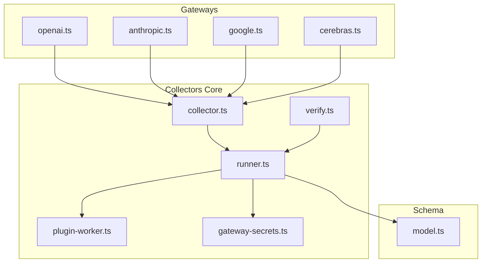
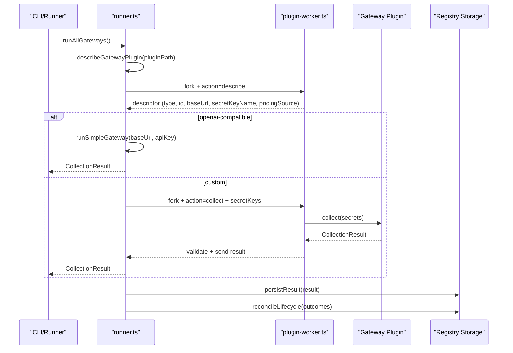
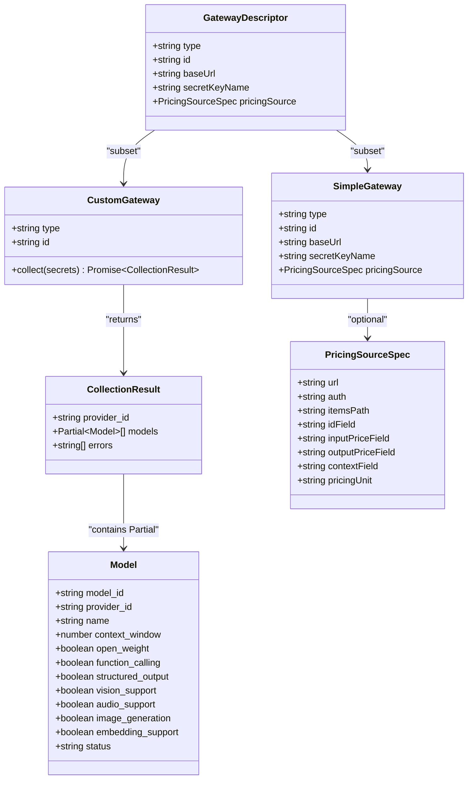

# Gateway Interface & Contracts

<cite>
**Referenced Files in This Document**
- [collector.ts](file://packages/collectors/src/core/collector.ts)
- [runner.ts](file://packages/collectors/src/core/runner.ts)
- [plugin-worker.ts](file://packages/collectors/src/core/plugin-worker.ts)
- [gateway-secrets.ts](file://packages/collectors/src/core/gateway-secrets.ts)
- [verify.ts](file://packages/collectors/src/core/verify.ts)
- [openai.ts](file://packages/collectors/src/gateways/openai.ts)
- [anthropic.ts](file://packages/collectors/src/gateways/anthropic.ts)
- [google.ts](file://packages/collectors/src/gateways/google.ts)
- [cerebras.ts](file://packages/collectors/src/gateways/cerebras.ts)
- [model.ts](file://packages/schema/src/model.ts)
</cite>

## Table of Contents
1. [Introduction](#introduction)
2. [Project Structure](#project-structure)
3. [Core Components](#core-components)
4. [Architecture Overview](#architecture-overview)
5. [Detailed Component Analysis](#detailed-component-analysis)
6. [Dependency Analysis](#dependency-analysis)
7. [Performance Considerations](#performance-considerations)
8. [Troubleshooting Guide](#troubleshooting-guide)
9. [Conclusion](#conclusion)
10. [Appendices](#appendices)

## Introduction
This document defines the gateway interface and contracts that provide a standardized API abstraction layer for discovering and normalizing AI model catalogs across providers and gateways. It covers:
- Core interface methods and data contracts
- Request/response schemas and normalization rules
- Authentication patterns and secret management
- Error handling conventions
- Gateway lifecycle, connection management, and configuration options
- Examples of implementing custom gateways
- Best practices for consistency across provider integrations

The system supports two plugin types:
- OpenAI-compatible gateways with declarative configuration
- Custom gateways with explicit collection logic executed in an isolated worker process

## Project Structure
Gateway-related code is primarily located under the collectors package:
- Core interfaces and runtime orchestration live in core modules
- Provider-specific plugins are implemented as individual files under the gateways directory
- The schema package defines canonical data models used by all components

**Diagram sources**
- [collector.ts](file://packages/collectors/src/core/collector.ts)
- [runner.ts](file://packages/collectors/src/core/runner.ts)
- [plugin-worker.ts](file://packages/collectors/src/core/plugin-worker.ts)
- [gateway-secrets.ts](file://packages/collectors/src/core/gateway-secrets.ts)
- [verify.ts](file://packages/collectors/src/core/verify.ts)
- [openai.ts](file://packages/collectors/src/gateways/openai.ts)
- [anthropic.ts](file://packages/collectors/src/gateways/anthropic.ts)
- [google.ts](file://packages/collectors/src/gateways/google.ts)
- [cerebras.ts](file://packages/collectors/src/gateways/cerebras.ts)
- [model.ts](file://packages/schema/src/model.ts)

**Section sources**
- [README.md](file://README.md)

## Core Components
- CollectionResult: Standardized output from any gateway plugin containing provider_id, partial Model records, and errors.
- SimpleGateway: Declarative configuration for OpenAI-compatible endpoints including id, baseUrl, secretKeyName, and optional pricingSource.
- CustomGateway: Full implementation of collect(secrets) to fetch and normalize provider model listings into Partial<Model>.
- GatewayDescriptor: Serializable metadata returned from the isolated worker describing the plugin type and required fields.
- PricingSourceSpec: Optional specification for fetching pricing catalogs from OpenAI-compatible endpoints.

Key constraints and constants:
- MAX_PLUGIN_MODELS limits the number of models a plugin can return
- MAX_PLUGIN_RESPONSE_BYTES limits serialized response size
- Secret keys are centrally approved per gateway ID

**Section sources**
- [collector.ts](file://packages/collectors/src/core/collector.ts)
- [runner.ts](file://packages/collectors/src/core/runner.ts)
- [plugin-worker.ts](file://packages/collectors/src/core/plugin-worker.ts)
- [gateway-secrets.ts](file://packages/collectors/src/core/gateway-secrets.ts)

## Architecture Overview
The gateway system uses an isolated worker boundary to execute plugins safely:
- The runner discovers and describes plugins without exposing secrets
- For OpenAI-compatible gateways, the runner directly calls /models with Bearer token authentication
- For custom gateways, the runner forks a worker process that loads the plugin and executes collect() with only approved secrets
- Results are validated against size and content policies, then persisted to the registry

**Diagram sources**
- [runner.ts](file://packages/collectors/src/core/runner.ts)
- [plugin-worker.ts](file://packages/collectors/src/core/plugin-worker.ts)
- [collector.ts](file://packages/collectors/src/core/collector.ts)

**Section sources**
- [runner.ts](file://packages/collectors/src/core/runner.ts)
- [plugin-worker.ts](file://packages/collectors/src/core/plugin-worker.ts)

## Detailed Component Analysis

### Gateway Interfaces and Data Contracts
- CollectionResult: Contains provider_id, array of Partial<Model>, and errors array
- SimpleGateway: Declares type, id, baseUrl, secretKeyName, and optional pricingSource
- CustomGateway: Implements collect(secrets) returning CollectionResult
- GatewayDescriptor: Serializable subset of SimpleGateway or CustomGateway metadata
- PricingSourceSpec: Configurable catalog source with URL, auth mode, field paths, and units

Normalization and validation:
- OpenAI-compatible responses accept both wrapped and bare arrays
- Custom gateways must parse provider responses using Zod schemas
- All outputs conform to Partial<Model> fields defined in the schema

**Section sources**
- [collector.ts](file://packages/collectors/src/core/collector.ts)
- [model.ts](file://packages/schema/src/model.ts)

### Authentication Patterns and Secret Management
- Secrets are centrally approved per gateway ID in gateway-secrets.ts
- Only whitelisted environment variables are injected into the worker process
- OpenAI-compatible gateways use Authorization: Bearer header with the configured secret key
- Custom gateways receive secrets via the collect(secrets) parameter map
- Response payloads are scanned for secret leakage and rejected if found

Best practices:
- Always check for missing secrets and add descriptive error messages
- Never log or include raw secrets in error messages or logs
- Use minimal scope for API keys and rotate regularly

**Section sources**
- [gateway-secrets.ts](file://packages/collectors/src/core/gateway-secrets.ts)
- [runner.ts](file://packages/collectors/src/core/runner.ts)
- [plugin-worker.ts](file://packages/collectors/src/core/plugin-worker.ts)

### Error Handling Conventions
- HTTP errors include status codes, status text, and safe body hints
- Common error codes have contextual hints (401, 403, 404, 412, 429)
- Validation failures produce structured error messages
- Zero-model results with no errors trigger verification warnings
- Reconciliation marks models as discontinued when no longer listed by successful collections

Error categories:
- Network and HTTP errors with retry support
- Schema validation failures with detailed path information
- Secret-related errors (missing, unauthorized, rate-limited)
- Plugin execution errors (timeout, exit codes, serialization issues)

**Section sources**
- [runner.ts](file://packages/collectors/src/core/runner.ts)
- [verify.ts](file://packages/collectors/src/core/verify.ts)

### Gateway Lifecycle and Connection Management
- Discovery phase: Plugins are discovered from the gateways directory
- Description phase: Metadata is extracted without executing plugin code
- Execution phase: Plugins run in isolated workers with controlled environments
- Persistence phase: Results are merged into the registry with collision detection
- Reconciliation phase: Models not seen in successful collections are marked discontinued

Connection management:
- OpenAI-compatible gateways use simple GET requests to /models endpoint
- Custom gateways manage their own HTTP clients and timeouts
- Worker processes have configurable timeouts and resource limits
- Environment isolation prevents credential leakage between plugins

**Section sources**
- [runner.ts](file://packages/collectors/src/core/runner.ts)
- [plugin-worker.ts](file://packages/collectors/src/core/plugin-worker.ts)

### Configuration Options
OpenAI-compatible gateways support:
- baseUrl: Base URL for the OpenAI-compatible API
- secretKeyName: Approved environment variable name for the API key
- pricingSource: Optional catalog configuration for pricing enrichment

Custom gateways support:
- Full control over HTTP requests, headers, and authentication
- Flexible parsing and transformation of provider responses
- Direct mapping to Partial<Model> fields

Environment configuration:
- RUNTIME_ENVIRONMENT_KEYS restricts system variables available to workers
- Secret keys are explicitly whitelisted per gateway
- Plugin paths are validated to prevent directory traversal

**Section sources**
- [collector.ts](file://packages/collectors/src/core/collector.ts)
- [runner.ts](file://packages/collectors/src/core/runner.ts)
- [gateway-secrets.ts](file://packages/collectors/src/core/gateway-secrets.ts)

## Dependency Analysis
The gateway system has clear separation of concerns:
- Core interfaces define contracts without implementation details
- Runner orchestrates plugin discovery, description, and execution
- Worker provides isolation and security boundaries
- Gateways implement provider-specific logic
- Schema ensures data consistency across all components

**Diagram sources**
- [collector.ts](file://packages/collectors/src/core/collector.ts)
- [model.ts](file://packages/schema/src/model.ts)

**Section sources**
- [collector.ts](file://packages/collectors/src/core/collector.ts)
- [model.ts](file://packages/schema/src/model.ts)

## Performance Considerations
- Plugin timeout: Workers terminate after 60 seconds to prevent hanging
- Response size limits: Maximum 10MB serialized response to prevent memory issues
- Model count limits: Maximum 10,000 models per plugin to avoid excessive processing
- Parallel execution: Multiple gateways run concurrently using Promise.allSettled
- Efficient merging: Registry merges existing and new models with collision detection
- Minimal data transfer: Only necessary fields are included in responses

Optimization strategies:
- Use streaming for large datasets when possible
- Implement pagination for providers with large catalogs
- Cache frequently accessed data within plugin lifetime
- Validate responses early to fail fast on malformed data

## Troubleshooting Guide
Common issues and solutions:
- Missing API keys: Ensure secrets are properly configured in environment
- Unauthorized access: Verify API key permissions and account status
- Rate limiting: Implement exponential backoff and request throttling
- Schema validation errors: Check field names and data types in responses
- Plugin timeouts: Optimize network requests and reduce payload sizes
- Directory traversal: Ensure plugin paths are within allowed directories

Debugging steps:
- Use verify command to test individual plugins
- Check error messages for specific failure reasons
- Validate plugin structure against interface definitions
- Monitor worker process logs for execution details
- Test with minimal configurations to isolate issues

**Section sources**
- [verify.ts](file://packages/collectors/src/core/verify.ts)
- [runner.ts](file://packages/collectors/src/core/runner.ts)
- [plugin-worker.ts](file://packages/collectors/src/core/plugin-worker.ts)

## Conclusion
The gateway interface provides a robust, secure, and extensible framework for integrating with diverse AI model providers. By enforcing strict contracts, isolating plugin execution, and centralizing secret management, the system ensures consistency and reliability across all provider integrations. The dual approach of declarative OpenAI-compatible gateways and flexible custom gateways accommodates both standard and specialized provider APIs while maintaining high security standards.

## Appendices

### Example Implementations

#### OpenAI-Compatible Gateway
A simple configuration-based gateway that follows the OpenAI API standard:
- Define type, id, baseUrl, and secretKeyName
- No custom collection logic required
- Automatic /models endpoint handling with Bearer token authentication

#### Custom Gateway Implementation
Full control over provider integration:
- Implement collect(secrets) method
- Handle authentication and HTTP requests manually
- Parse provider-specific response formats
- Map data to Partial<Model> structure

#### Best Practices for Consistency
- Always validate inputs and handle missing secrets gracefully
- Use Zod schemas for response parsing and validation
- Include comprehensive error messages with actionable guidance
- Follow naming conventions for model_id and provider_id
- Set appropriate capability flags based on provider features
- Implement proper error handling and logging

**Section sources**
- [openai.ts](file://packages/collectors/src/gateways/openai.ts)
- [anthropic.ts](file://packages/collectors/src/gateways/anthropic.ts)
- [google.ts](file://packages/collectors/src/gateways/google.ts)
- [cerebras.ts](file://packages/collectors/src/gateways/cerebras.ts)