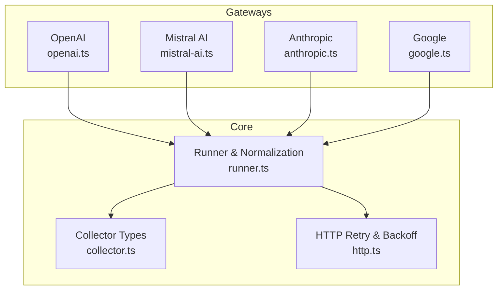
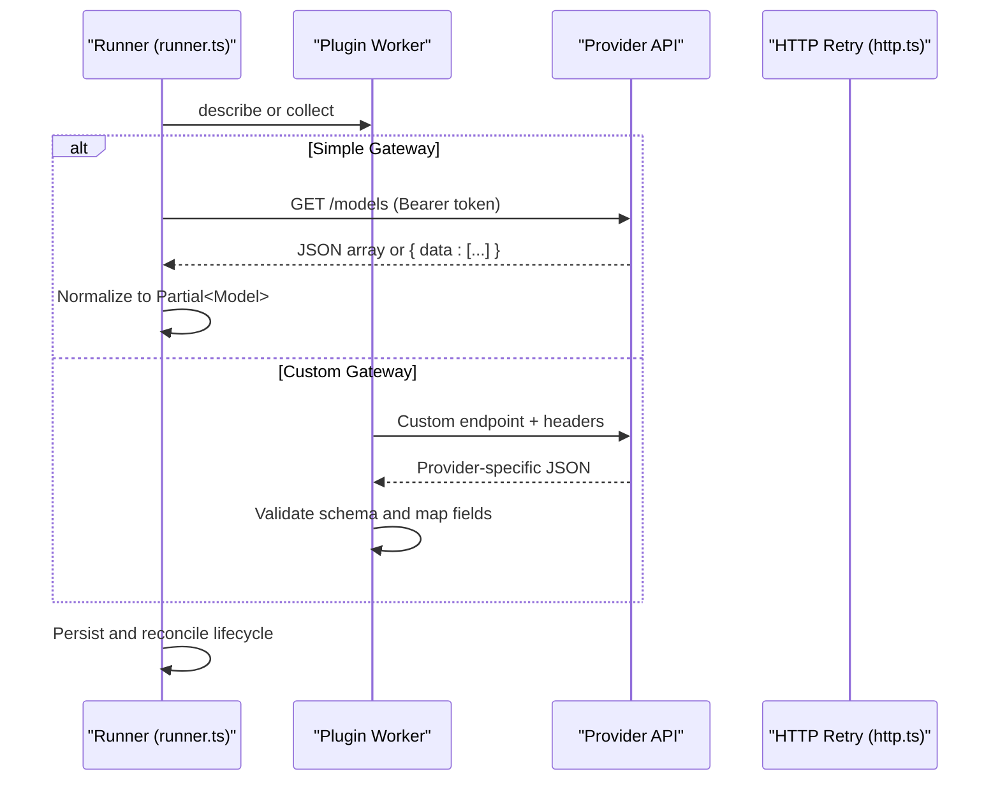
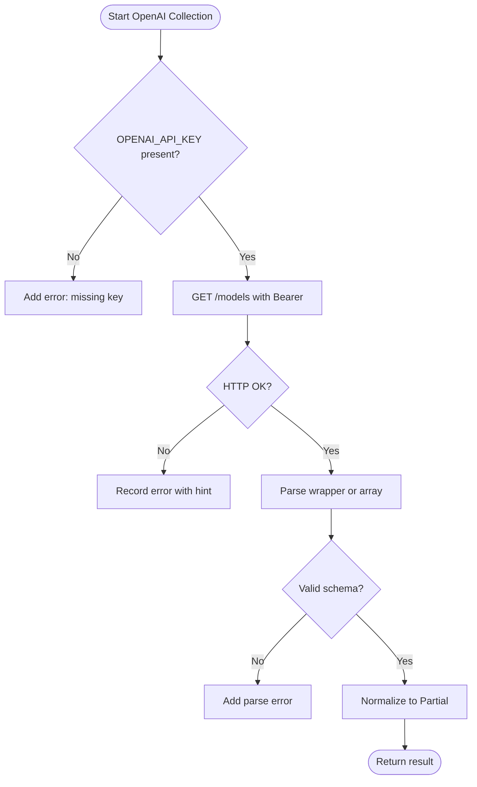
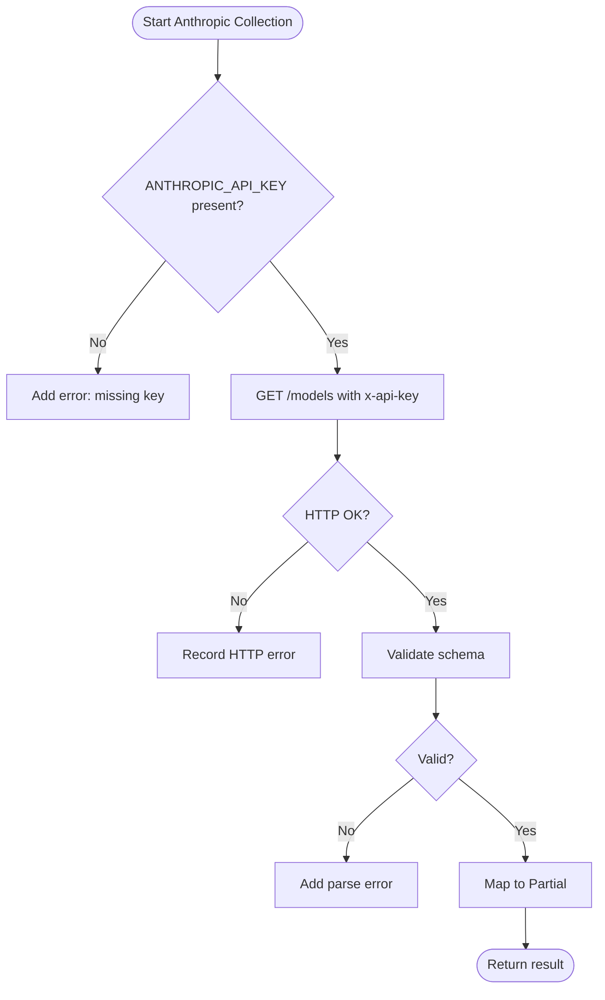
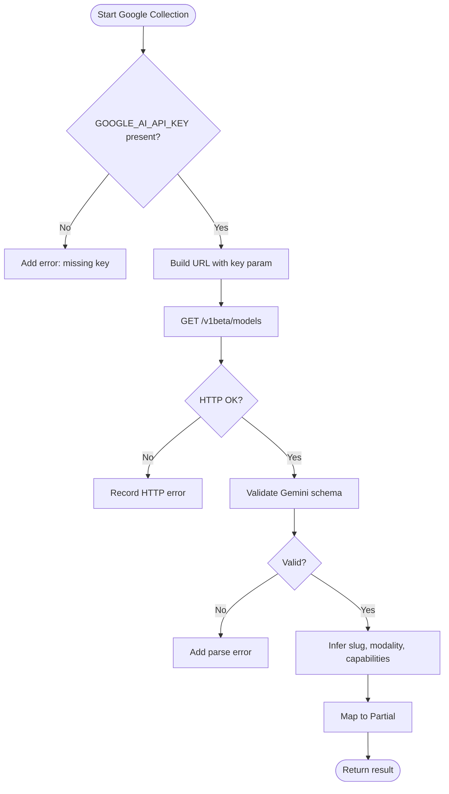
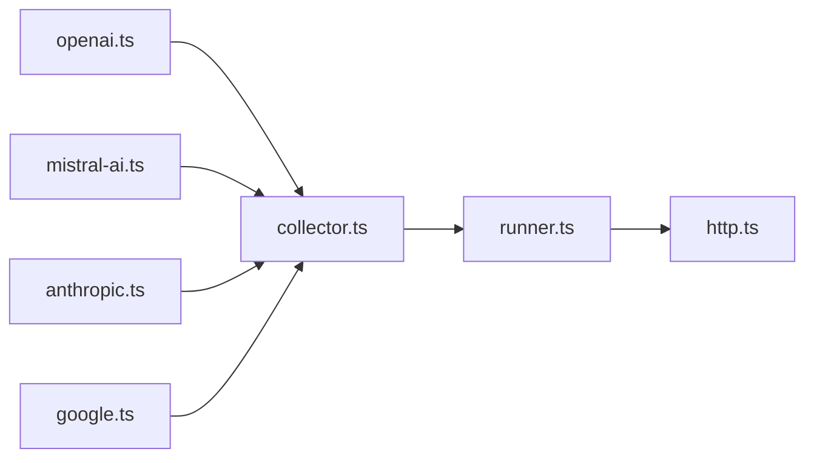

# Provider-Specific Gateways

<cite>
**Referenced Files in This Document**
- [openai.ts](file://packages/collectors/src/gateways/openai.ts)
- [anthropic.ts](file://packages/collectors/src/gateways/anthropic.ts)
- [google.ts](file://packages/collectors/src/gateways/google.ts)
- [mistral-ai.ts](file://packages/collectors/src/gateways/mistral-ai.ts)
- [collector.ts](file://packages/collectors/src/core/collector.ts)
- [runner.ts](file://packages/collectors/src/core/runner.ts)
- [http.ts](file://packages/collectors/src/core/http.ts)
</cite>

## Table of Contents
1. [Introduction](#introduction)
2. [Project Structure](#project-structure)
3. [Core Components](#core-components)
4. [Architecture Overview](#architecture-overview)
5. [Detailed Component Analysis](#detailed-component-analysis)
6. [Dependency Analysis](#dependency-analysis)
7. [Performance Considerations](#performance-considerations)
8. [Troubleshooting Guide](#troubleshooting-guide)
9. [Conclusion](#conclusion)

## Introduction
This document explains the provider-specific gateway implementations for OpenAI, Anthropic, Google, and Mistral AI within the collectors package. It covers how each gateway authenticates, which API endpoints are used, how responses are transformed into a normalized model catalog, and how rate limiting and errors are handled by the system. Configuration examples and troubleshooting guidance are included to help integrate and operate these gateways reliably.

## Project Structure
The provider gateways live under packages/collectors/src/gateways/. Two patterns are used:
- Simple (OpenAI-compatible) gateways that rely on a shared runner to call /models with Bearer token auth.
- Custom gateways that implement their own collect() logic, including custom headers and response parsing.

**Diagram sources**
- [openai.ts](file://packages/collectors/src/gateways/openai.ts)
- [anthropic.ts](file://packages/collectors/src/gateways/anthropic.ts)
- [google.ts](file://packages/collectors/src/gateways/google.ts)
- [mistral-ai.ts](file://packages/collectors/src/gateways/mistral-ai.ts)
- [collector.ts](file://packages/collectors/src/core/collector.ts)
- [runner.ts](file://packages/collectors/src/core/runner.ts)
- [http.ts](file://packages/collectors/src/core/http.ts)

**Section sources**
- [openai.ts](file://packages/collectors/src/gateways/openai.ts)
- [anthropic.ts](file://packages/collectors/src/gateways/anthropic.ts)
- [google.ts](file://packages/collectors/src/gateways/google.ts)
- [mistral-ai.ts](file://packages/collectors/src/gateways/mistral-ai.ts)
- [collector.ts](file://packages/collectors/src/core/collector.ts)
- [runner.ts](file://packages/collectors/src/core/runner.ts)
- [http.ts](file://packages/collectors/src/core/http.ts)

## Core Components
- SimpleGateway: Declarative metadata for OpenAI-compatible providers (id, baseUrl, secretKeyName, optional pricingSource). The runner fetches /models and normalizes results.
- CustomGateway: Full control over collection logic, including authentication headers, request shaping, and response parsing.
- CollectionResult: Standardized output shape containing provider_id, models array, and errors list.
- HTTP helpers: Retries transient statuses (e.g., 429, 5xx) with backoff and per-attempt timeouts.

Key responsibilities:
- Authentication: Bearer tokens for simple gateways; custom headers for custom gateways.
- Endpoint discovery: /models for OpenAI-compatible; provider-specific listing endpoints for custom gateways.
- Response normalization: Map provider fields to canonical model attributes (model_id, provider_id, name, capabilities).
- Error handling: Collect actionable error messages and continue execution without failing the entire run.

**Section sources**
- [collector.ts](file://packages/collectors/src/core/collector.ts)
- [runner.ts](file://packages/collectors/src/core/runner.ts)
- [http.ts](file://packages/collectors/src/core/http.ts)

## Architecture Overview
The runner orchestrates gateway plugins via isolated workers. For simple gateways, it calls the provider’s /models endpoint using Bearer auth. For custom gateways, it executes the plugin’s collect() function with only approved secrets. Responses are validated and normalized into Partial<Model> records, then persisted and reconciled.

**Diagram sources**
- [runner.ts](file://packages/collectors/src/core/runner.ts)
- [http.ts](file://packages/collectors/src/core/http.ts)
- [collector.ts](file://packages/collectors/src/core/collector.ts)

## Detailed Component Analysis

### OpenAI Gateway
- Type: Simple (OpenAI-compatible)
- Authentication: Bearer token from OPENAI_API_KEY
- Endpoint: https://api.openai.com/v1/models
- Response transformation:
  - Accepts both bare arrays and { data: [...] } wrappers
  - Normalizes id to model_id, infers capabilities from id classification
  - Sets status active, open_weight false, and capability flags based on inference
- Rate limiting: Handled centrally by retry helper with exponential backoff for transient statuses
- Errors: Non-retryable HTTP codes produce actionable hints; parse failures recorded in errors

Configuration example:
- Set environment secret OPENAI_API_KEY with a valid key.
- Ensure the gateway file declares type openai-compatible, id openai, baseUrl https://api.openai.com/v1, and secretKeyName OPENAI_API_KEY.

**Diagram sources**
- [runner.ts](file://packages/collectors/src/core/runner.ts)
- [openai.ts](file://packages/collectors/src/gateways/openai.ts)
- [http.ts](file://packages/collectors/src/core/http.ts)

**Section sources**
- [openai.ts](file://packages/collectors/src/gateways/openai.ts)
- [runner.ts](file://packages/collectors/src/core/runner.ts)
- [http.ts](file://packages/collectors/src/core/http.ts)

### Anthropic Gateway
- Type: Custom
- Authentication: x-api-key header with ANTHROPIC_API_KEY; anthropic-version set to a specific date
- Endpoint: https://api.anthropic.com/v1/models
- Response transformation:
  - Validates against a Zod schema expecting { data: [{ id, display_name?, created_at? }] }
  - Maps to model_id anthropic/{id}, name display_name or id, release_date from created_at
  - Flags modality text-only and capability booleans default to false
- Rate limiting: Uses standard retry helper for transient statuses
- Errors: Missing key returns an explicit error message; parse failures captured

Configuration example:
- Set environment secret ANTHROPIC_API_KEY.
- The custom gateway handles all request/response details internally.

**Diagram sources**
- [anthropic.ts](file://packages/collectors/src/gateways/anthropic.ts)
- [http.ts](file://packages/collectors/src/core/http.ts)

**Section sources**
- [anthropic.ts](file://packages/collectors/src/gateways/anthropic.ts)
- [http.ts](file://packages/collectors/src/core/http.ts)

### Google Gateway
- Type: Custom
- Authentication: Query parameter key=GOOGLE_AI_API_KEY; client header x-goog-api-client
- Endpoint: https://generativelanguage.googleapis.com/v1beta/models?key=...
- Response transformation:
  - Validates against Gemini list schema with optional fields like displayName, description, inputTokenLimit, outputTokenLimit, supportedGenerationMethods, version
  - Derives slug from model name and sets model_id google/{slug}
  - Infers modality and capabilities:
    - Image models include image generation
    - Embedding models support embeddings
    - Gemini models may support text/image/audio/video depending on name/methods
    - Function calling and structured output inferred from generateContent method presence
- Rate limiting: Uses standard retry helper; includes timeout signal
- Errors: Missing key returns explicit error; parse failures captured

Configuration example:
- Set environment secret GOOGLE_AI_API_KEY.
- The custom gateway constructs URL and headers, then maps fields to canonical model attributes.

**Diagram sources**
- [google.ts](file://packages/collectors/src/gateways/google.ts)
- [http.ts](file://packages/collectors/src/core/http.ts)

**Section sources**
- [google.ts](file://packages/collectors/src/gateways/google.ts)
- [http.ts](file://packages/collectors/src/core/http.ts)

### Mistral AI Gateway
- Type: Simple (OpenAI-compatible)
- Authentication: Bearer token from MISTRAL_API_KEY
- Endpoint: https://api.mistral.ai/v1/models
- Response transformation: Same as OpenAI-compatible flow (wrapper or bare array), normalized to Partial<Model> with capability inference
- Rate limiting: Handled centrally by retry helper
- Errors: Non-retryable HTTP codes produce actionable hints; parse failures recorded

Configuration example:
- Set environment secret MISTRAL_API_KEY.
- The gateway file declares type openai-compatible, id mistral-ai, baseUrl https://api.mistral.ai/v1, and secretKeyName MISTRAL_API_KEY.

**Diagram sources**
- [runner.ts](file://packages/collectors/src/core/runner.ts)
- [mistral-ai.ts](file://packages/collectors/src/gateways/mistral-ai.ts)
- [http.ts](file://packages/collectors/src/core/http.ts)

**Section sources**
- [mistral-ai.ts](file://packages/collectors/src/gateways/mistral-ai.ts)
- [runner.ts](file://packages/collectors/src/core/runner.ts)
- [http.ts](file://packages/collectors/src/core/http.ts)

## Dependency Analysis
- Gateways depend on core types for consistent shapes and behaviors.
- Simple gateways rely on the runner to perform HTTP requests, retries, and normalization.
- Custom gateways encapsulate provider-specific logic but still benefit from centralized retry utilities when needed.
- The runner enforces security by whitelisting allowed secrets per gateway and isolating execution in worker processes.

**Diagram sources**
- [openai.ts](file://packages/collectors/src/gateways/openai.ts)
- [mistral-ai.ts](file://packages/collectors/src/gateways/mistral-ai.ts)
- [anthropic.ts](file://packages/collectors/src/gateways/anthropic.ts)
- [google.ts](file://packages/collectors/src/gateways/google.ts)
- [collector.ts](file://packages/collectors/src/core/collector.ts)
- [runner.ts](file://packages/collectors/src/core/runner.ts)
- [http.ts](file://packages/collectors/src/core/http.ts)

**Section sources**
- [collector.ts](file://packages/collectors/src/core/collector.ts)
- [runner.ts](file://packages/collectors/src/core/runner.ts)
- [http.ts](file://packages/collectors/src/core/http.ts)

## Performance Considerations
- Use SimpleGateway where possible to leverage shared normalization and reduce duplication.
- Keep custom gateways focused and efficient; avoid heavy transformations inside collect().
- Centralized retry with exponential backoff reduces transient failures impact.
- Timeouts per attempt prevent long-running hangs; tune timeoutMs if upstream APIs vary.
- Avoid large payloads; enforce MAX_PLUGIN_RESPONSE_BYTES at runtime to protect memory.

[No sources needed since this section provides general guidance]

## Troubleshooting Guide
Common issues and resolutions:
- Missing API key:
  - OpenAI/Mistral: Ensure OPENAI_API_KEY or MISTRAL_API_KEY is set.
  - Anthropic: Ensure ANTHROPIC_API_KEY is set.
  - Google: Ensure GOOGLE_AI_API_KEY is set.
- Unauthorized or forbidden:
  - Check key validity and permissions to list models.
  - Verify base URLs and paths match provider expectations.
- Rate limited:
  - System retries transient 429 with backoff; persistent limits require throttling your runs or upgrading quotas.
- Parse failures:
  - Upstream schema changes can break validation; update Zod schemas accordingly.
- Outages:
  - Non-retryable HTTP errors are recorded; monitor logs and retry later.

Operational tips:
- Inspect errors array in CollectionResult for actionable messages.
- Confirm environment variables are passed to the isolated worker process.
- Use descriptive logging around gateway runs to track success/failure counts.

**Section sources**
- [runner.ts](file://packages/collectors/src/core/runner.ts)
- [anthropic.ts](file://packages/collectors/src/gateways/anthropic.ts)
- [google.ts](file://packages/collectors/src/gateways/google.ts)
- [openai.ts](file://packages/collectors/src/gateways/openai.ts)
- [mistral-ai.ts](file://packages/collectors/src/gateways/mistral-ai.ts)
- [http.ts](file://packages/collectors/src/core/http.ts)

## Conclusion
The provider-specific gateways combine declarative configuration for OpenAI-compatible endpoints with flexible custom implementations for providers with unique authentication and response formats. Centralized retry, validation, and normalization ensure robust operation across providers. By following the configuration and troubleshooting guidance, integrators can reliably maintain an up-to-date model registry across OpenAI, Anthropic, Google, and Mistral AI.

[No sources needed since this section summarizes without analyzing specific files]