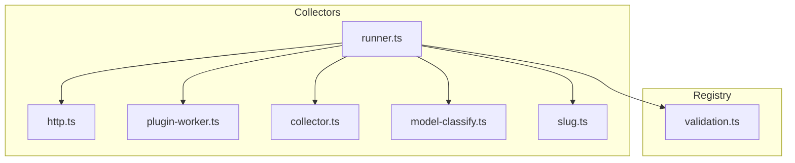
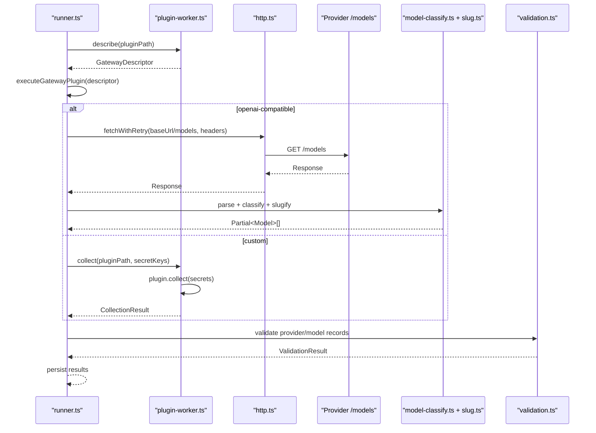
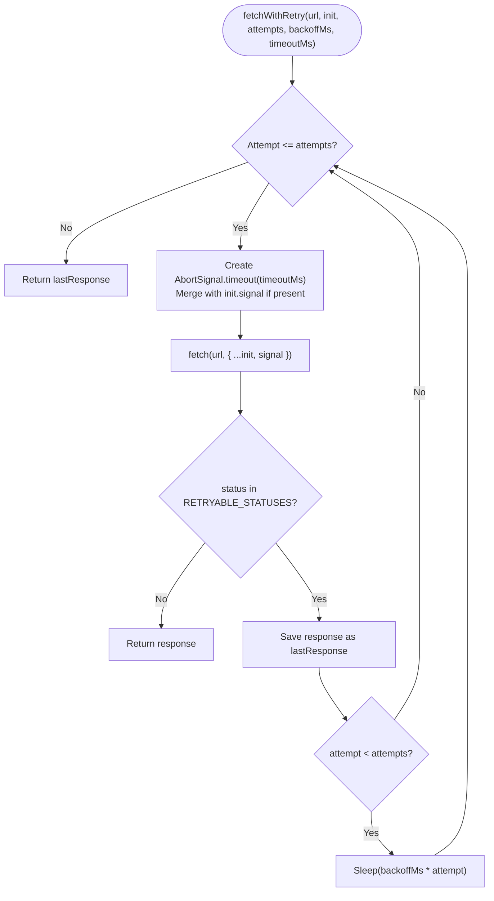
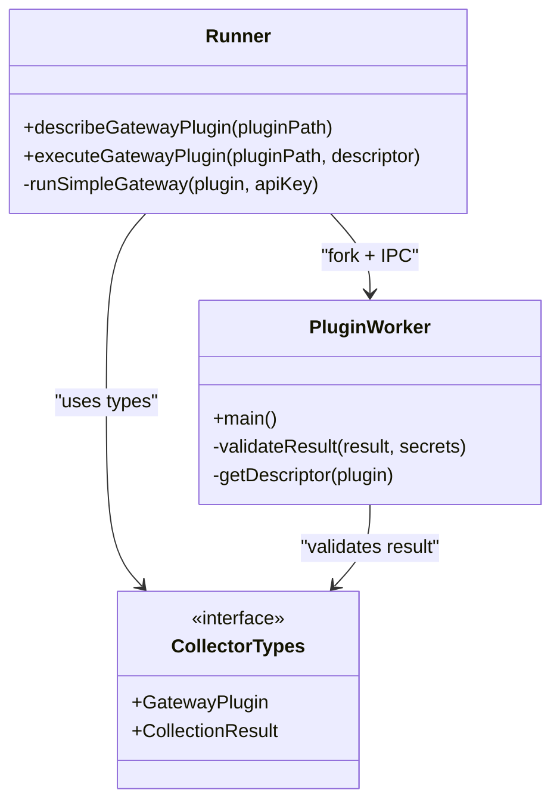
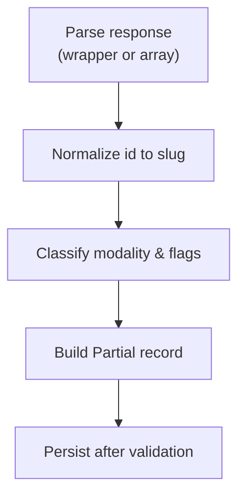
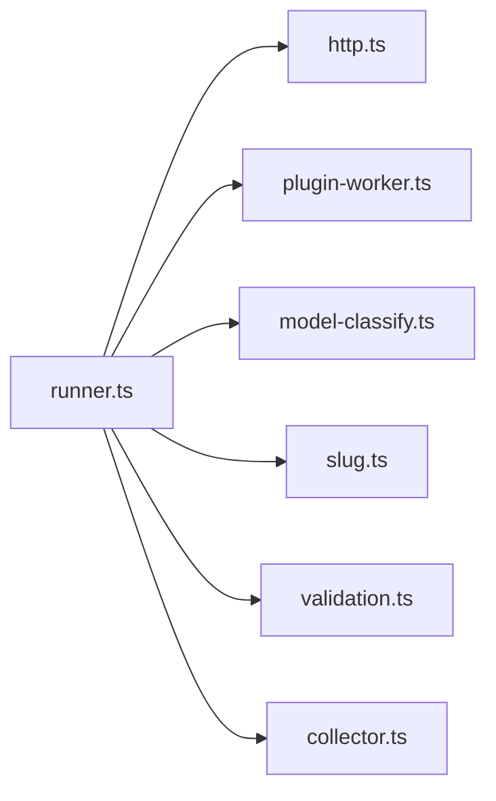

# Request & Response Processing

<cite>
**Referenced Files in This Document**
- [README.md](file://README.md)
- [http.ts](file://packages/collectors/src/core/http.ts)
- [collector.ts](file://packages/collectors/src/core/collector.ts)
- [runner.ts](file://packages/collectors/src/core/runner.ts)
- [plugin-worker.ts](file://packages/collectors/src/core/plugin-worker.ts)
- [model-classify.ts](file://packages/collectors/src/core/model-classify.ts)
- [slug.ts](file://packages/collectors/src/core/slug.ts)
- [validation.ts](file://packages/registry/src/validation.ts)
- [runner.test.ts](file://packages/collectors/src/__tests__/runner.test.ts)
</cite>

## Table of Contents
1. Introduction
2. Project Structure
3. Core Components
4. Architecture Overview
5. Detailed Component Analysis
6. Dependency Analysis
7. Performance Considerations
8. Troubleshooting Guide
9. Conclusion

## Introduction
This document explains the request and response processing pipeline used by the collectors to discover, validate, normalize, and persist model metadata from upstream AI providers and gateways. It covers HTTP client configuration, request transformation, response normalization, error mapping, retry mechanisms, timeout handling, rate limiting behavior, and validation strategies. It also provides guidance for custom interceptors, validators, and debugging techniques when diagnosing API communication issues.

## Project Structure
The relevant implementation lives primarily in the collectors package with supporting utilities in the registry package:
- Collectors core: HTTP helpers, gateway execution, plugin isolation, model classification, and slug normalization
- Registry validation: Zod-based schema validation helpers used across the system

**Diagram sources**
- [runner.ts](file://packages/collectors/src/core/runner.ts)
- [http.ts](file://packages/collectors/src/core/http.ts)
- [plugin-worker.ts](file://packages/collectors/src/core/plugin-worker.ts)
- [collector.ts](file://packages/collectors/src/core/collector.ts)
- [model-classify.ts](file://packages/collectors/src/core/model-classify.ts)
- [slug.ts](file://packages/collectors/src/core/slug.ts)
- [validation.ts](file://packages/registry/src/validation.ts)

**Section sources**
- [README.md](file://README.md)

## Core Components
- HTTP client with retries and timeouts: Centralized fetch wrapper that applies exponential backoff on transient statuses and per-attempt timeouts via AbortSignal.
- Gateway orchestration: Loads and executes plugins either as OpenAI-compatible endpoints or isolated custom workers; normalizes responses into a common shape.
- Plugin isolation and security: Worker process enforces size limits, validates result shapes, and redacts secrets in errors.
- Response normalization: Canonicalizes model IDs and infers capabilities (modality, vision, reasoning, audio, image generation).
- Validation: Uses Zod schemas to ensure data integrity before persistence.

**Section sources**
- [http.ts](file://packages/collectors/src/core/http.ts)
- [runner.ts](file://packages/collectors/src/core/runner.ts)
- [plugin-worker.ts](file://packages/collectors/src/core/plugin-worker.ts)
- [collector.ts](file://packages/collectors/src/core/collector.ts)
- [model-classify.ts](file://packages/collectors/src/core/model-classify.ts)
- [slug.ts](file://packages/collectors/src/core/slug.ts)
- [validation.ts](file://packages/registry/src/validation.ts)

## Architecture Overview
The pipeline orchestrates discovery through two plugin modes:
- OpenAI-compatible mode: Calls /models endpoint with optional Authorization header, parses both wrapped and bare array responses, and normalizes each entry.
- Custom mode: Executes user-provided collect() inside an isolated child process with only approved secrets.

**Diagram sources**
- [runner.ts](file://packages/collectors/src/core/runner.ts)
- [plugin-worker.ts](file://packages/collectors/src/core/plugin-worker.ts)
- [http.ts](file://packages/collectors/src/core/http.ts)
- [model-classify.ts](file://packages/collectors/src/core/model-classify.ts)
- [slug.ts](file://packages/collectors/src/core/slug.ts)
- [validation.ts](file://packages/registry/src/validation.ts)

## Detailed Component Analysis

### HTTP Client: Retry, Timeout, and Backoff
- Retries are applied only to transient statuses (e.g., 408, 429, 5xx), using linear backoff between attempts.
- Each attempt gets a fresh AbortSignal combining any caller-provided signal with a per-request timeout.
- Non-retryable statuses are returned immediately without retry.

**Diagram sources**
- [http.ts](file://packages/collectors/src/core/http.ts)

**Section sources**
- [http.ts](file://packages/collectors/src/core/http.ts)

### Gateway Orchestration and Execution
- Describes plugin metadata in an isolated worker without exposing secrets.
- For OpenAI-compatible gateways, builds headers (including optional Authorization), calls /models, and handles non-ok responses with actionable hints.
- For custom gateways, runs collect() with only approved secrets and validates the result shape and size.

**Diagram sources**
- [runner.ts](file://packages/collectors/src/core/runner.ts)
- [plugin-worker.ts](file://packages/collectors/src/core/plugin-worker.ts)
- [collector.ts](file://packages/collectors/src/core/collector.ts)

**Section sources**
- [runner.ts](file://packages/collectors/src/core/runner.ts)
- [plugin-worker.ts](file://packages/collectors/src/core/plugin-worker.ts)
- [collector.ts](file://packages/collectors/src/core/collector.ts)

### Response Normalization and Classification
- Accepts both OpenAI-style wrapper and bare array responses from /models.
- Normalizes model IDs to safe slugs and constructs canonical model_id values per provider.
- Infers modality and capability flags based on model id heuristics (embedding, ASR/TTS, image generation/tools, video, code, vision, reasoning).

**Diagram sources**
- [runner.ts](file://packages/collectors/src/core/runner.ts)
- [slug.ts](file://packages/collectors/src/core/slug.ts)
- [model-classify.ts](file://packages/collectors/src/core/model-classify.ts)

**Section sources**
- [runner.ts](file://packages/collectors/src/core/runner.ts)
- [slug.ts](file://packages/collectors/src/core/slug.ts)
- [model-classify.ts](file://packages/collectors/src/core/model-classify.ts)

### Error Mapping and Hints
- Maps specific HTTP status codes to human-readable hints (e.g., 401 Unauthorized, 403 Forbidden, 404 Not Found, 412 Precondition Failed, 429 Rate Limited).
- Captures a short JSON body snippet for diagnostics while avoiding secret leakage.
- Non-retryable failures are surfaced as actionable errors in the collection result.

**Section sources**
- [runner.ts](file://packages/collectors/src/core/runner.ts)

### Validation Strategy
- Uses Zod schemas to validate provider and model records before saving.
- Provides helper functions to validate single records and batches, returning structured errors without throwing.

**Section sources**
- [validation.ts](file://packages/registry/src/validation.ts)
- [runner.ts](file://packages/collectors/src/core/runner.ts)

### Security and Isolation
- Plugins run in isolated child processes with a minimal environment containing only runtime keys and explicitly approved secrets.
- Result validation enforces maximum model count, payload size, and ensures no configured secrets leak into serialized output.
- Errors are redacted to prevent secret exposure.

**Section sources**
- [runner.ts](file://packages/collectors/src/core/runner.ts)
- [plugin-worker.ts](file://packages/collectors/src/core/plugin-worker.ts)

## Dependency Analysis
The runner orchestrates multiple modules and depends on registry utilities for validation and persistence. The HTTP layer is centralized to ensure consistent retry and timeout behavior.

**Diagram sources**
- [runner.ts](file://packages/collectors/src/core/runner.ts)
- [http.ts](file://packages/collectors/src/core/http.ts)
- [plugin-worker.ts](file://packages/collectors/src/core/plugin-worker.ts)
- [model-classify.ts](file://packages/collectors/src/core/model-classify.ts)
- [slug.ts](file://packages/collectors/src/core/slug.ts)
- [validation.ts](file://packages/registry/src/validation.ts)
- [collector.ts](file://packages/collectors/src/core/collector.ts)

**Section sources**
- [runner.ts](file://packages/collectors/src/core/runner.ts)

## Performance Considerations
- Retries use linear backoff; consider adding jitter for high concurrency scenarios.
- Per-attempt timeouts prevent long-hanging requests; tune timeoutMs and attempts based on upstream SLAs.
- No built-in rate limiter beyond retries; implement application-level throttling if upstream requires it.
- Avoid caching at the collector level unless you can guarantee freshness and avoid stale data; consider TTL-based cache if needed.
- Keep plugin payloads small; enforced limits protect memory and IPC overhead.

[No sources needed since this section provides general guidance]

## Troubleshooting Guide
Common issues and how to diagnose them:
- Authentication failures (401/403): Ensure the correct API key is set and has required permissions; check hints included in error messages.
- Rate limiting (429): Retries are automatic; verify upstream quotas and adjust backoff or reduce concurrency.
- Network timeouts: Increase timeoutMs or investigate network latency; confirm DNS and proxy settings.
- Invalid responses: Inspect parsed errors and ensure the upstream conforms to expected shapes; add logging around parsing steps.
- Secret leaks: Verify that plugin outputs do not include secrets; the worker will reject such outputs.

Useful testing patterns:
- Mock fetch to simulate 429 followed by success to validate retry behavior.
- Assert that each retry uses a distinct AbortSignal to avoid signal poisoning.
- Validate that non-retryable errors surface actionable hints.

**Section sources**
- [runner.test.ts](file://packages/collectors/src/__tests__/runner.test.ts)
- [runner.ts](file://packages/collectors/src/core/runner.ts)
- [http.ts](file://packages/collectors/src/core/http.ts)

## Conclusion
The collectors implement a robust, secure, and extensible pipeline for discovering and normalizing model metadata from diverse providers. Centralized HTTP handling ensures resilience against transient failures, while isolated plugin execution and strict validation safeguard correctness and security. By following the patterns outlined here—retries with backoff, per-attempt timeouts, normalized responses, and clear error mapping—you can extend the system with custom interceptors, validators, and debugging aids tailored to your needs.