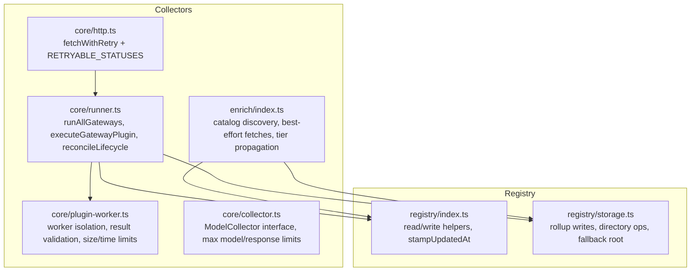
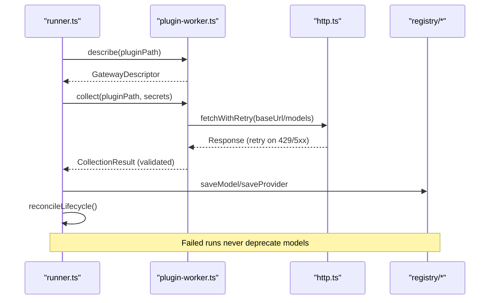
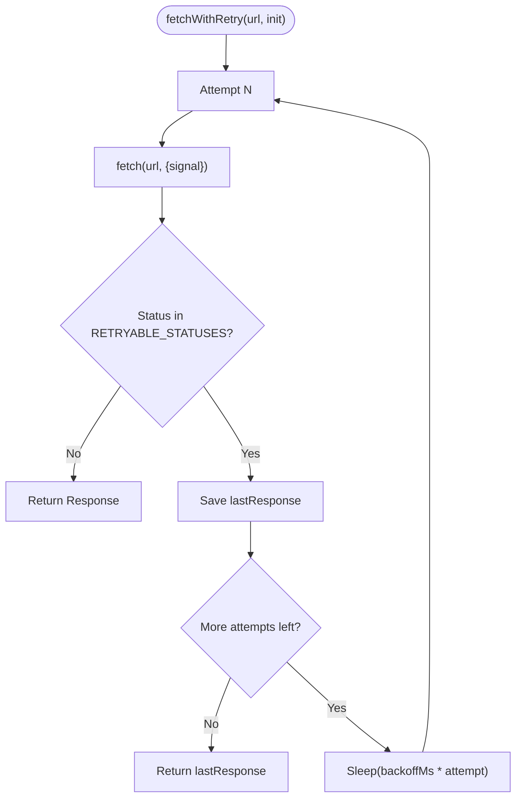
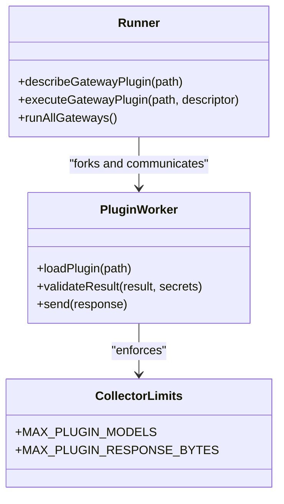
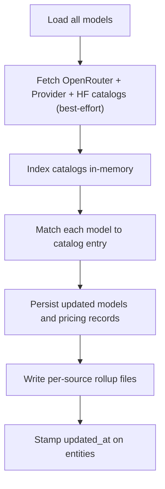
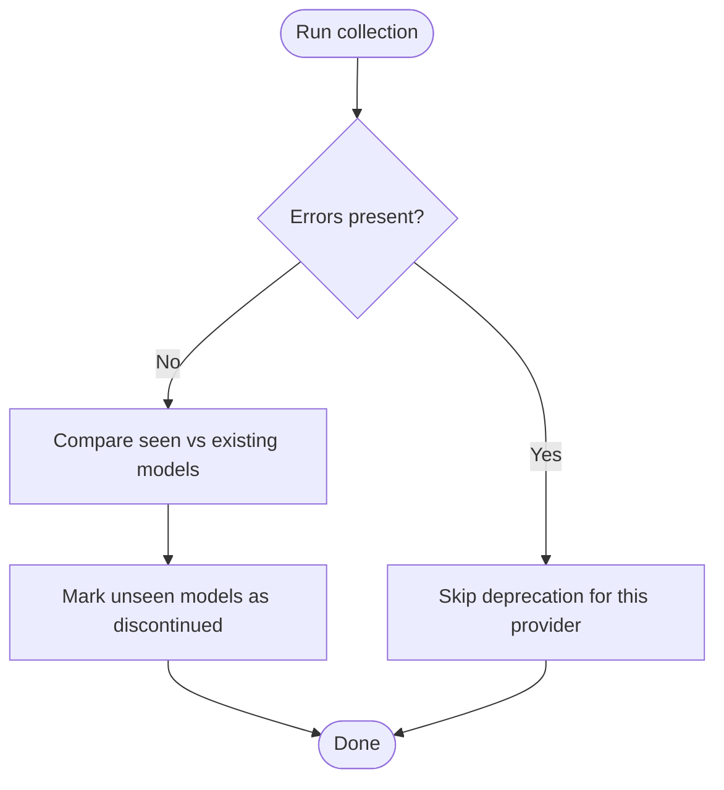
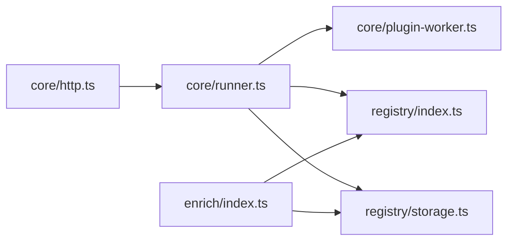

# Rate Limiting & Caching Mechanisms

<cite>
**Referenced Files in This Document**
- [http.ts](file://packages/collectors/src/core/http.ts)
- [runner.ts](file://packages/collectors/src/core/runner.ts)
- [plugin-worker.ts](file://packages/collectors/src/core/plugin-worker.ts)
- [collector.ts](file://packages/collectors/src/core/collector.ts)
- [enrich/index.ts](file://packages/collectors/src/enrich/index.ts)
- [registry/index.ts](file://packages/registry/src/index.ts)
- [registry/storage.ts](file://packages/registry/src/storage.ts)
</cite>

## Table of Contents
1. Introduction
2. Project Structure
3. Core Components
4. Architecture Overview
5. Detailed Component Analysis
6. Dependency Analysis
7. Performance Considerations
8. Troubleshooting Guide
9. Conclusion

## Introduction
This document explains how the project’s collectors and enrichment pipeline handle rate limiting and caching to optimize performance and prevent API abuse. It covers:
- Retry-based resilience with backoff for transient errors (including 429 Too Many Requests)
- Global and per-provider limits enforced by process isolation, timeouts, and response size caps
- Best-effort catalog fetching and registry rollup strategies that act as a form of persistence-backed cache
- Guidance for implementing custom cache backends and monitoring hit rates where applicable

The goal is to make these mechanisms understandable for both developers and operators while providing concrete references to the codebase.

## Project Structure
The relevant implementation spans two packages:
- Collectors: HTTP retry/backoff, plugin execution isolation, and lifecycle reconciliation
- Registry: File-based storage with rollup writes and stamping for freshness

**Diagram sources**
- [http.ts:1-38](file://packages/collectors/src/core/http.ts#L1-L38)
- [runner.ts:1-475](file://packages/collectors/src/core/runner.ts#L1-L475)
- [plugin-worker.ts:1-113](file://packages/collectors/src/core/plugin-worker.ts#L1-L113)
- [collector.ts:1-89](file://packages/collectors/src/core/collector.ts#L1-L89)
- [enrich/index.ts:1-516](file://packages/collectors/src/enrich/index.ts#L1-L516)
- [registry/index.ts:1-124](file://packages/registry/src/index.ts#L1-L124)
- [registry/storage.ts:1-163](file://packages/registry/src/storage.ts#L1-L163)

**Section sources**
- [http.ts:1-38](file://packages/collectors/src/core/http.ts#L1-L38)
- [runner.ts:1-475](file://packages/collectors/src/core/runner.ts#L1-L475)
- [plugin-worker.ts:1-113](file://packages/collectors/src/core/plugin-worker.ts#L1-L113)
- [collector.ts:1-89](file://packages/collectors/src/core/collector.ts#L1-L89)
- [enrich/index.ts:1-516](file://packages/collectors/src/enrich/index.ts#L1-L516)
- [registry/index.ts:1-124](file://packages/registry/src/index.ts#L1-L124)
- [registry/storage.ts:1-163](file://packages/registry/src/storage.ts#L1-L163)

## Core Components
- Retry and backoff: A shared HTTP helper retries transient statuses with exponential-ish backoff and per-attempt timeouts.
- Plugin isolation: Custom plugins run in child processes with strict environment scoping, timeouts, and payload size limits.
- Lifecycle reconciliation: Models not seen in a successful collection are marked discontinued; failures do not deprecate models.
- Enrichment catalogs: Best-effort fetching of pricing catalogs from multiple sources with index-based matching and tier propagation.
- Registry rollups: Atomic per-source rollup writes preserve previous data when a source fails or is skipped.

**Section sources**
- [http.ts:1-38](file://packages/collectors/src/core/http.ts#L1-L38)
- [runner.ts:167-238](file://packages/collectors/src/core/runner.ts#L167-L238)
- [plugin-worker.ts:32-46](file://packages/collectors/src/core/plugin-worker.ts#L32-L46)
- [enrich/index.ts:272-516](file://packages/collectors/src/enrich/index.ts#L272-L516)
- [registry/storage.ts:126-163](file://packages/registry/src/storage.ts#L126-L163)

## Architecture Overview
The collector pipeline orchestrates gateway plugins, applies resilient HTTP calls, persists results, and reconciles lifecycle states. The enrichment step augments models with pricing and tiers using best-effort external catalogs.

**Diagram sources**
- [runner.ts:157-238](file://packages/collectors/src/core/runner.ts#L157-L238)
- [plugin-worker.ts:87-106](file://packages/collectors/src/core/plugin-worker.ts#L87-L106)
- [http.ts:17-37](file://packages/collectors/src/core/http.ts#L17-L37)
- [registry/index.ts:1-124](file://packages/registry/src/index.ts#L1-L124)

## Detailed Component Analysis

### Retry-Based Rate Limiting (Per-Request Backoff)
- Transient status handling: Retries on specific HTTP codes including 429.
- Backoff strategy: Linear-incremental delay between attempts.
- Timeout safety: Each attempt gets a fresh timeout signal to avoid cross-attempt poisoning.

**Diagram sources**
- [http.ts:17-37](file://packages/collectors/src/core/http.ts#L17-L37)

**Section sources**
- [http.ts:1-38](file://packages/collectors/src/core/http.ts#L1-L38)

### Plugin Isolation and Global Limits
- Process isolation: Plugins run via child_process.fork with a minimal, approved environment.
- Timeouts: Hard limit per plugin worker prevents runaway executions.
- Payload limits: Max model count and serialized response size enforced.
- Secret redaction: Errors are sanitized to avoid leaking secrets.

**Diagram sources**
- [runner.ts:113-154](file://packages/collectors/src/core/runner.ts#L113-L154)
- [plugin-worker.ts:32-46](file://packages/collectors/src/core/plugin-worker.ts#L32-L46)
- [collector.ts:9-10](file://packages/collectors/src/core/collector.ts#L9-L10)

**Section sources**
- [runner.ts:69-154](file://packages/collectors/src/core/runner.ts#L69-L154)
- [plugin-worker.ts:32-46](file://packages/collectors/src/core/plugin-worker.ts#L32-L46)
- [collector.ts:9-10](file://packages/collectors/src/core/collector.ts#L9-L10)

### Per-Provider Quotas and Adaptive Throttling
- Current behavior: No explicit per-provider quota counters are implemented. Resilience relies on retry/backoff and process isolation.
- Recommended adaptive throttling: Introduce per-provider token buckets or sliding windows around fetch calls to slow down when upstream returns 429 repeatedly.
- Suggested integration points:
  - Wrap fetchWithRetry usage in runner.ts with a per-provider limiter
  - Track recent 429 counts per provider and adjust backoff or pause new requests

[No sources needed since this section proposes future enhancements]

### Caching Layers and Persistence
- Catalog caching: Enrichment fetches external catalogs best-effort and indexes them in memory for fast matching.
- Registry rollup cache: Benchmarks and pricing are persisted as per-source rollup files; failed sources do not erase prior data.
- Freshness stamping: Entities can be stamped with updated_at timestamps for consumers to detect staleness.

**Diagram sources**
- [enrich/index.ts:272-516](file://packages/collectors/src/enrich/index.ts#L272-L516)
- [registry/storage.ts:126-163](file://packages/registry/src/storage.ts#L126-L163)
- [registry/index.ts:34-41](file://packages/registry/src/index.ts#L34-L41)

**Section sources**
- [enrich/index.ts:272-516](file://packages/collectors/src/enrich/index.ts#L272-L516)
- [registry/storage.ts:126-163](file://packages/registry/src/storage.ts#L126-L163)
- [registry/index.ts:34-41](file://packages/registry/src/index.ts#L34-L41)

### Cache Invalidation Strategies
- Rollup merge semantics: Only refreshed sources overwrite their rollup files; untouched sources keep previous data.
- Lifecycle reconciliation: Successful collections mark missing models as discontinued; failures do not trigger deprecation.
- Pricing cleanup: Stale provider pricing files are removed if no longer enriched.

**Diagram sources**
- [runner.ts:410-426](file://packages/collectors/src/core/runner.ts#L410-L426)

**Section sources**
- [runner.ts:410-426](file://packages/collectors/src/core/runner.ts#L410-L426)
- [registry/storage.ts:126-163](file://packages/registry/src/storage.ts#L126-L163)

### Configuring Rate Limits and Custom Cache Backends
- Configure retries/backoff: Adjust default attempts, base backoff, and timeout in the HTTP helper.
- Enforce global limits: Tune MAX_PLUGIN_MODELS and MAX_PLUGIN_RESPONSE_BYTES to cap memory and serialization overhead.
- Implement custom cache backend:
  - For catalog responses: Add an in-memory or disk-backed cache keyed by URL and request headers before calling fetchWithRetry.
  - For registry reads: Optionally wrap read functions with a TTL-based cache layer.
- Monitoring cache hit rates:
  - Emit metrics for cache hits/misses per catalog endpoint
  - Track 429 rates per provider and time-to-recovery after backoff

[No sources needed since this section provides general guidance]

### Memory Management and Persistence Options
- Memory management:
  - Keep catalog indexes in memory only during enrichment runs
  - Avoid retaining large payloads; validate sizes early in workers
- Persistence options:
  - Use BASEMODEL_REGISTRY_PATH to point at a persistent volume
  - Prefer per-source rollup files to minimize git bloat and ensure atomic updates

**Section sources**
- [plugin-worker.ts:32-46](file://packages/collectors/src/core/plugin-worker.ts#L32-L46)
- [registry/storage.ts:16-39](file://packages/registry/src/storage.ts#L16-L39)

## Dependency Analysis
The following diagram shows key dependencies among components involved in rate limiting and caching.

**Diagram sources**
- [http.ts:1-38](file://packages/collectors/src/core/http.ts#L1-L38)
- [runner.ts:1-475](file://packages/collectors/src/core/runner.ts#L1-L475)
- [plugin-worker.ts:1-113](file://packages/collectors/src/core/plugin-worker.ts#L1-L113)
- [registry/index.ts:1-124](file://packages/registry/src/index.ts#L1-L124)
- [registry/storage.ts:1-163](file://packages/registry/src/storage.ts#L1-L163)
- [enrich/index.ts:1-516](file://packages/collectors/src/enrich/index.ts#L1-L516)

**Section sources**
- [runner.ts:1-475](file://packages/collectors/src/core/runner.ts#L1-L475)
- [enrich/index.ts:1-516](file://packages/collectors/src/enrich/index.ts#L1-L516)

## Performance Considerations
- Favor short-lived, idempotent operations in plugins to reduce retry costs.
- Batch registry writes where possible; rollup writes already group by source.
- Monitor 429 frequency and tune backoff parameters per provider.
- Use TTL-based caches for static metadata (e.g., capabilities, licenses) to reduce repeated reads.

[No sources needed since this section provides general guidance]

## Troubleshooting Guide
- Frequent 429 errors:
  - Verify retry configuration and consider adding per-provider throttling
  - Check upstream quotas and billing setup
- Plugin timeouts or crashes:
  - Inspect worker logs and ensure secrets are correctly scoped
  - Validate response sizes against MAX_PLUGIN_RESPONSE_BYTES
- Missing or stale data:
  - Confirm rollup writes succeeded and updated_at stamps are present
  - Ensure reconciliation ran only after error-free collections

**Section sources**
- [runner.ts:42-48](file://packages/collectors/src/core/runner.ts#L42-L48)
- [plugin-worker.ts:108-113](file://packages/collectors/src/core/plugin-worker.ts#L108-L113)
- [registry/index.ts:34-41](file://packages/registry/src/index.ts#L34-L41)

## Conclusion
The system employs robust retry/backoff, isolated plugin execution, and registry rollups to mitigate rate limits and ensure resilient data collection. While explicit per-provider quotas are not yet implemented, the architecture provides clear integration points for adaptive throttling and cache layers. Operators can enhance performance and reliability by adding targeted caching, monitoring hit rates, and tuning retry/backoff parameters per provider.