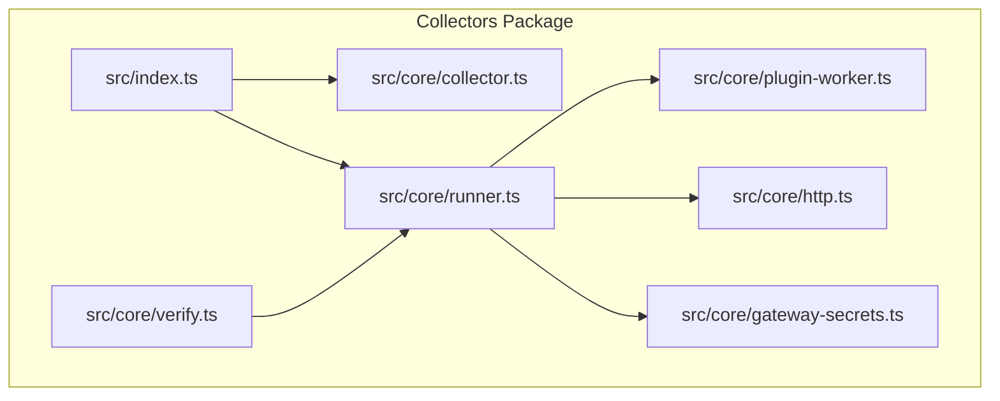
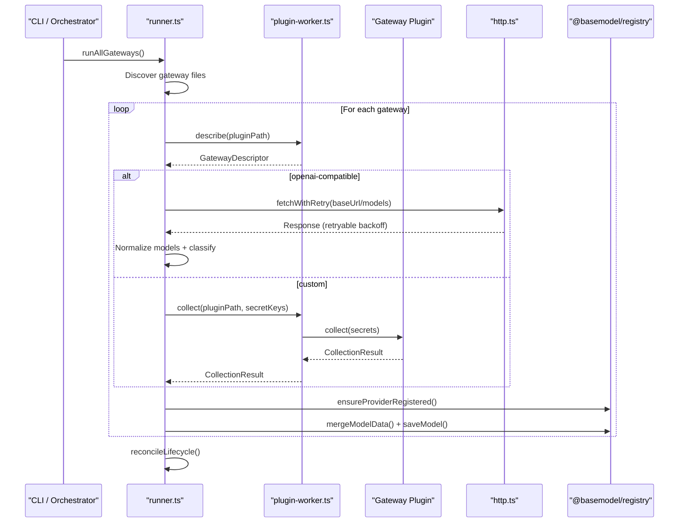
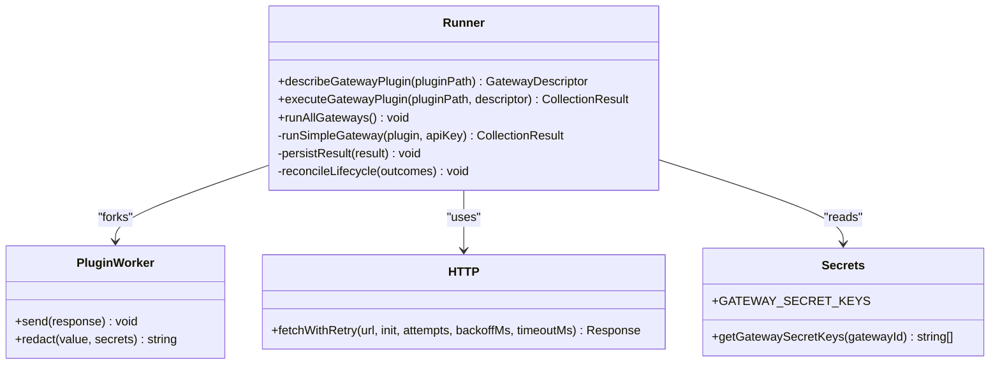
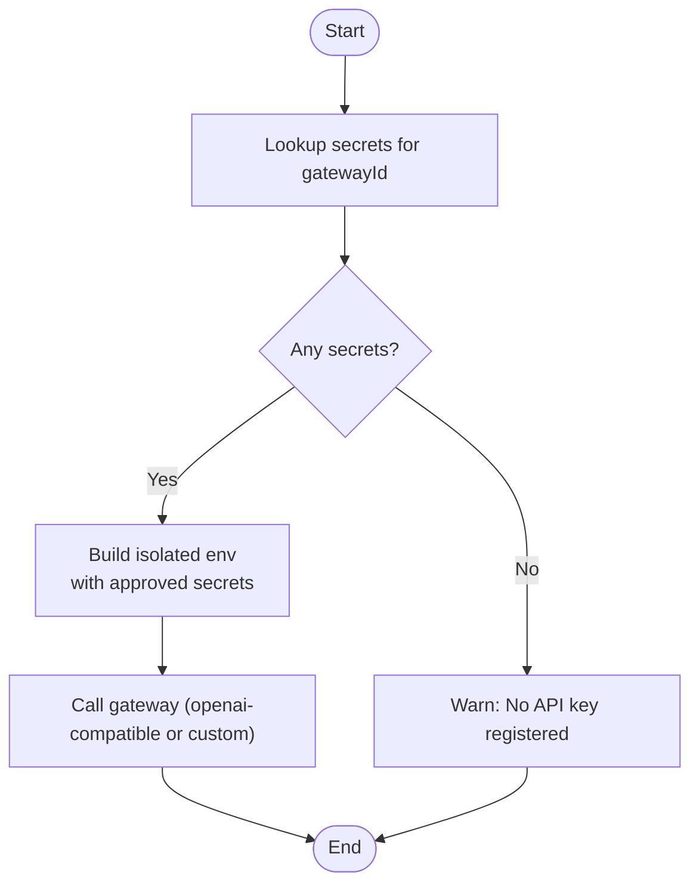
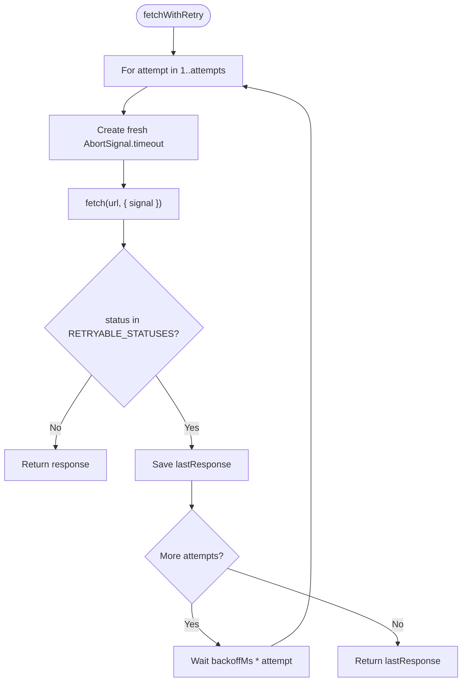
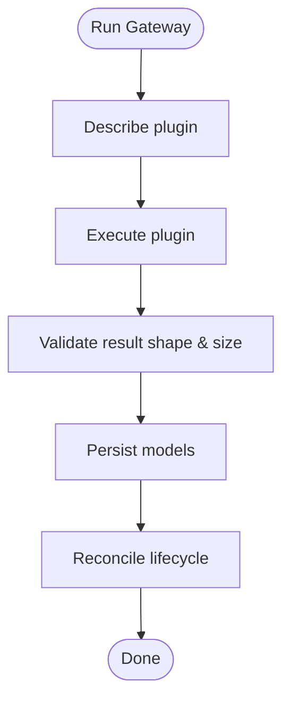
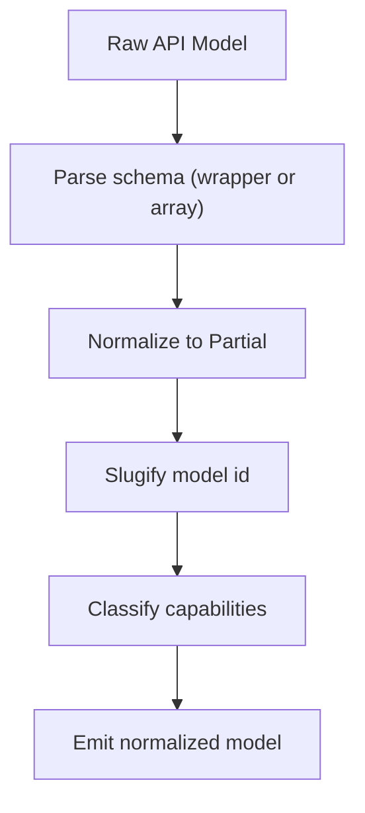
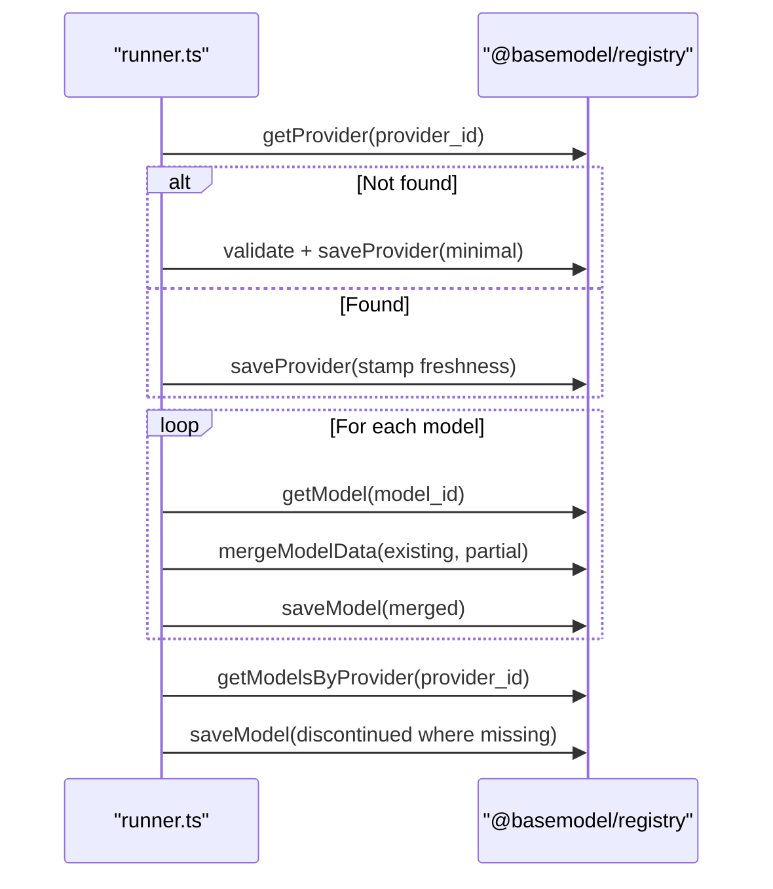
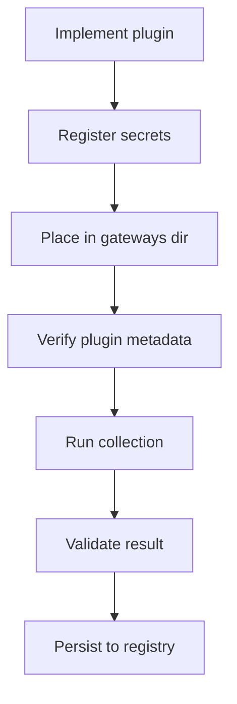
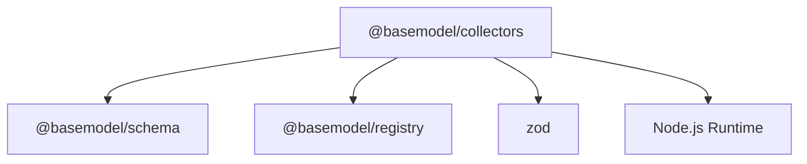

# Data Collection Layer

<cite>
**Referenced Files in This Document**
- [README.md](file://README.md)
- [package.json](file://packages/collectors/package.json)
- [index.ts](file://packages/collectors/src/index.ts)
- [collector.ts](file://packages/collectors/src/core/collector.ts)
- [runner.ts](file://packages/collectors/src/core/runner.ts)
- [plugin-worker.ts](file://packages/collectors/src/core/plugin-worker.ts)
- [http.ts](file://packages/collectors/src/core/http.ts)
- [gateway-secrets.ts](file://packages/collectors/src/core/gateway-secrets.ts)
- [verify.ts](file://packages/collectors/src/core/verify.ts)
- [e2e.test.ts](file://packages/collectors/src/__tests__/e2e.test.ts)
- [runner.test.ts](file://packages/collectors/src/__tests__/runner.test.ts)
- [08_Gateway_Plugin_Security.md](file://docs/08_Gateway_Plugin_Security.md)
</cite>

## Table of Contents
1. [Introduction](#introduction)
2. [Project Structure](#project-structure)
3. [Core Components](#core-components)
4. [Architecture Overview](#architecture-overview)
5. [Detailed Component Analysis](#detailed-component-analysis)
6. [Dependency Analysis](#dependency-analysis)
7. [Performance Considerations](#performance-considerations)
8. [Troubleshooting Guide](#troubleshooting-guide)
9. [Conclusion](#conclusion)
10. [Appendices](#appendices)

## Introduction
This document explains the data collection layer that powers BaseModel’s model discovery and ingestion across AI providers such as OpenAI, Anthropic, Google, and others. It focuses on how collectors discover provider catalogs, normalize model metadata, authenticate securely, handle rate limits and errors, and persist results into the registry. It also documents the gateway abstraction pattern, the plugin execution boundary, and guidance for implementing custom collectors for new providers.

## Project Structure
The collectors package is the discovery and ingestion layer. It exposes a small public API and implements:
- A gateway runner that discovers and executes provider plugins
- An isolated worker boundary to run untrusted plugin code safely
- HTTP helpers with retry/backoff for resilient network calls
- A central secrets registry to limit what credentials are available to plugins
- Registry integration to merge and persist normalized models

**Diagram sources**
- [index.ts:1-2](file://packages/collectors/src/index.ts#L1-L2)
- [collector.ts:1-89](file://packages/collectors/src/core/collector.ts#L1-L89)
- [runner.ts:1-475](file://packages/collectors/src/core/runner.ts#L1-L475)
- [plugin-worker.ts:1-56](file://packages/collectors/src/core/plugin-worker.ts#L1-L56)
- [http.ts:1-38](file://packages/collectors/src/core/http.ts#L1-L38)
- [gateway-secrets.ts:1-27](file://packages/collectors/src/core/gateway-secrets.ts#L1-L27)
- [verify.ts:1-25](file://packages/collectors/src/core/verify.ts#L1-L25)

**Section sources**
- [README.md:1-61](file://README.md#L1-L61)
- [package.json:1-41](file://packages/collectors/package.json#L1-L41)

## Core Components
- ModelCollector interface: Defines the contract for provider-specific collectors returning normalized Partial<Model> records.
- GatewayPlugin types: Two supported patterns:
  - openai-compatible: Declarative configuration against an OpenAI-style /models endpoint
  - custom: Full collection logic executed in an isolated worker with only approved secrets
- CollectionResult: The normalized output shape containing provider_id, models, and errors.
- PricingSourceSpec: Optional declarative pricing catalog source used by enrichment steps.

These components define the collector interface, data transformation targets, and integration points with the registry layer.

**Section sources**
- [collector.ts:1-89](file://packages/collectors/src/core/collector.ts#L1-L89)

## Architecture Overview
The collector system uses a gateway abstraction to unify diverse provider integrations:
- Discovery: The runner scans the gateways directory for .ts/.js files.
- Isolation: Each plugin runs in a child process via a dedicated worker script.
- Execution: For openai-compatible gateways, the runner fetches the /models endpoint; for custom gateways, it invokes the plugin’s collect function with approved secrets.
- Persistence: Results are merged into the registry, with lifecycle reconciliation to mark missing models as discontinued.

**Diagram sources**
- [runner.ts:428-475](file://packages/collectors/src/core/runner.ts#L428-L475)
- [plugin-worker.ts:1-56](file://packages/collectors/src/core/plugin-worker.ts#L1-L56)
- [http.ts:1-38](file://packages/collectors/src/core/http.ts#L1-L38)

## Detailed Component Analysis

### Gateway Abstraction and Plugin Execution
- Describing plugins: describeGatewayPlugin loads metadata without exposing credentials.
- Executing plugins: executeGatewayPlugin enforces secret approvals and delegates to either:
  - runSimpleGateway for openai-compatible endpoints
  - Isolated worker invocation for custom collect implementations
- Environment isolation: createPluginEnvironment whitelists safe environment variables and injects only approved secrets.

**Diagram sources**
- [runner.ts:156-238](file://packages/collectors/src/core/runner.ts#L156-L238)
- [plugin-worker.ts:1-56](file://packages/collectors/src/core/plugin-worker.ts#L1-L56)
- [http.ts:1-38](file://packages/collectors/src/core/http.ts#L1-L38)
- [gateway-secrets.ts:1-27](file://packages/collectors/src/core/gateway-secrets.ts#L1-L27)

**Section sources**
- [runner.ts:96-238](file://packages/collectors/src/core/runner.ts#L96-L238)
- [plugin-worker.ts:1-56](file://packages/collectors/src/core/plugin-worker.ts#L1-L56)

### Authentication Mechanisms
- Centralized secrets: getGatewaySecretKeys returns only approved keys per gateway ID.
- Secret propagation: Only whitelisted env vars and explicitly approved secrets are injected into the plugin worker environment.
- OpenAI-compatible auth: Authorization header set from the configured secret key when present.

**Diagram sources**
- [gateway-secrets.ts:1-27](file://packages/collectors/src/core/gateway-secrets.ts#L1-L27)
- [runner.ts:96-111](file://packages/collectors/src/core/runner.ts#L96-L111)
- [runner.ts:167-186](file://packages/collectors/src/core/runner.ts#L167-L186)

**Section sources**
- [gateway-secrets.ts:1-27](file://packages/collectors/src/core/gateway-secrets.ts#L1-L27)
- [runner.ts:96-111](file://packages/collectors/src/core/runner.ts#L96-L111)

### Rate Limiting Strategies and Retry Logic
- Transient status handling: RETRYABLE_STATUSES includes common transient codes (408, 429, 5xx).
- Exponential-ish backoff: Retries up to a configurable number of attempts with increasing delays.
- Per-attempt timeouts: Each attempt gets a fresh AbortSignal to avoid abort poisoning across retries.
- Non-retryable errors: HTTP hints provide actionable messages for authentication and permission failures.

**Diagram sources**
- [http.ts:1-38](file://packages/collectors/src/core/http.ts#L1-L38)

**Section sources**
- [http.ts:1-38](file://packages/collectors/src/core/http.ts#L1-L38)
- [runner.ts:42-48](file://packages/collectors/src/core/runner.ts#L42-L48)

### Error Handling Approaches
- HTTP error hints: Maps common status codes to human-readable guidance.
- Result validation: Plugin responses are validated for size, structure, and secret leakage.
- Graceful degradation: Errors are collected per gateway and logged; successful collections still proceed.
- Lifecycle reconciliation: Models not listed by a successful gateway are marked discontinued.

**Diagram sources**
- [runner.ts:428-475](file://packages/collectors/src/core/runner.ts#L428-L475)
- [plugin-worker.ts:32-46](file://packages/collectors/src/core/plugin-worker.ts#L32-L46)

**Section sources**
- [runner.ts:42-48](file://packages/collectors/src/core/runner.ts#L42-L48)
- [plugin-worker.ts:32-46](file://packages/collectors/src/core/plugin-worker.ts#L32-L46)

### Data Transformation Patterns
- OpenAI-compatible normalization: Accepts both wrapper and bare array shapes; infers modality and flags from model id.
- Slugification: Normalizes raw ids to stable slugs and merges with provider prefix.
- Classification: Infers capabilities like embeddings, TTS, vision based on model id heuristics.

**Diagram sources**
- [runner.ts:25-56](file://packages/collectors/src/core/runner.ts#L25-L56)
- [runner.ts:192-209](file://packages/collectors/src/core/runner.ts#L192-L209)

**Section sources**
- [runner.ts:25-56](file://packages/collectors/src/core/runner.ts#L25-L56)
- [runner.ts:192-209](file://packages/collectors/src/core/runner.ts#L192-L209)

### Integration with the Registry Layer
- Provider auto-registration: First-time providers are created with minimal metadata and never overwritten if already present.
- Model merging: Existing records are merged with incoming partials; collisions are warned about.
- Discontinued reconciliation: Successful collections trigger deprecation of models no longer listed.

**Diagram sources**
- [runner.ts:337-397](file://packages/collectors/src/core/runner.ts#L337-L397)
- [runner.ts:410-426](file://packages/collectors/src/core/runner.ts#L410-L426)

**Section sources**
- [runner.ts:337-397](file://packages/collectors/src/core/runner.ts#L337-L397)
- [runner.ts:410-426](file://packages/collectors/src/core/runner.ts#L410-L426)

### Implementing Custom Collectors for New Providers
To add a new provider:
- Choose a pattern:
  - openai-compatible: Provide baseUrl, id, and secretKeyName; optionally configure pricingSource.
  - custom: Implement collect(secrets) returning CollectionResult.
- Register secrets: Add required keys to the central secrets registry.
- Place plugin file: Under the gateways directory with .ts or .js extension.
- Test: Use the verifier and tests to validate behavior under success and failure conditions.

**Diagram sources**
- [collector.ts:52-89](file://packages/collectors/src/core/collector.ts#L52-L89)
- [gateway-secrets.ts:1-27](file://packages/collectors/src/core/gateway-secrets.ts#L1-L27)
- [verify.ts:1-25](file://packages/collectors/src/core/verify.ts#L1-L25)

**Section sources**
- [collector.ts:52-89](file://packages/collectors/src/core/collector.ts#L52-L89)
- [gateway-secrets.ts:1-27](file://packages/collectors/src/core/gateway-secrets.ts#L1-L27)
- [verify.ts:1-25](file://packages/collectors/src/core/verify.ts#L1-L25)
- [08_Gateway_Plugin_Security.md:1-36](file://docs/08_Gateway_Plugin_Security.md#L1-L36)

## Dependency Analysis
The collectors package depends on:
- Schema and registry packages for validation and persistence
- Zod for runtime parsing and validation
- Node child_process for isolated plugin execution
- Standard fetch for HTTP requests

**Diagram sources**
- [package.json:1-41](file://packages/collectors/package.json#L1-L41)

**Section sources**
- [package.json:1-41](file://packages/collectors/package.json#L1-L41)

## Performance Considerations
- Concurrency: Gateways are executed concurrently using Promise.allSettled to maximize throughput while isolating failures.
- Network resilience: Retry with exponential backoff reduces transient failures’ impact.
- Memory and payload limits: Enforce maximum models and response bytes to prevent memory pressure.
- Timeouts: Plugin workers have a global timeout to avoid hanging processes.
- Registry writes: Batched per-model merges minimize I/O overhead.

[No sources needed since this section provides general guidance]

## Troubleshooting Guide
Common issues and resolutions:
- Missing API key: Ensure the correct secret is registered for the gateway and available in the environment.
- Rate limiting: The system retries transient 429 errors; persistent limits require throttling or key rotation.
- Unauthorized/Forbidden: Check permissions and billing setup; review HTTP hints for actionable guidance.
- Plugin crashes or timeouts: Inspect logs; verify plugin path and environment; consider reducing workload or increasing timeout.
- Validation failures: Confirm plugin returns valid CollectionResult within size limits and without secrets.

**Section sources**
- [runner.test.ts:105-159](file://packages/collectors/src/__tests__/runner.test.ts#L105-L159)
- [e2e.test.ts:1-48](file://packages/collectors/src/__tests__/e2e.test.ts#L1-L48)
- [runner.ts:42-48](file://packages/collectors/src/core/runner.ts#L42-L48)
- [plugin-worker.ts:32-46](file://packages/collectors/src/core/plugin-worker.ts#L32-L46)

## Conclusion
BaseModel’s data collection layer provides a robust, secure, and extensible framework for discovering and ingesting model information from diverse AI providers. The gateway abstraction, isolated plugin execution, centralized secrets management, resilient networking, and careful registry integration enable reliable, scalable data collection. Extending support to new providers follows a clear pattern, ensuring consistency and safety across the ecosystem.

[No sources needed since this section summarizes without analyzing specific files]

## Appendices
- Security boundaries: Plugins are treated as untrusted until reviewed; process isolation and secret whitelisting reduce risk. Long-term plans include containerized runners and egress allowlists.
- Commands: Use the collectors package scripts to run collection, verification, and benchmark tasks.

**Section sources**
- [08_Gateway_Plugin_Security.md:1-36](file://docs/08_Gateway_Plugin_Security.md#L1-L36)
- [package.json:15-25](file://packages/collectors/package.json#L15-L25)