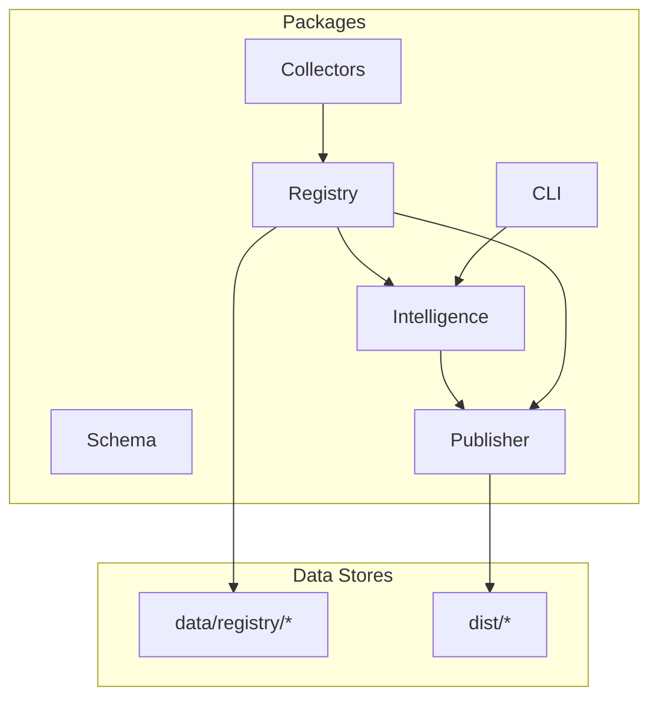
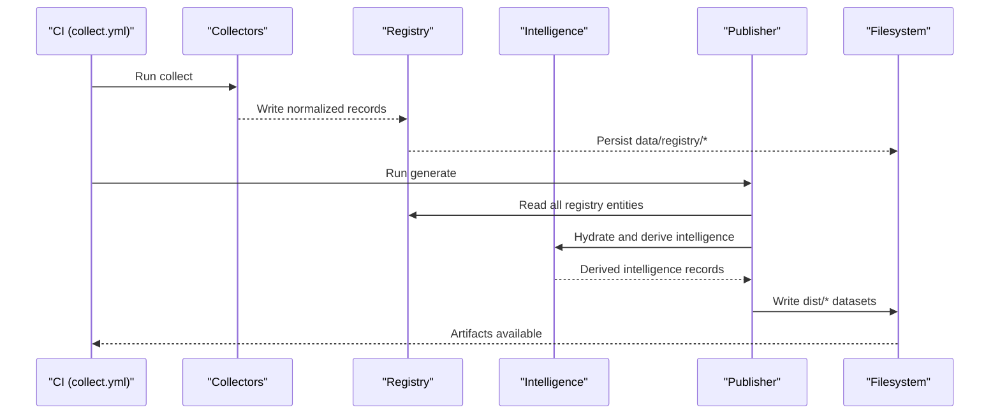
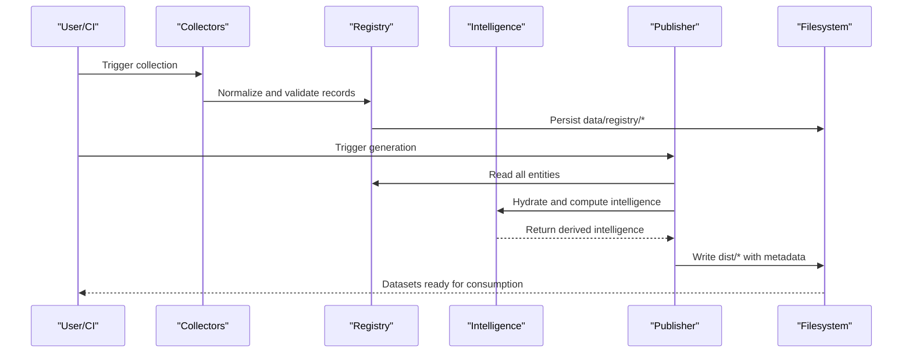
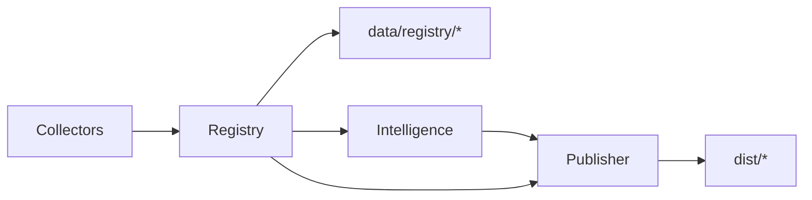

# Data Pipeline Architecture

<cite>
**Referenced Files in This Document**
- [README.md](file://README.md)
- [03_Architecture.md](file://docs/03_Architecture.md)
- [04_Pipeline.md](file://docs/04_Pipeline.md)
- [generate.ts](file://packages/publisher/src/generate.ts)
- [index.ts](file://packages/publisher/src/index.ts)
- [collect.yml](file://.github/workflows/collect.yml)
</cite>

## Table of Contents
1. [Introduction](#introduction)
2. [Project Structure](#project-structure)
3. [Core Components](#core-components)
4. [Architecture Overview](#architecture-overview)
5. [Detailed Component Analysis](#detailed-component-analysis)
6. [Dependency Analysis](#dependency-analysis)
7. [Performance Considerations](#performance-considerations)
8. [Troubleshooting Guide](#troubleshooting-guide)
9. [Conclusion](#conclusion)

## Introduction
This document explains BaseModel’s data pipeline architecture end-to-end: from external provider APIs through collectors, validation, normalization, registry storage, intelligence processing, and final dataset publication. It details each stage, error handling, retry mechanisms, transformations, consistency guarantees, performance considerations, scalability patterns, and monitoring approaches. The goal is to make the system understandable for both technical and non-technical readers while remaining grounded in the repository’s documented behavior.

## Project Structure
BaseModel organizes its functionality into focused packages that map directly to pipeline stages:
- Schema: canonical types and Zod schemas
- Registry: storage, validation, merge utilities
- Collectors: provider and gateway collectors
- Intelligence: derived rankings, search, recommendations
- Publisher: dataset generation for dist/
- CLI: command-line interface for querying intelligence

The published datasets live under dist/ and include providers.json, models.json, capabilities.json, licenses.json, apis.json, benchmarks.json, pricing.json, intelligence.json, and metadata.json. Canonical records are stored under data/registry/.

**Diagram sources**
- [03_Architecture.md:1-77](file://docs/03_Architecture.md#L1-L77)
- [README.md:11-30](file://README.md#L11-L30)

**Section sources**
- [README.md:11-30](file://README.md#L11-L30)
- [03_Architecture.md:1-77](file://docs/03_Architecture.md#L1-L77)

## Core Components
- Discovery and Collection: Identifies and fetches structured data from provider APIs and gateways.
- Validation and Normalization: Enforces schema compliance and converts source-specific formats into canonical BaseModel schemas.
- Registry Storage: Persists canonical records as JSON files under data/registry/.
- Intelligence Processing: Derives search results, alternatives, and cost tiers without modifying canonical records.
- Generation and Publication: Produces public datasets under dist/ with consistent metadata and counts.

Key responsibilities and boundaries are defined by the architecture layers and package mapping.

**Section sources**
- [03_Architecture.md:1-77](file://docs/03_Architecture.md#L1-L77)
- [04_Pipeline.md:1-100](file://docs/04_Pipeline.md#L1-L100)

## Architecture Overview
The pipeline follows a clear sequence: discovery, collection, validation, normalization, registry storage, intelligence derivation, generation, and publication. Each stage has explicit failure handling and governance rules to ensure data integrity and freshness.

**Diagram sources**
- [collect.yml:1-48](file://.github/workflows/collect.yml#L1-L48)
- [generate.ts:108-243](file://packages/publisher/src/generate.ts#L108-L243)
- [04_Pipeline.md:1-100](file://docs/04_Pipeline.md#L1-L100)

## Detailed Component Analysis

### Stage 1: Discovery and Collection
- Purpose: Identify sources (providers, model catalogs, documentation, benchmarks) and retrieve structured data via collectors.
- Inputs: External provider APIs and gateways; optional secrets for authentication.
- Outputs: Raw or lightly transformed records ready for validation.
- Error Handling: Failures are logged; invalid records are isolated; valid records continue downstream.
- Retry Mechanisms: Benchmarks use fallback sources when primary endpoints are rate-limited or unreachable.

Concrete examples of transformations at this stage:
- Provider API responses are mapped to collector output shapes aligned with canonical schemas.
- Benchmark data is normalized into a unified structure for ranking and comparison.

Consistency and Integrity:
- Only validated and normalized records reach the registry.
- Invalid records do not block successful ones.

**Section sources**
- [04_Pipeline.md:1-100](file://docs/04_Pipeline.md#L1-L100)
- [04_Pipeline.md:93-126](file://docs/04_Pipeline.md#L93-L126)

### Stage 2: Validation and Normalization
- Purpose: Ensure schema compliance and convert provider-specific fields into BaseModel’s canonical representation.
- Inputs: Collector outputs.
- Outputs: Canonical records conforming to schema definitions.
- Validation Rules: Required fields, identifier formats, URL validity, timestamp formats, and schema compliance checks.
- Normalization Examples: Canonical identifiers, capability names, pricing units, and API compatibility data.

Error Handling:
- Invalid records are rejected before reaching the registry.
- Errors are logged; partial processing does not corrupt the registry.

**Section sources**
- [04_Pipeline.md:28-40](file://docs/04_Pipeline.md#L28-L40)

### Stage 3: Registry Storage
- Purpose: Store canonical records as authoritative JSON files under data/registry/.
- Entities: Providers, Models, Capabilities, Pricing, APIs, Benchmarks, Licenses.
- Governance:
  - Freshness: Records carry updated_at timestamps on write; missing timestamps indicate stale entries.
  - Lifecycle: Models have status values (active, preview, deprecated, discontinued); reconciliation marks models as discontinued if no longer listed by a successfully fetched catalog.
  - Provenance: Pricing records report their source (openrouter, huggingface, or gateway id).

Consistency and Integrity:
- Registry contains only validated and normalized records.
- Reconciliation runs only after error-free collections to avoid deprecating entire providers due to transient failures.

**Section sources**
- [04_Pipeline.md:41-92](file://docs/04_Pipeline.md#L41-L92)
- [04_Pipeline.md:163-222](file://docs/04_Pipeline.md#L163-L222)

### Stage 4: Intelligence Processing
- Purpose: Derive search results, alternative suggestions, and cost efficiency tiers from registry data.
- Constraints: Does not modify canonical records; operates read-only on registry snapshot.
- Outputs: Intelligence records used by consumers and included in dist/intelligence.json.

Data Consistency:
- Intelligence is computed from a validated registry snapshot, ensuring derived insights reflect canonical truth.

**Section sources**
- [04_Pipeline.md:54-63](file://docs/04_Pipeline.md#L54-L63)
- [03_Architecture.md:23-30](file://docs/03_Architecture.md#L23-L30)

### Stage 5: Generation and Publication
- Purpose: Generate public datasets under dist/ with consistent metadata and counts.
- Process:
  - Read all registry entities up front.
  - Validate cross-entity relations before writing any file.
  - Derive intelligence via hydration against canonical schemas.
  - Write each dataset file with metadata including schema_version, source_revision, generated_at, and count.
- Failure Handling:
  - Cross-entity validation ensures no partially written, invalid dist/ snapshots.
  - Enrichment fails loudly when all primary pricing sources fail; run marked fatal to prevent committing stale data.

Concrete examples of transformations at this stage:
- Cross-entity relation validation enforces referential integrity between providers, models, capabilities, and pricing.
- Intelligence records are aggregated and serialized into a single intelligence.json with metadata.

Consistency and Integrity:
- All datasets share consistent metadata and schema versioning.
- Relations are validated prior to any writes, preventing inconsistent outputs.

**Section sources**
- [generate.ts:73-106](file://packages/publisher/src/generate.ts#L73-L106)
- [generate.ts:108-243](file://packages/publisher/src/generate.ts#L108-L243)
- [04_Pipeline.md:64-85](file://docs/04_Pipeline.md#L64-L85)

### End-to-End Sequence Diagram

**Diagram sources**
- [collect.yml:1-48](file://.github/workflows/collect.yml#L1-L48)
- [generate.ts:108-243](file://packages/publisher/src/generate.ts#L108-L243)
- [04_Pipeline.md:1-100](file://docs/04_Pipeline.md#L1-L100)

## Dependency Analysis
The pipeline components interact through well-defined boundaries:
- Collectors depend on external provider APIs and gateways.
- Registry depends on schema definitions for validation and normalization.
- Intelligence depends on registry data but remains read-only.
- Publisher depends on both registry and intelligence to produce datasets.

**Diagram sources**
- [03_Architecture.md:1-77](file://docs/03_Architecture.md#L1-L77)
- [generate.ts:108-243](file://packages/publisher/src/generate.ts#L108-L243)

**Section sources**
- [03_Architecture.md:1-77](file://docs/03_Architecture.md#L1-L77)

## Performance Considerations
- Batch Reads: Publisher reads all registry entities upfront to minimize I/O overhead.
- Pre-write Validation: Cross-entity validation occurs before any writes to avoid partial outputs.
- Fallback Sources: Benchmarks use fallback sources to maintain throughput under rate limits.
- Metadata Efficiency: Each dataset includes concise metadata for quick consumer checks.

Scalability Patterns:
- Decoupled Stages: Each stage can be scaled independently based on load.
- Stateless Intelligence: Intelligence computation is stateless and can be parallelized across entities.
- Idempotent Writes: Registry and dist outputs are deterministic per run, enabling safe retries.

Monitoring Approaches:
- Timestamps: updated_at for record freshness; generated_at for dataset run time.
- Counts: Each dataset includes count fields for quick size verification.
- Error Logging: Failures are logged at each stage; enrichment marks runs as fatal when necessary.

[No sources needed since this section provides general guidance]

## Troubleshooting Guide
Common issues and resolutions:
- Invalid Records: Rejected during validation; check logs for specific field errors and correct collector outputs.
- Rate Limits: Benchmarks fall back to Mirror when LMArena or Open LLM Leaderboard are rate-limited; consider adding Hugging Face token for higher limits.
- Enrichment Failures: If all primary pricing sources fail, the run is marked fatal; verify network access and credentials.
- Partial Outputs: Cross-entity validation prevents partial dist/ snapshots; re-run generation after fixing registry issues.

Operational Tips:
- Use CI workflows to automate collection and generation.
- Monitor generated_at and updated_at timestamps to detect stale data.
- Inspect dist/metadata.json for enrichment status and errors.

**Section sources**
- [04_Pipeline.md:86-92](file://docs/04_Pipeline.md#L86-L92)
- [04_Pipeline.md:108-126](file://docs/04_Pipeline.md#L108-L126)
- [04_Pipeline.md:205-217](file://docs/04_Pipeline.md#L205-L217)
- [generate.ts:73-106](file://packages/publisher/src/generate.ts#L73-L106)

## Conclusion
BaseModel’s data pipeline provides a robust, auditable flow from external provider APIs to published datasets. Through strict validation, normalization, and governance, it ensures data consistency and integrity. The decoupled architecture supports scalability and resilience, while metadata and logging enable effective monitoring and troubleshooting. Consumers can rely on the published datasets for accurate, fresh, and trustworthy AI model intelligence.

[No sources needed since this section summarizes without analyzing specific files]