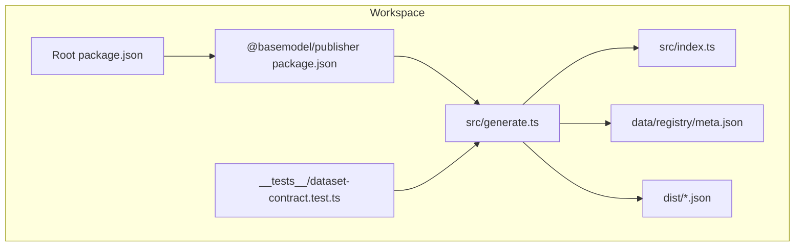
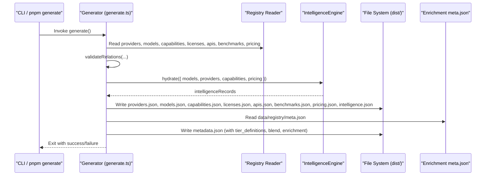
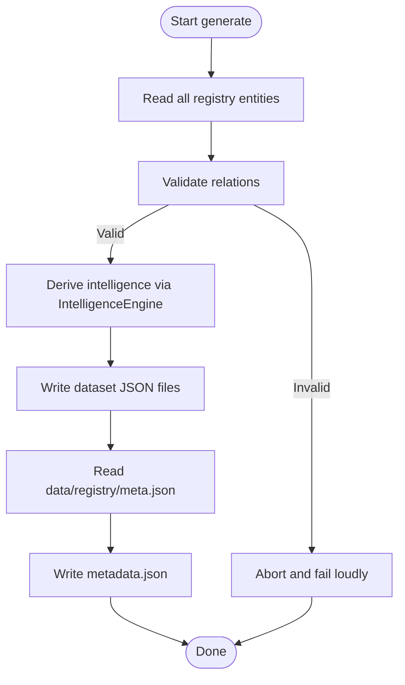
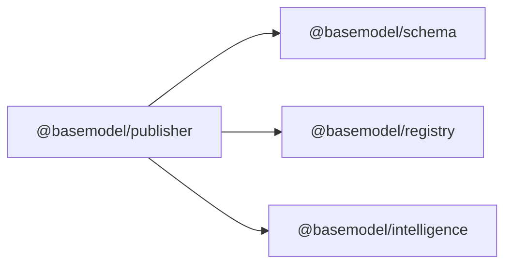

# Dataset Publication

<cite>
**Referenced Files in This Document**
- [README.md](file://README.md)
- [03_Architecture.md](file://docs/03_Architecture.md)
- [04_Pipeline.md](file://docs/04_Pipeline.md)
- [package.json](file://package.json)
- [packages/publisher/package.json](file://packages/publisher/package.json)
- [packages/publisher/src/index.ts](file://packages/publisher/src/index.ts)
- [packages/publisher/src/generate.ts](file://packages/publisher/src/generate.ts)
- [packages/publisher/src/__tests__/dataset-contract.test.ts](file://packages/publisher/src/__tests__/dataset-contract.test.ts)
- [data/registry/meta.json](file://data/registry/meta.json)
</cite>

## Table of Contents
1. [Introduction](#introduction)
2. [Project Structure](#project-structure)
3. [Core Components](#core-components)
4. [Architecture Overview](#architecture-overview)
5. [Detailed Component Analysis](#detailed-component-analysis)
6. [Dependency Analysis](#dependency-analysis)
7. [Performance Considerations](#performance-considerations)
8. [Troubleshooting Guide](#troubleshooting-guide)
9. [Conclusion](#conclusion)
10. [Appendices](#appendices)

## Introduction
This document explains the dataset publication system used by BaseModel to transform processed intelligence data into public datasets. It covers how JSON outputs are generated, what metadata is included, and how distribution is performed. It also documents the publisher architecture, template-like generation patterns, customization hooks for output formats, filtering strategies, versioning, changelog considerations, and automated publishing workflows that keep datasets current.

BaseModel’s pipeline stages include discovery, collection, validation, normalization, registry storage, intelligence derivation, generation, and publication. The publisher is responsible for the final two stages: generating static JSON datasets under dist/ and making them available through distribution channels such as GitHub Pages or repository artifacts.

**Section sources**
- [README.md:10-30](file://README.md#L10-L30)
- [04_Pipeline.md:16-98](file://docs/04_Pipeline.md#L16-L98)

## Project Structure
The publishing layer resides in the @basemodel/publisher package and writes canonical JSON datasets to dist/. The root package exposes a generate script that invokes the publisher. The registry stores canonical records under data/registry/, and enrichment metadata is persisted in data/registry/meta.json.

**Diagram sources**
- [package.json:17-25](file://package.json#L17-L25)
- [packages/publisher/package.json:15-22](file://packages/publisher/package.json#L15-L22)
- [packages/publisher/src/generate.ts:112-284](file://packages/publisher/src/generate.ts#L112-L284)
- [packages/publisher/src/index.ts:1-10](file://packages/publisher/src/index.ts#L1-L10)
- [packages/publisher/src/__tests__/dataset-contract.test.ts:82-106](file://packages/publisher/src/__tests__/dataset-contract.test.ts#L82-L106)
- [data/registry/meta.json:1-18](file://data/registry/meta.json#L1-L18)

**Section sources**
- [README.md:10-30](file://README.md#L10-L30)
- [package.json:17-25](file://package.json#L17-L25)
- [packages/publisher/package.json:15-22](file://packages/publisher/package.json#L15-L22)

## Core Components
- Publisher entrypoint: Exposes the generator module and defines the package contract.
- Generator: Orchestrates reading registry data, validating relations, deriving intelligence, and writing datasets with consistent run metadata.
- Contract tests: Ensure every dataset file includes required metadata fields and schema consistency across runs.
- Enrichment metadata: Captures per-source status, coverage, and errors for transparency.

Key responsibilities:
- Read all registry entities (providers, models, capabilities, licenses, apis, benchmarks, pricing).
- Validate cross-entity relations before any write.
- Derive intelligence using the IntelligenceEngine.
- Write each dataset with schema_version, source_revision, generated_at, and count.
- Include tier definitions and blend formula in metadata.json.

**Section sources**
- [packages/publisher/src/index.ts:1-10](file://packages/publisher/src/index.ts#L1-L10)
- [packages/publisher/src/generate.ts:112-284](file://packages/publisher/src/generate.ts#L112-L284)
- [packages/publisher/src/__tests__/dataset-contract.test.ts:82-106](file://packages/publisher/src/__tests__/dataset-contract.test.ts#L82-L106)
- [data/registry/meta.json:1-18](file://data/registry/meta.json#L1-L18)

## Architecture Overview
The publishing layer consumes registry and intelligence data to produce stable, versioned datasets. Generation validates relational integrity and enriches outputs with provenance and freshness metadata. Publication distributes these files via CI-driven workflows.

**Diagram sources**
- [packages/publisher/src/generate.ts:112-284](file://packages/publisher/src/generate.ts#L112-L284)
- [data/registry/meta.json:1-18](file://data/registry/meta.json#L1-L18)

## Detailed Component Analysis

### Generator Orchestration
The generator performs a deterministic sequence:
- Collects registry data via dedicated readers.
- Validates relations among entities prior to any disk writes.
- Hydrates the IntelligenceEngine with normalized snapshots.
- Writes each dataset file with uniform metadata and counts.
- Incorporates enrichment metadata into metadata.json.

**Diagram sources**
- [packages/publisher/src/generate.ts:112-284](file://packages/publisher/src/generate.ts#L112-L284)

**Section sources**
- [packages/publisher/src/generate.ts:112-284](file://packages/publisher/src/generate.ts#L112-L284)

### Dataset Contracts and Metadata
Every published dataset must include:
- schema_version: Version of the canonical schema used during generation.
- source_revision: Git revision of the source at generation time.
- generated_at: ISO timestamp when the dataset was produced.
- count: Number of records in the dataset array.

Contract tests assert:
- Presence and format of metadata fields.
- Consistency of schema_version across all datasets.
- Count fields matching actual array lengths.
- All model records conform to the canonical ModelSchema.

These guarantees ensure consumers can trust freshness, versioning, and structural validity.

**Section sources**
- [packages/publisher/src/__tests__/dataset-contract.test.ts:82-106](file://packages/publisher/src/__tests__/dataset-contract.test.ts#L82-L106)
- [04_Pipeline.md:78-98](file://docs/04_Pipeline.md#L78-L98)

### Enrichment Metadata and Tier Definitions
metadata.json includes:
- schema_version, source_revision, generated_at.
- tier_definitions describing free/budget/balanced/premium thresholds.
- blend parameters and formula used to compute blended cost.
- enrichment object sourced from data/registry/meta.json, capturing per-source statuses, coverage, and errors.

This provides transparency about data provenance and health of enrichment sources.

**Section sources**
- [packages/publisher/src/generate.ts:246-272](file://packages/publisher/src/generate.ts#L246-L272)
- [data/registry/meta.json:1-18](file://data/registry/meta.json#L1-L18)
- [04_Pipeline.md:207-221](file://docs/04_Pipeline.md#L207-L221)

### Output Formats and Distribution Strategies
Outputs are static JSON files written to dist/:
- providers.json, models.json, capabilities.json, licenses.json, apis.json, benchmarks.json, pricing.json, intelligence.json, metadata.json.

Distribution strategies:
- GitHub Pages deployment via CI workflow.
- Repository artifacts for programmatic consumption.
- Mirrors that consume the generated files.

Consumers can rely on the presence of metadata fields and schema_version to interpret datasets correctly.

**Section sources**
- [README.md:19-30](file://README.md#L19-L30)
- [04_Pipeline.md:78-98](file://docs/04_Pipeline.md#L78-L98)

### Customization Hooks and Template Systems
While the generator follows a fixed pipeline, customization points exist:
- Registry readers: Extend or replace entity retrieval logic to support new data sources.
- Relation validators: Add or modify cross-entity checks to enforce domain-specific constraints.
- IntelligenceEngine hydration: Inject additional derived fields or filters before writing datasets.
- File writers: Wrap or extend the write step to emit alternative formats or apply formatting options.

To add a new dataset or change output structure:
- Implement a reader for the new entity.
- Integrate it into the orchestration flow.
- Update contract tests to assert new metadata and schema compliance.

[No sources needed since this section describes conceptual customization without analyzing specific files]

### Filtering Strategies and Metadata Inclusion
Filtering occurs implicitly through:
- Validation and normalization steps that reject malformed or incomplete records.
- Intelligence derivation that computes search results, alternatives, and cost tiers.
- Enrichment fallbacks that preserve existing tiers and avoid clearing valid data.

Metadata inclusion ensures:
- Freshness via generated_at and updated_at timestamps.
- Provenance via source fields in pricing records.
- Lifecycle status for models (active, preview, deprecated, discontinued).

**Section sources**
- [04_Pipeline.md:28-38](file://docs/04_Pipeline.md#L28-L38)
- [04_Pipeline.md:177-206](file://docs/04_Pipeline.md#L177-L206)

### Versioning and Changelog Generation
Versioning is enforced by:
- schema_version field in each dataset reflecting the @basemodel/schema package version used.
- source_revision linking datasets to a specific git commit.
- generated_at indicating when the snapshot was created.

Changelog generation:
- Not implemented in the publisher; changes are tracked via git history and CI logs.
- Consumers should compare schema_version and source_revision to detect meaningful updates.

**Section sources**
- [packages/publisher/src/generate.ts:112-122](file://packages/publisher/src/generate.ts#L112-L122)
- [packages/publisher/src/__tests__/dataset-contract.test.ts:82-89](file://packages/publisher/src/__tests__/dataset-contract.test.ts#L82-L89)
- [04_Pipeline.md:222-231](file://docs/04_Pipeline.md#L222-L231)

### Automated Publishing Workflows
Automation is driven by GitHub Actions:
- ci.yml validates the workspace.
- collect.yml performs nightly collection and regeneration.
- publish.yml regenerates datasets on push to main.
- deploy-pages.yml publishes static files.
- verify-gateway.yml checks gateway plugin changes.

These workflows ensure datasets remain up-to-date and consistently distributed.

**Section sources**
- [04_Pipeline.md:250-259](file://docs/04_Pipeline.md#L250-L259)

## Dependency Analysis
The publisher depends on:
- @basemodel/schema for canonical types and schemas.
- @basemodel/registry for reading and validating registry files.
- @basemodel/intelligence for deriving search, alternatives, and cost information.

**Diagram sources**
- [packages/publisher/package.json:23-27](file://packages/publisher/package.json#L23-L27)

**Section sources**
- [packages/publisher/package.json:23-27](file://packages/publisher/package.json#L23-L27)
- [03_Architecture.md:37-44](file://docs/03_Architecture.md#L37-L44)

## Performance Considerations
- Batch reads: The generator reads all registry entities upfront to minimize I/O overhead.
- Validation before writes: Ensures no partial datasets are produced, avoiding costly rollbacks.
- Fallback strategies: Enrichment continues with alternate sources if primary sources fail, reducing overall runtime failures.
- Deterministic ordering: Stable iteration over entities ensures reproducible outputs.

[No sources needed since this section provides general guidance]

## Troubleshooting Guide
Common issues and resolutions:
- Missing metadata fields: Ensure schema_version, source_revision, generated_at, and count are present in all datasets.
- Invalid model records: Verify ModelSchema compliance; contract tests will surface sample errors.
- Enrichment failures: Check data/registry/meta.json for per-source statuses and errors; CI marks runs fatal if all primary sources fail.
- Stale datasets: Compare generated_at timestamps and schema_version to confirm freshness and compatibility.

Operational tips:
- Run contract tests locally to catch dataset inconsistencies early.
- Inspect enrichment metadata for coverage and error details.
- Use CI logs to trace failures in collection, validation, or generation phases.

**Section sources**
- [packages/publisher/src/__tests__/dataset-contract.test.ts:82-106](file://packages/publisher/src/__tests__/dataset-contract.test.ts#L82-L106)
- [data/registry/meta.json:1-18](file://data/registry/meta.json#L1-L18)
- [04_Pipeline.md:232-244](file://docs/04_Pipeline.md#L232-L244)

## Conclusion
The BaseModel dataset publication system transforms validated, normalized registry data and derived intelligence into stable, versioned JSON datasets. It enforces relational integrity, includes rich metadata for freshness and provenance, and supports automated distribution via CI workflows. Customization hooks allow extensions for new datasets, formats, and filters while maintaining strong contracts and reliability.

[No sources needed since this section summarizes without analyzing specific files]

## Appendices

### Example Commands
- Generate datasets: pnpm generate
- Build packages: pnpm build
- Typecheck: pnpm typecheck
- Test: pnpm test

**Section sources**
- [package.json:17-25](file://package.json#L17-L25)
- [packages/publisher/package.json:15-22](file://packages/publisher/package.json#L15-L22)