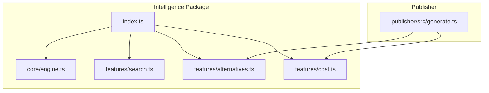
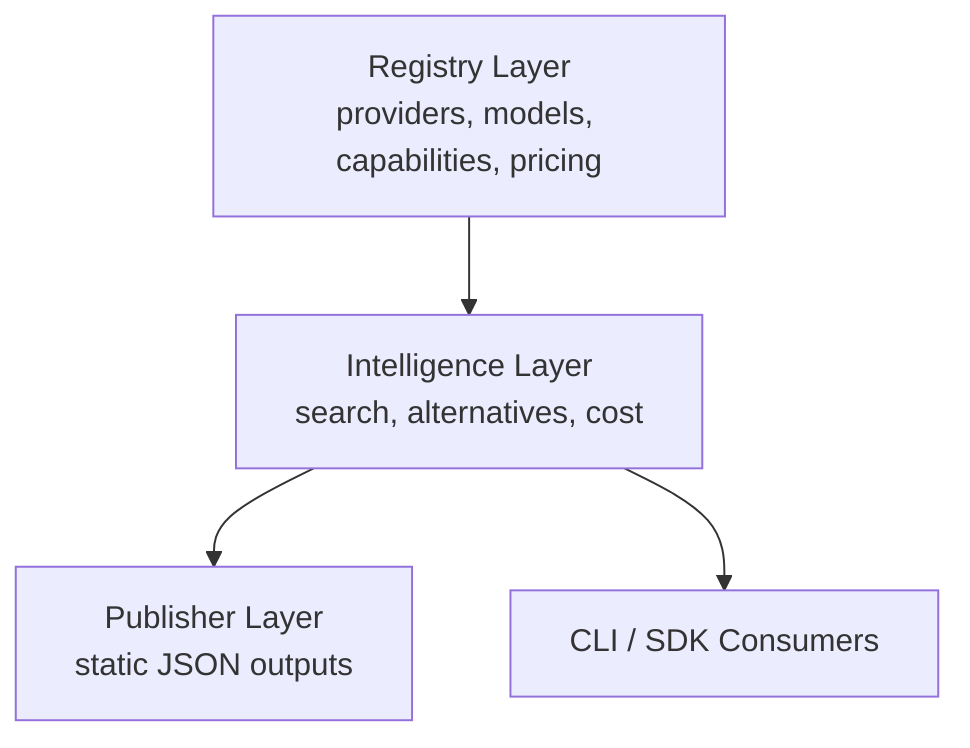
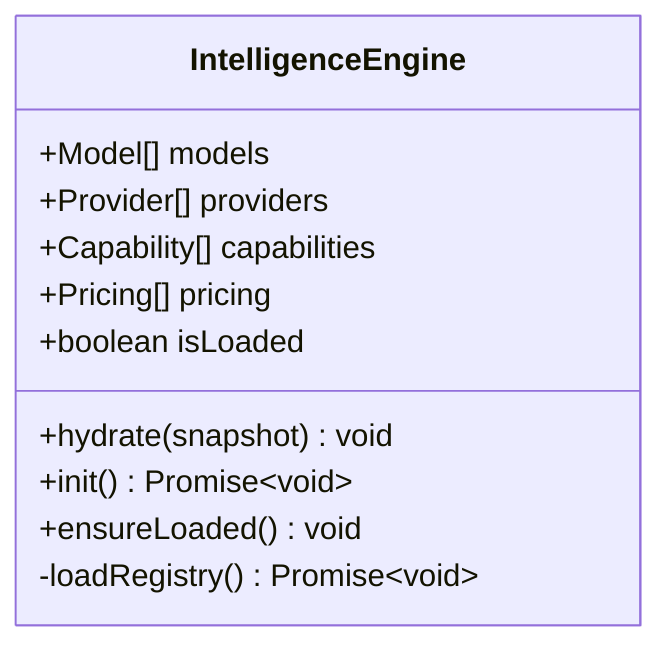
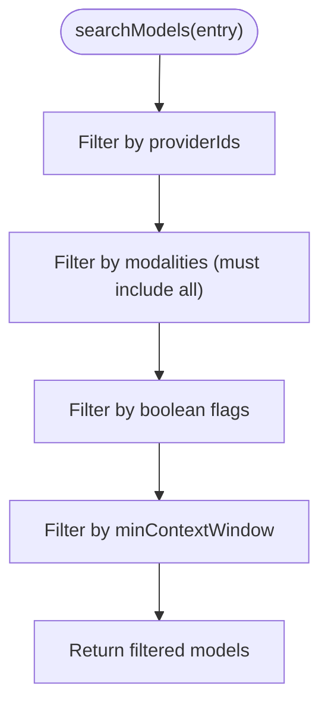
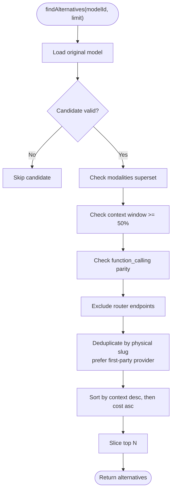
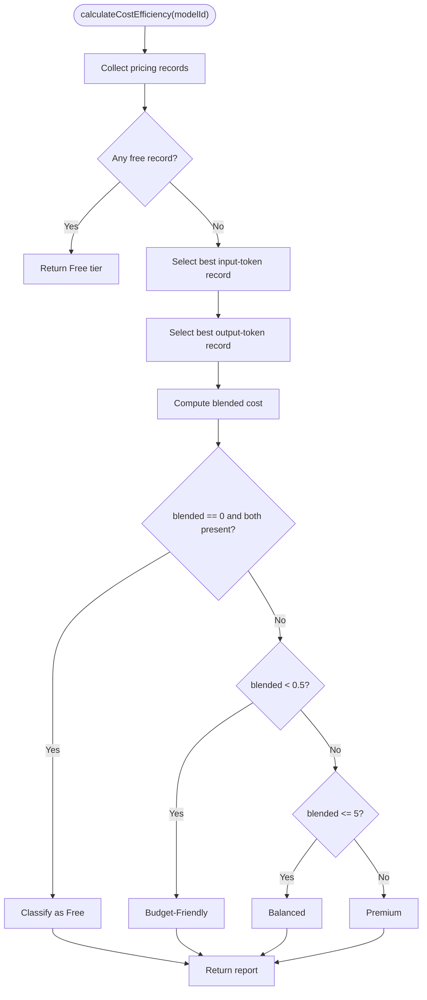
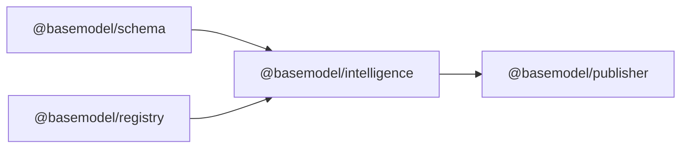

# Intelligence Processing

<cite>
**Referenced Files in This Document**
- [README.md](file://README.md)
- [03_Architecture.md](file://docs/03_Architecture.md)
- [04_Pipeline.md](file://docs/04_Pipeline.md)
- [07_Developer_Access.md](file://docs/07_Developer_Access.md)
- [engine.ts](file://packages/intelligence/src/core/engine.ts)
- [search.ts](file://packages/intelligence/src/features/search.ts)
- [alternatives.ts](file://packages/intelligence/src/features/alternatives.ts)
- [cost.ts](file://packages/intelligence/src/features/cost.ts)
- [index.ts](file://packages/intelligence/src/index.ts)
- [package.json](file://packages/intelligence/package.json)
- [generate.ts](file://packages/publisher/src/generate.ts)
- [intelligence.test.ts](file://packages/intelligence/src/__tests__/intelligence.test.ts)
</cite>

## Table of Contents
1. [Introduction](#introduction)
2. [Project Structure](#project-structure)
3. [Core Components](#core-components)
4. [Architecture Overview](#architecture-overview)
5. [Detailed Component Analysis](#detailed-component-analysis)
6. [Dependency Analysis](#dependency-analysis)
7. [Performance Considerations](#performance-considerations)
8. [Troubleshooting Guide](#troubleshooting-guide)
9. [Conclusion](#conclusion)
10. [Appendices](#appendices)

## Introduction
This document explains the intelligence processing layer that transforms raw registry data into actionable insights: search, alternatives/recommendations, and cost analysis. It focuses on how the engine loads validated registry snapshots, applies deterministic heuristics for ranking and recommendation, and exposes stable APIs for consumers. The layer is intentionally read-only over canonical records and does not perform inference or runtime orchestration.

## Project Structure
The intelligence package provides derived intelligence over canonical registry data. It exports a core engine and feature modules for search, alternatives, and cost efficiency. The publisher consumes these features to generate static datasets.



**Diagram sources**
- [index.ts:1-15](file://packages/intelligence/src/index.ts#L1-L15)
- [engine.ts:1-92](file://packages/intelligence/src/core/engine.ts#L1-L92)
- [search.ts:1-53](file://packages/intelligence/src/features/search.ts#L1-L53)
- [alternatives.ts:1-138](file://packages/intelligence/src/features/alternatives.ts#L1-L138)
- [cost.ts:1-115](file://packages/intelligence/src/features/cost.ts#L1-L115)
- [generate.ts:147-177](file://packages/publisher/src/generate.ts#L147-L177)

**Section sources**
- [README.md:1-61](file://README.md#L1-L61)
- [03_Architecture.md:1-57](file://docs/03_Architecture.md#L1-L57)
- [04_Pipeline.md:40-98](file://docs/04_Pipeline.md#L40-L98)
- [package.json:1-49](file://packages/intelligence/package.json#L1-L49)

## Core Components
- IntelligenceEngine: Holds a validated snapshot of models, providers, capabilities, and pricing; supports both Node.js initialization and browser hydration.
- Search: Filters models by provider, modalities, boolean flags, and minimum context window.
- Alternatives: Recommends comparable models with deterministic deduplication and ranking.
- Cost Efficiency: Computes blended cost per 1M tokens and assigns a tier using provenance-aware selection.

Key responsibilities:
- Defensive validation via schema parsing when hydrating.
- Deterministic behavior across multiple sources (e.g., pricing provenance).
- Read-only derivation from canonical registry data.

**Section sources**
- [engine.ts:1-92](file://packages/intelligence/src/core/engine.ts#L1-L92)
- [search.ts:1-53](file://packages/intelligence/src/features/search.ts#L1-L53)
- [alternatives.ts:1-138](file://packages/intelligence/src/features/alternatives.ts#L1-L138)
- [cost.ts:1-115](file://packages/intelligence/src/features/cost.ts#L1-L115)

## Architecture Overview
The intelligence layer sits between the registry and the publisher. Consumers can use the engine directly or rely on generated datasets produced by the publisher.



**Diagram sources**
- [03_Architecture.md:1-57](file://docs/03_Architecture.md#L1-L57)
- [04_Pipeline.md:40-98](file://docs/04_Pipeline.md#L40-L98)

**Section sources**
- [03_Architecture.md:1-57](file://docs/03_Architecture.md#L1-L57)
- [04_Pipeline.md:40-98](file://docs/04_Pipeline.md#L40-L98)

## Detailed Component Analysis

### IntelligenceEngine
Responsibilities:
- Validates and stores a snapshot of registry data.
- Provides safe initialization paths for Node.js and browser environments.
- Ensures operations are only executed after loading.

Design highlights:
- Snapshot parsing enforces schema constraints and fails fast on invalid data.
- Concurrent init calls share a single load promise.
- Browser-safe path requires manual hydration.



**Diagram sources**
- [engine.ts:1-92](file://packages/intelligence/src/core/engine.ts#L1-L92)

**Section sources**
- [engine.ts:1-92](file://packages/intelligence/src/core/engine.ts#L1-L92)

### Search Feature
Purpose:
- Filter models based on provider IDs, required modalities, boolean flags, and minimum context window.

Algorithm:
- Single-pass filter over in-memory model list.
- All criteria are AND conditions; missing criteria are ignored.

Complexity:
- O(N) where N is the number of models.



**Diagram sources**
- [search.ts:1-53](file://packages/intelligence/src/features/search.ts#L1-L53)

**Section sources**
- [search.ts:1-53](file://packages/intelligence/src/features/search.ts#L1-L53)

### Alternatives Feature
Purpose:
- Recommend comparable alternative models for a given model.

Criteria and rules:
- Candidate must support all modalities of the original model.
- Context window must be at least 50% of the original’s.
- If the original supports function calling, the candidate must also.
- Router endpoints are excluded from recommendations.
- Duplicate physical models across providers are collapsed; first-party providers preferred.

Ranking:
- Primary key: larger context window.
- Secondary key: lower blended cost per 1M tokens.
- Tertiary key: lexicographic model_id for stability.



**Diagram sources**
- [alternatives.ts:1-138](file://packages/intelligence/src/features/alternatives.ts#L1-L138)

**Section sources**
- [alternatives.ts:1-138](file://packages/intelligence/src/features/alternatives.ts#L1-L138)

### Cost Efficiency Feature
Purpose:
- Compute blended cost per 1M tokens and assign a tier.

Provenance selection:
- When multiple pricing records exist, select the highest-priority source deterministically:
  - Model’s own provider catalog
  - OpenRouter aggregate
  - Other gateway catalogs
  - Hugging Face
  - Unprovenanced last

Tier classification:
- Free if any record indicates free or both input/output priced at zero.
- Budget-Friendly if blended < 0.5
- Balanced if blended <= 5
- Premium otherwise

Blended cost:
- Uses a standard blending formula combining input and output token costs.



**Diagram sources**
- [cost.ts:1-115](file://packages/intelligence/src/features/cost.ts#L1-L115)

**Section sources**
- [cost.ts:1-115](file://packages/intelligence/src/features/cost.ts#L1-L115)

### Publisher Integration
The publisher computes intelligence for each model and writes it to static datasets.

```mermaid
sequenceDiagram
participant Pub as "Publisher"
participant Eng as "IntelligenceEngine"
participant Alt as "findAlternatives"
participant Cos as "calculateCostEfficiency"
Pub->>Eng : iterate models
loop For each model
Pub->>Cos : calculateCostEfficiency(engine, model_id)
Cos-->>Pub : {tier, blendedCost, ...}
Pub->>Alt : findAlternatives(engine, model_id, 3)
Alt-->>Pub : [{model_id, name, reason}, ...]
Pub->>Pub : assemble intelligence record
end
Pub-->>Pub : write intelligence.json
```

**Diagram sources**
- [generate.ts:147-177](file://packages/publisher/src/generate.ts#L147-L177)

**Section sources**
- [generate.ts:147-177](file://packages/publisher/src/generate.ts#L147-L177)

## Dependency Analysis
The intelligence package depends on schema and registry packages. The publisher depends on intelligence to derive datasets.



**Diagram sources**
- [package.json:1-49](file://packages/intelligence/package.json#L1-L49)

**Section sources**
- [package.json:1-49](file://packages/intelligence/package.json#L1-L49)

## Performance Considerations
- In-memory filtering: Search runs in O(N) over models; suitable for typical registry sizes.
- Deduplication and sorting: Alternatives uses Map-based deduplication and a stable sort; complexity dominated by O(N log N) due to sorting.
- Provenance selection: Linear scan over pricing records per call; consider caching results for repeated queries.
- Batch generation: Publisher computes intelligence per model; parallelization can reduce wall time but must respect memory limits.

Optimization opportunities:
- Precompute blended costs per model and cache them during batch runs.
- Build inverted indexes for modalities and flags to accelerate search.
- Cache alternative rankings per model to avoid recomputation.

[No sources needed since this section provides general guidance]

## Troubleshooting Guide
Common issues:
- Engine not initialized: Ensure init() or hydrate() is called before querying.
- Invalid snapshot: Hydration validates schemas; errors indicate malformed data.
- Missing pricing: Cost reports return Unknown tier when no pricing exists.
- Router endpoints: Alternatives excludes router endpoints by design.

Recovery steps:
- Re-run collection to refresh registry data.
- Validate schema compliance for inputs.
- Use tests to verify expected behaviors.

**Section sources**
- [engine.ts:1-92](file://packages/intelligence/src/core/engine.ts#L1-L92)
- [intelligence.test.ts:1-49](file://packages/intelligence/src/__tests__/intelligence.test.ts#L1-L49)
- [intelligence.test.ts:105-199](file://packages/intelligence/src/__tests__/intelligence.test.ts#L105-L199)

## Conclusion
The intelligence layer converts canonical registry data into practical insights through deterministic heuristics for search, alternatives, and cost analysis. It prioritizes correctness, reproducibility, and transparency while remaining lightweight and composable. Consumers can integrate via the engine API or consume published datasets.

[No sources needed since this section summarizes without analyzing specific files]

## Appendices

### API Surface Summary
- IntelligenceEngine: hydrate(), init(), ensureLoaded()
- searchModels(criteria): returns filtered models
- findAlternatives(modelId, limit): returns ranked alternatives
- calculateCostEfficiency(modelId): returns cost report

Usage examples and integration notes are available in developer documentation.

**Section sources**
- [07_Developer_Access.md:1-61](file://docs/07_Developer_Access.md#L1-L61)
- [index.ts:1-15](file://packages/intelligence/src/index.ts#L1-L15)