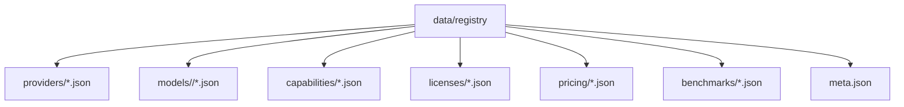
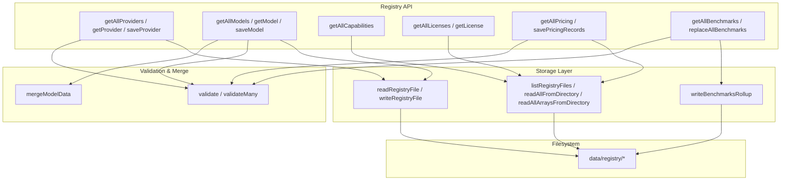
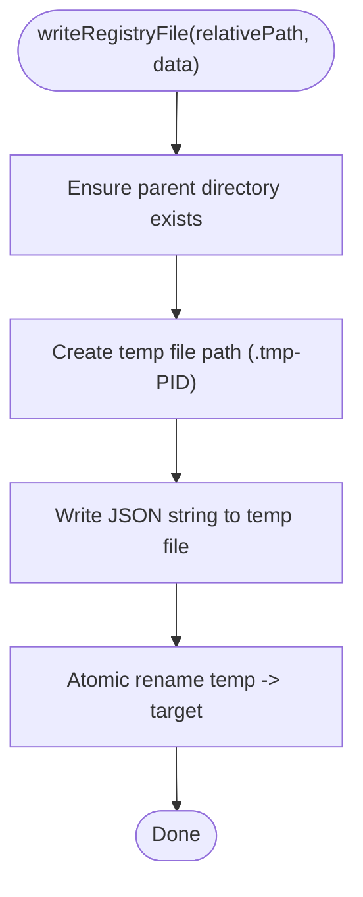
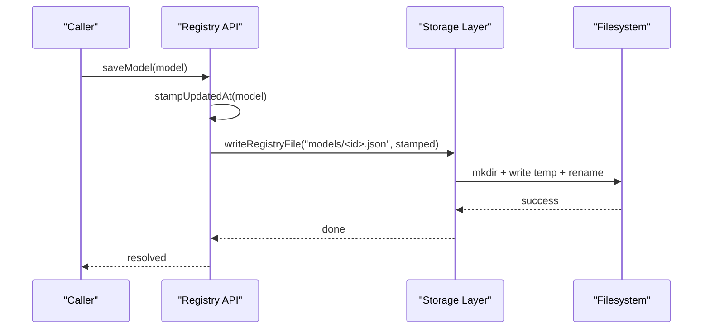
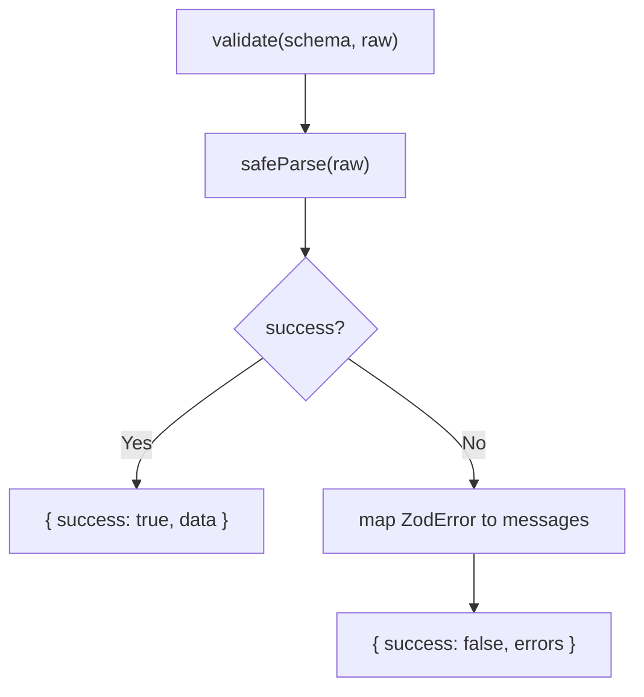
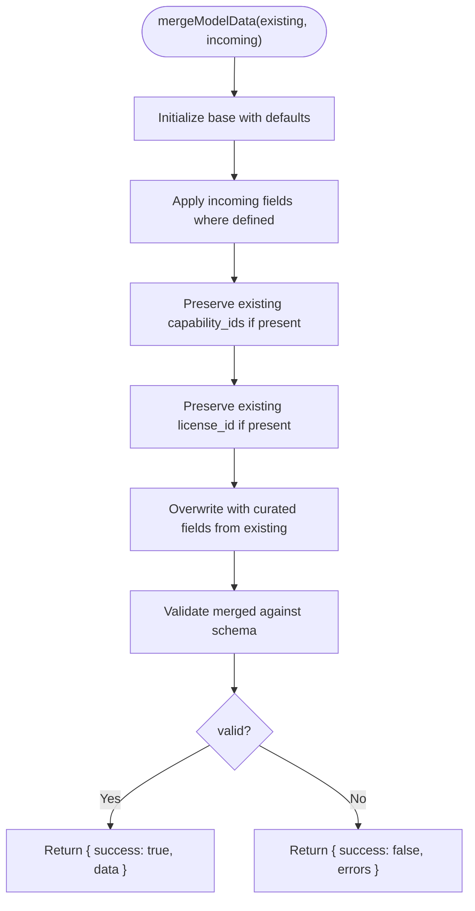
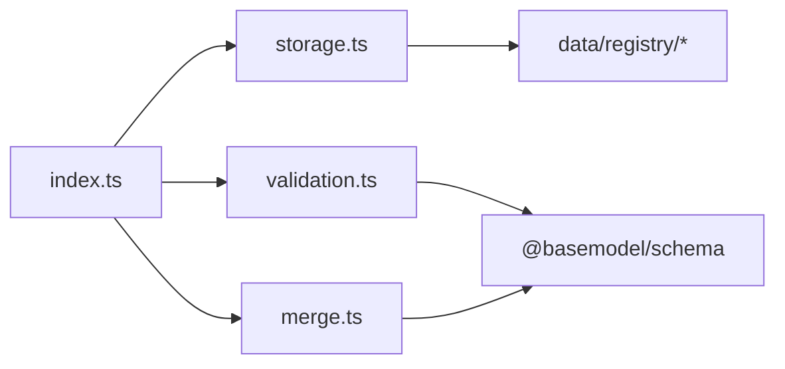

# Registry Storage

<cite>
**Referenced Files in This Document**
- [storage.ts](file://packages/registry/src/storage.ts)
- [index.ts](file://packages/registry/src/index.ts)
- [merge.ts](file://packages/registry/src/merge.ts)
- [validation.ts](file://packages/registry/src/validation.ts)
- [meta.json](file://data/registry/meta.json)
- [openai.json (provider)](file://data/registry/providers/openai.json)
- [gpt-4o.json (model)](file://data/registry/models/openai/gpt-4o.json)
- [text-generation.json (capability)](file://data/registry/capabilities/text-generation.json)
- [mit.json (license)](file://data/registry/licenses/mit.json)
- [openai.json (pricing)](file://data/registry/pricing/openai.json)
</cite>

## Table of Contents
1. Introduction
2. Project Structure
3. Core Components
4. Architecture Overview
5. Detailed Component Analysis
6. Dependency Analysis
7. Performance Considerations
8. Troubleshooting Guide
9. Conclusion

## Introduction
This document explains BaseModel’s registry storage system: how validated and normalized data is persisted in a canonical file-based format, how records are organized by providers and capabilities, and how versioning and updates are managed. It covers merge algorithms for updating existing records, conflict resolution strategies, data integrity maintenance, examples of registry structure, update procedures, backup/restore operations, scalability considerations for large registries, and concurrent access patterns.

## Project Structure
The registry uses a flat JSON-per-entity layout under data/registry with top-level directories for different entity types:
- providers: one JSON file per provider
- models: one JSON file per model, grouped by provider subdirectory
- capabilities: one JSON file per capability
- licenses: one JSON file per license
- pricing: one array JSON file per provider
- benchmarks: one array JSON file per source
- meta.json: generation metadata and coverage stats

**Diagram sources**
- [storage.ts](file://packages/registry/src/storage.ts)
- [index.ts](file://packages/registry/src/index.ts)

**Section sources**
- [storage.ts](file://packages/registry/src/storage.ts)
- [index.ts](file://packages/registry/src/index.ts)
- [meta.json](file://data/registry/meta.json)
- [openai.json (provider)](file://data/registry/providers/openai.json)
- [gpt-4o.json (model)](file://data/registry/models/openai/gpt-4o.json)
- [text-generation.json (capability)](file://data/registry/capabilities/text-generation.json)
- [mit.json (license)](file://data/registry/licenses/mit.json)
- [openai.json (pricing)](file://data/registry/pricing/openai.json)

## Core Components
- File I/O layer: atomic writes, safe temp files, recursive directory listing, and batch reads.
- API surface: typed read/write helpers for providers, models, capabilities, licenses, pricing, and benchmarks.
- Validation: Zod-based schema validation without throwing; supports single and bulk validation.
- Merge logic: curated-field protection and default field initialization for model merges.

Key responsibilities:
- Canonical persistence: each entity is stored as a normalized JSON object or array.
- Versioning via timestamps: updated_at stamps on entities; meta.json tracks generation time and coverage.
- Integrity: strict schema validation before persisting; cross-entity relation checks during publishing.

**Section sources**
- [storage.ts](file://packages/registry/src/storage.ts)
- [index.ts](file://packages/registry/src/index.ts)
- [validation.ts](file://packages/registry/src/validation.ts)
- [merge.ts](file://packages/registry/src/merge.ts)

## Architecture Overview
The registry is a Node.js module that exposes typed APIs over a JSON file store. Data flows from collectors into the registry through save functions, which validate, stamp timestamps, and write atomically. Reads parse and validate on demand. Benchmarks and pricing use array rollups to reduce filesystem overhead.

**Diagram sources**
- [index.ts](file://packages/registry/src/index.ts)
- [storage.ts](file://packages/registry/src/storage.ts)
- [validation.ts](file://packages/registry/src/validation.ts)
- [merge.ts](file://packages/registry/src/merge.ts)

## Detailed Component Analysis

### Storage Layer
Responsibilities:
- Resolve registry root using environment override, directory walk-up, or fallback with warning.
- Atomic writes via temporary files and rename.
- Recursive enumeration of JSON files and batched reading.
- Benchmark rollup writer that preserves previous data for failed sources.

Concurrency and integrity:
- Atomic rename ensures readers never see partial writes.
- Temp filenames include process ID to avoid collisions.
- Directory creation is recursive to support nested model paths.

**Diagram sources**
- [storage.ts](file://packages/registry/src/storage.ts)

**Section sources**
- [storage.ts](file://packages/registry/src/storage.ts)

### API Surface (Read/Write)
- Providers: list all, get by id, save with timestamp.
- Models: list all, get by id (path derived from model_id), save with timestamp.
- Capabilities: list all.
- Licenses: list all, get by id.
- Pricing: list all arrays, save per-provider array with timestamps.
- Benchmarks: list all arrays, replace-all with rollup preserving non-refreshed sources.

Timestamping:
- stampUpdatedAt adds an ISO timestamp to entities upon save.

**Diagram sources**
- [index.ts](file://packages/registry/src/index.ts)
- [storage.ts](file://packages/registry/src/storage.ts)

**Section sources**
- [index.ts](file://packages/registry/src/index.ts)

### Validation
- Single-record validation returns either parsed data or structured errors.
- Bulk validation separates valid records from invalid ones with indices and errors.
- Used across all read/save paths to ensure schema compliance.

**Diagram sources**
- [validation.ts](file://packages/registry/src/validation.ts)

**Section sources**
- [validation.ts](file://packages/registry/src/validation.ts)

### Merge Logic for Model Updates
- Curated fields (e.g., description, family, release_date, architecture, parameter_size) are protected from overwrite by collector data.
- Defaults are applied for boolean flags and arrays when merging.
- Capability IDs and license IDs are preserved if already set.
- Final merged result is validated against the model schema.

**Diagram sources**
- [merge.ts](file://packages/registry/src/merge.ts)

**Section sources**
- [merge.ts](file://packages/registry/src/merge.ts)

### Data Organization and Examples
- Provider record example: openai.json contains provider metadata such as provider_id, name, organization, website, documentation, country, description, status, provider_type.
- Model record example: gpt-4o.json includes model_id, provider_id, name, family, version, release_date, description, architecture, context_window, modality, feature flags, limits, capability_ids, license_id, status, updated_at.
- Capability record example: text-generation.json defines capability_id, name, description.
- License record example: mit.json defines license_id, name, permissions, and URL.
- Pricing records: openai.json is an array of pricing entries with pricing_id, model_id, pricing_type, currency, unit, value, source, updated_at.
- Meta: meta.json captures generated_at, fatal flag, sources summary, coverage counts, and errors.

These files represent the canonical registry format used by the registry APIs.

**Section sources**
- [openai.json (provider)](file://data/registry/providers/openai.json)
- [gpt-4o.json (model)](file://data/registry/models/openai/gpt-4o.json)
- [text-generation.json (capability)](file://data/registry/capabilities/text-generation.json)
- [mit.json (license)](file://data/registry/licenses/mit.json)
- [openai.json (pricing)](file://data/registry/pricing/openai.json)
- [meta.json](file://data/registry/meta.json)

### Update Procedures
- Save single entities: call save* functions; they stamp timestamps and write atomically.
- Replace benchmark sets: replaceAllBenchmarks merges new rows with existing, preserving sources not refreshed this run.
- Replace pricing for a provider: savePricingRecords overwrites the provider’s pricing array with newly stamped records.

Conflict resolution:
- For models, curated fields win over incoming collector values.
- For benchmarks, per-source rollups keep previous data when a source fails to produce new rows.

**Section sources**
- [index.ts](file://packages/registry/src/index.ts)
- [storage.ts](file://packages/registry/src/storage.ts)
- [merge.ts](file://packages/registry/src/merge.ts)

### Backup and Restore Operations
Backup:
- Copy the entire data/registry directory to preserve all entities and rollups.
- Optionally snapshot meta.json separately for quick provenance checks.

Restore:
- Replace data/registry with the backed-up copy.
- Ensure BASEMODEL_REGISTRY_PATH points to the restored directory if overridden.

Integrity after restore:
- Consumers should re-run validation and relation checks to confirm consistency.

[No sources needed since this section provides general operational guidance]

### Scalability Considerations
- File count: One-file-per-entity works well for moderate catalogs; benchmarks and pricing use array rollups to mitigate high file counts.
- Read performance: Batch reads enumerate directories and parse JSON; consider caching results in memory for hot paths.
- Write performance: Atomic writes are efficient; avoid frequent small writes by batching where possible.
- Large registries: Prefer array rollups for high-volume datasets; partition directories by provider/source to improve traversal speed.

[No sources needed since this section provides general guidance]

### Concurrent Access Patterns
- Atomic rename prevents readers from seeing partial writes.
- Multiple processes can safely read concurrently; writes serialize at the filesystem level via rename.
- Avoid concurrent writers to the same file; coordinate via external locking if multiple writers exist.

[No sources needed since this section provides general guidance]

## Dependency Analysis
The registry package composes three layers:
- API index exports typed operations and re-exports storage, validation, and merge utilities.
- Storage handles filesystem interactions and rollup logic.
- Validation enforces schemas; merge applies curated-field protection.

**Diagram sources**
- [index.ts](file://packages/registry/src/index.ts)
- [storage.ts](file://packages/registry/src/storage.ts)
- [validation.ts](file://packages/registry/src/validation.ts)
- [merge.ts](file://packages/registry/src/merge.ts)

**Section sources**
- [index.ts](file://packages/registry/src/index.ts)
- [storage.ts](file://packages/registry/src/storage.ts)
- [validation.ts](file://packages/registry/src/validation.ts)
- [merge.ts](file://packages/registry/src/merge.ts)

## Performance Considerations
- Use readAllFromDirectory/readAllArraysFromDirectory to minimize repeated IO.
- Cache parsed results in application memory for frequently accessed entities.
- Prefer array rollups for high-volume datasets like benchmarks and pricing.
- Avoid unnecessary re-writes; only update files when data changes.

[No sources needed since this section provides general guidance]

## Troubleshooting Guide
Common issues:
- Missing registry path: If BASEMODEL_REGISTRY_PATH points to a nonexistent directory, initialization throws an error.
- Partial writes: Should not occur due to atomic rename; verify filesystem permissions and disk space.
- Validation failures: Check schema mismatches; use validateMany to collect row-level errors.
- Orphaned references: Cross-entity relation checks during publishing warn about pricing referencing unknown models.

Operational tips:
- Inspect meta.json for generation timestamps and error summaries.
- Compare updated_at fields to detect stale records.
- Re-run validation and relation checks after restores.

**Section sources**
- [storage.ts](file://packages/registry/src/storage.ts)
- [validation.ts](file://packages/registry/src/validation.ts)
- [meta.json](file://data/registry/meta.json)

## Conclusion
BaseModel’s registry storage system provides a robust, schema-validated, file-based persistence layer with atomic writes, curated-field protection, and efficient rollups for high-volume data. The design balances simplicity with reliability, making it suitable for both development and production environments. By following the update procedures, leveraging backups, and applying the scalability and concurrency recommendations, teams can maintain a consistent and performant registry.