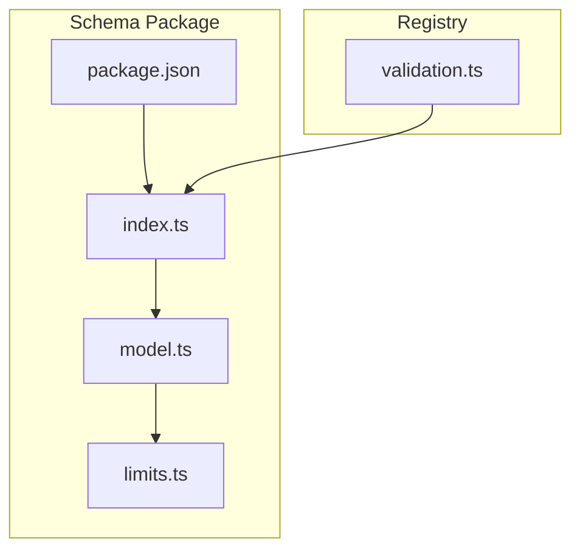
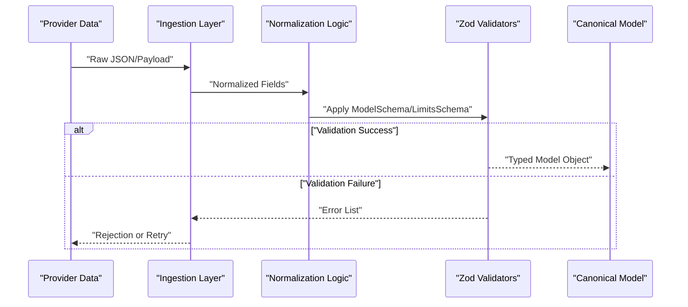
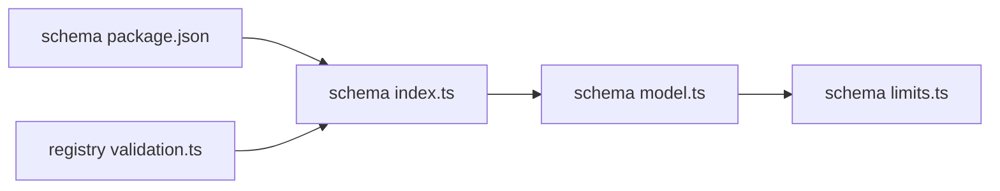

# Validation & Normalization

<cite>
**Referenced Files in This Document**
- [index.ts](file://packages/schema/src/index.ts)
- [model.ts](file://packages/schema/src/model.ts)
- [limits.ts](file://packages/schema/src/limits.ts)
- [validation.ts](file://packages/registry/src/validation.ts)
- [package.json](file://packages/schema/package.json)
</cite>

## Table of Contents
1. [Introduction](#introduction)
2. [Project Structure](#project-structure)
3. [Core Components](#core-components)
4. [Architecture Overview](#architecture-overview)
5. [Detailed Component Analysis](#detailed-component-analysis)
6. [Dependency Analysis](#dependency-analysis)
7. [Performance Considerations](#performance-considerations)
8. [Troubleshooting Guide](#troubleshooting-guide)
9. [Conclusion](#conclusion)

## Introduction
This document explains BaseModel’s validation and normalization pipeline for transforming raw provider data into consistent, canonical model representations. It focuses on how Zod schemas enforce type checking and constraints, how normalization strategies reconcile different provider formats, and how the system produces stable, typed outputs suitable for downstream consumers. The goal is to make the pipeline understandable for both developers and non-technical readers while providing concrete guidance on schema design, error handling, and performance optimization.

## Project Structure
The validation and normalization logic centers around a dedicated schema package that defines canonical Zod schemas and TypeScript types. A registry component consumes these schemas to validate and normalize incoming provider payloads.

**Diagram sources**
- [index.ts:1-27](file://packages/schema/src/index.ts#L1-L27)
- [model.ts:1-65](file://packages/schema/src/model.ts#L1-L65)
- [limits.ts:1-200](file://packages/schema/src/limits.ts#L1-L200)
- [package.json:1-48](file://packages/schema/package.json#L1-L48)
- [validation.ts:1-200](file://packages/registry/src/validation.ts#L1-L200)

**Section sources**
- [index.ts:1-27](file://packages/schema/src/index.ts#L1-L27)
- [model.ts:1-65](file://packages/schema/src/model.ts#L1-L65)
- [limits.ts:1-200](file://packages/schema/src/limits.ts#L1-L200)
- [package.json:1-48](file://packages/schema/package.json#L1-L48)
- [validation.ts:1-200](file://packages/registry/src/validation.ts#L1-L200)

## Core Components
- Canonical Schemas: The schema package exports Zod-based schemas and corresponding TypeScript types for core entities such as Model, Provider, Pricing, Capability, Benchmark, License, API, and Limits. These are the single source of truth for data contracts.
- Model Schema: Defines identifiers, core attributes, technical characteristics, capability flags, economics, relationships, status, and freshness fields with strict validation rules.
- Limits Schema: Provides constraints for rate limits, concurrency, token usage, and other operational boundaries.
- Registry Validation: Orchestrates validation and normalization by applying schemas to raw provider payloads, producing canonical model objects.

Key responsibilities:
- Type enforcement via Zod schemas
- Constraint validation (format, range, enum)
- Normalization from provider-specific formats to canonical structures
- Error aggregation and reporting
- Optional enrichment and transformation before final output

**Section sources**
- [index.ts:1-27](file://packages/schema/src/index.ts#L1-L27)
- [model.ts:1-65](file://packages/schema/src/model.ts#L1-L65)
- [limits.ts:1-200](file://packages/schema/src/limits.ts#L1-L200)
- [validation.ts:1-200](file://packages/registry/src/validation.ts#L1-L200)

## Architecture Overview
The pipeline follows a clear sequence: ingest raw payload, coerce and normalize fields, validate against canonical schemas, aggregate errors if any, and produce a typed, canonical model object.

[No sources needed since this diagram shows conceptual workflow, not actual code structure]

## Detailed Component Analysis

### Model Schema Validation Rules
The Model schema enforces:
- Identifier format: provider_id and model_id must match strict patterns ensuring canonical naming conventions.
- Core attributes: name is required; family/version/release_date are optional with date format validation.
- Technical characteristics: modality accepts a fixed set of values; context_window must be a positive integer.
- Capability flags: boolean flags for features like reasoning_support, function_calling, structured_output, vision_support, audio_support, image_generation, embedding_support.
- Economics and limits: optional tier and is_free; limits validated via ModelLimitsSchema.
- Relationships: arrays of IDs for capabilities and license_id.
- Status: restricted to active, preview, deprecated, discontinued.
- Freshness: updated_at timestamp for staleness detection.

These rules ensure that all model records conform to a consistent contract regardless of provider origin.

**Section sources**
- [model.ts:11-62](file://packages/schema/src/model.ts#L11-L62)

### Limits Schema Constraints
ModelLimitsSchema provides constraints for operational boundaries such as:
- Rate limiting (requests per minute/hour)
- Concurrency limits
- Token usage caps
- Feature-specific quotas

These constraints are applied during validation to prevent invalid configurations from entering the canonical model representation.

**Section sources**
- [limits.ts:1-200](file://packages/schema/src/limits.ts#L1-L200)

### Registry Validation Orchestration
The registry’s validation module coordinates:
- Parsing and coercion of provider payloads into intermediate forms
- Applying canonical schemas to validate structure and constraints
- Aggregating validation errors with contextual messages
- Returning normalized, typed model objects when valid

It acts as the bridge between heterogeneous provider data and the canonical BaseModel representation.

**Section sources**
- [validation.ts:1-200](file://packages/registry/src/validation.ts#L1-L200)

### Schema Export Surface
The schema package exposes a clean export surface for consumers:
- Types and schemas for Api, Benchmark, Capability, License, ModelLimits, Model, Pricing, Provider
- Utility constants for cost blending and weights

This ensures consistent imports and predictable behavior across the ecosystem.

**Section sources**
- [index.ts:10-27](file://packages/schema/src/index.ts#L10-L27)

## Dependency Analysis
The schema package depends on Zod for runtime validation and type inference. The registry validation module depends on the schema package to enforce contracts.

**Diagram sources**
- [package.json:1-48](file://packages/schema/package.json#L1-L48)
- [index.ts:1-27](file://packages/schema/src/index.ts#L1-L27)
- [model.ts:1-65](file://packages/schema/src/model.ts#L1-L65)
- [limits.ts:1-200](file://packages/schema/src/limits.ts#L1-L200)
- [validation.ts:1-200](file://packages/registry/src/validation.ts#L1-L200)

**Section sources**
- [package.json:1-48](file://packages/schema/package.json#L1-L48)
- [index.ts:1-27](file://packages/schema/src/index.ts#L1-L27)
- [model.ts:1-65](file://packages/schema/src/model.ts#L1-L65)
- [limits.ts:1-200](file://packages/schema/src/limits.ts#L1-L200)
- [validation.ts:1-200](file://packages/registry/src/validation.ts#L1-L200)

## Performance Considerations
To optimize validation and normalization operations:
- Reuse compiled Zod schemas: Instantiate schemas once at module load time and reuse them across requests to avoid repeated compilation overhead.
- Batch validations: Group multiple payloads and validate in batches to reduce per-request overhead where possible.
- Early exits: Fail fast on critical fields (e.g., identifiers) to avoid unnecessary processing.
- Caching normalized results: Cache canonical model objects keyed by stable identifiers (provider_id + model_id) to skip re-validation for identical inputs.
- Lazy enrichment: Defer expensive enrichment steps until they are actually needed by downstream consumers.
- Minimal transformations: Keep normalization transformations simple and deterministic to reduce CPU usage.

[No sources needed since this section provides general guidance]

## Troubleshooting Guide
Common issues and resolutions:
- Invalid identifier format: Ensure provider_id and model_id follow the required regex patterns. Check for unexpected characters or casing.
- Missing required fields: Verify presence of mandatory fields like name and modality array.
- Incorrect enum values: Confirm that status and modality use allowed values.
- Date format errors: Validate release_date matches ISO 8601 date format.
- Limits violations: Review ModelLimitsSchema constraints for rate limits and quotas.
- Error aggregation: Inspect validation error lists to identify specific failing fields and messages.

Best practices:
- Log validation failures with contextual field names and expected formats.
- Provide actionable error messages to callers for quick remediation.
- Use test fixtures covering edge cases (empty strings, nulls, unexpected types).

**Section sources**
- [model.ts:11-62](file://packages/schema/src/model.ts#L11-L62)
- [limits.ts:1-200](file://packages/schema/src/limits.ts#L1-L200)
- [validation.ts:1-200](file://packages/registry/src/validation.ts#L1-L200)

## Conclusion
BaseModel’s validation and normalization pipeline leverages Zod schemas to enforce strict contracts, transform heterogeneous provider data into canonical model representations, and provide robust error handling. By centralizing schema definitions and orchestrating validation through the registry, the system ensures consistency, reliability, and performance. Adopting the recommended optimization techniques and troubleshooting practices will help maintain high throughput and accuracy in production environments.