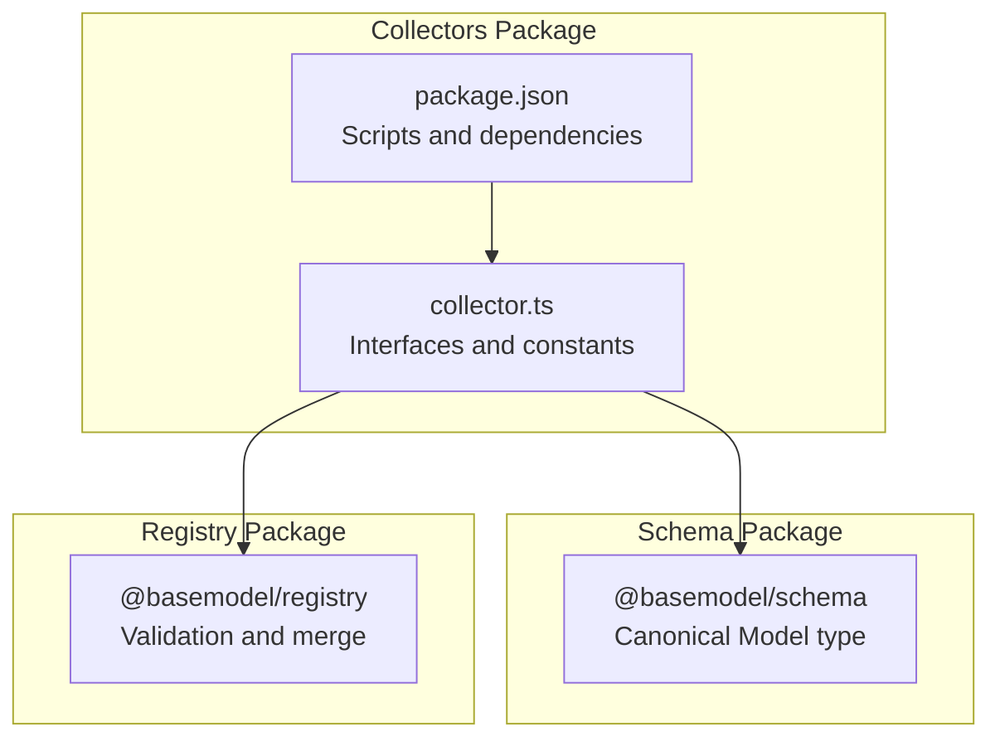
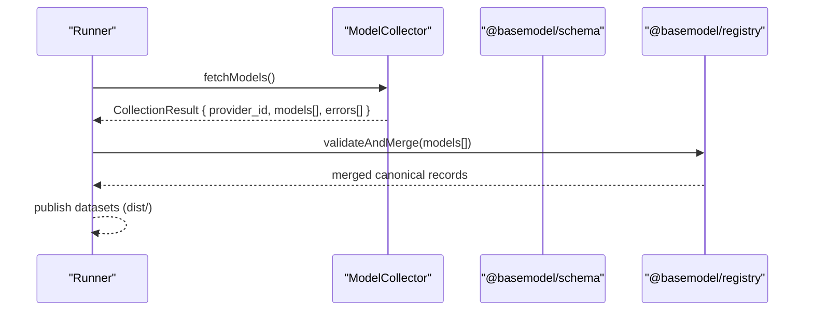
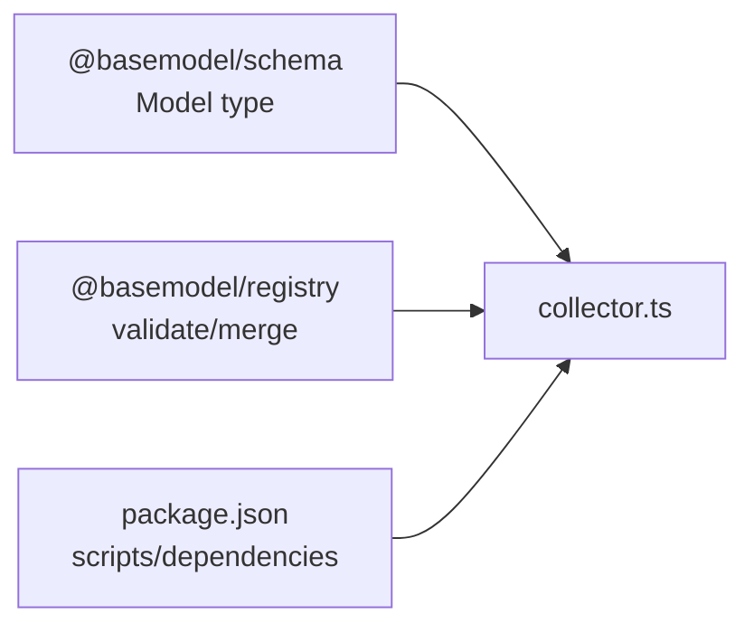

# Collector Interface & Contract

<cite>
**Referenced Files in This Document**
- [collector.ts](file://packages/collectors/src/core/collector.ts)
- [package.json](file://packages/collectors/package.json)
- [README.md](file://README.md)
- [CONTRIBUTING.md](file://CONTRIBUTING.md)
- [05_Data_Model.md](file://docs/05_Data_Model.md)
</cite>

## Table of Contents
1. [Introduction](#introduction)
2. [Project Structure](#project-structure)
3. [Core Components](#core-components)
4. [Architecture Overview](#architecture-overview)
5. [Detailed Component Analysis](#detailed-component-analysis)
6. [Dependency Analysis](#dependency-analysis)
7. [Performance Considerations](#performance-considerations)
8. [Troubleshooting Guide](#troubleshooting-guide)
9. [Conclusion](#conclusion)
10. [Appendices](#appendices)

## Introduction
This document defines the collector interface contract used by BaseModel’s discovery layer. It explains the core interfaces that collectors must implement, including data collection methods, error handling patterns, and response formats. It also documents required fields, validation rules, type definitions, and how collectors integrate with the schema layer to ensure data consistency across providers and gateways.

## Project Structure
BaseModel organizes its code into packages:
- Schema package provides canonical types and Zod schemas.
- Collectors package implements provider-specific collectors and gateway plugins.
- Registry package stores, validates, and merges normalized records.
- Publisher generates static datasets consumed downstream.

The collector contract lives in the collectors package and relies on shared types from the schema package.

**Diagram sources**
- [collector.ts](file://packages/collectors/src/core/collector.ts)
- [package.json](file://packages/collectors/package.json)

**Section sources**
- [README.md](file://README.md)
- [package.json](file://packages/collectors/package.json)

## Core Components
The collector contract centers around a small set of TypeScript interfaces and constants that define how collectors operate and what they return.

Key elements:
- CollectionResult: standardized output for any collector or custom gateway.
- ModelCollector: interface for provider-specific collectors.
- PricingSourceSpec: declarative configuration for OpenAI-compatible pricing catalogs.
- SimpleGateway and CustomGateway: supported gateway plugin shapes.
- GatewayPlugin and GatewayDescriptor: union and serializable descriptor types.

These components enforce consistent input/output contracts and enable safe execution of custom logic in isolated workers.

**Section sources**
- [collector.ts](file://packages/collectors/src/core/collector.ts)

## Architecture Overview
Collectors fetch raw provider data, normalize it into Partial<Model>, and return errors alongside successful results. The registry then validates and merges these partial records into canonical datasets.

**Diagram sources**
- [collector.ts](file://packages/collectors/src/core/collector.ts)
- [README.md](file://README.md)

## Detailed Component Analysis

### CollectionResult
Defines the standard response shape returned by collectors and custom gateways.

- provider_id: string identifying the source provider or gateway.
- models: array of Partial<Model> representing normalized model records.
- errors: array of human-readable error messages encountered during collection.

Validation and error handling:
- Errors are collected but do not abort the entire run; partial success is allowed.
- Each model should be validated against the schema before merging.

Return value structure:
- Always include provider_id even if no models were found.
- Return an empty models array when there are no valid records.
- Populate errors with actionable messages for debugging and auditing.

**Section sources**
- [collector.ts](file://packages/collectors/src/core/collector.ts)

### ModelCollector
Interface for provider-specific collectors.

Required fields:
- providerId: unique identifier for the provider this collector serves.

Methods:
- fetchModels(): returns a Promise resolving to CollectionResult.

Implementation guidelines:
- Normalize provider-specific responses into Partial<Model>.
- Ensure provider_id matches providerId.
- Aggregate all non-fatal issues into errors without throwing.

Example implementation pattern:
- Implement fetchModels to call provider APIs, parse responses, map fields to Partial<Model>, and collect errors.
- Validate each record using schema validators before returning.

**Section sources**
- [collector.ts](file://packages/collectors/src/core/collector.ts)

### PricingSourceSpec
Declarative specification for fetching pricing catalogs from OpenAI-compatible endpoints.

Fields:
- url: optional catalog URL; defaults to base URL plus /models.
- auth: authentication mode; none or secret.
- itemsPath: dot-path to the catalog array; default data.
- idField: field holding model id; default id.
- inputPriceField: dot-path to input price; default input_price.
- outputPriceField: dot-path to output price; default output_price.
- contextField: field holding context length; default context_window.
- pricingUnit: unit of price fields; per-token or per-1m.

Usage:
- Configure enrich step to best-effort fetch pricing and attach to collected models.
- Minimal declaration requires only url when defaults match the provider’s shape.

**Section sources**
- [collector.ts](file://packages/collectors/src/core/collector.ts)

### SimpleGateway
Metadata for OpenAI-compatible gateways.

Fields:
- type: openai-compatible.
- id: unique provider or gateway identifier.
- baseUrl: base URL of the OpenAI-compatible endpoint.
- secretKeyName: approved secret name for API key.
- pricingSource: optional PricingSourceSpec.

Behavior:
- Used by the runner to construct requests and authenticate via configured secrets.
- Enrich step can use pricingSource to augment model records with pricing info.

**Section sources**
- [collector.ts](file://packages/collectors/src/core/collector.ts)

### CustomGateway
Metadata for custom collectors executed in an isolated worker.

Fields:
- type: custom.
- id: unique provider or gateway identifier.
- collect(secrets): function receiving only approved secrets and returning a Promise of CollectionResult.

Behavior:
- Isolated execution ensures security and stability.
- Must adhere to CollectionResult contract and handle errors gracefully.

**Section sources**
- [collector.ts](file://packages/collectors/src/core/collector.ts)

### GatewayPlugin and GatewayDescriptor
Union and serializable descriptor types for gateway plugins.

- GatewayPlugin: union of SimpleGateway and CustomGateway.
- GatewayDescriptor: serializable subset used to pass metadata between processes safely.

Purpose:
- Enables dynamic loading and execution of gateway plugins without importing their implementations directly.

**Section sources**
- [collector.ts](file://packages/collectors/src/core/collector.ts)

### Constants and Limits
- MAX_PLUGIN_MODELS: maximum number of models a plugin may return.
- MAX_PLUGIN_RESPONSE_BYTES: maximum size of plugin response payload.

Rationale:
- Prevents resource exhaustion and ensures predictable performance.

**Section sources**
- [collector.ts](file://packages/collectors/src/core/collector.ts)

## Dependency Analysis
Collectors depend on:
- @basemodel/schema for canonical Model type and validation.
- @basemodel/registry for storage, validation, and merging.

The collectors package exposes scripts for running collection, enrichment, verification, and tests.

**Diagram sources**
- [collector.ts](file://packages/collectors/src/core/collector.ts)
- [package.json](file://packages/collectors/package.json)

**Section sources**
- [package.json](file://packages/collectors/package.json)

## Performance Considerations
- Respect MAX_PLUGIN_MODELS and MAX_PLUGIN_RESPONSE_BYTES to avoid memory pressure.
- Prefer streaming or pagination where possible to reduce payload sizes.
- Validate early and fail fast on malformed inputs to minimize wasted work.
- Use partial normalization to defer expensive transformations until after validation.

[No sources needed since this section provides general guidance]

## Troubleshooting Guide
Common issues and resolutions:
- Empty models array with errors populated: review error messages and adjust mapping logic.
- Provider mismatch: ensure provider_id matches providerId.
- Validation failures: confirm Partial<Model> fields conform to schema expectations.
- Secret misconfiguration: verify secretKeyName and auth settings for gateways.

Operational tips:
- Use the verify script to test individual collectors.
- Run enrichment separately to isolate pricing-related issues.

**Section sources**
- [collector.ts](file://packages/collectors/src/core/collector.ts)
- [package.json](file://packages/collectors/package.json)

## Conclusion
The collector interface contract in BaseModel enforces a clear, consistent, and extensible pattern for discovering and normalizing AI model data. By adhering to CollectionResult, ModelCollector, and gateway plugin specifications, collectors integrate seamlessly with the schema and registry layers, ensuring data quality and provider neutrality.

[No sources needed since this section summarizes without analyzing specific files]

## Appendices

### Data Model Integration
- Collectors produce Partial<Model> records aligned with the canonical schema.
- The registry validates and merges these records into stable datasets.
- Consumers rely on published datasets for consistent model information.

For detailed schema definitions and data model conventions, refer to the data model documentation.

**Section sources**
- [05_Data_Model.md](file://docs/05_Data_Model.md)

### Adding New Providers or Gateways
- Implement ModelCollector or CustomGateway according to the contract.
- Register secrets and update gateway-secrets as needed.
- Add tests covering happy path and failure scenarios.
- Update relevant documentation when integration surfaces change.

**Section sources**
- [CONTRIBUTING.md](file://CONTRIBUTING.md)