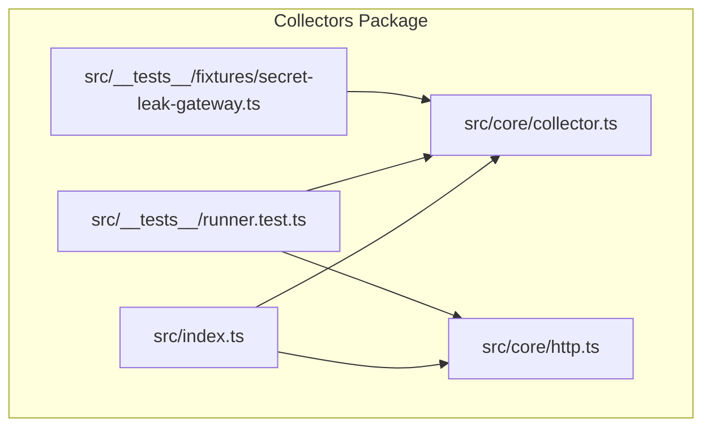
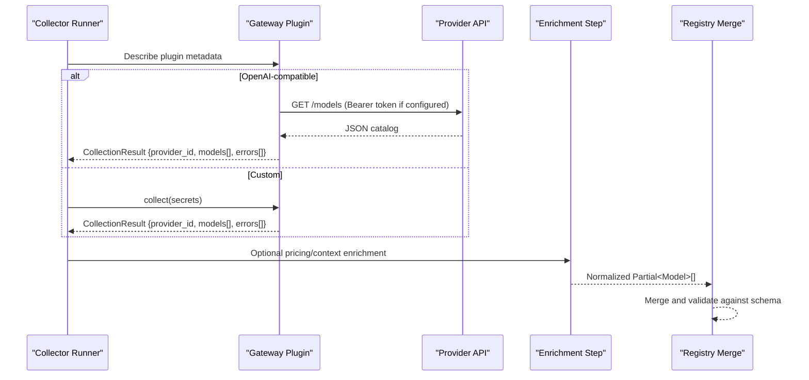
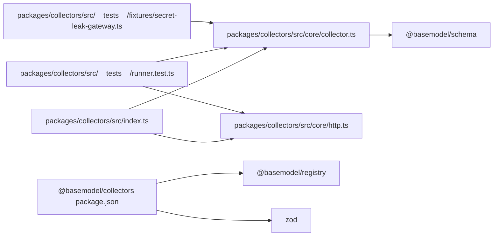

# Custom Collectors Development

<cite>
**Referenced Files in This Document**
- [README.md](file://README.md)
- [package.json](file://packages/collectors/package.json)
- [index.ts](file://packages/collectors/src/index.ts)
- [collector.ts](file://packages/collectors/src/core/collector.ts)
- [http.ts](file://packages/collectors/src/core/http.ts)
- [runner.test.ts](file://packages/collectors/src/__tests__/runner.test.ts)
- [secret-leak-gateway.ts](file://packages/collectors/src/__tests__/fixtures/secret-leak-gateway.ts)
</cite>

## Table of Contents
1. [Introduction](#introduction)
2. [Project Structure](#project-structure)
3. [Core Components](#core-components)
4. [Architecture Overview](#architecture-overview)
5. [Detailed Component Analysis](#detailed-component-analysis)
6. [Dependency Analysis](#dependency-analysis)
7. [Performance Considerations](#performance-considerations)
8. [Troubleshooting Guide](#troubleshooting-guide)
9. [Conclusion](#conclusion)
10. [Appendices](#appendices)

## Introduction
This document explains how to develop custom collectors for BaseModel’s data discovery layer. It focuses on the collector interface contract, data collection patterns, error handling strategies, and best practices for provider-specific implementations. You will learn how to implement OpenAI-compatible gateway integrations, write custom collectors that run in isolated workers, handle rate limiting and authentication safely, and transform upstream responses into normalized records compatible with the schema layer. Guidance is provided for testing collectors and maintaining compatibility with the registry and enrichment pipeline.

## Project Structure
The collectors package provides:
- Core interfaces and types for collectors and gateways
- Shared HTTP utilities for resilient fetching
- Test fixtures and runner tests demonstrating behavior
- Scripts for running collection, verification, and enrichment

**Diagram sources**
- [index.ts:1-2](file://packages/collectors/src/index.ts#L1-L2)
- [collector.ts:1-89](file://packages/collectors/src/core/collector.ts#L1-L89)
- [http.ts:1-38](file://packages/collectors/src/core/http.ts#L1-L38)
- [runner.test.ts:105-159](file://packages/collectors/src/__tests__/runner.test.ts#L105-L159)
- [secret-leak-gateway.ts:1-13](file://packages/collectors/src/__tests__/fixtures/secret-leak-gateway.ts#L1-L13)

**Section sources**
- [README.md:1-61](file://README.md#L1-L61)
- [package.json:1-40](file://packages/collectors/package.json#L1-L40)
- [index.ts:1-2](file://packages/collectors/src/index.ts#L1-L2)

## Core Components
- CollectionResult: The normalized output shape returned by collectors, including provider_id, models (partial records), and errors.
- ModelCollector: Interface for provider-specific collectors exposing providerId and fetchModels().
- GatewayPlugin: Union type supporting two plugin modes:
  - SimpleGateway: Declarative configuration for OpenAI-compatible endpoints, including optional pricing source metadata.
  - CustomGateway: Full custom collection logic executed in an isolated worker with only approved secrets.
- PricingSourceSpec: Optional declarative catalog source used during enrichment to attach pricing and context window fields.
- GatewayDescriptor: Serializable metadata returned from the isolated worker process; plugins are never imported directly by the collector process.
- HTTP helpers: RETRYABLE_STATUSES and fetchWithRetry provide resilient, backoff-based retries for transient failures.

Key constraints and constants:
- MAX_PLUGIN_MODELS: Upper bound on models a plugin can return.
- MAX_PLUGIN_RESPONSE_BYTES: Upper bound on response payload size.

**Section sources**
- [collector.ts:1-89](file://packages/collectors/src/core/collector.ts#L1-L89)
- [http.ts:1-38](file://packages/collectors/src/core/http.ts#L1-L38)

## Architecture Overview
BaseModel’s collectors operate as a discovery layer that normalizes provider data into canonical records. Two primary integration patterns exist:
- OpenAI-compatible gateways: Configure baseUrl, secretKeyName, and optional pricingSource. The runtime calls the /models endpoint and maps results to Partial<Model>.
- Custom gateways: Provide a collect(secrets) function that returns CollectionResult. Execution occurs in an isolated worker with strict secret scoping.

**Diagram sources**
- [collector.ts:25-89](file://packages/collectors/src/core/collector.ts#L25-L89)
- [http.ts:1-38](file://packages/collectors/src/core/http.ts#L1-L38)
- [runner.test.ts:105-159](file://packages/collectors/src/__tests__/runner.test.ts#L105-L159)

## Detailed Component Analysis

### Collector Interface Contract
- CollectionResult must include:
  - provider_id: Stable identifier for the provider or gateway.
  - models: Array of Partial<Model> conforming to the schema layer.
  - errors: Human-readable messages describing non-fatal issues encountered during collection.
- ModelCollector exposes:
  - providerId: Unique identifier for the provider.
  - fetchModels(): Async method returning CollectionResult.

Best practices:
- Return partial records with only the fields you can reliably obtain.
- Populate errors with actionable hints rather than throwing exceptions for expected upstream issues.
- Respect MAX_PLUGIN_MODELS and MAX_PLUGIN_RESPONSE_BYTES to avoid oversized payloads.

**Section sources**
- [collector.ts:1-23](file://packages/collectors/src/core/collector.ts#L1-L23)

### OpenAI-Compatible Gateway Integration
- Define a SimpleGateway with:
  - id: Unique provider/gateway ID.
  - baseUrl: Base URL of the OpenAI-compatible endpoint.
  - secretKeyName: Approved secret name for the API key.
  - pricingSource (optional): Catalog URL and field mappings for enrich step.
- The runtime handles:
  - Authentication via Bearer token when configured.
  - Mapping the /models catalog to Partial<Model>.
  - Enrichment using pricingSource if provided.

Implementation tips:
- Ensure baseUrl points to a stable endpoint.
- Use secretKeyName that matches your secrets store naming convention.
- If pricingSource is present, verify itemsPath, idField, inputPriceField, outputPriceField, contextField, and pricingUnit align with the catalog shape.

**Section sources**
- [collector.ts:25-65](file://packages/collectors/src/core/collector.ts#L25-L65)

### Custom Gateway Implementation
- Define a CustomGateway with:
  - type: 'custom'
  - id: Unique provider/gateway ID
  - collect(secrets): Function returning CollectionResult
- Execution environment:
  - Runs in an isolated worker.
  - Only approved secrets are injected.
  - No direct imports of plugin code by the collector process.

Security considerations:
- Never log or expose secrets in errors or logs.
- Validate inputs and sanitize outputs before returning CollectionResult.
- Keep collect() deterministic and idempotent where possible.

Testing example reference:
- A fixture demonstrates returning errors that may contain secrets; ensure production implementations avoid leaking sensitive values.

**Section sources**
- [collector.ts:67-77](file://packages/collectors/src/core/collector.ts#L67-L77)
- [secret-leak-gateway.ts:1-13](file://packages/collectors/src/__tests__/fixtures/secret-leak-gateway.ts#L1-L13)

### Data Transformation Patterns
- Normalize upstream model entries into Partial<Model>:
  - Map provider-specific identifiers to consistent IDs.
  - Convert capabilities, context windows, and pricing fields to canonical shapes.
  - Omit unknown or unsupported fields rather than forcing incorrect values.
- Validation strategy:
  - Rely on the schema layer validation during merge to catch mismatches.
  - Pre-validate critical fields in the collector to fail fast.

**Section sources**
- [collector.ts:1-10](file://packages/collectors/src/core/collector.ts#L1-L10)

### Rate Limiting and Resilience
- Use fetchWithRetry for all external requests:
  - Retries on transient statuses (e.g., 429, 5xx).
  - Applies exponential-ish backoff per attempt.
  - Creates fresh timeout signals per attempt to avoid aborted attempts poisoning retries.
- Error reporting:
  - For non-retryable failures (e.g., 401 Unauthorized), include actionable hints in errors array.
  - Avoid swallowing errors silently; surface them for observability.

Test references:
- Tests demonstrate retry behavior on 429 and proper handling of unauthorized responses.

**Section sources**
- [http.ts:1-38](file://packages/collectors/src/core/http.ts#L1-L38)
- [runner.test.ts:105-159](file://packages/collectors/src/__tests__/runner.test.ts#L105-L159)

### Authentication Strategies
- OpenAI-compatible gateways:
  - Use secretKeyName to inject Bearer token automatically when configured.
- Custom gateways:
  - Receive only approved secrets via collect(secrets).
  - Apply provider-specific auth headers or query parameters as needed.
- Best practices:
  - Store secrets securely and rotate regularly.
  - Never embed credentials in code or logs.
  - Validate secret presence early and return clear errors if missing.

**Section sources**
- [collector.ts:55-77](file://packages/collectors/src/core/collector.ts#L55-L77)

### Enrichment and Pricing Sources
- Optional pricingSource enables automatic enrichment:
  - Fetches catalog from url (defaults to ${baseUrl}/models).
  - Maps idField, inputPriceField, outputPriceField, contextField, and pricingUnit.
- Enrichment runs best-effort; failures do not block collection.

**Section sources**
- [collector.ts:25-50](file://packages/collectors/src/core/collector.ts#L25-L50)

### Testing Collector Functionality
- Use the runner tests to validate:
  - Retry behavior on transient errors.
  - Fresh timeout signals per attempt.
  - Actionable error messages for non-retryable failures.
- Fixture examples:
  - Demonstrate custom gateway structure and error reporting patterns.

Recommended steps:
- Mock fetch to simulate upstream responses.
- Assert models length and errors content.
- Verify retry counts and signal independence.

**Section sources**
- [runner.test.ts:105-159](file://packages/collectors/src/__tests__/runner.test.ts#L105-L159)
- [secret-leak-gateway.ts:1-13](file://packages/collectors/src/__tests__/fixtures/secret-leak-gateway.ts#L1-L13)

## Dependency Analysis
The collectors package depends on:
- @basemodel/schema: Canonical types and Zod schemas for validation.
- @basemodel/registry: Storage, validation, and merge utilities.
- zod: Runtime validation library.

Internal dependencies:
- index.ts re-exports core types.
- core/collector.ts defines interfaces and constants.
- core/http.ts provides shared HTTP utilities.
- __tests__ includes runner tests and fixtures.

**Diagram sources**
- [index.ts:1-2](file://packages/collectors/src/index.ts#L1-L2)
- [collector.ts:1-89](file://packages/collectors/src/core/collector.ts#L1-L89)
- [http.ts:1-38](file://packages/collectors/src/core/http.ts#L1-L38)
- [runner.test.ts:105-159](file://packages/collectors/src/__tests__/runner.test.ts#L105-L159)
- [secret-leak-gateway.ts:1-13](file://packages/collectors/src/__tests__/fixtures/secret-leak-gateway.ts#L1-L13)
- [package.json:1-40](file://packages/collectors/package.json#L1-L40)

**Section sources**
- [package.json:1-40](file://packages/collectors/package.json#L1-L40)

## Performance Considerations
- Enforce MAX_PLUGIN_MODELS and MAX_PLUGIN_RESPONSE_BYTES to prevent memory pressure and slow merges.
- Prefer streaming or pagination where possible to reduce payload sizes.
- Use fetchWithRetry to minimize transient failures without overloading upstream APIs.
- Cache static catalog data during enrichment when feasible.
- Validate early to fail fast and avoid unnecessary network calls.

[No sources needed since this section provides general guidance]

## Troubleshooting Guide
Common issues and resolutions:
- Rate limiting (429):
  - Ensure fetchWithRetry is used; tests confirm retries occur with backoff.
- Authentication failures (401):
  - Check secretKeyName and secret availability; errors should include actionable hints.
- Oversized responses:
  - Respect MAX_PLUGIN_RESPONSE_BYTES; paginate or filter upstream results.
- Secret leakage in errors:
  - Review custom gateway implementations; avoid logging or returning secrets in errors.

Validation references:
- Tests assert retry behavior and error message content for unauthorized responses.
- Fixtures illustrate error reporting patterns; ensure production code avoids leaking secrets.

**Section sources**
- [runner.test.ts:105-159](file://packages/collectors/src/__tests__/runner.test.ts#L105-L159)
- [secret-leak-gateway.ts:1-13](file://packages/collectors/src/__tests__/fixtures/secret-leak-gateway.ts#L1-L13)

## Conclusion
Developing custom collectors in BaseModel involves implementing either OpenAI-compatible gateways or custom gateways that adhere to the collector interface contract. Use shared HTTP utilities for resilience, normalize data into Partial<Model>, and rely on the schema layer for validation. Follow security best practices for secrets, implement robust error handling, and leverage tests to validate behavior. With these patterns, you can integrate new AI model providers and gateways efficiently while maintaining compatibility with the registry and enrichment pipeline.

[No sources needed since this section summarizes without analyzing specific files]

## Appendices

### Step-by-Step: Creating a New Provider Collector
- Choose integration pattern:
  - OpenAI-compatible: Define SimpleGateway with baseUrl, secretKeyName, and optional pricingSource.
  - Custom: Implement CustomGateway with collect(secrets) returning CollectionResult.
- Implement data transformation:
  - Map upstream fields to Partial<Model>.
  - Handle capabilities, context windows, and pricing consistently.
- Add resilience:
  - Use fetchWithRetry for all network calls.
  - Report non-fatal issues in errors array.
- Test:
  - Mock upstream responses.
  - Assert models count and error messages.
  - Verify retry behavior and signal independence.

[No sources needed since this section provides general guidance]

### Schema Compatibility Checklist
- Ensure provider_id matches registry expectations.
- Validate Partial<Model> fields against schema definitions.
- Avoid introducing unsupported fields; prefer omitting unknowns.
- Confirm enrichment mapping aligns with pricingSource specifications.

[No sources needed since this section provides general guidance]