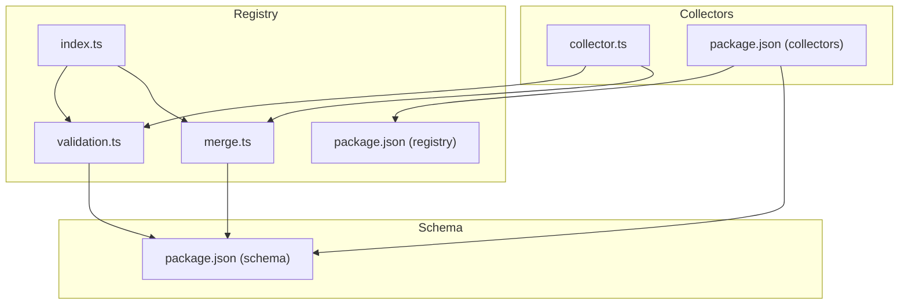
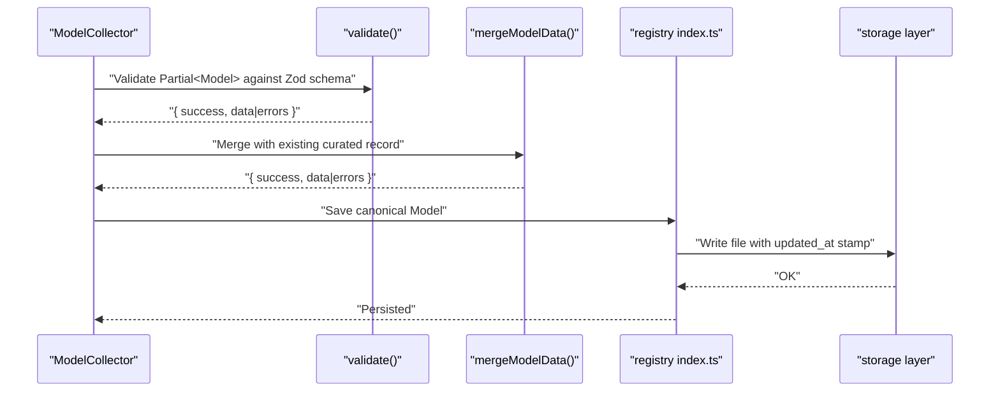
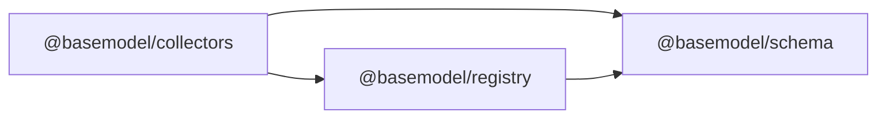

# Data Processing & Validation

<cite>
**Referenced Files in This Document**
- [README.md](file://README.md)
- [04_Pipeline.md](file://docs/04_Pipeline.md)
- [package.json (collectors)](file://packages/collectors/package.json)
- [collector.ts](file://packages/collectors/src/core/collector.ts)
- [validation.ts](file://packages/registry/src/validation.ts)
- [merge.ts](file://packages/registry/src/merge.ts)
- [index.ts (registry)](file://packages/registry/src/index.ts)
- [package.json (schema)](file://packages/schema/package.json)
</cite>

## Table of Contents
1. [Introduction](#introduction)
2. [Project Structure](#project-structure)
3. [Core Components](#core-components)
4. [Architecture Overview](#architecture-overview)
5. [Detailed Component Analysis](#detailed-component-analysis)
6. [Dependency Analysis](#dependency-analysis)
7. [Performance Considerations](#performance-considerations)
8. [Troubleshooting Guide](#troubleshooting-guide)
9. [Conclusion](#conclusion)

## Introduction
This document explains how data is processed and validated within BaseModel’s custom collectors, focusing on transforming raw provider data into BaseModel’s canonical format using Zod schemas, implementing validation rules, normalizing fields, handling errors, sanitizing inputs, and optimizing performance for batch processing. It also provides patterns for complex transformations and guidance for extending collectors safely.

## Project Structure
BaseModel organizes data processing across three key packages:
- Schema: Canonical Zod schemas and TypeScript types that define the target model shape.
- Registry: Validation helpers, merge utilities, and storage operations that enforce schema compliance and persist canonical records.
- Collectors: Provider-specific collectors that fetch, normalize, and validate data before it reaches the registry.

**Diagram sources**
- [collector.ts:1-23](file://packages/collectors/src/core/collector.ts#L1-L23)
- [validation.ts:1-42](file://packages/registry/src/validation.ts#L1-L42)
- [merge.ts:1-68](file://packages/registry/src/merge.ts#L1-L68)
- [index.ts (registry):1-169](file://packages/registry/src/index.ts#L1-L169)
- [package.json (collectors):1-40](file://packages/collectors/package.json#L1-L40)
- [package.json (registry):1-34](file://packages/registry/package.json#L1-L34)
- [package.json (schema):1-48](file://packages/schema/package.json#L1-L48)

**Section sources**
- [README.md:1-61](file://README.md#L1-L61)
- [04_Pipeline.md:1-38](file://docs/04_Pipeline.md#L1-L38)

## Core Components
- ModelCollector interface: Defines the contract for collectors to fetch and normalize provider models into Partial<Model> records with error tracking.
- Validation helpers: Provide non-throwing validation against Zod schemas and batch validation utilities.
- Merge utility: Safely merges incoming normalized collector data with curated existing records while preserving human-curated fields.
- Registry API: Reads/writes canonical records, stamps timestamps, and applies schema parsing for persistence.

Key responsibilities:
- Collectors transform raw provider payloads into Partial<Model>.
- Registry enforces schema compliance and merges with curated data.
- Storage persists canonical records with updated_at timestamps.

**Section sources**
- [collector.ts:1-23](file://packages/collectors/src/core/collector.ts#L1-L23)
- [validation.ts:1-42](file://packages/registry/src/validation.ts#L1-L42)
- [merge.ts:1-68](file://packages/registry/src/merge.ts#L1-L68)
- [index.ts (registry):1-169](file://packages/registry/src/index.ts#L1-L169)

## Architecture Overview
The pipeline follows a clear flow from collection through validation, normalization, merging, and storage.

**Diagram sources**
- [collector.ts:1-23](file://packages/collectors/src/core/collector.ts#L1-L23)
- [validation.ts:1-42](file://packages/registry/src/validation.ts#L1-L42)
- [merge.ts:1-68](file://packages/registry/src/merge.ts#L1-L68)
- [index.ts (registry):1-169](file://packages/registry/src/index.ts#L1-L169)

## Detailed Component Analysis

### Collector Contract and Normalization
- The ModelCollector interface defines providerId and fetchModels(), returning CollectionResult with partial models and errors.
- Collectors should:
  - Fetch raw provider data.
  - Normalize fields into Partial<Model>.
  - Validate each record using Zod via registry validation helpers.
  - Aggregate errors per run and return them alongside valid records.

Normalization guidelines:
- Map provider identifiers to canonical model_id and provider_id formats.
- Convert capability names to canonical strings recognized by schemas.
- Ensure pricing units and currency codes are standardized.
- Sanitize URLs, timestamps, and text fields (trim whitespace, remove control characters).

Complex transformation patterns:
- Flatten nested provider responses into flat Partial<Model>.
- Derive boolean flags (e.g., vision_support, function_calling) from capability lists.
- Compute derived fields like modality arrays based on supported features.

Batch processing patterns:
- Use validateMany to process large arrays of records, collecting valid and invalid entries separately.
- Apply rate limiting and concurrency controls when fetching from providers.
- Implement chunking to avoid memory spikes during large transformations.

Error handling strategies:
- Use safeParse-based validation to avoid throwing exceptions.
- Capture field-level errors with path information for debugging.
- Fail fast on critical schema violations; log warnings for optional field issues.

Sanitization techniques:
- Trim and lowercase string fields where appropriate.
- Remove or escape unsafe characters in free-text fields.
- Validate URL formats and timestamp ISO strings.

Performance considerations:
- Prefer streaming or chunked reads for large provider responses.
- Avoid unnecessary object cloning; use shallow merges where safe.
- Cache repeated lookups (e.g., capability mappings) to reduce CPU overhead.

**Section sources**
- [collector.ts:1-23](file://packages/collectors/src/core/collector.ts#L1-L23)
- [validation.ts:1-42](file://packages/registry/src/validation.ts#L1-L42)
- [04_Pipeline.md:1-38](file://docs/04_Pipeline.md#L1-L38)

### Validation Helpers and Batch Processing
- validate(schema, raw): Non-throwing validation returning structured results.
- validateMany(schema, records): Processes arrays, separating valid records from invalid ones with detailed errors.

Implementation highlights:
- Uses Zod’s safeParse to avoid runtime exceptions.
- Converts ZodError details into user-friendly error messages with dot-separated paths.
- Maintains original indices for invalid records to aid diagnostics.

Usage patterns:
- Validate single records before merging.
- Validate entire batches to separate good data from bad data efficiently.
- Integrate validation early in the collector pipeline to fail fast.

**Section sources**
- [validation.ts:1-42](file://packages/registry/src/validation.ts#L1-L42)

### Merge Utility and Curated Field Protection
- mergeModelData(existing, incoming): Merges normalized collector data with existing curated records.
- Curated fields (description, family, release_date, architecture, parameter_size) are protected from overwrites by automated runs.
- Capability IDs and license IDs are preserved if present in existing records.
- Final merged result is validated against ModelSchema before returning.

Design principles:
- Preserve human curation by prioritizing curated fields.
- Allow machine-collected facts to refresh observable attributes.
- Ensure final output conforms to canonical schema.

**Section sources**
- [merge.ts:1-68](file://packages/registry/src/merge.ts#L1-L68)

### Registry API and Persistence
- Provides read/write functions for providers, models, capabilities, benchmarks, pricing, APIs, and licenses.
- Applies schema.parse() for strict type enforcement on read operations.
- Stamps updated_at timestamps on persisted entities to track freshness.
- Supports atomic replacement of benchmark sets and provider-specific pricing arrays.

Operational flow:
- Read raw JSON files from registry directories.
- Parse and validate against corresponding schemas.
- Write canonical records back to disk with timestamps.

**Section sources**
- [index.ts (registry):1-169](file://packages/registry/src/index.ts#L1-L169)

### Schema Package and Canonical Types
- Defines Zod schemas and TypeScript types for all BaseModel entities.
- Used by registry and collectors to ensure consistent data shapes.
- Centralized schema definitions enable cross-package consistency and type safety.

Integration points:
- Collectors import types to normalize Partial<Model>.
- Registry imports schemas for validation and parsing.
- Publishers consume canonical types for dataset generation.

**Section sources**
- [package.json (schema):1-48](file://packages/schema/package.json#L1-L48)

## Dependency Analysis
The collectors depend on both schema and registry packages. The registry depends on schema for validation and storage for persistence.

**Diagram sources**
- [package.json (collectors):1-40](file://packages/collectors/package.json#L1-L40)
- [package.json (registry):1-34](file://packages/registry/package.json#L1-L34)
- [package.json (schema):1-48](file://packages/schema/package.json#L1-L48)

**Section sources**
- [package.json (collectors):1-40](file://packages/collectors/package.json#L1-L40)
- [package.json (registry):1-34](file://packages/registry/package.json#L1-L34)
- [package.json (schema):1-48](file://packages/schema/package.json#L1-L48)

## Performance Considerations
- Batch validation: Use validateMany to process large datasets efficiently without throwing exceptions.
- Concurrency control: Limit parallel requests to providers to avoid rate limits and resource exhaustion.
- Memory management: Process data in chunks to prevent memory spikes during large transformations.
- Caching: Cache static mappings (capability names, currency codes) to reduce redundant computations.
- Early validation: Validate records as soon as they are normalized to fail fast and reduce downstream processing.
- Streaming: For very large provider responses, consider streaming parsers to handle data incrementally.

[No sources needed since this section provides general guidance]

## Troubleshooting Guide
Common issues and resolutions:
- Validation failures: Check field paths in error messages from validate() to identify malformed fields.
- Missing required fields: Ensure Partial<Model> includes all required fields before merging.
- Curated field overwrites: Verify that mergeModelData preserves curated fields and does not allow automated runs to overwrite them.
- Timestamp formatting: Confirm that updated_at timestamps are ISO strings generated by stampUpdatedAt().
- Large response handling: Implement chunking and rate limiting in collectors to handle large provider responses gracefully.

Debugging tips:
- Log both valid and invalid records from validateMany to understand failure patterns.
- Inspect intermediate normalized objects before merging to verify field mappings.
- Use registry read functions to inspect stored records and confirm schema compliance.

**Section sources**
- [validation.ts:1-42](file://packages/registry/src/validation.ts#L1-L42)
- [merge.ts:1-68](file://packages/registry/src/merge.ts#L1-L68)
- [index.ts (registry):1-169](file://packages/registry/src/index.ts#L1-L169)

## Conclusion
BaseModel’s data processing and validation system provides a robust foundation for transforming raw provider data into canonical formats. By leveraging Zod schemas, non-throwing validation, safe merging with curated data, and efficient batch processing patterns, collectors can reliably normalize and validate data while maintaining high performance and data quality. Following the outlined patterns ensures consistency, reliability, and scalability across diverse provider integrations.

[No sources needed since this section summarizes without analyzing specific files]