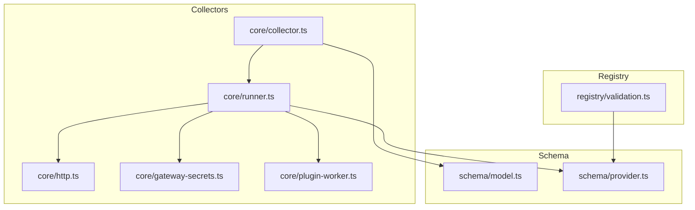
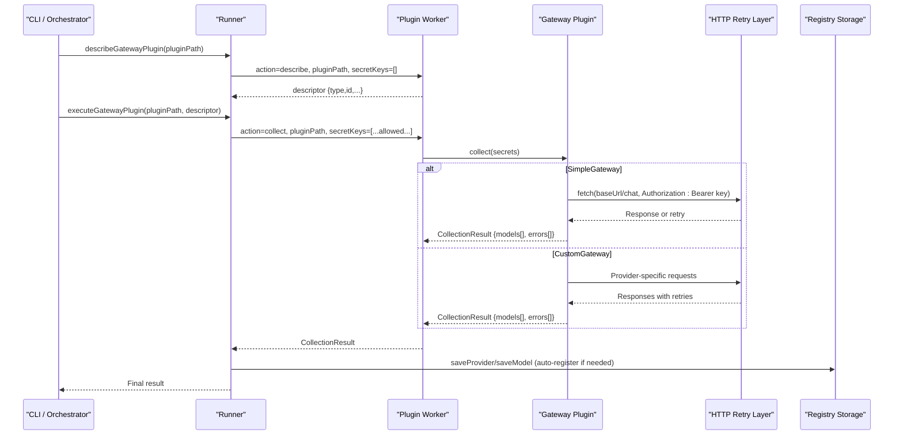
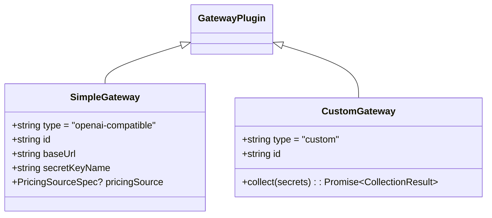
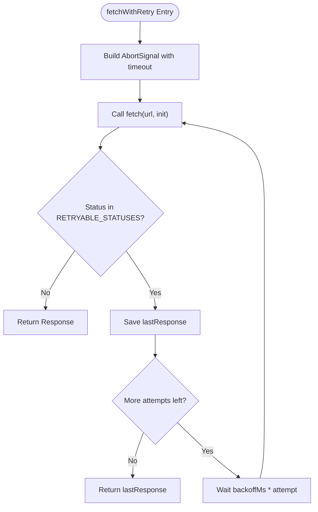
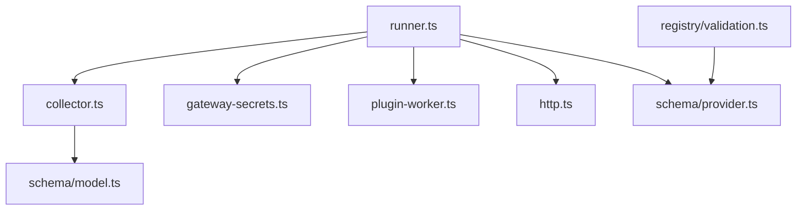

# Provider-Specific Implementation

<cite>
**Referenced Files in This Document**
- [README.md](file://README.md)
- [07_Developer_Access.md](file://docs/07_Developer_Access.md)
- [collector.ts](file://packages/collectors/src/core/collector.ts)
- [runner.ts](file://packages/collectors/src/core/runner.ts)
- [http.ts](file://packages/collectors/src/core/http.ts)
- [gateway-secrets.ts](file://packages/collectors/src/core/gateway-secrets.ts)
- [plugin-worker.ts](file://packages/collectors/src/core/plugin-worker.ts)
- [model.ts](file://packages/schema/src/model.ts)
- [provider.ts](file://packages/schema/src/provider.ts)
- [validation.ts](file://packages/registry/src/validation.ts)
- [google.test.ts](file://packages/collectors/src/__tests__/google.test.ts)
- [runner.test.ts](file://packages/collectors/src/__tests__/runner.test.ts)
</cite>

## Table of Contents
1. [Introduction](#introduction)
2. [Project Structure](#project-structure)
3. [Core Components](#core-components)
4. [Architecture Overview](#architecture-overview)
5. [Detailed Component Analysis](#detailed-component-analysis)
6. [Dependency Analysis](#dependency-analysis)
7. [Performance Considerations](#performance-considerations)
8. [Troubleshooting Guide](#troubleshooting-guide)
9. [Conclusion](#conclusion)
10. [Appendices](#appendices)

## Introduction
This document provides comprehensive guidance for implementing provider-specific collectors (gateways) that discover, authenticate to, and normalize model metadata from AI model providers. It covers authentication mechanisms, API integration patterns, data transformation strategies, rate limiting handling, retry logic, error recovery, and backward compatibility considerations. Step-by-step examples are included for popular providers such as OpenAI, Anthropic, and Google.

The collector system is designed around two plugin types:
- Simple openai-compatible gateways that call a standard chat/completions-like endpoint with Bearer token auth.
- Custom gateways that implement their own collection logic and return normalized model records.

All external HTTP calls go through a shared retry helper to ensure transient failures do not silently break nightly runs. Secrets are strictly scoped per gateway and injected only into the worker process that executes the plugin.

**Section sources**
- [README.md:11-17](file://README.md#L11-L17)
- [07_Developer_Access.md:105-113](file://docs/07_Developer_Access.md#L105-L113)

## Project Structure
The relevant parts of the repository for provider collectors include:
- packages/collectors: Gateway plugins and core runner infrastructure
- packages/schema: Canonical Zod schemas for Model and Provider entities
- packages/registry: Validation utilities used by tests and pipeline
- docs: Developer access and security documentation

**Diagram sources**
- [collector.ts](file://packages/collectors/src/core/collector.ts)
- [runner.ts](file://packages/collectors/src/core/runner.ts)
- [http.ts](file://packages/collectors/src/core/http.ts)
- [gateway-secrets.ts](file://packages/collectors/src/core/gateway-secrets.ts)
- [plugin-worker.ts](file://packages/collectors/src/core/plugin-worker.ts)
- [model.ts](file://packages/schema/src/model.ts)
- [provider.ts](file://packages/schema/src/provider.ts)
- [validation.ts](file://packages/registry/src/validation.ts)

**Section sources**
- [README.md:11-17](file://README.md#L11-L17)
- [07_Developer_Access.md:105-113](file://docs/07_Developer_Access.md#L105-L113)

## Core Components
- GatewayPlugin interface defines two supported plugin types:
  - SimpleGateway: OpenAI-compatible endpoints with baseUrl and secretKeyName
  - CustomGateway: Full custom collect(secrets) implementation returning normalized models
- Runner orchestrates loading descriptors, executing plugins in isolated workers, and saving results
- HTTP helpers provide fetchWithRetry with exponential backoff for transient statuses
- Secret registry maps each gateway to its allowed environment keys
- Plugin worker isolates execution and redacts secrets in logs

Key responsibilities:
- Authentication: Bearer tokens via Authorization header for simple gateways; custom headers or flows for custom gateways
- Data normalization: Transform provider responses into canonical Model schema fields
- Error handling: Collect actionable errors and avoid leaking secrets
- Rate limiting and retries: Automatic retry on 408/429/5xx with backoff and fresh timeout signals

**Section sources**
- [collector.ts:52-88](file://packages/collectors/src/core/collector.ts#L52-L88)
- [runner.ts:156-175](file://packages/collectors/src/core/runner.ts#L156-L175)
- [http.ts:1-37](file://packages/collectors/src/core/http.ts#L1-L37)
- [gateway-secrets.ts:1-26](file://packages/collectors/src/core/gateway-secrets.ts#L1-L26)
- [plugin-worker.ts:1-30](file://packages/collectors/src/core/plugin-worker.ts#L1-L30)

## Architecture Overview
The collector pipeline loads gateway plugins, describes them safely, executes collection in isolated workers, normalizes model data, and persists results. Provider metadata can be auto-registered if missing.

**Diagram sources**
- [runner.ts:156-175](file://packages/collectors/src/core/runner.ts#L156-L175)
- [runner.ts:247-331](file://packages/collectors/src/core/runner.ts#L247-L331)
- [http.ts:1-37](file://packages/collectors/src/core/http.ts#L1-L37)
- [collector.ts:52-88](file://packages/collectors/src/core/collector.ts#L52-L88)

## Detailed Component Analysis

### Gateway Plugin Interface and Execution
- SimpleGateway:
  - Requires id, baseUrl, secretKeyName, optional pricingSource
  - Runner injects Authorization header with Bearer token when apiKey is present
- CustomGateway:
  - Implements collect(secrets) returning CollectionResult with provider_id, models[], errors[]
  - Secrets are strictly limited to those registered in the secret registry for the gateway

Execution isolation:
- Plugins run in child_process.fork() workers
- Only approved secret keys are passed to the worker
- Logs are redacted to prevent secret leaks

**Diagram sources**
- [collector.ts:52-88](file://packages/collectors/src/core/collector.ts#L52-L88)

**Section sources**
- [collector.ts:52-88](file://packages/collectors/src/core/collector.ts#L52-L88)
- [plugin-worker.ts:1-30](file://packages/collectors/src/core/plugin-worker.ts#L1-L30)

### Authentication Mechanisms
- SimpleGateway uses Bearer token via Authorization header
- CustomGateway can implement any provider-specific auth flow (e.g., signing, OAuth, multi-key combos)
- Secret registry enforces allowed keys per gateway; unknown keys are rejected

Examples:
- OpenAI-compatible: set Authorization: Bearer OPENAI_API_KEY
- Google: require GOOGLE_AI_API_KEY
- Anthropic: require ANTHROPIC_API_KEY

**Section sources**
- [runner.ts:167-175](file://packages/collectors/src/core/runner.ts#L167-L175)
- [gateway-secrets.ts:1-26](file://packages/collectors/src/core/gateway-secrets.ts#L1-L26)
- [google.test.ts:18-22](file://packages/collectors/src/__tests__/google.test.ts#L18-L22)

### API Integration Patterns
- SimpleGateway pattern:
  - Construct headers with Accept and Authorization
  - Call baseUrl with standardized payload
  - Map response items to normalized Model fields
- CustomGateway pattern:
  - Use provider SDK or REST endpoints
  - Handle pagination, streaming, or batch endpoints as needed
  - Normalize fields to canonical Model schema

Normalization targets:
- model_id must follow "{provider_id}/{model-slug}"
- provider_id matches the gateway id
- Capability flags like vision_support, audio_support, embedding_support derived from API fields

**Section sources**
- [model.ts:11-65](file://packages/schema/src/model.ts#L11-L65)
- [google.test.ts:24-72](file://packages/collectors/src/__tests__/google.test.ts#L24-L72)

### Data Transformation Strategies
- Map provider-specific fields to canonical Model schema:
  - context_window from inputTokenLimit
  - modality inferred from supportedGenerationMethods
  - capability flags based on presence of features (vision, audio, embeddings)
- Validate outputs using canonical schemas before persisting
- Preserve original provider identifiers while adding normalized fields

Validation utilities:
- validate(schema, raw) returns success/data or errors
- validateMany(schema, records) batches validation and collects row-level errors

**Section sources**
- [model.ts:11-65](file://packages/schema/src/model.ts#L11-L65)
- [validation.ts:1-43](file://packages/registry/src/validation.ts#L1-L43)

### Rate Limiting Handling and Retry Logic
- Shared HTTP layer implements exponential backoff for transient statuses: 408, 429, 500, 502, 503, 504
- Each attempt gets a fresh AbortSignal.timeout to avoid signal poisoning
- Non-retryable errors (e.g., 401 Unauthorized) are surfaced as actionable hints

Behavior verified by tests:
- Retries on 429 and succeeds on subsequent attempt
- Each retry receives a new AbortSignal
- Non-retryable errors produce clear messages including guidance to check API key

**Diagram sources**
- [http.ts:1-37](file://packages/collectors/src/core/http.ts#L1-L37)

**Section sources**
- [http.ts:1-37](file://packages/collectors/src/core/http.ts#L1-L37)
- [runner.test.ts:105-145](file://packages/collectors/src/__tests__/runner.test.ts#L105-L145)

### Error Recovery Patterns
- Collect errors in CollectionResult.errors without leaking secrets
- Provide actionable hints for common issues (e.g., missing API key, unauthorized)
- Auto-register provider metadata on first successful collection if not already present
- Persist updated_at timestamps to track freshness

Provider auto-registration:
- If a provider does not exist, create minimal record with known info or defaults
- Never overwrite existing provider records in data/registry/providers

**Section sources**
- [runner.ts:333-363](file://packages/collectors/src/core/runner.ts#L333-L363)
- [runner.ts:247-331](file://packages/collectors/src/core/runner.ts#L247-L331)

### Step-by-Step Examples

#### OpenAI-Compatible Provider
- Define a SimpleGateway with baseUrl pointing to an OpenAI-compatible endpoint
- Ensure OPENAI_API_KEY is set in environment
- Runner will attach Authorization header automatically
- Normalize response fields to Model schema

Implementation references:
- SimpleGateway structure and usage
- Bearer token injection in headers

**Section sources**
- [collector.ts:52-65](file://packages/collectors/src/core/collector.ts#L52-L65)
- [runner.ts:167-175](file://packages/collectors/src/core/runner.ts#L167-L175)

#### Anthropic Provider
- Implement a CustomGateway with collect(secrets)
- Require ANTHROPIC_API_KEY from secrets
- Authenticate using provider’s preferred method (headers, signing)
- Normalize model list to canonical fields

Security note:
- Secrets are strictly scoped; only ANTHROPIC_API_KEY is injected

**Section sources**
- [gateway-secrets.ts:1-26](file://packages/collectors/src/core/gateway-secrets.ts#L1-L26)
- [collector.ts:71-77](file://packages/collectors/src/core/collector.ts#L71-L77)

#### Google Provider
- Implement a CustomGateway requiring GOOGLE_AI_API_KEY
- Fetch model catalog and map supportedGenerationMethods to capabilities
- Normalize model_id to google/{slug}, set modality arrays accordingly

Test coverage demonstrates:
- Missing key error message
- Parsing Gemini model list and mapping fields
- Reporting HTTP errors

**Section sources**
- [google.test.ts:18-22](file://packages/collectors/src/__tests__/google.test.ts#L18-L22)
- [google.test.ts:24-72](file://packages/collectors/src/__tests__/google.test.ts#L24-L72)
- [google.test.ts:74-85](file://packages/collectors/src/__tests__/google.test.ts#L74-L85)

### Provider-Specific Quirks, API Versioning, and Backward Compatibility
- Use versioned endpoints where available to reduce breaking changes
- Normalize provider-specific fields to canonical schema to insulate consumers
- Maintain capability flags and modality arrays consistently across providers
- For deprecated or discontinued models, set status accordingly
- Keep provider metadata stable; avoid fabricating website/documentation fields

Backward compatibility tips:
- Add new capability flags with defaults
- Preserve legacy identifiers in description or version fields if necessary
- Validate all outputs against canonical schemas to catch drift early

**Section sources**
- [model.ts:11-65](file://packages/schema/src/model.ts#L11-L65)
- [provider.ts:1-29](file://packages/schema/src/provider.ts#L1-L29)

## Dependency Analysis
The collector system has clear separation between orchestration, execution, networking, and data contracts:
- Runner depends on collector interfaces and secret registry
- HTTP layer abstracts retries and timeouts
- Schema package defines canonical contracts
- Registry validation supports testing and pipeline integrity

**Diagram sources**
- [runner.ts](file://packages/collectors/src/core/runner.ts)
- [collector.ts](file://packages/collectors/src/core/collector.ts)
- [gateway-secrets.ts](file://packages/collectors/src/core/gateway-secrets.ts)
- [plugin-worker.ts](file://packages/collectors/src/core/plugin-worker.ts)
- [http.ts](file://packages/collectors/src/core/http.ts)
- [model.ts](file://packages/schema/src/model.ts)
- [provider.ts](file://packages/schema/src/provider.ts)
- [validation.ts](file://packages/registry/src/validation.ts)

**Section sources**
- [runner.ts:156-175](file://packages/collectors/src/core/runner.ts#L156-L175)
- [http.ts:1-37](file://packages/collectors/src/core/http.ts#L1-L37)
- [validation.ts:1-43](file://packages/registry/src/validation.ts#L1-L43)

## Performance Considerations
- Use SimpleGateway for OpenAI-compatible providers to minimize overhead
- Batch model listings where possible to reduce network calls
- Leverage retry backoff to handle transient spikes without overloading providers
- Avoid unnecessary logging of large payloads or secrets
- Prefer streaming responses for large catalogs and parse incrementally

[No sources needed since this section provides general guidance]

## Troubleshooting Guide
Common issues and resolutions:
- Missing API key: Ensure the required environment variable is set for the gateway
- Unauthorized errors: Verify key validity and permissions; non-retryable errors surface actionable hints
- Rate limits: The retry layer handles 429 automatically; monitor backoff behavior
- Secret leaks: Confirm only registered keys are injected; logs are redacted in workers
- Stale provider records: Auto-registration updates freshness timestamps on successful collections

Verification steps:
- Run tests for specific gateways to validate parsing and error handling
- Inspect CollectionResult.errors for actionable messages
- Validate output against canonical schemas using registry validation utilities

**Section sources**
- [runner.test.ts:147-159](file://packages/collectors/src/__tests__/runner.test.ts#L147-L159)
- [google.test.ts:74-85](file://packages/collectors/src/__tests__/google.test.ts#L74-L85)
- [validation.ts:1-43](file://packages/registry/src/validation.ts#L1-L43)

## Conclusion
Implementing provider-specific collectors requires careful attention to authentication, normalization, and resilience. By leveraging the SimpleGateway and CustomGateway patterns, shared retry logic, and strict secret scoping, you can integrate with diverse AI model providers robustly. Adhering to canonical schemas ensures consistency and enables downstream intelligence pipelines to operate reliably across providers.

[No sources needed since this section summarizes without analyzing specific files]

## Appendices

### Canonical Data Models
- Model entity includes identifiers, technical characteristics, capability flags, economics, relationships, status, and freshness timestamp
- Provider entity includes identity, classification, optional URLs, and status

**Section sources**
- [model.ts:11-65](file://packages/schema/src/model.ts#L11-L65)
- [provider.ts:1-29](file://packages/schema/src/provider.ts#L1-L29)