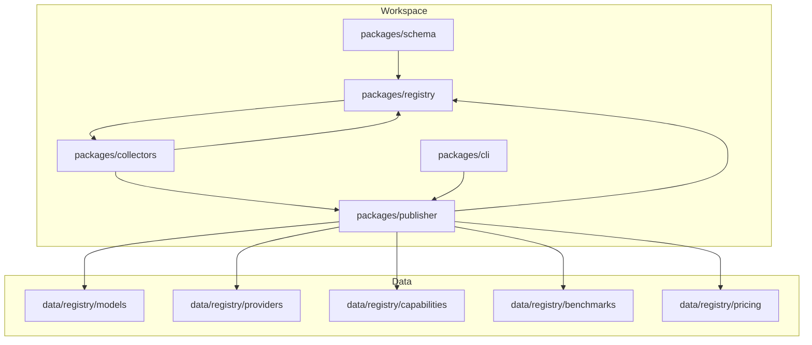
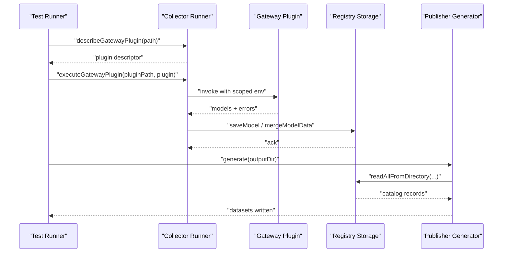
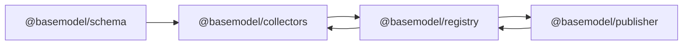

# Testing & Debugging Collectors

<cite>
**Referenced Files in This Document**
- [README.md](file://README.md)
- [package.json](file://packages/collectors/package.json)
- [e2e.test.ts](file://packages/collectors/src/__tests__/e2e.test.ts)
- [runner.test.ts](file://packages/collectors/src/__tests__/runner.test.ts)
- [benchmark-sources.test.ts](file://packages/collectors/src/__tests__/benchmark-sources.test.ts)
- [enrich.test.ts](file://packages/collectors/src/__tests__/enrich.test.ts)
- [generate.ts](file://packages/publisher/src/generate.ts)
- [dataset-contract.test.ts](file://packages/publisher/src/__tests__/dataset-contract.test.ts)
- [index.ts](file://packages/registry/src/index.ts)
</cite>

## Table of Contents
1. [Introduction](#introduction)
2. [Project Structure](#project-structure)
3. [Core Components](#core-components)
4. [Architecture Overview](#architecture-overview)
5. [Detailed Component Analysis](#detailed-component-analysis)
6. [Dependency Analysis](#dependency-analysis)
7. [Performance Considerations](#performance-considerations)
8. [Troubleshooting Guide](#troubleshooting-guide)
9. [Conclusion](#conclusion)
10. [Appendices](#appendices)

## Introduction
This document provides comprehensive testing and debugging guidance for custom collectors within the project. It covers unit testing strategies, integration testing approaches, mock data creation techniques, debugging tools, logging best practices, and performance profiling methods. It also includes examples of test cases across different scenarios, error conditions, and edge cases, along with troubleshooting guides and production monitoring recommendations for collector health.

## Project Structure
The collectors package is part of a multi-package workspace that includes schema, registry, publisher, intelligence, and CLI packages. The collectors package focuses on provider and gateway collectors, with tests organized under src/__tests__. The publisher package generates datasets from the registry, and its tests validate dataset contracts against real registry data.

**Section sources**
- [README.md:11-30](file://README.md#L11-L30)

## Core Components
- Collector runner and plugin execution: The runner orchestrates discovery, environment setup, secret scoping, and execution of gateway plugins. Tests verify normalization utilities, retry behavior, and error reporting.
- Enrichment pipeline: Normalizes pricing, tiers, and cross-source matching (OpenRouter, HuggingFace, provider catalogs). Tests cover classification, slug canonicalization, and propagation logic.
- Benchmark sources: Utilities normalize identifiers, dates, and scores for benchmark ingestion.
- Registry storage: Reads/writes catalog artifacts and validates schemas.
- Publisher generation: Produces final datasets and logs progress; contract tests ensure output integrity.

**Section sources**
- [runner.test.ts:14-45](file://packages/collectors/src/__tests__/runner.test.ts#L14-L45)
- [runner.test.ts:64-159](file://packages/collectors/src/__tests__/runner.test.ts#L64-L159)
- [enrich.test.ts:52-84](file://packages/collectors/src/__tests__/enrich.test.ts#L52-L84)
- [enrich.test.ts:86-255](file://packages/collectors/src/__tests__/enrich.test.ts#L86-L255)
- [enrich.test.ts:274-326](file://packages/collectors/src/__tests__/enrich.test.ts#L274-L326)
- [enrich.test.ts:328-466](file://packages/collectors/src/__tests__/enrich.test.ts#L328-L466)
- [enrich.test.ts:468-515](file://packages/collectors/src/__tests__/enrich.test.ts#L468-L515)
- [benchmark-sources.test.ts:10-26](file://packages/collectors/src/__tests__/benchmark-sources.test.ts#L10-L26)
- [benchmark-sources.test.ts:28-44](file://packages/collectors/src/__tests__/benchmark-sources.test.ts#L28-L44)
- [benchmark-sources.test.ts:46-60](file://packages/collectors/src/__tests__/benchmark-sources.test.ts#L46-L60)
- [index.ts:85-124](file://packages/registry/src/index.ts#L85-L124)
- [generate.ts:219-244](file://packages/publisher/src/generate.ts#L219-L244)

## Architecture Overview
The collector workflow involves discovering gateway plugins, creating a secure plugin environment, executing plugins to collect model metadata, normalizing IDs and slugs, enriching with pricing and tier information, and persisting results via the registry. The publisher then generates datasets from the registry.

**Diagram sources**
- [e2e.test.ts:33-91](file://packages/collectors/src/__tests__/e2e.test.ts#L33-L91)
- [runner.test.ts:64-159](file://packages/collectors/src/__tests__/runner.test.ts#L64-L159)
- [index.ts:85-124](file://packages/registry/src/index.ts#L85-L124)
- [generate.ts:219-244](file://packages/publisher/src/generate.ts#L219-L244)

## Detailed Component Analysis

### Unit Testing Strategies
- Isolation with mocks: Use Vitest’s vi.mock to stub external dependencies like file system operations and registry functions. This ensures deterministic tests without side effects.
- Parameterized tests: Employ it.each to validate normalization and transformation functions across multiple inputs efficiently.
- Contract assertions: Validate outputs against schema constraints to catch regressions early.

Examples:
- Mocking fs and @basemodel/registry for E2E isolation.
- Parameterized normalization of model slugs and IDs.
- Verifying retry behavior and error hints for HTTP failures.

**Section sources**
- [e2e.test.ts:12-31](file://packages/collectors/src/__tests__/e2e.test.ts#L12-L31)
- [runner.test.ts:14-45](file://packages/collectors/src/__tests__/runner.test.ts#L14-L45)
- [runner.test.ts:105-159](file://packages/collectors/src/__tests__/runner.test.ts#L105-L159)

### Integration Testing Approaches
- End-to-end pipeline validation: Execute the full collection flow with mocked network calls and filesystem writes to ensure correct orchestration.
- Real registry interaction: Contract tests run the generator against the actual registry to assert dataset validity and relational integrity.

Examples:
- E2E tests verifying graceful handling of missing or empty gateways directories and secret scoping.
- Dataset contract tests generating datasets and asserting structure and counts.

**Section sources**
- [e2e.test.ts:42-91](file://packages/collectors/src/__tests__/e2e.test.ts#L42-L91)
- [dataset-contract.test.ts:51-80](file://packages/publisher/src/__tests__/dataset-contract.test.ts#L51-L80)

### Mock Data Creation Techniques
- Sample builders: Create minimal model objects with defaults and overrides to represent typical and edge-case scenarios.
- Index structures: Build Map-based indexes for OpenRouter and HuggingFace sources to simulate catalog lookups.
- Pricing entries: Construct normalized pricing entries from various source formats to test parsing and matching logic.

Examples:
- sampleModel and sampleOpenRouter helpers.
- indexHuggingFace and indexPricingCatalog usage in tests.

**Section sources**
- [enrich.test.ts:19-50](file://packages/collectors/src/__tests__/enrich.test.ts#L19-L50)
- [enrich.test.ts:274-326](file://packages/collectors/src/__tests__/enrich.test.ts#L274-L326)
- [enrich.test.ts:328-466](file://packages/collectors/src/__tests__/enrich.test.ts#L328-L466)

### Debugging Tools and Logging Best Practices
- Structured logging: Use console.log for step markers during generation and collection runs to track progress and record counts.
- Error hints: Ensure non-retryable HTTP failures include actionable messages (e.g., API key checks).
- Secret scoping: Validate that only approved secrets are injected into plugin environments; reject results containing configured secrets.

Examples:
- Progress logs when writing benchmarks, pricing, and intelligence datasets.
- Assertions on error messages for unauthorized responses.
- Environment filtering for plugin workers.

**Section sources**
- [generate.ts:219-244](file://packages/publisher/src/generate.ts#L219-L244)
- [runner.test.ts:147-159](file://packages/collectors/src/__tests__/runner.test.ts#L147-L159)
- [e2e.test.ts:60-91](file://packages/collectors/src/__tests__/e2e.test.ts#L60-L91)

### Performance Profiling Methods
- Retry and timeout analysis: Verify each retry attempt uses a fresh AbortSignal to avoid lingering timeouts and resource leaks.
- Concurrency considerations: When running multiple collectors, monitor fetch call counts and response times to identify bottlenecks.
- Dataset generation timing: Measure time spent reading registry files and writing outputs to optimize batch operations.

Examples:
- Assertions on fetch call counts and signal freshness.
- Logs indicating record counts per dataset artifact.

**Section sources**
- [runner.test.ts:123-145](file://packages/collectors/src/__tests__/runner.test.ts#L123-L145)
- [generate.ts:219-244](file://packages/publisher/src/generate.ts#L219-L244)

### Test Cases for Scenarios, Errors, and Edge Cases
- Normalization edge cases: Slugs with special characters, fallbacks to default values, and idempotency checks.
- HTTP error handling: Transient 429 retries, non-retryable 401 errors with hints, and varied response shapes (array vs wrapper).
- Matching strategies: Exact ID matches, tilde community variants, region-stripped slugs, and free vs paid variant resolution.
- Pricing parsing: Numeric strings, nested fields, dot-paths, and free detection rules.

Examples:
- Slug normalization and ModelSchema acceptance.
- Retry behavior and error message content.
- OpenRouter and HuggingFace matching with regional variants.
- Provider pricing parsing and indexing.

**Section sources**
- [runner.test.ts:14-45](file://packages/collectors/src/__tests__/runner.test.ts#L14-L45)
- [runner.test.ts:64-159](file://packages/collectors/src/__tests__/runner.test.ts#L64-L159)
- [enrich.test.ts:86-255](file://packages/collectors/src/__tests__/enrich.test.ts#L86-L255)
- [enrich.test.ts:274-326](file://packages/collectors/src/__tests__/enrich.test.ts#L274-L326)
- [enrich.test.ts:328-466](file://packages/collectors/src/__tests__/enrich.test.ts#L328-L466)

## Dependency Analysis
Collectors depend on schema definitions and registry storage. Publisher depends on registry to read catalog artifacts and generate datasets. Tests isolate these dependencies using mocks and fixtures.

**Diagram sources**
- [package.json:26-30](file://packages/collectors/package.json#L26-L30)
- [index.ts:85-124](file://packages/registry/src/index.ts#L85-L124)

**Section sources**
- [package.json:26-30](file://packages/collectors/package.json#L26-L30)
- [index.ts:85-124](file://packages/registry/src/index.ts#L85-L124)

## Performance Considerations
- Network resilience: Implement retries for transient errors and ensure each retry has a fresh timeout signal to prevent resource contention.
- Efficient indexing: Use Map-based indexes for fast lookups by ID and slug, minimizing repeated parsing and string manipulation.
- Batch operations: Group registry reads and writes to reduce I/O overhead during dataset generation.

[No sources needed since this section provides general guidance]

## Troubleshooting Guide
- Missing or empty gateways directory: Ensure the runner handles gracefully without throwing; verify fs.existsSync and readdirSync mocks in tests.
- Secret leakage: Validate that only approved secrets are injected; reject plugin results containing configured secrets.
- HTTP failures: Check status codes and error messages; ensure actionable hints guide users to fix configuration issues.
- Dataset contract violations: Run contract tests to detect schema mismatches or missing relational integrity.

**Section sources**
- [e2e.test.ts:42-91](file://packages/collectors/src/__tests__/e2e.test.ts#L42-L91)
- [runner.test.ts:147-159](file://packages/collectors/src/__tests__/runner.test.ts#L147-L159)
- [dataset-contract.test.ts:51-80](file://packages/publisher/src/__tests__/dataset-contract.test.ts#L51-L80)

## Conclusion
Effective testing and debugging of custom collectors require isolated unit tests, robust integration tests, careful mock data creation, structured logging, and performance-aware design. By following the strategies and examples outlined here, you can ensure reliable collector behavior, maintain data quality, and quickly diagnose issues in both development and production environments.

[No sources needed since this section summarizes without analyzing specific files]

## Appendices

### Running Tests and Commands
- Install dependencies and run tests using workspace commands.
- Use package-specific scripts for collecting, verifying, and type-checking.

**Section sources**
- [README.md:42-56](file://README.md#L42-L56)
- [package.json:15-24](file://packages/collectors/package.json#L15-L24)