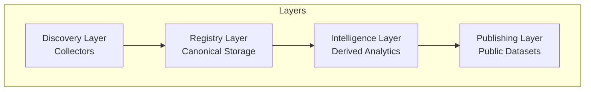
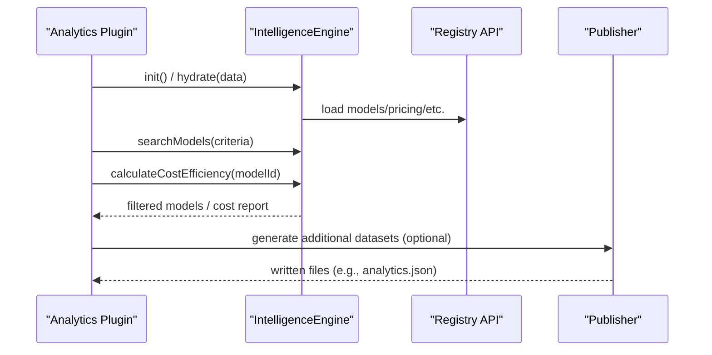
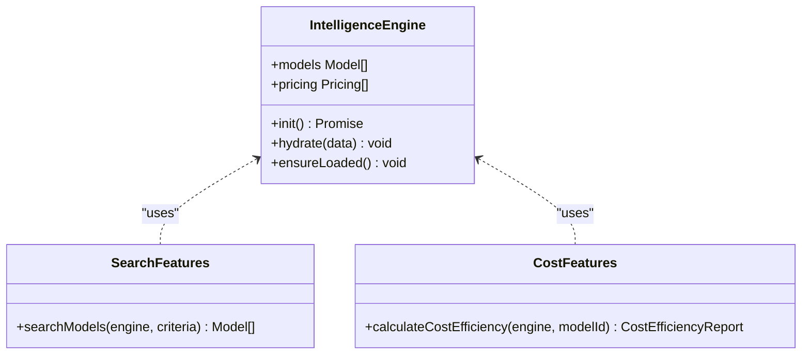
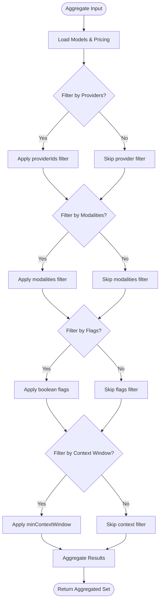
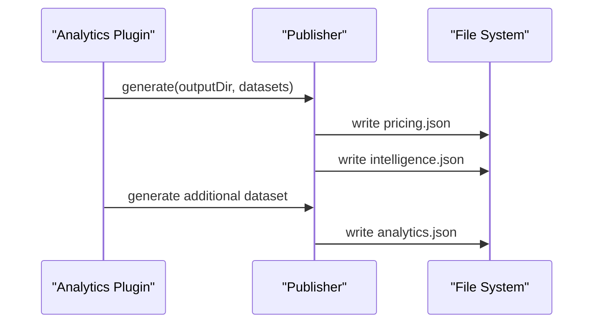
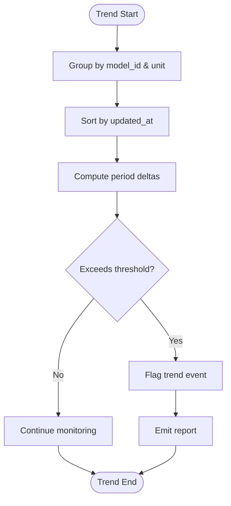
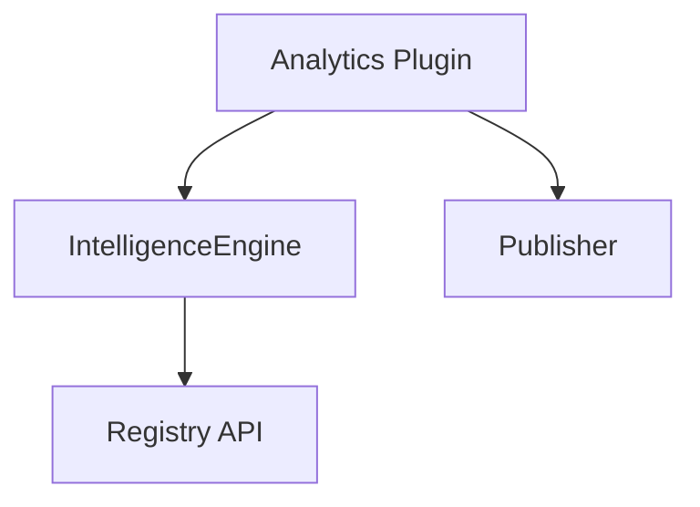

# Analytics Plugins

<cite>
**Referenced Files in This Document**
- [README.md](file://README.md)
- [03_Architecture.md](file://docs/03_Architecture.md)
- [04_Pipeline.md](file://docs/04_Pipeline.md)
- [05_Data_Model.md](file://docs/05_Data_Model.md)
- [07_Developer_Access.md](file://docs/07_Developer_Access.md)
- [08_Gateway_Plugin_Security.md](file://docs/08_Gateway_Plugin_Security.md)
- [generate.ts](file://packages/publisher/src/generate.ts)
- [index.ts](file://packages/publisher/src/index.ts)
- [collect.yml](file://.github/workflows/collect.yml)
- [cost.ts](file://packages/intelligence/src/features/cost.ts)
- [search.ts](file://packages/intelligence/src/features/search.ts)
- [intelligence.test.ts](file://packages/intelligence/src/__tests__/intelligence.test.ts)
- [registry index.ts](file://packages/registry/src/index.ts)
</cite>

## Table of Contents
1. [Introduction](#introduction)
2. [Project Structure](#project-structure)
3. [Core Components](#core-components)
4. [Architecture Overview](#architecture-overview)
5. [Detailed Component Analysis](#detailed-component-analysis)
6. [Dependency Analysis](#dependency-analysis)
7. [Performance Considerations](#performance-considerations)
8. [Troubleshooting Guide](#troubleshooting-guide)
9. [Conclusion](#conclusion)
10. [Appendices](#appendices)

## Introduction
This document explains how to build analytics plugins for BaseModel that operate over the canonical registry and intelligence layers. It covers the plugin architecture, data aggregation methods, reporting capabilities, and how to implement custom analytics functions such as trend analysis and comparative studies. It also provides examples for market share analysis, pricing trend detection, and capability evolution tracking, along with guidance on data collection strategies, statistical analysis methods, and visualization integration.

BaseModel is a data layer that discovers, validates, normalizes, stores, analyzes, and publishes structured knowledge about AI models. The repository organizes functionality into clear layers: discovery (collectors), registry (canonical storage), intelligence (derived analytics), and publishing (public datasets).

**Section sources**
- [README.md:1-61](file://README.md#L1-L61)

## Project Structure
BaseModel is organized as a monorepo with distinct packages:
- schema: Canonical Zod schemas and TypeScript types
- registry: Registry storage, validation, and merge utilities
- collectors: Provider and gateway collectors
- intelligence: Derived rankings, search, and recommendations
- publisher: Dataset generation for dist/
- cli: Command-line interface for querying intelligence

The pipeline automates nightly collection, validation, normalization, intelligence computation, and dataset publication.

**Diagram sources**
- [03_Architecture.md:1-77](file://docs/03_Architecture.md#L1-L77)

**Section sources**
- [README.md:10-30](file://README.md#L10-L30)
- [03_Architecture.md:1-77](file://docs/03_Architecture.md#L1-L77)

## Core Components
- IntelligenceEngine: Loads or hydrates registry data and exposes derived analytics APIs.
- Features:
  - searchModels: Filter models by provider, modality, flags, and context window.
  - calculateCostEfficiency: Compute blended cost and tier from pricing records.
- Registry API: Read/write canonical records for providers, models, capabilities, pricing, licenses, APIs, benchmarks.
- Publisher: Generates public JSON datasets including pricing.json and intelligence.json.

These components form the foundation for analytics plugins. Plugins can use the IntelligenceEngine to query normalized data and compute new metrics, then publish results via the publisher or export datasets.

**Section sources**
- [07_Developer_Access.md:1-113](file://docs/07_Developer_Access.md#L1-L113)
- [search.ts:1-52](file://packages/intelligence/src/features/search.ts#L1-L52)
- [cost.ts:31-86](file://packages/intelligence/src/features/cost.ts#L31-L86)
- [registry index.ts:124-168](file://packages/registry/src/index.ts#L124-L168)
- [generate.ts:219-244](file://packages/publisher/src/generate.ts#L219-L244)

## Architecture Overview
Analytics plugins integrate at two primary points:
- Intelligence Layer: Use IntelligenceEngine to perform computations over canonical data without modifying it.
- Publishing Layer: Optionally write derived datasets alongside existing ones.

**Diagram sources**
- [07_Developer_Access.md:35-61](file://docs/07_Developer_Access.md#L35-L61)
- [generate.ts:219-244](file://packages/publisher/src/generate.ts#L219-L244)

## Detailed Component Analysis

### IntelligenceEngine and Feature Functions
The IntelligenceEngine centralizes access to canonical data and exposes feature functions for analytics. Plugins should:
- Initialize or hydrate the engine with registry snapshots.
- Use searchModels to filter and aggregate model sets.
- Use calculateCostEfficiency to derive cost tiers and blended costs.

**Diagram sources**
- [intelligence.test.ts:1-150](file://packages/intelligence/src/__tests__/intelligence.test.ts#L1-L150)
- [search.ts:1-52](file://packages/intelligence/src/features/search.ts#L1-L52)
- [cost.ts:31-86](file://packages/intelligence/src/features/cost.ts#L31-L86)

**Section sources**
- [intelligence.test.ts:1-150](file://packages/intelligence/src/__tests__/intelligence.test.ts#L1-L150)
- [search.ts:1-52](file://packages/intelligence/src/features/search.ts#L1-L52)
- [cost.ts:31-86](file://packages/intelligence/src/features/cost.ts#L31-L86)

### Data Aggregation Methods
- Filtering: searchModels supports providerIds, modalities, flags, and minContextWindow.
- Pricing selection: calculateCostEfficiency selects per-1M token records using provenance priority and computes blended cost and tier.
- Registry reads: getAllPricing and related functions provide normalized pricing arrays.

**Diagram sources**
- [search.ts:1-52](file://packages/intelligence/src/features/search.ts#L1-L52)

**Section sources**
- [search.ts:1-52](file://packages/intelligence/src/features/search.ts#L1-L52)
- [cost.ts:31-86](file://packages/intelligence/src/features/cost.ts#L31-L86)
- [registry index.ts:124-168](file://packages/registry/src/index.ts#L124-L168)

### Reporting Capabilities
- Existing datasets include pricing.json and intelligence.json, generated by the publisher.
- Plugins can extend reporting by generating additional datasets (e.g., analytics.json) following the same pattern used for benchmarks, pricing, and intelligence outputs.

**Diagram sources**
- [generate.ts:219-244](file://packages/publisher/src/generate.ts#L219-L244)

**Section sources**
- [generate.ts:219-244](file://packages/publisher/src/generate.ts#L219-L244)

### Implementing Custom Analytics Functions
To implement custom analytics:
- Use IntelligenceEngine to load/hydrate canonical data.
- Compose searchModels filters to assemble relevant subsets.
- Derive metrics (e.g., counts, averages, percentiles) over models and pricing.
- Optionally persist results via the publisher or direct file writes.

Example patterns:
- Market Share Analysis: Count models per provider within a modality set; normalize to percentages.
- Pricing Trend Detection: Track changes in per-1M token values across time slices using updated_at timestamps.
- Capability Evolution Tracking: Monitor adoption of capability_ids over time by comparing snapshots.

**Section sources**
- [07_Developer_Access.md:35-61](file://docs/07_Developer_Access.md#L35-L61)
- [cost.ts:31-86](file://packages/intelligence/src/features/cost.ts#L31-L86)
- [search.ts:1-52](file://packages/intelligence/src/features/search.ts#L1-L52)

### Trend Analysis and Comparative Studies
- Trend Analysis:
  - Group pricing records by model_id and unit (per 1M tokens).
  - Sort by updated_at to compute deltas between periods.
  - Detect significant shifts using thresholds or statistical tests.
- Comparative Studies:
  - Use searchModels to select cohorts (provider, modality, flags).
  - Compare aggregated metrics (average cost, median context window, capability coverage).

[No sources needed since this diagram shows conceptual workflow, not actual code structure]

### Visualization Integration
- Consume published datasets (models.json, pricing.json, intelligence.json) directly.
- Transform raw data into chart-friendly formats (time series, bar charts, heatmaps).
- Integrate with dashboards or static sites by fetching dist/ artifacts.

**Section sources**
- [07_Developer_Access.md:80-103](file://docs/07_Developer_Access.md#L80-L103)

## Dependency Analysis
Analytics plugins depend on:
- IntelligenceEngine for data access and feature functions.
- Registry API for reading canonical records.
- Publisher for writing derived datasets.

**Diagram sources**
- [07_Developer_Access.md:35-61](file://docs/07_Developer_Access.md#L35-L61)
- [generate.ts:219-244](file://packages/publisher/src/generate.ts#L219-L244)

**Section sources**
- [07_Developer_Access.md:35-61](file://docs/07_Developer_Access.md#L35-L61)
- [generate.ts:219-244](file://packages/publisher/src/generate.ts#L219-L244)

## Performance Considerations
- Prefer hydrating the IntelligenceEngine with preloaded snapshots in environments without filesystem access to avoid repeated I/O.
- Use targeted searchModels filters to minimize result sets before computing aggregates.
- Cache intermediate aggregations when running multiple analytics over the same dataset.
- Batch writes when generating multiple output files through the publisher.

[No sources needed since this section provides general guidance]

## Troubleshooting Guide
- Missing pricing data:
  - calculateCostEfficiency returns Unknown tier when no pricing records exist for a model.
  - Ensure pricing records are present and normalized with per-1M units.
- Stale data:
  - Check updated_at fields on records and generated_at on datasets to detect freshness issues.
- Provenance conflicts:
  - When multiple pricing records exist, the intelligence layer picks deterministically by source priority. Verify expected provenance.

**Section sources**
- [cost.ts:31-86](file://packages/intelligence/src/features/cost.ts#L31-L86)
- [04_Pipeline.md:168-205](file://docs/04_Pipeline.md#L168-L205)

## Conclusion
BaseModel’s layered architecture enables robust analytics plugins that operate over canonical data without altering it. By leveraging IntelligenceEngine features and the publisher, developers can implement advanced analytics such as market share analysis, pricing trends, and capability evolution tracking. Adhering to the data model and pipeline governance ensures consistency, reproducibility, and trustworthiness of derived insights.

[No sources needed since this section summarizes without analyzing specific files]

## Appendices

### Example Scenarios

#### Market Share Analysis
- Define cohort by modality and status.
- Count models per provider; compute percentages.
- Output a summary dataset alongside existing ones.

#### Pricing Trend Detection
- Extract per-1M token pricing records grouped by model_id.
- Sort by updated_at; compute deltas between snapshots.
- Flag significant price changes based on thresholds.

#### Capability Evolution Tracking
- Track adoption of capability_ids across time slices.
- Compare counts and proportions per capability over time.
- Visualize growth curves and identify emerging capabilities.

[No sources needed since this section provides conceptual examples]

### Automation and Security Notes
- Nightly collection and regeneration are automated via GitHub Actions workflows.
- Gateway plugins run in isolated workers with restricted secrets; ensure any new secrets are registered and reviewed.

**Section sources**
- [collect.yml:1-48](file://.github/workflows/collect.yml#L1-L48)
- [08_Gateway_Plugin_Security.md:1-36](file://docs/08_Gateway_Plugin_Security.md#L1-L36)