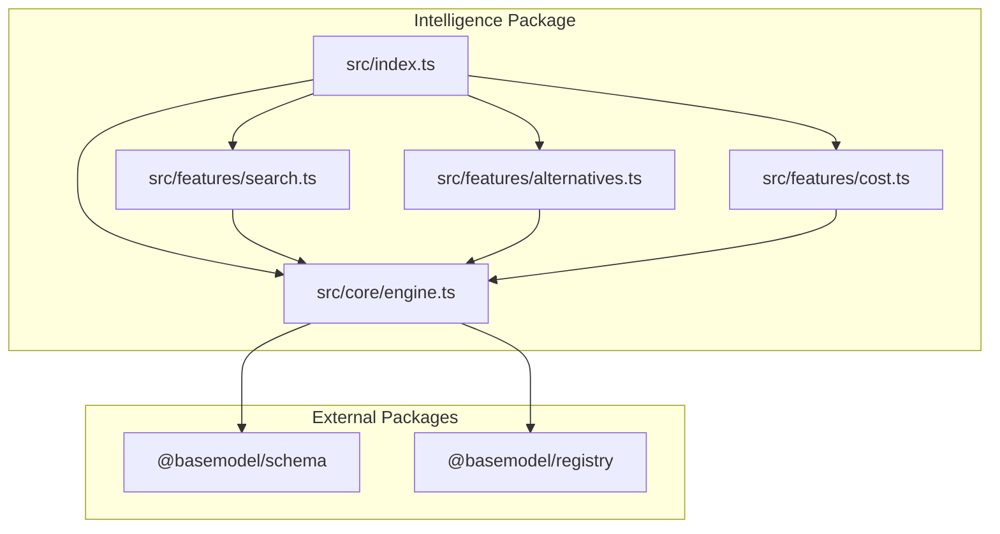
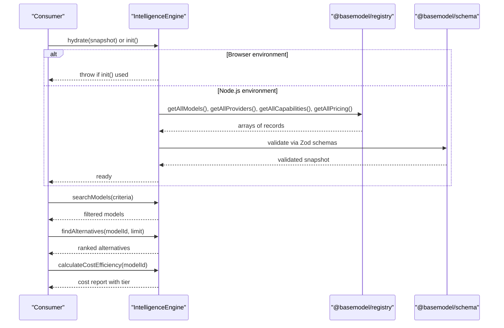
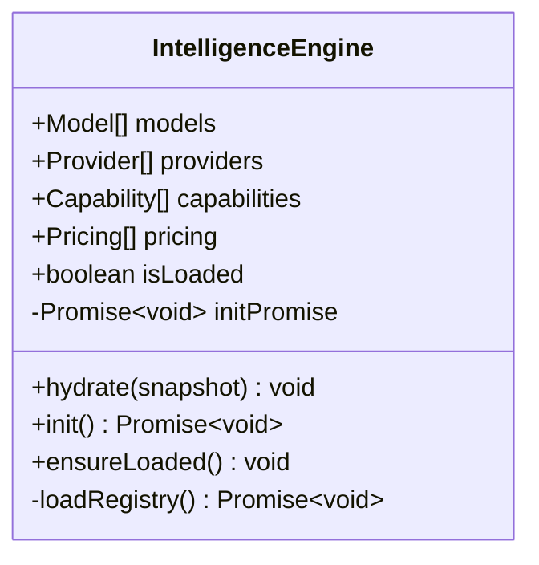
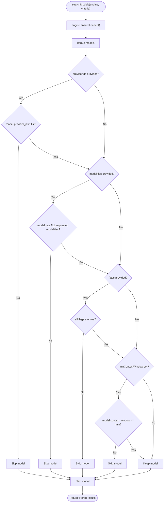
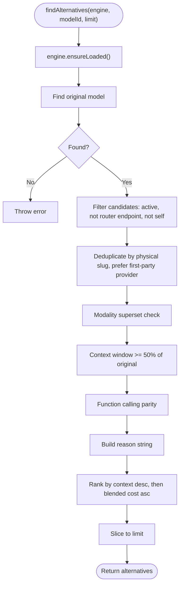
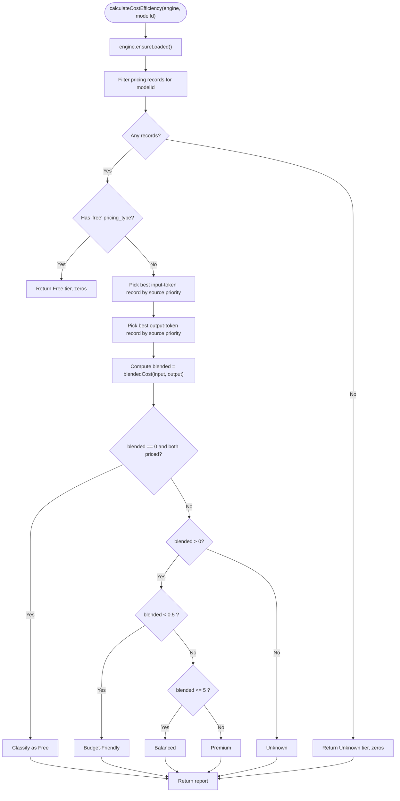
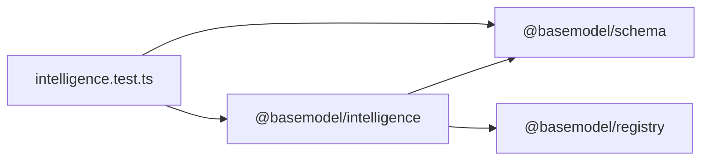

# Custom Intelligence Algorithms

<cite>
**Referenced Files in This Document**
- [README.md](file://README.md)
- [03_Architecture.md](file://docs/03_Architecture.md)
- [04_Pipeline.md](file://docs/04_Pipeline.md)
- [package.json](file://packages/intelligence/package.json)
- [index.ts](file://packages/intelligence/src/index.ts)
- [engine.ts](file://packages/intelligence/src/core/engine.ts)
- [search.ts](file://packages/intelligence/src/features/search.ts)
- [alternatives.ts](file://packages/intelligence/src/features/alternatives.ts)
- [cost.ts](file://packages/intelligence/src/features/cost.ts)
- [intelligence.test.ts](file://packages/intelligence/src/__tests__/intelligence.test.ts)
</cite>

## Table of Contents
1. [Introduction](#introduction)
2. [Project Structure](#project-structure)
3. [Core Components](#core-components)
4. [Architecture Overview](#architecture-overview)
5. [Detailed Component Analysis](#detailed-component-analysis)
6. [Dependency Analysis](#dependency-analysis)
7. [Performance Considerations](#performance-considerations)
8. [Troubleshooting Guide](#troubleshooting-guide)
9. [Conclusion](#conclusion)
10. [Appendices](#appendices)

## Introduction
This document explains how to implement custom intelligence algorithms in BaseModel’s intelligence layer. It focuses on the algorithm interface, ranking methodologies, and recommendation engines exposed by the @basemodel/intelligence package. You will learn how to create custom scoring functions, search algorithms, and analytics plugins that operate over canonical registry data (models, providers, capabilities, pricing). The guidance includes examples for cost-based rankings, quality assessments, and alternative recommendations, along with performance considerations, caching strategies, and testing approaches.

The intelligence layer is intentionally read-only: it derives insights from the registry without modifying canonical records. It exposes a small, stable API surface suitable for extension via plugins or new features.

**Section sources**
- [README.md:11-17](file://README.md#L11-L17)
- [03_Architecture.md:23-29](file://docs/03_Architecture.md#L23-L29)
- [04_Pipeline.md:68-76](file://docs/04_Pipeline.md#L68-L76)

## Project Structure
The intelligence layer lives under packages/intelligence and depends on @basemodel/schema and @basemodel/registry. The package exports a core engine and feature modules for search, alternatives, and cost heuristics.

**Diagram sources**
- [index.ts:11-14](file://packages/intelligence/src/index.ts#L11-L14)
- [engine.ts:1-92](file://packages/intelligence/src/core/engine.ts#L1-L92)
- [search.ts:1-52](file://packages/intelligence/src/features/search.ts#L1-L52)
- [alternatives.ts:1-138](file://packages/intelligence/src/features/alternatives.ts#L1-L138)
- [cost.ts:1-115](file://packages/intelligence/src/features/cost.ts#L1-L115)

**Section sources**
- [package.json:1-49](file://packages/intelligence/package.json#L1-L49)
- [index.ts:1-14](file://packages/intelligence/src/index.ts#L1-L14)

## Core Components
- IntelligenceEngine: Holds a validated snapshot of models, providers, capabilities, and pricing. Provides initialization and hydration APIs.
- Search: Filters models by provider, modalities, flags, and context window.
- Alternatives: Recommends comparable models based on modality compatibility, context window thresholds, function calling parity, and deduplication across router providers.
- Cost: Computes blended per-1M costs and assigns deterministic tiers using provenance-aware selection among multiple pricing sources.

These components are designed to be extended. New algorithms can be added as additional feature modules that consume the same engine snapshot and schema types.

**Section sources**
- [engine.ts:36-92](file://packages/intelligence/src/core/engine.ts#L36-L92)
- [search.ts:4-52](file://packages/intelligence/src/features/search.ts#L4-L52)
- [alternatives.ts:5-138](file://packages/intelligence/src/features/alternatives.ts#L5-L138)
- [cost.ts:4-115](file://packages/intelligence/src/features/cost.ts#L4-L115)

## Architecture Overview
The intelligence layer consumes normalized registry data and produces derived insights. It does not modify canonical records and publishes static datasets through the publishing layer.

**Diagram sources**
- [engine.ts:44-92](file://packages/intelligence/src/core/engine.ts#L44-L92)
- [search.ts:18-52](file://packages/intelligence/src/features/search.ts#L18-L52)
- [alternatives.ts:59-138](file://packages/intelligence/src/features/alternatives.ts#L59-L138)
- [cost.ts:53-115](file://packages/intelligence/src/features/cost.ts#L53-L115)

## Detailed Component Analysis

### IntelligenceEngine
Responsibilities:
- Maintain an in-memory, validated snapshot of registry data.
- Provide safe initialization paths for Node.js (dynamic import of registry) and browser (manual hydration).
- Ensure all operations require a loaded state before execution.

Key behaviors:
- Hydration validates all entities against Zod schemas and throws on invalid snapshots.
- Initialization supports concurrent callers and retries on failure.
- ensureLoaded guards prevent usage before data is available.

**Diagram sources**
- [engine.ts:4-92](file://packages/intelligence/src/core/engine.ts#L4-L92)

**Section sources**
- [engine.ts:11-31](file://packages/intelligence/src/core/engine.ts#L11-L31)
- [engine.ts:44-92](file://packages/intelligence/src/core/engine.ts#L44-L92)

### Search Algorithm
Purpose:
- Filter models by provider IDs, required modalities, boolean flags, and minimum context window.

Design:
- Criteria object defines filters; each filter short-circuits early when not satisfied.
- Modalities must be fully contained; flags must be true; context window must meet threshold.

**Diagram sources**
- [search.ts:18-52](file://packages/intelligence/src/features/search.ts#L18-L52)

**Section sources**
- [search.ts:4-52](file://packages/intelligence/src/features/search.ts#L4-L52)

### Alternative Recommendations
Purpose:
- Suggest comparable alternatives to a given model, considering modality compatibility, context window, function calling, and deduplication across router providers.

Algorithm highlights:
- Excludes router endpoints and collapses duplicates by physical slug.
- Requires at least all modalities of the original and function calling parity.
- Allows context window downgrades up to 50% of the original.
- Ranks by larger context windows first, then cheaper blended cost on ties.

**Diagram sources**
- [alternatives.ts:59-138](file://packages/intelligence/src/features/alternatives.ts#L59-L138)

**Section sources**
- [alternatives.ts:10-46](file://packages/intelligence/src/features/alternatives.ts#L10-L46)
- [alternatives.ts:59-138](file://packages/intelligence/src/features/alternatives.ts#L59-L138)

### Cost Efficiency and Tiers
Purpose:
- Compute blended per-1M cost and assign deterministic tiers using provenance-aware selection among multiple pricing sources.

Key behaviors:
- Source priority prefers the model’s own provider catalog, then OpenRouter, other gateways, then Hugging Face.
- Free classification applies when both input and output are priced at zero or marked free.
- Tier thresholds: Budget-Friendly (< $0.50), Balanced ($0.50–$5), Premium (> $5), Unknown (no pricing).

**Diagram sources**
- [cost.ts:22-48](file://packages/intelligence/src/features/cost.ts#L22-L48)
- [cost.ts:53-115](file://packages/intelligence/src/features/cost.ts#L53-L115)

**Section sources**
- [cost.ts:22-48](file://packages/intelligence/src/features/cost.ts#L22-L48)
- [cost.ts:53-115](file://packages/intelligence/src/features/cost.ts#L53-L115)

### Extending the Intelligence Layer
To add custom algorithms:
- Create a new feature module under src/features/ that imports IntelligenceEngine and schema types.
- Implement functions that call engine.ensureLoaded() and operate on engine.models, engine.pricing, etc.
- Export your functions and re-export them from index.ts alongside existing features.
- Add tests under __tests__ to validate behavior and edge cases.

Recommended patterns:
- Use deterministic sorting and tie-breakers for reproducibility.
- Prefer pure functions where possible to simplify testing and caching.
- Leverage schema utilities like blendedCost for consistent calculations.

**Section sources**
- [index.ts:11-14](file://packages/intelligence/src/index.ts#L11-L14)
- [engine.ts:36-92](file://packages/intelligence/src/core/engine.ts#L36-L92)

## Dependency Analysis
The intelligence package depends on schema and registry packages. Features depend on the engine and schema utilities. Tests validate behavior across features.

**Diagram sources**
- [package.json:38-41](file://packages/intelligence/package.json#L38-L41)
- [intelligence.test.ts:1-6](file://packages/intelligence/src/__tests__/intelligence.test.ts#L1-L6)

**Section sources**
- [package.json:1-49](file://packages/intelligence/package.json#L1-L49)
- [intelligence.test.ts:1-230](file://packages/intelligence/src/__tests__/intelligence.test.ts#L1-L230)

## Performance Considerations
- Snapshot reuse: Initialize once and reuse the IntelligenceEngine instance to avoid repeated loads.
- Early filtering: Search uses short-circuit checks to minimize iterations.
- Deterministic selection: Cost selection prioritizes provenance to avoid nondeterminism and reduce recomputation.
- Static outputs: Publishing generates static JSON datasets that are easy to cache and mirror.

Caching strategies:
- Cache the engine snapshot in memory for the lifetime of the process.
- For web clients, hydrate once and store the snapshot in application state or a lightweight cache.
- Avoid re-importing registry modules; rely on engine.hydrate or engine.init once.

[No sources needed since this section provides general guidance]

## Troubleshooting Guide
Common issues and resolutions:
- Not initialized: Calling search or recommendations without init/hydrate throws an error. Ensure engine.ensureLoaded() passes before use.
- Invalid snapshot: Hydration fails if any entity array violates schema validation. Inspect errors thrown during parseSnapshot.
- Missing pricing: Cost efficiency returns Unknown tier when no pricing records exist for a model.
- Router endpoints excluded: Alternatives excludes dynamic router endpoints; verify candidate providers and endpoints.

Relevant error handling locations:
- Engine initialization and load path guard Node vs browser environments.
- Snapshot parsing aggregates validation errors and throws descriptive messages.
- Feature functions enforce loaded state and return predictable defaults or errors.

**Section sources**
- [engine.ts:69-92](file://packages/intelligence/src/core/engine.ts#L69-L92)
- [engine.ts:11-31](file://packages/intelligence/src/core/engine.ts#L11-L31)
- [cost.ts:53-70](file://packages/intelligence/src/features/cost.ts#L53-L70)
- [alternatives.ts:64-70](file://packages/intelligence/src/features/alternatives.ts#L64-L70)

## Conclusion
BaseModel’s intelligence layer offers a clean, extensible foundation for building custom algorithms over canonical registry data. By leveraging the IntelligenceEngine and feature modules, you can implement search filters, recommendation engines, and cost-based rankings with deterministic behavior and strong typing. Extend the system by adding new feature modules, following established patterns for validation, provenance-aware selection, and reproducible sorting.

[No sources needed since this section summarizes without analyzing specific files]

## Appendices

### Example Scenarios

- Cost-based rankings:
  - Use calculateCostEfficiency to compute blended costs and tiers.
  - Combine with search to rank models within a subset by tier or blended cost.

- Quality assessments:
  - Derive composite scores using modalities, function calling, and context window.
  - Apply thresholds and tie-breakers similar to alternatives ranking.

- Alternative recommendations:
  - Use findAlternatives to suggest cross-provider options with reasons.
  - Customize limits and ranking logic by extending the sort comparator.

- Analytics plugins:
  - Build metrics around search result distributions, alternative acceptance rates, and cost tier adoption.
  - Persist analytics separately from registry data to maintain immutability.

[No sources needed since this section provides general guidance]