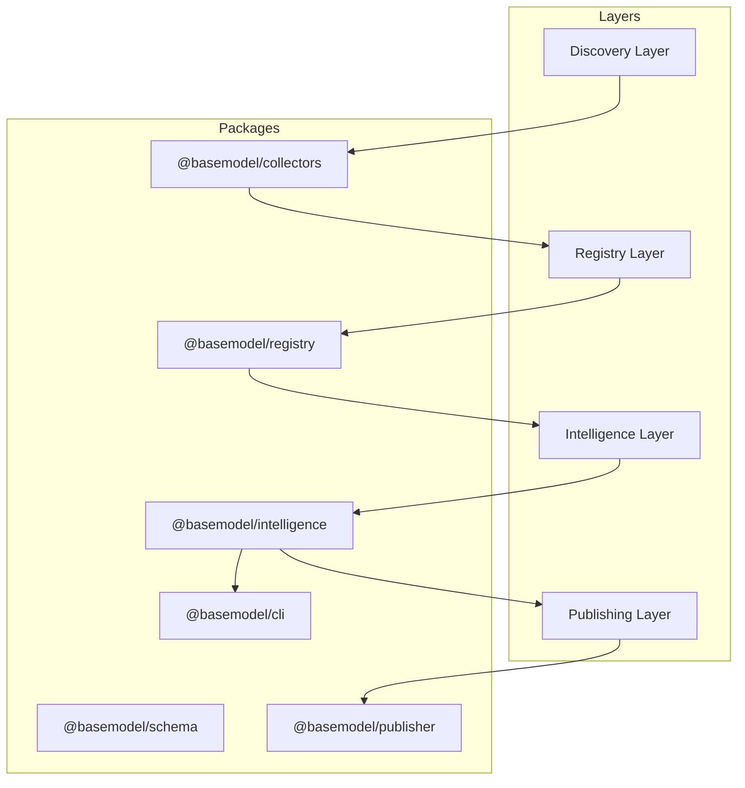
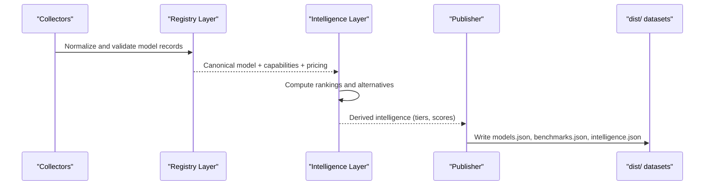
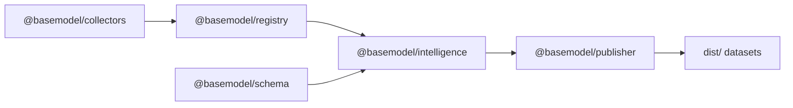

# Ranking Algorithms

<cite>
**Referenced Files in This Document**
- [README.md](file://README.md)
- [03_Architecture.md](file://docs/03_Architecture.md)
- [04_Pipeline.md](file://docs/04_Pipeline.md)
- [package.json](file://packages/intelligence/package.json)
- [generate.ts](file://packages/publisher/src/generate.ts)
- [merge.ts](file://packages/registry/src/merge.ts)
</cite>

## Table of Contents
1. [Introduction](#introduction)
2. [Project Structure](#project-structure)
3. [Core Components](#core-components)
4. [Architecture Overview](#architecture-overview)
5. [Detailed Component Analysis](#detailed-component-analysis)
6. [Dependency Analysis](#dependency-analysis)
7. [Performance Considerations](#performance-considerations)
8. [Troubleshooting Guide](#troubleshooting-guide)
9. [Conclusion](#conclusion)
10. [Appendices](#appendices)

## Introduction
This document explains how to implement custom ranking algorithms within the BaseModel intelligence layer. It covers the ranking interface, scoring methodologies, and weight calculation systems. It also provides guidance for building cost-based rankings, performance-based rankings, hybrid scoring functions, provider-specific criteria, benchmark integration, dynamic weight adjustment, performance optimization, caching strategies, and testing approaches.

BaseModel’s intelligence layer derives rankings and recommendations from registry data without modifying canonical records. The publishing layer then generates static datasets that consumers can cache and mirror.

**Section sources**
- [README.md:12-30](file://README.md#L12-L30)
- [03_Architecture.md:23-29](file://docs/03_Architecture.md#L23-L29)

## Project Structure
The repository is organized into packages that map to architectural layers:
- Schema: canonical types and Zod schemas
- Registry: storage, validation, merge utilities
- Collectors: discovery and collection
- Intelligence: derived rankings, search, recommendations
- Publisher: dataset generation for dist/
- CLI: terminal access to intelligence

**Diagram sources**
- [03_Architecture.md:37-44](file://docs/03_Architecture.md#L37-L44)

**Section sources**
- [README.md:12-30](file://README.md#L12-L30)
- [03_Architecture.md:37-44](file://docs/03_Architecture.md#L37-L44)

## Core Components
- Intelligence package: hosts ranking and recommendation logic; depends on schema and registry packages.
- Registry merge: preserves curated fields while merging collector data; ensures stable inputs for ranking.
- Publisher generate: computes cost efficiency and alternatives; integrates benchmarks with catalog models.

Key responsibilities:
- Compute derived metrics (cost tiers, blended costs, alternatives).
- Integrate benchmark data with model catalog entries.
- Publish lean datasets aligned with UI matching rules.

**Section sources**
- [package.json:1-49](file://packages/intelligence/package.json#L1-L49)
- [merge.ts:1-45](file://packages/registry/src/merge.ts#L1-L45)
- [generate.ts:147-177](file://packages/publisher/src/generate.ts#L147-L177)

## Architecture Overview
Rankings are computed in the intelligence layer using normalized registry data and benchmark sources. The publisher then emits datasets that include intelligence-derived fields such as cost tiers and alternatives.

**Diagram sources**
- [03_Architecture.md:59-72](file://docs/03_Architecture.md#L59-L72)
- [generate.ts:147-177](file://packages/publisher/src/generate.ts#L147-L177)

## Detailed Component Analysis

### Ranking Interface and Scoring Methodology
- Input: Canonical model records, capabilities, pricing, and benchmark scores.
- Output: Ranked lists per query or global leaderboards, plus per-model intelligence fields (e.g., cost tier, blended cost, alternatives).
- Design principles:
  - Provider agnostic and normalized.
  - Deterministic and reproducible.
  - Extensible via plugins for new ranking strategies.

Implementation guidance:
- Define a scoring function that accepts model features and returns a scalar score.
- Provide composable components for cost, performance, and hybrid scoring.
- Expose a ranking engine that applies filters, weights, and tie-breakers.

[No sources needed since this section defines conceptual interfaces]

### Cost-Based Rankings
Cost-based ranking uses pricing and usage patterns to compute cost efficiency. The publisher already calculates cost tiers and blended costs per million tokens for each model.

Steps:
- Gather per-provider pricing and usage mix.
- Compute blended cost per million tokens.
- Assign cost tiers based on thresholds.
- Rank by ascending cost for budget-sensitive queries.

Integration points:
- Use registry pricing data and model metadata.
- Align with publisher’s cost calculations to ensure consistency.

**Section sources**
- [generate.ts:147-177](file://packages/publisher/src/generate.ts#L147-L177)

### Performance-Based Rankings
Performance-based ranking leverages benchmark scores from LMArena, Open LLM Leaderboard, and Mirror snapshots.

Sources:
- LMArena Elo rankings for text/webdev/vision.
- Open LLM Leaderboard scores (MMLU-PRO, GPQA, etc.).
- Mirror daily snapshot for text/code leaderboard.

Fallback behavior:
- If LMArena is unreachable or rate-limited, fall back to Mirror snapshot.

Steps:
- Normalize benchmark scores across tasks.
- Aggregate into a composite performance score.
- Rank by descending performance for quality-sensitive queries.

**Section sources**
- [04_Pipeline.md:107-139](file://docs/04_Pipeline.md#L107-L139)

### Hybrid Scoring Functions
Hybrid scoring combines cost and performance with configurable weights.

Approach:
- Normalize both cost and performance to a common scale.
- Apply weights w_cost and w_perf such that w_cost + w_perf = 1.
- Compute final score = w_perf * perf_score - w_cost * cost_score.
- Allow dynamic weight adjustment based on user preferences or context.

Provider-specific criteria:
- Add provider-level modifiers (e.g., reliability, latency, region availability).
- Use capability flags to gate eligibility (e.g., vision-only models).

**Section sources**
- [03_Architecture.md:23-29](file://docs/03_Architecture.md#L23-L29)

### Benchmark Integration
Benchmark data flows through collectors into the registry and is consumed by intelligence and publisher.

Flow:
- Collectors fetch benchmark data from public endpoints.
- Registry stores normalized benchmark records.
- Intelligence computes composite scores and alternatives.
- Publisher aligns benchmarks with catalog models for output.

Matching rule:
- Benchmarks are filtered to match catalog models by last path segment or full ID.

**Section sources**
- [04_Pipeline.md:107-139](file://docs/04_Pipeline.md#L107-L139)
- [generate.ts:162-177](file://packages/publisher/src/generate.ts#L162-L177)

### Dynamic Weight Adjustment
Dynamic weights adapt ranking based on context:
- Time-based decay for benchmarks.
- User-defined budgets shifting w_cost vs w_perf.
- Region or provider constraints adjusting eligibility.

Implementation tips:
- Store weights in configuration or runtime context.
- Recompute scores when weights change.
- Cache results keyed by weight set to avoid recomputation.

[No sources needed since this section provides general guidance]

### Algorithm Performance Optimization
- Precompute normalized features (cost, performance) once per run.
- Use indexed lookups for provider and capability filters.
- Batch benchmark aggregation to reduce I/O.
- Avoid repeated parsing of JSON files; keep in-memory structures.

Caching strategies:
- In-memory caches for normalized inputs and intermediate scores.
- Disk-backed cache for benchmark aggregates with TTL.
- Cache invalidation on registry updates or benchmark refresh.

**Section sources**
- [03_Architecture.md:59-72](file://docs/03_Architecture.md#L59-L72)

### Testing Approaches
- Unit tests for scoring functions with synthetic inputs.
- Property-based tests for normalization and weighting invariants.
- Integration tests validating pipeline outputs against expected datasets.
- Fallback tests ensuring Mirror fallback when primary sources fail.

Best practices:
- Mock external benchmark endpoints.
- Validate merged registry data before ranking.
- Assert deterministic ordering under equal scores.

[No sources needed since this section provides general guidance]

## Dependency Analysis
Ranking logic depends on registry data and benchmark sources, and feeds into the publisher.

**Diagram sources**
- [03_Architecture.md:37-44](file://docs/03_Architecture.md#L37-L44)

**Section sources**
- [package.json:38-41](file://packages/intelligence/package.json#L38-L41)
- [03_Architecture.md:37-44](file://docs/03_Architecture.md#L37-L44)

## Performance Considerations
- Keep ranking computations O(n log n) due to sorting; minimize feature extraction overhead.
- Prefer streaming or chunked processing for large registries.
- Use efficient data structures (maps, sets) for filtering and deduplication.
- Profile benchmark aggregation paths to identify hotspots.

[No sources needed since this section provides general guidance]

## Troubleshooting Guide
Common issues:
- Rate limiting from benchmark sources triggers fallback to Mirror snapshot.
- Missing or malformed benchmark records cause alignment failures.
- Merged registry data overwrites curated fields unexpectedly.

Mitigations:
- Configure Hugging Face token to increase limits.
- Validate benchmark records before ingestion.
- Ensure merge logic preserves curated fields.

**Section sources**
- [04_Pipeline.md:100-139](file://docs/04_Pipeline.md#L100-L139)
- [merge.ts:1-45](file://packages/registry/src/merge.ts#L1-L45)

## Conclusion
BaseModel’s intelligence layer provides a robust foundation for implementing custom ranking algorithms. By leveraging normalized registry data, benchmark sources, and extensible scoring functions, you can build cost-based, performance-based, and hybrid rankings. Follow the outlined optimization, caching, and testing practices to ensure reliable, scalable, and maintainable ranking implementations.

[No sources needed since this section summarizes without analyzing specific files]

## Appendices

### Example Implementation Checklist
- Define scoring function signature and normalization strategy.
- Implement cost-based and performance-based scorers.
- Create hybrid scorer with configurable weights.
- Integrate benchmark data and handle fallbacks.
- Add provider-specific modifiers and capability gates.
- Optimize with caching and precomputation.
- Write unit and integration tests.
- Validate outputs against publisher-generated datasets.

[No sources needed since this section provides general guidance]