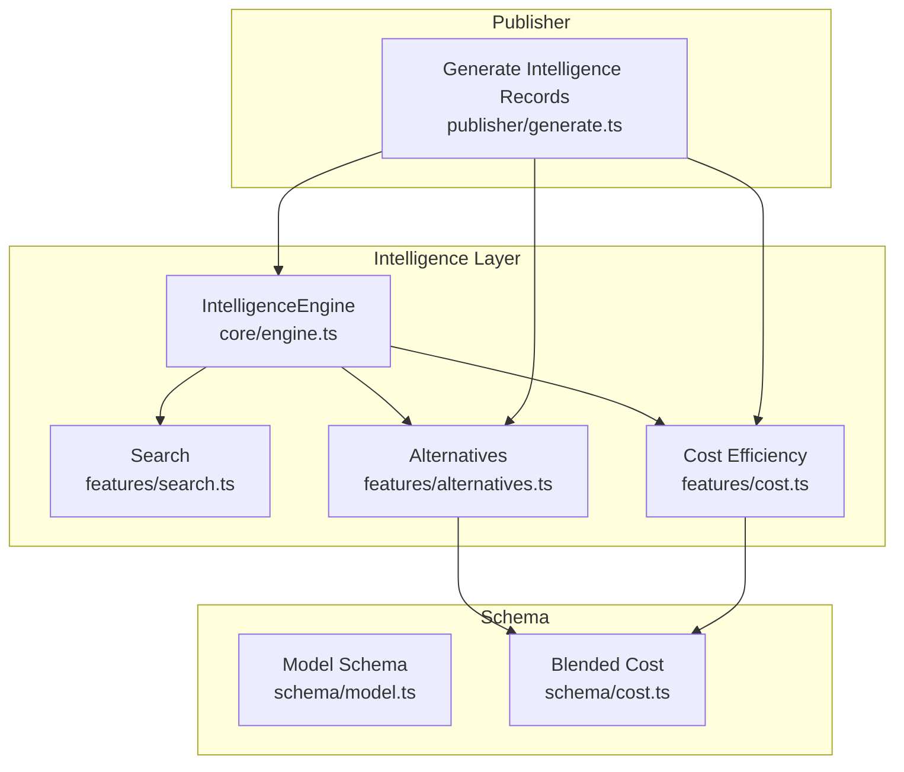
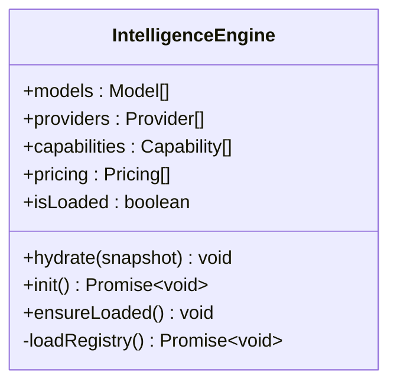
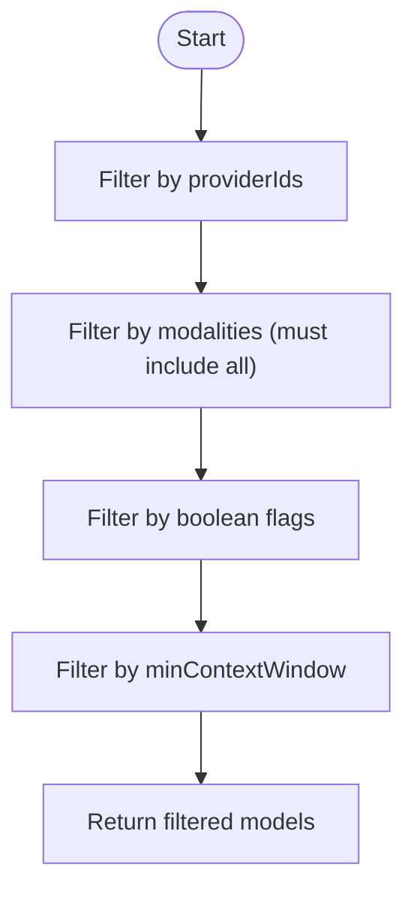
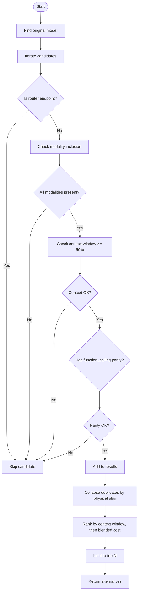
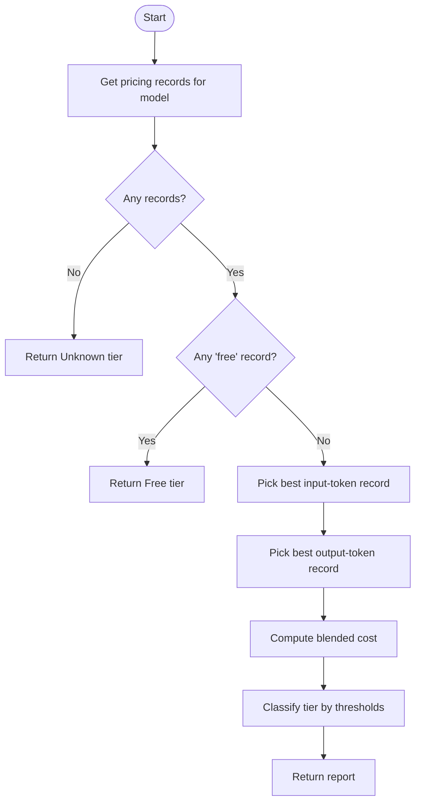
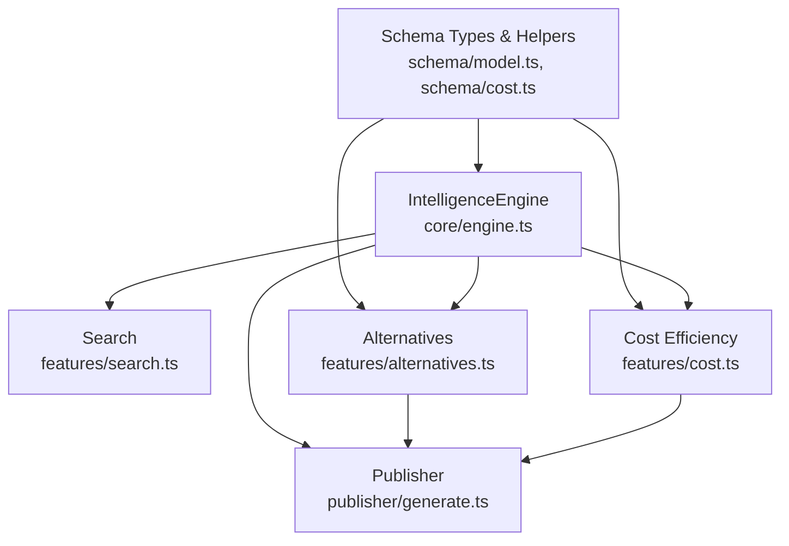

# Recommendation Engine

<cite>
**Referenced Files in This Document**
- [README.md](file://README.md)
- [07_Developer_Access.md](file://docs/07_Developer_Access.md)
- [engine.ts](file://packages/intelligence/src/core/engine.ts)
- [alternatives.ts](file://packages/intelligence/src/features/alternatives.ts)
- [cost.ts](file://packages/intelligence/src/features/cost.ts)
- [search.ts](file://packages/intelligence/src/features/search.ts)
- [index.ts](file://packages/intelligence/src/index.ts)
- [generate.ts](file://packages/publisher/src/generate.ts)
- [model.ts](file://packages/schema/src/model.ts)
- [cost.ts (schema)](file://packages/schema/src/cost.ts)
- [intelligence.test.ts](file://packages/intelligence/src/__tests__/intelligence.test.ts)
</cite>

## Table of Contents
1. [Introduction](#introduction)
2. [Project Structure](#project-structure)
3. [Core Components](#core-components)
4. [Architecture Overview](#architecture-overview)
5. [Detailed Component Analysis](#detailed-component-analysis)
6. [Dependency Analysis](#dependency-analysis)
7. [Performance Considerations](#performance-considerations)
8. [Troubleshooting Guide](#troubleshooting-guide)
9. [Conclusion](#conclusion)
10. [Appendices](#appendices)

## Introduction
This document explains how to build recommendation engines using the BaseModel intelligence layer. It focuses on:
- Collaborative filtering patterns using capability-based and cost-aware signals
- Content-based recommendations via modalities, flags, and context windows
- Hybrid strategies combining search filters, alternatives ranking, and cost efficiency
- Alternative model suggestions, cost optimization, and capability-driven matching
- Scoring, personalization hooks, evaluation metrics, performance considerations, cold start handling, and quality assessment

BaseModel provides a canonical data layer for models, providers, capabilities, pricing, and benchmarks. The @basemodel/intelligence package exposes deterministic heuristics for search, alternatives discovery, and cost classification that can be extended into full recommendation systems.

**Section sources**
- [README.md:1-61](file://README.md#L1-L61)

## Project Structure
The intelligence layer is implemented under packages/intelligence with supporting schema definitions and publisher integration:
- Core engine holds validated snapshots of registry data
- Features provide search, alternatives, and cost heuristics
- Publisher integrates intelligence outputs into static datasets



**Diagram sources**
- [engine.ts:1-92](file://packages/intelligence/src/core/engine.ts#L1-L92)
- [search.ts:1-52](file://packages/intelligence/src/features/search.ts#L1-L52)
- [alternatives.ts:1-138](file://packages/intelligence/src/features/alternatives.ts#L1-L138)
- [cost.ts:1-115](file://packages/intelligence/src/features/cost.ts#L1-L115)
- [model.ts:1-65](file://packages/schema/src/model.ts#L1-L65)
- [cost.ts (schema):1-12](file://packages/schema/src/cost.ts#L1-L12)
- [generate.ts:147-177](file://packages/publisher/src/generate.ts#L147-L177)

**Section sources**
- [index.ts:1-14](file://packages/intelligence/src/index.ts#L1-L14)
- [generate.ts:147-177](file://packages/publisher/src/generate.ts#L147-L177)

## Core Components
- IntelligenceEngine: In-memory, validated snapshot of models, providers, capabilities, and pricing; supports Node.js initialization or browser hydration.
- Search: Deterministic filtering by provider IDs, modalities, boolean flags, and minimum context window.
- Alternatives: Finds comparable models based on modality inclusion, context window thresholds, function calling parity, router endpoint exclusion, and deduplication across re-served endpoints.
- Cost Efficiency: Computes per-1M input/output costs, blended cost, and tier classification with provenance-aware selection.

These components form the foundation for building collaborative filtering, content-based, and hybrid recommendation strategies.

**Section sources**
- [engine.ts:1-92](file://packages/intelligence/src/core/engine.ts#L1-L92)
- [search.ts:1-52](file://packages/intelligence/src/features/search.ts#L1-L52)
- [alternatives.ts:1-138](file://packages/intelligence/src/features/alternatives.ts#L1-L138)
- [cost.ts:1-115](file://packages/intelligence/src/features/cost.ts#L1-L115)

## Architecture Overview
The recommendation pipeline leverages the IntelligenceEngine as the central data hub. Consumers call search, alternatives, and cost functions to derive ranked recommendations. The publisher uses these functions to generate static datasets for consumption by catalogs and UIs.

```mermaid
sequenceDiagram
participant App as "Consumer App"
participant Eng as "IntelligenceEngine"
participant Alt as "findAlternatives"
participant Cos as "calculateCostEfficiency"
participant Pub as "Publisher"
App->>Eng : init() or hydrate()
App->>Eng : ensureLoaded()
App->>Alt : findAlternatives(engine, modelId, limit)
Alt-->>App : Ranked alternatives with reasons
App->>Cos : calculateCostEfficiency(engine, modelId)
Cos-->>App : Tier, blended cost, input/output costs
Pub->>Eng : loadRegistry()
Pub->>Alt : findAlternatives(...)
Pub->>Cos : calculateCostEfficiency(...)
Pub-->>Pub : Generate intelligence records
```

**Diagram sources**
- [engine.ts:1-92](file://packages/intelligence/src/core/engine.ts#L1-L92)
- [alternatives.ts:1-138](file://packages/intelligence/src/features/alternatives.ts#L1-L138)
- [cost.ts:1-115](file://packages/intelligence/src/features/cost.ts#L1-L115)
- [generate.ts:147-177](file://packages/publisher/src/generate.ts#L147-L177)

## Detailed Component Analysis

### IntelligenceEngine
- Responsibilities: Validate and hold snapshots of models, providers, capabilities, and pricing; manage initialization lifecycle; enforce loaded state.
- Key methods:
  - hydrate(snapshot): Load validated data from an in-memory snapshot.
  - init(): Asynchronously load registry data in Node.js environments.
  - ensureLoaded(): Guard method to prevent operations before initialization.



**Diagram sources**
- [engine.ts:1-92](file://packages/intelligence/src/core/engine.ts#L1-L92)

**Section sources**
- [engine.ts:1-92](file://packages/intelligence/src/core/engine.ts#L1-L92)

### Search Feature (Content-Based Filtering)
- Purpose: Filter models by provider IDs, required modalities, boolean flags, and minimum context window.
- Use cases:
  - Content-based recommendations: match models by modality and feature flags.
  - Personalization: incorporate user preferences as flags or minContextWindow constraints.
  - Capability-based recommendations: filter by flags like vision_support, function_calling, reasoning_support.



**Diagram sources**
- [search.ts:1-52](file://packages/intelligence/src/features/search.ts#L1-L52)

**Section sources**
- [search.ts:1-52](file://packages/intelligence/src/features/search.ts#L1-L52)

### Alternatives Feature (Collaborative and Hybrid Signals)
- Purpose: Discover comparable alternative models with deterministic ranking.
- Criteria:
  - Must support all modalities of the original model.
  - Context window must be at least 50% of the original.
  - Function calling parity if the original has it.
  - Exclude router endpoints; collapse duplicates across re-served providers.
- Ranking: Primary by context window, secondary by blended cost (cheaper preferred), then stable sort by model_id.



**Diagram sources**
- [alternatives.ts:1-138](file://packages/intelligence/src/features/alternatives.ts#L1-L138)

**Section sources**
- [alternatives.ts:1-138](file://packages/intelligence/src/features/alternatives.ts#L1-L138)

### Cost Efficiency Feature (Optimization and Tiering)
- Purpose: Compute per-1M input/output costs, blended cost, and tier classification.
- Provenance priority: Prefer model’s own provider catalog, then OpenRouter, then other gateways, then Hugging Face, then unknown sources.
- Tier logic: Free if explicitly free or both costs are zero; Budget-Friendly (<0.5), Balanced (<=5), Premium (>5).



**Diagram sources**
- [cost.ts:1-115](file://packages/intelligence/src/features/cost.ts#L1-L115)
- [cost.ts (schema):1-12](file://packages/schema/src/cost.ts#L1-L12)

**Section sources**
- [cost.ts:1-115](file://packages/intelligence/src/features/cost.ts#L1-L115)
- [cost.ts (schema):1-12](file://packages/schema/src/cost.ts#L1-L12)

### Publisher Integration (Static Datasets)
- Purpose: Generate intelligence records including cost tiers, blended costs, and alternatives for each model.
- Usage: Integrates calculateCostEfficiency and findAlternatives to enrich published datasets consumed by catalogs and UIs.

```mermaid
sequenceDiagram
participant Gen as "generate.ts"
participant Eng as "IntelligenceEngine"
participant Alt as "findAlternatives"
participant Cos as "calculateCostEfficiency"
Gen->>Eng : Initialize/Hydrate
loop For each model
Gen->>Cos : calculateCostEfficiency(engine, model.model_id)
Gen->>Alt : findAlternatives(engine, model.model_id, 3)
Gen->>Gen : Build intelligence record
end
Gen-->>Gen : Write dist datasets
```

**Diagram sources**
- [generate.ts:147-177](file://packages/publisher/src/generate.ts#L147-L177)

**Section sources**
- [generate.ts:147-177](file://packages/publisher/src/generate.ts#L147-L177)

## Dependency Analysis
- IntelligenceEngine depends on schema validation types and optional registry loading.
- Alternatives and Cost features depend on schema constants for blended cost computation.
- Publisher depends on IntelligenceEngine and intelligence features to produce enriched datasets.



**Diagram sources**
- [model.ts:1-65](file://packages/schema/src/model.ts#L1-L65)
- [cost.ts (schema):1-12](file://packages/schema/src/cost.ts#L1-L12)
- [engine.ts:1-92](file://packages/intelligence/src/core/engine.ts#L1-L92)
- [search.ts:1-52](file://packages/intelligence/src/features/search.ts#L1-L52)
- [alternatives.ts:1-138](file://packages/intelligence/src/features/alternatives.ts#L1-L138)
- [cost.ts:1-115](file://packages/intelligence/src/features/cost.ts#L1-L115)
- [generate.ts:147-177](file://packages/publisher/src/generate.ts#L147-L177)

**Section sources**
- [index.ts:1-14](file://packages/intelligence/src/index.ts#L1-L14)

## Performance Considerations
- Time complexity:
  - Search: O(N) over models with constant-time checks per criterion.
  - Alternatives: O(N) candidate iteration plus sorting O(K log K) where K is number of candidates after filtering.
  - Cost Efficiency: O(P) over pricing records per model; deterministic selection avoids repeated scans beyond necessary.
- Space complexity:
  - IntelligenceEngine stores arrays of models, providers, capabilities, and pricing; memory usage scales with dataset size.
- Optimization opportunities:
  - Precompute blended costs per model for faster ranking in alternatives.
  - Index models by provider_id and modality sets for faster filtering.
  - Cache cost reports per model_id to avoid recomputation.
- Concurrency:
  - IntelligenceEngine.init() shares a single load promise to avoid redundant I/O.

[No sources needed since this section provides general guidance]

## Troubleshooting Guide
- Initialization errors:
  - Ensure engine is initialized via init() in Node.js or hydrate() in browser-like environments before calling any feature functions.
- Missing pricing:
  - calculateCostEfficiency returns Unknown tier when no pricing records exist; verify pricing data availability for the model.
- Alternatives not found:
  - Check modality inclusion, context window threshold, function calling parity, and router endpoint exclusions.
- Router endpoints:
  - Alternatives exclude specific router endpoints; ensure you are not expecting recommendations from aggregated providers.

**Section sources**
- [engine.ts:1-92](file://packages/intelligence/src/core/engine.ts#L1-L92)
- [cost.ts:1-115](file://packages/intelligence/src/features/cost.ts#L1-L115)
- [alternatives.ts:1-138](file://packages/intelligence/src/features/alternatives.ts#L1-L138)

## Conclusion
BaseModel’s intelligence layer provides robust, deterministic primitives for building recommendation engines:
- Content-based filtering via search criteria
- Collaborative signals through capability alignment and cost-aware ranking
- Hybrid strategies combining search, alternatives, and cost efficiency
- Extensible architecture enabling personalization and evaluation pipelines

Use these components to implement scoring, personalization, and quality assessment while addressing cold start problems and performance constraints.

[No sources needed since this section summarizes without analyzing specific files]

## Appendices

### Building Collaborative Filtering Recommendations
- Approach:
  - Use capability_ids and modality overlap to cluster similar models.
  - Rank candidates by shared capabilities and cost efficiency.
  - Apply alternatives’ ranking rules to ensure comparable context windows and function calling parity.
- Example workflow:
  - Given a target model, compute capability similarity scores across models.
  - Filter by modality inclusion and context window thresholds.
  - Rank by blended cost and stability tie-breakers.

[No sources needed since this section provides general guidance]

### Implementing Content-Based Recommendations
- Approach:
  - Leverage search criteria to match user preferences (modalities, flags, minContextWindow).
  - Extend criteria with additional fields from Model schema for richer personalization.
- Example workflow:
  - Collect user preferences into SearchCriteria.
  - Call searchModels to retrieve matched models.
  - Optionally rank by blended cost or context window.

**Section sources**
- [search.ts:1-52](file://packages/intelligence/src/features/search.ts#L1-L52)
- [model.ts:1-65](file://packages/schema/src/model.ts#L1-L65)

### Hybrid Recommendation Strategies
- Combine:
  - Search filters for hard constraints
  - Alternatives ranking for comparable suggestions
  - Cost efficiency for economic optimization
- Example workflow:
  - Use searchModels to narrow candidates.
  - Apply findAlternatives to refine comparable options.
  - Use calculateCostEfficiency to prioritize budget-friendly choices.

**Section sources**
- [search.ts:1-52](file://packages/intelligence/src/features/search.ts#L1-L52)
- [alternatives.ts:1-138](file://packages/intelligence/src/features/alternatives.ts#L1-L138)
- [cost.ts:1-115](file://packages/intelligence/src/features/cost.ts#L1-L115)

### Alternative Model Suggestions
- Implementation:
  - Use findAlternatives with a limit parameter.
  - Interpret reason strings to explain why alternatives were selected.
- Evaluation:
  - Measure coverage of modalities and context windows.
  - Assess cost efficiency improvements over baseline.

**Section sources**
- [alternatives.ts:1-138](file://packages/intelligence/src/features/alternatives.ts#L1-L138)

### Cost Optimization Recommendations
- Implementation:
  - Use calculateCostEfficiency to classify tiers and compute blended costs.
  - Prioritize models with lower blended costs within acceptable capability sets.
- Metrics:
  - Average blended cost reduction vs baseline.
  - Percentage of recommendations classified as Budget-Friendly or Free.

**Section sources**
- [cost.ts:1-115](file://packages/intelligence/src/features/cost.ts#L1-L115)

### Capability-Based Recommendations
- Implementation:
  - Filter by capability_ids and boolean flags (e.g., vision_support, function_calling).
  - Use searchModels with flags array to enforce capability requirements.
- Evaluation:
  - Precision of capability matches.
  - Recall against desired capability sets.

**Section sources**
- [search.ts:1-52](file://packages/intelligence/src/features/search.ts#L1-L52)
- [model.ts:1-65](file://packages/schema/src/model.ts#L1-L65)

### Recommendation Scoring and Personalization
- Scoring:
  - Blend modality match score, capability overlap, and cost efficiency weight.
  - Incorporate user preference weights for modalities and flags.
- Personalization:
  - Adjust minContextWindow and flags based on user history.
  - Use alternatives ranking to surface diverse yet comparable options.

[No sources needed since this section provides general guidance]

### Recommendation Quality Assessment
- Metrics:
  - Coverage: proportion of users receiving viable recommendations.
  - Diversity: variety of providers and modalities in recommendations.
  - Cost efficiency: average blended cost and tier distribution.
  - Relevance: modality and capability match rates.
- Evaluation workflow:
  - Compare recommended models against ground truth preferences.
  - Track cost savings and capability satisfaction.

[No sources needed since this section provides general guidance]

### Cold Start Problems
- Strategies:
  - Use broad modality and capability filters to return popular or high-quality models.
  - Fall back to cost-efficient and well-known providers when user data is sparse.
  - Leverage publisher-generated datasets for initial popularity signals.

[No sources needed since this section provides general guidance]

### Evaluation Metrics
- Common metrics:
  - Precision@K, Recall@K for capability and modality matches.
  - Mean Reciprocal Rank (MRR) for ranking quality.
  - Cost savings percentage compared to baseline selections.
- Implementation:
  - Log recommendation outcomes and compare against user feedback.
  - Monitor tier distributions and blended cost trends.

[No sources needed since this section provides general guidance]

### Algorithm Performance
- Complexity:
  - Search: O(N)
  - Alternatives: O(N + K log K)
  - Cost Efficiency: O(P)
- Optimizations:
  - Precompute blended costs and cache results.
  - Index models by provider and modality sets.
  - Batch processing for large datasets.

[No sources needed since this section provides general guidance]

### Developer Access and Integration
- Installation:
  - Install @basemodel/schema and @basemodel/intelligence.
- Usage:
  - Initialize IntelligenceEngine via init() or hydrate().
  - Use searchModels, findAlternatives, and calculateCostEfficiency.

**Section sources**
- [07_Developer_Access.md:1-61](file://docs/07_Developer_Access.md#L1-L61)

### Tests and Validation
- Examples:
  - Verify search filtering by modality and context window.
  - Validate cost efficiency calculations and tier classifications.
  - Confirm behavior for missing pricing data.

**Section sources**
- [intelligence.test.ts:1-150](file://packages/intelligence/src/__tests__/intelligence.test.ts#L1-L150)