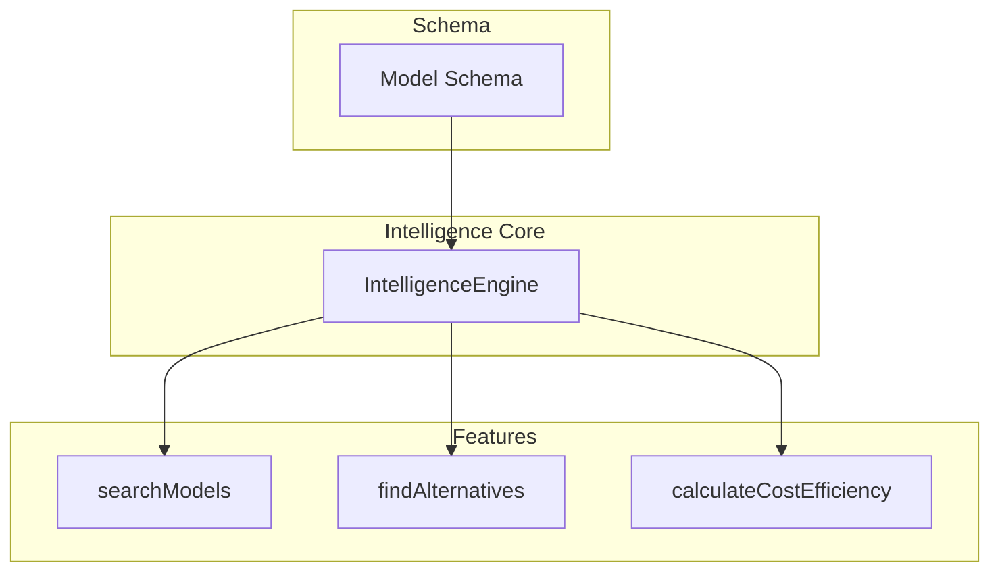
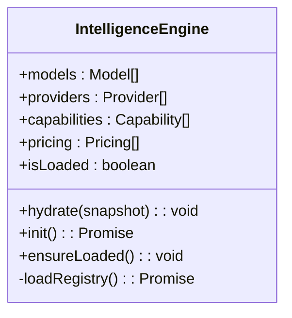
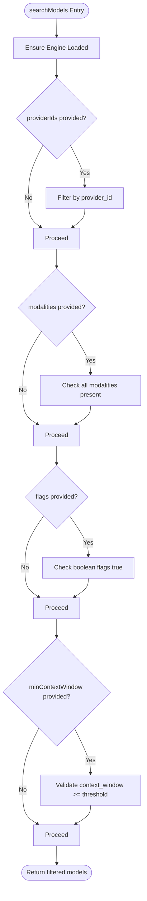
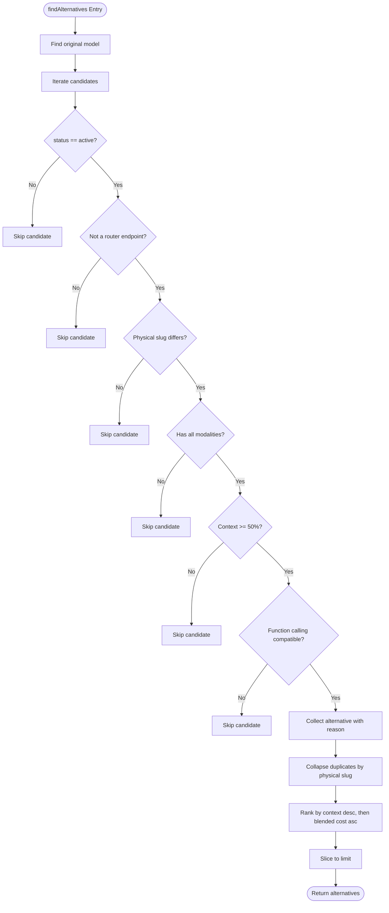
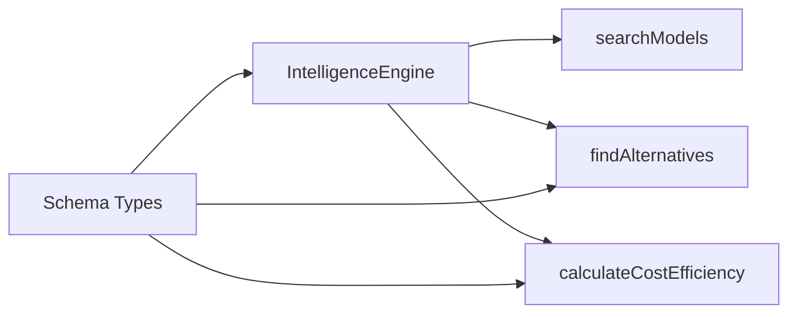

# Search Algorithms

<cite>
**Referenced Files in This Document**
- [README.md](file://README.md)
- [03_Architecture.md](file://docs/03_Architecture.md)
- [engine.ts](file://packages/intelligence/src/core/engine.ts)
- [search.ts](file://packages/intelligence/src/features/search.ts)
- [alternatives.ts](file://packages/intelligence/src/features/alternatives.ts)
- [cost.ts](file://packages/intelligence/src/features/cost.ts)
- [model.ts](file://packages/schema/src/model.ts)
- [schema_index.ts](file://packages/schema/src/index.ts)
</cite>

## Table of Contents
1. [Introduction](#introduction)
2. [Project Structure](#project-structure)
3. [Core Components](#core-components)
4. [Architecture Overview](#architecture-overview)
5. [Detailed Component Analysis](#detailed-component-analysis)
6. [Dependency Analysis](#dependency-analysis)
7. [Performance Considerations](#performance-considerations)
8. [Troubleshooting Guide](#troubleshooting-guide)
9. [Conclusion](#conclusion)
10. [Appendices](#appendices)

## Introduction
This document explains how to create custom search algorithms within the BaseModel intelligence layer. It covers search indexing, query processing, and result ranking mechanisms. You will learn how to implement text-based search, capability-based filtering, and multi-criteria queries. Guidance is provided for extending fuzzy matching and semantic search capabilities, optimizing results, tuning performance, maintaining indexes, and improving user experience.

BaseModel’s intelligence layer derives search, alternatives, and cost insights from canonical registry data without modifying it. The current implementation provides structured filtering over models (provider, modalities, flags, context window) and a robust alternative recommendation engine with cost-aware ranking.

**Section sources**
- [README.md:10-30](file://README.md#L10-L30)
- [03_Architecture.md:23-30](file://docs/03_Architecture.md#L23-L30)

## Project Structure
The intelligence package exposes an engine that holds validated snapshots of registry data and features for search and recommendations. The schema package defines the canonical Model entity used by all intelligence features.



**Diagram sources**
- [engine.ts:36-92](file://packages/intelligence/src/core/engine.ts#L36-L92)
- [search.ts:18-52](file://packages/intelligence/src/features/search.ts#L18-L52)
- [alternatives.ts:59-137](file://packages/intelligence/src/features/alternatives.ts#L59-L137)
- [cost.ts:53-114](file://packages/intelligence/src/features/cost.ts#L53-L114)
- [model.ts:11-62](file://packages/schema/src/model.ts#L11-L62)

**Section sources**
- [README.md:10-30](file://README.md#L10-L30)
- [03_Architecture.md:37-44](file://docs/03_Architecture.md#L37-L44)

## Core Components
- IntelligenceEngine: Holds a validated snapshot of models, providers, capabilities, and pricing. Provides initialization and hydration paths for Node.js and browser environments.
- searchModels: Filters models based on provider IDs, required modalities, boolean flags, and minimum context window.
- findAlternatives: Recommends comparable alternatives using modality coverage, context window thresholds, function calling compatibility, router endpoint filtering, deduplication, and cost-aware ranking.
- calculateCostEfficiency: Computes blended cost and tier classification using deterministic source priority and blending weights.

Key data model fields relevant to search include provider_id, name, family, version, description, architecture, parameter_size, context_window, modality, capability flags (e.g., open_weight, reasoning_support), status, and updated_at.

**Section sources**
- [engine.ts:36-92](file://packages/intelligence/src/core/engine.ts#L36-L92)
- [search.ts:4-16](file://packages/intelligence/src/features/search.ts#L4-L16)
- [search.ts:18-52](file://packages/intelligence/src/features/search.ts#L18-L52)
- [alternatives.ts:59-137](file://packages/intelligence/src/features/alternatives.ts#L59-L137)
- [cost.ts:53-114](file://packages/intelligence/src/features/cost.ts#L53-L114)
- [model.ts:11-62](file://packages/schema/src/model.ts#L11-L62)

## Architecture Overview
The intelligence layer reads or hydrates validated data and exposes functions that operate over this in-memory snapshot. Search and alternatives are pure operations over the snapshot; they do not mutate registry data.

```mermaid
sequenceDiagram
participant Caller as "Caller"
participant Engine as "IntelligenceEngine"
participant Registry as "@basemodel/registry"
participant Search as "searchModels"
participant Alt as "findAlternatives"
Caller->>Engine : init() or hydrate(snapshot)
alt Node.js environment
Engine->>Registry : getAllModels(), getAllProviders(), getAllCapabilities(), getAllPricing()
Registry-->>Engine : arrays of records
Engine->>Engine : parseSnapshot() + hydrate()
else Browser environment
Engine->>Engine : hydrate(snapshot) directly
end
Caller->>Search : searchModels(engine, criteria)
Search-->>Caller : filtered models
Caller->>Alt : findAlternatives(engine, modelId, limit)
Alt-->>Caller : ranked alternatives
```

**Diagram sources**
- [engine.ts:58-82](file://packages/intelligence/src/core/engine.ts#L58-L82)
- [search.ts:18-52](file://packages/intelligence/src/features/search.ts#L18-L52)
- [alternatives.ts:59-137](file://packages/intelligence/src/features/alternatives.ts#L59-L137)

## Detailed Component Analysis

### IntelligenceEngine
Responsibilities:
- Validate and store registry snapshots.
- Provide safe initialization in Node.js (dynamic import of registry) and manual hydration in browsers.
- Ensure loaded state before any feature call.

Design notes:
- Defensive parsing ensures type safety across all datasets.
- Concurrency-safe init via shared promise pattern.
- Explicit error messages guide correct usage.



**Diagram sources**
- [engine.ts:36-92](file://packages/intelligence/src/core/engine.ts#L36-L92)

**Section sources**
- [engine.ts:11-30](file://packages/intelligence/src/core/engine.ts#L11-L30)
- [engine.ts:58-92](file://packages/intelligence/src/core/engine.ts#L58-L92)

### Search Indexing and Query Processing
Current indexing:
- In-memory array of validated Model objects.
- No secondary indices (e.g., inverted index) are built by default.

Query processing:
- searchModels applies filters sequentially:
  - Provider ID inclusion
  - Modality intersection (must contain all requested)
  - Boolean flag checks
  - Minimum context window threshold

Extensibility points:
- Add text-based search by introducing a normalized text field (e.g., concatenated name/family/description/architecture) and implementing tokenization and scoring.
- Implement fuzzy matching by adding edit-distance or phonetic normalization steps.
- Support semantic search by computing embeddings for textual fields and performing vector similarity at query time.



**Diagram sources**
- [search.ts:18-52](file://packages/intelligence/src/features/search.ts#L18-L52)

**Section sources**
- [search.ts:4-16](file://packages/intelligence/src/features/search.ts#L4-L16)
- [search.ts:18-52](file://packages/intelligence/src/features/search.ts#L18-L52)

### Result Ranking and Alternatives
Alternatives ranking logic:
- Candidate must support all modalities of the original model.
- Context window must be at least 50% of the original’s.
- Function calling must be supported if the original supports it.
- Router endpoints are excluded; duplicates across routers are collapsed to first-party representatives.
- Ranking prioritizes larger context windows, then lower blended cost, then stable tie-breaking.

Blended cost calculation:
- Uses fixed input/output weights and divisor to compute a single score per model.
- Deterministic source priority selects the most authoritative pricing record when multiple exist.



**Diagram sources**
- [alternatives.ts:59-137](file://packages/intelligence/src/features/alternatives.ts#L59-L137)
- [cost.ts:53-114](file://packages/intelligence/src/features/cost.ts#L53-L114)

**Section sources**
- [alternatives.ts:10-33](file://packages/intelligence/src/features/alternatives.ts#L10-L33)
- [alternatives.ts:59-137](file://packages/intelligence/src/features/alternatives.ts#L59-L137)
- [cost.ts:1-12](file://packages/intelligence/src/features/cost.ts#L1-L12)
- [cost.ts:53-114](file://packages/intelligence/src/features/cost.ts#L53-L114)

### Data Model Reference
The Model schema defines searchable attributes such as provider_id, name, family, version, description, architecture, parameter_size, context_window, modality, capability flags, status, and updated_at. These fields underpin both filtering and ranking strategies.

**Section sources**
- [model.ts:11-62](file://packages/schema/src/model.ts#L11-L62)
- [schema_index.ts:10-27](file://packages/schema/src/index.ts#L10-L27)

## Dependency Analysis
The intelligence features depend on the schema types and the engine snapshot. Alternatives and cost features also rely on pricing records and blending utilities.



**Diagram sources**
- [engine.ts:36-92](file://packages/intelligence/src/core/engine.ts#L36-L92)
- [search.ts:18-52](file://packages/intelligence/src/features/search.ts#L18-L52)
- [alternatives.ts:59-137](file://packages/intelligence/src/features/alternatives.ts#L59-L137)
- [cost.ts:53-114](file://packages/intelligence/src/features/cost.ts#L53-L114)
- [schema_index.ts:10-27](file://packages/schema/src/index.ts#L10-L27)

**Section sources**
- [engine.ts:36-92](file://packages/intelligence/src/core/engine.ts#L36-L92)
- [schema_index.ts:10-27](file://packages/schema/src/index.ts#L10-L27)

## Performance Considerations
- Current search is O(n) over models due to array filtering. For large registries, consider building auxiliary indices:
  - Provider map: provider_id -> list of model_ids
  - Modality index: modality -> set of model_ids
  - Flag index: boolean flag -> set of model_ids
  - Text index: normalized tokens -> postings list
- Vector search: Precompute embeddings for textual fields and use approximate nearest neighbor structures for semantic queries.
- Caching: Cache frequent query results keyed by serialized criteria.
- Pagination: Stream or paginate results to reduce payload size.
- Batch operations: When updating indices, batch writes and rebuild incrementally.

[No sources needed since this section provides general guidance]

## Troubleshooting Guide
Common issues and resolutions:
- Engine not initialized: Call init() in Node.js or hydrate() in browsers before searching.
- Invalid snapshot: Ensure registry data conforms to schema; errors are thrown during parseSnapshot.
- Missing pricing: Blended cost may be undefined; handle gracefully in UI and fallbacks.
- Router endpoints: Alternatives intentionally exclude router endpoints; verify expected behavior.

**Section sources**
- [engine.ts:70-72](file://packages/intelligence/src/core/engine.ts#L70-L72)
- [engine.ts:17-22](file://packages/intelligence/src/core/engine.ts#L17-L22)
- [engine.ts:84-90](file://packages/intelligence/src/core/engine.ts#L84-L90)
- [alternatives.ts:24-33](file://packages/intelligence/src/features/alternatives.ts#L24-L33)

## Conclusion
BaseModel’s intelligence layer offers a solid foundation for search and recommendation over canonical model data. The existing search supports precise filtering by provider, modalities, flags, and context window, while alternatives provide intelligent, cost-aware suggestions. Extending to text-based, fuzzy, and semantic search can be achieved by adding normalized text fields, tokenization, and embedding pipelines, along with appropriate indices and caching strategies to maintain performance.

[No sources needed since this section summarizes without analyzing specific files]

## Appendices

### How to Implement Text-Based Search
Steps:
- Normalize text fields (name, family, description, architecture) into a single searchable string.
- Tokenize and optionally stem/normalize tokens.
- Build an inverted index mapping tokens to model IDs.
- On query, tokenize and intersect posting lists; rank by term frequency and field boosts.

[No sources needed since this section provides general guidance]

### How to Implement Fuzzy Matching
Approaches:
- Edit distance (Levenshtein) for short strings like names/slugs.
- Phonetic algorithms (Soundex/Metaphone) for pronunciation-based matches.
- N-gram overlap for partial matches.

Implementation tips:
- Precompute n-grams for indexed fields.
- Use thresholding to avoid excessive false positives.
- Combine exact match with fuzzy fallback for better UX.

[No sources needed since this section provides general guidance]

### How to Implement Semantic Search
Approach:
- Choose an embedding model suitable for your domain.
- Compute embeddings for textual fields and store them alongside model records.
- At query time, embed the query and perform vector similarity search.
- Re-rank results using hybrid scoring (semantic + keyword + business rules).

[No sources needed since this section provides general guidance]

### Multi-Criteria Search Queries
Combine filters:
- AND semantics across criteria (provider, modalities, flags, context window).
- Optional OR groups within criteria (e.g., multiple providers).
- Weighted scoring for soft constraints (e.g., prefer larger context windows).

[No sources needed since this section provides general guidance]

### Search Result Optimization
- Apply pagination and cursor-based navigation.
- Cache frequent queries and hot results.
- Use server-side sorting and limiting to reduce payload.
- Provide relevance explanations to users.

[No sources needed since this section provides general guidance]

### Index Maintenance
- Incremental updates: track changed model IDs and update indices accordingly.
- Periodic full rebuilds to reconcile drift.
- Version indices to enable rollback and auditability.

[No sources needed since this section provides general guidance]

### User Experience Considerations
- Fast feedback: show partial results as you type.
- Clear filters: expose modalities, flags, and context window as selectable options.
- Explainability: show why a model matched or was recommended.
- Accessibility: ensure keyboard navigation and screen reader support.

[No sources needed since this section provides general guidance]